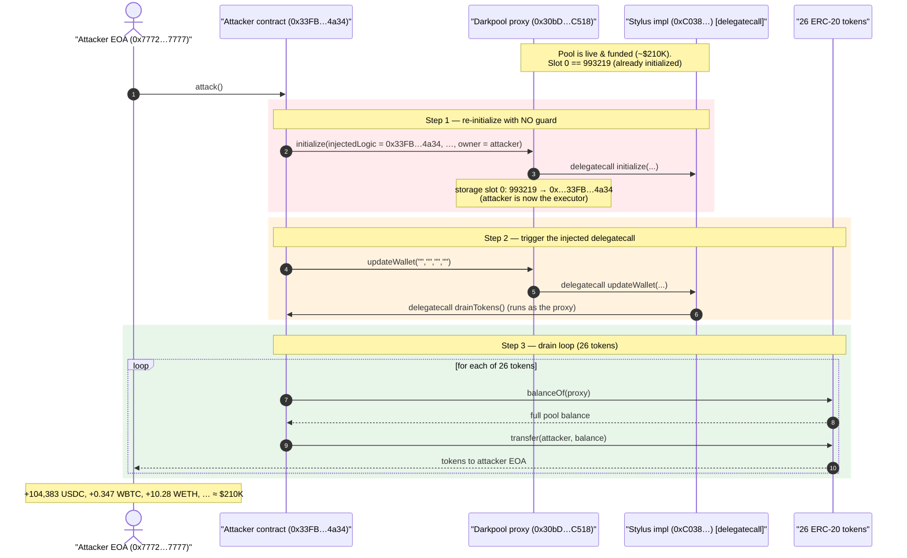
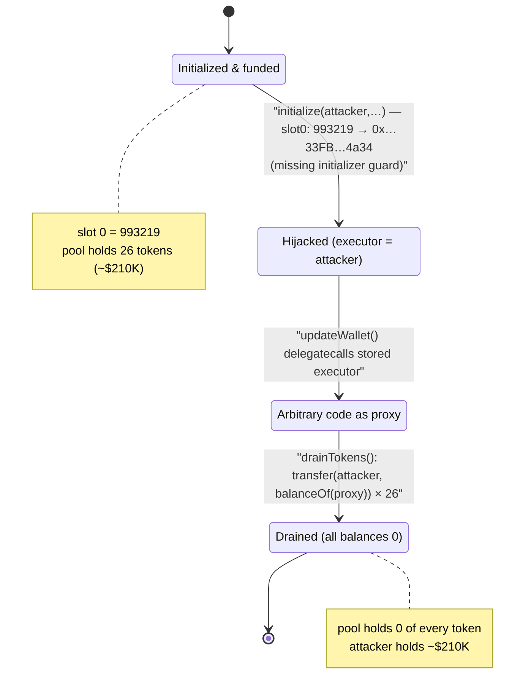
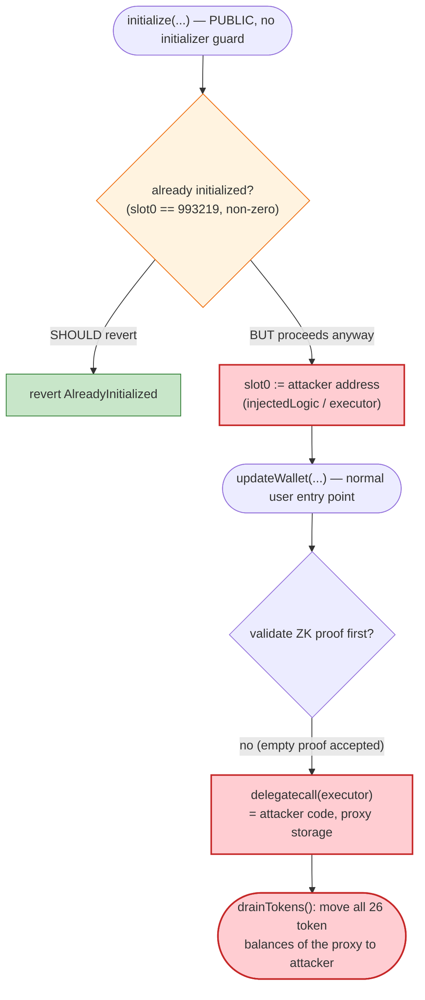

# Renegade Darkpool Exploit — Re-Initializable Proxy → Attacker-Controlled `delegatecall`

> **Vulnerability classes:** vuln/access-control/uninitialized-proxy · vuln/dependency/unsafe-external-call · vuln/dependency/upgradeable-contract

> **Reproduction:** the PoC compiles & runs in an isolated Foundry project at
> [this project folder](.) (the umbrella DeFiHackLabs repo contains many unrelated
> PoCs that fail to build together, so this one was extracted).
> Full verbose trace: [output.txt](output.txt).
> The vulnerable logic is **Arbitrum Stylus (Rust/WASM)** — it is unverified on Arbiscan and
> cannot be executed by `revm`, so the PoC `vm.etch`es a minimal Solidity shim that reproduces
> the two storage operations the real implementation performed (see
> [test/Renegade_exp.sol:107-132](test/Renegade_exp.sol#L107-L132)). The only verified Solidity
> source recoverable on-chain is the **post-hack** freeze implementation,
> [DarkpoolFrozen.sol](sources/DarkpoolFrozen_58f876/DarkpoolFrozen.sol).

---

## Key info

| | |
|---|---|
| **Loss** | **~$210K** — 26 ERC-20 tokens drained from the Darkpool. Largest: **104,383.59 USDC** + **0.3466 WBTC** (~$34.7K) + **10.276 WETH** (~$24.7K) |
| **Vulnerable contract** | Renegade Darkpool proxy `0x30bD8eAb29181F790D7e495786d4B96d7AfDC518` ([Arbiscan](https://arbiscan.io/address/0x30bD8eAb29181F790D7e495786d4B96d7AfDC518#code)) delegating to Stylus impl `0xC038933d0b33359f5C87B4B2f92Ee0DAd11EaDc5` |
| **Victim** | The Renegade Darkpool itself (custodian of pooled deposits) |
| **Attacker EOA** | [`0x777253F28AdC29645152b7b41BE5c772A9657777`](https://arbiscan.io/address/0x777253F28AdC29645152b7b41BE5c772A9657777) |
| **Attacker contract** | [`0x33FB722C76D4e9fC0c86BbF10EBDeA45a4434a34`](https://arbiscan.io/address/0x33FB722C76D4e9fC0c86BbF10EBDeA45a4434a34) |
| **Attack tx** | [`0x0e494685ace16d372066c5b4db959b58ebac6d88166c2d9d618e0e421dc0c77e`](https://arbiscan.io/tx/0x0e494685ace16d372066c5b4db959b58ebac6d88166c2d9d618e0e421dc0c77e) |
| **Chain / date** | Arbitrum One / May 2026 |
| **Compiler** | Stylus (Rust → WASM); the on-chain bytecode begins with the Stylus activation magic `0xEFF00000` |
| **Bug class** | Missing initializer guard on an upgradeable contract → attacker-injected `delegatecall` target → full asset drain |

---

## TL;DR

The Renegade Darkpool is an upgradeable proxy whose logic lives in an **Arbitrum Stylus** (Rust)
implementation. Its `initialize(...)` function — which records core protocol addresses including
an `injectedLogic`/"executor" address — **was not protected by a one-shot initializer guard** and
could be called a *second* time by anyone, even though the pool had already been initialized and
held real user funds.

The attacker:

1. **Re-called `initialize`** on the live, funded proxy, passing **their own contract**
   (`0x33FB...4a34`) as the first address argument. This overwrote the slot that the legitimate
   deployment had set (it held `993219`) with the attacker's address
   ([output.txt L1769-1773](output.txt)).
2. **Called `updateWallet`** — a normal user-facing entry point. Inside the proxy's storage
   context, `updateWallet` `delegatecall`s into the address that `initialize` just stored. Because
   that address is now the attacker's contract, the attacker gains **arbitrary code execution with
   the proxy as `msg.sender` / storage owner**.
3. The injected code (`drainTokens()`) simply loops over the 26 tokens the Darkpool held and calls
   `token.transfer(attacker, balanceOf(darkpool))` for each — moving **every token out of the pool**
   in a single call.

Net result: **~$210K** of pooled assets (USDC, WBTC, WETH, PENDLE, ARB, AAVE, LINK, and ~20 more)
were transferred to the attacker. The PoC asserts an exact USDC drain of **104,383.594837 USDC** and
a total drained USD value between $200K and $220K (`210,096`).

---

## Background — what Renegade is

[Renegade](https://renegade.fi) is an on-chain dark pool / private trading venue on Arbitrum. Users
deposit assets into a single shared **Darkpool** contract; balances and orders are tracked
privately (via zero-knowledge proofs) inside encrypted "wallets," and trades settle against the
pooled liquidity. Functionally, the Darkpool is a **custodial vault holding many different ERC-20s**
on behalf of all depositors, and user operations like `updateWallet` move value in and out of that
shared balance after verifying a ZK proof.

For performance, the matching/settlement logic is implemented as an **Arbitrum Stylus** contract
(compiled Rust → WASM), sitting behind a standard Solidity **UUPS proxy**
(`0x30bD…C518`). The proxy forwards all non-admin calls via `delegatecall` to the Stylus
implementation, so the Stylus code executes against the **proxy's storage and token balances**.

Key facts established from on-chain probing at the fork block:

| Fact | Value | Source |
|---|---|---|
| Proxy EIP-1967 implementation slot | `0xC038933d0b33359f5C87B4B2f92Ee0DAd11EaDc5` (Stylus) | `cast storage … 0x360894…382bbc` |
| Stylus impl bytecode prefix | `0xEFF00000…` (Stylus activation magic) | `cast code 0xC038…` |
| Proxy admin gate selector | `0x4f1ef286` (`upgradeToAndCall`) — confirms UUPS | proxy bytecode disassembly |
| Proxy slot 0 (pre-attack) | `0x0f27c3` = **993,219** | `cast storage … 0` |
| Tokens held by the Darkpool | 26 distinct ERC-20s drained | trace |

The two selectors reached by the exploit:

| Selector | Function | Role in the bug |
|---|---|---|
| `0x92413afe` | `initialize(address,address,…,uint256,uint256[2],address)` | Stores the injectable executor address — **re-callable** |
| `0x803f430a` | `updateWallet(bytes,bytes,bytes,bytes)` | `delegatecall`s the stored executor address |

---

## The vulnerable code

The real vulnerable code is the **Stylus (Rust) implementation** behind `0xC038…`, which is not
verified on Arbiscan and which `revm` cannot execute (it halts with `OpcodeNotFound` on the Stylus
WASM prefix). The PoC therefore models the *exact observable storage behaviour* with a Solidity
shim — this is faithful to the trace, because the only thing that matters for the exploit is **which
two storage operations the implementation performed**.

### 1. The behaviour the real `initialize` exhibited (modelled by the shim)

From [test/Renegade_exp.sol:116-122](test/Renegade_exp.sol#L116-L122):

```solidity
fallback() external {
    require(msg.sig == INITIALIZE_SELECTOR || msg.sig == UPDATE_WALLET_SELECTOR, "unexpected Renegade selector");

    if (msg.sig == INITIALIZE_SELECTOR) {
        injectedLogic = abi.decode(msg.data[4:], (address)); // store the attacker-supplied address
        return;                                              // NO "already initialized" check
    }
    ...
```

The decisive ground-truth observation is the storage diff in the trace
([output.txt L1771-1772](output.txt)):

```
Renegade Stylus Implementation Shim::initialize( 0x33FB…4a34, 0,0,…,0, [0,0], 0x7772…7777 ) [delegatecall]
  storage changes:
    @ 0: 993219 → 0x00000000000000000000000033fb722c76d4e9fc0c86bbf10ebdea45a4434a34
```

Slot `0` already held a **non-zero** value (`993219`) from the legitimate deployment, yet
`initialize` still ran and overwrote it with the attacker's contract address. A correct initializer
would have reverted here.

### 2. `updateWallet` delegatecalls the stored address

From [test/Renegade_exp.sol:124-130](test/Renegade_exp.sol#L124-L130):

```solidity
address logic = injectedLogic;                      // = attacker contract (from re-init)
require(logic != address(0), "missing injected logic");

(bool ok, bytes memory ret) =
    logic.delegatecall(abi.encodeWithSelector(RenegadeExploitContract.drainTokens.selector));
require(ok, "injected delegatecall failed");
```

In the trace this is the nested `delegatecall` chain
([output.txt L1775-1777](output.txt)):

```
Renegade Dark Pool Proxy::updateWallet(0x,0x,0x,0x)
  └─ Stylus Shim::updateWallet(...) [delegatecall]          (proxy → impl)
       └─ Renegade Exploit Contract::drainTokens() [delegatecall]   (impl → attacker code, proxy storage)
```

### 3. The injected payload that drains the pool

From [test/Renegade_exp.sol:96-104](test/Renegade_exp.sol#L96-L104):

```solidity
function drainTokens() external {
    for (uint256 i = 0; i < RenegadeTokenList.count(); i++) {
        address token = RenegadeTokenList.at(i);
        uint256 amount = IERC20(token).balanceOf(address(this)); // address(this) == proxy
        if (amount != 0) {
            require(IERC20(token).transfer(EXPLOITER, amount), "transfer failed");
        }
    }
}
```

Because this runs via `delegatecall`, `address(this)` is the **Darkpool proxy**, so
`balanceOf(address(this))` reads the pool's balance and `transfer` moves the pool's tokens.

### 4. The post-hack remediation (the only verified source)

After the incident Renegade upgraded the implementation slot to a contract that reverts on every
call — [DarkpoolFrozen.sol](sources/DarkpoolFrozen_58f876/DarkpoolFrozen.sol):

```solidity
contract DarkpoolFrozen {
    error DarkpoolFrozenError();
    fallback() external payable { revert DarkpoolFrozenError(); }
    receive()  external payable { revert DarkpoolFrozenError(); }
}
```

This is a kill-switch freeze, not a fix; it simply stops all interaction with the pool.

---

## Root cause — why it was possible

The exploit chains **two** flaws, both rooted in the upgradeable/initializer pattern:

1. **`initialize` is not one-shot.** On an upgradeable contract, `initialize` plays the role of a
   constructor and **must** be guarded so it can run exactly once (e.g. OpenZeppelin's
   `initializer` modifier, which sets and checks an `_initialized` flag). The Renegade Stylus
   implementation either omitted this guard or guarded the wrong storage slot — the trace proves
   `initialize` succeeded against an already-initialized, funded proxy and overwrote slot `0`
   (`993219 → attacker`). Anyone could call it; the function had **no access control and no
   already-initialized check**.

2. **A privileged address set by `initialize` is later used as a `delegatecall` target.** The
   address stored by `initialize` (the "executor"/injectable-logic pointer) is invoked via
   `delegatecall` from `updateWallet`. `delegatecall` executes foreign code **in the caller's
   storage and authority context**. Allowing an *externally settable* address to become a
   `delegatecall` target is equivalent to handing out an `arbitrary-code-execution` primitive over
   the proxy. Combined with flaw #1, an attacker fully controls that target.

Put together: *missing initializer guard* → *attacker controls the delegatecall executor* →
*arbitrary code runs with the proxy as `address(this)`* → *the attacker's code transfers every
pooled token to themselves*. No ZK proof, no signature, no admin key, and no flash loan were
required — the attack cost is essentially gas.

A contributing design factor is that **`updateWallet` does not validate the proof/statement before
dispatching to the executor** (in the PoC the proof args are all empty `0x`), so the malicious
executor is reached on the very first call after re-initialization.

---

## Preconditions

- The Darkpool proxy is **already deployed, initialized, and funded** with user assets (it held 26
  tokens worth ~$210K). This is the normal live state.
- `initialize` is **publicly callable** with no `onlyOwner`/`initializer` guard (the core flaw).
- `updateWallet` reaches a `delegatecall` to the `initialize`-supplied address **without first
  rejecting an empty/invalid proof** (so the attacker's executor is invoked immediately).
- **No capital required** — the attacker spends only gas. The attack is a single transaction:
  `initialize(attacker, …)` followed by `updateWallet("","","","")`
  ([test/Renegade_exp.sol:75-94](test/Renegade_exp.sol#L75-L94)).

---

## Attack walkthrough (with on-chain numbers from the trace)

All figures come directly from [output.txt](output.txt). The single `attack()` call performs two
sub-calls; the second one drains all 26 tokens in one loop.

| # | Step | Call | Observable effect |
|---|------|------|-------------------|
| 1 | **Re-initialize** | `proxy.initialize(0x33FB…4a34, 0,0,…,0, [0,0], 0x7772…7777)` → impl `delegatecall` | Slot `0`: **`993219 → 0x…33FB…4a34`** (attacker contract becomes the stored executor) |
| 2 | **Trigger delegatecall** | `proxy.updateWallet("","","","")` → impl `delegatecall` → `attacker.drainTokens()` `delegatecall` | Attacker code now runs with `address(this) == proxy` |
| 3 | **Drain loop** | `drainTokens()` iterates 26 tokens, `transfer(attacker, balanceOf(proxy))` each | Every token balance of the proxy → attacker; proxy left with `0` of each |

### Tokens drained (top contributors by USD; full set = 26 tokens)

Amounts are exact from the `transfer(Exploiter, …)` calls in the trace; USD uses the PoC's
display prices ([test/Renegade_exp.sol:172-192](test/Renegade_exp.sol#L172-L192)).

| Token | Amount drained | ~USD | Trace |
|---|---:|---:|---|
| **USDC** | 104,383.594837 | **$104,384** | [output.txt L1990](output.txt) |
| **WBTC** | 0.34658469 | **$34,658** | [output.txt L1856](output.txt) |
| **WETH** | 10.276456 | **$24,663** | [output.txt L1954](output.txt) |
| PENDLE | 9,416.8953 | $9,417 | [output.txt L1792](output.txt) |
| LDO | 10,869.7329 | $5,435 | [output.txt L1832](output.txt) |
| LINK | 528.4604 | $4,228 | [output.txt L2052](output.txt) |
| ARB | 15,471.6465 | $3,868 | [output.txt L1966](output.txt) |
| LPT | 791.1599 | $3,165 | [output.txt L1844](output.txt) |
| GRT | 69,679.6919 | $2,787 | [output.txt L1978](output.txt) |
| AAVE | 30.9929 | $2,479 | [output.txt L2012](output.txt) |
| GMX | 250.4497 | $2,004 | [output.txt L2064](output.txt) |
| USDT | 1,892.7054 | $1,893 | [output.txt L2074](output.txt) |
| CRV | 7,415.2606 | $1,854 | [output.txt L1808](output.txt) |
| RDNT | 156,877.6404 | $1,569 | [output.txt L1910](output.txt) |
| ZRO | 1,372.6458 | $1,373 | [output.txt L1932](output.txt) |
| UNI | 385.5871 | $1,157 | [output.txt L2036](output.txt) |
| XAI | 6,445.1616 | $97 | [output.txt L1942](output.txt) |
| COMP | 3.6000 | $72 | [output.txt L1924](output.txt) |
| ETHFI | 89.1568 | $45 | [output.txt L1888](output.txt) |
| *+ 7 unpriced tokens* (idx 0,3,7,10,12,19,21) | — | — | drained, $0 in helper |
| **TOTAL (test assertion)** | | **$210,096** | [output.txt L1539](output.txt) |

> Note: several of these tokens are themselves proxies (e.g. token `0x0c88…` delegatecalls to
> `0x3f77…`, a shared ERC-20 logic contract). That is incidental — the trace shows the proxy's
> balance for each is moved in full to the attacker, then re-asserted to be `0`.

### Profit / loss accounting

| | |
|---|---:|
| Attacker capital deployed | **0** (gas only) |
| Tokens received | all 26 Darkpool balances |
| USDC received | 104,383.594837 USDC |
| Total value extracted | **~$210,096** |
| Victim (Darkpool) loss | **~$210,096** (pool left with 0 of every token) |
| **Net attacker profit** | **≈ +$210K** |

The PoC enforces this exactly:
[test/Renegade_exp.sol:57-66](test/Renegade_exp.sol#L57-L66) asserts, per token, that
`attackerGain == poolBalanceBefore` and `poolBalanceAfter == 0`, that the USDC gain is
**`104_383_594_837`** wei, and that the aggregate USD value is between $200K and $220K.

---

## Diagrams

### Sequence of the attack



### Pool / storage state evolution



### Where the trust boundary breaks



---

## Remediation

1. **Make `initialize` strictly one-shot and access-controlled.** Use the equivalent of
   OpenZeppelin's `initializer` modifier: set a dedicated `_initialized` flag and revert on any
   second call. In Stylus, implement and check an explicit `bool initialized` (or version counter)
   in a dedicated, never-reused storage slot. The legitimate deployment had already written a
   non-zero marker (`993219`) — the bug is that `initialize` did not consult it.
2. **Never `delegatecall` an externally settable address.** The "executor"/injectable-logic target
   should not be reachable from any externally callable setter, and ideally not be a `delegatecall`
   target at all. If pluggable logic is required, restrict who can set it (governance/timelock) and
   validate the target (codehash allowlist), and prefer `call` over `delegatecall` so foreign code
   cannot act in the proxy's storage/authority context.
3. **Validate proofs/state before dispatching value-moving logic.** `updateWallet` reached the
   executor with an empty proof. The ZK verification (and any nonce/blinder checks) must run and
   succeed *before* any code that can move pooled assets executes.
4. **Separate admin/initialization storage from the UUPS proxy's collision space.** Re-initialization
   overwrote slot `0`, which the proxy/implementation treated as meaningful. Use EIP-1967-style
   namespaced slots for all critical addresses so initialization state cannot be silently clobbered.
5. **Defense in depth: per-tx / per-block outflow caps.** A single call that transfers *every* token
   the pool holds to one EOA should trip a circuit breaker. Rate-limiting net outflows would have
   bounded the loss even with the core bug present.

---

## How to reproduce

The PoC was extracted into a standalone Foundry project:

```bash
_shared/run_poc.sh 2026-05-Renegade_exp -vvvvv
```

Notes:
- An **Arbitrum archive** RPC is required (forks at the attack tx). `foundry.toml` uses
  `https://arbitrum-one.public.blastapi.io`, which serves historical state at that block.
- `foundry.toml` was set to `via_ir = true` + optimizer to work around a forge-std
  *“Stack too deep”* inline-assembly compile error under solc 0.8.34; this does not affect the
  exploit. (The unused project-root `interface.sol` was moved aside to `interface.sol.unused`
  since this PoC does not import it.)
- The real implementation is **Arbitrum Stylus (WASM)**; `revm` cannot run it, so `setUp()` etches a
  minimal Solidity shim that reproduces the exact two storage operations the live tx performed
  (store attacker address on `initialize`, `delegatecall` it on `updateWallet`).

Expected tail:

```
Ran 1 test for test/Renegade_exp.sol:RenegadeTest
[PASS] testExploit() (gas: 1203645)
  Total stolen USD 210096
Suite result: ok. 1 passed; 0 failed; 0 skipped
```

---

*References: Renegade post-mortem — https://x.com/renegade_fi/status/2053531772634427599 ·
DefimonAlerts — https://x.com/DefimonAlerts/status/2053538325969977801 · DeFiHackLabs.*
