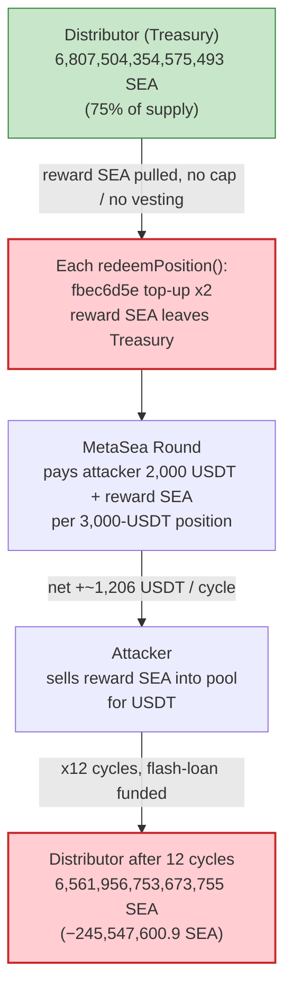

# MetaSea (SEA Token) Exploit — `redeemPosition()` Over-Pays From an Unguarded Reward Distributor

> **Reproduction:** the PoC compiles & runs in an isolated Foundry project at
> [this project folder](.). Full verbose trace:
> [output.txt](output.txt). The vulnerable logic (`MetaSea Round` + `SEA Distributor`)
> is behind **unverified** ERC-1967 proxies, so the analysis below reconstructs it from the
> on-chain execution trace; the verified [SEA token source](sources/SEATokenFinal_3AC330/contracts_upgradeable_SEATokenUpgradeable.sol)
> confirms the tokenomics that make the drain possible.

---

## Key info

| | |
|---|---|
| **Loss** | ~$110K total across the attacker campaign — **this single tx nets 13,904.94 USDT** and drains **245,547,600.9 SEA** (245.5e6 SEA, 6-decimals) from the reward Distributor |
| **Vulnerable contract** | `MetaSea Round` (proxy) — [`0xA70F31c06F921019237Fc00B1417217Dae5c37C5`](https://arbiscan.io/address/0xA70F31c06F921019237Fc00B1417217Dae5c37C5#code) → impl `0x13dDE273B66323686bfb96cCe5a2a7190b40B264` (unverified) |
| **Drained reserve** | `SEA Distributor` (Treasury, 75% of SEA supply) — [`0x5210525fbf63E55ecA1Ade9Ff98A3Ef80AF9220e`](https://arbiscan.io/address/0x5210525fbf63E55ecA1Ade9Ff98A3Ef80AF9220e) → impl `0xd4114eD07FeBC57113158D53266f6eCB71447FBF` (unverified) |
| **Victim pool** | SEA/USDT pair — [`0xEeb9c6B73a9Ba397FBEA320d9E4cCe7B8AC10513`](https://arbiscan.io/address/0xEeb9c6B73a9Ba397FBEA320d9E4cCe7B8AC10513) (token0 = SEA, token1 = USDT) |
| **SEA token** | [`0xE548CF28fbB95cEDC2b5c25a24f9AA8D06dcc0A6`](https://arbiscan.io/address/0xE548CF28fbB95cEDC2b5c25a24f9AA8D06dcc0A6#code) (6 decimals, 10B supply) |
| **USDT** | [`0xFd086bC7CD5C481DCC9C85ebE478A1C0b69FCbb9`](https://arbiscan.io/address/0xFd086bC7CD5C481DCC9C85ebE478A1C0b69FCbb9) (Arbitrum bridged USDT, 6 decimals) |
| **Attacker EOA** | [`0x352173FAbF0E67E1cB1fcdF15474D0477D5D3674`](https://arbiscan.io/address/0x352173fabf0e67e1cb1fcdf15474d0477d5d3674) |
| **Attacker contract** | [`0x32db518e84955739912b6257cc65e3e8374b60e4`](https://arbiscan.io/address/0x32db518e84955739912b6257cc65e3e8374b60e4) (re-deployed as `0x5615…b72f` in the PoC) |
| **Attack tx** | [`0x001cb16e17c4c5a5c4d02423c9e9b2f2b11ab6b2a1baf2ba53b8fcaf06167716`](https://arbiscan.io/tx/0x001cb16e17c4c5a5c4d02423c9e9b2f2b11ab6b2a1baf2ba53b8fcaf06167716) |
| **Chain / date** | Arbitrum One / 2026-05-17 |
| **Compiler** | Round/Distributor/SEA all Solidity v0.8.24, optimizer **200 runs** |
| **Bug class** | Reward-accounting flaw — `redeemPosition()` pays out more value than was deposited, funded from an un-rate-limited shared reserve |

---

## TL;DR

MetaSea is a USDT "IDO / staking round" product. A user calls `openPosition(usdtAmount, …)` to deposit
USDT; the `MetaSea Round` contract buys SEA, records the position, and the user later calls
`redeemPosition()` to take their payout. The payout is funded by the **SEA Distributor**
(the protocol Treasury that holds 75% of the entire SEA supply) via two internal "top-up" hooks
(`fbec6d5e(...)` seen repeatedly in the trace, transferring reward SEA from the Distributor into the
Round).

The flaw: **`redeemPosition()` returns more value than the position cost, and the difference is paid
out of the Distributor's shared reserve without any per-user cap, vesting, or solvency check.** For a
position opened with 3,000 USDT, redeem returns **2,000 USDT directly** plus a large slug of **reward
SEA** that the attacker immediately sells for **another ~2,500 USDT**. Each open→redeem cycle is net
profitable and is bounded only by how much SEA remains in the Distributor.

The attacker:

1. Flash-borrows **3,300 USDT** from Aave V3 ([SEAToken_exp.sol:87](test/SEAToken_exp.sol#L87)).
2. Runs the cycle **12 times** ([:101-103](test/SEAToken_exp.sol#L101-L103)): buy a little SEA → `openPosition(3,000 USDT)` → `redeemPosition()` → dump all received SEA back into the pool for USDT.
3. Each cycle pulls fresh reward SEA out of the Distributor; over 12 cycles **245.5M SEA** is drained and converted to USDT.
4. Repays the flash loan + 0.05% premium and keeps **13,904.94 USDT** profit in this single transaction.

---

## Background — what MetaSea is

The on-chain trace and the SEA token source describe a three-part system:

- **SEA token** ([SEATokenUpgradeable.sol](sources/SEATokenFinal_3AC330/contracts_upgradeable_SEATokenUpgradeable.sol)) — a plain 6-decimal ERC-20, 10,000,000,000 SEA one-time mint, no fee-on-transfer. Its `initializeAndMint` ([:116-159](sources/SEATokenFinal_3AC330/contracts_upgradeable_SEATokenUpgradeable.sol#L116-L159)) sends **75% of supply (`ECOSYSTEM_POOL_RATIO`)** to the `ecosystemPool` / Treasury, explicitly commented as *"生态矿池 75% → Treasury（IDO 奖励、MetaSea 收益来源）"* — i.e. **the source of IDO/redeem rewards** ([:52, :146](sources/SEATokenFinal_3AC330/contracts_upgradeable_SEATokenUpgradeable.sol#L52)). At the fork block the Distributor holds **6,807,504,354,575,493 SEA (~6.81e15 base units ≈ 6.8B SEA)**.
- **SEA Distributor** (Treasury, `0x5210…220e`, unverified impl `0xd4114…7FBF`) — custodies that 75% reserve and exposes internal reward hooks. In the trace, calling selector `fbec6d5e(round, amount)` makes the Distributor **transfer reward SEA to the Round** (e.g. `14,511,923,795,789 SEA`), and `d5442eb3(...)` / `8d56dac5(...)` route burns/treasury accounting.
- **MetaSea Round** (`0xA70F…37C5`, unverified impl `0x13dDE…B264`) — the user-facing position manager:
  - `openPosition(0x987217bc)(usdtAmount, ref)` — pulls USDT, swaps part of it to SEA through a forked Uniswap-V2 router (`0x258B…EDd4`), records the position (`PerformanceUpdated`, `updatePerformance`), and registers the user.
  - `redeemPosition()` — pulls the user's SEA principal back, calls the Distributor top-up (`fbec6d5e`), swaps reward SEA to a **fixed 2,000 USDT** for the user, tops up again, and finally **transfers the leftover reward SEA to the user**.

The SEA/USDT pair is a forked V2 pair (beacon proxy `0xf026…6F20` → impl `0x00Cf…4370`) whose `swap`
routes a small portion of the SEA fee to the Distributor (`treasuryAddress()` = the Distributor) and a
referrer. These fees are incidental; the drain comes from the Round's redeem payout, not the pair fee.

---

## The vulnerable code

The Round and Distributor implementations are **unverified** on Arbiscan, so exact source is not
available. The behavior is reconstructed from the execution trace
([output.txt](output.txt)); each step below cites trace line numbers.

### 1. `openPosition(3,000 USDT)` — records a position whose redeem value exceeds its true cost

```
0x13dDE273…::987217bc(b2d05e00, 0)              // 0xb2d05e00 = 3,000,000,000 = 3,000 USDT
  USDT.transferFrom(attacker → Round, 3,000e6)               // deposit pulled in
  USDT.approve(router, 1,000e6); router.swap 1,000 USDT → SEA into Round
  USDT.approve(router, 2,000e6); router.swap 2,000 USDT → SEA into Round
  … Round forwards part of the SEA to the Distributor / burns part …
  Round.updatePerformance(attacker, 3,000e6)                 // PerformanceUpdated(…, 3,000e6, 3,000e6, 0)
  emit PositionOpened(attacker, 3000e6, 1000e6, 2000e6, …)   // topic 0x5a3815aa…
```
(trace [output.txt:1710-2073](output.txt))

The position-open event encodes three USDT figures: `b2d05e00` = 3,000 (deposit), `3b9aca00` = 1,000,
`77359400` = **2,000** — the **guaranteed USDT redeem value**. The protocol promises 2,000 USDT back
plus a SEA reward on a 3,000-USDT deposit, on the assumption the position is held to maturity and that
the SEA reward is small relative to the Treasury. Neither assumption is enforced.

### 2. `redeemPosition()` — pays out 2,000 USDT + a large reward SEA slug, funded by the Distributor

The first redeem in the trace (a position with SEA principal `1,194,631,646,551`) does the following
([output.txt:2082-2356](output.txt)):

```
0x13dDE273…::redeemPosition()
  SEA.transferFrom(attacker → Round, 1,194,631,646,551)         // pull back SEA principal
  SEA Distributor.fbec6d5e(Round, 0x0d32d210174d)               // ⚠️ TOP-UP: Distributor → Round 14,511,923,795,789 SEA
  router.swapTokensForExactTokens(SEA → 2,000 USDT) → Round     // sell reward SEA for fixed 2,000 USDT
  USDT.transfer(Round → attacker, 2,000e6)                      // ⚠️ pay attacker the fixed 2,000 USDT
  SEA Distributor.fbec6d5e(Round, 0x0f8db0bb95c8)               // ⚠️ TOP-UP again: Distributor → Round 17,101,229,888,968 SEA
  SEA.transfer(Round → attacker, 17,101,229,888,968)            // ⚠️ hand the leftover reward SEA to attacker
  Round.distributeTeamRewards(attacker, 3,000e6); updateInvestment(…)
```

The two `fbec6d5e` calls are the smoking gun: each one moves reward SEA **out of the Distributor's
shared reserve** into the Round, and the Round then forwards both the USDT (from selling the first
slug) and the entire second slug to the redeemer. The redeemer receives **2,000 USDT + 17.1e12 base
SEA**, but only deposited 3,000 USDT (of which just 1,000 went into the protocol's own SEA buy). The
position is net-positive for the user and net-negative for the Treasury.

### 3. SEA token confirms the Treasury is the reward source

```solidity
uint256 public constant ECOSYSTEM_POOL_RATIO = 75;  // 生态矿池 75%
...
uint256 ecosystemAmount = (TOTAL_SUPPLY * ECOSYSTEM_POOL_RATIO) / 100;
_mint(ecosystemPool, ecosystemAmount);              // 7.5B SEA minted to the Distributor/Treasury
whitelist[ecosystemPool] = true;
```
([SEATokenUpgradeable.sol:52, :138, :146, :153](sources/SEATokenFinal_3AC330/contracts_upgradeable_SEATokenUpgradeable.sol#L52))

The Distributor is funded with 75% of all SEA and is the bank behind every redeem. There is **no
per-position cap on how much of it a single user can extract**, so a profitable redeem can simply be
repeated until the Treasury is empty.

---

## Root cause — why it was possible

`redeemPosition()` is the inverse of `openPosition()`, but the two are **not value-symmetric**:

> Opening a position costs the user 3,000 USDT (1,000 of which the protocol uses to buy SEA, the rest
> retained / routed to treasury). Redeeming it returns **2,000 USDT in cash plus a reward of reward-SEA
> pulled fresh from the Distributor** that is worth materially more than the 1,000-USDT shortfall. The
> redeem is therefore a guaranteed-profit operation, and nothing stops it from being run in a tight
> loop within a single block.

Four design decisions compose into the drain:

1. **Redeem payout > deposit cost.** The fixed 2,000-USDT cash-out plus the reward-SEA slug exceeds the
   capital the user actually committed to the protocol. Whatever yield curve was intended, the *net*
   per-cycle value flow to the user is positive at t=0, not at maturity.
2. **Rewards are drawn from a single shared, un-rate-limited reserve.** Every redeem `fbec6d5e`-pulls
   SEA from the Distributor's 75%-of-supply Treasury with no per-user quota, no global daily cap, and
   no solvency assertion. One actor can consume the whole reserve.
3. **No time-lock / vesting on redeem.** A position can be opened and redeemed in the **same
   transaction** (and the same cycle repeated 12× here). Any "stake then earn over time" model is
   defeated because the profit is realized immediately.
4. **Reward sizing is reserve-funded, not deposit-funded.** Because the SEA reward originates from the
   Treasury rather than from the user's own deposit, the protocol's books never balance: the user
   always nets out ahead and the Treasury always nets out behind.

Combined with a flash loan for working capital, these turn a "generous yield" bug into an atomic,
risk-free, fully-drainable exploit.

---

## Preconditions

- The SEA Distributor / Treasury holds a large SEA balance to fund redeems (6.81e15 base units at the
  fork block). The attack stops only when this reserve runs dry.
- `openPosition` and `redeemPosition` are callable by anyone (no KYC/whitelist gate on the attacker
  contract — the trace shows `registerFor(attacker)` happening *inside* `openPosition`).
- Enough USDT to open one position (3,000 USDT). Because every cycle is net-positive intra-transaction,
  the entire working capital is **flash-loanable** — the PoC borrows just **3,300 USDT** from Aave V3
  for all 12 cycles ([SEAToken_exp.sol:74, :87](test/SEAToken_exp.sol#L74)).
- A liquid SEA/USDT pool to (a) buy the small priming SEA and (b) dump the reward SEA back into for
  USDT. The pool itself is **not** the victim — its reserves are roughly conserved; the loss lands on
  the Distributor.

---

## Attack walkthrough (with on-chain numbers from the trace)

The attacker runs `_openAndRedeem()` 12 times inside the Aave flash-loan callback
([SEAToken_exp.sol:101-123](test/SEAToken_exp.sol#L101-L123)). Each cycle does:

1. **Prime**: swap **300 USDT → SEA** out of the pool to the attacker ([:110, :125-131](test/SEAToken_exp.sol#L125-L131)).
2. **Open**: `USDT.approve(Round, 3,000e6)` then `openPosition(3,000e6, 0)` ([:112-114](test/SEAToken_exp.sol#L112-L114)).
3. **Redeem**: `SEA.approve(Round, max)` then `redeemPosition()` — receives **2,000 USDT** + a leftover SEA slug ([:116-117](test/SEAToken_exp.sol#L116-L117)).
4. **Dump**: sell the entire SEA balance (priming SEA + reward SEA) back into the pool for USDT ([:119-122, :133-144](test/SEAToken_exp.sol#L133-L144)).

Numbers below are taken directly from the trace. SEA amounts are in 6-decimal base units (e.g.
`17,101,229,888,968` base units = 17,101,229.89 SEA).

| Cycle | Reward SEA paid to attacker (redeem) | USDT from selling SEA (`swap → Exploit`) | Distributor running balance (base units) |
|------:|-------------------------------------:|-----------------------------------------:|-----------------------------------------:|
| start | — | — | 6,807,504,354,575,493 |
| 1 | 17,101,229,888,968 | ~2,506,180,666 | ↓ |
| 2 | 17,812,774,509,206 | ~2,498,465,325 | ↓ |
| 3 | 18,564,686,377,203 | ~2,490,507,067 | ↓ |
| 4 | 19,359,758,560,037 | ~2,482,296,487 | ↓ |
| 5 | 20,201,002,956,134 | ~2,473,823,841 | ↓ |
| 6 | 21,091,668,350,426 | ~2,465,079,044 | ↓ |
| 7 | 22,035,259,864,057 | ~2,456,051,672 | ↓ |
| 8 | 23,035,559,864,687 | ~2,446,730,970 | ↓ |
| 9 | 24,096,650,394,980 | ~2,437,105,857 | ↓ |
| 10 | 25,222,937,159,566 | ~2,427,164,938 | ↓ |
| 11 | 26,419,175,094,787 | ~2,416,896,529 | ↓ |
| 12 | 27,690,495,523,071 | ~2,406,288,672 | ↓ |
| end | **Σ 262,631,198,543,122** reward SEA¹ | | **6,561,956,753,673,755** |

¹ The reward SEA paid out (262.6e12) exceeds the net Distributor drain (245.5e12) because part of the
reward SEA is re-sold into the pool, and the pool routes a slice of its SEA fee *back* to the
Distributor on each swap. Net Distributor loss = `6,807,504,354,575,493 − 6,561,956,753,673,755 =`
**`245,547,600,901,738`** base units = **245,547,600.90 SEA** — matching the PoC assertion exactly
([SEAToken_exp.sol:59](test/SEAToken_exp.sol#L59), trace [output.txt:2082+](output.txt)).

**Per-cycle USDT economics (cycle 1, approx):**

| Direction | USDT |
|---|---:|
| Spent — prime buy (300 USDT → SEA) | −300.00 |
| Spent — `openPosition` deposit | −3,000.00 |
| Received — `redeemPosition` fixed cash-out | +2,000.00 |
| Received — sell all SEA (prime + reward) back to pool | +~2,506.18 |
| **Net per cycle** | **≈ +1,206 USDT** |

Across 12 cycles the net profit is **13,904,941,068 base USDT = 13,904.94 USDT**, after repaying the
**3,300 USDT** flash loan + **1,650,000** (0.05%) premium.

### Profit accounting (USDT, whole transaction)

| Item | Amount (USDT) |
|---|---:|
| Aave V3 flash loan | 3,300.00 (borrowed, repaid) |
| Flash-loan premium (0.05%) | −1.65 |
| **Net profit delivered to attacker EOA** | **+13,904.94** |
| SEA drained from Distributor (the underlying loss) | 245,547,600.90 SEA |

The PoC asserts both ground-truth figures and passes:
`USDT profit = 13,904,941,068` and `SEA drain = 245,547,600,901,738`
([SEAToken_exp.sol:58-59](test/SEAToken_exp.sol#L58-L59)).

---

## Diagrams

### Sequence of one open→redeem cycle (×12 under one flash loan)

```mermaid
sequenceDiagram
    autonumber
    actor A as "Attacker contract"
    participant AV as "Aave V3 Pool"
    participant P as "SEA/USDT pair"
    participant R as "MetaSea Round"
    participant D as "SEA Distributor (Treasury, 75% supply)"

    A->>AV: "flashLoanSimple(USDT, 3,300e6)"
    AV-->>A: "3,300 USDT + executeOperation()"

    rect rgb(255,243,224)
    Note over A,D: "Repeat 12x inside the callback"
    A->>P: "swap 300 USDT -> ~2e12 SEA (prime)"
    A->>R: "openPosition(3,000 USDT, 0)"
    R->>P: "buy SEA with part of deposit; record position (redeem value = 2,000 USDT)"
    A->>R: "redeemPosition()"
    R->>D: "fbec6d5e(Round, amt)  TOP-UP reward SEA"
    D-->>R: "reward SEA (e.g. 14.5e12)"
    R->>P: "sell reward SEA -> 2,000 USDT"
    R-->>A: "2,000 USDT (fixed cash-out)"
    R->>D: "fbec6d5e(Round, amt2)  TOP-UP again"
    D-->>R: "leftover reward SEA (e.g. 17.1e12)"
    R-->>A: "leftover reward SEA"
    A->>P: "dump all SEA -> ~2,500 USDT"
    end

    A->>AV: "approve + repay 3,301.65 USDT"
    A-->>A: "keep 13,904.94 USDT profit"
```

### Value flow / Treasury drain



### Why redeem is theft: deposit vs. payout asymmetry

```mermaid
stateDiagram-v2
    direction LR
    [*] --> Open
    Open: "openPosition(3,000 USDT)"
    Open --> Recorded: "position redeem value = 2,000 USDT + reward SEA"
    Recorded --> Redeem: "redeemPosition() (same tx allowed)"
    Redeem --> Payout: "pay 2,000 USDT + reward SEA (from Treasury)"
    Payout --> Profit: "user nets +~1,206 USDT; Treasury nets -reward SEA"
    Profit --> Open: "loop until Treasury empty"
    note right of Payout
      Payout value > deposit cost
      Funded from shared reserve
      No per-user cap, no time-lock
    end note
```

---

## Remediation

1. **Make redeem value-conservative.** A position's total payout (cash + reward) must never exceed the
   user's own deposited capital plus *realized* protocol earnings attributable to that position. If the
   intended product is yield-bearing, the reward must accrue from real revenue, not be minted/transferred
   from a static reserve on demand.
2. **Cap and meter the Distributor.** Enforce a per-position and global rate limit on `fbec6d5e`
   top-ups (e.g. daily emission budget, per-user reward ceiling), and add a solvency/over-emission
   assertion so a single actor cannot consume the whole Treasury.
3. **Add vesting / a redeem time-lock.** Disallow opening and redeeming a position in the same block (or
   within the intended lock period). This alone breaks the atomic flash-loan loop.
4. **Decouple reward sizing from manipulable inputs.** The reward SEA slug should be a function of
   elapsed time and committed principal, not of an instantaneous swap-derived quote or a fixed cash-out
   that ignores how the position was funded.
5. **Verify and audit the proxies.** The Round and Distributor implementations are unverified on
   Arbiscan; closed-source reward accounting that pays out of a 75%-of-supply Treasury is exactly the
   kind of logic that must be open and reviewed.

---

## How to reproduce

The PoC was extracted into a standalone Foundry project (the umbrella DeFiHackLabs repo has several
unrelated PoCs that fail to compile under a whole-project `forge test`):

```bash
_shared/run_poc.sh 2026-05-SEAToken_exp -vvvvv
```

- RPC: an **Arbitrum archive** endpoint is required (the PoC forks at the attack tx). `foundry.toml`
  uses `https://arbitrum-one.public.blastapi.io`, which serves historical state at that block.
- Result: `[PASS] testExploit()` with the two ground-truth assertions satisfied.

Expected tail:

```
Ran 1 test for test/SEAToken_exp.sol:SEATokenTest
[PASS] testExploit() (gas: …)
  Stolen SEA 245547600901738
  Profit USDT 13904941068
Suite result: ok. 1 passed; 0 failed; 0 skipped
```

---

*Reference: anomly.rs — https://anomly.rs/metasea-redeemposition-distributor-drain-arb-2026-05-17 (MetaSea / SEA, Arbitrum, ~$110K).*
