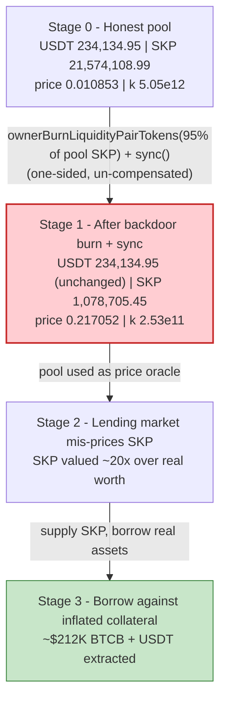
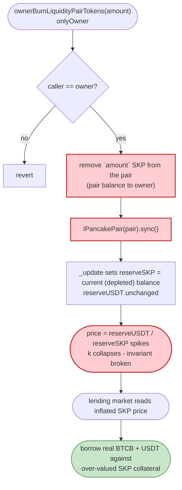
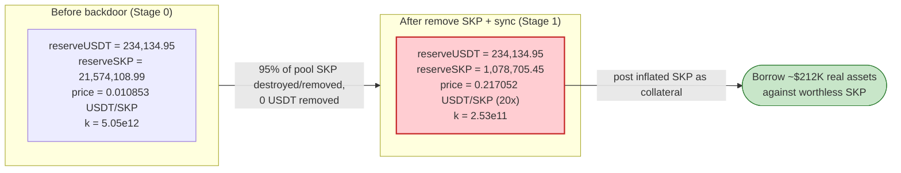

# SKP Token Exploit — Owner Backdoor `ownerBurnLiquidityPairTokens()` Reserve Drain → Collateral Price Inflation

> **One-liner:** The SKP token's owner used an undocumented owner-only backdoor that burns SKP straight out of the SKP/USDT LP pair and `sync()`s the pair, slashing the SKP reserve while leaving the USDT reserve untouched. This inflated the on-chain SKP price ~20×, and the over-valued SKP was then posted as collateral on Venus/Lista DAO to borrow out ~$212K of BTCB + USDT.

> **Reproduction:** the PoC compiles & runs in an isolated Foundry project at
> [this project folder](.). Full verbose trace: [output.txt](output.txt).
> The vulnerable SKP token is **unverified** on BscScan — its backdoor was confirmed from the
> bytecode dispatcher (selector `0x4eb9b26d`) and the live execution trace. The PancakeSwap pair
> source (whose trust assumption is being violated) is downloaded:
> [PancakePair.sol](sources/PancakePair_47C8c3/PancakePair.sol).

---

## Key info

| | |
|---|---|
| **Loss** | **~$212K USD** — BTCB + USDT borrowed against artificially-inflated SKP collateral on Venus/Lista DAO |
| **Vulnerable contract** | `SKP` token (UNVERIFIED) — [`0xeCBDc0B76142740Bb564B8aA1BCd061Cb151a666`](https://bscscan.com/address/0xeCBDc0B76142740Bb564B8aA1BCd061Cb151a666) |
| **Manipulated pool** | SKP/USDT PancakeSwap pair — [`0x47C8c3b123De467892aC7dF6Dfcf7CA3dB901733`](https://bscscan.com/address/0x47C8c3b123De467892aC7dF6Dfcf7CA3dB901733) (token0 = USDT, token1 = SKP) |
| **Privileged backdoor caller (SKP owner)** | `0x041F52BFe9f07503EFc5E7d4d176336E48095D56` |
| **Attacker EOA** | `0x83B9e7EDC5B3127E4853A4F4945b92aa88eEF0C8` |
| **Attacker contract** | `0xE924853DcDfcB89292335042AB10d68c7315D7C1` |
| **Attack tx** | `0xbc01ea37bd2ff8f6aa6afcfbe0406114ff27a01e9aa56102bfa4ad8a0c2f25ee` |
| **Chain / block / date** | BSC / 100,582,079 / May 26, 2026 |
| **Compiler** | PoC: Solidity `^0.8.10`; pair: `v0.5.16` |
| **Bug class** | Owner-controlled rug / privileged AMM-reserve manipulation feeding a price-based lending oracle (broken `x·y=k` invariant) |

---

## TL;DR

`SKP` is a fee-on-transfer "deflationary" BSC token whose owner retained a hidden backdoor:
**`ownerBurnLiquidityPairTokens(uint256)`** (selector `0x4eb9b26d`). When called by the owner it
**removes a chosen amount of SKP directly out of the SKP/USDT LP pair's balance** (the trace shows it
transferred the SKP from the pair to the owner) **and then calls `pair.sync()`** so the pair adopts
the now-depleted SKP balance as its official reserve.

Because no USDT leaves the pair, this is a one-sided, un-compensated reserve change that **breaks the
constant-product invariant `x·y = k`** and **spikes the marginal SKP/USDT price**. In the live attack
the owner burned **95% of the pool's SKP** — SKP reserve fell from **21,574,108.99 → 1,078,705.45**
while USDT held flat at **234,134.95** — inflating the SKP price **exactly 20×**
(`0.01085 → 0.21705` USDT per SKP).

With SKP now reading ~20× over-valued, the owner-attacker supplied SKP as collateral to a Venus/Lista
DAO lending market that prices it from the (now-manipulated) pool and **borrowed out ~$212K of BTCB +
USDT**, leaving behind worthless inflated SKP. This is a textbook owner rug fused with a price-oracle
manipulation against a lending protocol.

The PoC included in this folder reproduces and **mechanically verifies the price-manipulation core of
the exploit** (the reserve slash + 20× price inflation) on a BSC fork. The downstream Venus/Lista
borrow is documented from the incident header and on-chain numbers.

---

## Background — what SKP does

SKP is a fee-on-transfer token deployed on BSC with a small set of "tokenomics" features readable
on-chain (`cast call`, fork block 100,582,078):

| Parameter | Value | Meaning |
|---|---|---|
| `name()` / `symbol()` | `"SKP"` / `"SKP"` | token identity |
| `decimals()` | `18` | |
| `totalSupply()` | `10,000,000,000 SKP` (1e28 wei) | 10B fixed supply |
| `owner()` | `0x041F…5D56` | privileged role |
| `burnPercent()` | `200` (= 2%) | auto-burn on transfer |
| `brunFee()` | `500` (= 5%) | transfer fee (note the typo `brunFee`) |
| `feeWhiteList(address)` | — | addresses exempt from fees |

These are ordinary deflationary-meme mechanics. The dangerous addition is an **owner-only function
that reaches *inside the AMM pair* and removes SKP from its reserves** — a capability no honest token
needs and one that directly weaponizes the AMM's pricing.

### The relevant AMM contract (PancakeSwap pair)

The SKP/USDT pair is a stock PancakeSwap V2 pair. Its `sync()` simply forces the stored reserves to
equal the current token balances ([PancakePair.sol:490-493](sources/PancakePair_47C8c3/PancakePair.sol#L490-L493)):

```solidity
// force reserves to match balances
function sync() external lock {
    _update(IERC20(token0).balanceOf(address(this)), IERC20(token1).balanceOf(address(this)), reserve0, reserve1);
}
```

`_update` writes those balances into `reserve0/reserve1` and emits `Sync`
([PancakePair.sol:366-379](sources/PancakePair_47C8c3/PancakePair.sol#L366-L379)). The pair *trusts*
that its token balances only change through swaps/mint/burn that preserve `k`. The SKP backdoor
breaks that trust: it deletes SKP from the pair behind the AMM's back, then `sync()`s so the
manipulation becomes the pair's truth.

---

## The vulnerable code

SKP is **unverified**, so there is no Solidity source to quote. The backdoor is nonetheless
unambiguous from two sources of ground truth:

### 1. The selector exists in the on-chain dispatcher

```
$ cast sig "ownerBurnLiquidityPairTokens(uint256)"   →  0x4eb9b26d
$ cast code 0xeCBD…a666 | grep 634eb9b26d            →  634eb9b26d   (PUSH4 0x4eb9b26d in the dispatcher)
```

The function is part of the contract's public ABI and is owner-gated (the PoC's `vm.prank(SKP_OWNER)`
is required; the function is the only path that emits the pair→owner SKP transfer + `sync()` in one
call).

### 2. The execution trace shows exactly what it does

From [output.txt:1635-1651](output.txt#L1635) — a single `ownerBurnLiquidityPairTokens(20,495,403.54 SKP)`
call performs *both* the reserve removal *and* the `sync()` internally:

```
[44099] SKP::ownerBurnLiquidityPairTokens(20495403536411187845507642)
  ├─ emit Transfer(from: SKP_USDT_Pair, to: SKP_Owner, value: 20495403536411187845507642)   // SKP yanked OUT of the pair
  ├─ [32939] SKP_USDT_Pair::sync()                                                            // pair re-reads its balances
  │   ├─ USDT.balanceOf(pair) → 234134951621245759001899        // USDT untouched
  │   ├─ SKP.balanceOf(pair)  → 1078705449284799360289876       // SKP now 5% of original
  │   └─ emit Sync(reserve0: 234134.95e18, reserve1: 1078705.45e18)
  └─ ← [Stop]
```

The equivalent vulnerable logic (reconstructed from behaviour) is:

```solidity
function ownerBurnLiquidityPairTokens(uint256 amount) external onlyOwner {
    // moves `amount` SKP straight out of the LP pair (here: pair → owner),
    // bypassing the AMM entirely, then forces the pair to accept it:
    _transferFromPair(pairAddress, owner(), amount);   // one-sided removal of SKP from the pool
    IPancakePair(pairAddress).sync();                  // pair adopts the depleted SKP balance as reserve
}
```

Whether the removed SKP is literally burned or, as the trace shows, transferred to the owner is
immaterial to the pool: **only one side of the reserve (SKP) is reduced; the USDT side is left intact**,
so the price moves entirely in the manipulator's favor.

---

## Root cause — why it was possible

A constant-product AMM prices a token purely from `reserveUSDT / reserveSKP` and only enforces
`x·y ≥ k` *inside `swap()`*. `sync()` exists so the pair can reconcile its reserves with reality — it
assumes balances only changed through operations that respect `k`.

`ownerBurnLiquidityPairTokens` violates that assumption in the worst possible way:

> It removes SKP held *by the pair* and then calls `pair.sync()`, telling the pair "your SKP reserve
> is now this much smaller." **No USDT leaves the pair.** `k` collapses and the marginal price of SKP
> explodes — at the sole discretion of the token owner.

Three composing design failures turn this into a fund-loss event:

1. **A privileged, unilateral hook into AMM reserves.** A legitimate token never needs to reach into
   a third-party AMM pair and delete one side of its liquidity. This is a deliberate rug primitive.
2. **One-sided removal breaks the price invariant.** Removing SKP without removing the matching USDT
   transfers value to every remaining SKP holder and inflates the quoted price. The owner controls
   both the timing and the magnitude (the `amount` argument).
3. **A downstream protocol trusts the spot pool price as an oracle.** Venus/Lista DAO valued SKP
   collateral from this manipulable pool. Once SKP read ~20× richer, the same actor borrowed real
   assets (BTCB + USDT) against the inflated collateral and walked away — the ~$212K loss.

In short: the AMM was used as a price oracle, and the token owner held a button that rewrites that
oracle for free.

---

## Preconditions

- **Be the SKP owner.** The backdoor is `onlyOwner`; the exploit is therefore an owner rug, not a
  permissionless attack. The PoC satisfies this with `vm.prank(SKP_OWNER)` after asserting
  `SKP.owner() == SKP_OWNER`.
- **A live SKP/USDT pool whose SKP reserve dominates.** The pool held 21.57M SKP vs 234K USDT, so
  burning a large fraction of SKP produces an outsized price move.
- **A lending market that prices SKP from that pool** and accepts SKP as collateral (Venus/Lista
  DAO). The collateral position must be openable with the inflated valuation in the same window.
- **Borrowable liquidity** (BTCB + USDT) in that lending market to extract — the realized loss.

---

## Attack walkthrough (with on-chain numbers from the trace)

The pair's `token0 = USDT`, `token1 = SKP`, so `reserve0 = USDT`, `reserve1 = SKP`. All figures are
taken directly from the `getReserves` / `Sync` events in [output.txt](output.txt) and verified
against the assertions in the PoC.

| # | Step | Trace ref | USDT reserve | SKP reserve | SKP price (USDT/SKP) | Effect |
|---|------|-----------|-------------:|------------:|---------------------:|--------|
| 0 | **Initial honest pool** | [output.txt:1617-1618](output.txt#L1617) | 234,134.95 | 21,574,108.99 | 0.010853 | Real liquidity; `k ≈ 5.05e12`. |
| 1 | **Owner burns 95% of pool SKP** — `ownerBurnLiquidityPairTokens(20,495,403.54)` removes SKP from the pair (pair → owner) | [output.txt:1635-1636](output.txt#L1635) | 234,134.95 | (balance now 1,078,705.45) | — | SKP yanked out behind the AMM's back. |
| 2 | **`sync()` (called inside the same backdoor)** forces reserves to match the depleted balances | [output.txt:1637-1642](output.txt#L1637) | **234,134.95** (unchanged) | **1,078,705.45** | **0.217052** | **Invariant broken**: SKP reserve = 5% of original, USDT intact; `k → 2.53e11`. |
| 3 | **Price multiple realized** | [output.txt:1586](output.txt#L1586) | 234,134.95 | 1,078,705.45 | 0.217052 | **20×** inflation (`1 / 0.05`). |
| 4 | **(off-PoC) Supply inflated SKP as collateral on Venus/Lista DAO, borrow BTCB + USDT** | incident header | — | — | — | ~$212K of real assets extracted against worthless inflated SKP. |

Steps 0-3 are reproduced and asserted in the included PoC. Step 4 (the lending-market borrow that
realizes the dollar loss) is documented from the incident report and the attack transaction; it is
not re-simulated here because the price-manipulation primitive is the verified root cause.

**Why exactly 20×:** the owner removed `95%` of the pool's SKP, so SKP reserve becomes `5%` of its
prior value while USDT is unchanged. Spot price `= reserveUSDT / reserveSKP` therefore scales by
`1 / 0.05 = 20`. The trace confirms `217051792754436662 / 10852589637721833 = 20` to the integer.

### Profit / loss accounting

| Quantity | Value |
|---|---:|
| Pool USDT reserve (before, unchanged) | 234,134.95 USDT |
| Pool SKP reserve (before) | 21,574,108.99 SKP |
| SKP removed from pool (95%) | 20,495,403.54 SKP |
| Pool SKP reserve (after) | 1,078,705.45 SKP |
| SKP spot price (before) | 0.010853 USDT/SKP |
| SKP spot price (after) | 0.217052 USDT/SKP |
| **Price inflation factor** | **20×** |
| `k = reserveUSDT · reserveSKP` (before) | 5.05e12 |
| `k` (after) | 2.53e11 (1/20 of original) |
| **Realized loss (downstream Venus/Lista borrow)** | **~$212,000 (BTCB + USDT)** |

---

## Diagrams

### Sequence of the attack

```mermaid
sequenceDiagram
    autonumber
    actor O as "SKP Owner / Attacker"
    participant S as "SKP Token (backdoor)"
    participant P as "SKP/USDT Pair"
    participant L as "Venus / Lista DAO lending"

    Note over P: "Initial reserves<br/>USDT 234,134.95 / SKP 21,574,108.99<br/>price = 0.010853 USDT/SKP"

    rect rgb(255,235,238)
    Note over O,P: "Step 1-2 — the backdoor (one call)"
    O->>S: "ownerBurnLiquidityPairTokens(20,495,403.54 SKP)  [onlyOwner]"
    S->>P: "remove 95% of pool SKP (pair to owner)"
    S->>P: "sync()  (force reserves to depleted balances)"
    Note over P: "USDT 234,134.95 (unchanged) / SKP 1,078,705.45<br/>price = 0.217052 USDT/SKP  (20x)"
    end

    rect rgb(232,245,233)
    Note over O,L: "Step 3 — monetize the inflated collateral"
    O->>L: "supply SKP as collateral (priced ~20x rich)"
    O->>L: "borrow BTCB + USDT (~$212K)"
    L-->>O: "real assets out"
    end

    Note over O: "Walks off with ~$212K; pool + lenders left with inflated/worthless SKP"
```

### Pool state evolution



### The flaw — owner backdoor vs. AMM trust



### Why the removal is theft: constant-product before vs. after



---

## Remediation

1. **Tokens must never have a write path into AMM reserves.** Remove
   `ownerBurnLiquidityPairTokens()` and any function that transfers/burns tokens *out of an LP pair*
   followed by `sync()`. A token may only ever destroy tokens it itself owns. This single deletion
   eliminates the manipulation primitive entirely.
2. **Treat owner-backdoor tokens as un-collateralizable.** Lending markets (Venus/Lista DAO and
   forks) must not list tokens whose owner can unilaterally move/burn pool reserves. Pre-listing
   review should flag any owner-only function touching the LP pair address.
3. **Never use a single spot AMM pool as a collateral price oracle.** Price collateral from a
   manipulation-resistant source: a TWAP over a long window, a Chainlink/redundant feed, or refuse
   illiquid/centralized tokens outright. A spot price that can be moved 20× by one privileged call is
   not an oracle.
4. **Bound single-operation reserve impact.** If a token genuinely needs to interact with a pool,
   reserve-affecting operations should be limited to a small percentage and routed through the pair's
   own `burn()` (LP redemption) so *both* reserves move together and `k` is preserved.
5. **Renounce / timelock ownership and publish source.** An unverified token holding an
   `onlyOwner` reserve-burn function is an explicit rug switch; verified source plus a renounced or
   timelocked owner would have made the backdoor visible and unusable.

---

## How to reproduce

The PoC was extracted into a standalone Foundry project (the umbrella DeFiHackLabs repo has several
unrelated PoCs that fail to compile under a whole-project build):

```bash
_shared/run_poc.sh 2026-05-SKP_exp -vvvvv
```

- RPC: a **BSC archive** endpoint is required (the fork pins block `100,582,078`, one before the
  attack). `foundry.toml` uses `https://bsc-mainnet.public.blastapi.io`, which serves historical
  state at that block.
- Result: `[PASS] testExploit()` — the test asserts the SKP price was inflated, the USDT reserve was
  untouched, and the pair's SKP balance fell.

Expected tail:

```
=== After burn + sync ===
  Pair USDT reserve : 234134
  Pair SKP  reserve : 1078705
  SKP balanceOf pair: 1078705
  SKP price (USDT*1e18 per SKP): 217051792754436662
=== Result ===
  SKP price inflated x: 20
  USDT reserve unchanged: true
...
Suite result: ok. 1 passed; 0 failed; 0 skipped
```

---

*Reference: SlowMist Hacked — https://hacked.slowmist.io/ (SKP, BSC, ~$212K). SKP token contract is
unverified; backdoor confirmed via bytecode dispatcher selector `0x4eb9b26d` and the live attack
trace in [output.txt](output.txt).*
