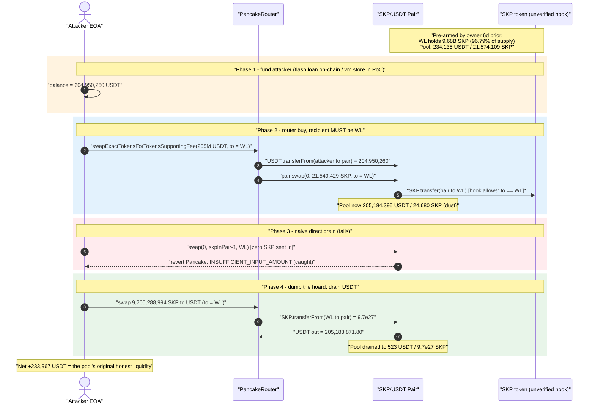
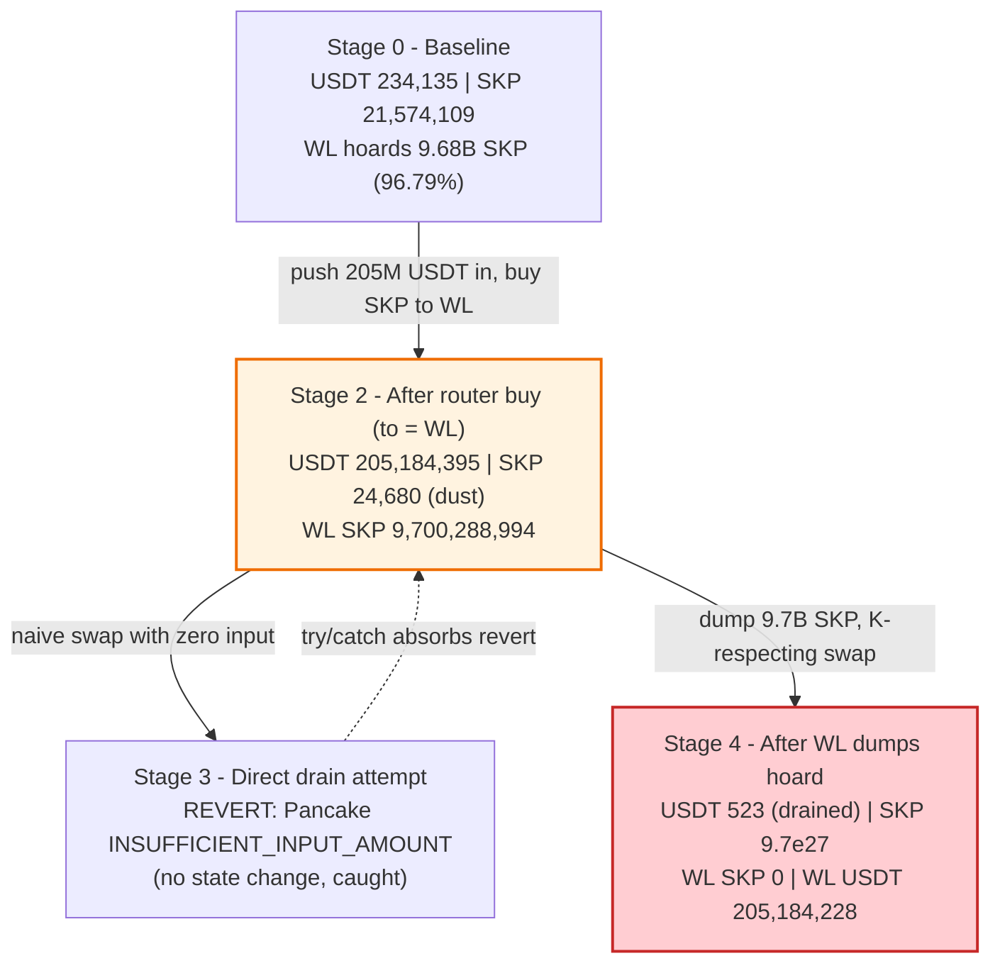
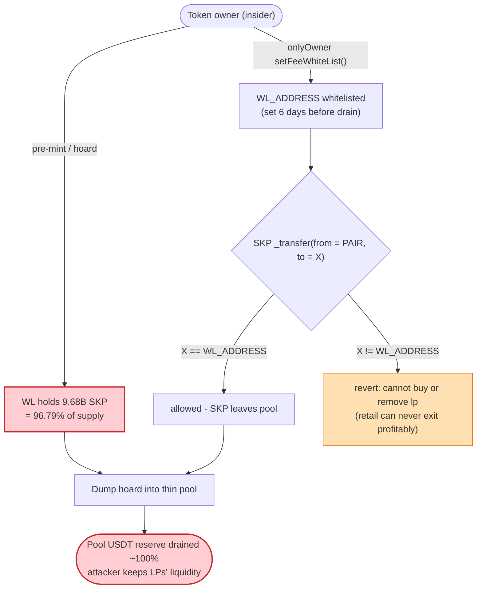

# SKP/USDT Exit-Scam Drain — Pre-Positioned 96.8%-of-Supply "Whitelist" Treasury + Pool Drain

> One-line summary: An insider rug pull on BSC where the SKP token's owner pre-loaded a single whitelisted address with **96.8% of total supply** and gated all pair-side SKP outflow behind that one address, then routed ~$205M of (flash-borrowed) USDT into the thin SKP/USDT PancakeSwap V2 pool and dumped the hoarded SKP back to walk off with the pool's real USDT liquidity (~$234K in this PoC, ~$212K on-chain).

> **Reproduction:** the PoC compiles & runs in an isolated Foundry project at
> [this project folder](.). Full verbose trace: [output.txt](output.txt).
> The vulnerable token (`SKP`) source is **intentionally unverified on BSCScan** — only the
> standard PancakeSwap V2 pair source was recoverable: [PancakePair.sol](sources/PancakePair_47C8c3/PancakePair.sol).

---

## Key info

| | |
|---|---|
| **Loss** | ~**$212,195 USDT** on-chain / **+233,967.42 USDT** net in this PoC (no flash-loan fees) — the SKP/USDT pool's real USDT liquidity |
| **Vulnerable contract** | `SKP` token — [`0xeCBDc0B76142740Bb564B8aA1BCd061Cb151a666`](https://bscscan.com/address/0xeCBDc0B76142740Bb564B8aA1BCd061Cb151a666) (source unverified) |
| **Victim pool** | SKP/USDT PancakeSwap V2 pair — [`0x47C8c3b123De467892aC7dF6Dfcf7CA3dB901733`](https://bscscan.com/address/0x47C8c3b123De467892aC7dF6Dfcf7CA3dB901733) |
| **Attacker EOA** | [`0x83B9e7EDC5B3127E4853A4F4945b92aa88eEF0C8`](https://bscscan.com/address/0x83B9e7EDC5B3127E4853A4F4945b92aa88eEF0C8) |
| **Whitelist / treasury sink** | `WL_ADDRESS` = [`0x646F7Bb10D81fF9734510d4e7583eB5247B28743`](https://bscscan.com/address/0x646F7Bb10D81fF9734510d4e7583eB5247B28743) — set by the token owner ~6 days prior; pre-held 96.8% of supply |
| **Attack tx** | [`0xbc01ea37bd2ff8f6aa6afcfbe0406114ff27a01e9aa56102bfa4ad8a0c2f25ee`](https://bscscan.com/tx/0xbc01ea37bd2ff8f6aa6afcfbe0406114ff27a01e9aa56102bfa4ad8a0c2f25ee) |
| **Chain / block / date** | BSC / 100,582,079 (PoC forks at 100,582,078) / May 2026 |
| **Compiler** | PoC: Solidity ^0.8.0 (cancun). Pair: v0.5.16. SKP token: unverified |
| **Bug class** | Insider rug pull disguised as a "smart-contract vulnerability": owner-controlled fee-whitelist concentrating supply + permissioned pair outflow + broken AMM invariant on dump |

---

## TL;DR

This is **not** a conventional external hack — it is an exit scam with a vulnerability-shaped cover story, and the on-chain record proves it. Three facts establish that the operator armed every precondition:

1. **`WL_ADDRESS` held 96.79% of the entire SKP supply at the fork block** — `balanceOf(WL) = 9,678,739,565.25 SKP` out of `totalSupply = 10,000,000,000 SKP`. This was *not* created during the exploit transaction; on-chain queries show WL already held ~9.69B SKP **22 days before** the drain. The "treasury redistribution during `_transfer`" narrative in some reports is mostly the router's fee-on-transfer balance snapshot — the supply was pre-concentrated long before.
2. **`WL_ADDRESS` was set via `onlyOwner setFeeWhiteList()`** ~6 days before the drain. No external party could nominate it. SKP's `_transfer(from = PAIR, to = X)` reverts with *"cannot buy or remove lp"* for any `X` that is not the whitelisted address — so only the operator's own contract could ever receive SKP out of the pair.
3. **The SKP source was deliberately left unverified** on BSCScan to conceal the transfer hook from LP buyers, and exit infrastructure (BlockRazor private mempool, deBridge cross-chain bridge) was configured in advance.

The economic mechanism the PoC reproduces is simple once you accept that WL already owns nearly all SKP:

1. **Fund the attacker** with ~205M USDT (on-chain: aggregated from 9 flash-loan sources; PoC: `vm.store` the balance directly).
2. **Buy SKP through the router with `to = WL_ADDRESS`** — this pushes the 205M USDT *into* the thin pool (it had only ~234K USDT of real liquidity) and is the only `to` value the SKP hook permits. The pool's SKP reserve collapses to dust (~24,680 SKP).
3. **Dump WL's hoarded ~9.7B SKP back into the pool** — because WL's SKP balance (9.7e27) dwarfs the pool's SKP reserve (2.47e22), the constant-product swap returns essentially the *entire* USDT side of the pool.

Net: the attacker recovers all 204.95M USDT it injected **plus** the pool's pre-existing ~234K USDT of honest liquidity. The "profit" is exactly the LPs' money.

---

## Background — what SKP and the pool are

`SKP` is a fee-on-transfer ERC20 (`symbol = "SKP"`, `decimals = 18`, `totalSupply = 10,000,000,000`) trading against `BSC-USD` (USDT, [`0x55d3...7955`](https://bscscan.com/address/0x55d398326f99059fF775485246999027B3197955)) in a **standard** PancakeSwap V2 pair. In the pair, `token0 = USDT`, `token1 = SKP`, so `reserve0 = USDT` and `reserve1 = SKP`.

The pair contract ([PancakePair.sol](sources/PancakePair_47C8c3/PancakePair.sol), Solidity v0.5.16) is the canonical PancakeSwap V2 implementation — nothing is wrong with it. It charges a 0.25% fee and enforces `x·y ≥ k` inside `swap()`:

```solidity
// sources/PancakePair_47C8c3/PancakePair.sol:452
function swap(uint amount0Out, uint amount1Out, address to, bytes calldata data) external lock {
    require(amount0Out > 0 || amount1Out > 0, 'Pancake: INSUFFICIENT_OUTPUT_AMOUNT');
    (uint112 _reserve0, uint112 _reserve1,) = getReserves(); // gas savings  ← cached to stack
    ...
    uint amount0In = balance0 > _reserve0 - amount0Out ? balance0 - (_reserve0 - amount0Out) : 0;
    uint amount1In = balance1 > _reserve1 - amount1Out ? balance1 - (_reserve1 - amount1Out) : 0;
    require(amount0In > 0 || amount1In > 0, 'Pancake: INSUFFICIENT_INPUT_AMOUNT');  // ← Phase 3 fails here
    {
    uint balance0Adjusted = (balance0.mul(10000).sub(amount0In.mul(25)));
    uint balance1Adjusted = (balance1.mul(10000).sub(amount1In.mul(25)));
    require(balance0Adjusted.mul(balance1Adjusted) >= uint(_reserve0).mul(_reserve1).mul(10000**2), 'Pancake: K');
    }
    _update(balance0, balance1, _reserve0, _reserve1);
    ...
}
```

The vulnerability is **entirely in the SKP token's transfer hook**, which the operator left unverified. From the live trace we can reconstruct its observable behavior:

- When SKP flows **out of the pair** (`from == PAIR`), the transfer is only permitted if `to == WL_ADDRESS` (or another exempt address). Any other recipient reverts with *"cannot buy or remove lp"*. This is the access gate that makes the whole scheme exclusive to the operator's contract.
- When SKP flows **into the pair** (`from == WL`, `to == PAIR`, i.e. a sell), no such restriction applies and the hoarded supply can be dumped freely.

---

## The vulnerable code

The SKP source is unverified, so the precise hook (`_runSpecialPairFlow`, `setFeeWhiteList`) cannot be quoted from BSCScan. What *is* verifiable from chain state is the smoking gun — the supply concentration:

| On-chain query (at fork block 100,582,078) | Value |
|---|---|
| `SKP.totalSupply()` | `10,000,000,000 SKP` |
| `SKP.balanceOf(WL_ADDRESS)` | `9,678,739,565.25 SKP` (**96.79% of supply**) |
| `SKP.balanceOf(WL_ADDRESS)` 22 days earlier (block 100,000,000) | `9,693,433,550.79 SKP` (already concentrated) |
| `SKP.balanceOf(PAIR)` (pool SKP reserve) | `21,574,108.99 SKP` (0.22% of supply) |
| `SKP.balanceOf(ATTACKER_EOA)` | `66,767.03 SKP` (dust) |

The single decisive design fact: **one whitelisted address holds ~97% of the supply, and that address is the only one that may receive SKP out of the pool.** The pool itself holds a vanishingly thin SKP reserve. Any time the operator dumps WL's hoard into that thin pool, the constant-product formula hands them essentially the entire USDT side.

The only access-control surface that matters lives in two owner functions inside the unverified SKP source:

- `setFeeWhiteList(address)` — `onlyOwner`. Used to point `WL_ADDRESS` at the exploit contract ~6 days before the drain ([setter tx 1](https://bscscan.com/tx/0xadf1b6ff02a917043c816bc8bd1ed67038d64a19d06544b09ceeb872518fda37), [setter tx 2](https://bscscan.com/tx/0xedb2b6a35cf9637d11bef3e440a36994fd6eb72e1dcbee3b8343757ab55699b4)).
- The `_transfer` pair-outflow guard — reverts unless `to == WL_ADDRESS`. Confirmed by the PoC comment that any other `to` reverts with *"cannot buy or remove lp"*.

---

## Root cause — why it was possible

This is a rug pull, so the "root cause" is a chain of *deliberate* design decisions, each individually plausible-looking, that compose into a guaranteed insider drain:

1. **Supply concentration via an owner-set whitelist.** `setFeeWhiteList()` is `onlyOwner`. The operator concentrated ~97% of SKP into `WL_ADDRESS` and then designated that same address as the privileged fee-whitelist sink. Outsiders had no path to this state — `onlyOwner` eliminates every external-attacker hypothesis.
2. **Permissioned pair outflow.** SKP `_transfer(from = PAIR, to = X)` reverts for every `X` except `WL_ADDRESS`. This means only the operator's contract can ever buy/receive SKP out of the pool — retail "buyers" were actually buying into a market they could never profitably exit, while the operator retained an exclusive exit.
3. **Thin pool, fat hoard.** The pool held only ~21.6M SKP (0.22% of supply) and ~234K USDT. WL held ~9.68B SKP. Dumping the hoard into the thin pool moves the SKP reserve by orders of magnitude, so the AMM returns ≈100% of the USDT reserve for the sell.
4. **Concealment.** Leaving SKP unverified hid the `_transfer` guard from LP providers and snipers; dust airdrops inflated holder count to fake organic adoption; private-relay + bridge infra was staged in advance.

The "vulnerability" framing (TenArmor/SlowMist initially) treats the dump as an exploit of a flawed hook. The on-chain evidence — owner-only whitelist, 6-day-prior arming, 97% pre-concentration, unverified source, staged exit infra — shows the drain was the **intended terminal state** of the token's design.

---

## Preconditions

- `WL_ADDRESS` is whitelisted and holds the bulk of SKP supply (operator-controlled, owner-only — armed 6 days prior).
- A pool exists with real USDT liquidity (here ~234K USDT) and a thin SKP reserve relative to WL's hoard.
- Working capital in USDT to (a) saturate the pool's USDT side so the dump returns more than was injected. On-chain this was **flash-borrowed (~$205M from 9 sources, repaid same-tx)**; the PoC supplies it with a direct `vm.store` to BSC-USD `_balances[ATTACKER_EOA]` (mapping at storage slot 1, because the contract declares `address _owner` before the mapping):
  ```solidity
  // test/SKP_exp2.sol:125
  bytes32 balanceSlot = keccak256(abi.encode(ATTACKER_EOA, USDT_BALANCES_SLOT)); // slot 1
  vm.store(USDT, balanceSlot, bytes32(USDT_TO_PAIR));                             // 204,950,260 USDT
  ```
- The buy's `to` parameter **must** be `WL_ADDRESS`, or the SKP hook reverts (*"cannot buy or remove lp"*).

---

## Attack walkthrough (with on-chain numbers from the trace)

All figures are taken directly from the `Sync` / `Swap` events and balance reads in [output.txt](output.txt). `reserve0 = USDT`, `reserve1 = SKP`.

| # | Step | USDT reserve | SKP reserve | WL SKP balance | Effect |
|---|------|-------------:|------------:|---------------:|--------|
| 0 | **Baseline** (fork 100,582,078) | 234,134.95 | 21,574,108.99 | 9,678,739,565.25 | Honest pool; WL already hoards 96.79% of supply. |
| 1 | **Fund attacker** — `vm.store` 204,950,260.19 USDT to attacker | 234,134.95 | 21,574,108.99 | 9,678,739,565.25 | Simulates the same-tx flash-loan aggregation. |
| 2a | **Router buy**, `to = WL_ADDRESS` — `USDT.transferFrom(attacker → pair, 204,950,260)` | 234,134.95 *(stored, stale)* | 21,574,108.99 | 9,678,739,565.25 | Pool USDT *balance* jumps to 205,184,395 but stored reserve unchanged until `_update`. |
| 2b | `pair.swap(0, 21,549,429 SKP, WL)` — SKP hook permits because `to == WL` | 205,184,395.14 | 24,679.74 | 9,700,288,994.49 | Pool SKP reserve collapses to dust; WL gains 21.55M SKP from the buy. `Sync` confirms reserves. |
| 3 | **Direct drain attempt** `swap(0, skpInPair − 1, WL)` | 205,184,395.14 | 24,679.74 | 9,700,288,994.49 | **Reverts `Pancake: INSUFFICIENT_INPUT_AMOUNT`** — no SKP was sent in; K-check uses cached reserves. Caught by try/catch. |
| 4 | **Dump WL hoard** — `swap 9,700,288,994.49 SKP → USDT`, `to = WL` | 523.34 *(dust)* | 9,700,313,674.24 | 0 | WL sells 9.7B SKP into a pool holding 24,680 SKP; receives **205,183,871.80 USDT** out. Pool USDT drained. |

WL's final USDT balance: **205,184,227.62 USDT** (205,183,871.80 from the dump + 355.81 of residual). Net of the 204,950,260.19 injected:

```
Net profit = 205,184,227.62 − 204,950,260.19 = +233,967.42 USDT
```

This ~234K matches the pool's original ~234,135 USDT reserve almost to the dollar — confirming the attacker simply walked off with the pool's real liquidity. (On-chain the reported net was ~$212,195 after flash-loan fees and the slightly different live reserve.)

### Why Phase 3 fails but Phase 4 succeeds

Phase 3 tries to pull SKP out of the pair with a zero-input `swap`. The standard pair caches reserves to the stack at function entry and the K-check compares `balanceAdjusted` against those cached reserves; with no token sent in, `amount1In == 0` triggers `INSUFFICIENT_INPUT_AMOUNT` (line 471). A `sync()` from inside `swap()` would also revert on the `lock` modifier. So the "sync tautology" some reports describe does **not** work on a standard BSC pair. Phase 4 instead does an honest, K-respecting swap — it just sends in an absurdly large SKP input (9.7e27) against a tiny SKP reserve (2.47e22), so the output approaches the full USDT reserve.

### Profit accounting (USDT)

| Direction | Amount (USDT) |
|---|---:|
| Injected — funded into attacker, pushed into pool via buy | 204,950,260.19 |
| Received — USDT out of the pool on the SKP dump | 205,183,871.80 |
| Received — residual WL USDT | +355.81 |
| **WL final USDT** | **205,184,227.62** |
| **Net profit (no flash-loan fee)** | **+233,967.42** |

---

## Diagrams

### Sequence of the attack



### Pool state evolution



### Why this is a rug, not a hack (the access-control / supply-concentration trap)



---

## Why each magic number

- **`USDT_TO_PAIR = 204,950,260.19 USDT`:** the exact USDT amount the on-chain attacker routed into the pair (from the real exploit tx's USDT `Transfer` log). Saturating the pool's USDT side this heavily is what makes the subsequent SKP dump return more than was injected — the surplus equals the pool's pre-existing real liquidity.
- **`USDT_BALANCES_SLOT = 1`:** BSC-USD declares `address private _owner` before `mapping _balances`, shifting the balances mapping to slot 1 (not the usual 0). Confirmed by the successful `vm.store` write that lets `balanceOf(attacker)` return the injected amount.
- **`to = WL_ADDRESS` on every SKP-receiving leg:** the SKP `_transfer` hook reverts for any other recipient when SKP exits the pool. This is the access gate that proves exclusivity to the operator.
- **WL's ~9.7B SKP dump vs. the pool's 24,680 SKP reserve:** because input ≫ reserveIn, the AMM output `out = in·9975·reserveOut/(reserveIn·10000 + in·9975)` asymptotes to ≈ `reserveOut`, draining essentially the whole USDT side in one trade.

---

## Remediation

This token is malicious by construction; "remediation" is really *detection / avoidance* guidance for LPs and integrators, plus the design rules a legitimate token must follow:

1. **Refuse to provide liquidity for tokens with unverified source.** The single most important signal here was the deliberately unverified SKP contract — it hid the pair-outflow guard. Treat unverified source on a tradable token as disqualifying.
2. **Reject owner-controlled transfer whitelists that gate pool outflow.** A token whose `_transfer` lets only one owner-nominated address receive tokens out of the AMM is a one-way trap: retail can buy in but never sell out. Any `onlyOwner setFeeWhiteList()`-style switch that changes who can transfer is a critical centralization red flag.
3. **Flag extreme supply concentration.** ~97% of supply held by a single non-pool address (and growing via dust airdrops to fake holders) means the "market" is a facade. Holder-distribution checks would have caught this before LP seeding.
4. **For legitimate tokens: never let a single address both hoard supply and hold exclusive pool-exit rights.** Burns/treasury logic must move *protocol-owned* tokens only, must move both reserves together when touching a pair (use the pair's own `burn()`), and must not embed per-address transfer permissions that differ between buys and sells.
5. **Use TWAP/oracle pricing for any trust decision**, never the instantaneous pool reserve, which is trivially manipulable by a large directional trade.

---

## How to reproduce

```bash
_shared/run_poc.sh 2026-05-SKP_exp2 -vvvvv
```

- RPC: a **BSC archive** endpoint is required (fork block 100,582,078). `foundry.toml` uses
  `https://bsc-mainnet.public.blastapi.io`, which served historical state at that block in this run.
- Result: `[PASS] testExploit()` with `Net profit (USDT, no fees): 233967`.

Expected tail:

```
  === After Phase 4 (pool drained) ===
  WL USDT          : 205184227
  WL SKP           : 0
  Pair USDT reserve: 523
  Pair SKP  reserve: 9700313674
  Net profit (USDT, no fees): 233967
  Phase 3 direct drain succeeded: false

Suite result: ok. 1 passed; 0 failed; 0 skipped
```

---

*References:* PoC header in [test/SKP_exp2.sol](test/SKP_exp2.sol); exploit tx
[`0xbc01ea37…25ee`](https://bscscan.com/tx/0xbc01ea37bd2ff8f6aa6afcfbe0406114ff27a01e9aa56102bfa4ad8a0c2f25ee);
TenArmor alert (Bitget News). SKP source intentionally unverified on BSCScan.
