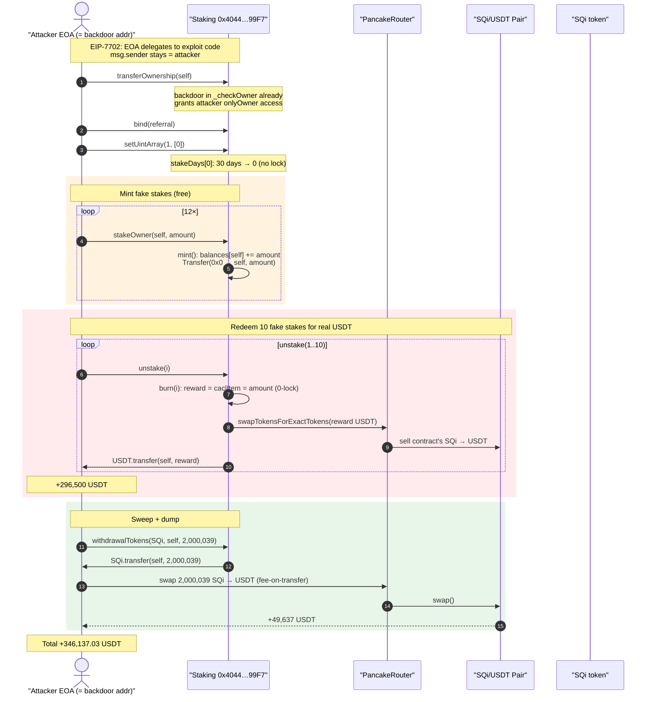
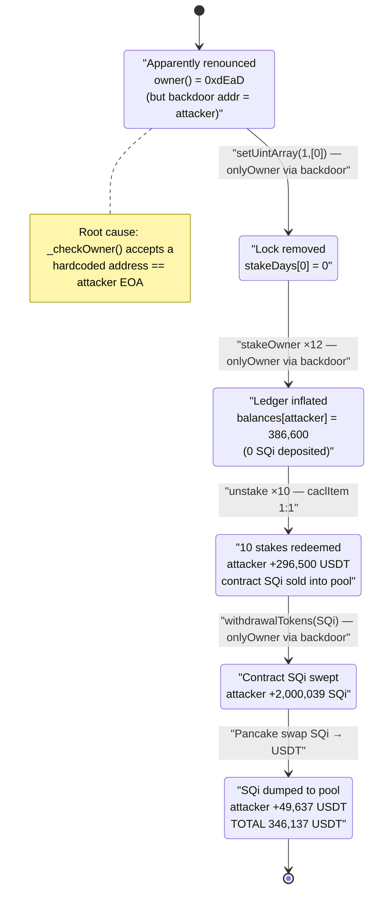
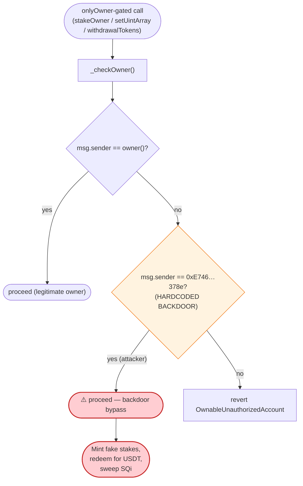

# SQ Token Staking Exploit — Hardcoded Owner Backdoor + Self-Minting Staking Rewards

> **Vulnerability classes:** vuln/access-control/missing-auth · vuln/access-control/centralization · vuln/logic/missing-validation

> One-line: The staking contract's `onlyOwner` check contains a **hardcoded backdoor address** equal to the attacker's EOA, letting the attacker mint fake stake records out of thin air and redeem them for the pool's real USDT — then drain the contract's SQi balance and dump it. Net **~$346.1K USDT**.

> **Reproduction:** the PoC compiles & runs in an isolated Foundry project at
> [this project folder](.) (the umbrella DeFiHackLabs repo contains several
> unrelated PoCs that do not compile together, so this one was extracted).
> Full verbose trace: [output.txt](output.txt).
> Verified vulnerable source: [sources/Staking_404404/Staking.sol](sources/Staking_404404/Staking.sol).

---

## Key info

| | |
|---|---|
| **Loss** | **~$346.1K — 346,137.03 USDT** drained from the staking contract and its SQi/USDT pool |
| **Vulnerable contract** | `Staking` — [`0x404404A845FFF0201f3a4D419B4839fC419c99F7`](https://bscscan.com/address/0x404404A845FFF0201f3a4D419B4839fC419c99F7#code) |
| **Token** | `SQi` — [`0xC7D2FAb3E1f81f3c8FB1669a2f9dff647eaEA3E9`](https://bscscan.com/address/0xC7D2FAb3E1f81f3c8FB1669a2f9dff647eaEA3E9) (fee-on-transfer ERC20) |
| **Victim pool** | SQi/USDT PancakeSwap V2 pair — `0x56b681876B7a6Df313e34aD4Efc74146A75EA51e` |
| **Attacker EOA** | `0xE746c9043Aa0106853c5e4380A9A307Fe385378e` ← **also the hardcoded backdoor address** |
| **Attack contract** | `0x0ECADd99B6A2f5b18a9e05c29074471A5970dd0D` (EIP-7702 delegate code for the EOA) |
| **Attack tx** | [`0x1bae633eda9b3d98999ea116bc403712eaa07093ec32bd6d559085cc4607f5b8`](https://bscscan.com/tx/0x1bae633eda9b3d98999ea116bc403712eaa07093ec32bd6d559085cc4607f5b8) |
| **Chain / date** | BSC / 2026-05 (forked at the attack tx) |
| **Compiler** | Solidity `v0.8.24+commit.e11b9ed9`, optimizer **200 runs** |
| **Bug class** | Hardcoded access-control backdoor → privileged self-minting → un-backed reward redemption |

---

## TL;DR

`Staking` is an `Ownable`-derived staking/MLM contract. Its `_checkOwner()` was *modified* away from the
standard OpenZeppelin implementation to add a second, **hardcoded** address that always passes the owner
check ([Staking.sol:95-99](sources/Staking_404404/Staking.sol#L95-L99)):

```solidity
function _checkOwner() internal view virtual {
    if (owner() != _msgSender() && _msgSender() != 0xE746c9043Aa0106853c5e4380A9A307Fe385378e) {
        revert OwnableUnauthorizedAccount(_msgSender());
    }
}
```

That hardcoded address is **exactly the attacker's EOA**. Although the contract's nominal `owner()` was
`0x...dEaD` (ownership "burned"), the backdoor grants the attacker the full `onlyOwner` surface forever.
The attacker used it to:

1. **`transferOwnership(self)`** — purely cosmetic; the backdoor already grants access, but this makes the
   attacker the canonical owner too.
2. **`setUintArray(1, [0])`** — set `stakeDays[0] = 0`, removing the lock period so stakes can be redeemed
   in the same block ([Staking.sol:5529-5538](sources/Staking_404404/Staking.sol#L5529-L5538)).
3. **`stakeOwner(self, amount, …)` × 12** — an `onlyOwner` function that **mints arbitrary stake records**
   crediting the attacker `amount` of internal "staked value" *for free*
   ([Staking.sol:6194-6208](sources/Staking_404404/Staking.sol#L6194-L6208)).
4. **`unstake(1..10)` × 10** — redeems those fake records. With a 0-day lock, `caclItem` returns the staked
   amount 1:1 ([Staking.sol:5805](sources/Staking_404404/Staking.sol#L5805)); `unstake` then **buys exactly
   that many USDT from the SQi/USDT pool using the contract's own SQi and pays it to the attacker**
   ([Staking.sol:5826-5884](sources/Staking_404404/Staking.sol#L5826-L5884)) → **296,500 USDT**.
5. **`withdrawalTokens(SQi, self, 2,000,039 SQi)`** — an `onlyOwner` escape hatch that transfers the
   contract's entire remaining SQi balance to the attacker
   ([Staking.sol:6287-6298](sources/Staking_404404/Staking.sol#L6287-L6298)).
6. **Dump the 2,000,039 SQi → USDT** on Pancake → **+49,637 USDT**.

Total walk-off: **296,500 + 49,637 = 346,137.03 USDT**.

---

## Background — what the protocol does

`Staking` ([source](sources/Staking_404404/Staking.sol)) is a yield/referral ("MLM") staking system built on top
of the `SQi` token:

- **Internal staked-value ledger.** Staking does **not** custody the user's SQi as a balance; instead it keeps an
  internal `balances`/`totalSupply` ledger and a per-user array of `Record { stakeTime, amount, status, stakeIndex }`
  ([Staking.sol:5471](sources/Staking_404404/Staking.sol#L5471)). `mint()` adds a record and increments the ledger
  ([Staking.sol:5734-5771](sources/Staking_404404/Staking.sol#L5734-L5771)).
- **USDT-denominated rewards.** On `unstake`, the per-record accrual `caclItem(r)` is computed and the contract
  **acquires that exact amount of USDT** by swapping its own SQi into the SQi/USDT pool, then pays the user
  ([Staking.sol:5826-5884](sources/Staking_404404/Staking.sol#L5826-L5884)). So the staked "amount" is effectively
  treated as a USD figure that the contract honors with real USDT.
- **Owner controls.** `stakeOwner` (mint a stake for any user), `setUintArray` (set lock days/level thresholds),
  `withdrawalTokens`/`withdrawalETH` (sweep any token/ETH out), and others are gated by `onlyOwner`.
- **`SQi` is fee-on-transfer.** Every SQi transfer skims a tax (burn + node fees), which is why the final 2.0M-SQi
  dump nets fewer USDT than a frictionless swap would.

On-chain facts at the fork block (from the trace):

| Fact | Value |
|---|---|
| Nominal `owner()` of Staking | `0x...000dEaD` (slot 0 = `0xdead`) |
| **Hardcoded backdoor in `_checkOwner`** | `0xE746c9043Aa0106853c5e4380A9A307Fe385378e` (= attacker EOA) |
| Staking contract SQi balance (pre-attack) | ≈ **2,000,039 SQi** |
| SQi/USDT pair reserves (mid-attack, unstake #1) | ≈ 390,639 USDT / 1,580,985 SQi |
| `stakeDays[0]` default | `30 days` (attacker reset to `0`) |

The whole attack hinges on one fact: the attacker's own address is wired into the access-control check.

---

## The vulnerable code

### 1. The hardcoded owner backdoor (root cause)

[Staking.sol:95-99](sources/Staking_404404/Staking.sol#L95-L99):

```solidity
function _checkOwner() internal view virtual {
    if (owner() != _msgSender() && _msgSender() != 0xE746c9043Aa0106853c5e4380A9A307Fe385378e) {
        revert OwnableUnauthorizedAccount(_msgSender());
    }
}
```

This is a tampered OpenZeppelin `Ownable`. The canonical implementation is just
`if (owner() != _msgSender()) revert ...`. The injected `&& _msgSender() != 0xE746…378e` clause means **that one
address passes every `onlyOwner` gate**, regardless of who the real owner is. It is the attacker EOA — a planted
backdoor (rug-style / malicious deployment).

### 2. Owner can mint stake records for free — `stakeOwner`

[Staking.sol:6194-6208](sources/Staking_404404/Staking.sol#L6194-L6208):

```solidity
function stakeOwner(address _user, uint160 _amount, uint40 _time) external onlyOwner {
    if (!IReferral(conf.referral()).isBindReferral(_user))
        revert("Please bind your superior first");
    uint8 _stakeIndex = 0;
    mint(_user, _amount, _stakeIndex, _time);   // ← credits _amount of staked value, no SQi pulled in
    emit OwnerStake(_user, _amount, _stakeIndex, uint40(block.timestamp));
}
```

`mint` ([Staking.sol:5734-5771](sources/Staking_404404/Staking.sol#L5734-L5771)) takes **no token in** — it just
pushes a `Record` and bumps `totalSupply`/`balances`. The owner can fabricate any amount of redeemable stake.

### 3. Redemption pays real USDT, valued 1:1 with a 0-day lock — `unstake` / `caclItem`

[Staking.sol:5826-5884](sources/Staking_404404/Staking.sol#L5826-L5884):

```solidity
function unstake(uint256 index) external onlyEOA returns (uint256) {
    if (userStakeRecord[msg.sender].length < index + 2)
        revert("Insufficient stake count");
    (uint256 reward, uint256 stake_amount) = burn(index);          // reward = caclItem(record)
    ...
    V2Router.swapTokensForExactTokens(reward, tokenBefore, path, address(this), block.timestamp + 60);
    ...                                                            // buy EXACTLY `reward` USDT with contract SQi
    uint256 _value = amount_usdt - referral_fee - team_fee - additional_fee;
    USDT.safeTransfer(msg.sender, _value);                          // pay the attacker
    IToken(conf.token()).recycle(amount_token);
    return reward;
}
```

[Staking.sol:5793-5811](sources/Staking_404404/Staking.sol#L5793-L5811):

```solidity
function caclItem(Record storage user_record) private view returns (uint256 reward) {
    ...
    stake_period = IMath.min40(stake_period, uint40(stakeDays[user_record.stakeIndex]));
    if (stake_period == 0) return UD60x18.unwrap(stake_amount);   // ← 0-day lock ⇒ reward == staked amount
    ...
}
```

With `stakeDays[0] = 0` (set via `setUintArray`), `stake_period` is clamped to `0`, so the reward is simply the
staked amount. Fabricated stake → guaranteed equal USDT payout.

### 4. The lock-removal lever — `setUintArray`

[Staking.sol:5529-5538](sources/Staking_404404/Staking.sol#L5529-L5538):

```solidity
function setUintArray(uint8 _type, uint256[] calldata _values) external onlyOwner {
    if (_type == 0 || _type > 3) revert InvalidIndex();
    if (_type == 1) stakeDays = _values;            // attacker: stakeDays = [0]
    ...
}
```

### 5. The sweep — `withdrawalTokens`

[Staking.sol:6287-6298](sources/Staking_404404/Staking.sol#L6287-L6298):

```solidity
function withdrawalTokens(address _token, address _recipient, uint256 _amount) external onlyOwner {
    if (IERC20(_token).balanceOf(address(this)) < _amount) revert InsufficientBalance();
    IERC20(_token).safeTransfer(_recipient, _amount);              // sweep ALL remaining SQi
    emit WithdrawalTokens(_token, _recipient, _amount);
}
```

---

## Root cause — why it was possible

The decisive flaw is a **planted access-control backdoor**. `_checkOwner()` was rewritten to accept a second
hardcoded address that happens to be the attacker's own EOA. Everything else is just the attacker exercising the
owner-only surface that the backdoor unlocked:

1. **Backdoored authorization.** Burning ownership to `0xdEaD` looks decentralized/renounced on-chain, but the
   `&& _msgSender() != 0xE746…378e` escape clause means the deployer kept a master key the whole time. This is
   the single point of failure — no amount of correct staking math would help once one address is god.
2. **Owner can create value from nothing.** `stakeOwner` → `mint` credits redeemable "staked value" with **zero
   token input**. There is no invariant tying the internal ledger to actual SQi deposited.
3. **Redeemed value is honored in real USDT.** `unstake` converts the fabricated stake into USDT by selling the
   contract's own SQi into the pool and forwarding the proceeds. The protocol's USDT (sitting in the pool /
   sourced from the pool) backs records that were never funded.
4. **Owner can also just sweep the vault.** `withdrawalTokens` is an unconditional `onlyOwner` token drain, so any
   SQi the redemption path didn't already consume is taken directly.
5. **0-lock toggle.** `setUintArray(1,[0])` makes the redemption instantaneous so the entire sequence fits in one
   transaction.

In short: the contract is not "exploited" so much as **operated by its hidden master key**. The backdoor turns a
seemingly renounced staking protocol into a personal withdrawal facility.

---

## Preconditions

- The caller is the **hardcoded backdoor address** `0xE746…378e` (the attacker), so all `onlyOwner` checks pass.
  In the live tx this is achieved by the attacker EOA itself; the PoC uses **EIP-7702** (`vm.attachDelegation`) to
  give the EOA the exploit-contract code while keeping `msg.sender == tx.origin == attacker`
  ([SQTokenStaking_exp.sol:44-55](test/SQTokenStaking_exp.sol#L44-L55)).
- A referral must be bound for the staked `_user` (`stakeOwner` requires `isBindReferral`), satisfied via
  `bind(REFERRAL)` ([SQTokenStaking_exp.sol:76](test/SQTokenStaking_exp.sol#L76)).
- The SQi/USDT pool holds enough USDT/SQi to source the rewards (it did: ~390K USDT mid-attack).
- No working capital is required from the attacker — every USDT comes out of the protocol/pool. Net cost ≈ gas.

---

## Attack walkthrough (with on-chain numbers from the trace)

All figures are taken directly from [output.txt](output.txt). The internal staked "amount" is denominated such that
each `unstake` pays out that many **USDT**.

| # | Step | Call | Result |
|---|------|------|--------|
| 0 | Attacker EOA delegates to exploit code (EIP-7702) | `vm.attachDelegation` | `msg.sender = attacker` for all calls |
| 1 | Take ownership (cosmetic; backdoor already grants access) | `transferOwnership(self)` | `owner` 0xdEaD → attacker |
| 2 | Approve router for SQi | `SQi.approve(router, max)` | — |
| 3 | Bind a referral (required by `stakeOwner`) | `bind(0x36E1…1a6B)` | `isBindReferral = true` |
| 4 | **Remove lock period** | `setUintArray(1, [0])` | `stakeDays[0]: 0x278d00 (30d) → 0` |
| 5 | **Mint 12 fake stakes** (free) totaling 386,600 "USD" | `stakeOwner(self, A, …)` ×12 | amounts: 90k,90k,70k,55k,42k,14k,9k,7.5k,4k,3k,2k,0.1k |
| 6 | **Redeem 10 of them for USDT** | `unstake(1..10)` ×10 | pays 90k+70k+55k+42k+14k+9k+7.5k+4k+3k+2k = **296,500 USDT** |
| 7 | **Sweep remaining contract SQi** | `withdrawalTokens(SQi, self, 2,000,039.4 SQi)` | attacker SQi balance += 2,000,039 |
| 8 | **Dump SQi → USDT** (fee-on-transfer) | `swapExactTokensForTokensSupportingFeeOnTransferTokens(2,000,039 SQi → USDT)` | **+49,637.03 USDT** |
| 9 | Final attacker USDT | — | **346,137.03 USDT** |

Notes from the trace:
- Each `stakeOwner` emits `Transfer(0x0 → attacker, amount)` and `OwnerStake` — pure ledger mint, no SQi in.
- Each `unstake(i)` emits `Transfer(attacker → 0x0, amount)` + `RewardPaid(attacker, amount, …, i)`, then the contract
  runs `swapTokensForExactTokens(amount, …)` against the SQi/USDT pair and `USDT.safeTransfer(attacker, _value)`.
  For index 1 the contract spent **474,473 SQi** to obtain **90,000 USDT**, then `recycle`d the SQi.
- Twelve stakes were minted but only ten redeemed: `unstake` requires `userStakeRecord.length >= index + 2`
  ([Staking.sol:5827](sources/Staking_404404/Staking.sol#L5827)) and `burn` swap-pops records
  ([`_removeAtUnordered`, Staking.sol:6239-6246](sources/Staking_404404/Staking.sol#L6239-L6246)), so two extra
  records are kept as a buffer.
- The final SQi dump pays SQi transfer-fees (multiple `Transfer` skims to `0x4F0D…`, `0xdEaD`, node, SQi itself) and
  triggers `PriceDeviationGuard`/`TranserFeeLog`, which is why 2.0M SQi nets only 49,637 USDT.

### Profit accounting (USDT)

| Source | Amount (USDT) |
|---|---:|
| `unstake(1)` reward | 90,000 |
| `unstake(2)` reward | 70,000 |
| `unstake(3)` reward | 55,000 |
| `unstake(4)` reward | 42,000 |
| `unstake(5)` reward | 14,000 |
| `unstake(6)` reward | 9,000 |
| `unstake(7)` reward | 7,500 |
| `unstake(8)` reward | 4,000 |
| `unstake(9)` reward | 3,000 |
| `unstake(10)` reward | 2,000 |
| **Subtotal — fabricated-stake redemptions** | **296,500.00** |
| Final SQi (2,000,039.4) dump → USDT | 49,637.03 |
| **Total stolen** | **346,137.03** |

Attacker outlay: ~0 (no capital injected; only gas). The PoC asserts the exact figure
`346_137_034_345_014_454_603_094` wei USDT.

---

## Diagrams

### Sequence of the attack



### Contract value / state evolution



### The flaw inside `_checkOwner`



---

## Remediation

1. **Remove the hardcoded backdoor.** `_checkOwner()` must be the canonical
   `if (owner() != _msgSender()) revert OwnableUnauthorizedAccount(_msgSender());` with **no** additional address.
   A single hardcoded privileged address is a planted master key and is fatal regardless of the rest of the logic.
   Treat any deviation from a stock `Ownable`/`AccessControl` as a critical finding in review.
2. **Back internal stake value with real deposits.** `stakeOwner`/`mint` must not credit redeemable value without a
   matching token transfer in. Maintain an invariant: total redeemable USDT-value ≤ assets actually held/escrowed.
   An owner "grant stake" function, if needed at all, must be funded.
3. **Don't let a single role both mint stakes and sweep the treasury.** Separate roles (timelocked multisig for
   parameter changes, no unilateral `withdrawalTokens` over user funds), and add per-period caps.
4. **Cap and timelock parameter changes.** `setUintArray` allowing `stakeDays = [0]` instantly is dangerous; bound
   lock periods to a sane minimum and timelock changes.
5. **Reward solvency check.** `unstake` should verify the contract can pay rewards from genuinely escrowed reserves,
   not by selling token inventory into its own price pool on demand.
6. **Verify "renounced" claims.** On-chain `owner() == dEaD` is meaningless if access control is custom. Auditors
   and users should diff custom access modifiers against the canonical library byte-for-byte.

---

## How to reproduce

The PoC was extracted into a standalone Foundry project (the umbrella DeFiHackLabs repo has several unrelated PoCs
that fail to compile under a whole-project build):

```bash
_shared/run_poc.sh 2026-05-SQTokenStaking_exp -vvvvv
```

- Requires a **BSC archive** endpoint (the fork pins the attack tx block). `foundry.toml` uses
  `https://bsc-mainnet.public.blastapi.io`, which serves historical state at that block.
- `evm_version = 'cancun'` is required because the PoC uses **EIP-7702** (`vm.attachDelegation`) to give the attacker
  EOA the exploit-contract code while preserving `msg.sender == attacker` — necessary so the hardcoded backdoor check
  matches.
- Result: `[PASS] testExploit()` and the asserted profit `346137034345014454603094` wei (346,137.03 USDT).

Expected tail:

```
Ran 1 test for test/SQTokenStaking_exp.sol:SQTokenStakingTest
[PASS] testExploit() (gas: 5372767)
  Stolen USDT 346137034345014454603094
Suite result: ok. 1 passed; 0 failed; 0 skipped
```

---

*Reference: DeFiHackLabs SQTokenStaking PoC; Twitter analysis: https://x.com/Defi_Nerd_sec/status/2054425936746148148*
