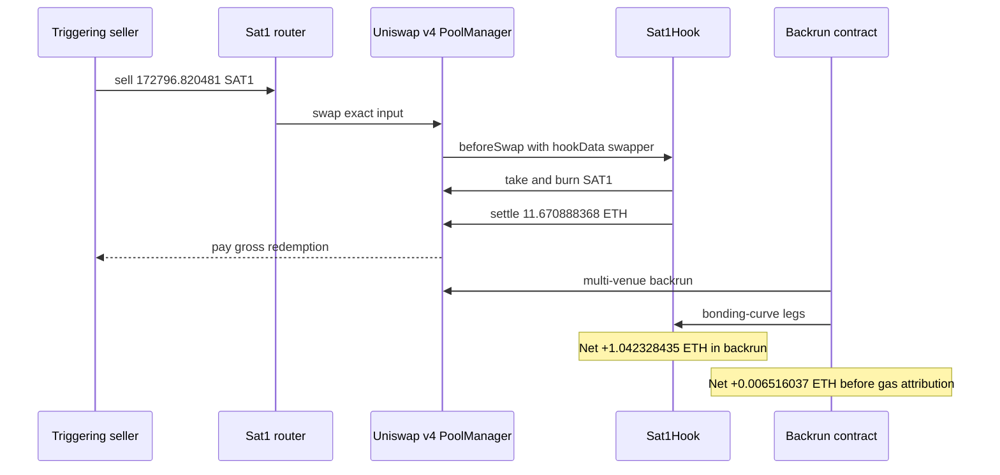
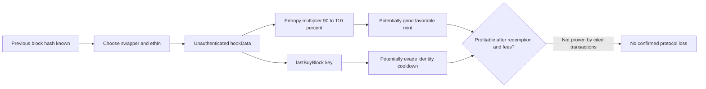

# Sat1Hook Forensics — Grindable Hook Identity, but No Confirmed Protocol Loss

<!-- non-defihacklabs -->

> **Vulnerability classes:** vuln/input-validation/missing · vuln/logic/missing-validation · vuln/logic/state-update

> **Reproduction:** The self-contained Foundry project in [this folder](.) replays the large SAT1 redemption immediately before the cited MEV transaction. It passes offline against the committed `anvil_state.json`; the canonical trace is [`output.txt`](output.txt).

## Key info

| Field | Value |
|---|---|
| **Confirmed loss** | **None demonstrated by the cited transactions** |
| **Reviewed contract** | `Sat1Hook` — [`0x2a0a30dd78af7698e6f40212b8b8324fce2ee888`](https://etherscan.io/address/0x2a0a30dd78af7698e6f40212b8b8324fce2ee888#code) |
| **SAT1 token** | [`0x8f66337a0c2a02202fd91dd596c411cf977c6060`](https://etherscan.io/address/0x8f66337a0c2a02202fd91dd596c411cf977c6060#code) |
| **Triggering seller** | `0x00aac9a393ddd5504682a7077b733047ba3e5e10` |
| **MEV searcher / contract** | `0x612511ea2945c045b892e67d4802c865abb21ac1` / `0x3774b788224a8c358e027139c301be8e5ba42c44` |
| **Triggering sell** | [`0xd7808d5755010cb12150ad0917b5e39d90bc9a35400ec79816fd3952812ca2b3`](https://etherscan.io/tx/0xd7808d5755010cb12150ad0917b5e39d90bc9a35400ec79816fd3952812ca2b3) |
| **Originally cited backrun** | [`0xc3ec96153353c32e4ab203d086a0618a2c7e666223c008c6ebc0a6f6c39c5420`](https://etherscan.io/tx/0xc3ec96153353c32e4ab203d086a0618a2c7e666223c008c6ebc0a6f6c39c5420) |
| **Chain / block / date** | Ethereum · `25,050,731` · 2026-05-08 13:46:11 UTC |
| **Fork block** | `25,050,730` |
| **Compiler** | Sat1Hook `0.8.26`; PoC `0.8.34` |
| **Assessment** | MEV backrun plus unauthenticated hook identity; no on-chain evidence of a profitable protocol drain |

## TL;DR

The initially supplied transaction is not a Sat1Hook drain. It is an MEV backrun placed immediately after a large, ordinary curve redemption. The backrun contract gained **0.006516037423174481 ETH** before gas attribution, while Sat1Hook's native balance increased by **1.042328435113795974 ETH** during that same transaction.

The preceding seller did receive **11.670888368430349639 ETH** from Sat1Hook for burning **172,796.820481397784 SAT1**, but historical transfer and call traces show that address had paid **223 ETH across 48 earlier Sat1Hook buys** to acquire that inventory. Treating the 11.67 ETH gross redemption as attacker profit would therefore be wrong.

The source review did find a genuine design weakness: `beforeSwap` trusts an arbitrary `swapper` address decoded from `hookData`. That untrusted address feeds both the first-100-block entropy multiplier and the per-wallet cooldown. A caller can choose identities off-chain to grind the multiplier or evade identity-based state. The reviewed transactions, however, do not prove that this weakness produced protocol loss.

## Background

Sat1Hook implements a Uniswap v4 hook-backed bonding curve. Buys transfer ETH into the hook, mint SAT1 according to an exponential curve, and increase `ethCum`. Sells burn SAT1, map actual token supply back to a fair-curve supply, and release ETH from the hook.

The curve has two non-standard identity-dependent features:

1. During the first 100 blocks, `_applyEntropy` multiplies a buy's fair output by a pseudo-random factor from 90% to 110%.
2. `lastBuyBlock[swapper]` attempts to prevent a wallet from buying and selling inside the cooldown window.

Both features depend on `swapper`, not on `msg.sender` or an authenticated recipient.

## The reviewed code

The hook decodes `swapper` directly from arbitrary router-supplied bytes and performs no binding check ([`src_Sat1Hook.sol:187-203`](sources/Sat1Hook_2a0a30/src_Sat1Hook.sol)):

```solidity
address swapper = abi.decode(hookData, (address));
if (params.zeroForOne) {
    return _executeBuy(uint256(-params.amountSpecified), swapper);
} else {
    return _executeSell(uint256(-params.amountSpecified), swapper);
}
```

The buy path uses that address in both entropy calculation and state attribution ([`:258-276`](sources/Sat1Hook_2a0a30/src_Sat1Hook.sol)):

```solidity
uint256 fairSat1 = Curve.mintFor(ethCum, ethToMint);
uint256 mintAmount = _applyEntropy(fairSat1, swapper, ethIn);
// ... mint SAT1 and take ETH ...
ethCum += ethIn;
lastBuyBlock[swapper] = block.number;
```

The entropy input is fully predictable once the prior block exists and includes attacker-selected values ([`:313-317`](sources/Sat1Hook_2a0a30/src_Sat1Hook.sol)):

```solidity
bytes32 h = keccak256(abi.encodePacked(blockhash(block.number - 1), swapper, ethIn));
uint256 mul = 9000 + (uint256(h) % 2001);
return (fairSat1 * mul) / 10000;
```

The sell path then looks up the same unauthenticated identity ([`:286-307`](sources/Sat1Hook_2a0a30/src_Sat1Hook.sol)).

## Root cause and scope

### Confirmed design weakness

`hookData` is data, not authentication. The hook assumes the embedded address represents the economic actor without verifying it against the router caller, payer, token recipient, a signature, or a trusted-router callback schema. Consequently:

- an early buyer can search candidate `(swapper, ethIn)` pairs off-chain after the previous block hash is known and choose a favorable entropy outcome;
- one economic actor can spread actions across arbitrary `swapper` keys;
- `lastBuyBlock` cannot enforce a wallet cooldown when its key is caller-selected;
- analytics that interpret `lastBuyBlock` as user identity are unreliable.

### What is not established

The cited backrun does not show Sat1Hook losing money. Transaction-level pre/post-state tracing produced:

| Account | Native balance change in linked backrun |
|---|---:|
| Sat1Hook | **+1.042328435113795974 ETH** |
| MEV contract | **+0.006516037423174481 ETH** |
| Searcher EOA | `-0.002551302029194581 ETH` (gas) |
| Uniswap v4 PoolManager | `-0.638024118734267240 ETH` |
| WETH contract | `-0.430221531560681416 ETH` |

Those movements describe a multi-venue arbitrage settlement, not a hook reserve drain. Attribution of the PoolManager/WETH deltas requires following their corresponding token legs; they are not standalone losses.

## Preconditions

For the source-level identity weakness to become economically exploitable, all of the following are needed:

1. execution occurs inside the 100-block entropy window, or cooldown evasion creates separate value;
2. the router permits caller-controlled hook data;
3. the caller can select `swapper` and/or `ethIn` after observing the previous block hash;
4. favorable extra SAT1 can later be redeemed or sold for more value than acquisition and fees;
5. the route remains profitable after gas, market impact, and other arbitrageurs.

The supplied May 8 transactions satisfy the general MEV setting, but the observed economics do not demonstrate condition 4.

## Attack and transaction walkthrough

1. Before block `25,050,731`, the triggering seller held exactly `172796820481397784000000` SAT1. The offline fork confirms the inventory before the call.
2. At transaction index 12, the seller calls the Sat1 router's `sell` with a minimum output of `11.530347357617498005 ETH` ([`output.txt:1596`](output.txt)).
3. Sat1Hook reads total supply and converts actual SAT1 input to fair-curve units ([`output.txt:1616-1617`](output.txt)).
4. The hook takes and burns the full SAT1 inventory ([`output.txt:1627`](output.txt)).
5. PoolManager settles exactly `11.670888368430349639 ETH` from the hook ([`output.txt:1633`](output.txt)). The PoC independently verifies identical decreases in both native balance and `ethCum` ([`output.txt:1647-1654`](output.txt)).
6. At transaction index 13, the cited contract backruns the resulting state across Sat1Hook and other Uniswap venues. Its small contract-level gain is MEV revenue; Sat1Hook receives more ETH than it sends during this backrun.

## Diagrams





## Remediation

1. Do not use a free-form hook-data address as identity. Bind the actor to an authenticated payer/recipient supplied by a trusted router, or require an EIP-712 signature over the swap parameters and nonce.
2. Remove pseudo-random economic multipliers based on `blockhash` plus caller-controlled inputs. If randomness is essential, use a commit-reveal or verifiable randomness design and model adversarial timing.
3. Enforce cooldowns on the address that actually owns/receives/burns SAT1, not on an unauthenticated metadata field.
4. Add invariants across buy/sell cycles: no sequence of identity substitutions should extract more ETH than paid in, net of explicitly intended rewards.
5. Separate accounting facts in incident response: gross reserve outflow, cost basis, gas, MEV contract gain, and protocol net balance change must not be conflated.

## How to reproduce

From the registry root:

```bash
_shared/run_poc.sh 2026-05-Sat1Hook_exp -vvvvv
```

The run is offline and uses the committed fork snapshot. Expected result: one passing test, a gross redemption of `11.670888368430349639 ETH`, an equal `ethCum` decrease, and a burn of `172796.820481397784 SAT1`. These values reproduce the triggering sell; they are deliberately not labeled attacker profit.

*Reference: [ExVul alert](https://x.com/exvulsec/status/2052749870193344648)*
