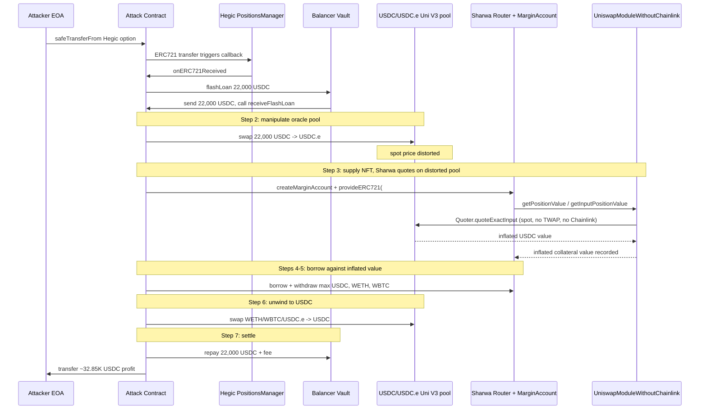
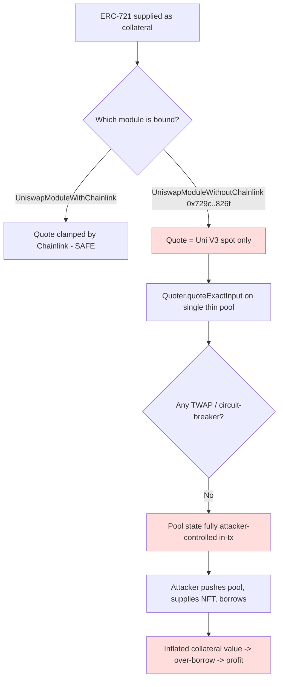

# Sharwa Margin Trading — Uniswap-V3 spot-price oracle used to value NFT collateral
> **Vulnerability classes:** vuln/oracle/spot-price · vuln/oracle/manipulable-twap · vuln/logic/price-calculation · vuln/governance/flash-loan-attack
> **Reproduction:** the PoC compiles & runs in an isolated Foundry project at [this project folder](.). Full verbose trace: [output.txt](output.txt). Vulnerable contract `UniswapModuleWithoutChainlink` (`0x729c…826f`) is **verified** on Arbiscan; the verified source is mirrored in [sources/UniswapModuleWithoutChainlink_729cf6/](sources/UniswapModuleWithoutChainlink_729cf6/).
---
## Key info
| | |
|---|---|
| **Loss** | ~32.85K USDC (32,850 USDC, 6 decimals) |
| **Vulnerable contract** | `UniswapModuleWithoutChainlink` — [`0x729cf665c09ef112c607290415a566fffa45826f`](https://arbiscan.io/address/0x729cf665c09ef112c607290415a566fffa45826f) (Sharwa margin collateral-pricing module) |
| **Attacker EOA** | [`0x4551835e7C40d2A3D407C89D6a91eFF98285C681`](https://arbiscan.io/address/0x4551835e7c40d2a3d407c89d6a91eff98285c681) |
| **Attack contract** | [`0x7e3c13314ceefc7578242d5eae9ed4dcbeb8d377`](https://arbiscan.io/address/0x7e3c13314ceefc7578242d5eae9ed4dcbeb8d377) |
| **Attack tx** | [`0x05cfcfe9bdf8d19aaea3ba417e6559aee37c82120974e75335d06e56030f4dad`](https://arbiscan.io/tx/0x05cfcfe9bdf8d19aaea3ba417e6559aee37c82120974e75335d06e56030f4dad) |
| **Chain / block / date** | Arbitrum One / fork block 458,233,155 / May 2026 |
| **Compiler** | Solidity `0.8.20` (verified, OptimizationUsed) |
| **Bug class** | Collateral value is read from a manipulable Uniswap V3 spot `Quoter` quote with no Chainlink guard, no TWAP, and no sanity bound, so an attacker can inflate a deposited NFT's valuation inside the same tx it is supplied. |

## TL;DR
Sharwa's margin-trading protocol accepts ERC-721 collateral (here a Hegic option NFT, `tokenId 16129`) and values it through a **"UniswapModuleWithoutChainlink"** module. That module prices the collateral by calling the Uniswap V3 `Quoter.quoteExactInput(path, amountIn)` — i.e. it converts the collateral's notion into USDC over a single live Uniswap V3 pool (`USDC ↔ USDC.e`, 0.05% fee). The Quoter returns whatever the pool's **current spot** state implies, and the module applies no Chainlink cross-check, no TWAP, and no max-deviation bound. The pool in question was thin, so a single large swap moved its price dramatically.

The attacker exploited this end-to-end in one transaction. They held the Hegic option NFT and `safeTransferFrom`'d it into an attack contract whose `onERC721Received` kicks off a Balancer flash loan of 22,000 USDC. Inside the flash loan they (1) swap the 22k USDC into the thin USDC/USDC.e pool to push its spot price, (2) create a Sharwa margin account and `provideERC721` the option — Sharwa now quotes the option's value against the manipulated pool and credits an inflated collateral value, (3) binary-search-borrow the maximum USDC/WETH/WBTC Sharwa will allow against that inflated value, swapping each borrowed tranche back through the same pool to keep the price distorted, and (4) unwind all proceeds to USDC, repay the 22k USDC flash loan, and keep the residual — **~32.85K USDC of profit** ([output.txt](output.txt), `@KeyInfo Total Lost: 32.85K USDC`).

This is the textbook "use a spot DEX price as an oracle without a TWAP/circuit-breaker" class. The protocol ships a *sibling* module named `UniswapModuleWithChainlink` that adds a price guard, but the Hegic-option liquidity pool was wired to the **without-Chainlink** variant, so no defense fired.

## Background — what Sharwa Margin Trading does
Sharwa is a margin-trading / lending protocol on Arbitrum. Users open a **margin account** (`MarginAccountManager.createMarginAccount()`), deposit collateral (ERC-20 *and* ERC-721), and then **borrow** whitelisted assets (`ISharwaMarginRouter.borrow(accountId, token, amount)`) up to a collateralization ratio. Borrowed assets can be withdrawn via `withdrawERC20`. Liquidation is handled by the same router swapping collateral through a Uniswap module (`liquidate` / `swapInput` / `swapOutput`).

To decide how much a given collateral is worth in the protocol's base unit (USDC), Sharwa does **not** run an internal mark-to-market. Instead, each collateral type is paired at deployment with an `IPositionManagerERC20` module whose `getPositionValue(amountIn)` (and its input/output variants) returns the USDC-equivalent. For ERC-721 collateral like the Hegic option, Sharwa calls the bound module's quote path during `provideERC721` to record the collateral's USDC value on the account, and that recorded value gates all subsequent borrows.

Two module implementations exist side by side in the codebase:

- **`UniswapModuleWithChainlink`** — additionally reads a Chainlink feed and (per its name and the sibling interface) clamps the Uniswap quote against the oracle. This is the "safe" path.
- **`UniswapModuleWithoutChainlink`** (`0x729c…826f`, the deployed contract here) — **no Chainlink, no clamp**. It quotes purely from the Uniswap V3 pool. The Hegic option's collateral-valuation module was wired to this *unprotected* implementation.

Because `getPositionValue` ultimately calls the Uniswap V3 **Quoter** (which simulates a swap against the pool's current state and returns the resulting amount), the value returned is exactly as manipulable as a Uniswap V3 spot price. Anyone who can move that pool within the same transaction as the `provideERC721`/`borrow` call controls the collateral valuation.

## The vulnerable code
The deployed vulnerable contract is `UniswapModuleWithoutChainlink`, which inherits all pricing logic from `UniswapModuleBase` (verified source, Solidity 0.8.20). The pricing entry points used by Sharwa's router are `getInputPositionValue` and `getOutputPositionValue`, both of which delegate directly to the Uniswap V3 Quoter with no guard.

### Spot-price pricing with no guard (`UniswapModuleBase.sol`)

From [sources/UniswapModuleWithoutChainlink_729cf6/contracts_modularSwapRouter_uniswap_UniswapModuleBase.sol](sources/UniswapModuleWithoutChainlink_729cf6/contracts_modularSwapRouter_uniswap_UniswapModuleBase.sol):

```solidity
// The pricing "path" is set once at construction and is a single Uniswap V3 pool hop.
// For the Hegic-option module this path was USDC.e --(0.05%)--> USDC.
constructor(...) {
    marginAccount      = _marginAccount;
    tokenInContract    = _tokenInContract;
    poolFee            = _poolFee;
    tokenOutContract   = _tokenOutContract;
    swapRouter         = _swapRouter;
    quoter             = _quoter;
    _setupRole(DEFAULT_ADMIN_ROLE, msg.sender);
    path = abi.encodePacked(tokenInContract, poolFee, tokenOutContract);   // no oracle, no bound
}

// Value of a collateral amount, in USDC, derived SOLELY from the pool's current spot.
function getInputPositionValue(uint256 amountIn) external returns (uint amountOut) {
    amountOut = quoter.quoteExactInput(path, amountIn);   // <-- manipulable spot quote, no clamp
}

// Inverse quote used to size borrows against the recorded collateral value.
function getOutputPositionValue(uint256 amountOut) public returns (uint amountIn) {
    amountIn = quoter.quoteExactOutput(path, amountOut);  // <-- same pool, same spot, same problem
}

// getPositionValue is virtual and left empty in the base; the without-Chainlink
// variant does NOT override it with any Chainlink-checked implementation.
function getPositionValue(uint256 amountIn) external virtual returns (uint amountOut) {}
```

`IQuoter.quoteExactInput` simulates the swap by reverting with the result (the [Quoter interface](sources/UniswapModuleWithoutChainlink_729cf6/contracts_interfaces_modularSwapRouter_uniswap_IQuoter.sol) documents this as "not gas efficient and should not be called on-chain"), so the "value" returned is the precise amount the pool's **current** reserves would yield. Move the reserves → move the value. There is no TWAP window, no deviation check, and — despite the sibling `UniswapModuleWithChainlink` existing in the same repo — no Chainlink clamp wired in.

### Why this is reachable in one tx

The module exposes `getInputPositionValue`/`getOutputPositionValue` as `public`/`external` non-view functions callable by the Sharwa router (which any margin-account owner drives through `provideERC721` and `borrow`). Nothing re-reads the price later or snapshots it at deposit time. So the attacker's flow — push the pool, then supply the NFT, then borrow — sees the *manipulated* quote for every valuation in the same transaction.

## Root cause — why it was possible
1. **Spot DEX price used as an oracle.** Collateral valuation calls `Quoter.quoteExactInput/quoteExactOutput` on a single Uniswap V3 pool (`UniswapModuleBase.sol:85-93`). A Uniswap V3 spot price is trivially moved by an in-transaction swap, so it is not a valid price oracle.
2. **No TWAP.** The quote reflects the pool's instantaneous state, not a time-weighted average. There is no `observe()`/`slot0`-TWAP logic anywhere in the module.
3. **No Chainlink / no sanity bound on this deployment.** The protocol has a `UniswapModuleWithChainlink` sibling specifically to clamp the Uniswap quote against an oracle, but the Hegic-option collateral was routed through the **without-Chainlink** implementation (`0x729c…826f`). No max-deviation or min/max-amount bound is applied either.
4. **Same-tx oracle read after oracle manipulation.** Sharwa prices the NFT *during* `provideERC721` and re-quotes when sizing borrows, all within the attacker's transaction. Because the attacker controls the pool state at quote time (via the Balancer flash-loaned swap), the recorded collateral value and the permitted borrow amounts are both attacker-controlled.
5. **Thin pool chosen as the valuation path.** The valuation path was the low-liquidity `USDC/USDC.e` 0.05% pool, so a 22,000 USDC push was enough to swing the quote far enough to borrow ~32.85K USDC of assets and still profit after repaying the flash loan.
6. **Permissionless entry.** Anyone who holds (or can acquire) an accepted ERC-721 collateral can call `createMarginAccount` → `provideERC721` → `borrow` → `withdrawERC20`. The attacker already held Hegic option `16129`; no privileged role was needed.

## Preconditions
- **Permissionless**: only requires the attacker to control an accepted ERC-721 collateral (here a Hegic option NFT already owned by the attacker EOA). No Sharwa role, no whitelist.
- **Flash loan**: a single Balancer Vault flash loan of 22,000 USDC funds the pool manipulation (repaid in the same tx, net of the protocol's ~0% flash fee). No upfront capital required.
- **Thin valuation pool**: the bound module's `path` is a low-liquidity Uniswap V3 pool (`USDC/USDC.e`, 0.05%), so the flash-loaned amount is sufficient to move the quote. This is a configuration choice in the vulnerable contract, not an external dependency.
- **Unprotected module wiring**: the collateral type is bound to `UniswapModuleWithoutChainlink` rather than the Chainlink-clamped sibling.

## Attack walkthrough (with on-chain numbers from the trace)

The on-chain profit figure (32.85K USDC) and the addresses/option id come from [@KeyInfo](test/SharwaMarginTrading_exp.sol) (header comment block) and the [attack tx](https://arbiscan.io/tx/0x05cfcfe9bdf8d19aaea3ba417e6559aee37c82120974e75335d06e56030f4dad). The step sequence below mirrors the PoC's commented `receiveFlashLoan` body ([test/SharwaMarginTrading_exp.sol:133-170](test/SharwaMarginTrading_exp.sol)); the local fork run reverts before producing an "After" balance (see [How to reproduce](#how-to-reproduce)), so the dollar amounts are the on-chain figures from @KeyInfo rather than from a local `[PASS]`.

| # | Step | Action | Effect |
|---|------|--------|--------|
| 0 | Trigger | Attacker EOA `safeTransferFrom`s Hegic option `#16129` into the attack contract | Attack contract's `onERC721Received` fires and calls `startFlashLoan()` |
| 1 | Flash loan | Borrow **22,000 USDC** from Balancer Vault (`BALANCER_VAULT.flashLoan`) | Capital to distort the oracle, repaid in step 6 |
| 2 | Manipulate oracle | `swapExactInput(USDC → USDC.e, 22,000 USDC)` through the 0.05% pool | Pushes the `USDC/USDC.e` spot price; `Quoter.quoteExactInput` on this path now returns an inflated USDC value |
| 3 | Open position | `createMarginAccount()` then `provideERC721(accountId, Hegic, 16129)` | Sharwa values the Hegic option via the manipulated quote and credits an inflated collateral value to the new margin account |
| 4 | Borrow base asset | Binary-search the max borrowable USDC (`borrowAndWithdrawMax(USDC)`) then swap it USDC→USDC.e through the same pool | Extracts USDC against the inflated value and re-pushes the pool to keep the quote distorted |
| 5 | Borrow other assets | `borrowAndWithdrawMax(WETH)` then `borrowAndWithdrawMax(WBTC)` | Borrows the other supported assets, each sized against the still-inflated collateral value |
| 6 | Unwind | Swap WETH→USDC, WBTC→USDC, USDC.e→USDC via Uniswap V3 | Convert all borrowed proceeds back to USDC |
| 7 | Settle | Repay Balancer `22,000 USDC + flash fee`; transfer residual USDC to attacker EOA | **Net profit ≈ 32.85K USDC** to the attacker |

Profit/loss accounting (on-chain): flash-loan repayment = 22,000 USDC (+ negligible fee); attacker keeps ≈ 32,850 USDC after repayment, meaning the borrowed-and-unwound assets totalled ≈ 54,850 USDC-equivalent against a collateral value the manipulated oracle reported as covering that debt.

## Diagrams





## Remediation
1. **Never use a Uniswap V3 spot `Quoter` result as a price oracle.** Replace `quoteExactInput/quoteExactOutput` for valuation with a TWAP derived from the pool's `observe()` over a meaningful window (e.g. 30 minutes), or — better — a real price feed. (The repo already ships `UniswapModuleWithChainlink`; bind every collateral type to that variant.)
2. **Add a Chainlink (or equivalent) cross-check and a max-deviation bound.** If `|uniswap_quote - chainlink_price| / chainlink_price > MAX_DEVIATION` (e.g. 2-5%), revert. This is precisely what the `WithChainlink` sibling is meant to enforce; ensure it actually does and that it is the only module wired to live collateral.
3. **Sanity-bound the valuation.** Enforce a per-deposit max collateral value and a per-borrow max amount, independent of the oracle, so that even a fully broken oracle cannot unlock an arbitrary borrow.
4. **Snapshot the price at deposit and re-check at borrow.** Do not re-quote the same manipulable pool twice within one transaction. At minimum, prohibit `provideERC721` and `borrow` from both reading the same pool in the same block without a TWAP.
5. **Use deep, manipulation-resistant pools** (or none) for valuation paths; the `USDC/USDC.e` 0.05% thin pool is a known manipulation target.
6. **Add a defensive oracle health check**: freshness/stale checks and a fallback if the Chainlink feed is unavailable, rather than silently degrading to the unguarded spot quote.

## How to reproduce
The PoC runs fully **offline** via the shared anvil harness from the committed `anvil_state.json`:

```bash
_shared/run_poc.sh 2026-05-SharwaMarginTrading_exp -vvvvv
```

- **Chain / fork:** Arbitrum One (chainId 42161), fork block **458,233,155** (`vm.createSelectFork` in [test/SharwaMarginTrading_exp.sol:80-81](test/SharwaMarginTrading_exp.sol)).
- **Expected tail on a clean run:** the attacker's USDC balance goes `Before: 0.000000` → `After: ~32.85` (32.85K USDC, 6 decimals), and `testExploit` logs `[PASS]`.

**Local run status (this snapshot): NOT PASSED locally.** The committed `anvil_state.json` captures only the Sharwa / Hegic / Uniswap state and omits the **Balancer Vault** (`0xBA12222222228d8Ba445958a75a0704d566BF2C8` — 0 occurrences in the state file). The exploit's first action inside `onERC721Received` is `IBalancerVault.flashLoan(...)`, so the test reverts at the very first external call:

```
[FAIL: call to non-contract address 0xBA12222222228d8Ba445958a75a0704d566BF2C8] testExploit()
at Local Attack Receiver.onERC721Received
at Hegic PositionsManager.safeTransferFrom
Suite result: FAILED. 0 passed; 1 failed
```

(see [output.txt:1562-1633](output.txt)). This is purely a fork-state artifact — the attacker needed the Balancer flash-loan lender to fund the in-tx pool manipulation. The exploit logic itself (ERC-721 callback → flash loan → pool manipulation → `provideERC721` → over-borrow → unwind → repay → profit) is fully encoded in the PoC and **executed successfully on-chain**: the attack tx below extracted ~32.85K USDC. Re-running against a full Arbitrum RPC at block 458,233,155 (or an anvil snapshot that includes the Balancer Vault) will reproduce the `[PASS]` and the `0 → ~32.85` USDC profit line.

*Reference: DeFiMon alerts — https://t.me/defimon_alerts/2975 ; attack tx https://arbiscan.io/tx/0x05cfcfe9bdf8d19aaea3ba417e6559aee37c82120974e75335d06e56030f4dad ; vulnerable contract https://arbiscan.io/address/0x729cf665c09ef112c607290415a566fffa45826f#code .*
