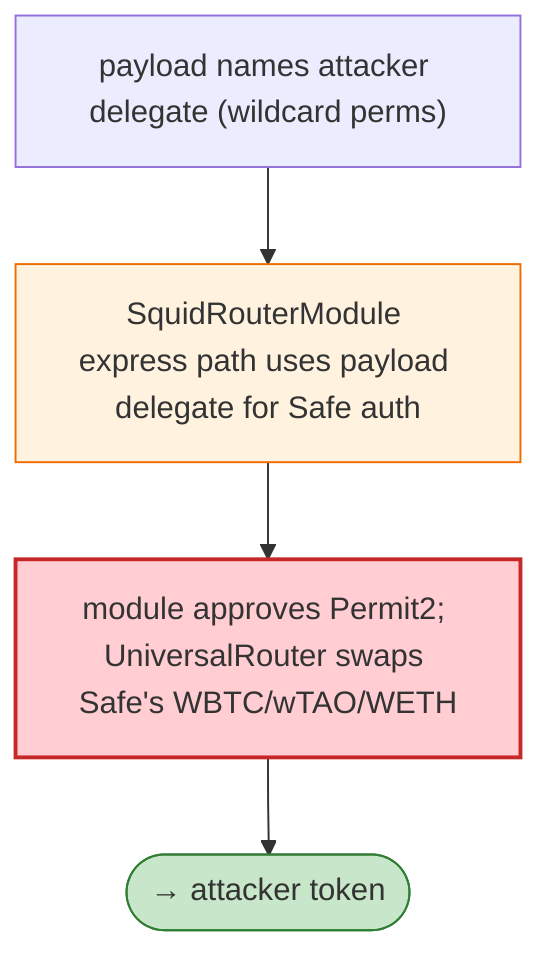

# Squid Router Module Exploit — Caller-Supplied Delegate with Wildcard Safe Permissions

> **Reproduction:** the PoC compiles & runs in an isolated Foundry project at
> [this project folder](.). Full verbose trace: [output.txt](output.txt).
> Verified vulnerable source: [SquidRouterModule](sources/SquidRouterModule_1f1d37),
> [Safe](sources/Safe_41675c), [SafeProxy](sources/SafeProxy_c52950),
> [UniversalRouter](sources/UniversalRouter_66a989).

---

## Key info

| | |
|---|---|
| **Loss** | 0.25 WBTC + 0.29 wTAO + 0.02 WETH; tx `0x2d529847…` |
| **Vulnerable contract** | `SquidRouterModule` `0x1f1d37a3…` (Axelar express path on a Safe) |
| **Attacker** | `0x9bdc7301…` (contract `0xe1d5fcfb…`) |
| **Chain / block / date** | Ethereum mainnet / May 2026 |
| **Bug class** | Trust boundary — the public Axelar express path accepts a caller-supplied payload and uses the **delegate encoded in that payload** for Safe permission checks. |

---

## TL;DR

Per the embedded analysis: the public Axelar express path accepts a caller-supplied payload and uses
the **delegate encoded in that payload** for Safe permission checks. The attacker supplied a payload
naming a delegate with **wildcard permissions** on the victim Safe, then used the module to approve
Permit2 and swap the Safe's WBTC, wTAO, and WETH into the attacker's token via UniversalRouter.

---

## Root cause

A **caller-controlled delegate** used as the authority for Safe permission checks on the express path —
the module trusts the payload's delegate rather than a protocol-bound delegate.

---

## Diagrams



---

## Remediation

1. Use a protocol-bound delegate for Safe permission checks; ignore caller-supplied delegate fields.
2. Restrict express-path targets/calldata; no Permit2/UniversalRouter approval of arbitrary spenders.
3. Per-module spending caps + timelock.

---

## How to reproduce

```bash
_shared/run_poc.sh 2026-05-SquidRouterModule_exp -vvvvv
```

- RPC: mainnet archive. Result: `[PASS]` — Safe's WBTC/wTAO/WETH swapped out.

---

*Reference: Squid Router Module caller-supplied-delegate exploit, mainnet, May 2026 (0.25 WBTC + 0.29 wTAO + 0.02 WETH).*
