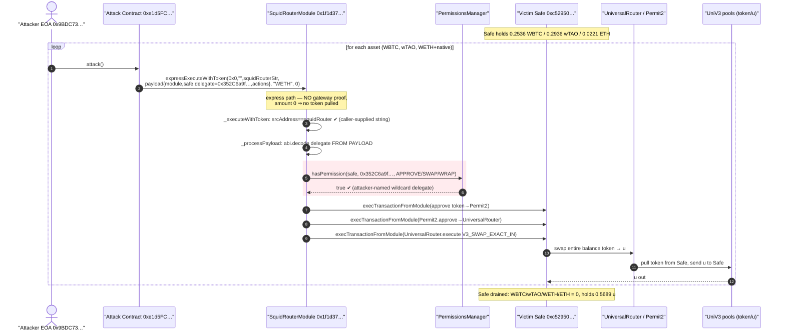
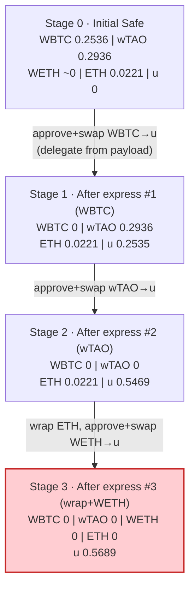
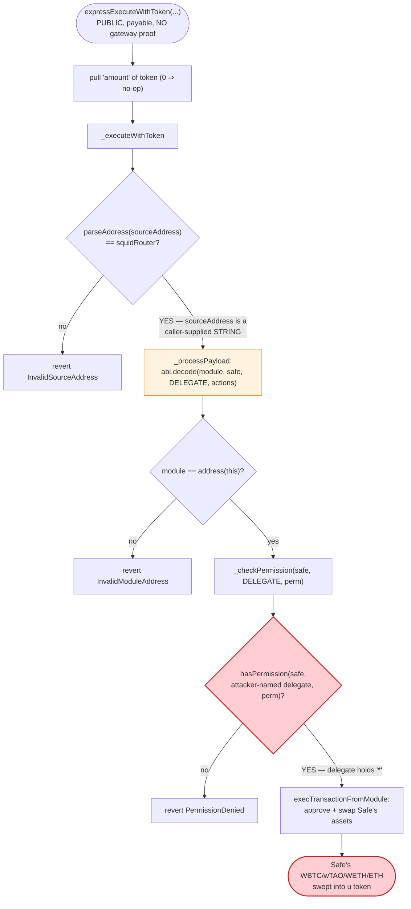
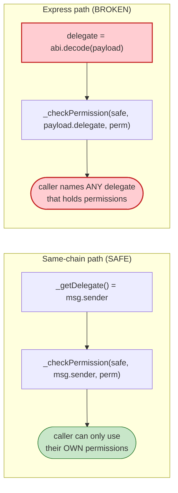

# Squid Router Module Exploit — Caller-Supplied Delegate on the Permissionless Axelar Express Path

> **Reproduction:** the PoC compiles & runs in an isolated Foundry project at
> [this project folder](.). It forks Ethereum mainnet at block 25,170,474 from a
> local anvil snapshot ([anvil_state.json](anvil_state.json)), so no public archive
> RPC is needed. Full verbose trace: [output.txt](output.txt). Verified vulnerable
> source: [contracts_modules_SquidRouterModule.sol](sources/SquidRouterModule_1f1d37/contracts_modules_SquidRouterModule.sol)
> and its base [contracts_modules_BaseModule.sol](sources/SquidRouterModule_1f1d37/contracts_modules_BaseModule.sol),
> reached through Axelar's
> [AxelarExpressExecutableWithToken.sol](sources/SquidRouterModule_1f1d37/axelar-network_axelar-gmp-sdk-solidity_contracts_express_AxelarExpressExecutableWithToken.sol).

---

## Key info

| | |
|---|---|
| **Loss** | 0.25361701 WBTC + 0.293599251 wTAO + ~0.0221 ETH (wrapped) + 0.000000000000001215 WETH — all converted to **0.568933475584054988 `u`** delivered to the drained Safe; the Safe's productive assets were swept into a worthless token. Attack tx [`0x2d52984706…902abfeb`](https://etherscan.io/tx/0x2d52984706d5ac567d554d40a62beeeda9e3901dd3847e93dd2a3117902abfeb) |
| **Vulnerable contract** | `SquidRouterModule` — [`0x1f1d37a3Bf840e35c6a860c7C2dA71Fe555123ca`](https://etherscan.io/address/0x1f1d37a3bf840e35c6a860c7c2da71fe555123ca#code) (a Safe module on the Axelar express path) |
| **Victim** | Safe (Gnosis Safe proxy) — [`0xc52950d522034a558903CC409c8bbF1f4Decc62e`](https://etherscan.io/address/0xc52950d522034a558903CC409c8bbF1f4Decc62e); singleton impl `0x41675C099F32341bf84BFc5382aF534df5C7461a` |
| **Permissioned delegate (abused)** | `0x352C6a9f59357457b83D97e33cE28B333a7a1F3c` — an address holding wildcard permissions on the victim Safe |
| **Attacker EOA** | [`0x9BDC730183821b6bb2B51BE30B77C964FA645b91`](https://etherscan.io/address/0x9BDC730183821b6bb2B51BE30B77C964FA645b91) |
| **Attacker contract** | `0xe1d5FCfBba4d46F4937de369De415dD7E2D3265a` |
| **Chain / block / date** | Ethereum mainnet (chainId 1) / fork block 25,170,474 / May 2026 |
| **Compiler** | Solidity v0.8.30+commit.73712a01, optimizer **enabled, 200 runs** (per [_meta.json](sources/SquidRouterModule_1f1d37/_meta.json)) |
| **Bug class** | Trust-boundary / authorization bypass — a public, unauthenticated entry point that takes the **delegate identity from caller-supplied calldata** and uses it as the authority for Safe permission checks |

---

## TL;DR

1. `SquidRouterModule` is an enabled module on a Gnosis Safe. It can drive the Safe
   (`execTransactionFromModule`) to approve tokens and route swaps — but only after
   it checks that some **delegate** holds the relevant permission on the Safe
   (`_checkPermission`, [BaseModule.sol#L133-L142](sources/SquidRouterModule_1f1d37/contracts_modules_BaseModule.sol#L133-L142)).

2. On the **same-chain** path the delegate is `msg.sender`
   (`_getDelegate`, [BaseModule.sol#L144-L149](sources/SquidRouterModule_1f1d37/contracts_modules_BaseModule.sol#L144-L149)) — so the caller can only act with *their own* permissions.

3. On the **cross-chain / express** path the delegate is instead **decoded out of the
   bridge payload** (`_processPayload`,
   [SquidRouterModule.sol#L159-L175](sources/SquidRouterModule_1f1d37/contracts_modules_SquidRouterModule.sol#L159-L175)).
   The express entry point `expressExecuteWithToken` is `external payable virtual`
   ([AxelarExpressExecutableWithToken.sol#L111-L148](sources/SquidRouterModule_1f1d37/axelar-network_axelar-gmp-sdk-solidity_contracts_express_AxelarExpressExecutableWithToken.sol#L111-L148))
   — **anyone can call it**, and it invokes `_executeWithToken` (and therefore
   `_processPayload`) without any gateway proof.

4. So the attacker simply crafts a payload `abi.encode(module, victimSafe, delegate, actions)`
   where `delegate` is an address that already holds **wildcard (`*`) permissions** on the
   victim Safe (`0x352C6a9f…`). The module dutifully checks
   `hasPermission(victimSafe, 0x352C6a9f…, APPROVE/SWAP/WRAP)` — which all return `true`
   ([output.txt:136-137](output.txt), [output.txt:170-171](output.txt), [output.txt:335-336](output.txt)) — and executes the actions **as the Safe**.

5. The attacker scripts three express calls, one per asset
   ([SquidRouterModule_exp.sol#L145-L149](test/SquidRouterModule_exp.sol#L145-L149)):
   approve Permit2, Permit2-approve the UniversalRouter, then UniV3-swap the Safe's
   entire WBTC, wTAO and (wrapped-)WETH balances into the `u` token via the
   UniversalRouter ([SquidRouterModule_exp.sol#L159-L211](test/SquidRouterModule_exp.sol#L159-L211)).

6. After the three express calls the Safe's WBTC, wTAO, WETH and native ETH balances
   are all **0** ([output.txt:14-18](output.txt)) and it holds
   `0.568933475584054988 u` ([output.txt:477](output.txt)). The valuable assets are
   gone; the Safe is left holding a low-value token. The PoC asserts each pool received
   exactly the Safe's prior balance ([output.txt:438](output.txt), [output.txt:442](output.txt), [output.txt:446](output.txt)).

The single root flaw: **the authority used for permission checks is attacker-controlled
calldata on a permissionless entry point.** Nothing binds the `delegate` in the payload
to anything the protocol trusts.

---

## Background — what SquidRouterModule does

`SquidRouterModule`
([source](sources/SquidRouterModule_1f1d37/contracts_modules_SquidRouterModule.sol))
is a Safe (Gnosis Safe) **module** that lets a Squid/Axelar integration drive a user's
Safe to perform DeFi actions — token approvals, Permit2 approvals, native wrap/unwrap,
and Uniswap V2/V3 swaps — on the user's behalf, both same-chain and as the destination
leg of an Axelar cross-chain bridge.

Every privileged action funnels through `_handleAction`
([SquidRouterModule.sol#L195-L219](sources/SquidRouterModule_1f1d37/contracts_modules_SquidRouterModule.sol#L195-L219)),
and each handler begins with `_checkPermission(safe, delegate, <PERMISSION>)`. The
permission model is a string-keyed allowlist managed by an external
`IPermissionsManager`: a `(safe, delegate, {module, permissionName})` tuple either has a
permission or it does not. The named permissions are defined in `Permissions`
([Permissions.sol#L4-L16](sources/SquidRouterModule_1f1d37/contracts_libs_Permissions.sol#L4-L16)):
`"*"` (ALL), `"APPROVE"`, `"SWAP"`, `"WRAP"`, `"UNWRAP"`, `"DEPOSIT"`, etc. A delegate
holding `"*"` passes **every** `hasPermission` check.

The module has two distinct ways to identify the **delegate** whose permissions are
checked:

| Entry path | How `delegate` is determined | Trust |
|---|---|---|
| Same-chain (`executeSameChainActions`) | `_getDelegate()` → `msg.sender` (or `delegateBundler.currentDelegate()`) | Bound to the actual caller — safe |
| Cross-chain bridge (`executeSquidRouterBridgeWithActions`) | `_getDelegate()` on the source leg; payload re-encodes it for the destination | Source-bound |
| **Axelar express / `_executeWithToken`** | **`delegate` is `abi.decode`d from the inbound payload** | **Attacker-controlled** |

On-chain state at the fork block (block 25,170,474), read directly from the trace:

| Parameter | Value | Source |
|---|---|---|
| Safe WBTC balance | 25,361,701 (8 dec ⇒ **0.25361701 WBTC**) | [output.txt:67](output.txt) |
| Safe wTAO balance | 293,599,251 (9 dec ⇒ **0.293599251 wTAO**) | [output.txt:74](output.txt) |
| Safe WETH balance | 1,215 wei (18 dec ⇒ ~1.2e-15 WETH) | [output.txt:81](output.txt) |
| Safe native ETH | 22,100,612,795,637,319 (⇒ **~0.0221 ETH**) | [output.txt:92](output.txt) |
| Safe `u` balance (before) | 0 | [output.txt:88](output.txt) |
| `hasPermission(Safe, 0x352C6a9f…, APPROVE)` | `true` (1) | [output.txt:136-137](output.txt) |
| `hasPermission(Safe, 0x352C6a9f…, SWAP)` | `true` (1) | [output.txt:170-171](output.txt) |
| `hasPermission(Safe, 0x352C6a9f…, WRAP)` | `true` (1) | [output.txt:335-336](output.txt) |
| WBTC-`u` pool WBTC reserve (before) | 86,384,348 (~0.864 WBTC) | [output.txt:102](output.txt) |
| wTAO-`u` pool wTAO reserve (before) | 157,819,544,503 (~157.8 wTAO) | [output.txt:104](output.txt) |
| WETH-`u` pool WETH reserve (before) | 60,843,492,938,318,422,244 (~60.84 WETH) | [output.txt:106](output.txt) |

The permission check is structurally correct — it *does* verify the delegate. The fatal
detail is **which delegate**: on the express path it is whatever address the caller put
in the payload.

---

## The vulnerable code

### 1. The permission check is only as trustworthy as the `delegate` it is given

```solidity
function _checkPermission(
    address safe,
    address delegate,
    string memory permissionName
) internal view virtual {
    require(
        permissionsManager.hasPermission(safe, delegate, _getPermissionEntry(permissionName)),
        PermissionDenied(safe, delegate, permissionName)
    );
}

function _getDelegate() internal view returns (address) {
    return
        msg.sender == address(delegateBundler)
            ? delegateBundler.currentDelegate()
            : msg.sender;
}
```
([BaseModule.sol#L133-L149](sources/SquidRouterModule_1f1d37/contracts_modules_BaseModule.sol#L133-L149))

For same-chain actions the `delegate` always comes from `_getDelegate()`, i.e. it is
bound to `msg.sender`. A caller can therefore only ever exercise *their own*
permissions on the Safe. This is the correct, safe pattern.

### 2. The express path takes `delegate` from caller-supplied calldata

```solidity
function _processPayload(
    IERC20 bridgedToken,
    uint256 bridgedTokenAmount,
    bytes calldata payload
) internal {
    (address module, address safe, address delegate, ActionsExecutionParams memory params) = abi.decode(
        payload,
        (address, address, address, ActionsExecutionParams)
    );

    require(module == address(this), InvalidModuleAddress(module));

    // Send all bridged tokens to the safe
    bridgedToken.safeTransfer(safe, bridgedTokenAmount);

    _handleActions(safe, delegate, params);   // ⚠️ delegate came from the payload
}
```
([SquidRouterModule.sol#L159-L175](sources/SquidRouterModule_1f1d37/contracts_modules_SquidRouterModule.sol#L159-L175))

The only validation here is `module == address(this)`. The `safe` and — crucially — the
`delegate` are taken verbatim from the inbound `payload` and forwarded straight into
`_handleActions(safe, delegate, params)`, which calls `_checkPermission(safe, delegate, …)`
for every action. There is **no check that the caller is the delegate, that the delegate
authorized this call, or that the call genuinely originated from a remote Squid router.**

### 3. The entry that reaches `_processPayload` is fully permissionless

`_processPayload` is reached only through `_executeWithToken`:

```solidity
function _executeWithToken(
    bytes32,
    string calldata,
    string calldata sourceAddress,
    bytes calldata payload,
    string calldata tokenSymbol,
    uint256 amount
) internal override {
    // Verify source chain sender address
    address srcAddress = Strings.parseAddress(sourceAddress);
    require(srcAddress == squidRouter, InvalidSourceAddress(srcAddress));

    IERC20 token = IERC20(_getTokenAddress(tokenSymbol));

    _processPayload(token, amount, payload);
}
```
([SquidRouterModule.sol#L142-L157](sources/SquidRouterModule_1f1d37/contracts_modules_SquidRouterModule.sol#L142-L157))

The only gate is `srcAddress == squidRouter`. But `sourceAddress` is a **string argument
supplied by the caller**, not a value attested by the Axelar gateway. And `_executeWithToken`
is invoked directly by the express entry point, which performs no gateway proof:

```solidity
function expressExecuteWithToken(
    bytes32 commandId,
    string calldata sourceChain,
    string calldata sourceAddress,
    bytes calldata payload,
    string calldata symbol,
    uint256 amount
) external payable virtual {
    if (gatewayWithToken().isCommandExecuted(commandId)) revert AlreadyExecuted();

    address expressExecutor = msg.sender;
    address gatewayToken = gatewayWithToken().tokenAddresses(symbol);
    bytes32 payloadHash = keccak256(payload);
    ...
    IERC20(gatewayToken).safeTransferFrom(expressExecutor, address(this), amount);

    _executeWithToken(commandId, sourceChain, sourceAddress, payload, symbol, amount);
}
```
([AxelarExpressExecutableWithToken.sol#L111-L148](sources/SquidRouterModule_1f1d37/axelar-network_axelar-gmp-sdk-solidity_contracts_express_AxelarExpressExecutableWithToken.sol#L111-L148))

Unlike `executeWithToken` (which calls `gatewayWithToken().validateContractCallAndMint(...)`
at [AxelarExpressExecutableWithToken.sol#L54-L63](sources/SquidRouterModule_1f1d37/axelar-network_axelar-gmp-sdk-solidity_contracts_express_AxelarExpressExecutableWithToken.sol#L54-L63)),
the **express** variant validates nothing about message authenticity. It is designed for
a relayer to *front* a bridge fulfilment and be reimbursed later — so it only pulls
`amount` of the bridged token from the caller and then runs the actions. With
`amount = 0` that transfer is a no-op ([output.txt:126-128](output.txt)), so the attacker
pays nothing and the express path becomes a free, public proxy into `_processPayload`.

---

## Root cause — why it was possible

The exploit is a single authorization-design failure with two reinforcing parts:

1. **The authority is attacker-controlled data.** `_processPayload` decodes `delegate`
   from the payload and uses it as the subject of every `_checkPermission` call. The
   correct same-chain pattern (`_getDelegate()` → `msg.sender`) guarantees a caller can
   only act with their own permissions; the express path discards that guarantee. The
   module never verifies that `msg.sender` *is* the decoded `delegate`, nor that the
   decoded `delegate` consented to this specific call.

2. **The entry point is permissionless and unauthenticated.** `expressExecuteWithToken`
   is `external payable virtual` and reaches `_executeWithToken` → `_processPayload`
   without any Axelar gateway proof. The lone `srcAddress == squidRouter` check is
   defeated trivially: `sourceAddress` is a caller-supplied string, so the attacker just
   passes the Squid router's own address as the string
   (`"0xce16F69375520ab01377ce7B88f5BA8C48F8D666"`,
   [SquidRouterModule_exp.sol#L40](test/SquidRouterModule_exp.sol#L40), seen in the trace
   at [output.txt:112](output.txt)).

Composed, these mean **any address can invoke the module as if it were a legitimate
cross-chain fulfilment carrying any `delegate` it likes.** The attacker chooses a
`delegate` that already holds wildcard (`*`) permissions on the target Safe
(`0x352C6a9f…`). From there, every `hasPermission(Safe, 0x352C6a9f…, …)` returns `true`
([output.txt:137](output.txt), [output.txt:171](output.txt), [output.txt:336](output.txt)),
and the module drives the Safe to approve and swap away its entire balance.

The permission *manager* worked exactly as designed — it was simply asked the wrong
question, about an attacker-named delegate, on behalf of an attacker-initiated call.

---

## Preconditions

- **A Safe with `SquidRouterModule` enabled.** The module must be an enabled Safe module
  so `execTransactionFromModule` succeeds (it does — see
  `ExecutionFromModuleSuccess` at [output.txt:145](output.txt)).
- **A delegate with broad permissions on that Safe.** The attack needs *some* address
  for which `hasPermission(Safe, delegate, APPROVE/SWAP/WRAP)` is `true`. The victim Safe
  had granted `0x352C6a9f…` wildcard-style permissions; the attacker only had to *name*
  it in the payload — they never needed its key.
- **No authenticity binding on the express path.** Because `expressExecuteWithToken` is
  public and `_executeWithToken` trusts a caller-supplied `sourceAddress` string, the
  attacker can reach `_processPayload` directly. No bridged tokens are required: the PoC
  uses `symbol = "WETH", amount = 0`, so the gateway `safeTransferFrom` is a 0-value
  no-op ([output.txt:126-128](output.txt)).
- **No working capital.** Unlike AMM-invariant drains, this attack moves no value through
  the attacker's own funds; it spends the *victim's* assets. The attacker contract just
  needs gas.

---

## Attack walkthrough (with on-chain numbers from the trace)

The attacker EOA `0x9BDC73…` (pranked, [output.txt:107](output.txt)) calls
`attack()` on the attack contract `0xe1d5FC…` ([output.txt:109](output.txt)), which fires
three `expressExecuteWithToken` calls — one per asset — each carrying a payload that names
`delegate = 0x352C6a9f…` and a list of approve+swap actions. All amounts are raw integers
as printed by the trace; human approximations follow in parentheses.

| # | Step | Token amount (raw) | ~Human | State change | Trace |
|---|------|-------------------:|--------|--------------|-------|
| 0 | **Initial Safe balances** | WBTC 25,361,701 · wTAO 293,599,251 · WETH 1,215 · ETH 22,100,612,795,637,319 | 0.2536 WBTC · 0.2936 wTAO · ~0 WETH · 0.0221 ETH | Safe holds productive assets; `u` = 0 | [output.txt:8-12](output.txt) |
| 1 | **Express call #1 (WBTC)** — `expressExecuteWithToken(0x0,"",squidRouterStr,payload,"WETH",0)` | amount 0 (no token pulled) | — | Permissionless entry into `_processPayload` with payload delegate `0x352C6a9f…` | [output.txt:112](output.txt) |
| 1a | `hasPermission(Safe, 0x352C6a9f…, APPROVE)` ⇒ 1 | — | — | Authorization passes on attacker-named delegate | [output.txt:136-137](output.txt) |
| 1b | Safe `approve(WBTC → Permit2, max)` via `execTransactionFromModule` | uint256 max | — | Permit2 allowed to move Safe's WBTC | [output.txt:148-157](output.txt) |
| 1c | Safe `Permit2.approve(WBTC → UniversalRouter, max, exp)` | 1,461,501,637…542,975 | uint160 max | UniversalRouter allowed to pull WBTC via Permit2 | [output.txt:163-165](output.txt) |
| 1d | UniV3 swap Safe's WBTC → `u` (recipient = Safe) | in 25,361,701 → out 253,489,591,314,883,698 | 0.2536 WBTC → **0.2535 `u`** | WBTC leaves Safe; pool WBTC reserve grows | [output.txt:175-201](output.txt) |
| 1e | WBTC-`u` pool WBTC reserve after | 111,746,049 | ~1.117 WBTC (was 0.864) | Pool gained exactly the Safe's 25,361,701 WBTC | [output.txt:437](output.txt) |
| 2 | **Express call #2 (wTAO)** — same shape, token = wTAO | amount 0 | — | Second permissionless entry, same delegate | [output.txt:212](output.txt) |
| 2a | `hasPermission(Safe, 0x352C6a9f…, APPROVE)` ⇒ 1 | — | — | Passes again | [output.txt:236-237](output.txt) |
| 2b | Safe approves Permit2 + Permit2-approves UniversalRouter for wTAO | max | — | Allowances set | [output.txt:248-265](output.txt) |
| 2c | UniV3 swap Safe's wTAO → `u` | in 293,599,251 → out 293,354,590,493,101,066 | 0.2936 wTAO → **0.2933 `u`** | wTAO leaves Safe | [output.txt:275-300](output.txt) |
| 2d | wTAO-`u` pool wTAO reserve after | 158,113,143,754 | ~158.1 wTAO (was 157.8) | Pool gained exactly 293,599,251 wTAO | [output.txt:441](output.txt) |
| 3 | **Express call #3 (native + WETH)** — adds a `NATIVE_WRAP` action first | amount 0 | — | Third permissionless entry, same delegate | [output.txt:311](output.txt) |
| 3a | `hasPermission(Safe, 0x352C6a9f…, WRAP)` ⇒ 1 | — | — | WRAP permission also held by named delegate | [output.txt:335-336](output.txt) |
| 3b | Safe `WETH.deposit{value: 22,100,612,795,637,319}()` | 22,100,612,795,637,319 | wraps 0.0221 ETH | Native ETH → WETH inside the Safe | [output.txt:337-343](output.txt) |
| 3c | Safe approves Permit2 + Permit2-approves UniversalRouter for WETH | max | — | Allowances set | [output.txt:350-377](output.txt) |
| 3d | UniV3 swap Safe's WETH (incl. wrapped) → `u` | in 22,100,612,795,638,534 → out 22,089,293,776,070,224 | 0.0221 WETH → **0.0221 `u`** | WETH leaves Safe | [output.txt:387-412](output.txt) |
| 3e | WETH-`u` pool WETH reserve after | 60,865,593,551,114,060,778 | ~60.866 WETH (was 60.843) | Pool gained exactly 22,100,612,795,638,534 WETH | [output.txt:445](output.txt) |
| 4 | **Final Safe balances** | WBTC 0 · wTAO 0 · WETH 0 · ETH 0 · `u` 568,933,475,584,054,988 | all productive assets 0; **0.5689 `u`** | Safe fully swept into `u` | [output.txt:14-18](output.txt), [output.txt:477](output.txt) |

The PoC's assertions confirm the sweep mechanically: each pool received exactly the
Safe's prior balance of that token —
`assertEq(poolWBTCΔ, 25,361,701)` ([output.txt:438](output.txt)),
`assertEq(poolWTAOΔ, 293,599,251)` ([output.txt:442](output.txt)),
`assertEq(poolWETHΔ, 22,100,612,795,638,534)` ([output.txt:446](output.txt)) — and the Safe's
WBTC/wTAO/WETH/ETH all assert to `0` ([output.txt:424-435](output.txt)), with
`assertGt(u, 0)` passing at `568,933,475,584,054,988` ([output.txt:450](output.txt)).

### Profit / loss accounting

This is an asset-substitution theft, not an AMM round-trip. The victim Safe's productive
holdings are forcibly swapped into the low-value `u` token; the attacker's gain is the
victim's loss of liquid value. Accounting in the **Safe's** balances:

| Asset | Safe before (raw) | ~Human | Safe after | Trace |
|---|---:|---|---:|---|
| WBTC | 25,361,701 | 0.25361701 WBTC | 0 | [output.txt:8](output.txt) → [output.txt:14](output.txt) |
| wTAO | 293,599,251 | 0.293599251 wTAO | 0 | [output.txt:9](output.txt) → [output.txt:15](output.txt) |
| WETH | 1,215 | ~1.2e-15 WETH | 0 | [output.txt:10](output.txt) → [output.txt:16](output.txt) |
| native ETH | 22,100,612,795,637,319 | ~0.0221 ETH | 0 | [output.txt:12](output.txt) → [output.txt:18](output.txt) |
| `u` (received) | 0 | 0 | **568,933,475,584,054,988** (~0.5689 `u`) | [output.txt:11](output.txt) → [output.txt:17](output.txt) |

The three swaps minted `u` to the Safe: `0.253489591314883698 + 0.293354590493101066 +
0.022089293776070224 = 0.568933475584054988 u` — matching the final balance to the wei
([output.txt:477](output.txt)). All of WBTC, wTAO, WETH and ETH (collectively the
"0.25 WBTC + 0.29 wTAO + 0.02 WETH" of the `@KeyInfo` header) were extracted from the
Safe and dumped into the three thin `u` pools.

---

## Diagrams

### Sequence of the attack



### Asset / Safe-state evolution



### The flaw inside `_processPayload` / `_checkPermission`



### Trust boundary: same-chain path vs. express path



---

## Why each magic number

- **`payload = abi.encode(SQUID_ROUTER_MODULE, VICTIM_SAFE, PERMISSIONED_DELEGATE, params)`**
  ([SquidRouterModule_exp.sol#L154](test/SquidRouterModule_exp.sol#L154)): the four
  decoded fields of `_processPayload`. `module` must equal the module address to pass the
  `module == address(this)` check; `safe` is the victim; **`delegate` is the attacker's
  chosen authority** `0x352C6a9f…`, the address that already holds wildcard permissions on
  the Safe; `params` are the approve+swap actions.
- **`sourceAddress = "0xce16F69375520ab01377ce7B88f5BA8C48F8D666"`**
  ([SquidRouterModule_exp.sol#L40](test/SquidRouterModule_exp.sol#L40),
  [output.txt:112](output.txt)): the Squid router's address as a *string*, supplied solely
  to satisfy `Strings.parseAddress(sourceAddress) == squidRouter`. It attests nothing —
  it is attacker calldata.
- **`symbol = "WETH", amount = 0`**
  ([SquidRouterModule_exp.sol#L41](test/SquidRouterModule_exp.sol#L41),
  [SquidRouterModule_exp.sol#L156](test/SquidRouterModule_exp.sol#L156)): the express
  entry pulls `amount` of the gateway token from the caller before running actions. With
  `amount = 0`, the `safeTransferFrom` is a no-op ([output.txt:126-128](output.txt)), so
  the attack costs nothing in bridged tokens. `"WETH"` is just a symbol the gateway can
  resolve to a token address ([output.txt:117-120](output.txt)).
- **`type(uint256).max` (ERC20 approve) and `type(uint160).max` (Permit2 approve)**
  ([SquidRouterModule_exp.sol#L188](test/SquidRouterModule_exp.sol#L188),
  [SquidRouterModule_exp.sol#L197](test/SquidRouterModule_exp.sol#L197)): unlimited
  allowances so the UniversalRouter can pull the Safe's *entire* balance of each token.
  Seen on-chain as `1,461,501,637…542,975` (uint160 max) approvals
  ([output.txt:163-165](output.txt)).
- **`POOL_FEE = 500`** ([SquidRouterModule_exp.sol#L42](test/SquidRouterModule_exp.sol#L42)):
  the 0.05% UniV3 fee tier, packed into the V3 path `tokenIn | 0x0001f4 | u`
  ([SquidRouterModule_exp.sol#L208](test/SquidRouterModule_exp.sol#L208)). The `u` token
  `0xe6Ff0FE0…3512` is the swap output.
- **`amountIn = balanceOf(VICTIM_SAFE)` / `amountOutMin = 0`**
  ([SquidRouterModule_exp.sol#L162](test/SquidRouterModule_exp.sol#L162),
  [SquidRouterModule_exp.sol#L207-L209](test/SquidRouterModule_exp.sol#L207-L209)): swap the
  Safe's whole balance and accept any output — the attacker does not care about price, only
  about emptying the Safe.

---

## Remediation

1. **Never derive the permission subject from caller-supplied calldata.** On the express
   path, do not `abi.decode` a `delegate` out of the payload and trust it. Either bind the
   delegate to the authenticated cross-chain sender, or require that the express caller IS
   the delegate (e.g. check `msg.sender == delegate` / `_getDelegate() == delegate`), as
   the same-chain path already does via `_getDelegate()`.
2. **Authenticate the express path.** `expressExecuteWithToken` performs no gateway proof.
   A Safe-draining module must not be reachable through an unauthenticated public entry.
   Gate `_executeWithToken`/`_processPayload` so they can only run after
   `validateContractCallAndMint` (the standard `executeWithToken` path), or restrict the
   express relayer to a trusted allowlist and have it later reconcile against a real
   gateway-validated message.
3. **Do not trust a caller-supplied `sourceAddress` string.** `srcAddress == squidRouter`
   is meaningless when `sourceAddress` is an argument the caller controls. Source identity
   must come from gateway-attested message metadata, not from parsing a calldata string.
4. **Scope and cap module permissions.** Wildcard (`*`) permissions on a Safe module that
   can approve arbitrary spenders and route arbitrary swaps make a single authorization
   slip catastrophic. Grant only the specific permissions needed, add per-token / per-tx
   spending caps, and require explicit, per-call delegate consent (e.g. a signed intent).
5. **Constrain swap targets and outputs.** The handler accepts any UniversalRouter path
   and `amountOutMin = 0`. Even with correct auth, enforce slippage bounds and an
   output-token allowlist so a compromised flow cannot dump assets into a worthless token.

---

## How to reproduce

The PoC was extracted into a standalone Foundry project and runs **offline** against a
local anvil fork served from the bundled snapshot (`anvil_state.json`), so no public
archive RPC is required:

```bash
_shared/run_poc.sh 2026-05-SquidRouterModule_exp --mt testExploit -vvvvv
```

- The harness starts a local anvil on `127.0.0.1:8545` seeded from
  [anvil_state.json](anvil_state.json); the test calls
  `vm.createSelectFork("http://127.0.0.1:8545", 25_170_474)`
  ([SquidRouterModule_exp.sol#L80-L83](test/SquidRouterModule_exp.sol#L80-L83)) and then
  `vm.roll(25_170_475)` / `vm.warp(1_779_689_879)`.
- `foundry.toml` sets `evm_version = 'cancun'`; the attack uses `vm.etch` to install the
  exploit executor at the historical attack-contract address
  ([SquidRouterModule_exp.sol#L109-L110](test/SquidRouterModule_exp.sol#L109-L110)).
- Result: `[PASS] testExploit()` — the Safe's WBTC/wTAO/WETH/ETH are all swept to `0` and
  it is left holding `0.568933475584054988 u`.

Expected tail (from [output.txt:4-18](output.txt) and [output.txt:484-486](output.txt)):

```
Ran 1 test for test/SquidRouterModule_exp.sol:ContractTest
[PASS] testExploit() (gas: 897947)
Logs:
  === Before exploit ===
   WBTC Balance: 0.25361701
   wTAO Balance: 0.293599251
   WETH Balance: 0.000000000000001215
   u Balance: 0.000000000000000000
   ETH Balance: 0.022100612795637319
  === After exploit ===
   WBTC Balance: 0.00000000
   wTAO Balance: 0.000000000
   WETH Balance: 0.000000000000000000
   u Balance: 0.568933475584054988
   ETH Balance: 0.000000000000000000
...
Suite result: ok. 1 passed; 0 failed; 0 skipped; finished in 17.29s (15.21s CPU time)
```

---

*Reference: Defimon Alerts — https://t.me/defimon_alerts/3045 (SquidRouterModule caller-supplied-delegate exploit, Ethereum mainnet, May 2026; tx `0x2d52984706d5ac567d554d40a62beeeda9e3901dd3847e93dd2a3117902abfeb`).*
