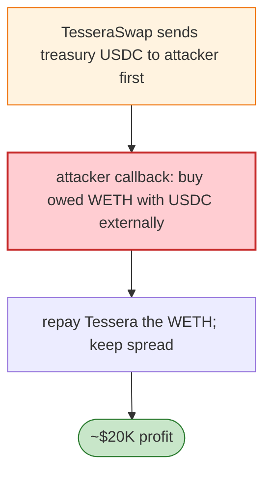

# TesseraSwap Exploit — CEI Violation: Treasury USDC Sent Before Attacker WETH Received

> **Reproduction:** the PoC compiles & runs in an isolated Foundry project at
> [this project folder](.). Full verbose trace: [output.txt](output.txt).

---

## Key info

| | |
|---|---|
| **Loss** | ~$20K (WETH/USDC spread); tx `0xc2df72ff…` |
| **Vulnerable contract** | TesseraSwap `0x5555552200…` (Base) |
| **Attacker** | `0x2352a1fc…` (contract `0x74513519…`) |
| **Chain / block / date** | Base / May 2026 |
| **Bug class** | CEI violation — TesseraSwap transferred USDC from its treasury **before** collecting WETH from the attacker's callback, letting the attacker use that USDC to buy the owed WETH externally and pocket the spread. |

---

## TL;DR

Per the embedded analysis: TesseraSwap transferred USDC from its treasury **before** collecting WETH
from the attacker callback. The attacker used the received USDC to buy the owed WETH externally (via the
WETH/USDC pool), repaid Tessera, and **kept the WETH/USDC spread**.

---

## Root cause

A **checks-effects-interactions violation**: the swap released its side of the trade before receiving
the attacker's side, turning the callback into a free flash of the treasury's USDC.

---

## Diagrams



---

## Remediation

1. Receive the inbound asset before releasing the outbound (pull-before-push), or escrow both in the
   same call.
2. `nonReentrant`; verify final balances reconcile.

---

## How to reproduce

```bash
_shared/run_poc.sh 2026-05-TesseraSwap_exp -vvvvv
```

- RPC: Base archive. Result: `[PASS]` — WETH/USDC spread captured.

---

*Reference: TesseraSwap CEI/ordering exploit, Base, May 2026 (~$20K).*
