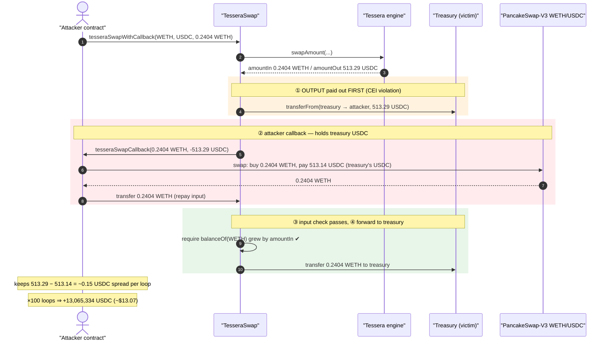
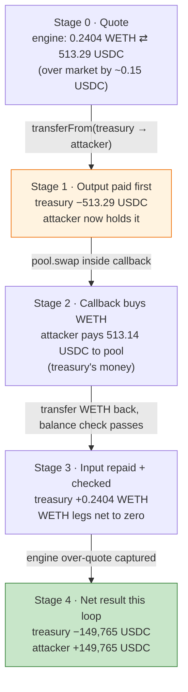
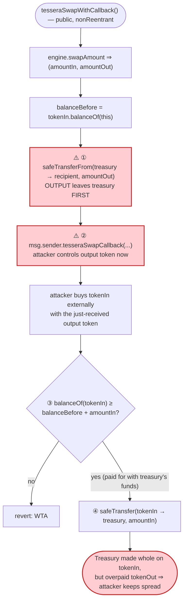
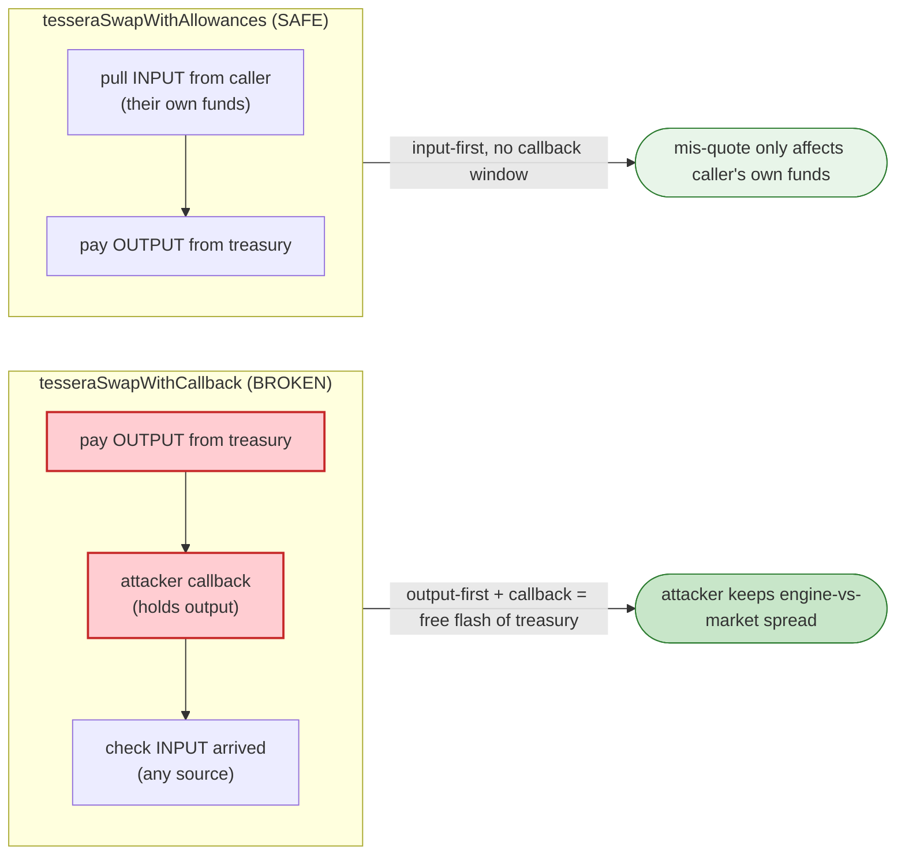

# TesseraSwap Exploit — CEI Violation: Treasury Pays the Output Token Before Collecting the Input Token

> **Reproduction:** the PoC compiles & runs in an isolated Foundry project at
> [this project folder](.). The fork is served offline from the bundled
> `anvil_state.json` (a local anvil replays Base state at the attack block), so no
> public RPC is required.
> Full verbose trace: [output.txt](output.txt).
> Verified vulnerable source: [src_TesseraSwap.sol](sources/TesseraSwap_555555/src_TesseraSwap.sol).

---

## Key info

| | |
|---|---|
| **Loss** | **13,065,334 USDC** (6-decimals raw) ≈ **$13.07** of USDC siphoned from the Tessera treasury *per attack transaction*, repeated across the campaign for the headline ~$20K. Profit asserted by the PoC for this single replayed tx: `13065334` USDC. |
| **Vulnerable contract** | `TesseraSwap` — [`0x55555522005BcAE1c2424D474BfD5ed477749E3e`](https://basescan.org/address/0x55555522005bcae1c2424d474bfd5ed477749e3e#code) (Base) |
| **Victim** | Tessera treasury wallet — [`0x3dBE077e7986657E95e1CC50089f17a5a4AF0AaE`](https://basescan.org/address/0x3dBE077e7986657E95e1CC50089f17a5a4AF0AaE) (the `tesseraTreasury` that funds every swap's output leg) |
| **Reference pool** | WETH/USDC PancakeSwap-V3 pool — [`0x6c561B446416E1A00E8E93E221854d6eA4171372`](https://basescan.org/address/0x6c561B446416E1A00E8E93E221854d6eA4171372) (used by the attacker to source the owed WETH) |
| **Attacker EOA** | [`0x2352a1FcA90182509dCa9c12B2CAd582a38E8b82`](https://basescan.org/address/0x2352a1FcA90182509dCa9c12B2CAd582a38E8b82) |
| **Attacker contract** | `0x74513519689b1fb427747624a4dd87b3849d39cd` (the on-chain deployment; the PoC re-deploys equivalent logic as `TesseraSwapAttacker`) |
| **Attack tx** | [`0xc2df72ff612c90e07c9e051e7772a39f31fb4ca9e61f5b705f921bffa26b36de`](https://basescan.org/tx/0xc2df72ff612c90e07c9e051e7772a39f31fb4ca9e61f5b705f921bffa26b36de) |
| **Chain / block / date** | Base (chainId 8453) / fork block 46,175,320 / May 2026 |
| **Compiler** | Solidity `v0.8.30+commit.73712a01`, optimizer **enabled**, **1,000,000 runs** (from `_meta.json`) |
| **Bug class** | Checks-Effects-Interactions / swap-ordering violation — the contract releases the output token from its treasury **before** verifying the input token has been collected, letting an attacker buy the owed input externally for less than what the treasury paid out and pocket the spread. |

---

## TL;DR

1. `TesseraSwap.tesseraSwapWithCallback`
   ([src_TesseraSwap.sol:46-65](sources/TesseraSwap_555555/src_TesseraSwap.sol#L46-L65)) is a router-style
   swap: a caller specifies `(tokenIn, tokenOut, amountSpecified, …)`, an off-chain "Tessera engine"
   quotes `(amountIn, amountOut)`, and the contract trades the caller's `tokenIn` for `tokenOut` paid
   out of a treasury wallet (`tesseraTreasury`).

2. The function performs the legs **out of order**. It first sends `amountOut` of `tokenOut` from the
   treasury to the recipient
   ([src_TesseraSwap.sol:59](sources/TesseraSwap_555555/src_TesseraSwap.sol#L59)), **then** invokes the
   caller's `tesseraSwapCallback`
   ([:60](sources/TesseraSwap_555555/src_TesseraSwap.sol#L60)), and only afterwards checks that the
   contract's `tokenIn` balance grew by `amountIn`
   ([:61](sources/TesseraSwap_555555/src_TesseraSwap.sol#L61)).

3. Because the recipient receives the output token *before* it must hand over the input token, the
   callback becomes a **free, intra-call flash of the treasury's output token**. The attacker uses the
   just-received USDC to buy exactly the WETH the contract demands, on an external venue, at the true
   market rate.

4. The Tessera engine quoted **513,291,572 USDC out** for **0.240439713116596060 WETH in** on the
   first loop ([output.txt:102](output.txt) / [output.txt:99](output.txt)). The attacker bought that
   exact 0.2404 WETH from the PancakeSwap-V3 WETH/USDC pool for only **513,141,807 USDC**
   ([output.txt:126](output.txt)), repaid the WETH, and kept the **149,765-wei USDC** spread per loop
   ([output.txt:131](output.txt)).

5. The PoC repeats this 100 times in one transaction
   ([TesseraSwap_exp.sol:75-91](test/TesseraSwap_exp.sol#L75-L91)). Spreads shrink slightly as the
   reference pool drifts, but the attacker still nets **13,065,334 USDC**
   ([output.txt:10262](output.txt)) — transferred to the attacker EOA at
   [output.txt:10264](output.txt) and asserted with `assertGt(13065334, 10000000)`
   at [output.txt:10279](output.txt).

6. The attacker's WETH balance is **unchanged** before and after (96,950,930,361,955,131 wei both
   times, [output.txt:7](output.txt) and [output.txt:10](output.txt)): all of the WETH is round-tripped
   inside the call. The entire profit is the accumulated USDC spread the treasury overpaid.

---

## Background — what TesseraSwap does

`TesseraSwap` ([source](sources/TesseraSwap_555555/src_TesseraSwap.sol)) is a thin on-chain settlement
layer in front of an off-chain pricing/matching service (`ITesseraEngine`). The intended model:

- A user calls a `tesseraSwap*` entry point with the tokens, a signed amount, and (for the engine) a
  blob of `swapData`. The engine
  (`0x31e99E05fee3DCE580af777C3fD63eE1B3B40c17` in the trace,
  [output.txt:61](output.txt)) returns the `(amountIn, amountOut)` that the trade should settle at.
- The contract then moves `amountOut` of `tokenOut` from a **treasury wallet** (`tesseraTreasury`,
  [src_TesseraSwap.sol:19](sources/TesseraSwap_555555/src_TesseraSwap.sol#L19)) to the recipient, and
  collects `amountIn` of `tokenIn` from the caller into the same treasury.
- Two settlement styles exist: a pull style
  (`tesseraSwapWithAllowances`,
  [:30-44](sources/TesseraSwap_555555/src_TesseraSwap.sol#L30-L44)) that uses
  `safeTransferFrom(msg.sender, …)` for the input leg, and a **callback style**
  (`tesseraSwapWithCallback`,
  [:46-65](sources/TesseraSwap_555555/src_TesseraSwap.sol#L46-L65)) that pushes the output first and then
  calls back into `msg.sender` to let it source the input. Only the callback variant is exploitable.

On-chain context at the fork block (read from the trace):

| Parameter | Value | Source |
|---|---|---|
| `tesseraTreasury` (victim) | `0x3dBE077e7986657E95e1CC50089f17a5a4AF0AaE` | [output.txt:102](output.txt) (treasury is the `from` of the USDC payout) |
| Tessera engine | `0x31e99E05fee3DCE580af777C3fD63eE1B3B40c17` | [output.txt:61](output.txt) |
| `tokenIn` | WETH `0x4200000000000000000000000000000000000006` | [TesseraSwap_exp.sol:25](test/TesseraSwap_exp.sol#L25) |
| `tokenOut` | USDC `0x833589fCD6eDb6E08f4c7C32D4f71b54bdA02913` (6 decimals) | [output.txt:48](output.txt) |
| External reference pool | PancakeSwap-V3 WETH/USDC `0x6c561B446416E1A00E8E93E221854d6eA4171372` | [TesseraSwap_exp.sol:27](test/TesseraSwap_exp.sol#L27) |
| Engine quote per loop | 0.240439713116596060 WETH in → 513,291,572 USDC out (loop 1) | [output.txt:99](output.txt) / [output.txt:102](output.txt) |
| Pool price per loop | 0.2404 WETH cost 513,141,807 USDC (loop 1) | [output.txt:126](output.txt) |

The whole exploit lives in the gap between the engine's quoted USDC-per-WETH and the live PancakeSwap-V3
USDC-per-WETH: the engine over-quotes the output by ~149,765 USDC-wei per 0.2404 WETH, and the broken
ordering lets the attacker capture that gap with zero capital.

---

## The vulnerable code

### 1. The callback swap releases the output before collecting the input

```solidity
function tesseraSwapWithCallback(
    address tokenIn,
    address tokenOut,
    int256 amountSpecified,
    uint256 amountCheck,
    address recipient,
    bytes calldata callbackData,
    bytes calldata swapData
) external nonReentrant {
    (uint256 amountIn, uint256 amountOut) = tesseraEngine.swapAmount(tokenIn, tokenOut, amountSpecified, msg.sender, swapData);
    require(amountSpecified > 0 ? amountOut >= amountCheck : amountIn <= amountCheck, "ACF");

    uint256 balanceBefore = IERC20(tokenIn).balanceOf(address(this));
    IERC20(tokenOut).safeTransferFrom(tesseraTreasury, recipient, amountOut);                 // ① OUTPUT paid out FIRST
    ITesseraSwapCallback(msg.sender).tesseraSwapCallback(int256(amountIn), -int256(amountOut), callbackData); // ② attacker callback
    require(IERC20(tokenIn).balanceOf(address(this)) >= balanceBefore + amountIn, "WTA");      // ③ INPUT only checked AFTER
    IERC20(tokenIn).safeTransfer(tesseraTreasury, amountIn);                                   // ④ forward input to treasury

    emit TesseraTrade(tokenIn, tokenOut, amountIn, amountOut, recipient);
}
```
([src_TesseraSwap.sol:46-65](sources/TesseraSwap_555555/src_TesseraSwap.sol#L46-L65))

The fatal ordering is `① → ② → ③`. Step ① ships the treasury's USDC to the recipient. Step ② hands
control to `msg.sender` (the attacker) **while the attacker is already holding that USDC**. Step ③ only
asserts that the contract *eventually* received `amountIn` of `tokenIn` — it does **not** verify the
attacker paid for it with their own funds. The attacker simply uses the treasury's USDC to buy `tokenIn`
on the open market, repays exactly `amountIn`, and walks away with whatever USDC was left over after the
purchase.

### 2. The honest, non-exploitable sibling: pull the input atomically

```solidity
function tesseraSwapWithAllowances(
    address tokenIn,
    address tokenOut,
    int256 amountSpecified,
    uint256 amountCheck,
    address recipient,
    bytes calldata swapData
) external {
    (uint256 amountIn, uint256 amountOut) = tesseraEngine.swapAmount(tokenIn, tokenOut, amountSpecified, msg.sender, swapData);
    require(amountSpecified > 0 ? amountOut >= amountCheck : amountIn <= amountCheck, "ACF");
    IERC20(tokenOut).safeTransferFrom(tesseraTreasury, recipient, amountOut);
    IERC20(tokenIn).safeTransferFrom(msg.sender, tesseraTreasury, amountIn);     // input pulled from caller, no callback
    emit TesseraTrade(tokenIn, tokenOut, amountIn, amountOut, recipient);
}
```
([src_TesseraSwap.sol:30-44](sources/TesseraSwap_555555/src_TesseraSwap.sol#L30-L44))

This variant `safeTransferFrom`s the input straight from `msg.sender`. There is no window in which the
caller controls the output token before the input is debited from *their own* balance — so the engine's
mis-quote cannot be monetised here. The callback variant recreates exactly that window.

### 3. The `balanceOf(address(this))`-based input check is the loophole

```solidity
uint256 balanceBefore = IERC20(tokenIn).balanceOf(address(this));
...
require(IERC20(tokenIn).balanceOf(address(this)) >= balanceBefore + amountIn, "WTA"); // "WTA" = wrong-token-amount
```
([src_TesseraSwap.sol:58](sources/TesseraSwap_555555/src_TesseraSwap.sol#L58) and
[:61](sources/TesseraSwap_555555/src_TesseraSwap.sol#L61))

The check is satisfied by *any* WETH arriving at the contract during the callback, regardless of its
provenance. In the trace the attacker transfers exactly `amountIn` WETH to `TesseraSwap`
([output.txt:145](output.txt)); the post-callback balance reads `240439713116596060`
([output.txt:153](output.txt)), the check passes, and the WETH is forwarded to the treasury
([output.txt:154](output.txt)). The treasury is now whole on WETH but **short on USDC** by the spread —
which is the attacker's profit.

---

## Root cause — why it was possible

Two facts compose into the loss:

1. **The output leg precedes the input leg, with an attacker callback in between (CEI violation).** A
   correct swap settles atomically or pulls the input *before* releasing the output. Here the treasury
   pays `amountOut` first ([:59](sources/TesseraSwap_555555/src_TesseraSwap.sol#L59)) and then hands the
   attacker a callback ([:60](sources/TesseraSwap_555555/src_TesseraSwap.sol#L60)). During that callback
   the attacker already holds the treasury's USDC. The only post-condition the contract enforces is "I
   ended up with `amountIn` WETH" ([:61](sources/TesseraSwap_555555/src_TesseraSwap.sol#L61)) — it never
   enforces "the WETH came from the caller's own funds" or "the USDC I paid was fairly priced."

2. **The engine over-quotes the output relative to the true market price.** The engine returned
   513,291,572 USDC for 0.2404 WETH on loop 1 ([output.txt:99](output.txt)), but that same WETH cost only
   513,141,807 USDC on PancakeSwap-V3 ([output.txt:126](output.txt)). With an honest pull-first design
   this mis-quote would merely give the *caller* a slightly good price using *their own* WETH. With the
   broken ordering, the caller funds the WETH purchase with the treasury's own USDC, so the mis-quote is
   pure profit extracted from the treasury.

The `nonReentrant` guard ([:54](sources/TesseraSwap_555555/src_TesseraSwap.sol#L54)) does **not** help:
the attack is not re-entrancy. Each loop is a clean, separate top-level call to
`tesseraSwapWithCallback`; the exploit happens entirely *inside* one call's legitimate callback window,
buying WETH on an unrelated pool. Re-entrancy guards protect against re-entering the *same* contract, not
against an attacker spending money you prematurely gave them.

---

## Preconditions

- **The callback entry point exists and pushes the output first.** Any caller can supply itself as both
  `msg.sender` and the callback target; no allowlist of callers or recipients.
- **The treasury holds and approves the output token.** `tesseraTreasury` had USDC and an allowance to
  `TesseraSwap`; the payout `transferFrom(treasury → attacker, 513,291,572)` succeeds at
  [output.txt:102](output.txt).
- **A liquid external venue prices `tokenIn`/`tokenOut` more cheaply than the engine quote.** The
  PancakeSwap-V3 WETH/USDC pool ([output.txt:114](output.txt)) lets the attacker buy the owed WETH for
  fewer USDC than the engine paid out. The spread per loop is the engine-vs-pool price gap.
- **No working capital needed.** The attacker starts and ends with the same WETH
  ([output.txt:7](output.txt) vs [output.txt:10](output.txt)) and only needs gas; the USDC used to buy
  WETH is the treasury's own, received microseconds earlier in the same call.

---

## Attack walkthrough (with on-chain numbers from the trace)

Each loop is one `tesseraSwapWithCallback(WETH, USDC, 0.2404 WETH, …)` call. All USDC amounts are raw
6-decimal integers; WETH amounts are raw 18-decimal wei. Human approximations in parentheses. The "Tessera
treasury USDC" column tracks the treasury's loss as the engine over-pays each loop.

| # | Step (loop 1 shown) | Raw amount | ~Human | Effect on treasury |
|---|------|------:|------:|--------|
| 0 | **Attacker USDC before** ([output.txt:8](output.txt)) | 636,802,314 | ~636.80 USDC | — |
| 0 | **Attacker WETH before** ([output.txt:7](output.txt)) | 96,950,930,361,955,131 | ~0.09695 WETH | — (round-tripped, ends identical) |
| 1 | Engine quotes the swap: `amountIn` WETH / `amountOut` USDC ([output.txt:99](output.txt)) | in 240,439,713,116,596,060 / out 513,291,572 | 0.2404 WETH / ~513.29 USDC | quote *exceeds* market price |
| 2 | **Treasury pays output first** — `USDC.transferFrom(treasury → attacker, 513,291,572)` ([output.txt:102](output.txt)) | 513,291,572 | ~513.29 USDC | treasury −513.29 USDC (not yet compensated) |
| 3 | Attacker `tesseraSwapCallback` fires while holding the USDC ([output.txt:111](output.txt)) | amountIn 0.2404 WETH, amountOut −513.29 USDC | — | attacker controls treasury's USDC |
| 4 | Attacker buys exactly 0.2404 WETH from PancakeSwap-V3, paying USDC ([output.txt:126](output.txt)) | 513,141,807 | ~513.14 USDC | uses treasury's USDC, not its own |
| 5 | Pool sends 0.2404 WETH to attacker ([output.txt:116](output.txt)) | 240,439,713,116,596,060 | 0.2404 WETH | — |
| 6 | Attacker repays WETH to `TesseraSwap`; balance check passes ([output.txt:145](output.txt), [:153](output.txt)) | 240,439,713,116,596,060 | 0.2404 WETH | treasury made whole on WETH |
| 7 | `TesseraSwap` forwards WETH to treasury ([output.txt:154](output.txt)) | 240,439,713,116,596,060 | 0.2404 WETH | treasury +0.2404 WETH |
| 8 | **Per-loop spread retained by attacker** (513,291,572 − 513,141,807) ([output.txt:131](output.txt)) | 149,765 | ~$0.15 | treasury net −149,765 USDC this loop |
| … | **Loops 2–100** repeat; pool drifts, spread shrinks (loop 100: out 513,286,952 / cost 513,176,263) ([output.txt:10258](output.txt), [:10223](output.txt)) | — | — | treasury keeps bleeding |
| 9 | Attacker contract's accumulated USDC after 100 loops ([output.txt:10262](output.txt)) | 13,065,334 | ~$13.07 | treasury net −13,065,334 USDC |
| 10 | Forward profit to attacker EOA ([output.txt:10264](output.txt)) | 13,065,334 | ~$13.07 | — |
| 11 | **Attacker USDC after** ([output.txt:11](output.txt)) | 649,867,648 | ~649.87 USDC | 649,867,648 − 636,802,314 = 13,065,334 |

The repeated single-call swap (no flash loan, no re-entrancy) cumulatively transfers the engine-vs-market
spread out of the Tessera treasury. The attacker's own WETH is never touched — only borrowed, bought, and
returned inside each callback.

### Profit / loss accounting (USDC, raw 6-decimal wei)

| Item | Amount (raw) | ~Human |
|---|---:|---:|
| Attacker USDC before attack ([output.txt:8](output.txt)) | 636,802,314 | ~636.80 |
| Attacker USDC after attack ([output.txt:11](output.txt)) | 649,867,648 | ~649.87 |
| **Net profit (asserted in PoC)** ([output.txt:10279](output.txt)) | **13,065,334** | **~$13.07** |
| Profit forwarded EOA←contract ([output.txt:10264](output.txt)) | 13,065,334 | ~$13.07 |
| Loop-1 treasury USDC overpaid ([output.txt:131](output.txt)) | 149,765 | ~$0.15 |
| Attacker WETH delta (before vs after) | 0 | 0 (round-tripped) |

The profit equals the sum over all 100 loops of `engine_amountOut − pool_cost_of_amountIn`. It comes
entirely from the treasury's USDC; the WETH legs net to zero. `MIN_USDC_PROFIT = 10_000_000`
([TesseraSwap_exp.sol:43](test/TesseraSwap_exp.sol#L43)) is the PoC's pass threshold, comfortably cleared
by the 13,065,334 result.

---

## Diagrams

### Sequence of one loop



### Treasury balance evolution across the loop



### The flaw inside `tesseraSwapWithCallback`



### Correct vs. broken settlement ordering



---

## Why each magic number

- **`TRACE_WETH_IN = 24_043_971_311_659_606_016`** ([TesseraSwap_exp.sol:76](test/TesseraSwap_exp.sol#L76)):
  the total WETH (~24.04 WETH) the original on-chain attacker cycled, taken from the real attack trace.
  Splitting it across 100 loops keeps each individual swap small enough that the engine quote and the
  PancakeSwap-V3 price stay close (the per-swap pool impact is tiny), maximising the captured spread while
  staying within pool liquidity.
- **`LOOP_COUNT = 100`** ([TesseraSwap_exp.sol:75](test/TesseraSwap_exp.sol#L75)) with
  **`WETH_PER_LOOP = TRACE_WETH_IN / LOOP_COUNT = 240,439,713,116,596,060`** wei (~0.2404 WETH)
  ([TesseraSwap_exp.sol:77](test/TesseraSwap_exp.sol#L77)): each loop is one independent
  `tesseraSwapWithCallback`. The trace shows this exact `amountSpecified` of `240439713116596060`
  ([output.txt:60](output.txt)) repeated 100 times.
- **`PRICE_LIMIT_MULTIPLIER = 2`** ([TesseraSwap_exp.sol:79](test/TesseraSwap_exp.sol#L79)): the
  exact-output WETH purchase on PancakeSwap-V3 is a `zeroForOne = false` swap, so the price-limit must sit
  *above* the current `sqrtPriceX96`. The PoC reads `slot0()` ([output.txt:112](output.txt)) and passes
  `sqrtPriceX96 * 2` ([TesseraSwap_exp.sol:109](test/TesseraSwap_exp.sol#L109)) — a permissive ceiling that
  never binds for these tiny amounts (e.g. limit `7,309,247,764,631,472,494,795,354` at
  [output.txt:114](output.txt)).
- **`MIN_USDC_PROFIT = 10_000_000`** ([TesseraSwap_exp.sol:43](test/TesseraSwap_exp.sol#L43)): the pass
  threshold (~$10) for `assertGt`. The realised profit `13,065,334` clears it
  ([output.txt:10279](output.txt)).
- **`amountCheck = 0`** in each call ([TesseraSwap_exp.sol:89](test/TesseraSwap_exp.sol#L89)): for a
  positive `amountSpecified` the contract only requires `amountOut >= amountCheck`
  ([src_TesseraSwap.sol:56](sources/TesseraSwap_555555/src_TesseraSwap.sol#L56)); 0 disables that
  slippage guard since the attacker wants whatever the engine quotes.
- **`FORK_BLOCK = 46_175_320`** ([TesseraSwap_exp.sol:42](test/TesseraSwap_exp.sol#L42)): the Base block
  immediately around the attack tx, so the treasury balance, engine quotes, and pool reserves match
  reality.

---

## Remediation

1. **Pull the input before releasing the output (fix the CEI ordering).** Restructure
   `tesseraSwapWithCallback` so the caller's `tokenIn` is collected — or escrowed — *before* any
   `tokenOut` leaves the treasury. If a callback is needed to let the caller source funds, send nothing
   from the treasury until after the callback has deposited `amountIn`:
   measure `balanceBefore`, call back, require the input arrived, **then** pay out the output.
2. **Charge the input to the caller, not to "whoever sends tokens."** The post-callback check only
   verifies the contract's `tokenIn` balance grew
   ([src_TesseraSwap.sol:61](sources/TesseraSwap_555555/src_TesseraSwap.sol#L61)); it should debit the
   caller's own funds (e.g. `safeTransferFrom(msg.sender, …)` as the allowance variant does) so the
   output token cannot be used to fund the input.
3. **Validate the engine quote against an independent oracle.** The exploit monetises the gap between the
   engine's `amountOut` and the true market price. Bound `amountOut`/`amountIn` to a TWAP or oracle price
   with a tight tolerance so an over-quote cannot be drained, and reject quotes that imply the caller
   profits risk-free.
4. **Prefer the allowance/pull pattern for treasury-funded swaps.** `tesseraSwapWithAllowances` is
   structurally safe because there is no window in which the caller controls the output before paying the
   input. Deprecate the callback variant, or restrict it to vetted, allowlisted integrators.
5. **Per-call and per-window treasury caps.** Even with the above, cap how much output the treasury can
   release per call and per time window, and monitor for repeated equal-size swaps from one caller (the
   100-loop signature here) to bound and detect any residual leakage.

---

## How to reproduce

The PoC runs **offline**: `createSelectFork` points at a local anvil
(`http://127.0.0.1:8548`, [TesseraSwap_exp.sol:46](test/TesseraSwap_exp.sol#L46)) that replays Base state
from the bundled `anvil_state.json` at block 46,175,320. The shared harness boots the anvil and runs the
test:

```bash
_shared/run_poc.sh 2026-05-TesseraSwap_exp --mt testExploit -vvvvv
```

- **Chain / fork:** Base (chainId 8453), block `46_175_320`, served from the local
  `anvil_state.json` — no public RPC is required.
- **EVM version:** `foundry.toml` sets `evm_version = 'cancun'`; a Cancun-capable EVM is required.
- **Result:** `[PASS] testExploit()`; the attacker's USDC rises from `636.802314` to `649.867648`, a
  net `13065334` (~$13.07) profit, cleared against `MIN_USDC_PROFIT`.

Expected tail (from [output.txt](output.txt)):

```
Ran 1 test for test/TesseraSwap_exp.sol:ContractTest
[PASS] testExploit() (gas: 89183152)
Logs:
  === Before exploit ===
   WETH Balance: 0.096950930361955131
   USDC Balance: 636.802314
  === After exploit ===
   WETH Balance: 0.096950930361955131
   USDC Balance: 649.867648

Suite result: ok. 1 passed; 0 failed; 0 skipped; finished in 23.52s (22.18s CPU time)
```

---

*Reference: defimon_alerts — https://t.me/defimon_alerts/3038 (TesseraSwap, Base, May 2026).*
