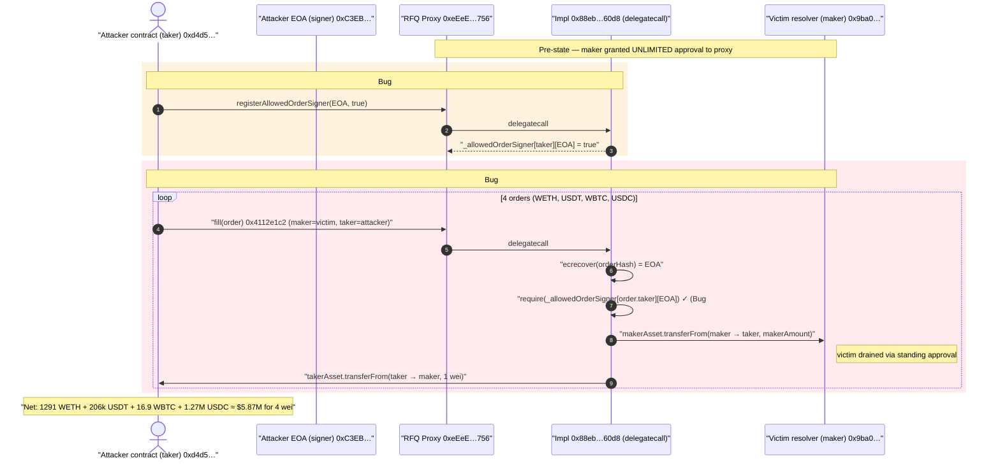
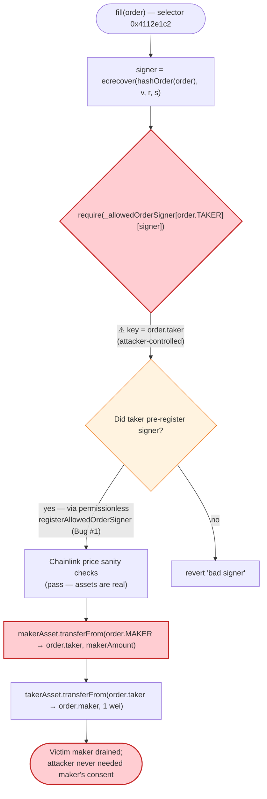
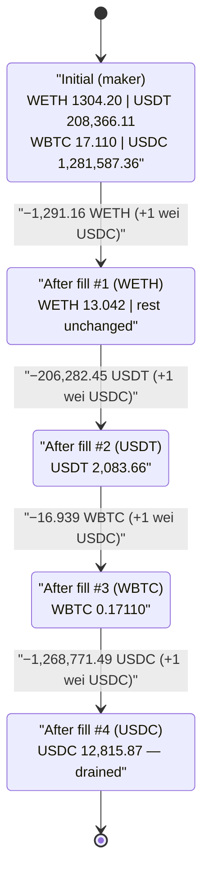

# TrustedVolumes Exploit — Permissionless Signer Registration + Wrong-Key Authorization Drains an RFQ Settlement Proxy

> **Vulnerability classes:** vuln/access-control/missing-auth · vuln/access-control/fake-account-substitution · vuln/auth/signature-validation

> **One-line summary:** An RFQ settlement proxy authorizes signed orders against the attacker-controlled `order.taker` key instead of the fund-owning `order.maker`, and lets anyone self-register an allowed signer — so an attacker signs their own orders and pulls the victim resolver's *unlimited-approved* balances out for free.

> **Reproduction:** the PoC compiles & runs in an isolated Foundry project at
> [this project folder](.). The settlement implementation is **UNVERIFIED bytecode**,
> so the PoC faithfully replays the attacker's exact on-chain calldata (the register
> call + 4 signed fill orders, with the real ECDSA signatures) against a mainnet fork
> pinned one block before the attack.
> Full verbose trace: [output.txt](output.txt).

---

## Key info

| | |
|---|---|
| **Loss** | **~$5.87M USD** — 1,291.16 WETH + 206,282.45 USDT + 16.939 WBTC + 1,268,771.49 USDC drained from the victim resolver |
| **Vulnerable contract** | TrustedVolumes RFQ settlement **proxy** — [`0xeEeEEe53033F7227d488ae83a27Bc9A9D5051756`](https://etherscan.io/address/0xeEeEEe53033F7227d488ae83a27Bc9A9D5051756) (UNVERIFIED) → delegatecalls implementation [`0x88eb28009351Fb414A5746F5d8CA91cdc02760d8`](https://etherscan.io/address/0x88eb28009351Fb414A5746F5d8CA91cdc02760d8) (UNVERIFIED) |
| **Victim (maker / resolver)** | [`0x9bA0CF1588E1DFA905eC948F7FE5104dD40EDa31`](https://etherscan.io/address/0x9bA0CF1588E1DFA905eC948F7FE5104dD40EDa31) — granted **unlimited** ERC20 approval to the proxy |
| **Attacker EOA (allowed signer + beneficiary)** | [`0xC3EBDdEa4f69df717a8f5c89e7cF20C1c0389100`](https://etherscan.io/address/0xC3EBDdEa4f69df717a8f5c89e7cF20C1c0389100) |
| **Attack contract (order `taker` / registry key)** | [`0xd4d5DB5EC65272b26F756712247281515f211e95`](https://etherscan.io/address/0xd4d5DB5EC65272b26F756712247281515f211e95) |
| **Attack tx** | [`0xc5c61b3ac39d854773b9dc34bd0cdbc8b5bbf75f18551802a0b5881fcb990513`](https://etherscan.io/tx/0xc5c61b3ac39d854773b9dc34bd0cdbc8b5bbf75f18551802a0b5881fcb990513) |
| **Chain / block / date** | Ethereum mainnet / 25,039,670 (tx index 8) / **May 7, 2026** |
| **Compiler** | n/a — implementation source unpublished (UNVERIFIED bytecode) |
| **Bug class** | Broken authorization (auth keyed on attacker-controlled field) chained with missing access control on signer registration |

References: [rekt.news](https://rekt.news/trustedvolumes-rekt) · [DarkNavy](https://www.darknavy.org/web3/exploits/trustedvolumes-rfq-proxy-drain/) · [Verichains](https://blog.verichains.io/p/trustedvolumes-exploit-analysis)

---

## TL;DR

TrustedVolumes runs an **RFQ (request-for-quote) settlement proxy**. A signed order says: a *maker* gives `makerAmount` of `makerAsset`, a *taker* gives `takerAmount` of `takerAsset`. The maker is the party whose funds physically move — the proxy pulls `makerAsset` **out of `order.maker`** via that maker's standing ERC20 approval to the proxy. To authorize this, the order must be signed by the maker, or by a key the maker has delegated to via an *"allowed order signer"* registry.

Two design flaws compose into a total drain:

- **Bug #1 — permissionless signer registration.** `registerAllowedOrderSigner(address signer, bool allowed)` (selector `0xea7faa61`) has **zero access control**. It writes `_allowedOrderSigner[msg.sender][signer] = allowed`. Anyone can register any EOA as a valid signer *for their own address*.

- **Bug #2 — authorization keyed on the wrong party.** The fill function (selector `0x4112e1c2`) recovers the order signer with `ecrecover`, then checks authorization as `_allowedOrderSigner[order.taker][recoveredSigner]` — using the **taker** (an attacker-controlled order field) as the lookup key instead of `order.maker`, who actually owns the funds.

The attacker's contract (which is itself the order `taker`) calls `registerAllowedOrderSigner(attackerEOA, true)` — setting `_allowedOrderSigner[taker][attackerEOA] = true`. It then submits four orders where `maker` = the victim resolver, `taker` = the attacker contract, `makerAsset/makerAmount` = the asset to steal, and `takerAmount` = **1 wei** of dust. Because authorization is checked against the **taker** key (which the attacker controls and just registered), the attacker-signed orders pass — even though the victim maker never signed or approved them — and the maker's unlimited-approved balances are pulled out. Four orders drain WETH, USDT, WBTC and USDC for **~$5.87M**, against a total of **4 wei** of USDC dust paid in.

---

## Background — what TrustedVolumes does

TrustedVolumes is an off-chain-quoted, on-chain-settled RFQ trading venue (a "trusted volumes" maker/resolver network). Market makers ("resolvers") quote prices off-chain and sign orders; a settlement contract atomically swaps the two sides on-chain. To make settlement cheap and to support delegated signing, resolvers grant the settlement proxy a **standing (often unlimited) ERC20 approval** and may authorize additional signing keys through an allowed-order-signer registry.

The settlement contract here is an **upgradeable proxy** (`0xeEeEEe…756`) that `delegatecall`s an implementation (`0x88eb28…60d8`). Neither contract's source is verified on Etherscan, so the canonical artifact is the on-chain bytecode and the transaction trace; the PoC reconstructs the bug by replaying the attacker's genuine calldata and signatures.

From the live trace, the fill path also performs Chainlink price sanity checks — it reads `decimals()` on each asset and `latestRoundData()` on the USDC/USD and ETH/USD feeds ([output.txt:139-152](output.txt)). These pass for legitimately-priced assets and provide no protection against the authorization bug: the assets being moved *are* real, the only thing forged is *who authorized moving them*.

---

## The vulnerable code

> The implementation at `0x88eb28009351Fb414A5746F5d8CA91cdc02760d8` is **UNVERIFIED** — `fetch_sources.sh 1 0x88eb…60d8` returns `UNVERIFIED`, as do the proxy and the victim resolver. The behavior below is reconstructed from the exact on-chain trace in [output.txt](output.txt) and the decoded calldata in the PoC ([test/TrustedVolumes_exp.sol](test/TrustedVolumes_exp.sol)). Equivalent vulnerable pseudocode:

### Bug #1 — `registerAllowedOrderSigner` has no access control

```solidity
// selector 0xea7faa61  —  cast 4byte 0xea7faa61 => registerAllowedOrderSigner(address,bool)
function registerAllowedOrderSigner(address signer, bool allowed) external {
    // ⚠️ NO onlyOwner / NO maker check — anyone can register any signer for THEMSELVES
    _allowedOrderSigner[msg.sender][signer] = allowed;
    emit AllowedOrderSignerRegistered(msg.sender, signer, allowed);
}
```

In the trace this single call writes exactly one storage slot under the implementation's storage in the proxy ([output.txt:127-132](output.txt)):

```
RFQ_Proxy::registerAllowedOrderSigner(0xC3EB…9100, true)
  0x88eb28…60d8::registerAllowedOrderSigner(0xC3EB…9100, true) [delegatecall]
    storage changes:
      @ 0x97aea019…062e: 0 → 1      // _allowedOrderSigner[taker][attackerEOA] = true
```

### Bug #2 — the fill checks authorization against `order.taker`, then pulls from `order.maker`

The order is ABI-encoded as a flat tuple (decoded from the PoC calldata, [test/TrustedVolumes_exp.sol:89-93](test/TrustedVolumes_exp.sol#L89-L93)):

```
order = [takerAsset, makerAsset, takerAmount, makerAmount, taker, maker, expiry, nonce, v, r, s, sigType]
```

```solidity
// selector 0x4112e1c2
function fill(Order calldata order) external {
    bytes32 orderHash = _hashOrder(order);
    address signer = ecrecover(orderHash, order.v, order.r, order.s);

    // ⚠️ WRONG KEY: authorization is looked up under order.taker (attacker-controlled),
    //     NOT under order.maker (the party whose funds will move).
    require(_allowedOrderSigner[order.taker][signer], "bad signer");

    // ... Chainlink price sanity checks on makerAsset / takerAsset ...

    // maker's standing approval is used to move makerAsset OUT of the maker:
    IERC20(order.makerAsset).transferFrom(order.maker, order.taker, order.makerAmount); // ⚠️ drain
    IERC20(order.takerAsset).transferFrom(order.taker, order.maker, order.takerAmount); // 1 wei dust
    emit OrderFilled(signer, orderHash, order.taker, order.nonce);
}
```

The trace shows the recovered signer is the attacker EOA, and the maker is drained while the taker pays 1 wei back ([output.txt:137-167](output.txt)):

```
ecrecover(0xc7a773cf…4305, 27, …) => 0xC3EBDdEa…0389100      // attacker EOA, authorized via Bug #1
WETH::transferFrom(VictimResolver 0x9ba0…, AttackContract 0xd4d5…, 1291161105215879179270)  // 1291.16 WETH OUT of maker
USDC::transferFrom(AttackContract 0xd4d5…, VictimResolver 0x9ba0…, 1)                         // 1 wei dust IN to maker
```

---

## Root cause — why it was possible

The settlement contract conflates *"who is allowed to authorize this order"* with *"whose funds the order moves."* In a correct RFQ design, the **maker** owns the assets (its approval is consumed) and therefore **the maker must authorize the order** — directly, or through a signer the maker has explicitly delegated. This contract instead:

1. **Authorizes against `order.taker`.** `taker` is an arbitrary, attacker-supplied field. By checking `_allowedOrderSigner[order.taker][signer]`, the contract lets *the taker* decide which signatures are valid for an order that drains *the maker*. The maker's consent is never required.

2. **Lets anyone populate that registry.** `registerAllowedOrderSigner` has no access control, so the attacker registers their own EOA as an allowed signer **for the taker key they control**. There is nothing to break in — the gate opens for free.

3. **Relies on a standing unlimited approval.** The victim resolver had granted the proxy `type(uint256).max` approval on all four assets (the trace confirms WETH allowance = `1.157e77` ≈ `uint256.max`, [output.txt:66-68](output.txt)). So once an order passes auth, the entire balance is reachable in a single `transferFrom`.

Chained: **(2) gives the attacker a valid signer, (1) makes the attacker-controlled taker field the authorization root, and (3) makes the payout the full balance.** The Chainlink price checks are irrelevant — they validate that the *price* of an order is sane, not that the *fund owner* approved it. The attacker even pays a token-correct 1 wei `takerAmount`, so any "non-zero consideration" check is satisfied.

This is the textbook *authorization-on-the-wrong-party* bug: the signature is verified correctly, but the access-control predicate is keyed to a field the attacker fully controls.

---

## Preconditions

- The victim resolver (maker) holds the assets **and** has a standing approval (here unlimited) to the proxy. ✓ (trace: WETH allowance ≈ `uint256.max`).
- The attacker can deploy a contract to act as `order.taker` (so the on-chain order signatures, which commit to `taker = that address`, verify). The PoC `vm.startPrank(TAKER)` to be that address.
- The attacker can call `registerAllowedOrderSigner` from the taker address — always true (no access control).
- The attacker can pay the dust `takerAmount` (4 wei USDC total across the 4 orders). The PoC `deal(USDC, TAKER, 4)` ([test/TrustedVolumes_exp.sol:138](test/TrustedVolumes_exp.sol#L138)).
- Orders are within their `expiry` (decoded `0x69fbe148` = 2026-05-07 00:48:08 UTC, just after the block timestamp) and use fresh `nonce`s (1..4).

No flash loan, no price manipulation, and no privileged role are required.

---

## Attack walkthrough (with on-chain numbers from the trace)

The whole exploit is the attack contract (the order `taker`) doing one registration and four fills. All figures are pulled directly from the `Transfer` events and `transferFrom` calls in [output.txt](output.txt).

| # | Action (as `taker` 0xd4d5…) | makerAsset | makerAmount drained from victim | takerAmount paid (dust) | Result |
|---|------------------------------|-----------|--------------------------------:|------------------------:|--------|
| 0 | `USDC.approve(proxy, max)` + `deal(USDC, taker, 4)` | — | — | — | Taker ready to pay dust |
| 1 | `registerAllowedOrderSigner(attackerEOA, true)` ([Bug #1]) | — | — | — | `_allowedOrderSigner[taker][attackerEOA] = true` ([output.txt:130](output.txt)) |
| 2 | `fill()` order #1 (selector `0x4112e1c2`, nonce 1) | WETH | **1,291.161105 WETH** | 1 wei USDC | [output.txt:153-167](output.txt) |
| 3 | `fill()` order #2 (nonce 2) | USDT | **206,282.446876 USDT** | 1 wei USDC | [output.txt:194-216](output.txt) |
| 4 | `fill()` order #3 (nonce 3) | WBTC | **16.93910519 WBTC** | 1 wei USDC | [output.txt:235-258](output.txt) |
| 5 | `fill()` order #4 (nonce 4) | USDC | **1,268,771.488879 USDC** | 1 wei USDC | [output.txt:279-303](output.txt) |

Each fill emits the same shaped event: `topic0 = 0x908e04b7…cc8a`, `topic1 = attacker EOA`, `topic2 = order hash`, `data = (taker, nonce)`. For order #4, `makerAsset == takerAsset == USDC`, so the victim sends 1,268,771.488879 USDC out and receives 1 wei back — net loss 1,268,771.488878 USDC.

### Victim resolver balances — before vs. after (from the trace)

| Asset | Before (maker balance) | Stolen by taker | After (maker balance) |
|-------|-----------------------:|----------------:|----------------------:|
| WETH | 1,304.203136 | **1,291.161105** | 13.042031 |
| USDT | 208,366.107956 | **206,282.446876** | 2,083.661080 |
| WBTC | 17.11020727 | **16.93910519** | 0.17110208 |
| USDC | 1,281,587.362505 | **1,268,771.488879** | 12,815.873626 |

(Before/after values: [output.txt:11-14](output.txt) and the final maker `balanceOf` calls, e.g. WETH after = `13042031365816961407` wei.)

### Profit / loss accounting

| Asset | Attacker received | Attacker paid (dust) | Net to attacker | ≈ USD |
|-------|------------------:|---------------------:|----------------:|------:|
| WETH | 1,291.161105 | — | 1,291.161105 WETH | ~$3.02M (@ $2,336.50 ETH/USD, Chainlink feed in trace) |
| USDT | 206,282.446876 | — | 206,282.446876 USDT | ~$0.21M |
| WBTC | 16.93910519 | — | 16.93910519 WBTC | ~$1.37M |
| USDC | 1,268,771.488879 | 0.000004 (4 wei) | 1,268,771.488875 USDC | ~$1.27M |
| **Total** | | **4 wei USDC** | | **~$5.87M** |

The attacker's only outlay was **4 wei of USDC**. Everything received was the victim resolver's genuine inventory.

---

## Diagrams

### Sequence of the attack



### Authorization-decision flow (where the wrong key is used)



### Victim balance evolution across the 4 fills



---

## Remediation

1. **Authorize against the fund-owning party, not the taker.** The signature check must be keyed on `order.maker` (the address whose approval is consumed): `require(signer == order.maker || _allowedOrderSigner[order.maker][signer])`. An order that moves the maker's funds must be authorized by the maker.
2. **Add access control to `registerAllowedOrderSigner`.** Only the maker itself (`msg.sender == maker` is already the registry key, which is fine) — but the *combination* with Bug #2 is what's fatal. Once authorization is keyed on the maker (fix #1), self-registration becomes harmless because the attacker cannot register a signer *for the victim maker*. Optionally restrict registration to an allow-listed set of resolvers.
3. **Bind the order hash to the maker and chain.** Use EIP-712 with the maker, both assets, both amounts, taker, expiry, nonce, `chainId`, and the verifying contract in the struct hash, and verify the recovered signer is authorized *by the maker*.
4. **Drop unlimited approvals; pull exact amounts per settlement.** Resolvers should approve only what a settlement needs, or use a per-order permit, so a single bad authorization cannot reach the entire balance.
5. **Publish and verify the implementation source.** Unverified settlement bytecode holding unlimited approvals from multiple resolvers is an unauditable, high-value target.

---

## How to reproduce

```bash
_shared/run_poc.sh 2026-05-TrustedVolumes_exp -vvvvv
```

- **RPC:** an Ethereum **archive** endpoint is required for fork block 25,039,669. The bundled Infura key in `foundry.toml` returned HTTP 401 (`invalid project id`); this project was switched to `mainnet = "https://eth.drpc.org"`, which serves historical state at that block. (Most pruned public RPCs fail with `header not found` / `missing trie node`.)
- **Result:** `[PASS] testExploit()` — the victim resolver is drained of WETH/USDT/WBTC/USDC and the attack contract receives exactly the expected amounts (`assertEq` on each).

Expected tail:

```
[Bug #2] Attacker-signed orders accepted; victim maker drained.
Stolen by attack contract:
  WETH: 1291161105215879179270
  USDT: 206282446876
  WBTC: 1693910519
  USDC: 1268771488879

Approx USD value (round figures): ~$5.87M

Exploit reproduced: unlimited maker approval + permissionless signer + wrong-key auth = full drain.

Ran 1 test for test/TrustedVolumes_exp.sol:TrustedVolumesExploit
[PASS] testExploit() (gas: 767838)
Suite result: ok. 1 passed; 0 failed; 0 skipped
```

---

*Note on sources:* the RFQ proxy, its implementation, and the victim resolver are all **UNVERIFIED** on Etherscan (`fetch_sources.sh` returned `UNVERIFIED` for all three), so this PoC reproduces the exploit by replaying the attacker's exact on-chain calldata and ECDSA signatures rather than re-deriving them from source. The vulnerable-code section above is reconstructed from the decoded calldata and the live execution trace in [output.txt](output.txt).

*Reference: rekt.news — https://rekt.news/trustedvolumes-rekt (TrustedVolumes, Ethereum, ~$5.87M).*
