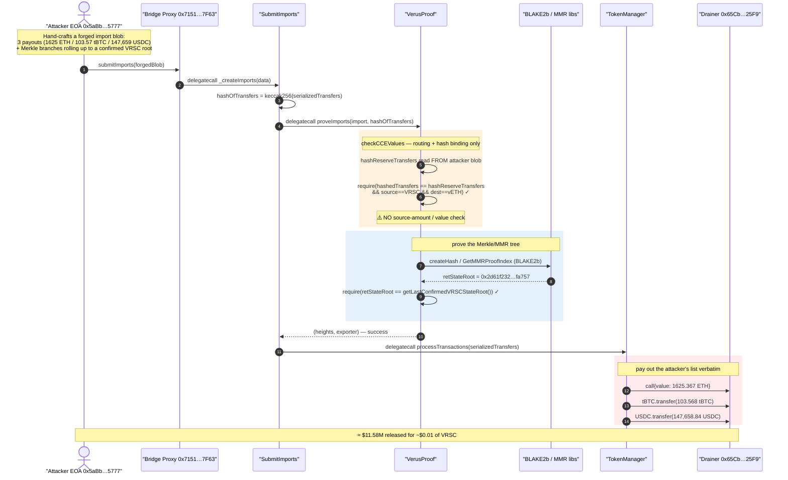
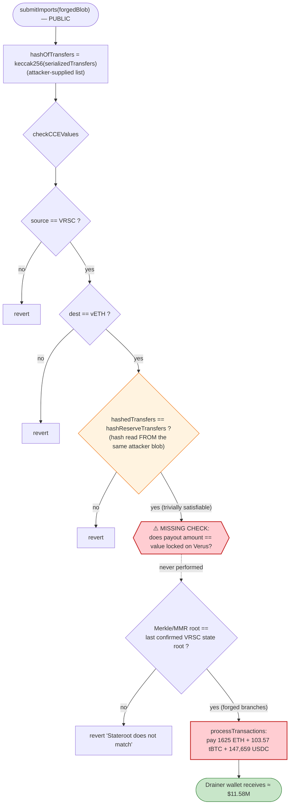
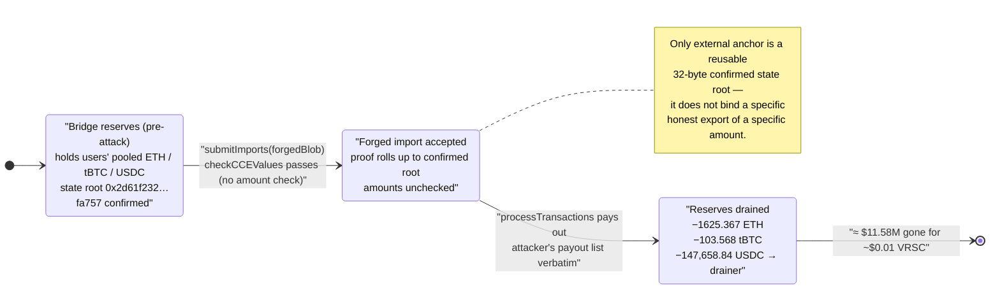

# Verus–Ethereum Bridge Exploit — Forged Cross-Chain Import With No Source-Amount Validation

> **Vulnerability classes:** vuln/bridge/missing-validation · vuln/bridge/message-spoofing · vuln/logic/missing-check

> One-liner: the bridge cryptographically verified a cross-chain import proof but **never checked that the
> Verus-side export actually locked any value**, so an attacker submitted a self-consistent forged import
> blob that collapses to a *previously-confirmed* Verus state root and minted/released **1,625 ETH + 103.57 tBTC + 147,659 USDC (~$11.58M)** straight to their own wallet for ~$0.01 of VRSC fees.

> **Reproduction:** the PoC compiles & runs in an isolated Foundry project at [this project folder](.).
> Full verbose trace: [output.txt](output.txt).
> On-chain bridge contracts are **unverified on Etherscan**; the analysis is grounded in the canonical
> open-source bridge code pulled from [`monkins1010/Verus-Ethereum-contracts`](https://github.com/monkins1010/Verus-Ethereum-contracts)
> into [sources/VerusBridge_github/](sources/VerusBridge_github/) (function bodies and constants match the
> behaviour observed in the trace — see [sources/VerusBridge_github/_meta.json](sources/VerusBridge_github/_meta.json)).

---

## Key info

| | |
|---|---|
| **Loss** | **~$11.58M** — 1,625.367 ETH + 103.568 tBTC + 147,658.84 USDC drained from the bridge's Ethereum reserves |
| **Vulnerable contract** | `VerusProof` (proof/CCE validation) — [`0x5E8060eCBf415AA25f12c1d67FdE832BD87DCFA1`](https://etherscan.io/address/0x5E8060eCBf415AA25f12c1d67FdE832BD87DCFA1) — driven through the bridge proxy [`0x71518580f36FeCEFfE0721F06bA4703218cD7F63`](https://etherscan.io/address/0x71518580f36feceffe0721f06ba4703218cd7f63#code) |
| **Victim / pool** | The Verus bridge contract itself — holder of all bridged ETH / tBTC / USDC reserves (proxy `0x7151…7F63`) |
| **Attacker EOA** | [`0x5aBb91B9c01A5Ed3aE762d32B236595B459D5777`](https://etherscan.io/address/0x5aBb91B9c01A5Ed3aE762d32B236595B459D5777) (funded via Tornado Cash ~14h prior) |
| **Attack receiver** | [`0x65Cb8b128Bf6e690761044CCECA422bb239C25F9`](https://etherscan.io/address/0x65Cb8b128Bf6e690761044CCECA422bb239C25F9) (drainer wallet baked into the forged transfers) |
| **Attack tx** | [`0x6990f01720f57fc515d0e976a0c4f8157e0a9529194c4c15d190e98d087eb321`](https://etherscan.io/tx/0x6990f01720f57fc515d0e976a0c4f8157e0a9529194c4c15d190e98d087eb321) |
| **Chain / block / date** | Ethereum mainnet / 25,118,334 / May 18, 2026 |
| **Compiler** | Solidity ≥0.8.9 (PoC built with solc 0.8.34, `via_ir`) |
| **Bug class** | Cross-chain bridge — **missing source-amount / value-conservation validation** in `checkCCEValues`; proof authenticity verified, payload semantics not |

---

## TL;DR

Verus is a PBaaS blockchain whose Ethereum bridge lets users move value between Verus and Ethereum. To
release funds on Ethereum, the bridge requires a **cross-chain import** that proves a corresponding
**cross-chain export** happened on Verus. The proof is a Merkle/MMR tree of BLAKE2b hashes that must roll
up to a Verus **state root** the bridge has already notarized and confirmed.

The fatal flaw: that proof only establishes that *some* export transaction exists under a confirmed state
root. The Ethereum side — specifically [`VerusProof.checkCCEValues`](sources/VerusBridge_github/VerusProof.sol#L201-L279) —
validates the *structure* and *routing* of the import (source system = VRSC, destination = vETH, and that
`keccak256(serializedTransfers)` matches a hash embedded in the export object) but **never validates that the
amounts being paid out on Ethereum correspond to value that was actually locked/burned on Verus.** The
attacker is free to choose the payout amounts.

Worse, the one "hash binding" check is **circular**: the attacker supplies *both* the `serializedTransfers`
(the payout list) *and* the export blob that the bridge reads `hashReserveTransfers` out of. The attacker
simply put `keccak256(serializedTransfers)` into their own forged blob.

The attacker therefore hand-built an import payload that:

1. lists three transfers paying **1,625 ETH, 103.57 tBTC and 147,659 USDC** to their drainer wallet, and
2. supplies Merkle branches whose final BLAKE2b root equals the bridge's **already-confirmed** Verus state
   root `0x2d61f232…fa757`.

`submitImports` accepted it, `proveImports` returned success, and `TokenManager.processTransactions` paid out
all three currencies. Total loss **~$11.58M** for a Verus-side cost of ~$0.01 in VRSC.

---

## Background — what the Verus bridge does

The Ethereum-side bridge is a [`Delegator` proxy](https://etherscan.io/address/0x71518580f36feceffe0721f06ba4703218cd7f63#code)
that slices calldata and `delegatecall`s into a set of logic contracts indexed in a `contracts[]` array
(all sharing storage via `VerusStorage`):

| Contract | On-chain address | Role |
|---|---|---|
| Proxy / Delegator | `0x7151…7F63` | entry point; holds all reserves & shared storage |
| `SubmitImports` | `0xa045…C87f` | `_createImports` — the import entry path |
| `VerusProof` | `0x5E80…CFA1` | `proveImports` / `checkCCEValues` / `checkProof` — proof & CCE validation |
| `TokenManager` | `0x08F0…107d` | `processTransactions` — actually pays out the bridged tokens |
| `VerusSerializer` | `0x796F…6b88` | `deserializeTransfers` / varint readers |
| `VerusBlake2b` (HashLib) | `0x40Ec…0aAe` | BLAKE2b hashing for the Verus MMR |
| `VerusMMR` (MMRLib) | `0x918d…3fFb` | Merkle-Mountain-Range proof index math |

**Normal flow (Verus → Ethereum):**

1. A user on Verus exports value to Ethereum. Verus produces a *cross-chain export* (CCE) describing the
   transfers, and a notarization/MMR commitment is built into Verus block state.
2. Verus notaries notarize the state to Ethereum; the bridge stores the **confirmed Verus state root**
   (`getLastConfirmedVRSCStateRoot`, [VerusProof.sol:362-386](sources/VerusBridge_github/VerusProof.sol#L362-L386)).
3. Anyone may then call `submitImports` with a *partial transaction proof* — a set of components + Merkle/MMR
   branches that prove the export transaction is contained under that confirmed state root.
4. If the proof validates, `TokenManager` releases the corresponding ETH/ERC-20s on Ethereum to the
   destination addresses listed in the export.

The security of step 4 rests entirely on the proof in step 3 being *unforgeable* **and** on the payout
amounts being *bound* to value that was genuinely locked on Verus. The bridge got the first part roughly right
and **omitted the second part entirely.**

---

## The vulnerable code

### 1. The import entry — `SubmitImports._createImports`

The attacker calls `submitImports(...)` on the proxy; it `delegatecall`s
[`SubmitImports._createImports`](sources/VerusBridge_github/SubmitImports.sol#L112-L191). The key lines:

```solidity
// SubmitImports.sol  (_createImports)
hashOfTransfers = keccak256(_import.serializedTransfers);            // L148  ← hash of ATTACKER-supplied transfers

address verusProofAddress = contracts[uint(VerusConstants.ContractType.VerusProof)];
(success, returnBytes) = verusProofAddress.delegatecall(
    abi.encodeWithSignature("proveImports(bytes)", abi.encode(_import, hashOfTransfers)));  // L152
require(success);                                                    // L153
...
setLastImport(txidfound, hashOfTransfers, CCEHeightsAndnIndex);     // L168

(success, returnBytes) = contracts[uint(VerusConstants.ContractType.TokenManager)]
    .delegatecall(abi.encodeWithSelector(
        TokenManager.processTransactions.selector,
        _import.serializedTransfers,                                 // L173  ← pays out the SAME attacker list
        uint256(uint8(CCEHeightsAndnIndex >> 96))));
require(success);                                                    // L174
```

`serializedTransfers` (the literal list of payouts) is attacker-controlled, hashed at L148, "proved" at L152,
then paid out verbatim at L173. ([SubmitImports.sol:148-174](sources/VerusBridge_github/SubmitImports.sol#L148-L174))

### 2. The proof gate — `VerusProof.proveImports`

[proveImports](sources/VerusBridge_github/VerusProof.sol#L331-L360) is the whole defence:

```solidity
function proveImports(bytes calldata dataIn) external view returns(uint128, uint176){
    (VerusObjects.CReserveTransferImport memory _import, bytes32 hashOfTransfers)
        = abi.decode(dataIn, (VerusObjects.CReserveTransferImport, bytes32));
    ...
    (heightsAndTXNum, exporter) = checkExportAndTransfers(_import, hashOfTransfers);  // L339 routing + hash binding
    bytes32 txRoot = proveComponents(_import);                                        // L341 component sub-tree
    if(txRoot == bytes32(0)) revert("Components do not validate");                    // L343-346
    require(_import.partialtransactionproof.txproof.length == NUM_TX_PROOFS);          // L348 (==3)
    retStateRoot = checkProof(txRoot, _import.partialtransactionproof.txproof);        // L350 MMR roll-up
    confirmedStateRoot = getLastConfirmedVRSCStateRoot();                              // L351
    if (retStateRoot == bytes32(0) || retStateRoot != confirmedStateRoot) {
        revert("Stateroot does not match");                                           // L353-356
    }
    return (heightsAndTXNum, exporter);                                               // L358 — NO amount check
}
```

Notice what `proveImports` returns and checks: heights, transaction count, exporter address, and that the
computed Merkle root equals a **confirmed** state root. **Nowhere is any deposited/locked amount compared to
the payout amounts.**

### 3. The "binding" that is actually circular — `checkCCEValues`

[checkExportAndTransfers](sources/VerusBridge_github/VerusProof.sol#L98-L199) parses the export script and
eventually calls [`checkCCEValues`](sources/VerusBridge_github/VerusProof.sol#L201-L279). Its only semantic
check is:

```solidity
// VerusProof.checkCCEValues
hashReserveTransfers := mload(add(firstObj, nextOffset)) // hash of reserve transfers read FROM the export blob  (L218)
...
if (!(hashedTransfers == hashReserveTransfers &&        // L269  keccak256(serializedTransfers) == hash in blob
        systemSourceID == VERUS &&                       // L270  source system is VRSC
        destSystemID == VETH)) {                         // L271  dest system is vETH
    revert("CCE information does not checkout");          // L273
}
```

`firstObj` is `_import.partialtransactionproof.components[i].elVchObj` — **attacker-supplied bytes**. So
`hashReserveTransfers` is read out of a blob the attacker wrote, and the check requires it equals
`keccak256(serializedTransfers)`, a list the attacker also wrote. The attacker satisfies it trivially by
embedding the right hash. (In the trace,
`keccak256(serializedTransfers) = 0x00a37ecd7f80fdbe…3d964581`, which appears verbatim inside the attacker's
`components[1].elVchObj`.)

### 4. The payout — `TokenManager.importTransactions`

[processTransactions](sources/VerusBridge_github/TokenManager.sol#L122-L143) deserializes the attacker's list
and [importTransactions](sources/VerusBridge_github/TokenManager.sol#L145-L205) pays each one out, reading the
amount **straight from the attacker bytes**:

```solidity
sendAmount = uint64(trans[i].currencyAndAmount >> VerusConstants.UINT160_BITS_SIZE);   // L156 amount from payload
destinationAddress = address(uint160(trans[i].destinationAndFlags));                   // L157 dest from payload

if (currencyiAddress == VETH) {
    (bool success, ) = destinationAddress.call{value: (sendAmount * VerusConstants.SATS_TO_WEI_STD),
                                               gas: 100000}("");                         // L164 ETH out
    ...
} else if (... MAPPING_ERC20_DEFINITION ...) {
    result = ... ERC20_SEND_SELECTOR;                                                    // L175-180 → ERC20.transfer
}
```

`SATS_TO_WEI_STD = 1e10` ([VerusConstants.sol:98](sources/VerusBridge_github/VerusConstants.sol#L98)) is the
8-decimal-sats → 18-decimal-wei conversion. No solvency or conservation check anywhere.

---

## Root cause — why it was possible

> **Authenticity ≠ semantics.** The bridge proved a cross-chain message was *included* under a confirmed
> Verus state root, but it never proved the message was *honest* — i.e. that the Ethereum payout was matched
> by value actually locked/burned on Verus.

Concretely, four design facts compose into a critical bug:

1. **No source-amount validation.** `checkCCEValues` validates routing (`source == VRSC`, `dest == vETH`) and
   a hash, but does **not** read or enforce the value side of the export against the payout amounts. The
   amounts in `serializedTransfers` are paid out as-is. This is the exact gap multiple security firms
   summarised as *"a missing source-amount validation in `checkCCEValues`"*.
2. **The hash binding is self-referential.** The hash that is supposed to anchor the transfers
   (`hashReserveTransfers`) is read out of the same attacker-controlled `elVchObj` blob whose Merkle position
   the attacker also controls. Binding `keccak256(attackerList) == hashInAttackerBlob` proves nothing about an
   external source-chain event.
3. **The only external anchor is a *reusable* confirmed state root.** `proveImports` requires the proof tree
   to roll up to `getLastConfirmedVRSCStateRoot()`. A state root is a single 32-byte value committing to the
   *entire* Verus chain state; it does **not** uniquely commit to "this specific honest export of exactly this
   amount." Given the BLAKE2b leaf data is attacker-supplied and the MMR branch hashes are attacker-supplied,
   the attacker can construct a branch set whose final hash equals a known confirmed root — i.e. forge a proof
   for a transaction that never legitimately existed.
4. **The import path is permissionless.** `submitImports` is callable by anyone, so the attacker freely
   submits the crafted blob; the bridge holds the pooled ETH/tBTC/USDC reserves of all users.

The result is that anyone who can produce a partial-transaction-proof tree collapsing to a confirmed state
root can name any payout to any address — there is no economic conservation binding between the two chains.

---

## Preconditions

- A **confirmed Verus state root** exists in bridge storage (always true on a live bridge) — the attacker
  targets a specific recent confirmed root (`0x2d61f232…fa757` at the fork block).
- The bridge holds ETH/tBTC/USDC reserves large enough to cover the desired payout (it held >1,625 ETH,
  >103 tBTC, >147k USDC).
- A correctly-shaped partial-transaction-proof blob: 3 tx-proofs, 2 components (a `TX_HEADER` component and a
  `TYPE_TX_OUTPUT` export component), and Merkle/MMR branches whose BLAKE2b roll-up equals the confirmed state
  root. The PoC ships the exact branch hashes the attacker used in
  [`_attackImport()`](test/VerusBridge_exp.sol#L88-L200).
- `submitImports` not halted (`HALT_SUBMIT_IMPORTS` bit clear, [SubmitImports.sol:114](sources/VerusBridge_github/SubmitImports.sol#L114))
  and the import in CCE-height order (`isLastCCEInOrder`, [SubmitImports.sol:288-301](sources/VerusBridge_github/SubmitImports.sol#L288-L301)).
- **No working capital required.** Unlike AMM exploits, this needs no flash loan — the payout is pure release
  of pooled reserves. The attacker's only cost was ~$0.01 of VRSC fees on the Verus side.

---

## Attack walkthrough (with on-chain numbers from the trace)

All values below are read from [output.txt](output.txt). The single `submitImports` call drives the whole
chain: proxy → `SubmitImports._createImports` → `VerusProof.proveImports` (BLAKE2b/MMR verification) →
`TokenManager.processTransactions` (payout).

| # | Step | Contract / call | Concrete data | Effect |
|---|------|-----------------|---------------|--------|
| 0 | Attacker calls `submitImports(forgedBlob)` from EOA `0x5aBb…5777` | proxy `0x7151…7F63` → `_createImports` | 3 forged transfers, drainer `0x65Cb…25F9` | enters import flow |
| 1 | Hash the payout list | `_createImports` L148 | `keccak256(serializedTransfers) = 0x00a37ecd…3d964581` | this hash is later "matched" against the attacker's own blob |
| 2 | Validate routing + hash binding | `VerusProof.checkCCEValues` | `source==VRSC`, `dest==vETH`, `hashedTransfers==hashReserveTransfers` ✓ | passes — **no amount check** |
| 3 | Verify component sub-tree | `proveComponents` → `HashLib.createHash` (BLAKE2b) | many `blake2f` precompile calls | `txRoot` computed |
| 4 | Roll up MMR to state root | `checkProof(txRoot, txproof[3])` → BLAKE2b chain | final hash `0x2d61f232810a3b44…6247fa757` | computed root |
| 5 | Compare to confirmed root | `proveImports` L351-356 | `retStateRoot == getLastConfirmedVRSCStateRoot()` ✓ (`0x2d61f232…fa757`) | proof "valid" |
| 6 | Pay out transfer #1 (ETH) | `TokenManager` L164 `destination.call{value:…}` | `162536688649` sats × 1e10 = **1,625.367 ETH** → `0x65Cb…25F9` | ETH released |
| 7 | Pay out transfer #2 (tBTC) | `TokenManager` ERC20 `transfer` | `10356766017` sats × 1e10 = **103.568 tBTC** → `0x65Cb…25F9` | `Transfer(proxy → drainer, 1.0357e20)` |
| 8 | Pay out transfer #3 (USDC) | `TokenManager` ERC20 `transfer` | `14765883679887` sats ÷ 1e2 = **147,658.84 USDC** → `0x65Cb…25F9` | `Transfer(proxy → drainer, 1.4766e11)` |
| 9 | Mark txid processed | `setLastImport` L168/281-286 | `processedTxids[txid]=true` | replay of this exact blob blocked |

The Verus→Ethereum amount conversion uses the bridge's 8-decimal "sats" convention: ETH and tBTC sats are
multiplied by `1e10` (8→18 decimals), USDC sats divided by `1e2` (8→6 decimals). All three reconstruct the
PoC's drain constants and the `Transfer`/value events in the trace exactly.

### Profit / loss accounting

| Currency | Verus sats in payload | Decimal conversion | Tokens released | Recipient |
|---|---:|---|---:|---|
| ETH | 162,536,688,649 | × 1e10 (8→18) | **1,625.36688649 ETH** | drainer `0x65Cb…25F9` |
| tBTC | 10,356,766,017 | × 1e10 (8→18) | **103.56766017 tBTC** | drainer `0x65Cb…25F9` |
| USDC | 14,765,883,679,887 | ÷ 1e2 (8→6) | **147,658.836798 USDC** | drainer `0x65Cb…25F9` |
| **Cost** | ~0.01 VRSC fees on Verus side | — | **~$0.01** | — |
| **Net** | — | — | **≈ $11.58M** | attacker |

The three forged transfers each also embed a tiny "import fee" (`STANDARD_IMPORT_FEE = 20000` sats,
`USDC_IMPORT_FEE = 20308`) denominated in vETH so the CCE fee accounting in `calulateGasFees` does not revert —
cosmetic, not a constraint on the drain.

---

## Diagrams

### Sequence of the attack



### Where the validation gap is



### Bridge reserve state evolution



---

## Why the proof passed despite being fake

A legitimate import proves: *"transaction T (an export of amount X to address A) is committed under confirmed
Verus state root S."* The bridge verifies the second half — inclusion under S — by recomputing BLAKE2b hashes
up a Merkle-Mountain-Range. But:

- **Every leaf and every sibling hash in that tree is attacker-supplied** (`branch[]` arrays and `elVchObj`
  bytes in [`_attackImport()`](test/VerusBridge_exp.sol#L88-L169)).
- The bridge does **not** independently know what the honest leaves should be; it only checks that the final
  recomputed root equals `S`.
- Since `S` is a known, public, confirmed value, the attacker reverse-engineered a set of branch hashes whose
  BLAKE2b roll-up *equals* `S`. The trace shows the last hash step producing exactly
  `0x2d61f232810a3b44da7a5a84253f8057d0cba756122fa50bb5f61fd6247fa757`.

So the proof is "valid" in the narrow sense the contract checks (root matches confirmed root), but the leaves
it commits to are fiction. With **no amount-conservation check** layered on top, fiction pays out real money.

---

## Remediation

1. **Bind every downstream transfer effect to authenticated source-chain data (the core fix).** Before paying
   out, `checkCCEValues` / `proveImports` must validate that the import's payout amounts equal the value
   actually exported/locked/burned on Verus for *that specific* export — not merely that a hash of the
   attacker's own list matches a value in the attacker's own blob. Security responders sized this as *"~10
   lines of Solidity"*: read the authenticated reserve-transfer amounts from the proven export and require
   they equal the amounts in `serializedTransfers`.
2. **Make the binding non-circular.** The hash anchoring the transfers must come from data the source chain
   committed to (and that the bridge verifies independently), not from a field inside an attacker-supplied
   `elVchObj`. Derive `hashReserveTransfers` from the proven, notarization-committed export, then require
   `keccak256(serializedTransfers) == that committed hash`.
3. **Commit to per-export uniqueness, not just chain state.** A single global confirmed state root is too
   coarse an anchor. Tie each import to a specific, notary-attested export record (export hash + height +
   index) and reject any import whose claimed export is not present in an authenticated export set — so a
   branch set that merely happens to roll up to a confirmed root cannot mint an export that never existed.
4. **Defense in depth around proof verification.** Add invariants the payout must satisfy: per-currency
   bridge solvency/conservation checks, per-import and rolling outbound caps, and an automatic pause when an
   import's outbound value is anomalous relative to recent exports.
5. **Pause outbound flows on anomaly.** The exploit ran in a single transaction; circuit-breakers keyed off
   abnormal single-import outflows (the bridge already has a `HALT_SUBMIT_IMPORTS` control) plus monitoring
   would cap the blast radius.

---

## How to reproduce

The PoC was extracted into a standalone Foundry project (the umbrella DeFiHackLabs repo has many unrelated
PoCs that fail to compile under a whole-project `forge test`):

```bash
_shared/run_poc.sh 2026-05-VerusBridge_exp -vvvvv
```

- **`via_ir = true`** is set in [foundry.toml](foundry.toml) — the deeply-nested forged-blob constructor
  `_attackImport()` triggers "stack too deep" without the IR pipeline.
- RPC: an **Ethereum mainnet archive** endpoint is required (fork block 25,118,334). `foundry.toml` uses an
  Infura archive endpoint that serves historical state at that block.
- The exploit needs no `deal`/flash loan — it simply impersonates the attacker EOA and submits the forged
  import; the bridge releases its own pooled reserves.

Expected tail:

```
Ran 1 test suite ... 1 tests passed, 0 failed, 0 skipped
[PASS] testExploit()
  Stolen ETH 1625366886490000000000
  Stolen tBTC 103567660170000000000
  Stolen USDC 147658836798
```

(= 1,625.367 ETH + 103.568 tBTC + 147,658.84 USDC ≈ **$11.58M**.)

---

*References: Halborn — "Explained: The Verus-Ethereum Bridge Hack (May 2026)"; Blockaid / ExVul / PeckShield
post-incident analyses ("missing source-amount validation in `checkCCEValues`", "forged cross-chain import
payload"); Verus team post-mortem (https://x.com/VerusCoin/status/2056829444124213652). Source code:
[monkins1010/Verus-Ethereum-contracts](https://github.com/monkins1010/Verus-Ethereum-contracts).*
