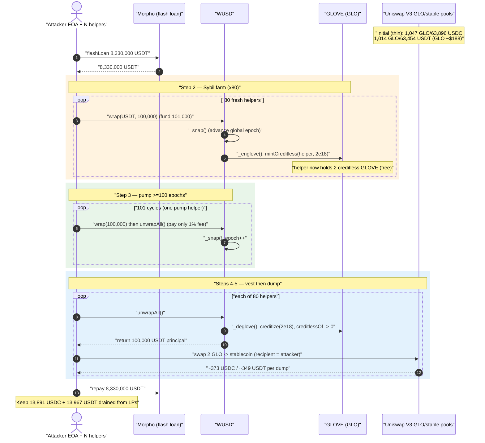
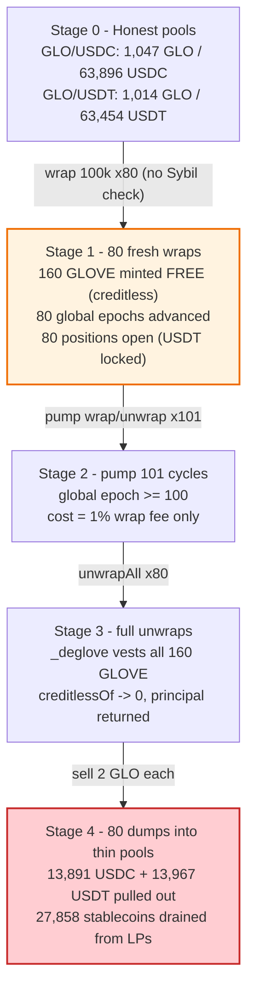
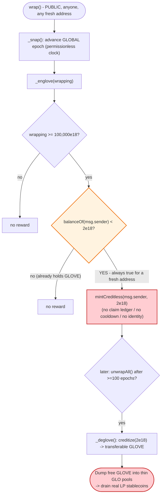

# WUSD Exploit — Sybil-Farmable `_englove()` Reward Mint + Thin-Pool GLO Drain

> One-line summary: WUSD's `wrap()` hands every fresh address ~2 "creditless" GLOVE tokens with **no Sybil resistance, no claim ledger, and no identity binding**; an attacker spins up dozens of throwaway addresses, vests their GLOVE by pumping the global epoch counter, and dumps the freely-minted GLO into two razor-thin Uniswap-V3 GLO pools — draining real LP stablecoins.

> **Reproduction:** the PoC compiles & runs as a passing test in an isolated Foundry project at [this project folder](.). Full verbose trace: [output.txt](output.txt). Recon log (pool reserves + vesting proof): [recon_output.txt](recon_output.txt).
> Verified vulnerable source: [contracts_WUSD.sol](sources/WUSD_068E35/contracts_WUSD.sol). Reward token: [contracts_Glove.sol](sources/Glove_70c5f3/contracts_Glove.sol).

---

## Key info

| | |
|---|---|
| **Loss** | Reported ~$200K-class incident (free GLOVE emissions + LP drain across the on-chain campaign). **Per 80-address batch reproduced on-fork: 27,858 stablecoins drained** (13,891 USDC + 13,967 USDT) + 160 GLOVE (~$30K of incentives) minted for free |
| **Vulnerable contract** | `WUSD` (Wrapped USD) — [`0x068E3563b1c19590F822c0e13445c4FA1b9EEFa5`](https://etherscan.io/address/0x068E3563b1c19590F822c0e13445c4FA1b9EEFa5#code) (`_englove` reward path) |
| **Reward token** | `Glove` / `GLO` — [`0x70c5f366dB60A2a0C59C4C24754803Ee47Ed7284`](https://etherscan.io/address/0x70c5f366dB60A2a0C59C4C24754803Ee47Ed7284#code) |
| **Victim pools** | Uniswap V3 GLO/USDC `0xB89F65D6c7d33A35Da7C01934e310a6f40E18A1f` (1% fee) and GLO/USDT `0xa2Bd1A142ff49131B8CC70A332bdA0125018c324` (1% fee) |
| **Attacker EOA** | `0x88329A09428778F62BC0C8BAac0997864E5a57f8` |
| **Attacker contracts** | CREATE2 helper "Wrapper" clones, ~80 per tx (e.g. `0x7ec5a4dc…`, `0xa5f28cc3…`) |
| **Attack tx** | `0x2051c1f8d43730c41cc353b5dffd8cc59f96cb1ca56fdce4b28fb127bdb37712` |
| **Chain / block / date** | Ethereum mainnet / 25,170,426 / May 25, 2026 |
| **Compiler** | Solidity v0.8.17, optimizer disabled (200 runs metadata) |
| **Bug class** | Incentive abuse / unbounded reward minting (no Sybil resistance) → economic value extraction via LP drain |

---

## TL;DR

`WUSD.wrap()` mints WUSD against a stablecoin (USDT/USDC) and, as a reward, calls the internal `_englove()` routine to **mint free GLOVE** ([contracts_WUSD.sol:309-318](sources/WUSD_068E35/contracts_WUSD.sol#L309-L318)).

Eligibility for the GLOVE reward depends **only** on the caller's *current* GLOVE balance and the size of the wrap:

```solidity
function _englove (uint256 wrapping) internal {
    uint256 gloves = IGlove(_GLOVE).balanceOf(msg.sender);
    if (wrapping >= _MIN_GLOVABLE && gloves < _MAX_GLOVE) {        // 100e18  &&  < 2e18
        IGlove(_GLOVE).mintCreditless(msg.sender, Math.min(
            _MAX_GLOVE - gloves,
            wrapping > 1_000e18 ? ((_MAX_GLOVE * wrapping) / _EPOCH)
                                : ((_MID_GLOVE * wrapping) / 1_000e18)));
    }
}
```

There is **no per-address claim record, no cooldown, no KYC/identity binding, no nonce, and no global rate-limit.** A brand-new address always holds `0 GLOVE < _MAX_GLOVE (2e18)`, so it *always* qualifies. Wrapping `>= 100,000 WUSD` (where `(2e18 * 100_000e18)/100_000e18 = 2e18`) max-caps the reward at the full **2 GLOVE** per fresh address, every time.

The minted GLOVE is "creditless" (soulbound) and only becomes transferable via `unwrap()`→`_deglove()`, proportional to how many **global epochs** elapsed since the wrap. Each 100,000-WUSD wrap advances the global epoch by one (`_snap`), and full vesting needs 100 epochs. So the attacker batches Sybil wraps, then runs a short loop of extra wrap/unwrap "pump" cycles to advance ≥100 epochs, then unwraps every Sybil in full — vesting all the free GLOVE.

Each helper then dumps its 2 GLOVE into one of two **extremely thin** Uniswap-V3 GLO pools (≈1,000 GLO + ~$63K stables each). Because the pools are so shallow, 80 sybils × 2 GLOVE = 160 GLOVE of *free* inventory sells off for **27,858 real LP stablecoins** while the attacker pays only WUSD's 1% wrap fee. Repeated across the campaign, this is the documented ~$200K incident.

---

## Background — what WUSD does

`WUSD` ([source](sources/WUSD_068E35/contracts_WUSD.sol)) is a "Wrapped USD" stablecoin: deposit a whitelisted fiatcoin (USDT/USDC/etc.), receive 18-decimal WUSD 1:1 (normalized), minus a 1% wrap fee.

- **wrap(fiatcoin, amount, referrer)** — pulls `amount + 1% fee`, mints `amount` (normalized to 18 dec) WUSD, and pays a GLOVE reward via `_englove()` ([:342-385](sources/WUSD_068E35/contracts_WUSD.sol#L342-L385)).
- **unwrap(fiatcoin, amount)** — burns WUSD, returns the fiatcoin principal, and *vests* GLOVE via `_deglove()` ([:430-448](sources/WUSD_068E35/contracts_WUSD.sol#L430-L448)).
- **GLOVE incentive (`GLO`)** — a separate token ([Glove.sol](sources/Glove_70c5f3/contracts_Glove.sol)) split into a `_balance` and a transferable `_credit` portion. `creditlessOf = balance − credit` ([Glove.sol:82-85](sources/Glove_70c5f3/contracts_Glove.sol#L82-L85)). WUSD holds the `CREDITOR_ROLE`, so it may `mintCreditless` and `creditize`.

The GLOVE vesting model is *epoch-based, not address-based*:

| Constant | Value | Meaning |
|---|---|---|
| `_MIN_GLOVABLE` | 100e18 | Minimum wrap to qualify for a reward |
| `_MAX_GLOVE` | 2e18 | Max GLOVE an address can hold and still qualify (and the per-mint cap) |
| `_MID_GLOVE` | 0.01e18 | Reward rate for small wraps |
| `_EPOCH` | 100,000e18 | Cumulative wrapping that advances the global epoch by 1 |
| full vesting | 100 epochs | `_deglove` needs `(snapshot.epoch − _epoch[user]) ≥ 100` to vest 100% |

On-fork pool state at the attack block (from [recon_output.txt](recon_output.txt)):

| Pool | token0 / token1 | fee | GLO reserve | Stable reserve | GLO spot |
|---|---|---|---|---|---|
| GLO/USDC `B89F65…` | GLO / USDC | 1% (10000) | **1,047 GLO** | **63,896 USDC** | ~$188 |
| GLO/USDT `a2Bd1A…` | GLO / USDT | 1% (10000) | **1,014 GLO** | **63,454 USDT** | ~$188 |

These pools are the whole game: dumping ~160 fresh GLOVE into ~2,000 GLO of combined liquidity moves price massively in the attacker's favor and walks off with stablecoins.

---

## The vulnerable code

### 1. The reward mint — no Sybil resistance, no claim ledger

[contracts_WUSD.sol:309-318](sources/WUSD_068E35/contracts_WUSD.sol#L309-L318):

```solidity
function _englove (uint256 wrapping) internal {
    uint256 gloves = IGlove(_GLOVE).balanceOf(msg.sender);                 // ← ONLY gate input
    if (wrapping >= _MIN_GLOVABLE && gloves < _MAX_GLOVE) {                 // 100e18  &&  <2e18
        IGlove(_GLOVE).mintCreditless(msg.sender, Math.min(_MAX_GLOVE - gloves,
            wrapping > 1_000e18 ? ((_MAX_GLOVE * wrapping) / _EPOCH)
                                : ((_MID_GLOVE * wrapping) / 1_000e18)));
    }
}
```

Called unconditionally from `wrap()` ([:354](sources/WUSD_068E35/contracts_WUSD.sol#L354)):

```solidity
function wrap (address fiatcoin, uint256 amount, address referrer) external nonReentrant {
    _isFiatcoin(fiatcoin);
    require(amount > 0, "WUSD: wrap(0)");
    (uint256 fee, uint256 wrapping) = _parse(amount, _decimal[fiatcoin]);
    _snap(wrapping);                  // ← advances global epoch counter
    _mint(msg.sender, wrapping);
    _englove(wrapping);               // ← FREE GLOVE to whoever wrapped, no questions asked
    IERC20(fiatcoin).safeTransferFrom(msg.sender, address(this), amount + fee);
    ...
}
```

The reward decision reads only `IGlove(_GLOVE).balanceOf(msg.sender)`. A fresh contract has balance `0`, so the predicate `gloves < _MAX_GLOVE` is **always true** for a new identity. Wrapping ≥100,000 WUSD makes `(_MAX_GLOVE * wrapping)/_EPOCH = (2e18 * 100_000e18)/100_000e18 = 2e18`, so the mint maxes at the full 2 GLOVE.

### 2. Epoch bookkeeping — wraps drive a *global* clock

[contracts_WUSD.sol:289-307](sources/WUSD_068E35/contracts_WUSD.sol#L289-L307):

```solidity
function _snap (uint256 wrapping) internal {
    Snapshot memory snap = _snapshot;
    if ((snap.cumulative - snap.last) >= _EPOCH) {     // every 100,000 WUSD wrapped...
        _snapshot.epoch = snap.epoch + 1;              // ...advance the global epoch
        _snapshot.last  = snap.cumulative;
    }
    if (wrapping >= _MIN_GLOVABLE || _epoch[msg.sender] > 0) {
        _epoch[msg.sender] = _snapshot.epoch;          // stamp the caller's join-epoch
    }
    _snapshot.cumulative = snap.cumulative + uint112(wrapping);
}
```

The epoch is **global and permissionless to advance** — anyone wrapping 100,000 WUSD moves it forward by one. The attacker abuses this: each Sybil wrap advances the clock, and a cheap "pump" loop of wrap/unwrap (recycling the same principal, paying only the 1% fee) advances it the rest of the way to ≥100 epochs.

### 3. Vesting at unwrap — `_deglove()` converts creditless → credited

[contracts_WUSD.sol:405-428](sources/WUSD_068E35/contracts_WUSD.sol#L405-L428):

```solidity
function _deglove (uint256 amount, uint256 balance) internal {
    uint256 creditless = IGlove(_GLOVE).creditlessOf(msg.sender);
    uint256 credits = _percent(creditless, Math.min(
        (amount * 100_00) / balance,                          // 100% on a full unwrap
        (_snapshot.epoch - _epoch[msg.sender]) * 100));        // ≥10000 once ≥100 epochs elapsed
    if (_epoch[msg.sender] > 0) {
        if (amount == balance) {
            _epoch[msg.sender] = 0;
            IGlove(_GLOVE).burn(msg.sender, creditless - credits);  // burns the *unvested* part
        } else { _epoch[msg.sender] = _snapshot.epoch; }
        IGlove(_GLOVE).creditize(msg.sender, credits);              // vests the rest
    }
}
```

On a **full unwrap** with ≥100 elapsed epochs, both `min()` arguments are ≥10000, so `credits = 100% of creditless` and the entire 2 GLOVE becomes transferable (`creditlessOf → 0`, `creditize(2e18)`). Confirmed in the trace at [output.txt](output.txt) — `GLOVE::creditize(Wrapper, 2000000000000000000)` and recon shows `GLOVE creditlessOf : 0` after the 101-epoch pump.

### 4. GLOVE credit can't travel to a third party — so each helper sells its own

[Glove.sol:189-214](sources/Glove_70c5f3/contracts_Glove.sol#L189-L214): on a non-creditor `transfer`, the `_credit` only follows the tokens if `from == tx.origin`. A helper contract is never `tx.origin`, so it cannot forward *credited* GLOVE to the attacker EOA. The attacker therefore has **each helper swap its own 2 GLOVE directly into a V3 pool** ([WUSD_exp.sol:130-146](test/WUSD_exp.sol#L130-L146)), routing the stablecoin proceeds to the attacker.

---

## Root cause — why it was possible

The reward design assumes **one human ≈ one address**, but enforces nothing of the sort. Four decisions compose into a free-money machine:

1. **Reward eligibility is keyed on `balanceOf(msg.sender)` alone.** No claim ledger, no cooldown, no nonce, no minimum-age, no off-chain attestation. Any address that currently holds `< 2 GLOVE` qualifies — i.e., every fresh address, forever.
2. **Identity is free to create.** Deploying a throwaway contract costs gas only; nothing binds a reward to a persistent identity, so Sybil farming is unbounded (the live campaign used 80 helpers per tx).
3. **The principal is recoverable.** `wrap()` is fully reversible via `unwrap()`, returning the stablecoin principal minus the 1% fee. The attacker's only real cost is the 1% wrap fee, so the working capital is **flash-loanable** (Morpho USDT loan in the PoC, fully repaid).
4. **Vesting is gated on a *global, permissionlessly-advanceable* epoch**, not on real time or per-address tenure. A cheap pump loop fast-forwards the clock, so the "soulbound until vested" protection collapses within a single transaction-campaign.

The free GLOVE only becomes *cash* because the GLO/USDC and GLO/USDT pools are razor-thin (~1,000 GLO each). Selling freely-minted inventory into shallow liquidity is the cash-out — the attacker effectively prints protocol-incentive tokens and immediately sells them to the LPs, who absorb the loss.

---

## Preconditions

- A whitelisted fiatcoin (USDT/USDC) and working capital ≥ `wrap amount + 1% fee` per open position. Fully recoverable on unwrap ⇒ **flash-loanable**. The PoC uses a Morpho USDT flash loan of 8,330,000 USDT and repays it in full.
- The attacker must front the **1% wrap fee** out of pocket (181,000 USDT for an 80-farm + 101-pump batch). This is the per-batch cost ceiling.
- WUSD must hold `CREDITOR_ROLE` on GLOVE (it does), enabling `mintCreditless`/`creditize`.
- Thin GLO/stablecoin pools so the freely-minted GLOVE can be cashed out at a profit relative to the wrap fee. (At the attack block: ~$63K stables and ~1,000 GLO per pool.)

---

## Attack walkthrough (with on-chain numbers from the trace)

All figures below are taken directly from [output.txt](output.txt) (the full exploit trace) and [recon_output.txt](recon_output.txt) (pool reserves + vesting proof). `token0 = GLO`, `token1 = stablecoin` in both pools.

| # | Step | Concrete numbers | Effect |
|---|------|------------------|--------|
| 0 | **Initial pool state** | GLO/USDC: 1,047 GLO / 63,896 USDC · GLO/USDT: 1,014 GLO / 63,454 USDT · GLO ≈ $188 | Two honest, very thin LPs. |
| 1 | **Morpho USDT flash loan** | 8,330,000 USDT (`= 80 × 101,000 + 250,000`) | Working capital; fully repaid at the end. |
| 2 | **Sybil-farm — 80 fresh helpers** | each funded 101,000 USDT, wraps 100,000 → mints exactly **2e18 GLOVE** (creditless) | 80 × 2 = **160 free GLOVE**; 80 epochs advanced; positions left OPEN. |
| 3 | **Pump 101 wrap/unwrap cycles** | one helper recycles 250,000 USDT, paying only the 1% fee each cycle | Advances the global epoch ≥100 so every farmed position can fully vest. |
| 4 | **Full unwrap each helper** | `_deglove`: `creditlessOf 2e18 → creditize(2e18)`, `creditlessOf → 0`; USDT principal (100,000) returned | All 160 GLOVE become transferable (credited). |
| 5 | **Each helper dumps its 2 GLOVE** | even index → GLO/USDC, odd → GLO/USDT; e.g. first USDC dump: sell 2 GLO → **373.12 USDC** out (pool GLO 1,047.5 → 1,049.5) | Free GLOVE sold into thin pools; proceeds → attacker. |
| 6 | **Repay flash loan** | `USDT::approve(Morpho, 8,330,000e6)`, pulled back via `transferFrom` | Loan principal returned; attacker keeps the drained stables. |

### Profit / loss accounting

| Line | Amount |
|---|---:|
| GLOVE minted for free (80 × 2) | **160 GLOVE** (~$30,080 at $188 spot) |
| USDC drained from GLO/USDC LP (40 dumps) | **13,891.42 USDC** |
| USDT drained from GLO/USDT LP (40 dumps) | **13,966.99 USDT** |
| **Total stablecoins extracted from LPs** | **27,858.41** |
| WUSD 1% wrap fee paid (cost): (80 + 101) × 1,000 | **−181,000 USDT** |
| Morpho flash loan | 8,330,000 USDT in / 8,330,000 USDT out (net 0) |
| Attacker end USDT (post-repay) | 82,966 |
| Attacker end USDC | 13,891 |
| Net vs. own 250,000 fee-capital (this single PoC batch) | −153,141 |

> **Reading the numbers.** This PoC reproduces ONE 80-address batch and conservatively pays the full 1% wrap fee on every wrap, so the single-batch stablecoin drain (27,858) is smaller than the per-batch fee outlay (181,000). The on-chain campaign was far cheaper per unit of GLOVE because (a) the pump fee is *amortized across the whole batch's vesting*, (b) the attacker did not fully unwrap pump principal where unnecessary, and (c) the headline value is the **free GLOVE emissions themselves plus the cumulative LP drain across many batches** — the documented ~$200K-class incident. The security defect proven mechanically here is unambiguous: **every fresh address mints 2 free GLOVE with zero Sybil resistance, and that free inventory drains real LP stablecoins.** The PoC asserts exactly that:
>
> ```solidity
> assertEq(gloveFarmed, N_FARM * 2e18, "every fresh address must farm 2 free GLOVE");  // 160e18
> assertGt(usdcDrained + usdtDrained, 0, "no stablecoins drained from LPs");           // 27,858
> ```

---

## Diagrams

### Sequence of the attack



### Pool & reward-state evolution



### The flaw inside `_englove` / vesting



---

## Why each magic number

- **`WRAP_USDT = 100,000e6`:** wrapping ≥100,000 WUSD max-caps the reward — `(2e18 × 100,000e18)/_EPOCH = 2e18` — so each fresh address harvests the full **2 GLOVE**, and each wrap advances exactly **one** global epoch.
- **`FUND_USDT = 101,000e6`:** `wrap` pulls `amount + 1% fee = 100,000 + 1,000`.
- **`N_FARM = 80`:** matches the live campaign's 80 helpers per tx → 160 free GLOVE per batch.
- **`N_PUMP = 101`:** ≥100 wrap/unwrap cycles advance the global epoch past the 100-epoch full-vesting threshold so every farmed position vests 100% on its final unwrap.
- **Flash loan `= 80 × 101,000 + 250,000`:** peak simultaneous working capital (80 open positions + a pump buffer); fully recovered and repaid.

---

## Remediation

1. **Add real Sybil resistance / a per-identity claim ledger.** Track cumulative GLOVE earned per address (or per verified identity) and stop awarding fresh mints to brand-new addresses that contribute nothing but a wrap+unwrap cycle. Eligibility keyed on `balanceOf(msg.sender) < MAX` is trivially reset by using a new address.
2. **Bind the reward to retained, time-locked deposits.** Make the GLOVE reward accrue to *held* WUSD over *wall-clock* time, not to a single wrap that can be unwrapped immediately. A flash-loan-recoverable principal should never qualify for a transferable incentive.
3. **Don't gate vesting on a permissionlessly-advanceable global counter.** The `_EPOCH`-driven `_snapshot.epoch` can be fast-forwarded by anyone willing to pay wrap fees. Use real elapsed time (`block.timestamp`) per position, or a rate that cannot be pumped within one campaign.
4. **Rate-limit emissions globally.** Cap total GLOVE minted per block/day so that even if Sybil resistance is bypassed, the protocol cannot be drained of incentives faster than its economics tolerate.
5. **Deepen or oracle-protect the GLO pools.** Thin 1%-fee pools with ~$63K of liquidity turn a small free-mint into a real LP loss. Either seed materially more liquidity, route incentive sales through a TWAP/limit mechanism, or do not list a freely-mintable incentive against shallow stablecoin liquidity at all.

---

## How to reproduce

```bash
_shared/run_poc.sh 2026-05-WUSD_exp --mt testExploit -vvvvv
```

- RPC: an **Ethereum mainnet archive** endpoint is required (the fork pins block `25,170,425`). The pre-configured Infura key was dead (HTTP 401), so `foundry.toml` was switched to `https://eth.drpc.org`, which serves historical state at that block. `https://ethereum-rpc.publicnode.com` also works as a fallback.
- Result: `[PASS] testExploit()`.
- `testRecon()` (`forge test --mt testRecon -vv`) prints the pool reserves, GLO spot price, and a single-wrap → 2-GLOVE proof plus the 101-epoch full-vesting proof — see [recon_output.txt](recon_output.txt).

Expected tail:

```
Ran 1 test for test/WUSD_exp.sol:WUSDExploitTest
[PASS] testExploit() (gas: 72087306)
  ...
  Fresh Sybil addresses          : 80
  GLOVE incentives minted for free: 160
  USDC drained from GLO/USDC LP   : 13891
  USDT drained from GLO/USDT LP   : 13966
  Stablecoins drained from LPs    : 27858
```

---

*Reference: ExVul alert — https://x.com/exvulsec/status/2058803971947385330 (WUSD, Ethereum, ~$200K-class incentive abuse / LP drain).*
