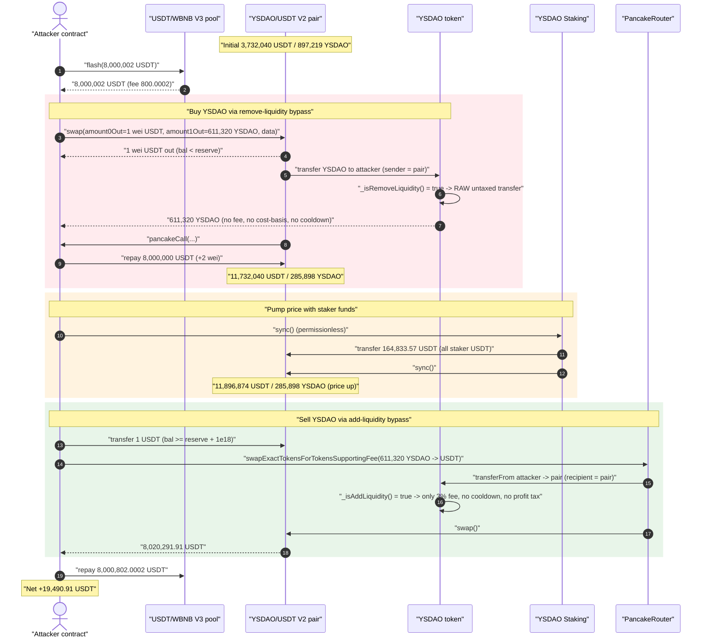
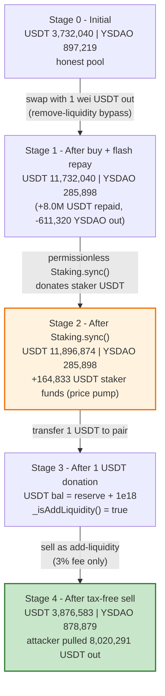
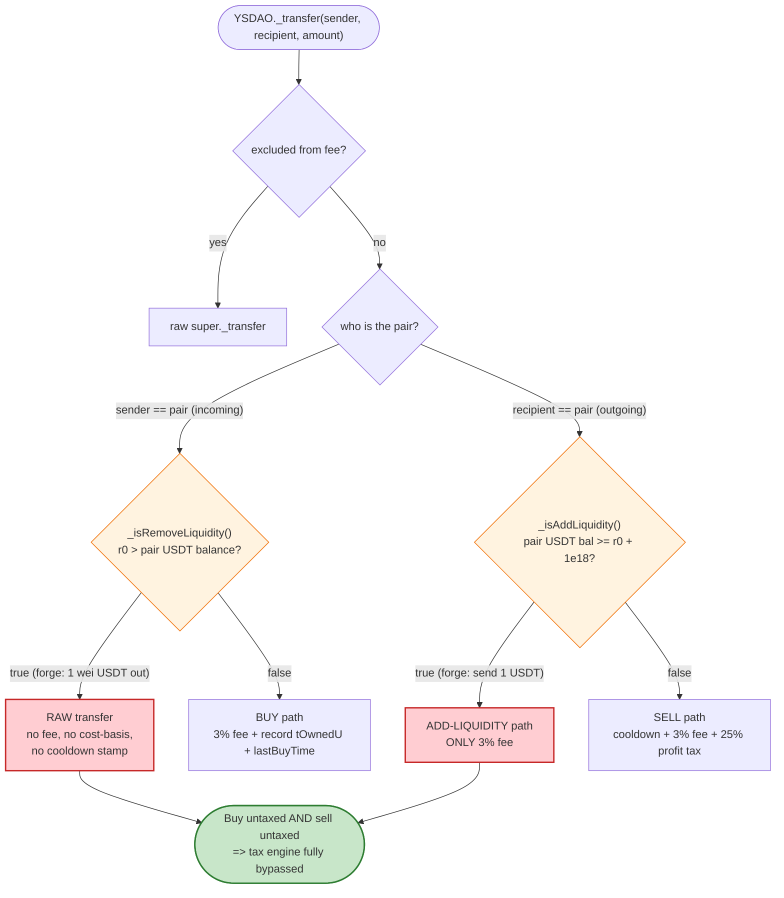

# YSDAO Exploit — Balance-vs-Reserve "Add/Remove Liquidity" Tax Bypass + Permissionless `Staking.sync()` Price Pump

> **Reproduction:** the PoC compiles & runs in an isolated Foundry project at
> [this project folder](.) (the umbrella DeFiHackLabs repo contains many unrelated PoCs that do not
> all compile together, so this one was extracted).
> Full verbose trace: [output.txt](output.txt).
> Verified vulnerable sources: [contracts_YSDAO.sol](sources/YSDAO_C036A1/contracts_YSDAO.sol),
> [contracts_abstract_dex_BaseUSDTWA.sol](sources/YSDAO_C036A1/contracts_abstract_dex_BaseUSDTWA.sol).

---

## Key info

| | |
|---|---|
| **Loss** | **~19,490.91 USDT** (≈ $19.49K) extracted from the YSDAO/USDT PancakeSwap V2 pair |
| **Vulnerable token** | `YSDAO` — [`0xC036A13d7A6A84677DfCCeC483eed124654B7918`](https://bscscan.com/address/0xC036A13d7A6A84677DfCCeC483eed124654B7918#code) |
| **Vulnerable staking** | `YSDAO Staking` — [`0x3E13019dA3BAAd134493e751704D2D4245Eec7CA`](https://bscscan.com/address/0x3E13019dA3BAAd134493e751704D2D4245Eec7CA) (unverified) |
| **Victim pool** | YSDAO/USDT V2 pair — `0x24Df7bdBC67b0EB03074Ea9d8CbbA0445fB35937` (token0 = USDT, token1 = YSDAO) |
| **Attacker EOA** | `0x8114650Cfd2617CD05C59898De7C620ae413b460` |
| **Attacker contract** | `0xafBf780569B95C5766F78b9CC5788899Aa5616Af` |
| **Attack tx** | [`0x91f26d96373bbec6a6a8517c7be995a739d65f20fed589d53bc47d8140f91907`](https://bscscan.com/tx/0x91f26d96373bbec6a6a8517c7be995a739d65f20fed589d53bc47d8140f91907) |
| **Chain / block / date** | BSC / 101,088,361 (forked at −1) / 2026-05-29 |
| **Compiler** | Solidity v0.8.20, optimizer **1 run** |
| **Bug class** | Token transfer-tax logic that derives "is this add/remove liquidity?" from instantaneous pair balance-vs-reserve, manipulable inside a swap callback; compounded by an access-control-less `Staking.sync()` |

---

## TL;DR

YSDAO is a "fee-on-transfer" token. To avoid taxing legitimate LP `mint`/`burn`, its transfer hook
tries to *guess* whether a pair-side transfer is a buy, a sell, an add-liquidity, or a
remove-liquidity event — purely by comparing the pair's **current USDT balance** against the pair's
**last-synced USDT reserve**
([`_isAddLiquidity` / `_isRemoveLiquidity`](sources/YSDAO_C036A1/contracts_abstract_dex_BaseUSDTWA.sol#L12-L24)):

```solidity
function _isAddLiquidity() internal view returns (bool isAdd) {
    (uint256 r0,,) = mainPair.getReserves();
    uint256 bal = IERC20(USDT).balanceOf(address(mainPair));
    isAdd = bal >= (r0 + 1 ether);          // pair holds ≥ 1 USDT more than reserve ⇒ "add"
}
function _isRemoveLiquidity() internal view returns (bool isRemove) {
    (uint256 r0,,) = mainPair.getReserves();
    uint256 bal = IERC20(USDT).balanceOf(address(mainPair));
    isRemove = r0 > bal;                     // pair holds fewer USDT than reserve ⇒ "remove"
}
```

Both predicates are trivially forgeable by an attacker who controls a Pancake V2 `swap()` callback
(the pair sends the output token *before* the K-check), and by simply transferring 1 USDT into the
pair. The attacker uses this to make **both** the buy and the sell take the *untaxed* "liquidity"
code paths in [`YSDAO._transfer`](sources/YSDAO_C036A1/contracts_YSDAO.sol#L86-L193) — dodging the
3% buy/sell fee, the cooldown (`coldTime`), and the 25%/4 profit tax that would otherwise have
clawed back the gains.

To make the round-trip profitable, the attacker also calls the **permissionless**
`Staking.sync()`, which donates the staking contract's entire USDT balance (164,833.57 USDT) into
the pair and `sync()`s it — pumping the YSDAO price so the YSDAO bought cheaply (with the
remove-liquidity tax skipped) sells back for far more USDT.

Funded by an 8,000,002 USDT PancakeSwap **V3 flash loan**, the attacker nets
**19,490.907296 USDT** in a single transaction.

---

## Background — what YSDAO does

`YSDAO` ([source](sources/YSDAO_C036A1/contracts_YSDAO.sol)) is an ERC20 paired against USDT on
PancakeSwap V2, with a heavy transfer-tax / "anti-bot" engine:

- **Buy** (pair → user): records a USD cost-basis in `tOwnedU[recipient]`, stamps `lastBuyTime`,
  takes a 3% fee, and enforces a `max cap buy` of `reserveThis / 10`
  ([:108-126](sources/YSDAO_C036A1/contracts_YSDAO.sol#L108-L126)).
- **Sell** (user → pair): enforces a `coldTime` cooldown since the user's last buy, takes a 3% fee,
  and applies a **25%-of-profit tax** (`profitThis / 4`) computed against the user's recorded USDT
  cost-basis ([:136-188](sources/YSDAO_C036A1/contracts_YSDAO.sol#L136-L188)).
- **Add liquidity** (user → pair, but detected as LP add): only a flat 3% fee, **no cooldown, no
  profit tax** ([:130-135](sources/YSDAO_C036A1/contracts_YSDAO.sol#L130-L135)).
- **Remove liquidity** (pair → user, but detected as LP remove): a **raw, untaxed transfer** —
  `super._transfer(sender, recipient, amount)` ([:105-108](sources/YSDAO_C036A1/contracts_YSDAO.sol#L105-L108)).

The routing between these four paths is decided entirely by `_isAddLiquidity()` /
`_isRemoveLiquidity()` above.

There is also a `Staking` contract (`0x3E13…7CA`, source unverified) holding ~164.8K USDT of staker
funds. The trace shows its `sync()` selector
([output.txt:1622-1642](output.txt#L1622-L1642)): it reads its own USDT balance, transfers **all**
of it to `YSDAO.uniswapV2Pair()`, then calls `pair.sync()`. It has **no caller restriction**.

On-chain state at the fork block:

| Parameter | Value |
|---|---|
| Pair token0 / token1 | USDT / YSDAO (YSDAO enforces `USDT < address(this)`, [BaseUSDTWA.sol:9](sources/YSDAO_C036A1/contracts_abstract_dex_BaseUSDTWA.sol#L9)) |
| Pair reserve0 (USDT) | 3,732,040.479278 USDT |
| Pair reserve1 (YSDAO) | 897,219.101953 YSDAO |
| Staking USDT balance | 164,833.570911 USDT ← donated into the pool |
| YSDAO buy/sell fee | 3% (`amount * 300 / 10000`) |
| YSDAO profit tax | 25% of profit (`profitThis / 4`) |

---

## The vulnerable code

### 1. Liquidity detection from instantaneous balance vs. reserve

[`contracts_abstract_dex_BaseUSDTWA.sol:12-24`](sources/YSDAO_C036A1/contracts_abstract_dex_BaseUSDTWA.sol#L12-L24):

```solidity
function _isAddLiquidity() internal view returns (bool isAdd) {
    IUniswapV2Pair mainPair = IUniswapV2Pair(uniswapV2Pair);
    (uint256 r0,,) = mainPair.getReserves();                 // last-synced USDT reserve
    uint256 bal = IUniswapV2Pair(USDT).balanceOf(address(mainPair)); // live USDT balance
    isAdd = bal >= (r0 + 1 ether);
}

function _isRemoveLiquidity() internal view returns (bool isRemove) {
    IUniswapV2Pair mainPair = IUniswapV2Pair(uniswapV2Pair);
    (uint256 r0,,) = mainPair.getReserves();
    uint256 bal = IUniswapV2Pair(USDT).balanceOf(address(mainPair));
    isRemove = r0 > bal;
}
```

The heuristic assumes the only times the pair's USDT balance differs from its synced reserve are
genuine `mint` (balance > reserve, "add") and `burn` (balance < reserve, "remove"). But **any**
party can move the pair's USDT balance away from its reserve:

- During a `pair.swap()` callback, the pair pushes the requested output token to the recipient
  *before* the constant-product check. Asking for `amount0Out = 1 wei` of USDT makes the pair's USDT
  balance drop **1 wei below** its reserve → `_isRemoveLiquidity()` returns `true`.
- A plain `USDT.transfer(pair, 1 ether)` makes the balance exceed the reserve by ≥ 1 USDT →
  `_isAddLiquidity()` returns `true`.

### 2. The four-way routing that trusts those predicates

[`contracts_YSDAO.sol:103-188`](sources/YSDAO_C036A1/contracts_YSDAO.sol#L103-L188) (abridged):

```solidity
if (uniswapV2Pair == sender) {            // pair -> user (a BUY, or LP remove)
    if (_isRemoveLiquidity()) {
        super._transfer(sender, recipient, amount);   // ⚠️ RAW transfer: no fee, no cost-basis,
                                                       //    no lastBuyTime stamp
    } else {
        // buy: 3% fee + record tOwnedU cost-basis + lastBuyTime + max-cap
    }
} else if (uniswapV2Pair == recipient) {  // user -> pair (a SELL, or LP add)
    if (_isAddLiquidity()) {
        uint256 tFee = (amount * 300) / 10000;          // ⚠️ ONLY a 3% fee
        _takeFee(sender, tFee);
        super._transfer(sender, recipient, amount - tFee);
    } else {
        require(block.timestamp >= lastBuyTime[sender] + coldTime, "cold");  // cooldown
        // 3% fee + 25%-of-profit tax against tOwnedU[sender]
    }
}
```

### 3. The permissionless `Staking.sync()` price pump

`Staking` source is unverified, but the trace records its exact behavior
([output.txt:1622-1642](output.txt#L1622-L1642)):

```
YSDAO Staking::sync()
  ├─ USDT.balanceOf(Staking)               → 164,833.570911 USDT
  ├─ YSDAO.uniswapV2Pair()                 → 0x24Df…5937
  ├─ USDT.transfer(pair, 164,833.570911)   // donates ALL staker USDT into the pool
  └─ pair.sync()                            // pool now counts that USDT as reserve
```

No `onlyOwner` / keeper / `msg.sender` guard — anyone can trigger it at will, mid-attack.

---

## Root cause — why it was possible

The token wants to be fee-on-transfer but *not* tax LP operations. The only signal it uses to tell
an LP add/remove apart from a swap is **`pair USDT balance` vs `pair USDT reserve`** at the instant
of transfer. That signal is attacker-controlled:

1. **A swap recipient sees output before the K-check.** PancakeSwap V2 `swap()` optimistically
   transfers `amount0Out`/`amount1Out` and only then runs the invariant check (and invokes the
   `pancakeCall` callback if `data.length > 0`). By requesting `amount0Out = 1 wei USDT`, the
   attacker drives the pair's USDT balance 1 wei *under* its reserve, so when the **YSDAO** output
   leg transfers (which runs `YSDAO._transfer` with `sender == pair`), `_isRemoveLiquidity()` is
   `true`. The buy is treated as an LP removal → a **raw, untaxed transfer** with no cost-basis and
   no cooldown stamp.

2. **A 1-USDT donation flips the sell into an "add".** Before selling, the attacker transfers
   1 USDT to the pair, so `bal ≥ r0 + 1 ether` and `_isAddLiquidity()` is `true`. The sell then
   takes the cheap LP-add path (flat 3% fee) instead of the cooldown + 25%-profit-tax sell path that
   was designed to punish exactly this kind of trade.

3. **`Staking.sync()` provides the price pump for free.** Because the predicates only let the
   attacker dodge *taxes*, the attacker still needs the YSDAO to be worth more on the sell than on
   the buy. The permissionless `Staking.sync()` donates 164.8K USDT of *other people's* staked funds
   into the pool and `sync()`s, raising the USDT reserve from 11.73M to 11.90M against an unchanged
   285,898 YSDAO reserve — i.e., it inflates the USDT-per-YSDAO price, and the attacker captures the
   difference when selling the YSDAO they acquired tax-free.

In short: the tax engine that should have made this trade unprofitable is fully bypassed, and a
public function hands the attacker the price move needed to profit.

---

## Preconditions

- `presale == true` on YSDAO (trading live). True at the fork block.
- The YSDAO/USDT V2 pair must permit a flash-style `swap()` with a `pancakeCall` callback
  (`data.length > 0`), which it does — used to deliver YSDAO to the attacker while only sending
  1 wei USDT out.
- `Staking` must hold a non-trivial USDT balance and expose a permissionless `sync()` that donates
  it to the pair. True: 164,833.57 USDT, no access control.
- Working capital in USDT to seed the V2 swap repayment. Sourced via a PancakeSwap **V3** USDT/WBNB
  flash loan of 8,000,002 USDT (fee 800.0002 USDT), fully repaid intra-transaction — so the attack
  is effectively capital-free.

---

## Attack walkthrough (with on-chain numbers from the trace)

All figures are taken directly from `getReserves()` / `Sync` / `Transfer` events in
[output.txt](output.txt). Pair `token0 = USDT (r0)`, `token1 = YSDAO (r1)`.

| # | Step (trace line) | Pair USDT reserve | Pair YSDAO reserve | Effect |
|---|---|---:|---:|---|
| 0 | **Initial** ([:1579](output.txt#L1579)) | 3,732,040.479 | 897,219.102 | Honest pool. |
| 1 | **V3 flash** 8,000,002 USDT borrowed from USDT/WBNB V3 pool ([:1566-1576](output.txt#L1566)) | — | — | Attacker now holds ~8.0M USDT (fee 800.0002). |
| 2 | **`pair.swap(1, 611,320.33, this, "0x30783031")`** ([:1582](output.txt#L1582)) — pair sends **1 wei USDT** out first ([:1583](output.txt#L1583)), making pair USDT bal = reserve − 1 | 3,732,040.479 | 897,219.102 | `_isRemoveLiquidity()` reads `r0(3,732,040.479e18) > bal(…703)` ⇒ **true**. |
| 3 | YSDAO output leg `YSDAO.transfer(this, 611,320.33)` ([:1589-1602](output.txt#L1589)) runs as a **remove-liquidity raw transfer** | — | — | Attacker gets 611,320.33 YSDAO **untaxed**, no cost-basis, no cooldown stamp. |
| 4 | **`pancakeCall`** repays the V2 pair 8,000,000.000…02 USDT ([:1603-1610](output.txt#L1603)) → pair USDT bal 11.73M | — | — | Satisfies the V2 swap's K-check. |
| 5 | pair `sync()` end-of-swap ([:1615](output.txt#L1615)) | 11,732,040.479 | 285,898.773 | Reserves now reflect the repayment + delivered YSDAO. |
| 6 | **`Staking.sync()`** ([:1622-1642](output.txt#L1622)) donates **164,833.570911 USDT** of staker funds into pair + `sync()` ([:1638](output.txt#L1638)) | **11,896,874.050** | 285,898.773 | **Price pump**: +164.8K USDT reserve, YSDAO reserve unchanged ⇒ USDT/YSDAO price up. |
| 7 | **`USDT.transfer(pair, 1 ether)`** ([:1643](output.txt#L1643)) → pair USDT bal = reserve + 1 USDT | 11,896,874.050 | 285,898.773 | `_isAddLiquidity()` reads `bal ≥ r0 + 1 ether` ⇒ **true**. |
| 8 | **Sell 611,320.33 YSDAO** via router ([:1656](output.txt#L1656)); `YSDAO.transferFrom`→pair runs as **add-liquidity 3%-fee path** ([:1657-1674](output.txt#L1657)) | — | — | Only 3% fee (4,951.69 burned + 13,387.91 to contract); **no cooldown, no 25% profit tax**. 592,980.72 YSDAO reach the pair. |
| 9 | Router `pair.swap` pays out USDT ([:1681-1696](output.txt#L1681)) | 3,876,583.143 | 878,879.492 | Attacker receives **8,020,291.907 USDT**. |
| 10 | **Repay V3 flash** 8,000,802.0002 USDT ([:1700-1705](output.txt#L1700)) | — | — | Loan + 800.0002 fee returned. |
| 11 | **Profit** ([:1716-1720](output.txt#L1716)) | — | — | Final USDT 19,517.45 − initial 26.54 = **19,490.907296 USDT**. |

### Why outputting "1 wei USDT" works

PancakeSwap V2 `swap()` performs the output transfers *before* validating `x·y ≥ k`. Requesting
`amount0Out = 1` (1 wei USDT) and `amount1Out = 611,320.33 YSDAO` makes the pair:
1. send 1 wei USDT (pair USDT bal = 3,732,040.479e18 − 1 < reserve) — this is the snapshot
   `_isRemoveLiquidity()` sees during the YSDAO leg,
2. send the YSDAO (triggering `YSDAO._transfer(sender = pair)` → the remove-liquidity raw branch),
3. invoke `pancakeCall`, where the attacker repays the borrowed USDT so the K-check passes.

The 1-wei USDT output is throwaway; its only purpose is to push `bal < reserve` for the duration of
the YSDAO transfer.

---

## Profit / loss accounting (USDT)

| Direction | Amount (USDT) |
|---|---:|
| Borrowed — V3 flash | 8,000,002.000000 |
| Repaid — V2 pair (`pancakeCall`) | 8,000,000.000000 (+2 wei) |
| Donated by **`Staking.sync()`** into pool (staker funds, not attacker's) | 164,833.570911 |
| 1 USDT donation to flip `_isAddLiquidity` | 1.000000 |
| Received — sell 611,320.33 YSDAO via router | 8,020,291.907497 |
| Repaid — V3 flash + fee | 8,000,802.000200 |
| Attacker USDT before | 26.542162 |
| Attacker USDT after | 19,517.449458 |
| **Net profit** | **+19,490.907296** |

The ~19.49K USDT profit is sourced from the combination of (a) the value of the YSDAO acquired with
all four tax/cooldown protections bypassed and (b) the 164.8K USDT the attacker pushed into the pool
via `Staking.sync()` — the staked USDT inflates the price the attacker sells into, letting the
attacker walk away with the spread while honest LPs and stakers absorb the loss.

---

## Diagrams

### Sequence of the attack



### Pool state evolution



### Decision flaw inside `YSDAO._transfer`



---

## Why each magic number

- **`FLASH_AMOUNT = 8,000,002 USDT`** — the working capital used to repay the V2 `swap()` (8,000,000)
  with 2 wei of slack so the K-check passes; the V3 fee is 800.0002 USDT.
- **`pair.swap(1, ysdaoOut, …)`** — `amount0Out = 1` (1 wei USDT) is the minimum nonzero output that
  drives the pair's USDT balance below its reserve, flipping `_isRemoveLiquidity()` to `true` for the
  duration of the YSDAO output transfer. `ysdaoOut` is the YSDAO that 8,000,000 USDT would buy at the
  *pre-attack* reserves (`getAmountOut` → 611,320.33 YSDAO).
- **`Staking.sync()`** — pushes the staking contract's entire 164,833.57 USDT into the pool, the
  price-pump that turns the tax bypass into a profit. Permissionless, so the attacker chooses the
  exact moment.
- **`USDT.transfer(pair, 1 ether)`** — 1 USDT is just enough to satisfy `bal ≥ r0 + 1 ether`, flipping
  `_isAddLiquidity()` to `true` so the sell skips the cooldown and 25% profit tax.

---

## Remediation

1. **Do not infer LP add/remove from instantaneous balance-vs-reserve.** This signal is forgeable by
   any swap-callback recipient or by a 1-wei/1-token donation. If the token must avoid taxing LP
   operations, detect them robustly — e.g., gate on the pair's `mint`/`burn` having actually changed
   LP `totalSupply`, or exempt only a whitelisted router/position-manager, rather than reverse-
   engineering intent from balances.
2. **Tax buys and sells symmetrically and unconditionally on the pair legs.** The "remove-liquidity"
   branch performing a *raw, cost-basis-free* transfer ([YSDAO.sol:105-108](sources/YSDAO_C036A1/contracts_YSDAO.sol#L105-L108))
   is the core hole: a "buy" that records no `tOwnedU` and no `lastBuyTime` can later be sold with no
   profit tax and no cooldown. Any pair→user transfer that is not a *verified* LP burn should follow
   the buy path.
3. **Add access control to `Staking.sync()`.** Donating the entire staked USDT balance into the AMM
   pool must not be callable by arbitrary addresses, and certainly not re-entrantly inside another
   protocol's swap. Restrict it to a trusted keeper/owner and rate-limit it.
4. **Never let a permissionless function push protocol-held funds into a price-sensitive pool.** Even
   gated, donating reserves to the pair changes the marginal price and is sandwich-/flash-loanable;
   prefer pull-based reward accounting over balance donations + `sync()`.
5. **Use a manipulation-resistant price reference** (TWAP/oracle) for any logic that depends on pool
   pricing, instead of the spot reserves that a flash loan + donation can move within one block.

---

## How to reproduce

The PoC was extracted into a standalone Foundry project (the umbrella DeFiHackLabs repo has several
unrelated PoCs that fail to compile under a whole-project `forge build`):

```bash
_shared/run_poc.sh 2026-05-YSDAO_exp -vvvvv
```

- RPC: a **BSC archive** endpoint is required (fork block 101,088,360). `foundry.toml` uses
  `https://bsc-mainnet.public.blastapi.io`, which serves historical state at that block; pruned
  public RPCs fail with `header not found` / `missing trie node`.
- Result: `[PASS] testExploit()` with `USDT profit: 19490`.

Expected tail:

```
Ran 1 test for test/YSDAO_exp.sol:YSDAO_exp
[PASS] testExploit() (gas: 273716)
Logs:
  USDT profit: 19490

Suite result: ok. 1 passed; 0 failed; 0 skipped; finished in 11.62s
```

---

*Reference: DeFiHackLabs PoC `src/test/2026-05/YSDAO_exp.sol`. Vulnerable token verified on BscScan;
staking contract `0x3E13…7CA` is unverified (behavior reconstructed from the execution trace).*
