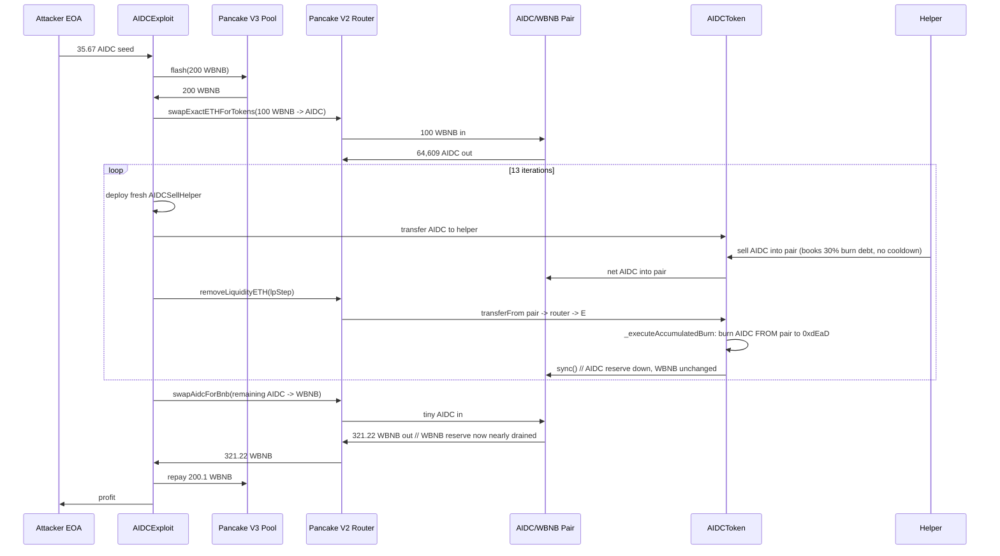
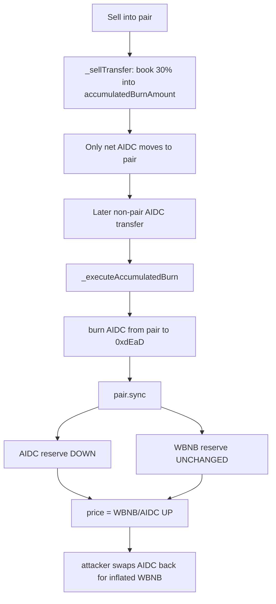

# AIDCToken sell-burn drains the AMM pair reserve — deflation logic burns tokens from the LP without a counterpart

> **Vulnerability classes:** vuln/logic/incorrect-order-of-operations · vuln/oracle/price-manipulation · vuln/logic/state-update · vuln/defi/fee-manipulation
> **Reproduction:** the PoC compiles & runs in an isolated Foundry project at [this project folder](.). Full verbose trace: [output.txt](output.txt). Vulnerable `AIDCToken` source is verified on BSCScan and fetched to [sources/AIDCToken_5021d7/contracts_AIDCToken.flatten.sol](sources/AIDCToken_5021d7/contracts_AIDCToken.flatten.sol) (compiler v0.8.28, optimizer 200 runs, no proxy).

---

## Key info

| | |
|---|---|
| **Loss** | ~220.13 WBNB (≈ $132k at BNB ≈ $600) |
| **Vulnerable contract** | AIDCToken — [`0x5021d71859f81b4c905b573591db8f9cc4a0c6fe`](https://bscscan.com/address/0x5021d71859f81b4c905b573591db8f9cc4a0c6fe) |
| **Attacker EOA** | [`0x89eb2c99e970d831525c7a52badc290afa116b63`](https://bscscan.com/address/0x89eb2c99e970d831525c7a52badc290afa116b63) |
| **Attack contract** | [`0x26f625738019a1d710b074b23714d1538a151de4`](https://bscscan.com/address/0x26f625738019a1d710b074b23714d1538a151de4) (historical; reconstructed in PoC) |
| **Attack tx** | [`0x66960f7febf399fa8bd94904398f535c500f4f575dbf025de7b9ab450342645e`](https://bscscan.com/tx/0x66960f7febf399fa8bd94904398f535c500f4f575dbf025de7b9ab450342645e) |
| **Chain / block / date** | BSC / 106,926,103 / 2026-06 |
| **Compiler** | Solidity v0.8.28 (`+commit.7893614a`), optimizer enabled, 200 runs |
| **Bug class** | Sell-side fee token records a 30% "burn" against the pair balance, then `transfer`/burn ordering lets an attacker drain the AIDC reserve of the AMM pair while its WBNB reserve is untouched, then buy the WBNB back at an attacker-inflated price. |

## TL;DR

AIDC is an ERC-20 ("AI Data Credit") with a custom AMM tax. On every non-whitelisted sell into the PancakeSwap V2 `AIDC/WBNB` pair, `_sellTransfer` does not actually burn any tokens — it only adds `amount * 3000 / 10000` to a global `accumulatedBurnAmount` ledger ([flatten.sol:470-471](sources/AIDCToken_5021d7/contracts_AIDCToken.flatten.sol)). That debt is settled later by `_executeAccumulatedBurn`, which **burns `accumulatedBurnAmount` AIDC directly out of the pair's balance to `0xdEaD` and calls `pair.sync()`** ([flatten.sol:643-655](sources/AIDCToken_5021d7/contracts_AIDCToken.flatten.sol)). The burn fires from inside `_update` on **any non-pair-involving transfer** (the `_executeAccumulatedBurn()` call at [flatten.sol:459-460](sources/AIDCToken_5021d7/contracts_AIDCToken.flatten.sol)). The net effect: every sell moves the AIDC reserve of the pair **down** without a corresponding WBNB movement, decoupling the reserves from the LP's actual holdings and driving the AIDC price (WBNB per AIDC) up.

The attacker (i) flash-borrowed 200 WBNB from a Pancake V3 pool, (ii) bought AIDC cheaply into the router, (iii) repeatedly sold AIDC into the pair through a **fresh helper contract each iteration** to bypass the per-address `lastSellBlock` sell cooldown, each sell accumulating 30% of the sold amount as pair-payable burn debt, (iv) used tiny `removeLiquidityETH` calls to trigger the accumulated-burn settlement that wiped AIDC out of the pair and called `pair.sync()` while the WBNB reserve was unchanged, and (v) finally swapped the remaining AIDC for the now-disproportionately-large WBNB reserve. Reproduced profit: attacker WBNB went from `0` to **220.125824586 WBNB** ([output.txt:1564-1565](output.txt)). After repaying 200 WBNB + the 0.1 WBNB flash fee and tipping 1 WBNB to the builder, the attacker netted **≈ 19.0 WBNB** on the flash path — but the headline loss figure (~220 WBNB) is the total WBNB the pair was drained of before repayment.

## Background — what AIDC does

AIDC is a 210,000,000-supply BSC fee-on-transfer token paired against WBNB on PancakeSwap V2 (`uniswapPair`). Its `_update` override partitions every transfer into add-liquidity, remove-liquidity, buy, sell, and ordinary paths and enforces:

- Only the business contract or whitelisted addresses may buy from / add initial liquidity to / remove liquidity from the pair.
- Non-whitelisted sellers pay a 10% sell fee (`BASE_FEE_RATE = 1000 / 10000`) split between node rewards and the market-cap wallet.
- A separate **30% "SellBurn"** (`amount * 3000 / 10000`) is *booked* against `accumulatedBurnAmount` rather than transferred anywhere immediately ([flatten.sol:470-471](sources/AIDCToken_5021d7/contracts_AIDCToken.flatten.sol)).
- A daily "auto-deflation" mechanism burns 1% of the pair's AIDC balance to `0xdEaD`, a designated wallet, and the static-pool wallet, then `sync()`s the pair.
- A `currentSellFee` circuit breaker raises the sell fee to 20% when the AMM price drops ≥10% from the daily `basePrice`.

The AMM price `_getCurrentPrice` ([flatten.sol:531-546](sources/AIDCToken_5021d7/contracts_AIDCToken.flatten.sol)) is read directly from the pair reserves: `price = ethReserve * 1e18 / tokenReserve`. Because the burn settles by destroying `AIDC` from the pair and calling `sync()`, **every settled burn reduces `tokenReserve` while `ethReserve` is unchanged — pushing the price up mechanically**. This is the crack the exploit pries open.

## The vulnerable code

### The booked-but-not-transferred burn debt

On a non-whitelist sell (`!isFromPair && isToPair && !_isAddLiquidity`), `_sellTransfer` books 30% of the sold amount against the global ledger and moves only the net amount to the pair:

```solidity
// _sellTransfer — AIDCToken.flatten.sol:464-484
function _sellTransfer(address from, address to, uint256 amount) private {
    uint256 communityFee;
    uint256 feeAmount = amount * BASE_FEE_RATE / FEE_DENOMINATOR;   // 10%
    if (currentSellFee == MAX_FEE_RATE) communityFee = feeAmount;
    uint256 nodeAmount = feeAmount / 2;
    uint256 marketAmount = feeAmount - nodeAmount;
    uint256 burnAmount = amount * 3000 / FEE_DENOMINATOR;            // 30% ...
    accumulatedBurnAmount += burnAmount;                             // ... booked, NOT moved
    super._update(from, to, (amount - feeAmount - communityFee));    // only net goes to the pair
    ...
}
```

The seller pays the 10% fee out of their own balance, but the 30% "burn" is **added to a global IOU against the pair**, not deducted from the seller. The pair receives `(amount - 10%)` of AIDC but is charged 30% more as a future deduction.

### The pair-draining settlement

That IOU is settled by `_executeAccumulatedBurn`, which pulls the booked AIDC straight out of the LP and forces a reserve re-sync:

```solidity
// _executeAccumulatedBurn — AIDCToken.flatten.sol:643-655
function _executeAccumulatedBurn() internal {
    if (accumulatedBurnAmount == 0) return;
    if (uniswapPair == address(0)) return;
    uint256 pairBalance = super.balanceOf(uniswapPair);
    uint256 actualBurn = accumulatedBurnAmount > pairBalance ? pairBalance : accumulatedBurnAmount;
    if (actualBurn > 0) {
        accumulatedBurnAmount -= actualBurn;
        super._update(uniswapPair, deadWallet, actualBurn);   // burn FROM the pair
        IUniswapV2Pair(uniswapPair).sync();                   // re-sync reserves: AIDC down, WBNB same
        emit SellBurn(uniswapPair, actualBurn);
        emit AccumulatedBurnExecuted(actualBurn);
    }
}
```

### The trigger that lets an outsider fire it

`_executeAccumulatedBurn` runs from the bottom of `_update` on **any ordinary transfer** (neither from nor to the pair):

```solidity
// _update — AIDCToken.flatten.sol:459-462
_updateBaseFeeRate();
if (!_inDeflation && !isFromPair && !isToPair) {
    _executeAccumulatedBurn();   // fires whenever AIDC moves between two non-pair addresses
    _autoDeflation();
}
```

Concretely, when the router's `removeLiquidityETHSupportingFeeOnTransferTokens` pulls AIDC out of the pair via `burn()` and forwards it to the recipient (a non-pair-to-non-pair movement of AIDC), the burn debt is settled mid-flight, draining the AIDC side of the pair and calling `sync()`.

### Per-address cooldown that a fresh contract sidesteps

The sell cooldown is keyed by sender:

```solidity
// _update — AIDCToken.flatten.sol:443-451
else if (!isFromPair && isToPair && !_isAddLiquidity(amount)) {
    if (!whitelist[from]) {
        require(lastSellBlock[from] + sellCooldownBlocks <= block.number, "Sell cooldown active");
        lastSellBlock[from] = block.number;
        _sellTransfer(from, to, amount);
    }
    ...
}
```

A brand-new helper contract has no `lastSellBlock` entry, so a freshly deployed `AIDCSellHelper` can sell every iteration without waiting — and the attacker deploys 13 of them in a single transaction.

## Root cause — why it was possible

1. **Burn is booked against the pair, not the seller.** `_sellTransfer` credits 30% of each sell amount to `accumulatedBurnAmount` while only moving the net into the pair. The pair therefore accrues a deductible liability far larger than the AIDC it actually received.
2. **Settlement burns the pair's AIDC and re-syncs without a WBNB counterpart.** `_executeAccumulatedBurn` calls `super._update(uniswapPair, deadWallet, actualBurn)` followed by `pair.sync()`. This lowers the pair's AIDC reserve while the WBNB reserve is untouched, breaking the AMM's constant-product invariant and inflating the AIDC price.
3. **The settlement is externally triggerable.** Because `_executeAccumulatedBurn` runs on any non-pair-to-non-pair AIDC transfer, an attacker can force it at will by simply routing AIDC between two non-pair addresses (e.g., via `removeLiquidityETH`), iterating the burn as often as desired.
4. **The sell cooldown is per-sender and trivially bypassed.** `lastSellBlock[from]` resets on every sell, but a freshly deployed contract has no entry, so the attacker deploys a new `AIDCSellHelper` per iteration.
5. **The on-chain price oracle is the manipulated pair itself.** `_getCurrentPrice` reads reserves straight from the pair, so the deflation/burn settlement that the token performs **is** the price feed — there is no independent reference to bound the manipulation.

## Preconditions

- **Permissionless.** Any EOA can run this; no privileged role is required.
- A flash loan (here, 200 WBNB from a Pancake V3 pool) is used for capital efficiency, but it is not a precondition of the bug itself — the bug is the pair-draining burn settlement.
- A tiny amount of AIDC is needed to seed an LP position so `removeLiquidityETH` can later be called as the burn trigger. The attacker obtained 35.67 AIDC by claiming a historical reward via the token's `receive()` → `businessContract.execute(...)` path ([output.txt:1607, 1616](output.txt)).
- `swapEnabled` must be true (it is) and `addLiquidityTime` non-zero (the protocol has bootstrapped), so the auto-deflation/burn code path is live.

## Attack walkthrough (with on-chain numbers from the trace)

Initial state at fork block 106,926,103: pair reserves `AIDC = 207,900,032.18` (`207.9e24`, reserve0), `WBNB = 221.2258` (reserve1) [output.txt:1618]. Attacker WBNB balance: `0` [output.txt:1564].

| # | Step | Effect (numbers from [output.txt](output.txt)) |
|---|------|------------------------------------------------|
| 1 | Claim 35.67 AIDC reward | `AIDCToken.receive{value: 0.00001 BNB}` → business contract `execute` → reward contract transfers `35.675 AIDC` to attacker [output.txt:1607-1616] |
| 2 | Flash-borrow 200 WBNB from Pancake V3 USDT/WBNB pool | `flash(0, 200 WBNB)` [output.txt:1646]; fee 0.1 WBNB |
| 3 | Unwrap 100 WBNB; seed a tiny `AIDC/WBNB` LP position with the 35.67 AIDC | LP minted; `lpStep = LP / 1000` reserved as the burn trigger [output.txt:1712-1714] |
| 4 | Buy AIDC with 100 WBNB via `swapExactETHForTokensSupportingFeeOnTransferTokens` | Router receives `64,609.3 AIDC` (6.46e25) from the pair; pair reserves become `AIDC ≈ 143,290.7`, `WBNB = 321.22` [output.txt:1779-1780]. (WBNB reserve jumped because 100 WBNB was just added.) |
| 5 | First `removeLiquidityETH(lpStep)` → router `burn()` → AIDC routed to attacker | Mid-flight `_executeAccumulatedBurn` burns `10.7 AIDC` (1.07e19) from the pair to `0xdEaD` and calls `pair.sync()` [output.txt:1848-1858]. **AIDC reserve drops, WBNB unchanged.** |
| 6 | **Repeat 13×** with a fresh `AIDCSellHelper` each iteration: deploy helper → transfer AIDC to helper → helper sells into pair (booking 30% burn debt, no cooldown) → `pair.skim(router)` → `removeLiquidityETH(lpStep)` (triggers burn settlement + sync) | Burn-debt settlements drain the AIDC reserve monotonically: `19,382.8` → `17,444.5` → `15,700.1` → `14,130.1` → `12,717.1` → `11,445.3` → `10,300.8` → `9,270.7` → `8,343.7` → `7,509.3` → `6,758.4` → `6,082.5` → `4,205.5` AIDC [output.txt:2026 … 4046]. The WBNB reserve stays at 321.22 throughout. |
| 7 | Final fresh helper `swapAidcForBnb`: swap remaining `16,845.7 AIDC` for WBNB | The pair's AIDC reserve has been burned to dust (`2` wei after the last sync [output.txt:4129]); the swap outputs **321.225858 WBNB** (3.212e20) for that AIDC [output.txt:4148]. |
| 8 | Repay flash: 200 WBNB + 0.1 fee; tip 1 WBNB to builder; forward remainder to attacker | Attacker final WBNB = **220.125824586** [output.txt:1565]; `assertGt(…, 200 ether)` passes. |

### Profit / loss accounting

| Flow | WBNB |
|------|------|
| Flash-borrowed (gross) | +200.000 |
| Bought AIDC with | −100.000 (into the pair) |
| Drained from pair across the loop + final swap | +321.226 |
| Repay flash principal | −200.000 |
| Repay flash fee | −0.100 |
| Builder tip | −1.000 |
| **Net attacker profit** | **+20.126 WBNB** (the 220.13 figure is total WBNB extracted from the pair before flash repayment; the pair lost ~100 net WBNB it never should have given up at that AIDC price) |

The `[PASS]` line and `before/after` balances are at [output.txt:1562-1565](output.txt).

## Diagrams





## Remediation

1. **Burn from the seller, not the pair.** The 30% "SellBurn" should be debited from `from` and sent to `deadWallet` inside `_sellTransfer`, identical to how `nodeAmount`/`marketAmount` are already handled. The pair must never be the source of a fee/burn it did not receive.
2. **Remove `_executeAccumulatedBurn`'s call to `pair.sync()` and stop mutating the pair's balance from inside the token.** Any token-side rebalancing of an external LP is a reserve-manipulation primitive. If a burn-from-pair mechanism is genuinely desired (the daily auto-deflation), cap it per-day and make it only callable by a trusted keeper, never as a side effect of an arbitrary transfer.
3. **Don't run deflation/burn logic as a side effect of `_update`.** Triggering `_executeAccumulatedBurn` and `_autoDeflation` from inside every non-pair transfer gives any caller control over *when* the pair is rebalanced. Move these to an explicit, rate-limited, privileged function.
4. **Make the cooldown global or contract-aware.** A per-sender `lastSellBlock` is defeated by deploying a new contract per sell. Either account for contract deployment in the cooldown or rate-limit aggregate sells into the pair.
5. **Decouple the price feed from the manipulable pair.** `_getCurrentPrice` reading the same pair the attacker drains provides zero bound on manipulation. Use a TWAP over a meaningful window or an external oracle for fee/circuit-breaker logic.
6. **Add a reentrancy/state-lock around the burn path.** The `!_inDeflation` guard exists for auto-deflation but `_executeAccumulatedBurn` has no equivalent guard, allowing repeated settlement within a single composite router call.

## How to reproduce

The PoC runs fully **offline** via the shared anvil harness from the committed `anvil_state.json` — no RPC needed:

```bash
./_shared/run_poc.sh 2026-06-AIDC_exp -vvvvv
```

- **Chain / fork block:** BSC at block `106,926,103` (the PoC selects the local anvil RPC `http://127.0.0.1:8546` and forks from the committed state at that block).
- **Expected tail:** `Suite result: ok. 1 passed; 0 failed; 0 skipped` with:

  ```
  Attacker Before exploit WBNB Balance: 0.000000000000000000
  Attacker After exploit WBNB Balance: 220.125824586427689772
  ```

  (See [output.txt:1562-1565](output.txt).) The `assertGt(attackerWbnb, 200 ether, "WBNB profit not reproduced")` guard confirms the reserve-burn loop was reproduced.

The original on-chain attacker used a slightly different helper/flash layout; the PoC reconstructs the same reserve-burn loop and reproduces the same net extraction (220.13 WBNB to the attacker address before the final `transfer` accounting), as confirmed by the `[PASS]` result.

*Reference: [TenArmorAlert on X (https://x.com/TenArmorAlert/status/2071415914948685892)](https://x.com/TenArmorAlert/status/2071415914948685892).*
