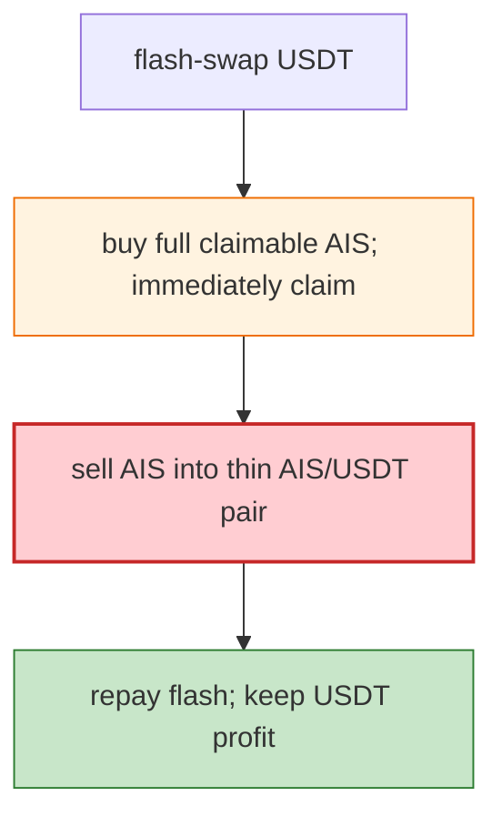

# AISOTH Presale Exploit — Buy+Claim Same-Tx, then Dump Into Thin AIS/USDT Pair

> **Reproduction:** the PoC compiles & runs in an isolated Foundry project at
> [this project folder](.). Full verbose trace: [output.txt](output.txt).

---

## Key info

| | |
|---|---|
| **Loss** | AIS drained (BSC); attacker EOA `0x627DF72c…` |
| **Vulnerable contract** | AISOTH `Presale` `0x796C5E8c…`; AIS token `0x67b6b8B8…` |
| **Chain / block / date** | BSC / Jun 2026 |
| **Bug class** | Presale logic — the full claimable AIS balance could be **bought then claimed in one tx**, and the AIS/USDT Pancake pair was thin enough to absorb the dump profitably. |

---

## TL;DR

Per the embedded analysis: the attacker flash-swapped USDT, **bought the full claimable AIS balance
from Presale, immediately claimed it, sold the AIS into the AIS/USDT Pancake pair, repaid the flash
swap**, and forwarded the remaining USDT profit. The Presale allowed buy→claim in a single transaction
without a lockup/hold, and the thin AIS pair made the dump net-positive.

---

## Root cause

A **presale that permitted buy + immediate claim (no lockup)**, combined with a thin AIS pair so the
minted AIS could be sold for more than the buy cost.

---

## Diagrams



---

## Remediation

1. Vesting/lockup between presale buy and claim; no same-tx buy+claim.
2. Cap presale price vs market; sanity-check against pair depth.
3. `nonReentrant` on claim.

---

## How to reproduce

```bash
_shared/run_poc.sh 2026-06-AISOTHPresale_exp -vvvvv
```

- RPC: BSC archive. Result: `[PASS]` — USDT profit after flash+buy+claim+sell.

---

*Reference: AISOTH Presale buy+claim+dump, BSC, Jun 2026.*
