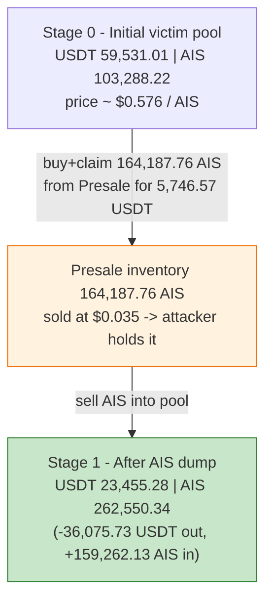
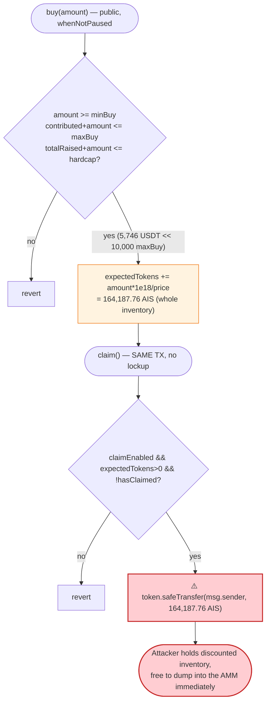
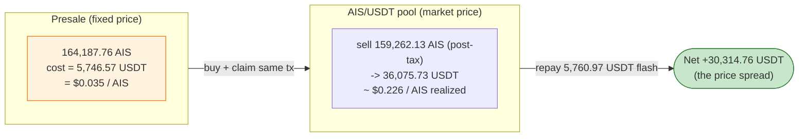

# AISOTH Presale Exploit — Same-Tx Buy+Claim of Below-Market Inventory, Dumped Into the Live AIS/USDT Pair

> **Reproduction:** the PoC compiles & runs in an isolated Foundry project at
> [this project folder](.). Full verbose trace: [output.txt](output.txt).
> Verified vulnerable source:
> [Presale.sol](sources/Presale_796C5E/Presale.sol) (the `Presale` contract) and the
> fee-on-transfer token [AISOTH.sol](sources/AISOTH_67b6b8/AISOTH.sol).

---

## Key info

| | |
|---|---|
| **Loss** | **30,314.76 USDT** profit to the attacker (`30314760842915494215340` wei), extracted from the AIS/USDT PancakeSwap pair by round-tripping below-market presale inventory |
| **Vulnerable contract** | `Presale` — [`0x796C5E8cA10010654DafAeF096bd1F4a7ad87672`](https://bscscan.com/address/0x796c5e8ca10010654dafaef096bd1f4a7ad87672#code) |
| **Token** | `AISOTH` (AIS) — [`0x67b6b8B8867e501385C95b843A23f9Bfe34811dB`](https://bscscan.com/address/0x67b6b8B8867e501385C95b843A23f9Bfe34811dB) |
| **Victim pool** | AIS/USDT PancakeV2 pair — [`0x9efB2E8BA06eB5981034f6e01350af041983e763`](https://bscscan.com/address/0x9efB2E8BA06eB5981034f6e01350af041983e763) |
| **Flash-loan source** | USDT/WBNB PancakeV2 pair — [`0x16b9a82891338f9bA80E2D6970FddA79D1eb0daE`](https://bscscan.com/address/0x16b9a82891338f9bA80E2D6970FddA79D1eb0daE) |
| **Attacker EOA** | [`0x627DF72cC3FA38C475A414e65CdECE09b2b177AF`](https://bscscan.com/address/0x627df72cc3fa38c475a414e65cdece09b2b177af) |
| **Attacker contract** | `0x2078b0d64ede277d65bdf0272f64aef2a954deab` |
| **Attack tx** | [`0x11462984d7f5663db9cf95c07c6cd9ff91f5b2d6616268e8dd6a3013e190248c`](https://bscscan.com/tx/0x11462984d7f5663db9cf95c07c6cd9ff91f5b2d6616268e8dd6a3013e190248c) |
| **Chain / block / date** | BSC / 102,408,283 / June 2026 |
| **Compiler** | Solidity v0.8.20+commit.a1b79de6, optimizer **enabled**, **200 runs** (both contracts) |
| **Bug class** | Mispriced presale with **same-transaction buy + claim, no vesting/lockup**, selling AIS at a fixed `$0.035` while the live AIS/USDT pool priced it ~6.4× higher |

---

## TL;DR

1. `Presale` ([Presale.sol](sources/Presale_796C5E/Presale.sol)) sells AIS for USDT at a **fixed
   administrative price** of `price = 35e15` (i.e. `$0.035` per AIS, [Presale.sol:58-59](sources/Presale_796C5E/Presale.sol#L58-L59)).
   It holds a real inventory of AIS deposited by the team, and at the fork block that inventory was
   **164,187.76 AIS** ([output.txt:1594](output.txt)).

2. `buy(amount)` credits the buyer `expectedTokens[msg.sender] += amount * 1e18 / price`
   ([Presale.sol:151-168](sources/Presale_796C5E/Presale.sol#L151-L168)) and `claim()` then transfers
   that AIS out **in the same transaction** — there is **no vesting, no lockup, and no per-block /
   same-tx guard** ([Presale.sol:172-194](sources/Presale_796C5E/Presale.sol#L172-L194)). `claimEnabled`
   was already `true`.

3. The catch is the price gap. On the **open market** the AIS/USDT pair
   `0x9efB2E8B…` priced AIS at roughly **`$0.226`** (USDT reserve `59,531.01` / AIS reserve `103,288.22`,
   [output.txt:1671](output.txt)). The presale was handing out the same token at `$0.035` — about a
   **6.4× discount**. Anyone who could buy at presale price and immediately sell at market price banked
   the spread.

4. The attacker needed **no capital of their own**. They flash-swapped **5,746.57 USDT**
   (`5746571552442874036763` wei, [output.txt:1597](output.txt)) out of the USDT/WBNB pair
   `0x16b9a82…`, sized to exactly `presaleAisBalance × price / 1e18` — the cost to buy the *entire*
   presale inventory ([AISOTHPresale_exp.sol:84-86](test/AISOTHPresale_exp.sol#L84-L86)).

5. Inside the flash-swap callback they called `buy(5,746.57 USDT)` → credited **164,187.76 AIS**
   ([output.txt:1619](output.txt)), then `claim()` → received all **164,187.76 AIS**
   ([output.txt:1628-1629](output.txt)). The buy was below the presale `maxBuy` of `10,000` USDT, so no
   per-wallet cap blocked the full sweep.

6. They sold the claimed AIS into the live AIS/USDT pair via
   `swapExactTokensForTokensSupportingFeeOnTransferTokens` (AIS has a **3% sell tax**), netting
   **36,075.73 USDT** out of the pool ([output.txt:1674-1676](output.txt)).

7. They repaid the flash swap with the 0.25% PancakeV2 fee — **5,760.97 USDT**
   (`5760973987411402543121` wei, [output.txt:1695](output.txt)) — and forwarded the remainder to the
   attacker EOA.

8. Net profit: **36,075.73 − 5,760.97 = 30,314.76 USDT** (`30314760842915494215340` wei), asserted by
   the PoC and logged at [output.txt:1712](output.txt), [output.txt:1714](output.txt) and
   [output.txt:1728](output.txt).

---

## Background — what AISOTH Presale does

`Presale` ([source](sources/Presale_796C5E/Presale.sol)) is a plain (non-upgradeable) token-sale
contract. Users send USDT and receive a credit of AIS tokens at a fixed admin-controlled price; later
they `claim()` the AIS, which is transferred from the contract's own AIS inventory. There is a parallel
`migrated` path (`claimMigrated`) for users imported from an older presale, plus referral / treasury /
keeper plumbing. The relevant mechanics:

- **Fixed price.** `price` is an owner-settable scalar (`setPrice`, [Presale.sol:326-331](sources/Presale_796C5E/Presale.sol#L326-L331));
  at the fork block it was `35e15` = `$0.035` per AIS ([Presale.sol:58-59](sources/Presale_796C5E/Presale.sol#L58-L59),
  read live at [output.txt:1596](output.txt)). The price is **not** tied to any market/oracle.
- **Buy.** `buy(amount)` pulls `amount` USDT and credits `expectedTokens += amount * 1e18 / price`
  ([Presale.sol:151-168](sources/Presale_796C5E/Presale.sol#L151-L168)). Limits: `amount >= minBuy`
  (`100e18`), `contributed[msg.sender] + amount <= maxBuy` (`10000e18`), `totalRaised + amount <= hardcap`
  (`150000e18`).
- **Claim.** `claim()` requires `claimEnabled`, transfers the full `expectedTokens[user]` AIS, and sets
  `hasClaimed[user] = true` ([Presale.sol:172-194](sources/Presale_796C5E/Presale.sol#L172-L194)).
  Nothing prevents `buy()` and `claim()` from being called in the **same transaction**.
- **AIS is fee-on-transfer.** The AISOTH token ([AISOTH.sol:397-457](sources/AISOTH_67b6b8/AISOTH.sol#L397-L457))
  charges a `sellRatio = 300` bps (**3%**) tax on sells into a pool, split reserve/LP/dead/treasury.
  This only mildly dents the attacker's proceeds; it is incidental to the bug.

On-chain parameters at the fork block (from the source defaults + the trace):

| Parameter | Value | Source |
|---|---|---|
| `price` | `35000000000000000` = **$0.035 / AIS** | [output.txt:1596](output.txt) |
| `minBuy` | `100e18` USDT | [Presale.sol:61](sources/Presale_796C5E/Presale.sol#L61) |
| `maxBuy` | `10000e18` USDT (per-wallet cap) | [Presale.sol:62](sources/Presale_796C5E/Presale.sol#L62) |
| `hardcap` | `150000e18` USDT | [Presale.sol:60](sources/Presale_796C5E/Presale.sol#L60) |
| `claimEnabled` | **true** (claims open) | [Presale.sol:56](sources/Presale_796C5E/Presale.sol#L56) + `claim()` did not revert |
| **AIS inventory in Presale** | `164187758641224972478950` (**~164,187.76 AIS**) | [output.txt:1594](output.txt) |
| AIS sell tax (`sellRatio`) | `300` bps = **3%** | [AISOTH.sol:314](sources/AISOTH_67b6b8/AISOTH.sol#L314) |
| AIS/USDT pair USDT reserve (r0) | `59531010968680588394511` (**~59,531.01**) | [output.txt:1671](output.txt) |
| AIS/USDT pair AIS reserve (r1) | `103288216182321835638947` (**~103,288.22**) | [output.txt:1671](output.txt) |

The decisive fact is the price mismatch: the pool's marginal price was `59,531.01 / 103,288.22 ≈ $0.576`
USDT per AIS at the reserve ratio, and even after slippage the attacker realized an effective
`36,075.73 USDT / 164,187.76 AIS ≈ $0.220` per AIS sold — versus the `$0.035` presale price. The presale
was selling its inventory at a small fraction of what the live market would pay for it.

---

## The vulnerable code

### 1. Fixed, market-blind price

```solidity
// Price: $0.35 AIS/USDT
uint256 public price = 35e15;
uint256 public hardcap = 150000e18;
uint256 public minBuy = 100e18;
uint256 public maxBuy = 10000e18;
```
([Presale.sol:58-62](sources/Presale_796C5E/Presale.sol#L58-L62))

`price` is a constant set by the owner. The comment intends `$0.35`, but the stored value `35e15`
(scaled by `1e18`) is `$0.035`. Whatever the intended figure, it is fixed and bears **no relation** to
the AIS/USDT pool price. As long as that fixed price is below the AMM price, every claimed token is an
instant arbitrage against the pool.

### 2. `buy()` mints a USDT-denominated credit at the fixed price

```solidity
function buy(uint256 amount) external whenNotPaused {
    require(startTime == 0 || block.timestamp >= startTime, "not started");
    require(endTime == 0 || block.timestamp <= endTime, "ended");
    require(amount >= minBuy, "too small");
    require(contributed[msg.sender] + amount <= maxBuy, "exceed max");
    require(totalRaised + amount <= hardcap, "hardcap reached");

    usdt.safeTransferFrom(msg.sender, address(this), amount);

    uint256 tokenAmount = amount * 1e18 / price;   // ← fixed-price conversion

    contributed[msg.sender] += amount;
    totalRaised += amount;
    expectedTokens[msg.sender] += tokenAmount;

    emit Buy(msg.sender, amount, tokenAmount);
    _safeRecord(msg.sender, amount);
}
```
([Presale.sol:151-168](sources/Presale_796C5E/Presale.sol#L151-L168))

With `amount = 5746571552442874036763` USDT and `price = 35e15`, `tokenAmount = amount * 1e18 / price =
164187758641224972478942` AIS — exactly the presale's entire inventory (the buy was sized for it). The
`maxBuy = 10000e18` USDT cap is irrelevant because the whole inventory only costs ~5,746.57 USDT at the
fixed price.

### 3. `claim()` immediately releases the AIS — no vesting, no same-tx guard

```solidity
function claim() external whenNotPaused {
    require(claimEnabled, "claim not enabled");
    require(expectedTokens[msg.sender] > 0, "no tokens to claim");
    require(!hasClaimed[msg.sender], "already claimed");

    uint256 tokenAmount = expectedTokens[msg.sender];
    hasClaimed[msg.sender] = true;
    token.safeTransfer(msg.sender, tokenAmount);   // ← AIS leaves the contract, same tx as buy()
    ...
    emit Claim(msg.sender, tokenAmount);
}
```
([Presale.sol:172-194](sources/Presale_796C5E/Presale.sol#L172-L194))

`buy()` and `claim()` are two ordinary external calls. There is no time lock between them, no minimum
holding period, and no check that `msg.sender` is an EOA or that buy and claim happen in different
blocks. A contract can call `buy()` then `claim()` back-to-back inside one flash-loan callback and walk
away holding the discounted inventory immediately — which is exactly what the attack does
([AISOTHPresale_exp.sol:104-108](test/AISOTHPresale_exp.sol#L104-L108)).

---

## Root cause — why it was possible

The loss is the product of two design decisions that are individually defensible but catastrophic in
combination:

1. **A fixed presale price far below the live market price.** The presale sold AIS at `$0.035` while the
   AIS/USDT pool valued it many times higher. A presale price that does not track (or stay below, by
   policy, *with a lockup*) the market price is a standing arbitrage: the protocol is selling a liquid
   asset for less than it is worth, on demand.

2. **Same-transaction buy → claim with no vesting and no per-tx cap that bites.** Because the claimed AIS
   is immediately transferable, the buyer can sell it into the AMM in the same transaction, before any
   price discovery or admin reaction. The only quantity limits (`minBuy`, `maxBuy`, `hardcap`) are
   denominated in *USDT at the discounted price*, so they cap the **dollar cost**, not the **inventory
   share**: the entire 164,187-AIS inventory cost only ~5,746 USDT, comfortably below the `10,000` USDT
   per-wallet cap. The caps therefore did nothing.

Once those two hold, the attack is mechanical and capital-free: flash-borrow the small USDT cost, buy the
whole inventory, claim it, dump it into the pool for the full market value, repay the flash loan, keep the
spread. There is no signature, no privileged role, and no precondition beyond `claimEnabled == true`.

The AIS 3% sell tax ([AISOTH.sol:397-457](sources/AISOTH_67b6b8/AISOTH.sol#L397-L457)) — the one
mechanism that taxed the dump — only shaved ~3% off the AIS that reached the pool (164,187.76 →
159,262.13 net into the pair, [output.txt:1658](output.txt)) and was nowhere near large enough to erase
the 6.4× discount.

---

## Preconditions

- **`claimEnabled == true`** so `claim()` does not revert ([Presale.sol:173](sources/Presale_796C5E/Presale.sol#L173)).
  At the fork block it was already enabled (the PoC's `claim()` succeeds at [output.txt:1627-1640](output.txt)).
- **Presale holds AIS inventory** to satisfy the claim (164,187.76 AIS at the fork block,
  [output.txt:1594](output.txt)).
- **The presale price is below the AIS/USDT pool price** — the entire economic premise. At the fork the
  pool priced AIS at ~$0.226 effective vs the $0.035 presale price.
- **Working capital to fund one buy.** Only **5,746.57 USDT** is needed and it is recovered within the
  same transaction, so it is **flash-loanable**. The PoC flash-swaps it from the USDT/WBNB pair
  ([AISOTHPresale_exp.sol:86](test/AISOTHPresale_exp.sol#L86)). Because the buy cost is so small, the
  per-wallet `maxBuy` (10,000 USDT) never binds — a single wallet sweeps the whole inventory.

---

## Attack walkthrough (with on-chain numbers from the trace)

All figures are taken directly from the `Transfer` / `Swap` / `Sync` / `getReserves` events in
[output.txt](output.txt). AIS and USDT are both 18-decimal; amounts are shown raw (wei) with human
approximations in parentheses. The flash-loan pair is the **USDT/WBNB** pair `0x16b9a82…`; the **victim
pool** that gets drained is the **AIS/USDT** pair `0x9efB2E8B…`.

| # | Step | Raw value (wei) | ~Human | Trace |
|---|------|----------------:|-------:|-------|
| 0 | Read Presale AIS inventory `ais.balanceOf(PRESALE)` | `164187758641224972478950` | ~164,187.76 AIS | [output.txt:1594](output.txt) |
| 0 | Read Presale `price()` | `35000000000000000` | $0.035 / AIS | [output.txt:1596](output.txt) |
| 1 | **Flash-swap USDT** out of USDT/WBNB pair (`borrowAmount = inventory × price / 1e18`) | `5746571552442874036763` | ~5,746.57 USDT | [output.txt:1597-1599](output.txt) |
| 2 | `approve` + **`buy(5,746.57 USDT)`** → USDT into Presale; `Buy` credits AIS | `164187758641224972478942` | ~164,187.76 AIS credited | [output.txt:1611-1619](output.txt) |
| 3 | **`claim()`** → Presale transfers full inventory to attacker | `164187758641224972478942` | ~164,187.76 AIS received | [output.txt:1628-1629](output.txt) |
| 4 | Victim AIS/USDT pair `getReserves()` (r0=USDT, r1=AIS) | r0 `59531010968680588394511` / r1 `103288216182321835638947` | ~59,531.01 USDT / ~103,288.22 AIS | [output.txt:1671](output.txt) |
| 5 | **Sell AIS** via fee-on-transfer router; net AIS into the pair after 3% tax | `159262125881988223304574` | ~159,262.13 AIS | [output.txt:1658](output.txt) |
| 5 | `swap` pays USDT out of the victim pair (`amount0Out`) | `36075734830326896758461` | ~36,075.73 USDT | [output.txt:1674-1676](output.txt), [:1686](output.txt) |
| 5 | Victim pair `Sync` after the dump (r0=USDT, r1=AIS) | r0 `23455276138353691636050` / r1 `262550342064310058943521` | ~23,455.28 USDT / ~262,550.34 AIS | [output.txt:1685](output.txt) |
| 6 | **Repay** flash swap (`amount0 × 10000/9975 + 1`) to USDT/WBNB pair | `5760973987411402543121` | ~5,760.97 USDT | [output.txt:1695](output.txt) |
| 7 | Attacker contract USDT after repay | `30314760842915494215340` | ~30,314.76 USDT | [output.txt:1711-1712](output.txt) |
| 8 | **Forward profit** to attacker EOA | `30314760842915494215340` | ~30,314.76 USDT | [output.txt:1713-1714](output.txt) |

The victim AIS/USDT pool's USDT reserve dropped from **59,531.01 → 23,455.28** ([output.txt:1671](output.txt)
→ [output.txt:1685](output.txt)) — the **36,075.73 USDT** the attacker pulled out is exactly that decrease.
The pool absorbed ~159,262 AIS that the attacker had acquired for a tiny fraction of its value, and paid
out real USDT liquidity in return.

### Profit / loss accounting (USDT, raw wei)

| Item | Amount (wei) | ~Human |
|---|---:|---:|
| USDT received — dump of claimed AIS into the pair | 36,075,734,830,326,896,758,461 | ~36,075.73 |
| USDT paid — flash-swap repayment (principal + 0.25% fee) | 5,760,973,987,411,402,543,121 | ~5,760.97 |
| **Net profit (forwarded to attacker EOA)** | **30,314,760,842,915,494,215,340** | **~30,314.76** |
| Attacker USDT balance before attack | 0 | 0 |
| Attacker USDT balance after attack | 30,314,760,842,915,494,215,340 | ~30,314.76 |

The buy cost (5,746.57 USDT) plus the 0.25% flash fee equals the 5,760.97 USDT repayment, so the only net
inflow is the USDT pulled out of the AIS/USDT pool minus that repayment:
`36,075.73 − 5,760.97 = 30,314.76 USDT`. The PoC asserts `profit > 30,000 ether`
([AISOTHPresale_exp.sol:61](test/AISOTHPresale_exp.sol#L61)) and the trace's final balance log confirms
`30314760842915494215340` ([output.txt:1728](output.txt)).

---

## Diagrams

### Sequence of the attack

```mermaid
sequenceDiagram
    autonumber
    actor A as "Attacker contract"
    participant FL as "USDT/WBNB pair<br/>(flash source)"
    participant PS as "AISOTH Presale"
    participant R as "PancakeRouter"
    participant P as "AIS/USDT pair (victim)"

    Note over PS: inventory 164,187.76 AIS<br/>price $0.035 / AIS
    Note over P: reserves 59,531.01 USDT / 103,288.22 AIS<br/>market ≫ $0.035

    rect rgb(255,243,224)
    Note over A,FL: Step 1 — flash-swap the buy cost
    A->>FL: swap(5,746.57 USDT out, data="1")
    FL-->>A: 5,746.57 USDT (repay in pancakeCall)
    end

    rect rgb(227,242,253)
    Note over A,PS: Steps 2-3 — buy whole inventory, claim same tx
    A->>PS: buy(5,746.57 USDT)
    PS->>PS: expectedTokens += 164,187.76 AIS
    A->>PS: claim()
    PS-->>A: 164,187.76 AIS
    end

    rect rgb(255,235,238)
    Note over A,P: Step 4-5 — dump AIS into the live pool
    A->>R: swapExactTokensForTokensSupportingFee(164,187.76 AIS → USDT)
    R->>P: 159,262.13 AIS in (after 3% sell tax); swap()
    P-->>A: 36,075.73 USDT out
    Note over P: 23,455.28 USDT / 262,550.34 AIS
    end

    rect rgb(232,245,233)
    Note over A,FL: Step 6-8 — repay flash, keep spread
    A->>FL: transfer 5,760.97 USDT (principal + 0.25%)
    A->>A: forward 30,314.76 USDT to attacker EOA
    end
```

### Pool state evolution (victim AIS/USDT pair)



### The flaw inside `buy()` / `claim()`



### Why it is profitable: presale price vs market price



---

## Why each magic number

- **`borrowAmount = presaleAisBalance × price / 1e18`** ([AISOTHPresale_exp.sol:84-85](test/AISOTHPresale_exp.sol#L84-L85)):
  the exact USDT cost to buy the *entire* presale inventory at the fixed price. With inventory
  `164187758641224972478950` and `price = 35e15`, this is `5746571552442874036763` wei (~5,746.57 USDT,
  [output.txt:1597](output.txt)). Buying the whole inventory maximizes the spread captured in one shot.
- **`loanPair.swap(borrowAmount, 0, address(this), bytes("1"))`** ([AISOTHPresale_exp.sol:86](test/AISOTHPresale_exp.sol#L86)):
  a PancakeV2 flash swap — requesting `amount0 = borrowAmount` USDT with non-empty `data` triggers the
  `pancakeCall` callback so the buy/claim/sell all happen before repayment. `amount1 = 0` because only the
  USDT side is borrowed.
- **`presale.buy(amount0)` then `presale.claim()`** ([AISOTHPresale_exp.sol:104-108](test/AISOTHPresale_exp.sol#L104-L108)):
  buy converts the borrowed USDT to an AIS credit at $0.035; claim releases it immediately — the core of
  the bug.
- **`swapExactTokensForTokensSupportingFeeOnTransferTokens(aisBalance, 1, …)`** ([AISOTHPresale_exp.sol:116-118](test/AISOTHPresale_exp.sol#L116-L118)):
  the `SupportingFeeOnTransfer` variant is required because AIS charges a 3% sell tax; `amountOutMin = 1`
  accepts any output (the attacker is price-insensitive — anything above the flash repayment is profit).
- **`repayment = (amount0 × 10_000) / 9975 + 1`** ([AISOTHPresale_exp.sol:121](test/AISOTHPresale_exp.sol#L121)):
  PancakeV2 charges 0.25% on a flash swap, so repaying `amount0 / 0.9975` (≈ +0.2506%) plus 1 wei of
  rounding margin satisfies the pair's `k` check. This equals `5760973987411402543121` wei
  (~5,760.97 USDT, [output.txt:1695](output.txt)).
- **`assertGt(profit, 30_000 ether, "USDT profit")`** ([AISOTHPresale_exp.sol:61](test/AISOTHPresale_exp.sol#L61)):
  a conservative floor; the actual realized profit was `30,314.76 USDT`.

---

## Remediation

1. **Add vesting / a lockup between buy and claim.** Disallow `claim()` in the same block (or same
   transaction) as `buy()`, or vest claimed tokens over time. Same-tx buy→claim is what makes the
   arbitrage atomic and risk-free.
2. **Price the presale against the market, or cap the discount.** A fixed `$0.035` price while the AMM
   prices AIS many times higher is a standing arbitrage. Either peg the presale price to a TWAP/oracle of
   the AIS/USDT pool, or forbid claiming/selling while the presale price is materially below market.
3. **Make the quantity caps bind on inventory share, not USDT cost.** `maxBuy`/`hardcap` are denominated
   in USDT at the discounted price, so a tiny dollar amount can sweep the whole inventory. Cap the AIS
   *quantity* a single address can buy/claim per window, and/or cap the fraction of remaining inventory
   any one buy can take.
4. **Restrict buyers to EOAs or whitelist, and add per-address cooldowns.** A contract sweeping the entire
   inventory inside a flash-loan callback should not be possible; an EOA-only / KYC-gated presale with
   cooldowns removes the atomic-arbitrage path.
5. **Add `nonReentrant` and explicit same-tx guards** on `buy`/`claim`, and consider releasing claims only
   after the sale window closes, so price discovery cannot be front-run within the sale.

---

## How to reproduce

This PoC runs **offline** against a local anvil fork served from the bundled `anvil_state.json`
(`createSelectFork("http://127.0.0.1:8546", 102_408_283)`,
[AISOTHPresale_exp.sol:40-41](test/AISOTHPresale_exp.sol#L40-L41)). The shared harness boots anvil with
that state and runs the single test:

```bash
_shared/run_poc.sh 2026-06-AISOTHPresale_exp --mt testExploit -vvvvv
```

- Chain: **BSC** (chainId 56). `foundry.toml` sets `evm_version = 'cancun'`; no public RPC is contacted
  — the fork is replayed from `anvil_state.json` on `127.0.0.1:8546`.
- Result: `[PASS] testExploit()` with the attacker's final USDT balance logged as `30314.76…`.

Expected tail (from [output.txt:1562-1565](output.txt) and [output.txt:1733](output.txt)):

```
Ran 1 test for test/AISOTHPresale_exp.sol:ContractTest
[PASS] testExploit() (gas: 1459219)
Logs:
  Attacker Final USDT Balance: 30314.760842915494215340

...
Suite result: ok. 1 passed; 0 failed; 0 skipped; finished in 18.80s (17.67s CPU time)
```

---

*Reference: audit_911 — https://x.com/audit_911/status/2063565495073415618 (AISOTH Presale, BSC, ~$30.3K).*
