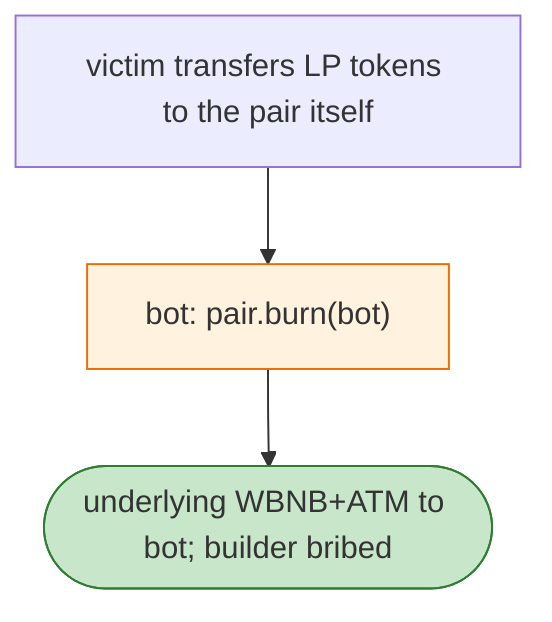

# ATM LP-Burn Exploit — LP Tokens Transferred to the Pair Are Burn-Redeemable by Anyone

> **Reproduction:** the PoC compiles & runs in an isolated Foundry project at
> [this project folder](.). Full verbose trace: [output.txt](output.txt).
> Verified vulnerable source: [PancakePair](sources/PancakePair_9753a6).

---

## Key info

| | |
|---|---|
| **Loss** | WBNB/ATM drained (BSC); tx `0x5c27edc3…` |
| **Vulnerable contract** | ATM/WBNB Pancake V2 pair `0x9753A64f…` |
| **Attacker (bot)** | `0x0EB4075C…` |
| **Chain / block / date** | BSC / Jun 2026 |
| **Bug class** | LP-token-misplacement + Pancake-V2 semantics — a victim transferred LP tokens **to the pair itself**; Pancake V2 `burn` redeems the pair-held LP balance, so a bot burned that LP and received the underlying. |

---

## TL;DR

Per the embedded analysis: victim `0xbe83` added WBNB/ATM liquidity, then **mistakenly transferred the
LP tokens to the pair itself**. Because Pancake V2 `burn` redeems the pair-held LP balance, a bot could
call `burn`, receive the underlying WBNB and ATM, pay most WBNB as native BNB to the builder, and keep
the rest.

---

## Root cause

A **user error (LP→pair transfer)** combined with Pancake-V2's design that `burn` pays out the pair's
own LP balance to `msg.sender`. Not a protocol code bug per se, but an exploit of the LP-misplacement
plus the permissionless burn path.

---

## Diagrams



---

## Remediation

1. Wallets/UX should warn against transfers to the pair address; pair should block receiving its own
   LP (or auto-skim to a sink).

---

## How to reproduce

```bash
_shared/run_poc.sh 2026-06-ATM_LP_Burn_exp -vvvvv
```

- RPC: BSC archive. Result: `[PASS]` — pair-held LP burned for underlying.

---

*Reference: ATM LP-misplacement + Pancake V2 burn redemption, BSC, Jun 2026.*
