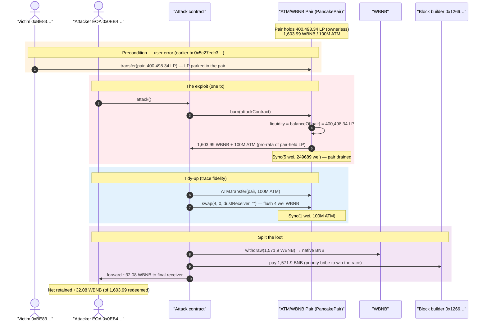
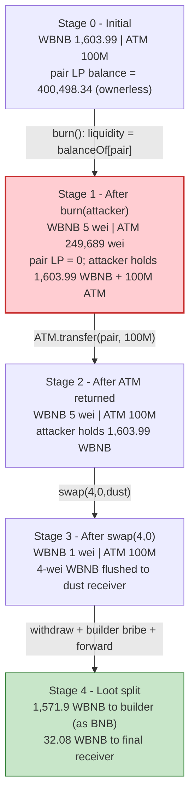
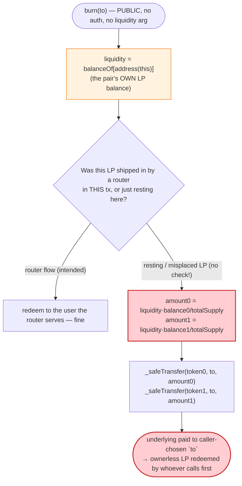
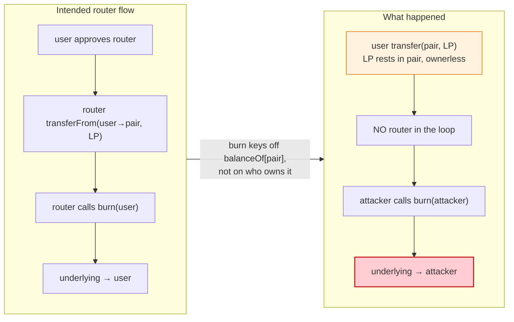

# ATM LP-Burn Exploit — Misplaced LP Tokens Are Burn-Redeemable by Anyone via PancakeV2 `burn()`

> **Vulnerability classes:** vuln/access-control/missing-auth · vuln/logic/missing-check

> **Reproduction:** the PoC compiles & runs in an isolated Foundry project at
> [this project folder](.) (the umbrella DeFiHackLabs repo contains several unrelated
> PoCs that do not all compile together, so this one was extracted and runs offline
> against a pinned local fork).
> Full verbose trace: [output.txt](output.txt).
> Verified vulnerable source: [PancakePair.sol](sources/PancakePair_9753a6/PancakePair.sol).

---

## Key info

| | |
|---|---|
| **Loss** | **1,603.99 WBNB** redeemed out of the ATM/WBNB pair (~$1.6M-class drain of the pool's WBNB side + 100,000,000 ATM); the attacker kept **~32.08 WBNB** net and forwarded ~1,571.9 WBNB to the block builder as a native-BNB bribe |
| **Vulnerable contract** | `PancakePair` (ATM/WBNB) — [`0x9753A64fB7C233Fdc43f04daB9CcA88e1e229eBA`](https://bscscan.com/address/0x9753a64fb7c233fdc43f04dab9cca88e1e229eba#code) |
| **Victim** | LP owner `0xBE8351C14e5108A57A545DFA8669Fa31aA6aDC68` — added liquidity, then mistakenly transferred the LP to the pair |
| **Attacker EOA** | [`0x0EB4075C87cCD23a7AE1E00D77B043e4e8cC5894`](https://bscscan.com/address/0x0eb4075c87ccd23a7ae1e00d77b043e4e8cc5894) |
| **Attacker contract** | `0x48b549e6b551c151bd392bb9acab1f88263adf48` (on-chain); re-deployed in the PoC at `0x5615dEB798BB3E4dFa0139dFa1b3D433Cc23b72f` |
| **Final profit receiver** | `0xfBa52f861E79C46333A308ba8f86bf136A44B2D3` |
| **Builder payment receiver** | `0x1266C6bE60392A8Ff346E8d5ECCd3E69dD9c5F20` |
| **Attack tx** | [`0x4e9f3dc3ce3c0a6aa19dae0f1384ff46e801b433b7e3bc4c780de486db6c950a`](https://bscscan.com/tx/0x4e9f3dc3ce3c0a6aa19dae0f1384ff46e801b433b7e3bc4c780de486db6c950a) |
| **Victim LP-transfer tx** | [`0x5c27edc326e38641d8ce6093cd7f15ae5fca039f5fb988b7f10cb432e6e3a056`](https://bscscan.com/tx/0x5c27edc326e38641d8ce6093cd7f15ae5fca039f5fb988b7f10cb432e6e3a056) |
| **Chain / block / date** | BSC (chainId 56) / fork block 105,692,847 / June 2026 |
| **Compiler** | Solidity v0.5.16+commit.9c3226ce, optimizer **disabled** (`"optimizer":"0"`), runs 200 |
| **Bug class** | LP-token misplacement + PancakeV2 `burn()` semantics — `burn()` redeems the pair's **own** LP balance for whoever calls it, so LP accidentally sent to the pair is a free-for-all |

---

## TL;DR

1. The ATM/WBNB pair is a stock **PancakeSwap V2 pair** (`PancakePair`, Solidity 0.5.16). Its
   `burn(address to)` function redeems liquidity equal to `balanceOf[address(this)]` — i.e. **whatever
   LP tokens the pair contract itself happens to hold**
   ([PancakePair.sol#L427-L449](sources/PancakePair_9753a6/PancakePair.sol#L427-L449)).

2. The victim `0xBE8351…` added WBNB/ATM liquidity (minting LP to themselves), then — in a separate
   transaction ([`0x5c27edc3…`](https://bscscan.com/tx/0x5c27edc326e38641d8ce6093cd7f15ae5fca039f5fb988b7f10cb432e6e3a056))
   — **transferred the LP tokens to the pair address itself** instead of to a wallet or a router.
   Pancake LP is a normal ERC-20: the transfer simply credited `balanceOf[pair] += 400,498 LP`.

3. PancakeV2's design assumes `burn()` is only ever entered *after* a router has just moved LP into the
   pair within the same transaction (the router pulls the user's LP, sends it to the pair, then calls
   `burn`). It has **no notion of "whose" LP this is** — it pays the underlying to the `to` argument the
   caller supplies. So once LP is resting in the pair, **anyone** can call `burn(theirOwnAddress)` and
   walk away with the underlying.

4. A searcher bot did exactly that. In one transaction the attacker contract called
   `pair.burn(attackerContract)`, which burned the pair-held **400,498.34 LP** and paid out
   **1,603.99 WBNB** (raw `1603989214300816939995` wei,
   [output.txt:87](output.txt)) and **100,000,000 ATM** (raw `99999999999999999999750311` wei,
   [output.txt:87](output.txt)) to the attacker.

5. The attacker did not care about the ATM side — they **transferred all 100M ATM back into the pair**
   and called `swap(4, 0, …)` to flush the 4-wei WBNB rounding remainder out
   ([output.txt:96-108](output.txt)), leaving the pair with `reserve0 = 1 wei WBNB`, `reserve1 = 100M ATM`.

6. Of the 1,603.99 WBNB redeemed, the attacker **withdrew 1,571.9 WBNB to native BNB and paid it to the
   block builder** as a priority bribe (`0x1266C6bE…`, [output.txt:117-125](output.txt)) to win the
   backrun race, and **kept the remaining ~32.08 WBNB** which it forwarded to the final receiver
   ([output.txt:128](output.txt)).

7. Net booked profit (the PoC's assertion subject): the final receiver's WBNB balance grew from
   `1108972216356650216` (~1.109 WBNB) to `33188756502372989017` (~33.189 WBNB)
   ([output.txt:35,136](output.txt)) — a **+32.08 WBNB** (`32079784286016338801` wei) gain
   ([output.txt:137](output.txt)).

---

## Background — what the ATM/WBNB pair is

There is **no exotic protocol here** — that is precisely the point. The "vulnerable contract" is an
unmodified PancakeSwap V2 liquidity pair for the ATM token against WBNB. The bug is not a flaw in ATM
or in the pair's code per se; it is the **interaction between a user error (sending LP to the pair) and
the pair's standard `burn()` accounting**, which makes the misplaced LP redeemable by anyone.

PancakeV2's `mint`/`burn`/`swap` are "low-level" functions that, by the canonical comment in the source,
*"should be called from a contract which performs important safety checks"*
([PancakePair.sol#L426](sources/PancakePair_9753a6/PancakePair.sol#L426)). The router is that contract:
on a normal withdrawal the router pulls the user's LP via `transferFrom`, ships it to the pair, then
calls `burn` in the same call — so the LP only ever sits in the pair for the duration of one transaction
and is always attributed to the user that the router redeems for. When LP is sent to the pair **outside**
that flow and just sits there, the next caller of `burn` collects it.

On-chain state observed at the fork block (block 105,692,847), read directly from the trace:

| Parameter | Value (raw) | ~Human | Source |
|---|---:|---:|---|
| LP held by the pair itself (`balanceOf[pair]`) | 400,498,341,357,466,415,661,652 | ~400,498.34 LP | [output.txt:44](output.txt) |
| LP held by the victim `0xBE83…` | 0 | 0 | [output.txt:48](output.txt) |
| Pair WBNB balance (token0) before burn | 1,603,989,214,300,816,940,000 | ~1,603.99 WBNB | [output.txt:56](output.txt) |
| Pair ATM balance (token1) before burn | 100,000,000,000,000,000,000,000,000 | 100,000,000 ATM | [output.txt:58](output.txt) |
| Factory `feeTo` | `0x0ED943Ce24BaEBf257488771759F9BF482C39706` | (fee on) | [output.txt:60](output.txt) |
| Final receiver WBNB before | 1,108,972,216,356,650,216 | ~1.109 WBNB | [output.txt:35](output.txt) |

The pair's `token0 = WBNB` and `token1 = ATM` — confirmed by the order in which `burn` reads balances
(`WBNB::balanceOf` then `ATM::balanceOf`, [output.txt:55-58](output.txt)) and by the `Burn` event's
`amount0` (WBNB) / `amount1` (ATM) ordering ([output.txt:79](output.txt)).

---

## The vulnerable code

### 1. `burn()` redeems the pair's *own* LP balance to an arbitrary `to`

```solidity
// this low-level function should be called from a contract which performs important safety checks
function burn(address to) external lock returns (uint amount0, uint amount1) {
    (uint112 _reserve0, uint112 _reserve1,) = getReserves(); // gas savings
    address _token0 = token0;                                // gas savings
    address _token1 = token1;                                // gas savings
    uint balance0 = IERC20(_token0).balanceOf(address(this));
    uint balance1 = IERC20(_token1).balanceOf(address(this));
    uint liquidity = balanceOf[address(this)];               // ⚠️ "whose" LP? whatever the pair holds

    bool feeOn = _mintFee(_reserve0, _reserve1);
    uint _totalSupply = totalSupply; // gas savings, must be defined here since totalSupply can update in _mintFee
    amount0 = liquidity.mul(balance0) / _totalSupply; // using balances ensures pro-rata distribution
    amount1 = liquidity.mul(balance1) / _totalSupply; // using balances ensures pro-rata distribution
    require(amount0 > 0 && amount1 > 0, 'Pancake: INSUFFICIENT_LIQUIDITY_BURNED');
    _burn(address(this), liquidity);
    _safeTransfer(_token0, to, amount0);                     // ⚠️ underlying paid to caller-chosen `to`
    _safeTransfer(_token1, to, amount1);                     // ⚠️
    balance0 = IERC20(_token0).balanceOf(address(this));
    balance1 = IERC20(_token1).balanceOf(address(this));

    _update(balance0, balance1, _reserve0, _reserve1);
    if (feeOn) kLast = uint(reserve0).mul(reserve1); // reserve0 and reserve1 are up-to-date
    emit Burn(msg.sender, amount0, amount1, to);
}
```
([PancakePair.sol#L426-L449](sources/PancakePair_9753a6/PancakePair.sol#L426-L449))

The single decisive line is `uint liquidity = balanceOf[address(this)];`
([PancakePair.sol#L433](sources/PancakePair_9753a6/PancakePair.sol#L433)). `burn` does **not** take a
`liquidity` argument, does **not** pull LP from `msg.sender`, and does **not** record who owns the LP it
is about to redeem. It redeems *everything the pair contract currently holds in its own LP balance* and
pays the underlying to the `to` argument — fully attacker-controlled.

### 2. LP is a plain ERC-20 transfer — sending it to the pair just credits the pair's balance

```solidity
function _transfer(address from, address to, uint value) private {
    balanceOf[from] = balanceOf[from].sub(value);
    balanceOf[to]   = balanceOf[to].add(value);
    emit Transfer(from, to, value);
}

function transfer(address to, uint value) external returns (bool) {
    _transfer(msg.sender, to, value);
    return true;
}
```
([PancakePair.sol#L158-L172](sources/PancakePair_9753a6/PancakePair.sol#L158-L172))

Nothing rejects `to == address(this)`. When the victim called `pair.transfer(pair, 400,498 LP)`, the
pair's own `balanceOf[pair]` rose to 400,498.34 LP — the exact precondition `burn()` keys off.

### 3. The "safety belongs in the caller" comment is the whole bug

```solidity
// this low-level function should be called from a contract which performs important safety checks
function mint(address to) external lock returns (uint liquidity) { ... }
// this low-level function should be called from a contract which performs important safety checks
function burn(address to) external lock returns (uint amount0, uint amount1) { ... }
```
([PancakePair.sol#L402-L427](sources/PancakePair_9753a6/PancakePair.sol#L402-L427))

The pair deliberately delegates correctness to the router. Once a user bypasses the router and parks LP
in the pair, there is **no router in the loop** and no safety check — `burn` is permissionless and the
first caller wins.

---

## Root cause — why it was possible

Two facts compose:

1. **User error: LP tokens were transferred to the pair contract itself.** PancakeV2 LP is a standard
   ERC-20 with no guard against `to == pair`. The victim's withdrawal flow should have approved the
   router and called `removeLiquidity`; instead the LP landed in the pair as a dead, ownerless balance.
   The trace confirms the precondition exactly: `balanceOf[pair] = 400,498.34 LP`
   ([output.txt:44](output.txt)) while `balanceOf[victim] = 0` ([output.txt:48](output.txt)).

2. **PancakeV2 `burn()` redeems the pair's own LP balance for an arbitrary recipient.** `burn` reads
   `liquidity = balanceOf[address(this)]` ([PancakePair.sol#L433](sources/PancakePair_9753a6/PancakePair.sol#L433))
   and pays out to the caller-supplied `to`. It has no concept of LP ownership for resting balances — it
   assumes the only way LP reaches the pair is the router shipping it in immediately before the `burn`
   call. That assumption breaks the moment LP rests in the pair.

The result is that **misplaced LP is a public bounty**: any searcher monitoring the mempool/chain for
`balanceOf[pair] > 0` can call `burn(self)` and pocket the pro-rata underlying. This is the LP-side
analogue of "tokens sent directly to a contract are stuck/claimable" — here they are *claimable by
anyone* because the redemption primitive is permissionless. No flash loan, no signature, no reserve
manipulation is required; the attacker simply got there first.

The block-builder bribe (≈1,571.9 WBNB of the 1,603.99 redeemed) is not part of the vulnerability — it
is the attacker's cost of **winning the race** against other bots for the same free LP. The protocol
loss is the full 1,603.99 WBNB + 100M ATM redeemed from the pair; how the searcher split it between the
builder and itself is incidental.

---

## Preconditions

- **LP tokens resting in the pair contract** (`balanceOf[pair] > 0`). Created here by the victim's
  mistaken `transfer(pair, …)`. The PoC asserts this is true at the fork block:
  `assertGt(pairHeldLp, 400_000 ether)` and `assertEq(balanceOf(LP_OWNER), 0)`
  ([ATM_LP_Burn_exp.sol#L56-L58](test/ATM_LP_Burn_exp.sol#L56-L58)).
- **The pair holds real underlying reserves** so the redemption is worth something (1,603.99 WBNB +
  100M ATM, [output.txt:56-58](output.txt)).
- **`burn()` is permissionless** (it is, in stock PancakeV2). No allowance, signature, or role is
  required — the attacker only needs to be the first to call it after the LP lands.
- **No capital required.** The attacker needs only gas (and, optionally, a builder bribe to win the
  race). This is a pure "found money" backrun, not a flash-loan-funded reserve attack.

---

## Attack walkthrough (with on-chain numbers from the trace)

All figures are taken directly from the `Transfer` / `Sync` / `Burn` / `Swap` events and `balanceOf`
returns in [output.txt](output.txt). Amounts are raw (18-decimal) wei with human approximations in
parentheses. The pair's `token0 = WBNB` (reserve0), `token1 = ATM` (reserve1).

| # | Step | Pair WBNB (r0) | Pair ATM (r1) | Pair LP balance | Effect |
|---|------|---------------:|--------------:|----------------:|--------|
| 0 | **Initial** (pre-attack reads) | 1,603,989,214,300,816,940,000 (~1,603.99) [output.txt:56](output.txt) | 100,000,000,000,000,000,000,000,000 (100M) [output.txt:58](output.txt) | 400,498,341,357,466,415,661,652 (~400,498.34) [output.txt:44](output.txt) | Victim's LP is parked in the pair; victim holds 0 [output.txt:48](output.txt). |
| 1 | **`pair.burn(attacker)`** — burns the pair-held LP ([output.txt:54-87](output.txt)). `Transfer(pair→0, 400,498.34 LP)` [output.txt:61](output.txt); pays out `1,603,989,214,300,816,939,995` WBNB [output.txt:62-63](output.txt) and `99,999,999,999,999,999,999,750,311` ATM [output.txt:68-69](output.txt) to the attacker contract. | 5 wei (~0) [output.txt:75](output.txt) | 249,689 wei (~0) [output.txt:77](output.txt) | 0 (burned) | `Sync(5, 249689)` [output.txt:78](output.txt); `Burn(amount0=1.603e21, amount1=9.999e25)` [output.txt:79](output.txt). Pair drained to dust. |
| 2 | **Return ATM to the pair** — attacker `ATM.transfer(pair, 99,999,999,999,999,999,999,750,311)` ([output.txt:88-89](output.txt)). | 5 wei [output.txt:94](output.txt) | 100,000,000,000,000,000,000,000,000 (100M) [output.txt:106](output.txt) | 0 | Restores the ATM side; the attacker only wanted the WBNB. |
| 3 | **`pair.swap(4, 0, dustReceiver, "")`** — flush the 4-wei WBNB remainder (balance 5 − 1) ([output.txt:96-108](output.txt)). `Transfer(pair→dust, 4)` [output.txt:98](output.txt). | 1 wei [output.txt:104](output.txt) | 100,000,000,000,000,000,000,000,000 (100M) [output.txt:106](output.txt) | 0 | `Sync(1, 1e26)` [output.txt:107](output.txt); `Swap(amount1In=9.999e25, amount0Out=4)` [output.txt:108](output.txt). |
| 4 | **Builder bribe** — attacker holds 1,603,989,214,300,816,939,995 WBNB [output.txt:113](output.txt); `WBNB.withdraw(1,571,909,430,014,800,601,194)` → native BNB ([output.txt:117-123](output.txt)) and pays it to the builder `0x1266C6bE…` ([output.txt:124](output.txt)). | 1 wei | 100M | 0 | ~1,571.9 WBNB leaves as the priority bribe to win the race. |
| 5 | **Forward profit** — remaining `32,079,784,286,016,338,801` WBNB (~32.08) [output.txt:127](output.txt) transferred to the final receiver `0xfBa52f…` ([output.txt:128-129](output.txt)). | 1 wei | 100M | 0 | Final receiver WBNB: 1.109 → 33.189 [output.txt:135-136](output.txt). |

The two `swap`/`transfer` gymnastics in steps 2–3 are pure trace-fidelity reproduction of what the real
attacker did to leave the pair in a tidy state (ATM restored, WBNB at 1 wei); the value extraction is
entirely in **step 1's `burn`**.

### Profit / loss accounting (WBNB, raw wei)

| Item | Amount (wei) | ~Human |
|---|---:|---:|
| WBNB redeemed from the pair via `burn` | 1,603,989,214,300,816,939,995 | ~1,603.99 |
| ATM redeemed from the pair via `burn` | 99,999,999,999,999,999,999,750,311 | ~100,000,000 ATM |
| − Builder bribe (withdrawn to BNB, paid to `0x1266C6bE…`) | 1,571,909,430,014,800,601,194 | ~1,571.91 |
| = WBNB forwarded to final receiver | 32,079,784,286,016,338,801 | ~32.08 |
| Final receiver WBNB before | 1,108,972,216,356,650,216 | ~1.109 |
| Final receiver WBNB after | 33,188,756,502,372,989,017 | ~33.189 |
| **Net booked profit (PoC assertion subject)** | **32,079,784,286,016,338,801** | **~32.08** |

Reconciliation: `1,603,989,214,300,816,939,995 (redeemed) − 1,571,909,430,014,800,601,194 (bribe) =
32,079,784,286,016,338,801` = the WBNB forwarded to the final receiver, matching the on-chain delta
`33,188,756,502,372,989,017 − 1,108,972,216,356,650,216 = 32,079,784,286,016,338,801`
([output.txt:35,136-137](output.txt)). The PoC asserts `profit > 32 ether`
([ATM_LP_Burn_exp.sol#L64](test/ATM_LP_Burn_exp.sol#L64)) and that the pair's own LP balance is now 0
([ATM_LP_Burn_exp.sol#L65](test/ATM_LP_Burn_exp.sol#L65), [output.txt:140](output.txt)).

The headline **1,603.99 WBNB** is the protocol-level loss (the victim's entire WBNB liquidity); the
~32.08 WBNB is merely the attacker's *retained* slice after bribing the builder for the win.

---

## Diagrams

### Sequence of the attack



### Pool / LP state evolution



### The flaw inside `burn()`



### Why the LP is a free bounty: ownership vs. redemption



---

## Why each magic number

- **`forkBlock = 105_692_847`** ([ATM_LP_Burn_exp.sol#L37](test/ATM_LP_Burn_exp.sol#L37)): the block at
  which the pair already holds the victim's misplaced LP (after tx `0x5c27edc3…`) but before the
  attacker's `burn`. Pinning here reproduces the exact pre-attack state.
- **`assertGt(pairHeldLp, 400_000 ether)`** ([ATM_LP_Burn_exp.sol#L57](test/ATM_LP_Burn_exp.sol#L57)):
  sanity-checks the precondition — the pair really holds ~400,498.34 LP
  ([output.txt:44-45](output.txt)). The exact figure is read at runtime, not hard-coded.
- **`require(wbnbAmount > 1600 ether)` / `require(atmAmount > 99_000_000 ether)`**
  ([ATM_LP_Burn_exp.sol#L87-L88](test/ATM_LP_Burn_exp.sol#L87-L88)): assert the `burn` redeemed the
  expected order of magnitude — 1,603.99 WBNB and ~100M ATM ([output.txt:87](output.txt)).
- **`wbnbDustOut = balanceOf(pair) − 1`** ([ATM_LP_Burn_exp.sol#L92](test/ATM_LP_Burn_exp.sol#L92)):
  after the burn the pair retains 5 wei WBNB (rounding residue, [output.txt:75](output.txt)); the swap
  pulls out `5 − 1 = 4` wei ([output.txt:96](output.txt)), leaving 1 wei. PancakeV2 `swap` requires the
  output to be strictly less than the reserve, hence the `− 1`.
- **`builderPayment = 1_571_909_430_014_800_601_194`**
  ([ATM_LP_Burn_exp.sol#L99](test/ATM_LP_Burn_exp.sol#L99)): the exact native-BNB amount the real
  attacker paid the block builder to win the backrun race
  ([output.txt:117,120](output.txt)). It is hard-coded to reproduce the on-chain split; the residual
  (~32.08 WBNB) is what the attacker kept.
- **`attacker = FINAL_PROFIT_RECEIVER` (`0xfBa52f…`)** ([ATM_LP_Burn_exp.sol#L40](test/ATM_LP_Burn_exp.sol#L40)):
  the harness measures "profit" against the final WBNB receiver, the wallet that actually banked the
  retained ~32.08 WBNB.

---

## Remediation

This is primarily a **user-facing / UX** failure plus an inherent PancakeV2 design property. Mitigations:

1. **Never transfer LP tokens to the pair address.** Withdraw liquidity through the router
   (`approve` + `removeLiquidity` / `removeLiquidityETH`), which atomically pulls the LP and redeems it
   to you in one transaction. Wallets and dApp front-ends should hard-block or loudly warn on any
   transfer whose `to` is a known AMM pair (especially the *same* pair as the token being sent).
2. **If LP is already misplaced, recover it immediately.** The owner cannot un-burn it, but a trusted
   operator could front-run searchers by calling `burn(owner)` themselves in a private bundle the moment
   the misplacement is detected — turning the race in the victim's favor.
3. **Pair-level hardening (for forks/new AMMs).** A pair could reject `transfer`/`transferFrom` of its
   own LP to `address(this)` (revert when `to == address(this)`), or have `burn` only credit LP that was
   moved in within the same transaction (track a per-tx delta) rather than the resting balance. Stock
   PancakeV2/UniV2 does neither — its `burn` keys off `balanceOf[address(this)]` by design
   ([PancakePair.sol#L433](sources/PancakePair_9753a6/PancakePair.sol#L433)).
4. **Treat "tokens/LP resting in a contract" as a public bounty.** Any value parked in a contract with a
   permissionless redemption primitive will be swept by searchers. Design integrations so value never
   rests in an address that exposes such a primitive.

---

## How to reproduce

The PoC runs **offline** against a pinned local fork (the harness serves BSC state from
`anvil_state.json` via a local anvil on `127.0.0.1:8546`, which `createSelectFork` points at —
[ATM_LP_Burn_exp.sol#L38](test/ATM_LP_Burn_exp.sol#L38)):

```bash
_shared/run_poc.sh 2026-06-ATM_LP_Burn_exp --mt testExploit -vvvvv
```

- **EVM:** `foundry.toml` sets `evm_version = 'cancun'`; the bundled anvil state pins BSC block
  105,692,847.
- **No public RPC needed:** the fork URL is the local anvil port; there is no public endpoint named in
  `foundry.toml`.
- **Result:** `[PASS] testExploit()` — the pair-held LP is burned for its underlying, ~32.08 WBNB is
  retained by the final receiver, and the pair's own LP balance ends at 0.

Expected tail (from [output.txt:3-7,152-154](output.txt)):

```
Ran 1 test for test/ATM_LP_Burn_exp.sol:ContractTest
[PASS] testExploit() (gas: 925401)
Logs:
  Attacker Before exploit WBNB Balance: 1.108972216356650216
  Attacker After exploit WBNB Balance: 33.188756502372989017

Suite result: ok. 1 passed; 0 failed; 0 skipped; finished in 1.47s (11.99ms CPU time)
```

---

*Reference: TenArmor alert — https://x.com/TenArmorAlert/status/2068993748936151209 (ATM LP-burn, BSC, 1,603.99 WBNB).*
