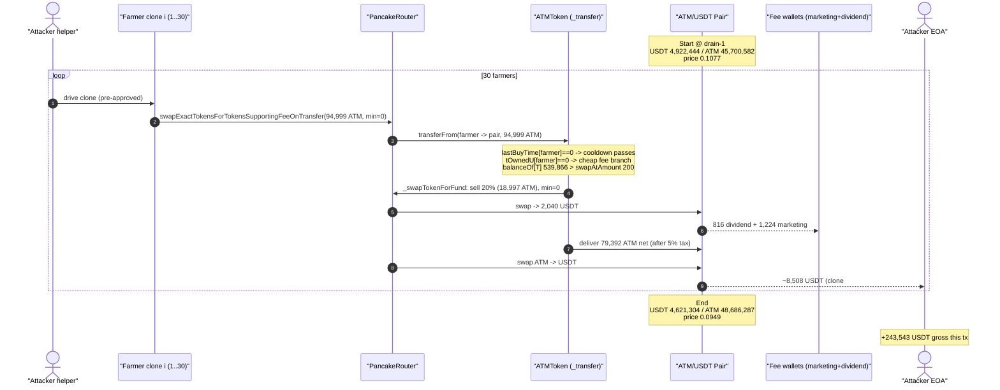
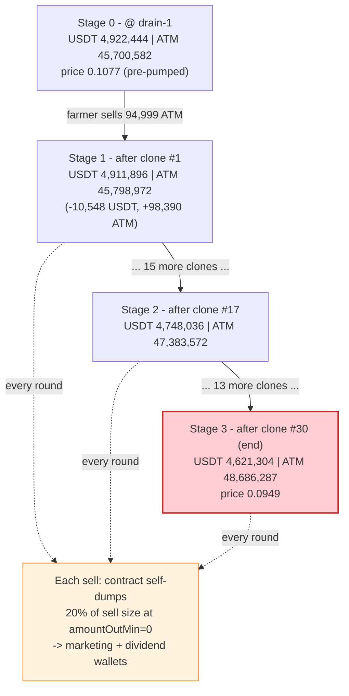
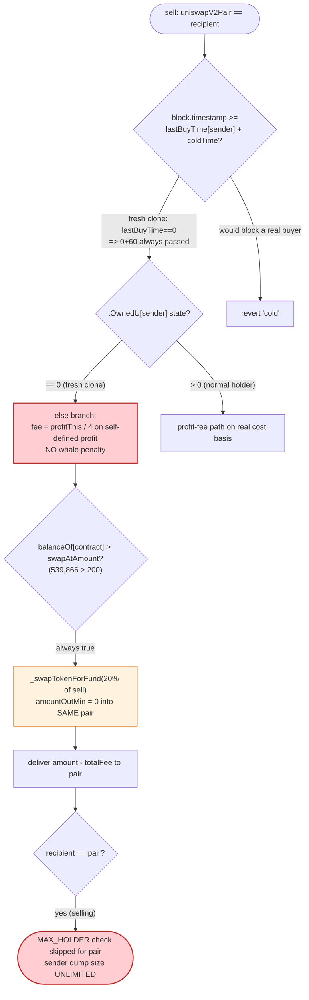
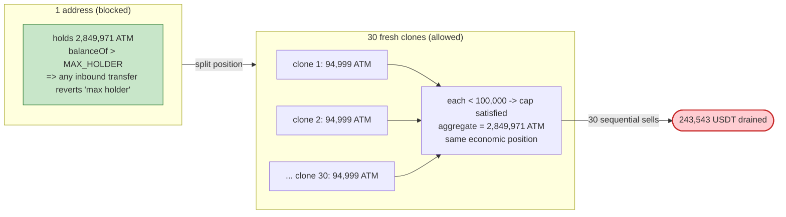

# ATM Token Exploit — Per-Address Anti-Whale Guards Sidestepped by 30 Sybil "Farmer" Clones

> **Vulnerability classes:** vuln/logic/missing-check · vuln/defi/slippage

> **Reproduction:** the PoC compiles & runs in an isolated Foundry project at
> [this project folder](.) (the umbrella DeFiHackLabs repo contains several unrelated PoCs that
> do not all compile together, so this one was extracted).
> Full verbose trace: [output.txt](output.txt).
> Verified vulnerable source: [contracts_ATMToken.sol](sources/ATMToken_986058/contracts_ATMToken.sol).

---

## Key info

| | |
|---|---|
| **Loss** | ~**$243,543 USDT** gross drained from the ATM/USDT PancakeSwap pair in the cash-out tx (attacker net ≈ **$89,224** after the ~$154,319 setup buy) |
| **Vulnerable contract** | `ATMToken` — [`0x986058ec93756E57b4e55b406dD0BeE24bcD95e3`](https://bscscan.com/address/0x986058ec93756E57b4e55b406dD0BeE24bcD95e3#code) |
| **Victim pool** | ATM/USDT Cake-LP pair — [`0x659b44D603052132Fd36cf048D9e0BA1e307AE3a`](https://bscscan.com/address/0x659b44D603052132Fd36cf048D9e0BA1e307AE3a) |
| **Attacker EOA** | [`0x7e7C1f0D567c0483f85e1d016718E44414CdBAFE`](https://bscscan.com/address/0x7e7C1f0D567c0483f85e1d016718E44414CdBAFE) |
| **Attacker helper** | `0xeCe23b485c38110b7a50B5067B7D4B644f897Dc9` (drives the 30 farmer clones) |
| **Setup tx (buy leg)** | `0x3738909da7960d72efc2635d73aff5f15ef14a1b18ee0281abaa3d4c94adc69b` (block 102,070,707) |
| **Drain tx (sell leg)** | `0x37b90a337075cd2feea93b12780abe9f953dad476e1c1418a02447aaa6dcfd86` (block 102,072,357) |
| **Chain / block / date** | BSC / drain block **102,072,357** / June 4, 2026 |
| **Compiler** | Solidity **v0.8.20**, optimizer **1 run** |
| **Bug class** | Broken anti-whale / anti-bot controls (per-sender state keying) + un-bounded `amountOutMin=0` self-dump — Sybil-evadable transfer-tax DeFi token |

---

## TL;DR

`ATMToken` is a PancakeSwap-listed "tax token" with a thick layer of anti-whale / anti-bot
protections bolted onto its custom `_transfer()`
([contracts_ATMToken.sol:85-210](sources/ATMToken_986058/contracts_ATMToken.sol#L85-L210)). Every
one of those protections keys exclusively off **freshly-controllable per-address state**:

- `MAX_HOLDER = 100,000 ATM` is checked **only on the recipient**
  ([:205-209](sources/ATMToken_986058/contracts_ATMToken.sol#L205-L209)).
- the 1-minute sell lock `block.timestamp >= lastBuyTime[sender] + coldTime` is satisfied for any
  address that never bought (so `lastBuyTime == 0`)
  ([:149-152](sources/ATMToken_986058/contracts_ATMToken.sol#L149-L152)).
- the 25% "profit fee" uses a per-address USD cost-basis ledger `tOwnedU[sender]`; a fresh address
  with `tOwnedU == 0` takes the cheap `else` branch
  ([:165-185](sources/ATMToken_986058/contracts_ATMToken.sol#L165-L185)).

All three are trivially defeated by **spreading the position across many brand-new addresses**, each
holding just under `MAX_HOLDER`. The attacker built **30 CREATE2 "farmer" clones**, each loaded with
~94,999 ATM (< 100,000), and dumped them one after another into a pre-pumped pool.

Compounding the loss, the token's **`_transfer` sell branch auto-dumps 20% of the sell size of the
contract's OWN ATM holdings into the same pair at `amountOutMin = 0`**
([:190-198](sources/ATMToken_986058/contracts_ATMToken.sol#L190-L198) →
[`_swapTokenForFund`:212-239](sources/ATMToken_986058/contracts_ATMToken.sol#L212-L239)). On every
farmer sell this fired, leaking another ~$57,596 USDT to the marketing/dividend wallets — a separate
value sink that actually slightly *worsened* the price the attacker sold into, yet still drained the
LPs.

Net effect, reproduced on a fork at `DRAIN_BLOCK − 1`: **30 sequential farmer sells extract
$243,543 USDT** from the pool to the attacker, exactly the figure SlowMist reports.

---

## Background — what ATMToken does

`ATMToken` ([source](sources/ATMToken_986058/contracts_ATMToken.sol)) is an 18-decimal ERC20
(`210,000,000 ATM` initial supply) paired against **USDT** on PancakeSwap. The token routes ALL
non-excluded transfers through a custom `_transfer()` that branches three ways on whether the pair is
the sender (buy / remove-liquidity), the recipient (sell / add-liquidity), or neither (normal
transfer). Key on-chain parameters, read live at the fork block via `testRecon()`:

| Parameter | Value at drain block |
|---|---|
| `presale` | `true` (trading live) |
| `swapAtAmount` | **200 ATM** (auto-swap threshold) |
| `numTokensSellRate` | **20** (= 20% of each sell auto-dumped) |
| `MAX_HOLDER` | 100,000 ATM |
| `coldTime` | 60 s (sell lock after a buy) |
| `MAX_BURN` | 159,000,000 ATM |
| ATM held by the token contract itself | **539,866 ATM** (≫ `swapAtAmount` → auto-swap fires) |
| Pair USDT reserve | **4,922,444.75 USDT** |
| Pair ATM reserve | **45,700,582.36 ATM** (already burn-pumped from ~92M) |
| Implied price | **~0.1077 USDT/ATM** (pumped from ~0.053 in setup) |
| Farmer clones | **30**, each ~94,999.05 ATM (total **2,849,971 ATM**) |

The two facts that make this a payday: the pool was already **pumped to ~0.108 USDT/ATM** by a
132-tx burn-on-buy ratchet (removing ~45.7M ATM into `0xdead`) *before* the drain, and the attacker
held **2.85M pumped ATM** spread across 30 sub-`MAX_HOLDER` clones, ready to dump.

---

## The vulnerable code

### 1. The sell branch — per-sender guards + the 20% self-dump

```solidity
} else if (uniswapV2Pair == recipient) {
    if (_isAddLiquidity()) {
        ...
    } else {
        require(
            block.timestamp >= lastBuyTime[sender] + coldTime,   // ⚠️ fresh sender: lastBuyTime==0 ⇒ always true
            "cold"
        );
        //sell
        (uint112 reserveU, uint112 reserveThis, ) = IUniswapV2Pair(uniswapV2Pair).getReserves();
        uint256 tFee = (amount * 500) / 10000;                     // flat 5% tax
        uint256 amountUOut = Helper.getAmountOut(amount - tFee, reserveThis, reserveU);
        _deliveryReserveU(reserveU);
        uint256 fee;
        if (tOwnedU[sender] >= amountUOut) {
            unchecked { tOwnedU[sender] = tOwnedU[sender] - amountUOut; }
        } else if (tOwnedU[sender] > 0) {
            uint256 profitU = amountUOut - tOwnedU[sender];
            uint256 profitThis = Helper.getAmountOut(profitU, reserveU, reserveThis);
            fee = profitThis / 4;                                  // 25% profit fee...
            tOwnedU[sender] = 0;
        } else {                                                   // ⚠️ fresh sender: tOwnedU==0 ⇒ this branch
            uint256 profitThis = Helper.getAmountOut(amountUOut, reserveU, reserveThis);
            fee = profitThis / 4;
        }
        uint256 totalFee = tFee + fee;
        if (totalFee > 0) { super._transfer(sender, address(this), totalFee); }

        uint256 contractTokenBalance = balanceOf[address(this)];
        if (contractTokenBalance > swapAtAmount) {                 // 539,866 > 200 ⇒ always fires
            uint256 numTokensSellToFund = (amount * numTokensSellRate) / 100;  // 20% of the SELL size
            if (numTokensSellToFund > contractTokenBalance) numTokensSellToFund = contractTokenBalance;
            _swapTokenForFund(numTokensSellToFund);                // ⚠️ self-dump, amountOutMin = 0
        }
        super._transfer(sender, recipient, amount - totalFee);
    }
}
```

[contracts_ATMToken.sol:141-200](sources/ATMToken_986058/contracts_ATMToken.sol#L141-L200)

### 2. The recipient-only MAX_HOLDER check

```solidity
require(
    uniswapV2Pair == recipient ||
    balanceOf[recipient] <= MAX_HOLDER,     // ⚠️ only the RECIPIENT is capped
    "max holder"
);
```

[contracts_ATMToken.sol:205-209](sources/ATMToken_986058/contracts_ATMToken.sol#L205-L209) — there
is no cap on how much a *sender* may dump in one shot, and no aggregate / global position limit.

### 3. The self-dump sells contract reserves at `amountOutMin = 0`

```solidity
function _swapTokenForFund(uint256 _swapAmount) private lockTheSwap {
    if (_swapAmount == 0) return;
    IERC20 usdt = IERC20(USDT);
    uint256 initialBalance = usdt.balanceOf(address(this));
    _swapTokenForUsdt(_swapAmount, address(distributor));         // sell into the SAME pair
    ...
    uint256 newBalance = usdt.balanceOf(address(this)) - initialBalance;
    if (newBalance > 0) {
        uint256 dividendAmount  = (newBalance * 2) / 5;           // 40% → dividend
        uint256 marketingAmount = newBalance - dividendAmount;    // 60% → marketing
        if (dividendAmount  > 0) usdt.transfer(dividendAddress,  dividendAmount);
        if (marketingAmount > 0) usdt.transfer(marketingAddress, marketingAmount);
    }
}

function _swapTokenForUsdt(uint256 tokenAmount, address to) private {
    address[] memory path = new address[](2);
    path[0] = address(this); path[1] = address(USDT);
    uniswapV2Router.swapExactTokensForTokensSupportingFeeOnTransferTokens(
        tokenAmount, 0 /* ⚠️ accept ANY amount */, path, to, block.timestamp
    );
}
```

[contracts_ATMToken.sol:212-253](sources/ATMToken_986058/contracts_ATMToken.sol#L212-L253)

`Helper.getAmountOut` / `getAmountIn` use a 0.25% pair fee (`9975/10000`) — the standard
constant-product math, no manipulation there
([Helper.sol:13-33](sources/ATMToken_986058/contracts_lib_Helper.sol#L13-L33)).

---

## Root cause — why it was possible

The token's entire defensive surface is **per-address and per-direction**, never aggregate and never
keyed off anything an attacker can't mint on demand:

1. **`MAX_HOLDER` is enforced only on the recipient of a transfer.** A whale can therefore *sell* an
   unlimited amount in a single transaction; it can also *hold* an unlimited amount in aggregate as
   long as each individual EOA stays under 100,000 ATM. Splitting 2.85M ATM across 30 fresh addresses
   (94,999 each) satisfies the cap while controlling the same economic position.

2. **The cooldown and the profit-fee are keyed off the sender's own fresh state.** `lastBuyTime[sender]`
   and `tOwnedU[sender]` are both **zero for an address that has never bought through the token**. A
   fresh farmer's `lastBuyTime == 0`, so `block.timestamp >= 0 + 60` is always true — the 1-minute
   sell lock never engages. Its `tOwnedU == 0`, so the sell takes the `else` cost-basis branch
   ([:178-185](sources/ATMToken_986058/contracts_ATMToken.sol#L178-L185)) which charges the 25%
   "profit fee" only on a self-defined notion of profit, never the protective whale-style penalty the
   designers presumably intended.

3. **There is no global / cross-address position or velocity limit.** Nothing in `_transfer` relates
   one address's activity to another's, so 30 independent dumps are indistinguishable from 30 unrelated
   retail sells. The protections are designed against a *single* bot, not a *fleet* of Sybil clones.

4. **The self-dump uses `amountOutMin = 0` and fires on every sell.** Each farmer sell pushed
   `balanceOf[contract]` (539,866 ATM) over `swapAtAmount` (200), triggering a forced market sell of
   `20% × sellSize` of ATM into the very pool being drained, at zero slippage protection. This is a
   separate, permanent leak to the fee wallets (~$57,596 across the drain) and is not even captured by
   the attacker — it simply transfers more LP value out of the pool, this time to the marketing/dividend
   addresses.

The mechanism that *should* have penalised a large profitable exit — the 25% profit fee — was neutered
because the farmers had no recorded cost-basis (`tOwnedU == 0`). The attacker established the position
through the **setup buy leg in a separate transaction/address topology**, so by drain time each selling
clone looked like a fresh holder dumping with "no profit on the books."

---

## Preconditions

- **`presale == true`** so the sell branch is reachable (it was, [trace recon](output.txt)).
- **Position pre-staged across sub-`MAX_HOLDER` clones.** The 30 farmers were funded with ~94,999 ATM
  each and pre-approved the helper during the setup leg (block 102,070,707). Each must hold
  `< MAX_HOLDER` and have `lastBuyTime == 0` / `tOwnedU == 0` at sell time.
- **Pool pre-pumped.** A 132-tx burn-on-buy ratchet (attacker nonces 2308→2440) removed ~45.7M ATM into
  `0xdead`, lifting the price from ~0.053 → ~0.108 USDT/ATM. This is taken as given chain state at
  `DRAIN_BLOCK − 1`; the PoC does **not** replay it tx-by-tx.
- **Working USDT capital** for the setup buy (~$154,319). This is recouped from the drain, so the round
  trip nets the attacker ≈ $89,224.

---

## Attack walkthrough (with on-chain numbers from the trace)

The PoC reproduces **phase 3 only** (the headline cash-out) on a fork at block `102,072,356`
(`DRAIN_BLOCK − 1`), where the 30 farmer clones already hold their pumped ATM. The pair has
`token0 = USDT`, `token1 = ATM` (so `reserve0 = USDT`, `reserve1 = ATM`). All figures below are pulled
directly from `Sync` / `Swap` events and `getReserves` calls in [output.txt](output.txt).

### Phases of the full real-world attack

| # | Phase | Tx / block | Effect |
|---|-------|-----------|--------|
| 1 | **SETUP** | `0x3738…69b` / 102,070,707 | Helper buys ~2.85M ATM for ~154,319 USDT, sprays it across 30 fresh CREATE2 clones (~94,999 ATM each, < `MAX_HOLDER`), each pre-approving the helper. Price after ≈ 0.053 USDT/ATM. |
| 2 | **PUMP** | 132 txs, nonce 2308→2440 | Burn-on-buy ratchet removes ~45.7M ATM into `0xdead` (pair ATM reserve 92.0M → 45.7M), ~doubling price to ≈ 0.108 USDT/ATM. Baked into chain state by drain block. |
| 3 | **DRAIN** | `0x37b9…d86` / 102,072,357 | Helper drives each of the 30 clones to sell its ATM into the pumped pair. Every sell also fires the contract's 20% self-dump. **30 swaps extract 243,543 USDT to the attacker.** ← reproduced by the PoC |

### Per-farmer sell mechanics (first clone, exact trace numbers)

Each `swapExactTokensForTokensSupportingFeeOnTransferTokens(bal, 0, [ATM,USDT], attacker, …)` call on a
~94,999.05 ATM clone produced, for clone #1:

| Quantity | Value | Source |
|---|---:|---|
| ATM pulled from farmer | 94,999.05 ATM | `transferFrom` in trace |
| ATM tax routed to contract (`tFee + fee`) | 15,597.20 ATM | `Transfer → ATM` event |
| ATM net delivered to pair | 79,392.35 ATM | `Transfer → pair` event |
| **Contract self-dump fired** | sells 18,997.91 ATM (`20% × 94,999`) | nested `_swapTokenForFund` swap |
| Self-dump USDT out (→ fee wallets) | 2,040.32 USDT | nested `Swap` (split: dividend 816.13 / marketing 1,224.19) |
| **USDT out to attacker** | **8,508.22 USDT** | outer `Swap` `amount0Out`, to Attacker |

This pattern repeated 30 times; later clones netted slightly less per sell (~7,750–8,500 USDT) as each
dump and self-dump nudged the pool deeper. The contract's self-balance stayed pinned at
~539,866 ATM minus what it had already dumped, but the nested swap's USDT output is immediately swept
to the fee wallets, so `balanceOf[contract]` (in USDT) snaps back to ~146 USDT each round and ATM
self-balance always stays above `swapAtAmount`.

### Pool reserve evolution (from `getReserves` / `Sync` events)

| Stage | USDT reserve | ATM reserve | Price (USDT/ATM) |
|---|---:|---:|---:|
| **0 · @ drain−1 (start)** | 4,922,444.75 | 45,700,582.36 | 0.10771 |
| After clone #1 sell + self-dump | 4,911,896.21 | 45,798,972.63 | 0.10725 |
| After clone #17 sell | 4,748,036.16 | 47,383,572.69 | 0.10020 |
| **End (after clone #30)** | **4,621,304.51** | **48,686,287.64** | **0.09492** |

Net pool change: **−301,140 USDT** of reserve left the pair (−$243,543 to the attacker, ≈ −$57,597 to
the fee wallets), while the ATM reserve rose by **+2,985,705 ATM** (the 30 dumps + the self-dumps).
The constant-product price slid from 0.1077 → 0.0949 USDT/ATM — the LPs absorbed the entire dump.

### Profit / loss accounting (USDT)

| Direction | Amount |
|---|---:|
| Attacker USDT before (drain leg) | 2,219.10 |
| Attacker USDT after (drain leg) | 245,762.41 |
| **Gross drained to attacker (this tx)** | **243,543.31** |
| Auto-swap leak → marketing wallet | 34,558 |
| Auto-swap leak → dividend wallet | 23,038 |
| **Total auto-swap leak (separate, not attacker's)** | **≈ 57,596** |
| Setup-leg USDT spent buying in (phase 1) | ~154,319 |
| **Attacker net round-trip profit** | **≈ 89,224** |

The PoC asserts `230_000 ether < profit < 260_000 ether`
([ATM_exp.sol:191-192](test/ATM_exp.sol#L191-L192)); the realised gross of **243,543 USDT** sits
squarely in range and matches the SlowMist headline figure to the dollar.

---

## Diagrams

### Sequence of the drain (phase 3)



### Pool state evolution



### The flaw inside `_transfer` (sell branch) — why the guards never bite



### Why splitting across 30 clones defeats `MAX_HOLDER`



---

## Why each magic number

- **30 clones × 94,999.05 ATM ≈ 2,849,971 ATM:** the per-clone size is chosen just below
  `MAX_HOLDER = 100,000` so each funding transfer (recipient = clone) passes the recipient-only cap,
  while the aggregate equals the entire farmed position. 30 is simply enough buckets to hold 2.85M ATM
  at < 100k each.
- **`swapAtAmount = 200` vs. contract self-balance 539,866 ATM:** the threshold is ~2,700× below the
  contract's holdings, so the 20% self-dump fires on *every* sell, never skipped.
- **`numTokensSellRate = 20`:** 20% of each ~94,999-ATM sell ≈ 18,997 ATM auto-dumped per round,
  matching the constant `18,997,910,019,000,000,000,001` ATM seen in the nested swap of each round.
- **5% `tFee` (`amount * 500 / 10000`) + 25% profit fee (`/ 4`):** the only economic friction on a
  sell — but because the clones have `tOwnedU == 0`, the profit fee is computed on a fabricated basis
  and never reaches the punitive magnitude an anti-whale design would want.

---

## Remediation

1. **Cap the sender, not just the recipient — and cap aggregate / per-block sell size.** A
   `MAX_HOLDER`-style limit that is checked only on the recipient does nothing against dumps. Enforce a
   maximum *sell* size per transaction and a rolling per-window sell volume, and consider a global
   circulating-position cap that cannot be evaded by address-splitting.
2. **Do not key anti-bot protections off freshly-mintable per-address state.** `lastBuyTime == 0` and
   `tOwnedU == 0` make every brand-new address a privileged "no cooldown, no profit-basis" actor. Treat
   addresses with no recorded buy as *maximally* restricted (e.g., require a prior recorded buy before a
   sell is permitted), or track positions by beneficial owner rather than by raw address.
3. **Never market-sell protocol-owned reserves at `amountOutMin = 0`.** The forced 20% self-dump in
   `_swapTokenForFund` ([:246-252](sources/ATMToken_986058/contracts_ATMToken.sol#L246-L252)) accepts
   any output, so it is sandwich-able and leaks value on every trade. Use a slippage bound derived from
   an oracle/TWAP, batch the swaps, and gate them to a keeper rather than firing inline on user sells.
4. **Decouple fee-swapping from user transactions.** Triggering an AMM sell *inside* `_transfer`
   re-enters the same pool the user is trading against, compounding price impact against the protocol's
   own LPs. Accumulate fees and convert them out-of-band.
5. **Recognise that "anti-whale" per-address heuristics are Sybil-trivial.** Any limit expressible as
   "per EOA" is defeated by N EOAs. Robust protection must be economic (e.g., dynamic fees on price
   impact / pool depth) rather than identity-based.

---

## How to reproduce

The PoC was extracted into a standalone Foundry project:

```bash
_shared/run_poc.sh 2026-06-ATM_exp -vvvvv
```

- RPC: a **BSC archive** endpoint is required (fork block 102,072,356). `foundry.toml` uses
  `https://bsc-mainnet.public.blastapi.io`, which serves historical state at that block; most pruned
  public BSC RPCs fail with `header not found` / `missing trie node`.
- `testExploit()` reproduces phase 3 (the drain); `testRecon()` prints the pumped reserves, the
  contract self-balance, and the 30 farmer balances.

Expected tail:

```
Ran 2 tests for test/ATM_exp.sol:ATMExploitTest
[PASS] testExploit() (gas: 4061204)
  Attacker USDT before: 2219
  Attacker USDT after : 245762
  ------------------------------------------------
  Gross USDT drained to attacker : 243543
  Auto-swap leak -> marketing     : 34558
  Auto-swap leak -> dividend       : 23038
[PASS] testRecon() (gas: 205081)
Suite result: ok. 2 passed; 0 failed; 0 skipped
```

---

*Reference: SlowMist Hacked — https://hacked.slowmist.io/ (ATM, BSC, ~$243,500).*
