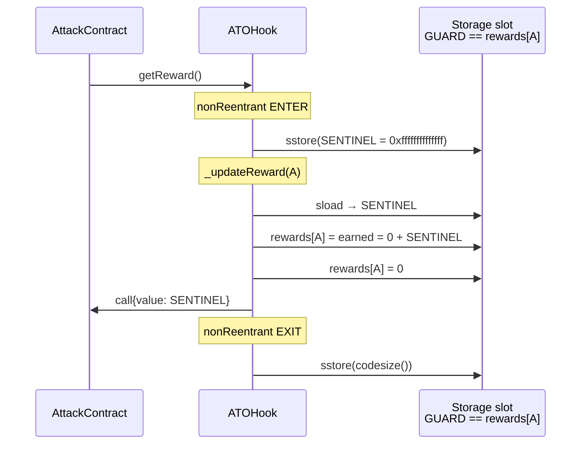
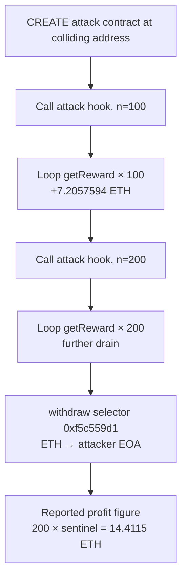

<!-- non-defihacklabs -->
# ATOHook Solady ReentrancyGuard Storage Collision — Inflated `getReward()` Drain

> **Vulnerability classes:** vuln/access-control/proxy-storage-collision · vuln/logic/incorrect-state-transition · vuln/logic/reward-calculation · vuln/logic/missing-check

> **Reproduction:** the PoC compiles & runs in an isolated Foundry project at
> [this project folder](.). The fork is served offline from the bundled
> `anvil_state.json` (local anvil replays Ethereum state at block `25244685`), so no
> public RPC is required.
> Full verbose trace: [output.txt](output.txt).
> Verified vulnerable source: [src/ATOHook.sol](sources/ATOHook_a10de7/src/ATOHook.sol),
> [ReentrancyGuard.sol](sources/ATOHook_a10de7/lib/solady/src/utils/ReentrancyGuard.sol).

---

## Key info

| | |
|---|---|
| **Loss** | **14.411518807585587 ETH** (exactly **200 × `0xffffffffffffff` wei**) |
| **Vulnerable contract** | `ATOHook` — [`0xA10De71ddB4E0d51938ef6e0118822e157a62888`](https://etherscan.io/address/0xA10De71ddB4E0d51938ef6e0118822e157a62888#code) (Uniswap v4 bonding-curve hook + Synthetix-style ETH rewards) |
| **Attacker EOA** | [`0x2D2AaFC193C24E59Bd16139056Ac9b4df4D37Ad0`](https://etherscan.io/address/0x2D2AaFC193C24E59Bd16139056Ac9b4df4D37Ad0) |
| **Attack contract** | [`0x2441E480F62bf609A08dA09143e4BAf8a817D757`](https://etherscan.io/address/0x2441E480F62bf609A08dA09143e4BAf8a817D757) (CREATE at block `25244005`) |
| **Attack txs** | First drain (`n=100`): [`0xeabb150c…`](https://etherscan.io/tx/0xeabb150cd728253c5d8844673c8d0687ab9881366ed1c9aad5b00016584e6392) · Second (`n=200`): [`0xe4e2cc3b…`](https://etherscan.io/tx/0xe4e2cc3b06144da48fa8577eb0059b713bcce97579bee59ec65c518a04716c6e) |
| **Chain / block / date** | Ethereum mainnet / fork `25244685` (first drain in `25244686`) / ~2026-06-07 |
| **Compiler** | Solidity `0.8.26` (ATOHook) |
| **Bug class** | Storage slot collision: `rewards[attackContract]` lands on Solady `ReentrancyGuard` fixed slot; `nonReentrant` entry sentinel is paid as claimable ETH |
| **Alert** | [SlowMist TI](https://x.com/SlowMist_Team/status/2063576945552462201) |

---

## TL;DR

1. `ATOHook` is a Uniswap v4 hook with a **Synthetix-style native ETH reward stream**.
   Accrued balances live in `mapping(address => uint256) public rewards` at **base slot 17**.

2. The contract also inherits **Solady `ReentrancyGuard`**, which stores its lock at a
   **fixed namespaced slot**  
   `0x02215292eb9609279094554c6e223f800950648ddfa3da30329838d6c170928d`
   (not in sequential layout).

3. For the attacker-chosen address  
   `0x2441E480F62bf609A08dA09143e4BAf8a817D757`,  
   ```
   keccak256(abi.encode(addr, uint256(17)))
     == Solady _REENTRANCY_GUARD_SLOT
   ```
   so **`rewards[attackContract]` is the guard**.

4. `getReward()` is `nonReentrant`. Entry **sstores sentinel `0xffffffffffffff`** into
   the guard. That value is then read as the claimable reward and **paid as ETH**.
   Exit sstores `codesize()` back into the same slot. Repeat **200×** → **14.4115 ETH**.

Each component is correct in isolation. The bug is **composition**: a fixed-slot
library + a sequential mapping whose key can be chosen by the attacker.

---

## Background

ATOHook pairs a bonding-curve token (`ATO`) with a Uniswap v4 hook. Sell fees and
curve surplus feed a **reward residual** (`rewardPool()` = balance − reserve −
feesAccrued). Stakers earn weight and claim native ETH via `getReward()`.

Access control and accounting are intentional:

- CEI in `getReward` (zero storage before transfer)
- `nonReentrant` on all value-moving entry points
- Solady’s namespaced guard slot (meant to avoid colliding with ordinary sequential slots)

The collision is not a classic reentrancy bug. The guard **works**. It just shares
storage with a user-keyed mapping for one special address.

---

## Slot math (the whole bug)

### Solady guard

```solidity
// sources/ATOHook_a10de7/lib/solady/src/utils/ReentrancyGuard.sol
uint256 private constant _REENTRANCY_GUARD_SLOT =
    0x02215292eb9609279094554c6e223f800950648ddfa3da30329838d6c170928d;

modifier nonReentrant() virtual {
    assembly {
        if eq(sload(_REENTRANCY_GUARD_SLOT), 0xffffffffffffff) {
            mstore(0x00, 0xab143c06) // `Reentrancy()`
            revert(0x1c, 0x04)
        }
        sstore(_REENTRANCY_GUARD_SLOT, 0xffffffffffffff) // ENTER sentinel
    }
    _;
    assembly {
        sstore(_REENTRANCY_GUARD_SLOT, codesize()) // EXIT: unlocked = codesize()
    }
}
```

Notes:

- Locked value = `0xffffffffffffff` (**~7.2057594e16 wei ≈ 0.072057594 ETH**).
- Unlocked value = **`codesize()`** of the host contract (ATOHook runtime size
  `15749 = 0x3d85`), not `1` / `0`. So after any prior `nonReentrant` call, the
  slot is nonzero and **looks like a small but nonzero reward** if read as
  `rewards[attacker]`.

### `rewards` mapping base slot

C3 linearization: `BaseHook` (immutables only) → `CurveAccountant` (slots 0–4) →
`ReentrancyGuard` (no sequential storage) → `ATOHook` sequential fields.

| Slot | Field |
|------|--------|
| 0–4 | `CurveAccountant` (`mintCursor` … `phase2`/`mintClosed`) |
| 5 | `atoClaims` |
| 6 | `deployer` |
| 7 | `lpManager` |
| 8 | `mintLive` |
| 9–14 | `periodFinish` … `totalWeight` |
| 15 | `weight` mapping |
| 16 | `tier1Staked` mapping |
| 17 | **`rewards` mapping** |
| 18 | `depositBlock` mapping |

Verified on-chain:

```text
cast index address 0x2441E480F62bf609A08dA09143e4BAf8a817D757 17
# => 0x02215292eb9609279094554c6e223f800950648ddfa3da30329838d6c170928d
```

That is **bit-identical** to `_REENTRANCY_GUARD_SLOT`.

### Why that address?

The attack contract is not random noise: its address was **selected so that**
`keccak256(abi.encode(addr, 17))` equals the public Solady guard slot. Any
deployer who can grind CREATE / CREATE2 addresses can solve for such a key.
Historical path: EOA `0x2d2a…` CREATE’d `0x2441…` at block `25244005`.

---

## The vulnerable code

### Reward mapping + claim

```solidity
// sources/ATOHook_a10de7/src/ATOHook.sol
mapping(address => uint256) public rewards; // base slot 17

function earned(address account) public view returns (uint256) {
    uint256 perToken = rewardPerToken() - userRewardPerTokenPaid[account];
    return FixedPointMathLib.fullMulDiv(weight[account], perToken, WAD) + rewards[account];
}

function _updateReward(address account) internal {
    rewardPerTokenStored = rewardPerToken();
    lastUpdateTime = lastTimeRewardApplicable();
    if (account != address(0)) {
        rewards[account] = earned(account); // includes rewards[account]
        userRewardPerTokenPaid[account] = rewardPerTokenStored;
    }
}

function getReward() public nonReentrant returns (uint256 reward) {
    _updateReward(msg.sender);
    reward = rewards[msg.sender];
    if (reward != 0) {
        rewards[msg.sender] = 0; // CEI
        (bool ok,) = msg.sender.call{value: reward}("");
        if (!ok) revert TransferFailed();
        emit RewardPaid(msg.sender, reward);
    }
}
```

### One claim iteration (attack contract as `msg.sender`)



Because `_updateReward` does `rewards[account] = earned(account)` and
`earned` adds the **current** `rewards[account]`, the sentinel written by the
modifier is **latched into the reward balance before the zeroing step**. Weight
can be zero — the attacker needs no legitimate stake.

After exit, the slot is `codesize()` again. The next `getReward()` re-enters,
re-writes the sentinel, and pays again. There is **no anti-replay on the
sentinel itself**; the only limit is the hook’s ETH balance.

---

## Attack path (on-chain)



Historical selectors on `0x2441…`:

| Selector | Role |
|----------|------|
| `0x186091bf` | `attack(address hook, uint256 n)` — owner-only loop of `getReward()` |
| `0xf5c559d1` | `withdraw()` — send contract ETH to owner |
| `0x3d18b912` | `getReward()` (called on the hook) |

PoC offline path (this registry folder): fork **`25244685`**, call
`attack(hook, 200)` then `withdraw()`, measure **exact**  
`200 * 0xffffffffffffff = 14411518807585587000` wei.

---

## Impact

| Metric | Value |
|--------|--------|
| Per-claim payout | `0xffffffffffffff` wei ≈ **0.072057594 ETH** |
| Claims in SlowMist figure | **200** |
| Attacker profit (PoC) | **14.411518807585587 ETH** |
| Hook balance pre-attack (fork) | **21.498 ETH** (so 200 claims fit; more claims possible until insolvency) |
| Stake required | **None** (weight can be 0) |

Funds paid are real ETH from `address(ATOHook).balance` — including the reward
residual and, if drained far enough, any residual that violates the intended
`reserve + feesAccrued + rewardPool` partition. `getReward` does **not** check
`rewardPool()` before transferring.

---

## Why audits miss this

1. **Solady guard is “standard”** — reviewers assume the fixed slot is isolated.
2. **Mapping keys are attacker-controlled** — storage layout review rarely
   solves `keccak256(key, slot) == library_constant` for every public constant.
3. **No reentrancy occurs** — classic reentrancy checklists pass.
4. **CEI is correct** — still pays the corrupted value once per call.

Teaching takeaway: **fixed-slot libraries + user-keyed sequential storage** need
an explicit **non-collision argument** (or ERC-7201 namespacing for *both* sides).

---

## Remediation

1. **Namespace application storage** (ERC-7201) for the reward module so mapping
   bases cannot land on known library slots.
2. Or keep sequential layout but **never mix** fixed-slot libraries with
   high-value mappings without a collision check in CI:
   ```text
   for each library fixed slot S:
     assert no mapping base B and address A with keccak(A,B)==S
   ```
   (Impractical to ban all A; practical to relocate B or the library slot.)
3. **Cap `getReward` by `rewardPool()`** and/or by a per-account accrued
   accumulator that is **not** the same word the guard mutates.
4. Prefer OpenZeppelin-style sequential reentrancy status **or** a Solady guard
   whose slot is derived from a project-specific salt if composition is risky.
5. After the fact: pause / migrate rewards; users should treat the hook as
   insolvent for the reward residual.

---

## PoC notes

| Item | Value |
|------|--------|
| Folder | `2026-06-ATOHook_exp` |
| Test | [`test/ATOHook_exp.sol`](test/ATOHook_exp.sol) |
| Fork block | `25244685` |
| Offline | `anvil_state.json` + `_shared/run_poc.sh 2026-06-ATOHook_exp` |
| Result | `[PASS]` exact profit **14.411518807585587 ETH** |
| Sources | Verified Etherscan dump under `sources/ATOHook_a10de7/` |

Not imported from DeFiHackLabs — original offline reproduction from SlowMist TI
on-chain facts + verified source.

---

## References

- SlowMist TI Alert: https://x.com/SlowMist_Team/status/2063576945552462201
- Solady `ReentrancyGuard`: https://github.com/Vectorized/solady/blob/main/src/utils/ReentrancyGuard.sol
- Etherscan ATOHook: https://etherscan.io/address/0xA10De71ddB4E0d51938ef6e0118822e157a62888#code
