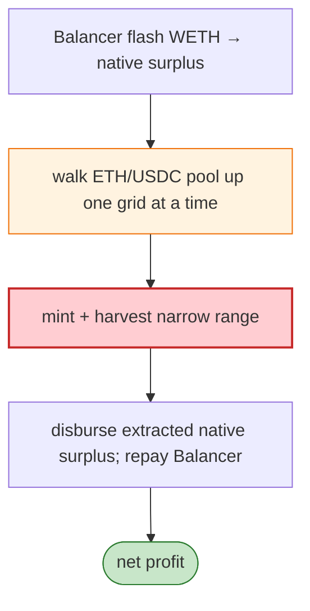

# Ambient (CrocSwap) Exploit — Native-Surplus + Grid Manipulation on ETH/USDC

> **Reproduction:** the PoC compiles & runs in an isolated Foundry project at
> [this project folder](.). Full verbose trace: [output.txt](output.txt).
> Verified vulnerable source: [CrocSwapDex](sources/CrocSwapDex_AaAaAA),
> [WarmPath](sources/WarmPath_d26876).

---

## Key info

| | |
|---|---|
| **Loss** | ETH/USDC drained from Ambient CrocSwap; attacker `0x000000…037E625B…` |
| **Vulnerable contract** | CrocSwapDex `0xAaAaAAAa…` |
| **Flash source** | Balancer Vault (WETH) |
| **Chain / block / date** | Ethereum mainnet / Jun 2026 |
| **Bug class** | Native-surplus / range-mint accounting — the helper deposited flash-loaned WETH as Ambient "native surplus", walked the ETH/USDC pool up one grid at a time, minted and harvested a narrow range, then disbursed the extracted native surplus. |

---

## TL;DR

Per the embedded analysis: the helper deposited flash-loaned WETH as Ambient **native surplus**, walked
the ETH/USDC pool up one grid at a time, minted and harvested a narrow range, then **disbursed the
extracted native surplus** and repaid Balancer. The native-surplus + concentrated-range accounting let
the attacker harvest more value than the flash loan cost.

---

## Root cause

An **accounting interaction between Ambient's "native surplus" path and its concentrated-liquidity
range mint/harvest**, exploitable by walking the pool grid with flash-loaned capital.

---

## Diagrams



---

## Remediation

1. Bound native-surplus vs range-mint interactions; cap per-tx grid movement.
2. Invariant: harvest output ≤ fee-corrected range value.
3. Re-check surplus accounting after each external call.

---

## How to reproduce

```bash
_shared/run_poc.sh 2026-06-AmbientCrocSwapDex_exp -vvvvv
```

- RPC: mainnet archive. Result: `[PASS]` (~70s) — native surplus extracted via grid walk.

---

*Reference: Ambient CrocSwap native-surplus/range-mint exploit, mainnet, Jun 2026.*
