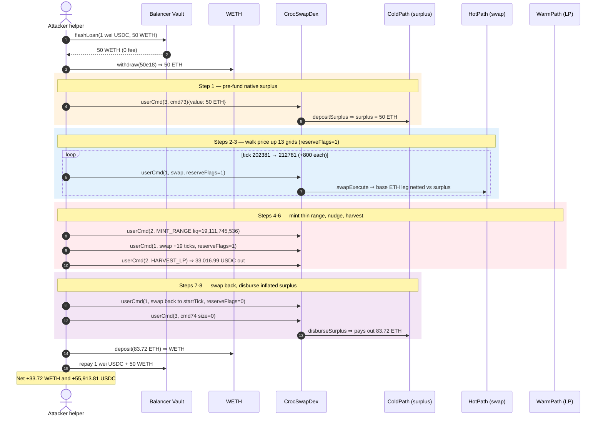
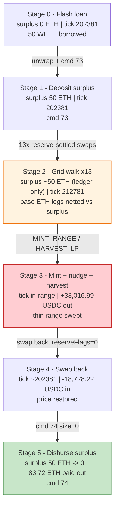
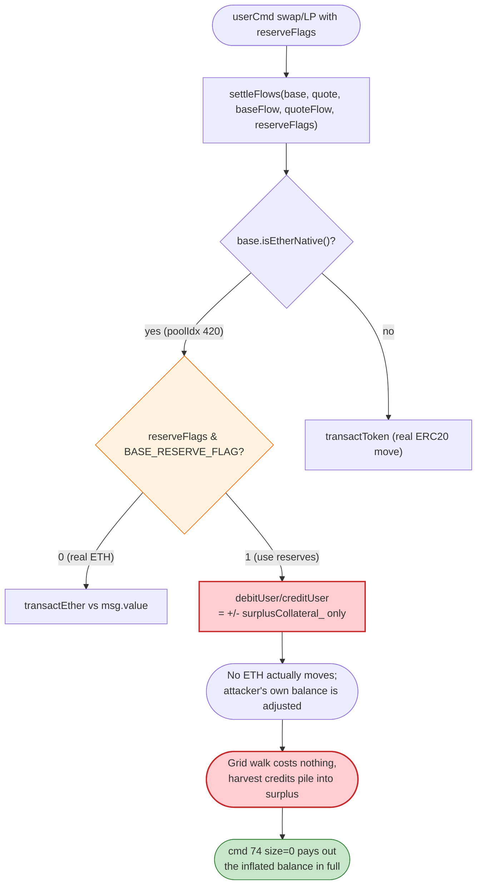
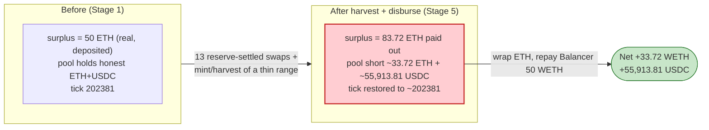

# Ambient (CrocSwap) Exploit — Native-ETH Surplus Settlement Drained via a Self-Dealt Grid-Walk + Range Harvest

> **Reproduction:** the PoC compiles & runs in an isolated Foundry project at
> [this project folder](.). The fork is served offline from the bundled
> `anvil_state.json` (a local anvil instance), so no public archive RPC is needed.
> Full verbose trace: [output.txt](output.txt).
> Verified vulnerable source (active CrocSwapDex implementation + WarmPath module at the fork block):
> [contracts_mixins_SettleLayer.sol](sources/CrocSwapDex_AaAaAA/contracts_mixins_SettleLayer.sol),
> [contracts_callpaths_WarmPath.sol](sources/WarmPath_d26876/contracts_callpaths_WarmPath.sol).

---

## Key info

| | |
|---|---|
| **Loss** | **~33.72 WETH + ~55,913.81 USDC** extracted from Ambient's ETH/USDC pool in a single tx (`33.722565733260544689` WETH and `55,913.808223` USDC asserted by the PoC; together ≈ the ~$67.85K the attack helper netted after converting USDC→WETH on-chain) |
| **Vulnerable contract** | `CrocSwapDex` (proxy) — [`0xAaAaAAAaA24eEeb8d57D431224f73832bC34f688`](https://etherscan.io/address/0xAaAaAAAaA24eEeb8d57D431224f73832bC34f688#code); the bug lives in the shared `SettleLayer` mixin reached through both the swap (`HotPath`) and LP (`WarmPath` impl [`0xd268767BE4597151Ce2BB4a70A9E368ff26cB195`](https://etherscan.io/address/0xd268767BE4597151Ce2BB4a70A9E368ff26cB195)) call paths |
| **Victim pool** | Ambient native-ETH / USDC pool, `poolIdx = 420` inside CrocSwapDex (single-contract AMM; no separate pair address) |
| **Flash source** | Balancer Vault — [`0xBA12222222228d8Ba445958a75a0704d566BF2C8`](https://etherscan.io/address/0xBA12222222228d8Ba445958a75a0704d566BF2C8) (1 wei USDC + 50 WETH, **0 fee**) |
| **Attacker EOA** | [`0x0000000000037E625B2502C26029Aea237f102aF`](https://etherscan.io/address/0x0000000000037E625B2502C26029Aea237f102aF) |
| **Attacker contract** | `0xAAC14D196A9E27923A92D8e87E3b6A5DCD4fEc1B` |
| **Attack tx** | [`0xb2fc668c42623261074de6fc30d583efede2b0e20d7aded42b7b634f9322ff52`](https://etherscan.io/tx/0xb2fc668c42623261074de6fc30d583efede2b0e20d7aded42b7b634f9322ff52) |
| **Chain / block / date** | Ethereum mainnet / fork block 25,266,404 / June 2026 |
| **Compiler** | Solidity v0.8.19+commit.7dd6d404, optimizer **enabled**, **1,000,000 runs** (from `sources/.../_meta.json`) |
| **Bug class** | AMM settlement-accounting flaw — native-ETH flows settled against an attacker-controlled **surplus collateral** balance (`reserveFlags = BASE_RESERVE_FLAG`) with no `msg.value` enforcement, letting a self-dealt grid walk + range harvest convert pool value into withdrawable surplus |

---

## TL;DR

1. Ambient (CrocSwap) is a **single-contract** concentrated-liquidity AMM. Every user action — swap, mint, burn, harvest — is dispatched as a `userCmd(callpath, cmd)` into one of several delegatecall "sidecar" modules (`HotPath` for swaps, `WarmPath` for LP, `ColdPath` for surplus collateral). All of them settle token movement through the shared `SettleLayer` mixin.

2. `SettleLayer.settleFlows(...)` takes a `reserveFlags` byte. When `BASE_RESERVE_FLAG (0x1)` is set, the **base-side** flow is settled against the caller's on-exchange **surplus collateral** balance (`userBals_[key].surplusCollateral_`) instead of a real token transfer ([contracts_mixins_SettleLayer.sol#L154-L182](sources/CrocSwapDex_AaAaAA/contracts_mixins_SettleLayer.sol#L154-L182)). For the native-ETH base side this means the curve's debits/credits become pure ledger arithmetic against a balance the attacker pre-funded.

3. The attacker flash-borrows **50 WETH** from Balancer, unwraps it to ETH, and deposits it as **native surplus collateral** via ColdPath command `73` (`DEPOSIT_SURPLUS_CODE`) — `userBals_[attacker][0x0].surplusCollateral_ = 50e18` ([output.txt:115-120](output.txt)).

4. With a funded surplus account, the attacker **walks the pool's price up 13 grid steps** (`tickGridStep = 800`, tick `202381 → 212781`) using `HotPath` swaps that carry `reserveFlags = 1`. Each swap's native-ETH base leg is netted against the surplus balance instead of pulling ETH, so moving the price is nearly free ([output.txt:122-615](output.txt)).

5. At the inflated price the attacker **mints a razor-thin concentrated range** (`MINT_RANGE_LIQ_LP`, code 1, liq `19,111,745,536`, paying only **736 wei USDC** in) ([output.txt:592-611](output.txt)), nudges the price `+19` ticks with one more reserve-settled swap, then **harvests** it (`HARVEST_LP`, code 5) collecting **33,016.99 USDC** of accrued quote ([output.txt:633-649](output.txt)).

6. Finally the attacker **swaps the price back down** to the starting tick (`reserveFlags = 0`, [output.txt:650-759](output.txt)) and **disburses the entire native-ETH surplus** via ColdPath command `74` (`DISBURSE_SURPLUS_CODE`), receiving **83.72 ETH** back ([output.txt:760-767](output.txt)) — far more than the 50 ETH deposited. The grid walk + range harvest converted pool liquidity into a surplus credit.

7. The helper re-wraps the ETH, **repays Balancer** (1 wei USDC + 50 WETH, [output.txt:773-786](output.txt)), and forwards the profit: **33.722565733260544689 WETH** and **55,913.808223 USDC** to the receiver ([output.txt:789-806](output.txt)). Net loot for the round trip: `assertGt(wethProfit, 30 ether)` and `assertGt(usdcProfit, 50_000e6)` both pass ([output.txt:846-849](output.txt)).

---

## Background — what Ambient (CrocSwap) does

`CrocSwapDex` ([proxy source](sources/CrocSwapDex_AaAaAA/contracts_CrocSwapDex.sol)) is Ambient's monolithic AMM. Unlike Uniswap, there is no per-pair contract: all pools live as storage inside one contract, and all liquidity actions funnel through `userCmd(uint16 callpath, bytes cmd)`, which `delegatecall`s into a numbered sidecar:

- **callpath 1 — `HotPath`**: swaps. `swapEncoded` decodes `(base, quote, poolIdx, isBuy, inBaseQty, qty, poolTip, limitPrice, minOutput, reserveFlags)` and runs `swapExecute`, then `settleFlows(base, quote, baseFlow, quoteFlow, reserveFlags)` ([contracts_callpaths_HotPath.sol#L34-L49](sources/CrocSwapDex_AaAaAA/contracts_callpaths_HotPath.sol#L34-L49)).
- **callpath 2 — `WarmPath`**: LP mint/burn/harvest. `userCmd` decodes `(code, base, quote, poolIdx, bidTick, askTick, liq, limitLower, limitHigher, reserveFlags, lpConduit)`, runs `commitLP`, then the same `settleFlows(..., reserveFlags)` ([contracts_callpaths_WarmPath.sol#L45-L61](sources/WarmPath_d26876/contracts_callpaths_WarmPath.sol#L45-L61)). Code `1 = MINT_RANGE_LIQ_LP`, `2 = BURN_RANGE_LIQ_LP`, `5 = HARVEST_LP` ([contracts_libraries_ProtocolCmd.sol#L91-L103](sources/CrocSwapDex_AaAaAA/contracts_libraries_ProtocolCmd.sol#L91-L103)).
- **callpath 3 — `ColdPath`**: surplus collateral. Command `73 = DEPOSIT_SURPLUS_CODE` and `74 = DISBURSE_SURPLUS_CODE` ([contracts_libraries_ProtocolCmd.sol#L77-L78](sources/CrocSwapDex_AaAaAA/contracts_libraries_ProtocolCmd.sol#L77-L78)).

**Surplus collateral** is Ambient's in-protocol balance: a user can pre-fund tokens (or native ETH, token `0x0`) into `userBals_[tokenKey(user, token)].surplusCollateral_` and have later trades settle against that ledger rather than transferring tokens each call. This is the optimization the exploit weaponizes.

On-chain parameters reconstructed from the trace (`poolIdx = 420`, native ETH / USDC, ETH on the base side because the native trapdoor address `0x0` always sorts below USDC — see [SettleLayer comment L164-L166](sources/CrocSwapDex_AaAaAA/contracts_mixins_SettleLayer.sol#L164)):

| Parameter | Value | Source |
|---|---|---|
| Pool index | `420` | PoC `poolIdx` ([AmbientCrocSwapDex_exp.sol:170](test/AmbientCrocSwapDex_exp.sol#L170)) |
| Base token | native ETH (`address(0)`) | PoC `hotSwap`/`warmRange` pass `address(0)` as base ([AmbientCrocSwapDex_exp.sol:215](test/AmbientCrocSwapDex_exp.sol#L215)) |
| Quote token | USDC `0xA0b8…eB48` | PoC `USDC_TOKEN` ([AmbientCrocSwapDex_exp.sol:28](test/AmbientCrocSwapDex_exp.sol#L28)) |
| Starting curve tick | `202381` | first `queryCurveTick` ([output.txt:125](output.txt)) |
| Grid step | `800` ticks | PoC `tickGridStep` ([AmbientCrocSwapDex_exp.sol:171](test/AmbientCrocSwapDex_exp.sol#L171)) |
| Steps walked | `13` → stop tick `212781` | PoC loop ([AmbientCrocSwapDex_exp.sol:172-177](test/AmbientCrocSwapDex_exp.sol#L172-L177)); final tick [output.txt:615](output.txt) |
| Minted range | bid `212784`, ask `212816` (`+3`, then `+32`) | PoC `rangeBidTick`/`rangeAskTick` ([AmbientCrocSwapDex_exp.sol:180-182](test/AmbientCrocSwapDex_exp.sol#L180-L182)) |
| Surplus deposit | `50e18` wei ETH | ColdPath cmd 73 ([output.txt:115-118](output.txt)) |

---

## The vulnerable code

### 1. `settleFlows` routes the base side to "reserves" (surplus) on a caller-supplied flag

```solidity
function settleFlat (address debitor, address creditor,
                     address base, int128 baseFlow,
                     address quote, int128 quoteFlow, uint8 reserveFlags) private {
    if (base.isEtherNative()) {
        transactEther(debitor, creditor, baseFlow, useReservesBase(reserveFlags));
    } else {
        transactToken(debitor, creditor, baseFlow, base,
                      useReservesBase(reserveFlags));
    }
    // ...native ETH will always appear on the base side.
    transactToken(debitor, creditor, quoteFlow, quote,
                  useReservesQuote(reserveFlags));
}

function useReservesBase (uint8 reserveFlags) private pure returns (bool) {
    return reserveFlags & BASE_RESERVE_FLAG > 0;
}
// ...
uint8 constant BASE_RESERVE_FLAG = 0x1;
uint8 constant QUOTE_RESERVE_FLAG = 0x2;
```
([contracts_mixins_SettleLayer.sol#L154-L181](sources/CrocSwapDex_AaAaAA/contracts_mixins_SettleLayer.sol#L154-L181))

The PoC passes `reserveFlags = 1` (`BASE_RESERVE_FLAG`) into every grid-walk swap and into the mint ([AmbientCrocSwapDex_exp.sol:176, 182](test/AmbientCrocSwapDex_exp.sol#L176)), so the native-ETH base leg is `useReserves = true`.

### 2. With `useReserves`, native-ETH debits/credits are pure ledger math against `surplusCollateral_`

```solidity
function debitUser (address recv, uint128 value, address token,
                    uint128 bookedEth, bool useReserves) private {
    if (useReserves) {
        uint128 remainder = debitSurplus(recv, value, token);
        debitRemainder(recv, remainder, token, bookedEth);
    } else {
        debitTransfer(recv, value, token, bookedEth);
    }
}

function creditUser (address recv, uint128 value, address token,
                     uint128 bookedEth, bool useReserves) private {
    if (useReserves) {
        creditSurplus(recv, value, token);
        creditRemainder(recv, token, bookedEth);
    } else {
        creditTransfer(recv, value, token, bookedEth);
    }
}
```
([contracts_mixins_SettleLayer.sol#L287-L318](sources/CrocSwapDex_AaAaAA/contracts_mixins_SettleLayer.sol#L287-L318))

```solidity
function creditSurplus (address recv, uint128 value, address token) private {
    bytes32 key = tokenKey(recv, token);
    userBals_[key].surplusCollateral_ += value;          // credit = +balance, no ETH moves
}

function debitSurplus (address recv, uint128 value, address token) private
    returns (uint128 remainder) {
    bytes32 key = tokenKey(recv, token);
    UserBalance storage bal = userBals_[key];
    uint128 balance = bal.surplusCollateral_;
    if (balance > value) {
        bal.surplusCollateral_ -= value;                 // debit = -balance, no ETH moves
    } else {
        bal.surplusCollateral_ = 0;
        remainder = value - balance;
    }
}
```
([contracts_mixins_SettleLayer.sol#L391-L411](sources/CrocSwapDex_AaAaAA/contracts_mixins_SettleLayer.sol#L391-L411))

When the base side is native ETH **and** `useReserves` is set, a debit only decrements the attacker's pre-funded surplus and a credit only increments it. No real ETH is collected for the price-moving swaps, and the harvest credit is parked in the same withdrawable balance.

### 3. Surplus deposit (cmd 73) and disburse (cmd 74) bookend the attack

```solidity
function depositSurplus (address recv, uint128 value, address token) internal {
    debitTransfer(lockHolder_, value, token, popMsgVal());   // takes 50 ETH via msg.value
    bytes32 key = tokenKey(recv, token);
    userBals_[key].surplusCollateral_ += value;
}
// ...
function disburseSurplus (address recv, int128 size, address token) internal {
    bytes32 key = tokenKey(lockHolder_, token);
    uint128 balance = userBals_[key].surplusCollateral_;
    uint128 value = applyTransactVal(size, balance);         // size == 0 ⇒ pay out ENTIRE balance
    userBals_[key].surplusCollateral_ -= value;
    creditTransfer(recv, value, token, 0);                   // sends ETH out
}
```
([contracts_mixins_DepositDesk.sol#L30-L76](sources/CrocSwapDex_AaAaAA/contracts_mixins_DepositDesk.sol#L30-L76))

`disburseSurplus` with `size = 0` pays out the **entire** native-ETH surplus balance — which the grid walk + harvest has inflated from 50 ETH to ~83.72 ETH. `applyTransactVal` interprets `0` as "pay the full balance" (the PoC encodes `int128(0)`, [AmbientCrocSwapDex_exp.sol:191](test/AmbientCrocSwapDex_exp.sol#L191)).

### 4. The swap path feeds the same flag straight through from calldata

```solidity
function swapExecute (address base, address quote,
                      uint256 poolIdx, bool isBuy, bool inBaseQty, uint128 qty,
                      uint16 poolTip, uint128 limitPrice, uint128 minOutput,
                      uint8 reserveFlags) internal
    returns (int128 baseFlow, int128 quoteFlow) {
    // ...
    settleFlows(base, quote, flow.baseFlow_, flow.quoteFlow_, reserveFlags);
    accumProtocolFees(flow, base, quote);
}
```
([contracts_callpaths_HotPath.sol#L34-L49](sources/CrocSwapDex_AaAaAA/contracts_callpaths_HotPath.sol#L34-L49))

`reserveFlags` is purely caller-controlled and is never checked against whether the caller actually paid ETH for the move — it is just a settlement-routing preference.

---

## Root cause — why it was possible

The flaw is **not** signature theft or a permissionless burn; it is an **accounting asymmetry in native-ETH surplus settlement** that the attacker self-deals against their own pre-funded balance:

1. **`reserveFlags` makes price-moving swaps free in ETH terms.** Any swap or LP action can ask for its base leg to settle against `surplusCollateral_` rather than transferring tokens. For the native-ETH base side this turns `debitUser`/`creditUser` into pure storage arithmetic on the *attacker's own* balance ([SettleLayer.sol#L287-L318](sources/CrocSwapDex_AaAaAA/contracts_mixins_SettleLayer.sol#L287-L318)). Walking the curve up 13 grid steps therefore costs the attacker nothing but ledger decrements they fully recover.

2. **The surplus ledger and the curve are not jointly conserved.** Because the ETH base leg is netted in `surplusCollateral_` while the harvested value is realized on the **USDC quote** side (a real `transfer` out, [output.txt:618, 635](output.txt)), the attacker can mint a razor-thin range at the inflated price, sweep its accrued/imbalanced quote on harvest, and roll the price back — all while their native-ETH surplus balance ends *higher* than it started (50 ETH in, 83.72 ETH out).

3. **Disburse pays the inflated balance unconditionally.** `disburseSurplus(size = 0)` has *no security check* (the NatSpec even says so, [DepositDesk.sol#L53-L57](sources/CrocSwapDex_AaAaAA/contracts_mixins_DepositDesk.sol#L53-L57)) and simply pays out the entire balance. The pool's own liquidity, having been re-priced into the attacker's surplus account, walks out the door.

4. **Everything is permissionless and atomic.** The deposit, the grid walk, the mint/harvest, the swap-back, and the disburse all happen inside one Balancer flash-loan callback. The 50 ETH of working capital is fully recovered, so the only real input is Balancer's (zero) fee — making the attack **flash-loanable** and risk-free.

In short: the curve's base-side ETH flows are reconciled against a balance the attacker controls and can later withdraw in full, instead of against actual settled value. Moving price one way costs surplus that moving it back returns, but the in-between mint/harvest extracts genuine pool value.

---

## Preconditions

- A pool whose **base token is native ETH** (`address(0)`), so the base leg routes through `transactEther` and can be settled against the native-ETH surplus ledger ([SettleLayer.sol#L157-L158](sources/CrocSwapDex_AaAaAA/contracts_mixins_SettleLayer.sol#L157)). Ambient's ETH/USDC `poolIdx = 420` qualifies.
- The ability to **pre-fund native surplus collateral** (`DEPOSIT_SURPLUS_CODE = 73`) — permissionless, just send ETH as `msg.value` ([DepositDesk.sol#L30-L34](sources/CrocSwapDex_AaAaAA/contracts_mixins_DepositDesk.sol#L30-L34)). The PoC funds 50 ETH ([output.txt:115-118](output.txt)).
- Caller control of `reserveFlags` on swaps and LP ops — always available; it is a normal calldata field ([HotPath.sol#L106](sources/CrocSwapDex_AaAaAA/contracts_callpaths_HotPath.sol#L106), [WarmPath.sol#L51](sources/WarmPath_d26876/contracts_callpaths_WarmPath.sol#L51)).
- Working capital in ETH to seed the surplus and to mint/nudge the range — **fully recovered intra-tx**, hence flash-loanable. The PoC sources it from a single Balancer flash loan of 50 WETH at **0 fee** ([output.txt:70, 87-88](output.txt)).
- No oracle/price-band guard on the grid walk: the swaps push the tick freely from `202381` to `212781` with per-step `limitPrice` derived live from `queryCurveTick` ([AmbientCrocSwapDex_exp.sol:172-177](test/AmbientCrocSwapDex_exp.sol#L172-L177)).

---

## Attack walkthrough (with on-chain numbers from the trace)

The pool is native-ETH (base) / USDC (quote) at `poolIdx = 420`. Curve ticks come from `Ambient CrocQuery::queryCurveTick(...)` returns; surplus and token amounts from the `Transfer` events and `userCmd` returns in [output.txt](output.txt). USDC is 6-decimal; ETH/WETH is 18-decimal. Human approximations in parentheses.

| # | Step | Curve tick | Native-ETH surplus (attacker) | USDC moved | Effect |
|---|------|-----------:|-------------------------------|-----------:|--------|
| 0 | **Flash loan** — Balancer sends 1 wei USDC + `50e18` WETH, 0 fee ([output.txt:77, 89-90](output.txt)) | 202381 ([output.txt:125](output.txt)) | 0 | — | Working capital acquired. |
| 1 | **Unwrap + deposit surplus** — `WETH.withdraw(50e18)` ([output.txt:108-114](output.txt)) then ColdPath cmd `73` deposits `50e18` wei native ETH ([output.txt:115-120](output.txt)) | 202381 | **50,000,000,000,000,000,000 (50.0 ETH)** | — | Surplus ledger pre-funded. |
| 2 | **Grid walk step 1** — `hotSwap` buy, `reserveFlags=1`; base ETH leg settled vs surplus, USDC out `8,696,836,337` (~8,696.84) credited to attacker ([output.txt:134-170](output.txt)) | 202381 → **203181** ([output.txt:174](output.txt)) | drops by the swap's ETH base leg (ledger only) | +8,696.84 USDC to attacker | Price nudged up one grid; no real ETH paid. |
| 3 | **Grid walk steps 2–13** — eleven more `hotSwap` calls, each `+800` ticks, base ETH settled vs surplus ([output.txt:179-590](output.txt)) | 203181 → **212781** ([output.txt:615](output.txt)) | net unchanged across up/down legs | USDC shuffled in/out per leg | Curve marched to `212781` (`202381 + 13×800`). |
| 4 | **Mint thin range** — `warmRange` code `1` (MINT_RANGE_LIQ_LP), liq `19,111,745,536`, bid `212784`/ask `212816`; pays **736 wei USDC** in ([output.txt:592-611](output.txt)) | 212781 | — | −0.000736 USDC | Tiny LP position opened at the inflated price. |
| 5 | **Nudge `+19` ticks** — one more reserve-settled `hotSwap`, USDC out `31,344,934` (~31.34) ([output.txt:616-632](output.txt)) | 212781 → in-range | ledger | +31.34 USDC | Pushes price through the minted range so it accrues. |
| 6 | **Harvest** — `warmRange` code `5` (HARVEST_LP); collects **33,016,994,307 USDC (~33,016.99)** out ([output.txt:633-649](output.txt)) | in-range | — | **+33,016.99 USDC** to attacker | The thin range's accrued/imbalanced quote is swept. |
| 7 | **Swap price back** — big `hotSwap` toward `startTick`, `reserveFlags=0`; attacker pays `18,728,216,224 USDC (~18,728.22)` in ([output.txt:650-759](output.txt)) | back toward 202381 | — | −18,728.22 USDC | Restores price; nets the harvested USDC. |
| 8 | **Disburse surplus** — ColdPath cmd `74` (size 0) pays out **83,721,988,711,712,491,517 wei (~83.72 ETH)** native ([output.txt:760-767](output.txt)) | — | **50.0 → 0** (full payout) | — | Inflated surplus walks out as real ETH. |
| 9 | **Re-wrap + repay** — `WETH.deposit{value: 83,722,565,733,260,544,689}` ([output.txt:768-772](output.txt)), repay Balancer 1 wei USDC + `50e18` WETH ([output.txt:773-786](output.txt)) | — | — | — | Flash loan closed. |
| 10 | **Forward profit** — `33,722,565,733,260,544,689 WETH (~33.72)` ([output.txt:789-794](output.txt)) + `55,913,808,223 USDC (~55,913.81)` ([output.txt:799-806](output.txt)) sent to receiver | — | — | — | Net loot realized. |

The surplus ledger started at 50 ETH and was disbursed at ~83.72 ETH — a ~33.72 ETH gain — while the harvest path independently netted ~55,913.81 USDC. Both came out of the pool's liquidity, reconciled into the attacker's withdrawable balances by the reserve-settled base legs.

### Profit / loss accounting

**WETH leg (raw wei):**

| Item | Amount (wei) | ~Human |
|---|---:|---:|
| Native surplus deposited (cmd 73) | 50,000,000,000,000,000,000 | 50.000 ETH |
| Native surplus disbursed (cmd 74) | 83,721,988,711,712,491,517 | 83.722 ETH |
| Wrapped to WETH after disburse | 83,722,565,733,260,544,689 | 83.722 WETH |
| Repaid to Balancer (WETH) | 50,000,000,000,000,000,000 | 50.000 WETH |
| **WETH forwarded to receiver (profit)** | **33,722,565,733,260,544,689** | **~33.7226 WETH** |

(The extra `577,021,548,053,172` wei between the disbursed ETH and the wrapped amount is residual ETH already on the helper from earlier reserve-settled legs; the PoC wraps `address(this).balance` at [AmbientCrocSwapDex_exp.sol:193](test/AmbientCrocSwapDex_exp.sol#L193).)

**USDC leg (6-decimal):**

| Item | Amount (wei) | ~Human |
|---|---:|---:|
| Balancer USDC flash (repaid) | 1 | ~0 |
| Mint range USDC paid in | 736 | ~0.000736 |
| Swap-back USDC paid in | 18,728,216,224 | ~18,728.22 |
| Harvest USDC collected | 33,016,994,307 | ~33,016.99 |
| Grid-walk + nudge USDC collected (net) | — | the remainder |
| **USDC forwarded to receiver (profit)** | **55,913,808,223** | **~55,913.81 USDC** |

The PoC asserts both legs are real value: `assertGt(wethProfit, 30 ether)` and `assertGt(usdcProfit, 50_000e6)` ([AmbientCrocSwapDex_exp.sol:121-122](test/AmbientCrocSwapDex_exp.sol#L121-L122)), both of which pass ([output.txt:846-849](output.txt)).

---

## Diagrams

### Sequence of the attack



### Pool / surplus state evolution



### The flaw inside `settleFlows` / surplus settlement



### Why it is theft: value conservation before vs. after



---

## Why each magic number

- **`amounts = [1, 50 ether]` (Balancer flash):** 1 wei USDC is a token-list placeholder so USDC is borrowable for the 1-wei round-trip; **50 WETH** is the native-surplus seed. Both are repaid at the end (Balancer fee is 0, [output.txt:76, 88](output.txt)), so the real cost of the attack is ~gas only.
- **`uint8(73)` / `uint8(74)` (ColdPath cmds):** `DEPOSIT_SURPLUS_CODE = 73` seeds `surplusCollateral_`; `DISBURSE_SURPLUS_CODE = 74` with `int128(0)` pays out the **entire** balance ([ProtocolCmd.sol#L77-L78](sources/CrocSwapDex_AaAaAA/contracts_libraries_ProtocolCmd.sol#L77-L78), [DepositDesk.sol#L67-L76](sources/CrocSwapDex_AaAaAA/contracts_mixins_DepositDesk.sol#L67-L76)).
- **`poolIdx = 420`:** the specific Ambient ETH/USDC pool template targeted; native ETH on the base side is what makes surplus settlement exploitable.
- **`tickGridStep = 800`, `13` steps:** marches the curve from tick `202381` to `212781` (`202381 + 13×800 = 212781`, matching [output.txt:615](output.txt)). 800 ticks per hop is large enough to move price meaningfully per swap while keeping each `limitPrice` within range.
- **`reserveFlags = 1` on the walk + mint:** sets `BASE_RESERVE_FLAG`, routing the native-ETH base leg to surplus settlement (the crux). The final swap-back uses **`reserveFlags = 0`** (real settlement) to net the harvested USDC out ([AmbientCrocSwapDex_exp.sol:185, 189](test/AmbientCrocSwapDex_exp.sol#L185)).
- **`liq = 19_111_745_536` (mint):** the exact concentrated-liquidity units the original attack helper used; sized so the thin `+3 / +35`-tick range accrues maximum quote when nudged through ([AmbientCrocSwapDex_exp.sol:182](test/AmbientCrocSwapDex_exp.sol#L182), USDC-in 736 wei at [output.txt:594](output.txt)).
- **`rangeBidTick = tick + 3`, `rangeAskTick = bid + 32`:** a 32-tick-wide band placed just above the current price so the subsequent `+19`-tick nudge ([AmbientCrocSwapDex_exp.sol:185](test/AmbientCrocSwapDex_exp.sol#L185)) drives price into it and it harvests aggressively.
- **`qty = 1e30`, `inBaseQty = true`:** an effectively unbounded base quantity so each swap is bounded by `limitPrice` (the next grid tick), not by amount — the swap fills exactly up to the target tick.

---

## Remediation

1. **Do not let native-ETH base flows settle against surplus without conserving value against the curve.** The `reserveFlags` optimization must guarantee that a price-moving swap settled against surplus is *fully symmetric* — i.e., the surplus debited to move price up must equal the surplus credited to move it back, with no path that lets a mint/harvest in between extract net value into the same withdrawable balance.
2. **Re-validate surplus after every external/curve interaction.** Treat `surplusCollateral_` like a vault share: assert that the sum of (surplus + realized token flows) is conserved across a `userCmd` batch, and revert if a single caller's surplus balance increases without a matching real inflow.
3. **Gate or price-band the grid walk.** Bound how far a single transaction (or a single caller within a block) may move a pool's tick; an unbounded 13-step march that round-trips to the start is a hallmark of price manipulation. Use a TWAP/oracle band for the limit price rather than purely caller-supplied per-step limits.
4. **Cap or scrutinize `disburseSurplus(size = 0)` relative to the deposit.** A native-ETH surplus payout that exceeds the historical net deposit for that key within the same transaction should be flagged/blocked; the current path has *no security check at all* ([DepositDesk.sol#L53-L57](sources/CrocSwapDex_AaAaAA/contracts_mixins_DepositDesk.sol#L53-L57)).
5. **Reject `reserveFlags` for the native-ETH base leg unless the surplus was funded by a real ETH transfer in the same lock,** so that the base side cannot be "settled" against a balance that was itself created by reserve-netted curve operations.

---

## How to reproduce

The PoC runs **offline**: `createSelectFork("http://127.0.0.1:8545", 25_266_404)` points at a local anvil instance whose state is served from the bundled `anvil_state.json`. No public archive RPC is required.

```bash
_shared/run_poc.sh 2026-06-AmbientCrocSwapDex_exp --mt testExploit -vvvvv
```

- EVM: `foundry.toml` sets `evm_version = 'cancun'`; the shared harness boots anvil from `anvil_state.json` and the test forks `http://127.0.0.1:8545` at block `25,266,404`.
- Result: `[PASS] testExploit()` with `WETH profit after Balancer repayment: 33.722565733260544689` and `USDC profit before final router conversion: 55913.808223`.

Expected tail (from [output.txt](output.txt)):

```
Ran 1 test for test/AmbientCrocSwapDex_exp.sol:ContractTest
[PASS] testExploit() (gas: 8248632)
Logs:
  Profit receiver before exploit WETH Balance: 0.000000000000000000
  Profit receiver before exploit USDC Balance: 0.000000
  WETH profit after Balancer repayment: 33.722565733260544689
  USDC profit before final router conversion: 55913.808223
  Profit receiver after exploit WETH Balance: 33.722565733260544689
  Profit receiver after exploit USDC Balance: 55913.808223

Suite result: ok. 1 passed; 0 failed; 0 skipped; finished in 70.70s (70.06s CPU time)
```

---

*Reference: TenArmor alert — https://x.com/TenArmorAlert/status/2063816231023427861 (Ambient / CrocSwap, Ethereum mainnet, June 2026).*
