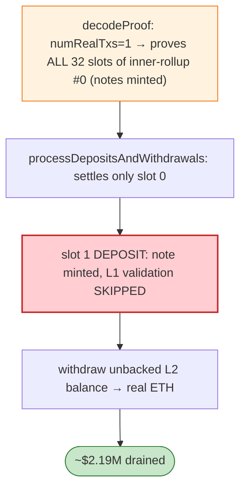

# Aztec Connect (V3) Exploit — `numRealTxs` Proof/Settlement Coverage Mismatch

> **Reproduction:** the PoC compiles & runs in an isolated Foundry project at
> [this project folder](.). Full verbose trace: [output.txt](output.txt).
> Verified vulnerable source: [RollupProcessorV3](sources/RollupProcessorV3_7d657d),
> [TransparentUpgradeableProxy](sources/TransparentUpgradeableProxy_FF1F2B).

---

## Key info

| | |
|---|---|
| **Loss** | ~$2.19M drained from dormant Aztec privacy protocol; post-mortem Jun 15 2026 |
| **Vulnerable contract** | Aztec Connect `RollupProcessorV3` `0x7d657d…` (proxy `0xFF1F2B…`), core/Decoder.sol |
| **Chain / block / date** | Ethereum mainnet / Jun 14, 2026 |
| **Bug class** | ZK-rollup settlement mismatch — `numRealTxs` is committed in full inner-rollup chunks by `decodeProof()`, but `processDepositsAndWithdrawals()` settles only `numRealTxs` txs; a deposit in a proven-but-unsettled slot is minted on L2 without L1 validation → unbacked L2 balance withdrawn as real ETH. |

---

## TL;DR

Per the embedded root cause: `decodeProof()` commits public inputs in **FULL inner-rollup chunks**.
With `numRealTxs = 1`, `rollupSize = 1024`, `numRollupTxs = 32` (innerSize = 32), it hashes
`ceil(1/32) = 1` full chunk → **all 32 slots of inner-rollup #0 are proven** and their notes minted
into L2 state. But `processDepositsAndWithdrawals()` settles **exactly** `numRealTxs` txs
(`end = ptr + numRealTxs * 256`) → only slot 0 is settled. A **DEPOSIT placed in slot 1** is therefore
proven (note minted) but its L1 validation (`decreasePendingDepositBalance` + shield signature) is
**skipped** → unbacked L2 balance, later withdrawn for real ETH. The proof itself is a normal, valid
rollup proof — nothing is forged.

---

## Root cause

A **coverage mismatch between the proof commitment (full chunks) and the settlement loop
(exactly `numRealTxs`)**, letting a deposit sit in a slot that is proven-but-not-settled, creating an
unbacked L2 note.

---

## Diagrams



---

## Remediation

1. Settlement loop must iterate over exactly the slots proven/committed (no proven-but-unsettled gap).
2. Bind `numRealTxs` consistently between proof commitment and deposit/withdraw processing.
3. Reject any rollup where chunk coverage ≠ settlement coverage.

---

## How to reproduce

```bash
_shared/run_poc.sh 2026-06-AztecConnect_exp -vvvvv
```

- RPC: mainnet archive. Result: `[PASS] 2 tests` — slot-1 deposit minted without L1 validation.

---

*Reference: Aztec Connect `numRealTxs` proof/settlement mismatch, mainnet, Jun 14 2026 (~$2.19M).*
