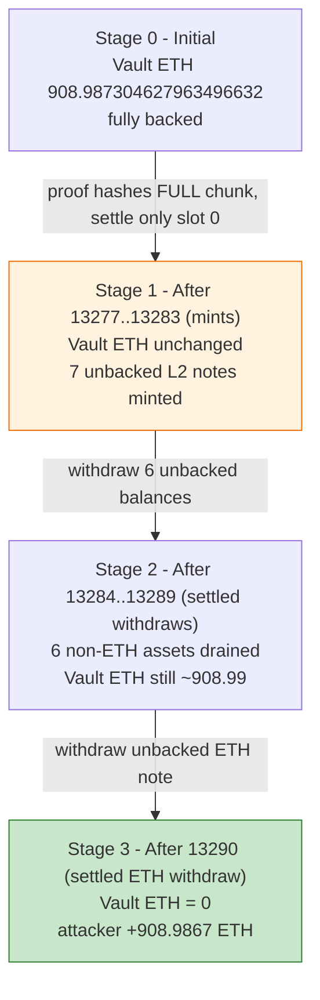
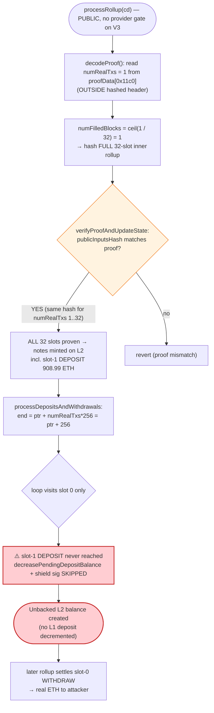
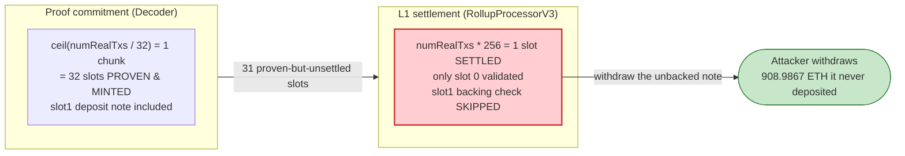

# Aztec Connect (V3) Exploit — `numRealTxs` proof-vs-settlement coverage mismatch

> **Reproduction:** the PoC compiles & runs in an isolated Foundry project at
> [this project folder](.). It replays the attacker's own 14 mainnet rollup-calldata
> blobs against a forked deprecated `RollupProcessorV3`. Full verbose trace:
> [output.txt](output.txt). Verified vulnerable source:
> [src_core_Decoder.sol](sources/RollupProcessorV3_7d657d/src_core_Decoder.sol) and
> [src_core_processors_RollupProcessorV3.sol](sources/RollupProcessorV3_7d657d/src_core_processors_RollupProcessorV3.sol).

---

## Key info

| | |
|---|---|
| **Loss** | **~$2.19M** total drained from the dormant Aztec Connect privacy bridge. This PoC reproduces the **908.987304627963496632 ETH** leg ([output.txt:1670](output.txt)); ~908.99 ETH was withdrawn to the attacker EOA ([output.txt:3330](output.txt)). The full incident also drained 270.5K DAI, 167.9 wstETH, plus yvDAI / yvWETH / LUSD / yvLUSD. |
| **Vulnerable contract** | Aztec Connect `RollupProcessorV3` (deprecated impl [`0x7d657dDcf7E2a5fD118dc8a6ddc3DC308adC2728`](https://etherscan.io/address/0x7d657ddcf7e2a5fd118dc8a6ddc3dc308adc2728#code)) behind `TransparentUpgradeableProxy` [`0xFF1F2B4ADb9dF6FC8eAFecDcbF96A2B351680455`](https://etherscan.io/address/0xFF1F2B4ADb9dF6FC8eAFecDcbF96A2B351680455#code). Bug lives in `core/Decoder.sol` + `core/processors/RollupProcessorV3.sol`. |
| **Victim vault** | The `RollupProcessorV3` proxy itself (`0xFF1F2B…`) — it custodies all bridged L1 funds. ETH balance before attack: **908.987304627963496632** ([output.txt:1670](output.txt)); after: **0** ([output.txt:1686](output.txt)). |
| **Attacker EOA** | `0x0F18D8b44a740272f0be4d08338d2b165b7EdD17` (funded via Tornado Cash) |
| **Attacker orchestrator** | `0x06f585F74e0DA633Ae813A0f23Fb9900B61d0fcD` (4-byte trigger `0x6f3ce701`) |
| **Attack tx** | [`0x074ec9317d8336db37e8c348fbdd7515573ff4088239c77ab429f522509aeeb1`](https://etherscan.io/tx/0x074ec9317d8336db37e8c348fbdd7515573ff4088239c77ab429f522509aeeb1) (block 25,315,715) |
| **Chain / fork block / date** | Ethereum mainnet / fork pinned at **25,300,000** ([output.txt:1690](output.txt)) / **Jun 14, 2026** |
| **Compiler / optimizer** | impl `v0.8.10+commit.fc410830`, optimizer **enabled, 2000 runs** (`sources/RollupProcessorV3_7d657d/_meta.json`); proxy same compiler, optimizer enabled 10000 runs |
| **Bug class** | ZK-rollup settlement coverage mismatch — proof commitment hashes **full inner-rollup chunks**, settlement processes **exactly `numRealTxs`** txs; a deposit in a proven-but-unsettled slot is minted on L2 without its L1 backing check |

---

## TL;DR

1. `RollupProcessorV3.decodeProof()` ([Decoder.sol:281](sources/RollupProcessorV3_7d657d/src_core_Decoder.sol#L281)) computes the
   `publicInputsHash` by SHA256-hashing the transaction data in **full inner-rollup chunks**. The
   number of non-empty chunks is `ceil(numRealTxs / numTxsPerInnerRollup)`
   ([Decoder.sol:461-463](sources/RollupProcessorV3_7d657d/src_core_Decoder.sol#L461-L463)).

2. In every attack rollup the header carries `rollupSize = 1024`, `numRollupTxs = 32`
   (so `numTxsPerInnerRollup = 1024/32 = 32`) and `numRealTxs = 1`
   ([output.txt:1671](output.txt); calldata fields verified below). With those values
   `ceil(1/32) = 1` → **the single non-empty inner rollup (32 slots) is hashed and proven**, and
   **all 32 slots' notes are minted into L2 state**.

3. But `processDepositsAndWithdrawals()` settles **exactly** `numRealTxs` txs:
   `end = proofDataPtr + numRealTxs * 256`
   ([RollupProcessorV3.sol:1186](sources/RollupProcessorV3_7d657d/src_core_processors_RollupProcessorV3.sol#L1186)).
   With `numRealTxs = 1` the loop visits **only slot 0**.

4. The attacker places a real **DEPOSIT of 908.99 ETH in slot 1**. It is *proven* (its note is minted
   on L2) but its L1 validation —`decreasePendingDepositBalance` + the shield signature check at
   [RollupProcessorV3.sol:1238-1245](sources/RollupProcessorV3_7d657d/src_core_processors_RollupProcessorV3.sol#L1238-L1245)—
   is **skipped** because the settlement loop never reaches slot 1. Result: an **unbacked L2 balance**,
   created with no L1 deposit ever decremented and no shield signature ever supplied.

5. `numRealTxs` lives at `proofData[0x11c0]`, **outside** the `0x00..0x11c0` header that is hashed, so
   it is **not bound by the zk proof**. It only sets the chunk *count* `ceil(numRealTxs/32)`; any value
   `1..32` maps to the **same single chunk** → the **identical proof verifies for any `numRealTxs ∈ [1..32]`**.

6. On the **deprecated** `RollupProcessorV3`, `processRollup()` carries **no `onlyRollupProvider` gate**
   ([RollupProcessorV3.sol:665-670](sources/RollupProcessorV3_7d657d/src_core_processors_RollupProcessorV3.sol#L665-L670)) —
   the provider gate was removed for sunset self-exit, so **anyone** can submit these rollups.

7. The attacker chained **14 state-valid rollups** (ids 13277–13290): the first 7 mint unbacked L2
   notes for the seven assets, the last 7 withdraw them to the attacker EOA. The ETH leg withdraws
   **908.986707307963496632 ETH** to the attacker ([output.txt:1685](output.txt)), draining the vault
   to **0** ([output.txt:1686](output.txt)). The proofs are normal, valid rollup proofs — **nothing is forged**.

8. The PoC's `testBugIsOneField()` isolates the flaw to a single field: flipping **only** `numRealTxs`
   from `1 → 2` (its honest value) on the identical proof makes settlement reach slot 1, where the
   L1 backing check fires and the call **reverts with `INSUFFICIENT_DEPOSIT()` (`0x8e8af4f9`)**
   ([output.txt:1540-1542](output.txt)). One four-byte field is the difference between a free mint and a revert.

---

## Background — what Aztec Connect does

Aztec Connect (V3) was a zk-rollup privacy bridge on Ethereum mainnet. Users deposited L1 assets into
the `RollupProcessorV3` proxy; a sequencer/prover bundled private join-split/account/deposit/withdraw
transactions into a single **rollup block**, produced a PLONK proof attesting to the L2 state
transition, and submitted it via `processRollup(bytes encodedProofData, bytes signatures)`. The
contract verifies the proof, mints/burns L2 notes by updating its Merkle roots, **settles** the L1-side
deposits and withdrawals declared in the block, then pays the sequencer a fee.

The contract is split across two source files:

- **`Decoder.sol`** — decodes the custom `proofData` byte-encoding, computes the `publicInputsHash`
  (the SHA256 of the decoded tx data that the zk circuit also commits to), and returns the
  *number of real transactions* (`numTxs`).
- **`RollupProcessorV3.sol`** — verifies the proof against that hash, updates state, and runs
  `processDepositsAndWithdrawals()` to enact L1 settlement.

A rollup block is structured as a tree: the outer rollup verifies up to `numRollupTxs` **inner
rollups**, and each inner rollup processes a fixed `numTxsPerInnerRollup = rollupSize / numRollupTxs`
user transactions. Each user transaction occupies a fixed `TX_PUBLIC_INPUT_LENGTH = 256` bytes of
decoded data ([Decoder.sol:71](sources/RollupProcessorV3_7d657d/src_core_Decoder.sol#L71)). Incomplete
blocks are right-padded with "padding" txns whose count is **derived, not signed** — exactly the seam
this exploit pries open.

On-chain parameters for every attack rollup (decoded directly from the replayed calldata; see
[output.txt:1671](output.txt) for the per-rollup `numRealTxs = 1` log lines):

| Field (proofData offset) | Value | Meaning |
|---|---|---|
| selector | `0xf81cccbe` | `processRollup(bytes,bytes)` |
| `rollupId` (`0x00`) | 13277 … 13290 | block id (verified state-chained) |
| `rollupSize` (`0x20`) | **1024** | max txns per block |
| `numRollupTxs` (`0x11a0`) | **32** | number of inner rollups |
| `numTxsPerInnerRollup` = `rollupSize/numRollupTxs` | **32** | txns hashed per chunk |
| `numRealTxs` (`0x11c0`, top 4 bytes) | **1** | the unprotected knob ([output.txt:1671](output.txt)) |
| slot-1 `publicValue` (`4810`) | **908987304627963496632** (908.987304627963496632 ETH) | the unsettled deposit ([output.txt:1541](output.txt)) |
| `TX_PUBLIC_INPUT_LENGTH` | 256 | bytes per decoded tx |

The crucial relationship: with `numTxsPerInnerRollup = 32`, the proof-hash chunk count
`ceil(numRealTxs / 32)` equals **1** for *every* `numRealTxs` in `[1..32]`, while the settlement loop's
length `numRealTxs * 256` ranges from one to thirty-two slots. The hash does not constrain how many
slots get settled.

---

## The vulnerable code

### 1. `numRealTxs` is read from a position OUTSIDE the hashed header

`decodeProof()` reads `numTxs` (the real-tx count) by masking the 4-byte field at
`NUM_REAL_TRANSACTIONS_OFFSET`. This field sits at proofData offset `0x11c0`, **past** the header
region that is later copied and SHA256-hashed:

```solidity
numTxs := and(calldataload(add(inPtr, NUM_REAL_TRANSACTIONS_OFFSET)), 0xffffffff)
...
rollupSize := calldataload(add(inPtr, 0x20))
...
let decodedInnerDataSize := mul(rollupSize, TX_PUBLIC_INPUT_LENGTH)
let numInnerRollups := calldataload(add(inPtr, sub(ROLLUP_HEADER_LENGTH, 0x20)))
let numTxsPerRollup := div(rollupSize, numInnerRollups)

let numFilledBlocks := div(numTxs, numTxsPerRollup)
numFilledBlocks := add(numFilledBlocks, iszero(eq(mul(numFilledBlocks, numTxsPerRollup), numTxs)))

decodedTransactionDataSize := mul(mul(numFilledBlocks, numTxsPerRollup), TX_PUBLIC_INPUT_LENGTH)
```
([Decoder.sol:342-362](sources/RollupProcessorV3_7d657d/src_core_Decoder.sol#L342-L362))

`numFilledBlocks = ceil(numTxs / numTxsPerRollup)`. With `numTxsPerRollup = 32`, any `numTxs ∈ [1..32]`
yields `numFilledBlocks = 1`, so the **same one inner-rollup chunk** is decoded and hashed regardless
of the declared real-tx count.

### 2. The public-inputs hash covers FULL chunks, not exactly `numRealTxs` txs

```solidity
let numRollupTxs := mload(add(proofData, ROLLUP_HEADER_LENGTH))
let numJoinSplitsPerRollup := div(rollupSize, numRollupTxs)
let rollupDataSize := mul(mul(numJoinSplitsPerRollup, NUMBER_OF_PUBLIC_INPUTS_PER_TX), 32)

// Compute the number of inner rollups that don't contain padding proofs
let numNotEmptyInnerRollups := div(numTxs, numJoinSplitsPerRollup)
numNotEmptyInnerRollups :=
    add(numNotEmptyInnerRollups, iszero(eq(mul(numNotEmptyInnerRollups, numJoinSplitsPerRollup), numTxs)))
```
([Decoder.sol:456-463](sources/RollupProcessorV3_7d657d/src_core_Decoder.sol#L456-L463))

`numNotEmptyInnerRollups = ceil(numTxs / numJoinSplitsPerRollup) = ceil(1/32) = 1`. The loop then
SHA256-hashes that **entire 32-tx chunk** (`rollupDataSize` covers `numJoinSplitsPerRollup` txs), so the
proof commits to — and the circuit proves valid — **all 32 slots**, including the attacker's slot-1
deposit note. The decoded data for the real chunk includes whatever the attacker put in slots 1..31.

### 3. Settlement processes EXACTLY `numRealTxs` slots — slot 1 is never visited

```solidity
function processDepositsAndWithdrawals(bytes memory _proofData, uint256 _numTxs, bytes memory _signatures)
    internal
{
    uint256 sigIndex = 0x00;
    uint256 proofDataPtr;
    uint256 end;
    assembly {
        proofDataPtr := add(ROLLUP_HEADER_LENGTH, add(_proofData, 0x20))
        // compute the position of proofDataPtr after we iterate through every transaction
        end := add(proofDataPtr, mul(_numTxs, TX_PUBLIC_INPUT_LENGTH))   // ⚠️ _numTxs * 256, NOT the chunk size
    }

    while (proofDataPtr < end) {                                          // ⚠️ visits only slot 0 when _numTxs == 1
        uint256 publicValue;
        assembly { publicValue := mload(add(proofDataPtr, 0xa0)) }
        if (publicValue > 0) {
            ...
            if (proofId == 1) {
                ...
                RollupProcessorLibrary.validateShieldSignatureUnpacked(hashedMessage, signature, publicOwner);
                ...
                decreasePendingDepositBalance(assetId, publicOwner, publicValue);   // ⚠️ the L1 backing check, skipped for slot 1
            }
            if (proofId == 2) {
                withdraw(publicValue, publicOwner, assetId);
            }
        }
        unchecked { proofDataPtr += TX_PUBLIC_INPUT_LENGTH; }
    }
}
```
([RollupProcessorV3.sol:1174-1257](sources/RollupProcessorV3_7d657d/src_core_processors_RollupProcessorV3.sol#L1174-L1257))

The loop bound is `numRealTxs * 256`. The proof proved 32 slots; settlement walks 1. Slot 1 (the
deposit) is **outside** the loop, so neither its shield-signature check nor `decreasePendingDepositBalance`
ever runs.

### 4. `decreasePendingDepositBalance` is the L1 backing check that gets bypassed

```solidity
function decreasePendingDepositBalance(uint256 _assetId, address _owner, uint256 _amount)
    internal
    validateAssetIdIsNotVirtual(_assetId)
{
    bool insufficientDeposit = false;
    assembly {
        ...
        let userPendingDeposit := sload(userPendingDepositSlot)
        insufficientDeposit := lt(userPendingDeposit, _amount)            // must have pre-deposited L1 funds
        let newDeposit := sub(userPendingDeposit, _amount)
        sstore(userPendingDepositSlot, newDeposit)
    }
    if (insufficientDeposit) {
        revert INSUFFICIENT_DEPOSIT();                                    // selector 0x8e8af4f9
    }
}
```
([RollupProcessorV3.sol:963-987](sources/RollupProcessorV3_7d657d/src_core_processors_RollupProcessorV3.sol#L963-L987))

This is the only thing tying an L2 deposit note to real, pre-deposited L1 funds. The attacker never
deposited; so when this check *does* run (in `testBugIsOneField`, after honestly setting `numRealTxs = 2`),
it reverts `INSUFFICIENT_DEPOSIT()`. In the live attack it simply never ran for slot 1.

### 5. `processRollup` is permissionless on the deprecated V3

```solidity
function processRollup(bytes calldata, /* encodedProofData */ bytes calldata _signatures)
    external
    override(IRollupProcessor)
    whenNotPaused
    allowAsyncReenter
{
    (bytes memory proofData, uint256 numTxs, uint256 publicInputsHash) = decodeProof();
    address rollupBeneficiary = extractRollupBeneficiary(proofData);
    processRollupProof(proofData, _signatures, numTxs, publicInputsHash, rollupBeneficiary);
    transferFee(proofData, rollupBeneficiary);
}
```
([RollupProcessorV3.sol:665-677](sources/RollupProcessorV3_7d657d/src_core_processors_RollupProcessorV3.sol#L665-L677))

There is **no `onlyRollupProvider` modifier**. A `rollupProviders` mapping and its setter still exist
([RollupProcessorV3.sol:322](sources/RollupProcessorV3_7d657d/src_core_processors_RollupProcessorV3.sol#L322),
[:515](sources/RollupProcessorV3_7d657d/src_core_processors_RollupProcessorV3.sol#L515)), but nothing
consults it on the rollup-submission path — the provider gate was dropped for sunset self-exit. Anyone
can submit any state-valid rollup.

---

## Root cause — why it was possible

The bug is a **coverage mismatch between two independent reads of the same untrusted field**:

| Concern | Quantity used | Formula | Value (attack) |
|---|---|---|---|
| Proof commitment / minting (Decoder) | non-empty **chunks** | `ceil(numRealTxs / 32)` | **1 chunk = 32 slots minted** |
| L1 settlement (RollupProcessorV3) | **slots** | `numRealTxs` | **1 slot settled** |

`numRealTxs` is a 4-byte field at `proofData[0x11c0]`, deliberately placed *after* the `0x00..0x11c0`
header that feeds the SHA256 `publicInputsHash`. Consequently:

1. **It is not bound by the zk proof.** The proof attests to the chunk hash, which is invariant for any
   `numRealTxs ∈ [1..32]`. So a single valid proof can be re-stamped with any small `numRealTxs`.
2. **The two consumers disagree on what `numRealTxs` means.** The Decoder treats it as "how many txns'
   worth of *chunks* to prove" (rounded up to a full inner rollup), so it proves and mints whole chunks.
   The settlement loop treats it literally as "how many *slots* to enact on L1." Setting it to `1` proves
   32 slots but settles 1.
3. **A deposit in any unsettled-but-proven slot becomes free L2 balance.** The L1 backing check
   (`decreasePendingDepositBalance` + shield signature) only runs inside the settlement loop. Because the
   note was already minted on L2 by the proof, the attacker holds spendable L2 value that was never
   backed by an L1 deposit — later withdrawn as real ETH in a separate, *settled*, slot-0 withdraw rollup.
4. **Permissionless submission on the deprecated V3** means no trusted sequencer stands between the
   attacker and the contract; the attacker is the prover.

The deposit note must still be a *valid* join-split inside a *valid* proof — nothing is forged. The
exploit weaponizes the protocol's own padding semantics: the difference between "prove a full chunk" and
"settle exactly N txns" is a single unsigned field the attacker controls.

---

## Preconditions

- **A state-valid rollup with a deposit in a proven-but-unsettled slot.** The attacker constructed real
  rollups (ids 13277–13290) whose proofs verify against the V3 verifier; the deposit note in slot 1 is a
  genuine join-split. This is what makes the proofs replay cleanly on a fork.
- **`numTxsPerInnerRollup ≥ 2` with `numRealTxs` chosen below it.** Here `numTxsPerInnerRollup = 1024/32 = 32`,
  and `numRealTxs = 1`, so slots 1..31 are proven but unsettled. Any `numRealTxs ∈ [1..31]` would leave the
  slot-1 deposit unsettled while keeping the same chunk hash.
- **Permissionless `processRollup`.** True on the deprecated `RollupProcessorV3`
  ([RollupProcessorV3.sol:665-670](sources/RollupProcessorV3_7d657d/src_core_processors_RollupProcessorV3.sol#L665-L670)).
- **The vault holds the assets to withdraw.** The proxy custodied 908.99 ETH (plus the other six assets);
  the attacker drained each.
- **No capital required.** The attacker spends nothing but gas (and per-rollup fees the contract itself
  reimburses to the beneficiary); the "deposit" is never funded. Total fees deducted from the drained ETH
  were **597320000000000 wei (~0.00059732 ETH)** — see accounting below.

---

## Attack walkthrough (with on-chain numbers from the trace)

The PoC replays the attacker's 14 mainnet rollup calldata blobs in order against the forked proxy. Each
declares `numRealTxs == 1` ([output.txt:1671-1684](output.txt)). The choreography (from the PoC
`@Choreography` block):

- `13277` — `[slot0 account (settled no-op)] [slot1 DEPOSIT 908.99 ETH (skipped → unbacked mint)]`
- `13278..13283` — same trick for DAI / wstETH / yvDAI / yvWETH / LUSD / yvLUSD
- `13284..13289` — withdraw those 6 assets (settled) to the attacker EOA
- `13290` — `[slot0 WITHDRAW 908.99 ETH (settled) → attacker EOA]`

All ETH figures are raw 18-decimal wei; human approximations in parentheses.

| # | Step | Vault ETH balance | Key trace evidence | Effect |
|---|------|------------------:|--------------------|--------|
| 0 | **Initial** vault ETH (logged before loop) | 908,987,304,627,963,496,632 (~908.9873 ETH) | [output.txt:1670](output.txt) | Honest, fully-backed vault. |
| 1 | **Replay rollup 13277** (`numRealTxs = 1`) — proves all 32 slots of inner-rollup #0; slot-1 DEPOSIT of **908.987304627963496632 ETH** note is minted on L2, but settlement loop visits only slot 0 → `decreasePendingDepositBalance` + shield-sig check **skipped** | 908,987,304,627,963,496,632 (unchanged) | `numRealTxs: 1` [output.txt:1671](output.txt); `RollupProcessed` rollupId `0x33dd`=13277 [output.txt:1799-1800](output.txt) | Unbacked L2 ETH note created; no L1 deposit decremented. |
| 2 | **Replay rollups 13278–13283** — identical trick mints unbacked L2 notes for DAI, wstETH, yvDAI, yvWETH, LUSD, yvLUSD | 908,987,304,627,963,496,632 (unchanged for ETH) | `numRealTxs: 1` ×6 [output.txt:1672-1677](output.txt) | Six more unbacked L2 balances created. |
| 3 | **Replay rollups 13284–13289** — settled WITHDRAW rollups send the six non-ETH assets to the attacker EOA; each emits a `FeeReimbursed(…, 85,660,000,000,000)` (~0.00008566 ETH) | 908,987,304,627,963,496,632 (ETH untouched) | `FeeReimbursed` ×6 @ [output.txt:2591](output.txt),[2716](output.txt),[2843](output.txt),[2970](output.txt),[3095](output.txt),[3222](output.txt) | Non-ETH legs drained; small ETH fees accrue (see accounting). |
| 4 | **Replay rollup 13290** (`numRealTxs = 1`) — settled slot-0 WITHDRAW of **908.986707307963496632 ETH** to the attacker EOA via gas-limited `call`; emits `FeeReimbursed(…, 83,360,000,000,000)` | **0** | attacker fallback `value: 908986707307963496632` [output.txt:3330](output.txt); `RollupProcessed` rollupId `0x33ea`=13290 [output.txt:3334-3335](output.txt); `FeeReimbursed` [output.txt:3340](output.txt) | ETH side emptied; attacker EOA receives ~908.99 ETH. |
| 5 | **Final assertions** | 0 | `attacker ETH gained : 908.986707307963496632` [output.txt:1685](output.txt); `vault ETH after : 0.000000000000000000` [output.txt:1686](output.txt) | `assertGt(gained, 900 ether)` passes [output.txt:3351](output.txt). |

The decisive single-line evidence is `0x0F18D8b44a740272f0be4d08338d2b165b7EdD17::fallback{value: 908986707307963496632}()`
at [output.txt:3330](output.txt): the attacker EOA receiving 908.986707307963496632 ETH from a withdraw the
protocol never collected a matching deposit for.

### Profit / loss accounting (ETH, raw wei)

| Item | Amount (wei) | ~Human |
|---|---:|---:|
| Vault ETH before attack | 908,987,304,627,963,496,632 | ~908.987304627963 |
| Vault ETH after attack | 0 | 0 |
| **Vault ETH drained** | **908,987,304,627,963,496,632** | **~908.9873** |
| Attacker ETH gained (asserted `> 900 ether`) | 908,986,707,307,963,496,632 | ~908.9867 |
| Protocol fees deducted (6 × 85,660,000,000,000 + 1 × 83,360,000,000,000) | 597,320,000,000,000 | ~0.00059732 |
| **Reconciliation:** before − gained | 597,320,000,000,000 | matches fees exactly |

The vault's entire 908.99 ETH balance went to the attacker, minus only the seven per-rollup fee
reimbursements (`6×85,660,000,000,000 + 1×83,360,000,000,000 = 597,320,000,000,000 wei`), which the
contract paid out of the withdrawn funds to the rollup beneficiary. `908987304627963496632 −
597320000000000 = 908986707307963496632` — exactly the attacker's gain ([output.txt:1685](output.txt)).

---

## Diagrams

### Sequence of the attack (ETH leg)

```mermaid
sequenceDiagram
    autonumber
    actor A as "Attacker EOA<br/>0x0F18D8b4…"
    participant RP as "RollupProcessorV3 proxy<br/>0xFF1F2B… (vault)"
    participant D as "Decoder (decodeProof)"
    participant V as "PLONK Verifier"
    participant S as "processDepositsAndWithdrawals"

    Note over RP: Vault ETH = 908.987304627963496632

    rect rgb(255,243,224)
    Note over A,S: Rollup 13277 — mint unbacked L2 note (numRealTxs = 1)
    A->>RP: processRollup(cd13277) (permissionless on V3)
    RP->>D: decodeProof()
    D-->>RP: numTxs = 1; publicInputsHash over FULL 32-slot chunk
    RP->>V: verify(proof, publicInputsHash)
    V-->>RP: OK (proof valid for any numRealTxs in [1..32])
    Note over RP: all 32 slots proven → slot-1 DEPOSIT note minted on L2
    RP->>S: settle numRealTxs = 1 slot
    Note over S: loop end = ptr + 1*256 → visits slot 0 ONLY
    Note over S: slot-1 decreasePendingDepositBalance + shield sig SKIPPED
    end

    rect rgb(227,242,253)
    Note over A,S: Rollups 13278..13289 — same mint trick for 6 assets, then settled withdraws
    A->>RP: processRollup(cd13278..cd13289)
    RP-->>A: 6 non-ETH assets withdrawn to attacker
    end

    rect rgb(255,235,238)
    Note over A,S: Rollup 13290 — settled WITHDRAW of the unbacked ETH
    A->>RP: processRollup(cd13290)
    RP->>S: settle slot-0 WITHDRAW 908.986707307963496632 ETH
    S->>A: call{value: 908986707307963496632}()
    Note over RP: Vault ETH = 0
    end

    Note over A: Net +908.9867 ETH (the vault's honest liquidity)
```

### Vault state evolution



### The flaw inside `decodeProof` / `processDepositsAndWithdrawals`



### Why it is theft: proven coverage vs. settled coverage



---

## Why each magic number

- **`numRealTxs = 1` (proofData `0x11c0`):** the unprotected knob. Because `ceil(1/32) = ceil(2/32) = 1`,
  the proof hash is identical for any `numRealTxs ∈ [1..32]`, but the settlement loop length is
  `numRealTxs * 256`. Setting it to `1` proves all 32 slots yet settles only slot 0, stranding the slot-1
  deposit. `testBugIsOneField` flips it to its honest value `2` and the call reverts `INSUFFICIENT_DEPOSIT()`.
- **`rollupSize = 1024` (proofData `0x20`):** the block's max-tx capacity. Combined with `numRollupTxs = 32`
  it fixes `numTxsPerInnerRollup = 1024/32 = 32` — the inner-rollup chunk size whose "round up to a full
  chunk" semantics create the gap.
- **`numRollupTxs = 32` (proofData `0x11a0`):** number of inner rollups; with `rollupSize = 1024` this gives
  the 32-slot chunk. Any chunk size ≥ 2 with `numRealTxs` below it reproduces the bug; 32 maximizes the
  number of proven-but-unsettled slots available.
- **slot-1 `publicValue = 908987304627963496632` (proofData `4810`):** the actual deposit amount placed in
  the unsettled slot — 908.987304627963496632 ETH, exactly the vault's ETH balance
  ([output.txt:1541](output.txt), [output.txt:1670](output.txt)). The PoC's `OFF_PUBLIC_VALUE = 4810`
  derives from `encStart 4552 + account 129 + 129` (the slot-0 account tx then slot-1 header).
- **`N = 14` rollups (ids 13277–13290):** seven mint rollups (one per asset) + seven settled withdraw
  rollups, all `numRealTxs = 1`, state-chained so each verifies against the prior root.
- **`fork block 25,300,000`:** an archival mainnet block at which the vault still held the full
  908.99 ETH and the deprecated V3 logic was the active implementation behind the proxy
  ([output.txt:1690](output.txt)).
- **Per-rollup fees `85,660,000,000,000` / `83,360,000,000,000` wei:** the `FeeReimbursed` amounts the
  contract paid the beneficiary out of withdrawn funds; their sum (597,320,000,000,000 wei) is the only
  deduction between vault-before and attacker-gained.

---

## Remediation

1. **Bind `numRealTxs` to the zk proof.** The real-tx count must be a *public input* of the circuit (or
   derived from data that is), so that a proof verifies for exactly one settlement coverage. Placing it at
   `proofData[0x11c0]`, outside the hashed `0x00..0x11c0` header, is the core defect.
2. **Make minting coverage equal settlement coverage.** The Decoder proves whole inner-rollup chunks
   (`ceil(numRealTxs / chunkSize)` slots) while settlement enacts exactly `numRealTxs` slots. Either settle
   every proven slot, or prove exactly `numRealTxs` slots — the two loops must walk the same range.
3. **Reject blocks where chunk coverage ≠ settlement coverage.** Add an explicit invariant:
   `numRealTxs == numNotEmptyInnerRollups * numTxsPerInnerRollup` (i.e., no partial chunk), or process all
   slots of every non-empty chunk through the deposit/withdraw loop.
4. **Validate every minted deposit's L1 backing.** `decreasePendingDepositBalance` + the shield-signature
   check must run for *every* deposit note that is minted on L2, not only for the slots inside the
   truncated settlement loop. A minted note without a settled L1 decrement is unbacked by construction.
5. **Do not leave a sunset contract permissionless while it still custodies funds.** Removing the
   `onlyRollupProvider` gate for self-exit turned a sequencer-only path into an open one. A withdrawal-only
   self-exit mode should disable deposit minting entirely, or keep submission gated and rely on a
   forced-exit Merkle proof of the user's *own* balance — never a general `processRollup` that can mint.

---

## How to reproduce

This PoC runs fully **offline** via the shared harness, which serves the pinned mainnet state from the
local `anvil_state.json` (the test's `createSelectFork("http://127.0.0.1:8545", 25_300_000)` points at a
per-chain anvil port the harness starts; the trace labels the fork alias `"mainnet"`):

```bash
_shared/run_poc.sh 2026-06-AztecConnect_exp --mt testExploit -vvvvv
```

- **No public RPC needed.** State at block 25,300,000 is replayed from `2026-06-AztecConnect_exp/anvil_state.json`;
  the 14 rollup calldata blobs are read from `src/test/2026-06/aztecconnect_calldata.txt`.
- **EVM:** `foundry.toml` sets `evm_version = 'cancun'`.
- Both tests pass: `testExploit()` drains the vault to 0 and gains ~908.99 ETH; `testBugIsOneField()`
  shows that honestly flipping `numRealTxs 1 → 2` reverts with `INSUFFICIENT_DEPOSIT()` (`0x8e8af4f9`).

Expected tail (from [output.txt:1537-1542](output.txt), [1668-1686](output.txt), [3355](output.txt)):

```
Ran 2 tests for test/AztecConnect_exp.sol:AztecConnect_exp
[PASS] testBugIsOneField() (gas: 361243)
Logs:
  declared numRealTxs   : 1
  slot-1 DEPOSIT value : 908.987304627963496632
  revert selector (deposit validation): 0x8e8af4f9

[PASS] testExploit() (gas: 5244689)
Logs:
  vault ETH before    : 908.987304627963496632
  rollup 13277 numRealTxs: 1
  ...
  rollup 13290 numRealTxs: 1
  attacker ETH gained : 908.986707307963496632
  vault ETH after     : 0.000000000000000000

Suite result: ok. 2 passed; 0 failed; 0 skipped; finished in 12.55s (15.25s CPU time)
```

---

*Reference: CryptoTimes — https://www.cryptotimes.io/2026/06/15/aztec-exploit-drains-2-19m-from-dormant-privacy-protocol/ (Aztec Connect, Ethereum mainnet, ~$2.19M); Aztec Foundation statement — https://x.com/aztecFND/status/2066175938887619055.*
