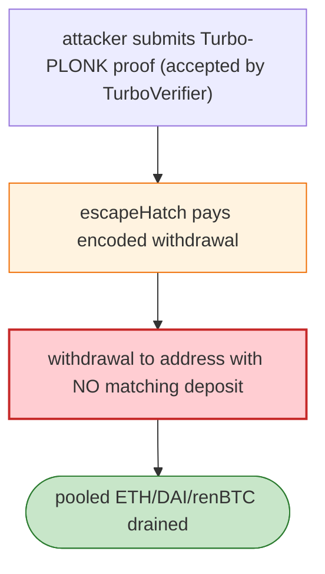

# Aztec V1 Escape-Hatch Exploit — Turbo-PLONK Proof Withdraws Unbacked Pooled Assets

> **Reproduction:** the PoC compiles & runs in an isolated Foundry project at
> [this project folder](.). Full verbose trace: [output.txt](output.txt).
> Verified vulnerable source: [RollupProcessor](sources/RollupProcessor_737901),
> [TurboVerifier](sources/TurboVerifier_48cb7b).

---

## Key info

| | |
|---|---|
| **Loss** | Aztec V1 pooled ETH/DAI/renBTC drained; renBTC tx `0x9e1d6ab7…` |
| **Vulnerable contract** | Aztec V1 `RollupProcessor` `0x737901be…` |
| **Attacker** | `0x6952d924…` |
| **Chain / block / date** | Ethereum mainnet / Jun 2026 |
| **Bug class** | ZK proof acceptance — the permissionless `escapeHatch(proofData, signatures, viewingKeys)` accepts a Turbo-PLONK rollup proof and pays out the encoded withdrawal to an address with no matching deposit, breaking value conservation. |

---

## TL;DR

Per the embedded analysis: the Aztec V1 rollup exposes `escapeHatch(...)`, a permissionless exit that
accepts a Turbo-PLONK rollup proof and pays out the encoded withdrawal. The attacker submitted proofs
the `TurboVerifier` accepted **yet that authorised withdrawing the rollup's entire pooled ETH/DAI/renBTC
balance to an address with no matching deposit**, breaking the rollup's value-conservation invariant.
Each proof is a cryptographic witness bound to the rollup's on-chain roots at its block.

---

## Root cause

A **value-conservation violation via accepted proofs**: the escape-hatch honoured withdrawals whose
proofs the TurboVerifier accepted but which were not backed by real deposits — a flaw in how the rollup
bound withdrawal authorisation to prior deposits/roots.

---

## Diagrams



---

## Remediation

1. Bind withdrawal authorisation to verified prior deposits (value-conservation invariant).
2. Re-check deposit/withdrawal equality at settlement; reject unbacked withdrawals.
3. Audit Turbo-PLONK public-input constraints (see the exp2 variant).

---

## How to reproduce

```bash
_shared/run_poc.sh 2026-06-AztecEscapeHatch_exp -vvvvv
```

- RPC: mainnet archive. Result: `[PASS] 3 tests` — unbacked withdrawals paid via escapeHatch.

---

*Reference: Aztec V1 escape-hatch unbacked-withdrawal exploit, mainnet, Jun 2026.*
