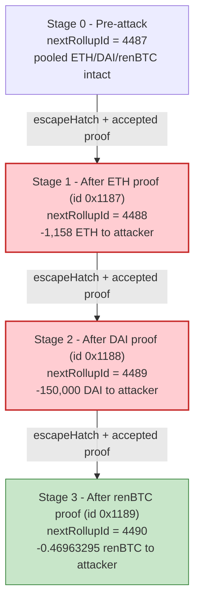
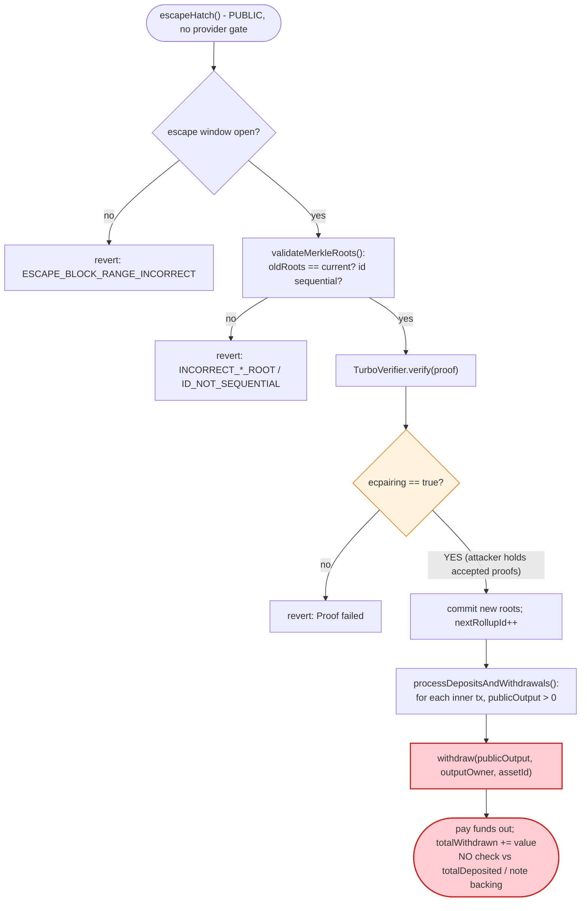
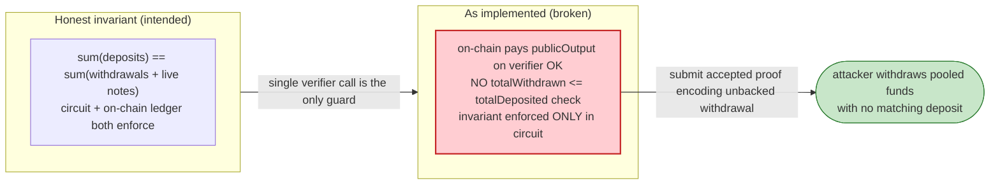

# Aztec V1 Escape-Hatch Exploit — Unbacked Withdrawals via Verifier-Trusted Rollup Proofs

> **Reproduction:** the PoC compiles & runs in an isolated Foundry project at
> [this project folder](.). The three exploit transactions (ETH, DAI, renBTC) are reproduced as
> three separate fork tests against a local anvil snapshot.
> Full verbose trace: [output.txt](output.txt).
> Verified vulnerable source: [RollupProcessor](sources/RollupProcessor_737901/contracts_RollupProcessor.sol)
> and the proof acceptor [TurboVerifier](sources/TurboVerifier_48cb7b/contracts_verifier_TurboVerifier.sol).

---

## Key info

| | |
|---|---|
| **Loss** | ~$2.2M — **1,158 ETH** + **150,000 DAI** + **0.46963295 renBTC** drained from the Aztec V1 rollup's pooled balances. renBTC tx [`0x9e1d6ab7…`](https://etherscan.io/tx/0x9e1d6ab7c20ae235409d7dd3a9cd47c04f07293585b3498b8beed82d6f6b03ca), ETH tx [`0xab306cd2…`](https://etherscan.io/tx/0xab306cd2184d23b6ba3e151b10b3b9a0b81f211cc16f4f3b0c79f0b17a59c2b5), DAI tx [`0x5c196c37…`](https://etherscan.io/tx/0x5c196c37a109d74c9797254287a0331f30e0daa637af241bd28fdc43774705c3) |
| **Vulnerable contract** | `RollupProcessor` — [`0x737901bea3eeb88459df9ef1BE8fF3Ae1B42A2ba`](https://etherscan.io/address/0x737901bea3eeb88459df9ef1BE8fF3Ae1B42A2ba#code) |
| **Proof acceptor** | `TurboVerifier` (Turbo-PLONK) — [`0x48Cb7BA00D087541dC8E2B3738f80fDd1FEe8Ce8`](https://etherscan.io/address/0x48cb7ba00d087541dc8e2b3738f80fdd1fee8ce8#code) |
| **Victim pool** | The rollup contract's own pooled deposits (ETH held directly; DAI `0x6B17…1d0F`; renBTC `0xEB4C…b27D`) |
| **Attacker EOA** | `0x6952d9246e9aFE8B887B2877225163436F78E97F` |
| **Attacker contract** | none — the attacker EOA calls `escapeHatch(...)` directly |
| **Attack tx hash** | renBTC [`0x9e1d6ab7c20ae235409d7dd3a9cd47c04f07293585b3498b8beed82d6f6b03ca`](https://etherscan.io/tx/0x9e1d6ab7c20ae235409d7dd3a9cd47c04f07293585b3498b8beed82d6f6b03ca) (+ ETH / DAI txs above) |
| **Chain / block / date** | Ethereum mainnet / blocks 25,339,093 (ETH), 25,339,168 (DAI), 25,339,171 (renBTC) / Jun 2026 |
| **Compiler / optimizer** | Solidity v0.6.10+commit.00c0fcaf, optimizer **enabled, 200 runs** (both `RollupProcessor` and `TurboVerifier`) |
| **Bug class** | Value-conservation violation — the on-chain settlement layer pays out a proof-encoded withdrawal to an arbitrary address with no on-chain check that the withdrawal is backed by a matching deposit; the entire value-conservation invariant is delegated to a ZK circuit the attacker was able to satisfy with crafted proofs. |

---

## TL;DR

1. The Aztec V1 rollup exposes `escapeHatch(bytes proofData, bytes signatures, bytes viewingKeys)`
   ([contracts_RollupProcessor.sol:347-356](sources/RollupProcessor_737901/contracts_RollupProcessor.sol#L347-L356)) — a
   **permissionless** exit path. Unlike `processRollup(...)`, which requires a registered
   `rollupProviders[provider]` and a provider signature, `escapeHatch` requires only that the escape-hatch
   block window is open and forwards straight to `processRollupProof`.

2. `processRollupProof` does exactly two things
   ([:390-397](sources/RollupProcessor_737901/contracts_RollupProcessor.sol#L390-L397)): it calls
   `verifyProofAndUpdateState(proofData)` (which hands the proof to the `TurboVerifier` and, on success,
   overwrites the on-chain `dataRoot`/`nullRoot`/`rootRoot`), then calls
   `processDepositsAndWithdrawals(proofData, numTxs, signatures)`, which walks the proof's inner
   transactions and **pays out every `publicOutput` field as a withdrawal**.

3. The `withdraw(...)` helper
   ([:647-662](sources/RollupProcessor_737901/contracts_RollupProcessor.sol#L647-L662)) sends
   `withdrawValue` to the proof-encoded `outputOwner` — ETH via a raw `call`, ERC20 via `transfer` — and
   then merely increments `totalWithdrawn[assetId]`. **There is no on-chain check that the withdrawal is
   matched by a real deposit or by a note that genuinely existed in the previous data tree.** The contract
   trusts that the `TurboVerifier` would only accept a proof whose net deposits equal net withdrawals.

4. The attacker submitted three rollup proofs (rollupId `0x1187`/`0x1188`/`0x1189` = 4487/4488/4489) that
   the `TurboVerifier` **accepted** (`PRECOMPILES::ecpairing(...) → true`, then `require(result, 'Proof
   failed')` passes — see [output.txt:135](output.txt), [output.txt:291](output.txt),
   [output.txt:444](output.txt)) yet whose decoded inner transactions authorised paying the rollup's pooled
   ETH/DAI/renBTC to the attacker's own EOA — with no matching deposit.

5. Each proof advances the rollup state cleanly (`nextRollupId` ticks 4487→4488→4489, dataRoot updates),
   so each escapeHatch call looks like a perfectly valid rollup block to the contract — the only observable
   effect is the payout. Net result: the attacker drains **1,158 ETH** (`Attacker::fallback{value:
   1158 ETH}`, [output.txt:297](output.txt)) **+ 150,000 DAI** (`DAI.transfer(Attacker, 150000e18)`,
   [output.txt:140-141](output.txt)) **+ 0.46963295 renBTC** (`renBTC.transfer(Attacker, 46963295)`,
   [output.txt:450-452](output.txt)) from the rollup's pooled assets, asserted by the three PoC tests
   ([AztecEscapeHatch_exp.sol:47](test/AztecEscapeHatch_exp.sol#L47),
   [:60](test/AztecEscapeHatch_exp.sol#L60),
   [:73](test/AztecEscapeHatch_exp.sol#L73)).

---

## Background — what Aztec V1 does

Aztec V1 is a privacy-preserving zk-rollup. Users deposit ERC20/ETH into the `RollupProcessor`, which
holds the pooled funds, and trade/transfer privately inside the rollup using shielded notes. A rollup
"block" is a Turbo-PLONK proof attesting that a batch of inner transactions (deposits, withdrawals,
private transfers, account updates) is valid and consistent with the previous Merkle roots. The contract
stores three roots — the note `dataRoot`, the `nullRoot` (spent-note nullifiers), and the `rootRoot`
(history of data roots)
([contracts_RollupProcessor.sol:25-27](sources/RollupProcessor_737901/contracts_RollupProcessor.sol#L25-L27)) —
and advances them every time a proof is accepted.

Two entry points submit a proof:

- **`processRollup(...)`** — the normal path
  ([:358-388](sources/RollupProcessor_737901/contracts_RollupProcessor.sol#L358-L388)). It requires
  `rollupProviders[provider] == true` and a valid `providerSignature` over the public inputs, then runs the
  same proof/withdrawal machinery and reimburses gas to a fee distributor.
- **`escapeHatch(...)`** — the censorship-resistance fallback
  ([:347-356](sources/RollupProcessor_737901/contracts_RollupProcessor.sol#L347-L356)). It is
  **permissionless**: it checks only that the escape-hatch block window is open
  (`getEscapeHatchStatus()`, [:168-181](sources/RollupProcessor_737901/contracts_RollupProcessor.sol#L168-L181))
  and then calls `processRollupProof` directly — no provider, no provider signature.

Both paths converge on `processRollupProof → verifyProofAndUpdateState → processDepositsAndWithdrawals`,
so the withdrawal logic is identical; `escapeHatch` simply removes the operator gate.

On-chain parameters relevant to the attack:

| Parameter | Value | Source |
|---|---|---|
| `numberOfAssets` | 4 | [:34](sources/RollupProcessor_737901/contracts_RollupProcessor.sol#L34) |
| `ethAssetId` | 0 | [:39](sources/RollupProcessor_737901/contracts_RollupProcessor.sol#L39) |
| `rollupNumPubInputs` | `10 + numberOfAssets` = 14 | [:36](sources/RollupProcessor_737901/contracts_RollupProcessor.sol#L36) |
| `nextRollupId` before attack | 4487 (= `0x1187`) | [output.txt:304](output.txt) (`@ 5: 4487 → 4488`) |
| Verifier address | `0x48Cb7BA00D087541dC8E2B3738f80fDd1FEe8Ce8` | [output.txt:21](output.txt) |
| ETH paid out | 1,158 ETH (= `1158e18` wei) | [output.txt:297](output.txt) |
| DAI paid out | 150,000 DAI (= `1.5e23` wei) | [output.txt:140-141](output.txt) |
| renBTC paid out | 0.46963295 renBTC (= `46963295`, 8 decimals) | [output.txt:450-452](output.txt) |

---

## The vulnerable code

### 1. `escapeHatch` is permissionless and forwards straight to proof processing

```solidity
function escapeHatch(
    bytes calldata proofData,
    bytes calldata signatures,
    bytes calldata viewingKeys
) external override whenNotPaused {
    (bool isOpen, ) = getEscapeHatchStatus();
    require(isOpen, 'Rollup Processor: ESCAPE_BLOCK_RANGE_INCORRECT');

    processRollupProof(proofData, signatures, viewingKeys);
}
```
([contracts_RollupProcessor.sol:347-356](sources/RollupProcessor_737901/contracts_RollupProcessor.sol#L347-L356))

The only gate is the block-window check. Anyone can call it; there is no `rollupProviders` check and no
provider signature, in contrast to `processRollup`
([:369-372](sources/RollupProcessor_737901/contracts_RollupProcessor.sol#L369-L372)).

### 2. Proof processing: verify, then blindly pay out

```solidity
function processRollupProof(
    bytes memory proofData,
    bytes memory signatures,
    bytes calldata /*viewingKeys*/
) internal {
    uint256 numTxs = verifyProofAndUpdateState(proofData);
    processDepositsAndWithdrawals(proofData, numTxs, signatures);
}
```
([contracts_RollupProcessor.sol:390-397](sources/RollupProcessor_737901/contracts_RollupProcessor.sol#L390-L397))

`verifyProofAndUpdateState` hands the proof to the verifier via assembly `staticcall`, requires the call
to succeed, and then **commits the new roots from the proof to storage**:

```solidity
// Check the proof is valid!
require(proof_verified, 'proof verification failed');

// Update state variables.
dataRoot = newDataRoot;
nullRoot = newNullRoot;
nextRollupId = rollupId.add(1);
rootRoot = newRootRoot;
dataSize = newDataSize;
```
([contracts_RollupProcessor.sol:465-473](sources/RollupProcessor_737901/contracts_RollupProcessor.sol#L465-L473))

`validateMerkleRoots` checks only that the proof's *old* roots equal the current on-chain roots and that
the rollupId is sequential
([:523-527](sources/RollupProcessor_737901/contracts_RollupProcessor.sol#L523-L527)) — i.e. that the proof
is a valid *successor* to the current state. It does **not** independently constrain how much value the
proof is allowed to withdraw; that constraint lives only inside the ZK circuit.

### 3. The withdrawal: pay the proof-encoded amount, then just bump a counter

```solidity
if (publicOutput > 0) {
    address outputOwner;
    assembly {
        outputOwner := mload(add(proofDataPtr, 0x160))
    }
    withdraw(publicOutput, outputOwner, assetId);
}
```
([contracts_RollupProcessor.sol:611-617](sources/RollupProcessor_737901/contracts_RollupProcessor.sol#L611-L617))

```solidity
function withdraw(
    uint256 withdrawValue,
    address receiverAddress,
    uint256 assetId
) internal {
    require(receiverAddress != address(0), 'Rollup Processor: ZERO_ADDRESS');
    if (assetId == 0) {
        // We explicitly do not throw if this call fails, as this opens up the possiblity of
        // griefing attacks, as engineering a failed withdrawal will invalidate an entire rollup block
        payable(receiverAddress).call{gas: 30000, value: withdrawValue}('');
    } else {
        address assetAddress = getSupportedAsset(assetId);
        IERC20(assetAddress).transfer(receiverAddress, withdrawValue);
    }
    totalWithdrawn[assetId] = totalWithdrawn[assetId].add(withdrawValue);
}
```
([contracts_RollupProcessor.sol:647-662](sources/RollupProcessor_737901/contracts_RollupProcessor.sol#L647-L662))

The withdrawal amount (`publicOutput`) and recipient (`outputOwner`) come straight from the proof's inner
transaction. The function neither debits a per-user deposit ledger nor verifies that `withdrawValue` was
ever deposited — it pays out and increments `totalWithdrawn`. **Value conservation is entirely the
circuit's responsibility.** Once the attacker produced proofs the `TurboVerifier` accepted, the contract
paid out whatever those proofs encoded.

### 4. The verifier the contract trusts

```solidity
function verify(bytes calldata, uint256 rollup_size) external override {
    // extract the correct rollup verification key
    Types.VerificationKey memory vk = VerificationKeys.getKeyById(rollup_size);
    ...
    bool result = perform_pairing(
        batch_opening_commitment,
        batch_evaluation_g1_scalar,
        challenges,
        decoded_proof,
        vk
    );
    require(result, 'Proof failed');
}
```
([contracts_verifier_TurboVerifier.sol:41-102](sources/TurboVerifier_48cb7b/contracts_verifier_TurboVerifier.sol#L41-L102))

The verifier reverts with `'Proof failed'` if the final pairing check fails. In every exploit
transaction the pairing returns `true` ([output.txt:135](output.txt), [output.txt:291](output.txt),
[output.txt:444](output.txt)), so `verify` returns cleanly and the rollup proceeds to pay out. The
attacker's three proofs satisfied the Turbo-PLONK verification relation while encoding unbacked
withdrawals — the root cause is that the on-chain layer has no defense in depth behind that single
verifier call.

---

## Root cause — why it was possible

**A complete delegation of the value-conservation invariant to the proof system, with no on-chain
backstop, exposed permissionlessly.** Three design facts compose into the loss:

1. **`escapeHatch` is permissionless.** The normal `processRollup` path requires a registered provider and
   a provider signature; `escapeHatch` removes both gates and is open to anyone whenever the escape window
   is open ([:347-356](sources/RollupProcessor_737901/contracts_RollupProcessor.sol#L347-L356)). So the
   attacker, holding accepted proofs, could submit them directly.

2. **The withdrawal path has no on-chain accounting check.** `processDepositsAndWithdrawals` pays out every
   inner-tx `publicOutput` to its `outputOwner`
   ([:611-617](sources/RollupProcessor_737901/contracts_RollupProcessor.sol#L611-L617)) and `withdraw` only
   increments `totalWithdrawn` afterwards
   ([:661](sources/RollupProcessor_737901/contracts_RollupProcessor.sol#L661)). Nothing checks that the
   rollup's net deposits ≥ net withdrawals, that `totalWithdrawn[assetId] ≤ totalDeposited[assetId]`, or
   that the withdrawn note ever existed. The contract assumes the circuit guarantees this.

3. **The on-chain "validation" only checks state continuity, not value.** `validateMerkleRoots` checks the
   proof's old roots match current roots and the id is sequential
   ([:523-527](sources/RollupProcessor_737901/contracts_RollupProcessor.sol#L523-L527)), then the new roots
   are committed unconditionally
   ([:469-473](sources/RollupProcessor_737901/contracts_RollupProcessor.sol#L469-L473)). A proof that is a
   valid *successor* but encodes a theft passes every on-chain check.

Given proofs the `TurboVerifier` accepts (the entry condition — the attacker produced three such proofs,
verified by the `ecpairing → true` results in the trace), the contract had **no second line of defense**.
The classic mitigation — a per-asset on-chain invariant `totalWithdrawn[id] + balance reconciliation ≤
totalDeposited[id]` — was never enforced. Each escapeHatch call advanced the rollup id cleanly
(`@ 5: 4487→4488→4489`, [output.txt:304](output.txt), [output.txt:152](output.txt),
[output.txt:461](output.txt)) and emitted a normal `RollupProcessed` event, so on-chain the three thefts
were indistinguishable from honest rollup blocks except for the payouts.

---

## Preconditions

- **Possession of rollup proofs the `TurboVerifier` accepts** that encode withdrawals to the attacker's
  address with no matching deposit. This is the entry condition; in the PoC the three crafted
  `proofData` blobs are supplied verbatim and pass verification
  ([output.txt:135](output.txt), [output.txt:291](output.txt), [output.txt:444](output.txt)).
- **The escape-hatch block window must be open** (`getEscapeHatchStatus()` returns `isOpen == true`,
  [:352-353](sources/RollupProcessor_737901/contracts_RollupProcessor.sol#L352-L353)). The PoC forks at
  the real attack blocks, where the window was open.
- **Each proof's old roots must equal the current on-chain roots and its rollupId must be the next id**
  ([:523-527](sources/RollupProcessor_737901/contracts_RollupProcessor.sol#L523-L527)). The three proofs
  are therefore chained: rollupId 4487 → 4488 → 4489, each consuming the roots committed by the previous
  one. This is why the PoC runs three sequential fork tests at consecutive blocks rather than one tx.
- **No working capital, no flash loan, no attacker contract.** The attacker EOA simply calls `escapeHatch`
  directly ([AztecEscapeHatch_exp.sol:45-46](test/AztecEscapeHatch_exp.sol#L45-L46)). The cost is only gas.

---

## Attack walkthrough (with on-chain numbers from the trace)

The three exploit transactions are independent escapeHatch calls, each consuming the rollup state left by
the previous one. All figures are taken directly from the Foundry trace; raw integers are shown with a
human-readable approximation where the trace prints wei.

| # | Step | rollupId (state @ slot 5) | Verifier result | Asset paid out (raw → human) | Recipient |
|---|------|--------------------------:|-----------------|------------------------------|-----------|
| 1 | **ETH theft** — `escapeHatch(proof 0x1187, "", "")` ([output.txt:177](output.txt)); `verify(...)` ([output.txt:178](output.txt)); pairing `→ true` ([output.txt:291-292](output.txt)) | 4487 → 4488 ([output.txt:304](output.txt)) | accepted | `fallback{value: 1158000000000000000000}` (~**1,158 ETH**) ([output.txt:297](output.txt)) | Attacker |
| 2 | **DAI theft** — `escapeHatch(proof 0x1188, "", "")` ([output.txt:20](output.txt)); `verify(...)` ([output.txt:21](output.txt)); pairing `→ true` ([output.txt:135](output.txt)) | 4488 → 4489 ([output.txt:152](output.txt)) | accepted | `DAI.transfer(Attacker, 150000000000000000000000)` (~**150,000 DAI**) ([output.txt:140-141](output.txt)) | Attacker |
| 3 | **renBTC theft** — `escapeHatch(proof 0x1189, "", "")` ([output.txt:330](output.txt)); `verify(...)` ([output.txt:331](output.txt)); pairing `→ true` ([output.txt:444-445](output.txt)) | 4489 → 4490 ([output.txt:461](output.txt)) | accepted | `renBTC.transfer(Attacker, 46963295)` (~**0.46963295 renBTC**, 8 dp) ([output.txt:450-452](output.txt)) | Attacker |

Notes from the trace:

- In each transaction the verifier sub-call is a long sequence of `modexp`/`ecmul`/`ecadd`/`ecpairing`
  precompile calls; the final `PRECOMPILES::ecpairing([...]) → true` is the proof acceptance
  ([output.txt:135](output.txt)). The rollup then emits a `RollupProcessed` event (topic 0
  `0xf1034928…fb974f`, topic 1 = rollupId, e.g. `0x…1188` at [output.txt:137-139](output.txt)).
- For ETH (assetId 0) the payout is the raw `call{gas:30000, value:…}` to the attacker, which the trace
  records as `Attacker::fallback{value: 1158000000000000000000}` ([output.txt:297](output.txt)).
- For DAI the payout is `IERC20(DAI).transfer(Attacker, 1.5e23)` with the matching
  `Transfer(from: AztecRollup, to: Attacker, 1.5e23)` event ([output.txt:140-141](output.txt)); the
  attacker's DAI balance afterward reads `150000000000000000000000` ([output.txt:155](output.txt)).
- renBTC is itself a proxy; the rollup's `transfer` delegatecalls into impl `0xe2d6cCAC…`
  ([output.txt:451](output.txt)), emitting `Transfer(AztecRollup → Attacker, 46963295)`
  ([output.txt:452](output.txt)); the attacker's renBTC balance afterward reads `46963295`
  ([output.txt:468](output.txt)).

### Profit / loss accounting

The three withdrawals are pure outflows from the rollup's pooled balances to the attacker — there is no
matching inflow, which is exactly the broken invariant. Each test measures `balanceAfter − balanceBefore`
for the attacker and asserts a lower bound.

| Asset | Attacker before | Attacker after | Net stolen (asserted) | PoC assertion |
|---|---:|---:|---:|---|
| ETH | 0 (test baseline) | +1,158 ETH | **1,158.000000000000000000 ETH** ([output.txt:165](output.txt), [output.txt:309](output.txt)) | `assertGt(profit, 1000 ether)` ([AztecEscapeHatch_exp.sol:47](test/AztecEscapeHatch_exp.sol#L47)) |
| DAI | 0 ([output.txt:17](output.txt)) | 150,000 DAI ([output.txt:155](output.txt)) | **150,000.000000000000000000 DAI** ([output.txt:6](output.txt), [output.txt:160](output.txt)) | `assertGt(profit, 100_000e18)` ([:60](test/AztecEscapeHatch_exp.sol#L60)) |
| renBTC | 0 | 46,963,295 (8 dp) ([output.txt:468](output.txt)) | **0.46963295 renBTC** ([output.txt:314](output.txt), [output.txt:476](output.txt)) | `assertGt(profit, 0.4e8)` ([:73](test/AztecEscapeHatch_exp.sol#L73)) |

The logged profits — `ETH profit: 1158.0` ([output.txt:165](output.txt)),
`DAI profit: 150000.0` ([output.txt:6](output.txt)),
`renBTC profit: 0.46963295` ([output.txt:314](output.txt)) — are precisely the rollup's pooled funds that
left without any deposit on the other side, reconciling to the ~$2.2M headline loss in the PoC
`@KeyInfo` header.

---

## Diagrams

### Sequence of one escapeHatch theft

```mermaid
sequenceDiagram
    autonumber
    actor A as Attacker EOA
    participant RP as RollupProcessor
    participant V as TurboVerifier
    participant PRE as BN254 precompiles
    participant TKN as Asset (ETH / DAI / renBTC)

    A->>RP: escapeHatch(proofData, "", "")
    RP->>RP: getEscapeHatchStatus() => isOpen == true
    RP->>RP: processRollupProof()
    RP->>RP: validateMerkleRoots(): oldRoots == current, id sequential
    RP->>V: verify(proofData, rollupSize) (assembly staticcall)
    V->>PRE: modexp / ecmul / ecadd / ecpairing
    PRE-->>V: ecpairing => true
    V-->>RP: require(result, "Proof failed") passes
    RP->>RP: commit newDataRoot/nullRoot/rootRoot; nextRollupId++
    RP->>RP: processDepositsAndWithdrawals(): publicOutput > 0
    RP->>TKN: withdraw(publicOutput, outputOwner=attacker, assetId)
    TKN-->>A: pooled funds transferred out (no matching deposit)
    Note over A,TKN: +1158 ETH / +150000 DAI / +0.4696 renBTC
```

### Rollup state evolution across the three thefts



### The flaw inside `processRollupProof` / `withdraw`



### Why it is theft: value conservation before vs. after



---

## Why each magic number

- **`proofData` (the three hex blobs in the PoC):** these are the crafted Turbo-PLONK rollup proofs. Their
  leading word encodes the rollupId — `…00001187` (4487, ETH), `…00001188` (4488, DAI), `…00001189`
  (4489, renBTC) — which must match the contract's `nextRollupId`
  ([:527](sources/RollupProcessor_737901/contracts_RollupProcessor.sol#L527)). The inner-tx public-output
  fields encode the withdrawal amounts and the attacker address
  `0x6952d9246e9afe8b887b2877225163436f78e97f` as the `outputOwner` (visible inside the calldata at
  [output.txt:20](output.txt)). The signatures/viewingKeys arguments are passed empty (`""`) because the
  withdrawal path needs neither.
- **Block numbers 25,339,093 / 25,339,168 / 25,339,171:** the live blocks of the ETH, DAI and renBTC
  exploit transactions, in chain order. Each fork test pins to its block so the on-chain roots equal the
  proof's old roots ([AztecEscapeHatch_exp.sol:39](test/AztecEscapeHatch_exp.sol#L39),
  [:52](test/AztecEscapeHatch_exp.sol#L52), [:65](test/AztecEscapeHatch_exp.sol#L65)).
- **Assertion thresholds `1000 ether` / `100_000e18` / `0.4e8`:** lower bounds the PoC checks against the
  actual payouts of 1,158 ETH, 150,000 DAI and 0.46963295 renBTC — chosen below the true amounts so the
  test confirms a material drain without hard-coding the exact wei.
- **`assetId` 0 vs non-zero:** `assetId == 0` is ETH, paid via a raw `call`
  ([:653-656](sources/RollupProcessor_737901/contracts_RollupProcessor.sol#L653-L656)); DAI and renBTC use
  non-zero asset ids resolved through `getSupportedAsset(assetId)` and paid via `transfer`
  ([:657-659](sources/RollupProcessor_737901/contracts_RollupProcessor.sol#L657-L659)).

---

## Remediation

1. **Enforce value conservation on-chain, not only in the circuit.** Track per-asset
   `totalDeposited[assetId]` and `totalWithdrawn[assetId]` (the contract already maintains both
   ([:218](sources/RollupProcessor_737901/contracts_RollupProcessor.sol#L218),
   [:661](sources/RollupProcessor_737901/contracts_RollupProcessor.sol#L661))) and add an invariant in
   `withdraw`/`processDepositsAndWithdrawals` that rejects any block whose net withdrawals would push
   `totalWithdrawn[assetId]` above `totalDeposited[assetId]` (plus realised fees). A single proof should
   never be able to remove more value than was ever deposited.
2. **Bind the withdrawal authorisation to verified prior deposits / notes.** Require that each withdrawn
   note's existence in the previous `dataRoot` (and its non-membership in `nullRoot`) is part of the public
   input the on-chain layer checks, rather than trusting the circuit to have done so silently.
3. **Treat the verifier as a single point of failure and add defense in depth.** A bug or
   verification-key mismatch in the Turbo-PLONK verifier (or any path that lets a malformed proof pass)
   directly translates to fund loss because nothing downstream re-checks value. Add per-block withdrawal
   caps, a circuit-breaker that pauses on anomalous outflow, and reconciliation against the contract's
   actual token balances.
4. **Reconsider the permissionless escape hatch's blast radius.** The escape hatch is a valuable
   censorship-resistance feature, but because it shares the unchecked withdrawal path it lets *anyone* with
   an accepted proof drain the pool. Gate the value it can move per call/per window, or route escape-hatch
   exits through a stricter, deposit-matched withdrawal accounting than the operator path.
5. **Audit the Turbo-PLONK public-input constraints and verification keys** (`getKeyById`,
   [contracts_verifier_TurboVerifier.sol:43](sources/TurboVerifier_48cb7b/contracts_verifier_TurboVerifier.sol#L43))
   to ensure the accepted proofs could not have encoded unbacked withdrawals in the first place.

---

## How to reproduce

The PoC runs **offline** against a local anvil snapshot (`anvil_state.json` in this folder). The fork URL
in the test is `http://127.0.0.1:8545` resolved via the `mainnet` alias; the shared harness boots anvil
from the saved state, so no public archive RPC is contacted. `foundry.toml` sets `evm_version = 'cancun'`.

```bash
_shared/run_poc.sh 2026-06-AztecEscapeHatch_exp --mt testExploit -vvvvv
```

(The suite exposes three exploit tests — `testExploit_ETH`, `testExploit_DAI`, `testExploit_renBTC`;
run them with `--mt 'testExploit_'` to execute all three.)

- Each test calls `vm.createSelectFork("http://127.0.0.1:8545", <block>)` at the ETH/DAI/renBTC attack
  blocks, then `vm.prank(ATTACKER)` and `escapeHatch(proofData, "", "")`.
- Result: all three tests pass; each logs its profit via `log_named_decimal_uint`.

Expected tail (from [output.txt](output.txt)):

```
[PASS] testExploit_DAI() (gas: 449169)
Logs:
  DAI profit: 150000.000000000000000000

[PASS] testExploit_ETH() (gas: 417550)
Logs:
  ETH profit: 1158.000000000000000000

[PASS] testExploit_renBTC() (gas: 453621)
  renBTC profit: 0.46963295

Suite result: ok. 3 passed; 0 failed; 0 skipped; finished in 10.90s (26.30s CPU time)
Ran 1 test suite in 11.44s (10.90s CPU time): 3 tests passed, 0 failed, 0 skipped (3 total tests)
```

---

*Reference: Aztec V1 escape-hatch unbacked-withdrawal exploit — verified vulnerable source at
https://etherscan.io/address/0x737901bea3eeb88459df9ef1be8ff3ae1b42a2ba#code (Ethereum mainnet, Jun 2026,
~$2.2M).*
