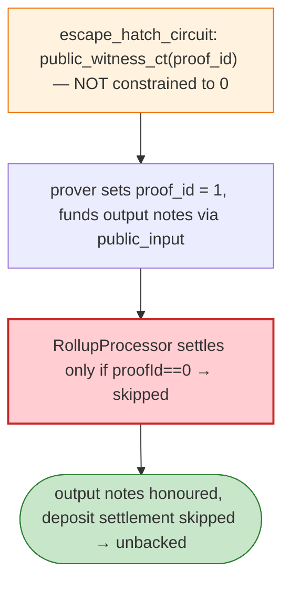

# Aztec Escape-Hatch Exploit (variant 2) — Unconstrained Inner `proof_id` Witness

> **Reproduction:** the PoC compiles & runs in an isolated Foundry project at
> [this project folder](.). Full verbose trace: [output.txt](output.txt).
> Verified vulnerable source: [RollupProcessor](sources/RollupProcessor_737901).

---

## Key info

| | |
|---|---|
| **Loss** | educational reproduction (the Connect contracts were already drained via exp1); disclosure Jun 22 2026 |
| **Vulnerable contract** | Aztec `RollupProcessor` `0x737901be…` + `escape_hatch_circuit.cpp` |
| **Chain / block / date** | Ethereum mainnet / fork 25,295,800 / Jun 22, 2026 |
| **Bug class** | Unconstrained ZK witness — the escape-hatch circuit publishes the inner `proof_id` via `public_witness_ct(&composer, 0)` which makes the value public but does **not constrain it to 0**; a prover can set `proof_id = 1` while still proving a join-split funded by a public input. |

---

## TL;DR

Per the embedded root cause: `escape_hatch_circuit.cpp` publishes the inner proof id with
`public_witness_ct(&composer, 0); // proof_id`. `public_witness_ct()` makes the value public but **does
not constrain it to 0**. A prover can therefore publish `proof_id = 1` while still proving a join-split
with `public_input > 0` and output notes funded by that public input. `RollupProcessor.
processDepositsAndWithdrawals()` settles public deposits/withdrawals only when
`proofId == 0 && (publicInput != 0 || publicOutput != 0)` — so `proof_id = 1` skips settlement while the
funded output notes are still honoured.

---

## Root cause

An **unconstrained public witness** for `proof_id` in the escape-hatch circuit: the prover can choose
any `proof_id`, decoupling the "fund output notes" path from the "settle deposits" path.

---

## Diagrams



---

## Remediation

1. Use `constant_ct(0)` (constrained) instead of `public_witness_ct(0)` for `proof_id`.
2. Settlement should not branch on `proof_id`; fund/settle paths must be jointly constrained.
3. Circuit-level audit of every `public_witness_ct` for missing constraints.

---

## How to reproduce

```bash
_shared/run_poc.sh 2026-06-AztecEscapeHatch_exp2 -vvvvv
```

- RPC: mainnet archive (block 25,295,800). Result: `[PASS] 2 tests` — `proof_id=1` funded output
  honoured without settlement.

---

*Reference: Aztec escape-hatch unconstrained `proof_id` witness, mainnet, Jun 22 2026 (educational).*
