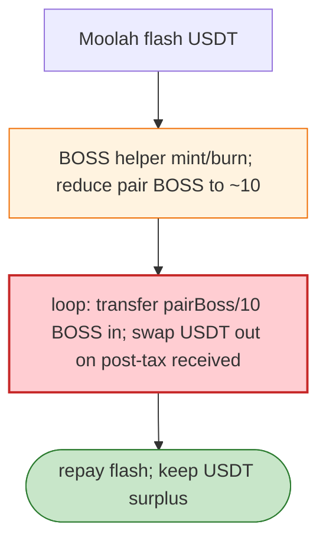

# BOSS Exploit — Helper Mint/Burn + Fee-Tax Pair Loop (Moolah Flash)

> **Reproduction:** the PoC compiles & runs in an isolated Foundry project at
> [this project folder](.). Full verbose trace: [output.txt](output.txt).
> Verified vulnerable source: [PancakePair](sources/PancakePair_e40216).

---

## Key info

| | |
|---|---|
| **Loss** | BOSS/USDT drained (BSC); attacker `0x618639Fe…` |
| **Vulnerable contract** | BOSS token `0x876D4539…`; BOSS helper `0x978118ec…`; BOSS/USDT pair `0xe4021651…` |
| **Flash source** | Moolah USDT flash loan `0x8F73b65B…` |
| **Chain / block / date** | BSC / Jun 2026 |
| **Bug class** | Token fee-tax + helper mint/burn loop — after reducing the pair's BOSS side to ~10 tokens, each loop transfers `pairBossBalance/10` BOSS into the pair and swaps out USDT using the post-tax amount received, harvesting the fee divergence. |

---

## TL;DR

Per the embedded analysis: the attacker used a Moolah USDT flash loan, **BOSS helper mint/burn calls**,
then repeatedly swapped against the BOSS/USDT Pancake pair after reducing its BOSS side to 10 tokens.
Each loop transferred `pairBossBalance / 10` BOSS into the pair and swapped out USDT using the **post-tax
amount received by the pair** — the fee/tax accounting mismatch drains USDT.

---

## Root cause

A **fee-on-transfer token (BOSS) + a privileged helper mint/burn path** interacting with a vanilla
Pancake pair: the helper can mint/burn BOSS to skew the pair, and the post-tax received amount differs
from the transfer input in a way the pair's `k` doesn't reconcile.

---

## Diagrams



---

## Remediation

1. Helper mint/burn must be access-controlled; cap mint per call.
2. Fee-aware Pancake pair; `k` on received amounts.
3. Block tax-bearing tokens from vanilla pairs.

---

## How to reproduce

```bash
_shared/run_poc.sh 2026-06-BOSS_exp -vvvvv
```

- RPC: BSC archive. Result: `[PASS]` — USDT drained via mint/burn + post-tax loop.

---

*Reference: BOSS helper-mint/burn + fee-tax pair loop, BSC, Jun 2026.*
