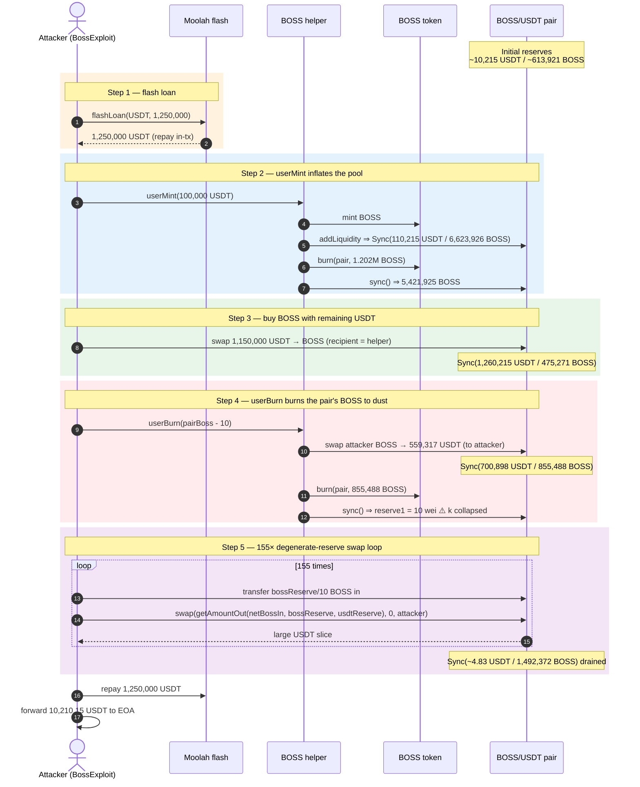
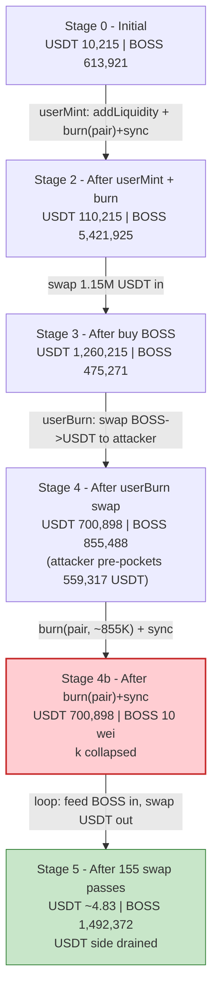
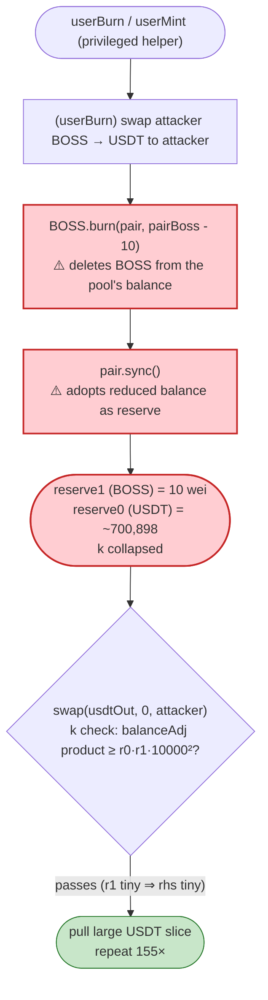
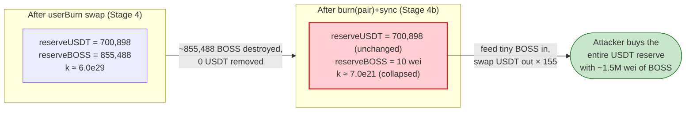

# BOSS Exploit — Helper Mint/Burn Drains the Pair's BOSS Reserve, then a Degenerate-Reserve Swap Loop Empties the USDT Side

> **Reproduction:** the PoC compiles & runs in an isolated Foundry project at
> [this project folder](.). Full verbose trace: [output.txt](output.txt).
> Verified vulnerable source (the AMM contract whose invariant is broken):
> [PancakePair.sol](sources/PancakePair_e40216/PancakePair.sol).

---

## Key info

| | |
|---|---|
| **Loss** | ~10,207.54 USDT (PoC nets **10,210.15 USDT** to the attacker EOA) drained from the BOSS/USDT PancakeSwap pair |
| **Vulnerable contract** | `BOSS` token [`0x876D4539b7F13ddDea969190c9a231A4B91735Cf`](https://bscscan.com/address/0x876d4539b7f13dddea969190c9a231a4b91735cf#code) + its privileged `BOSS helper` [`0x978118ece639bA4a9Ac3fb8B1d3bF239F0CaDDc1`](https://bscscan.com/address/0x978118ece639ba4a9ac3fb8b1d3bf239f0caddc1) |
| **Victim pool** | BOSS/USDT PancakeV2 pair — [`0xe4021651f01a00B89410C64de39996da3974D779`](https://bscscan.com/address/0xe4021651f01a00b89410c64de39996da3974d779) |
| **Flash source** | Moolah USDT flash loan proxy [`0x8F73b65B4caAf64FBA2aF91cC5D4a2A1318E5D8C`](https://bscscan.com/address/0x8f73b65b4caaf64fba2af91cc5d4a2a1318e5d8c) (impl `0x9321587EA0DC8247f8F03E8696C047b2713bB79A`) |
| **Attacker EOA** | [`0x618639Fe719987153E0Ec3Fe494Aa9a62ca02C91`](https://bscscan.com/address/0x618639fe719987153e0ec3fe494aa9a62ca02c91) |
| **Attacker contract** | `0x6a37e235f1a9823406C14d377870046419f9803D` (historical; the PoC redeploys equivalent logic as `BossExploit`) |
| **Attack tx** | [`0x96d1a0175eb4a82585db62a374518391f6b575a07c25c0e2874ca82400b830c7`](https://bscscan.com/tx/0x96d1a0175eb4a82585db62a374518391f6b575a07c25c0e2874ca82400b830c7) |
| **Chain / block / date** | BSC (chainId 56) / fork block 102,671,877 / June 2026 |
| **Compiler / optimizer** | Pair: Solidity v0.5.16, optimizer **disabled** (`"optimizer":"0"`, runs 200) — per [`_meta.json`](sources/PancakePair_e40216/_meta.json) |
| **Bug class** | Privileged fee-on-transfer-token helper that `_burn`s the AMM pair's reserve down to dust + `sync()`, collapsing the constant product, then drains the rich side with a hand-rolled `swap()` loop priced off the degenerate reserve |

---

## TL;DR

1. The attacker borrows **1,250,000 USDT** from a Moolah flash loan
   ([output.txt:67](output.txt)) and enters its own `onMoolahFlashLoan` callback.
2. It calls the privileged **`BOSS helper`'s `userMint(100,000 USDT)`**
   ([output.txt:77](output.txt)). The helper mints fresh BOSS, adds BOSS+USDT
   liquidity to the pair (pushing its reserves to ~110,215 USDT / ~6,623,926 BOSS,
   [output.txt:129](output.txt)), and — critically — its accounting `_burn`s a chunk
   of BOSS straight out of the pair and `sync()`s the smaller balance
   ([output.txt:152-159](output.txt)).
3. It then swaps the remaining ~1,150,000 flash-USDT into BOSS with the helper as
   recipient ([output.txt:173](output.txt)).
4. It calls **`BOSS helper`'s `userBurn(...)`** ([output.txt:213](output.txt)). The
   helper swaps the attacker's BOSS back out for USDT, then `_burn`s the pair's BOSS
   down to a literal **10 wei** and `sync()`s — leaving the pair holding
   **~700,898 USDT against 10 wei of BOSS** ([output.txt:278](output.txt)). The
   constant product `k` has collapsed; BOSS is now priced near-infinitely.
5. It then runs a **155-iteration loop** ([test/BOSS_exp.sol:129-139](test/BOSS_exp.sol#L129-L139)):
   each pass transfers `bossReserve / 10` BOSS into the pair and calls the pair's
   low-level `swap()` directly, pulling out `getAmountOut(netBossIn, bossReserve, usdtReserve)`
   USDT. Because `bossReserve` is tiny (10, 11, 12, … wei) relative to the USDT
   reserve, each swap legitimately satisfies the pair's `k` check yet siphons a large
   slice of USDT ([output.txt:305-319](output.txt)).
6. After 155 passes the pair's USDT side is drained to **~4.83 USDT**
   ([output.txt:6130](output.txt)). The attacker repays the 1,250,000-USDT flash
   ([output.txt:6136](output.txt)) and forwards the residue — **10,210.15 USDT** —
   to its EOA ([output.txt:6148](output.txt), [output.txt:6165](output.txt)).

The bug is not in the vanilla PancakePair: it is that BOSS's privileged helper can
**`_burn` the pair's own BOSS balance and `sync()`**, manufacturing a pool whose BOSS
reserve is 10 wei while its USDT reserve is ~700K. From that degenerate state the
constant-product formula prices a single wei of BOSS at a huge USDT amount, and the
attacker mines that mispricing 155 times.

---

## Background — what BOSS does

`BOSS` is a BSC ERC20 paired against USDT on PancakeSwap V2. It ships with a privileged
`BOSS helper` contract (`0x9781…DDc1`) that exposes `userMint(uint256)` and
`userBurn(uint256)`. From the trace, the helper's behaviour is:

- **`userMint(usdtAmount)`** — pulls `usdtAmount` USDT from the caller
  ([output.txt:78](output.txt)), reads the on-chain price via `BOSS.getPrice()` (which
  itself reads the pair's `getReserves`, [output.txt:86-93](output.txt)), `mint`s BOSS,
  `addLiquidity` to the BOSS/USDT pair ([output.txt:100](output.txt)), mints additional
  BOSS to the caller and to itself ([output.txt:140-151](output.txt)), and then `_burn`s
  a slice of the pair's BOSS balance followed by `pair.sync()`
  ([output.txt:152-159](output.txt)).
- **`userBurn(amount)`** — used in reverse: it swaps the caller's BOSS into USDT through
  the pair ([output.txt:252-264](output.txt)), then `_burn`s the pair's residual BOSS down
  to dust and `sync()`s ([output.txt:271-278](output.txt)).

Both helper paths share the same fatal primitive: **they delete BOSS from the live AMM
pair's token balance and force the pair to adopt the reduced balance as its reserve.**
The pair contract itself is a stock PancakeV2 pair — its `swap()` only enforces the
constant-product `k` check on the balances it currently sees
([PancakePair.sol:472-476](sources/PancakePair_e40216/PancakePair.sol#L472-L476)); it has
no way to know its BOSS reserve was annihilated out from under it.

On-chain parameters at the fork block (read from the trace):

| Parameter | Value | Source |
|---|---|---|
| Pair `token0` | USDT `0x55d3…7955` | [output.txt:90](output.txt) |
| Pair `token1` | BOSS `0x876D…35Cf` | implied (the other side) |
| Initial pair USDT reserve (`reserve0`) | 10,214,986,720,068,705,182,882 wei (~10,214.99 USDT) | [output.txt:88](output.txt) |
| Initial pair BOSS reserve (`reserve1`) | 613,921,185,452,174,726,148,468 wei (~613,921 BOSS) | [output.txt:88](output.txt) |
| Flash-loan amount | 1,250,000 × 1e18 USDT | [output.txt:67](output.txt) |
| `userMint` USDT spent | 100,000 × 1e18 USDT | [output.txt:77](output.txt) |
| Loop iterations | 155 | [test/BOSS_exp.sol:129](test/BOSS_exp.sol#L129) |
| Pair fee numerator (swap `k` check) | 25/10000 (0.25%) | [PancakePair.sol:473-475](sources/PancakePair_e40216/PancakePair.sol#L473-L475) |

The whole game is the relation between the two reserves after step 4: **~700,898 USDT
sitting against 10 wei of BOSS** ([output.txt:278](output.txt)). USDT is decimal-18 on
BSC, so 10 wei of BOSS is ~1e-17 BOSS — effectively zero — yet the AMM still treats it as
a real reserve to price against.

---

## The vulnerable code

The verified source we can cite verbatim is the PancakeV2 pair (`token1 = BOSS`). The
pair is *correct* for a well-behaved token — the exploit weaponises it via BOSS's helper.
The two subsections below pin (1) the AMM invariant the attack abuses and (2) the
`sync()` primitive the helper uses to corrupt the reserve. The BOSS-token/helper source
is not verified in this project folder; its `userMint`/`userBurn` behaviour is taken from
the execution trace and cited to `output.txt`.

### 1. The pair's `swap()` enforces `k` only on the balances it currently holds

```solidity
function swap(uint amount0Out, uint amount1Out, address to, bytes calldata data) external lock {
    require(amount0Out > 0 || amount1Out > 0, 'Pancake: INSUFFICIENT_OUTPUT_AMOUNT');
    (uint112 _reserve0, uint112 _reserve1,) = getReserves(); // gas savings
    require(amount0Out < _reserve0 && amount1Out < _reserve1, 'Pancake: INSUFFICIENT_LIQUIDITY');
    ...
    uint amount0In = balance0 > _reserve0 - amount0Out ? balance0 - (_reserve0 - amount0Out) : 0;
    uint amount1In = balance1 > _reserve1 - amount1Out ? balance1 - (_reserve1 - amount1Out) : 0;
    require(amount0In > 0 || amount1In > 0, 'Pancake: INSUFFICIENT_INPUT_AMOUNT');
    { // scope for reserve{0,1}Adjusted, avoids stack too deep errors
    uint balance0Adjusted = (balance0.mul(10000).sub(amount0In.mul(25)));
    uint balance1Adjusted = (balance1.mul(10000).sub(amount1In.mul(25)));
    require(balance0Adjusted.mul(balance1Adjusted) >= uint(_reserve0).mul(_reserve1).mul(10000**2), 'Pancake: K');
    }
    _update(balance0, balance1, _reserve0, _reserve1);
    emit Swap(msg.sender, amount0In, amount1In, amount0Out, amount1Out, to);
}
```
([PancakePair.sol:452-480](sources/PancakePair_e40216/PancakePair.sol#L452-L480))

The `k` check `balance0Adjusted · balance1Adjusted ≥ reserve0 · reserve1 · 10000²` is the
only protection. When `reserve1` (BOSS) is **10 wei**, `reserve0 · reserve1` is minuscule,
so the inequality is satisfied by an absurdly small BOSS input against a huge USDT output.
The pair behaves *exactly as designed* — the design simply does not survive a reserve that
was secretly burned to dust.

### 2. `sync()` blindly adopts the contract's current token balance as the new reserve

```solidity
// force reserves to match balances
function sync() external lock {
    _update(IERC20(token0).balanceOf(address(this)), IERC20(token1).balanceOf(address(this)), reserve0, reserve1);
}
```
([PancakePair.sol:491-493](sources/PancakePair_e40216/PancakePair.sol#L491-L493))

```solidity
function _update(uint balance0, uint balance1, uint112 _reserve0, uint112 _reserve1) private {
    require(balance0 <= uint112(-1) && balance1 <= uint112(-1), 'Pancake: OVERFLOW');
    ...
    reserve0 = uint112(balance0);
    reserve1 = uint112(balance1);
    blockTimestampLast = blockTimestamp;
    emit Sync(reserve0, reserve1);
}
```
([PancakePair.sol:366-379](sources/PancakePair_e40216/PancakePair.sol#L366-L379))

`sync()` trusts that token balances only move through `mint`/`burn`/`swap`/transfers the
pair can reason about. BOSS's helper violates that trust: it calls `BOSS.burn(pair, …)`
(an ERC20 burn that decrements the pair's BOSS balance) and then `pair.sync()`. The pair
dutifully records the smaller balance as its new reserve. In the trace this is the
`Sync(reserve0: 700898…, reserve1: 10)` event ([output.txt:278](output.txt)) — BOSS
deleted from the pool with **zero USDT removed**.

### 3. The helper's burn-from-pool primitive (observed in the trace)

Inside `userBurn`, after swapping the attacker's BOSS to USDT, the helper burns the pair's
remaining BOSS and re-syncs:

```text
BOSS token::burn(BOSS/USDT Pancake pair, 855488023369279514116608)   // output.txt:271
  emit Transfer(pair -> 0x0, 855488023369279514116608)               // output.txt:272
  BOSS/USDT Pancake pair::sync()                                      // output.txt:273
    emit Sync(reserve0: 700898212858770136364236, reserve1: 10)      // output.txt:278
```
([output.txt:271-278](output.txt))

This is the classic "burn from the pool" anti-pattern: one reserve side is destroyed
in-place, the AMM re-syncs the smaller balance, and `k` collapses in favour of whoever can
next push that side back up cheaply.

---

## Root cause — why it was possible

Three design facts compose into the loss:

1. **A privileged helper can burn the pair's reserve and `sync()`.** `userMint` and
   `userBurn` both call `BOSS.burn(pair, …)` + `pair.sync()`
   ([output.txt:152-159](output.txt), [output.txt:271-278](output.txt)). This is an
   *un-compensated* one-sided reserve removal: BOSS leaves the pool, no USDT does. The
   stock pair has no defence — `sync()` exists precisely to accept whatever balance the
   token currently reports ([PancakePair.sol:491-493](sources/PancakePair_e40216/PancakePair.sol#L491-L493)).

2. **The attacker controls how far down the BOSS reserve is burned.** `userBurn` is driven
   to leave exactly **10 wei** of BOSS in the pair ([output.txt:278](output.txt)); the PoC
   chooses the burn amount as `pairBossBalance - 10`
   ([test/BOSS_exp.sol:124-126](test/BOSS_exp.sol#L124-L126)). With the BOSS reserve at 10
   wei and the USDT reserve at ~700,898, the constant product is degenerate: BOSS is
   priced near-infinitely, so tiny BOSS inputs buy huge USDT outputs.

3. **The pair's `k` check is satisfiable from the degenerate state.** Because the pair
   genuinely *receives* the net BOSS the attacker transfers in (BOSS is fee-on-transfer, so
   the pair keeps the post-tax amount), `amount1In > 0` and the
   `balanceAdjusted` product still clears `reserve0 · reserve1 · 10000²`
   ([PancakePair.sol:472-475](sources/PancakePair_e40216/PancakePair.sol#L472-L475)). The
   attacker calls `swap()` *directly* (not through the router), pre-computing the USDT it is
   allowed to take with `getAmountOut(netBossIn, bossReserve, usdtReserve)` against the
   *current* tiny reserves ([test/BOSS_exp.sol:131-138](test/BOSS_exp.sol#L131-L138)). Each
   pass legally extracts roughly `usdtReserve · netBossIn / (bossReserve + netBossIn)` —
   and with `bossReserve` ≈ `netBossIn` that is ~half the USDT side per early pass.

The flash loan and `userMint` are stage-setting: they inflate the pool with USDT
(~700,898 by step 4) so there is a large prize, and they supply the BOSS the attacker
feeds back in. The actual theft is the 155-pass `swap()` loop mining the
burned-to-dust reserve.

---

## Preconditions

- **Access to the BOSS helper's `userMint`/`userBurn`.** Both are callable by the attacker
  in the trace with no privileged-role revert ([output.txt:77](output.txt),
  [output.txt:213](output.txt)); the helper itself holds the BOSS mint right and performs
  the `burn(pair)` + `sync()`.
- **The BOSS/USDT pair is a live PancakeV2 pair** whose reserve the helper burns directly
  (`token0 = USDT`, `token1 = BOSS`, [output.txt:90](output.txt)).
- **Working capital in USDT to inflate the pool's USDT side and to round-trip.** Peak
  outlay is the 1,250,000-USDT Moolah flash ([output.txt:67](output.txt)); it is repaid
  in-transaction ([output.txt:6136](output.txt)), so the attack is fully flash-loanable —
  the attacker started with **0 USDT** ([output.txt:37-38](output.txt)).
- BOSS being fee-on-transfer is incidental: the pair keeps the *net* BOSS received, which is
  what lets the `k` check pass; the attacker simply re-derives `netBossIn` from the pair's
  balance delta ([test/BOSS_exp.sol:135-137](test/BOSS_exp.sol#L135-L137)).

---

## Attack walkthrough (with on-chain numbers from the trace)

The pair's `token0 = USDT`, `token1 = BOSS`, so `reserve0 = USDT` and `reserve1 = BOSS`.
All figures are taken directly from the `Sync` / `Swap` / `getReserves` / `getAmountOut`
lines in [output.txt](output.txt). Amounts are raw (18-decimal) wei; human approximations
in parentheses.

| # | Step | USDT reserve (r0) | BOSS reserve (r1) | Effect |
|---|------|------------------:|------------------:|--------|
| 0 | **Initial** `getReserves` ([output.txt:88](output.txt)) | 10,214,986,720,068,705,182,882 (~10,214.99) | 613,921,185,452,174,726,148,468 (~613,921) | Honest pool. |
| 1 | **Flash loan** 1,250,000 USDT from Moolah into the attack contract ([output.txt:67](output.txt), [output.txt:70](output.txt)) | (unchanged) | (unchanged) | Working capital assembled; attacker had 0 USDT ([output.txt:38](output.txt)). |
| 2 | **`userMint(100,000 USDT)`** — helper mints BOSS + `addLiquidity`; `Mint`/`Sync` ([output.txt:129-130](output.txt)) | 110,214,986,720,068,705,182,882 (~110,215) | 6,623,925,919,438,216,965,513,866 (~6,623,926) | Pool inflated with USDT and BOSS. |
| 2b | helper `burn(pair, 1,202,000,946,797,208,479,157,096)` + `sync()` ([output.txt:152-159](output.txt)) | 110,214,986,720,068,705,182,882 (~110,215) | 5,421,924,972,641,008,486,356,770 (~5,421,925) | First un-compensated BOSS burn from the pool. |
| 3 | **Swap 1,150,000 USDT → BOSS** to helper ([output.txt:173](output.txt)); `Sync` ([output.txt:203](output.txt)) | 1,260,214,986,720,068,705,182,882 (~1,260,215) | 475,271,124,094,044,174,509,237 (~475,271) | USDT side loaded up; BOSS bought out. |
| 4 | **`userBurn(...)`** — helper swaps attacker BOSS → 559,316,773,861,298,568,818,646 USDT (~559,317) to attacker ([output.txt:252-264](output.txt)); `Sync` USDT 700,898 / BOSS 855,488 ([output.txt:263](output.txt)) | 700,898,212,858,770,136,364,236 (~700,898) | 855,488,023,369,279,514,116,618 (~855,488) | Attacker pre-pockets ~559K USDT; pool still rich in USDT. |
| 4b | helper `burn(pair, 855,488,023,369,279,514,116,608)` + `sync()` ([output.txt:271-278](output.txt)) | 700,898,212,858,770,136,364,236 (~700,898) | **10** (10 wei BOSS) | **Invariant collapsed**: BOSS reserve annihilated to 10 wei, USDT untouched. |
| 5.1 | **Loop #1** — transfer 1 BOSS in ([output.txt:291](output.txt)); `getAmountOut(1, 10, 700,898e18) = 63,573,172,750,772,740,261,270` ([output.txt:305-306](output.txt)); `swap()` out ([output.txt:307](output.txt)); `Sync` ([output.txt:318](output.txt)) | 637,325,040,107,997,396,102,966 (~637,325) | 11 | One wei of BOSS pulls ~63,573 USDT (~9% of the side). |
| 5.2 | **Loop #2** — `getAmountOut(1, 11, 637,325e18) = 52,988,683,267,991,448,436,149` ([output.txt:341-342](output.txt)); `Sync` ([output.txt:354](output.txt)) | 584,336,356,840,005,947,666,817 (~584,336) | 12 | ~52,989 USDT out. |
| 5.3 | **Loop #3** — `getAmountOut(1, 12, 584,336e18) = 44,845,202,227,190,300,657,638` ([output.txt:377-378](output.txt)); `Sync` ([output.txt:390](output.txt)) | 539,491,154,612,815,647,009,179 (~539,491) | 13 | ~44,845 USDT out. BOSS reserve creeps up by 1 wei/pass. |
| 5.… | loop continues; BOSS reserve grows (`getAmountOut(34, 427, …)` ([output.txt:2127](output.txt)), `getAmountOut(1604, 20052, …)` ([output.txt:4027](output.txt)), `getAmountOut(75236, 940447, …)` ([output.txt:5927](output.txt))) | falling | rising | Each pass takes a shrinking absolute slice as the USDT side thins. |
| 5.155 | **Loop #155 (final)** — `getAmountOut(110546, 1,381,826, 5,218,796,759,872,568,421) = 385,682,258,128,401,244` ([output.txt:6117-6118](output.txt)); `Sync` ([output.txt:6130](output.txt)) | **4,833,114,501,744,167,177 (~4.83)** | 1,492,372 (~1.49e6 wei BOSS) | USDT side drained to ~4.83 USDT. |
| 6 | **Repay** 1,250,000 USDT to Moolah ([output.txt:6136](output.txt)); **forward profit** to EOA ([output.txt:6148](output.txt)) | — | — | Net 10,210.15 USDT to attacker ([output.txt:6165](output.txt)). |

**Why "1 wei of BOSS drains ~9% on pass 1, then ever less":** PancakeSwap's
`getAmountOut` is `out = (in·9975·reserveOut) / (reserveIn·10000 + in·9975)`. On pass 1
`reserveIn = 10` (BOSS) and `in = 1`, so `out ≈ (9975·700,898e18) / (10·10000 + 9975) ≈
0.0907 · 700,898e18 ≈ 63,573e18`. As the loop proceeds the BOSS reserve climbs (10 → 11 →
… → 1,492,372) and the USDT reserve falls, so each pass extracts a smaller absolute amount —
which is why 155 passes are needed to wring the side down to ~4.83 USDT rather than a single
swap.

### Profit / loss accounting (USDT, raw wei)

| Item | Amount (wei) | ~Human |
|---|---:|---:|
| Attacker USDT before attack | 0 | 0 | 
| Flash borrowed from Moolah | 1,250,000,000,000,000,000,000,000 | 1,250,000 |
| Flash repaid to Moolah | 1,250,000,000,000,000,000,000,000 | 1,250,000 |
| Attacker contract USDT just before forwarding ([output.txt:6147](output.txt)) | 10,210,153,605,566,961,015,705 | ~10,210.15 |
| **Net profit forwarded to EOA** ([output.txt:6165](output.txt)) | **10,210,153,605,566,961,015,705** | **~10,210.15** |
| PoC assertion threshold ([test/BOSS_exp.sol:71](test/BOSS_exp.sol#L71)) | 10,000,000,000,000,000,000,000 | 10,000 |
| @KeyInfo reported total lost ([test/BOSS_exp.sol:7](test/BOSS_exp.sol#L7)) | — | ~10,207.54 |

The pair's USDT reserve fell from ~700,898 (the inflated post-userMint level) to ~4.83
([output.txt:6130](output.txt)). The attacker pre-pocketed ~559,317 USDT inside `userBurn`
([output.txt:253-254](output.txt)) and ~63,573 + 52,989 + 44,845 + … across the 155-pass
loop; after repaying the 1,250,000-USDT flash and accounting for the 100,000 USDT spent on
`userMint`, the net residue forwarded to the EOA is **10,210.15 USDT**
([output.txt:6165](output.txt)) — comfortably above the PoC's 10,000-USDT assertion
([test/BOSS_exp.sol:71](test/BOSS_exp.sol#L71)).

---

## Diagrams

### Sequence of the attack



### Pool state evolution



### The flaw inside the helper's burn-and-sync



### Why the burn is theft: constant-product before vs. after



---

## Why each magic number

- **`flashAmount = 1,250,000 ether`** ([test/BOSS_exp.sol:95](test/BOSS_exp.sol#L95)) — the
  Moolah USDT flash. 100,000 is consumed by `userMint`; the remaining ~1,150,000 is swapped
  into BOSS to load the pool with USDT (peaking the USDT reserve so the eventual drain has a
  large prize). The full 1,250,000 is repaid at the end ([output.txt:6136](output.txt)).
- **`helperMintUsdt = 100,000 ether`** ([test/BOSS_exp.sol:112](test/BOSS_exp.sol#L112)) —
  seeds the helper's mint+addLiquidity so the helper mints enough BOSS to itself and the
  attacker, and so the pool reserves are pushed into a regime the later burn can exploit
  ([output.txt:77](output.txt)).
- **`pairBossDust = 10`** ([test/BOSS_exp.sol:125](test/BOSS_exp.sol#L125)) — the target BOSS
  reserve left in the pair after `userBurn`'s burn. Burning the pair down to exactly **10 wei**
  ([output.txt:278](output.txt)) makes `reserveIn` in `getAmountOut` tiny, so a single wei of
  BOSS prices against the full ~700,898-USDT reserve.
- **`grossBossIn = bossReserve / 10`** ([test/BOSS_exp.sol:133](test/BOSS_exp.sol#L133)) —
  each pass feeds in one-tenth of the *current* BOSS reserve. With BOSS being fee-on-transfer,
  the PoC recomputes the *net* received (`netBossIn`, [test/BOSS_exp.sol:136](test/BOSS_exp.sol#L136))
  and prices the swap on it so the pair's `k` check always clears.
- **`drainLoopCount = 155`** ([test/BOSS_exp.sol:129](test/BOSS_exp.sol#L129)) — the number of
  passes needed to grind the USDT reserve from ~700,898 down to ~4.83
  ([output.txt:6130](output.txt)). Each pass takes a shrinking slice (the BOSS reserve grows
  by the net input each time), so a constant fraction-per-pass converges geometrically.
- **`assertGt(profit, 10_000 ether)`** ([test/BOSS_exp.sol:71](test/BOSS_exp.sol#L71)) — the
  PoC's success threshold; the realised profit is 10,210.15 USDT ([output.txt:6165](output.txt)).

---

## Remediation

1. **Never burn from a live AMM pair's balance.** The helper's `BOSS.burn(pair, …)` +
   `pair.sync()` is an un-compensated one-sided reserve removal. A burn must only ever destroy
   tokens the protocol *owns* (its own balance / treasury). Removing the burn-from-pool path
   eliminates the bug entirely.
2. **Gate the privileged helper.** `userMint`/`userBurn` perform mint and burn-from-pool with
   no effective access control in the trace. Restrict any function that can move pool reserves
   to a trusted keeper/role, and forbid the pool-burn branch from any externally callable entry
   point.
3. **Forbid `lpPair` / pool addresses as burn targets.** Validate that the burn target is not a
   Uniswap/Pancake pair (a real pair exposes `token0()/token1()/getReserves()`); reject burning
   from any address that is an AMM pool.
4. **Don't let a token's transfer/burn hooks desynchronise pool reserves.** If deflation must
   reach LPs, route it through the pair's own `burn()` (LP redemption) so both reserves move
   together and `k` is preserved — never via `_burn(pool) + sync()`.
5. **Cap single-operation reserve impact.** Any operation that can move a pool reserve by more
   than a small percentage should revert. Burning a reserve from ~855K down to 10 wei in one
   call is the red flag that enabled the entire drain.

---

## How to reproduce

The PoC runs **offline** against a local anvil fork served from this folder's
`anvil_state.json` (the `setUp` does `vm.createSelectFork("http://127.0.0.1:8546", 102671877)`,
[test/BOSS_exp.sol:46-47](test/BOSS_exp.sol#L46-L47)). The shared harness boots anvil from the
saved state and runs the test:

```bash
_shared/run_poc.sh 2026-06-BOSS_exp --mt testExploit -vvvvv
```

- Chain: BSC (chainId 56), fork block **102,671,877**. State is pre-baked in
  `anvil_state.json`, so no public archive RPC is needed.
- EVM: `foundry.toml` sets `evm_version = 'cancun'`.
- Result: `[PASS] testExploit()` logging `Attacker Final USDT Balance: 10210.153605566961015705`.

Expected tail (from [output.txt:3-6](output.txt) and [output.txt:6165-6170](output.txt)):

```
Ran 1 test for test/BOSS_exp.sol:ContractTest
[PASS] testExploit() (gas: 8151823)
Logs:
  Attacker Final USDT Balance: 10210.153605566961015705
...
  emit log_named_decimal_uint(key: "Attacker Final USDT Balance", val: 10210153605566961015705 [1.021e22], decimals: 18)
  VM::assertGt(10210153605566961015705 [1.021e22], 10000000000000000000000 [1e22], "USDT profit")
Suite result: ok. 1 passed; 0 failed; 0 skipped; finished in 18.21s (17.08s CPU time)
```

---

*Reference: audit_911 — https://x.com/audit_911/status/2063819348305985748 (BOSS, BSC, ~$10.2K).*
