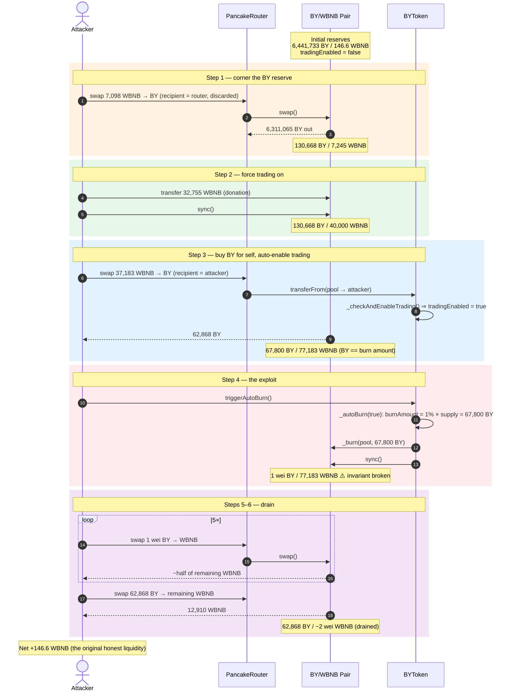
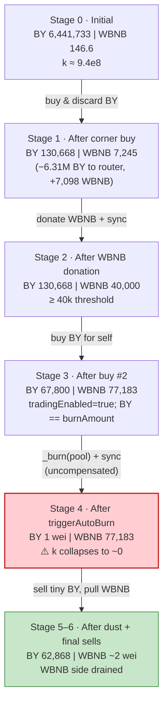
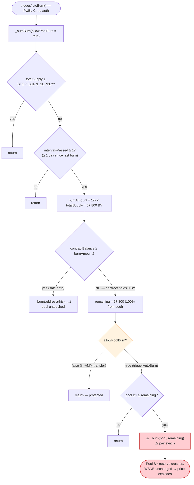
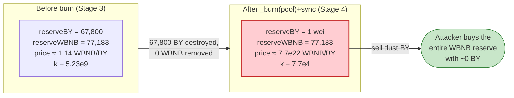

# BY Token Exploit — Permissionless `triggerAutoBurn()` Pool-Reserve Drain

> **Reproduction:** the PoC compiles & runs in an isolated Foundry project at
> [this project folder](.) (the main DeFiHackLabs repo
> contains several unrelated PoCs that do not compile, so this one was extracted).
> Full verbose trace: [BYToken_exp.output.txt](BYToken_exp.output.txt).
> Verified vulnerable source: [contracts_core_BYToken.sol](sources/contracts_core_BYToken.sol).

---

## Key info

| | |
|---|---|
| **Loss** | ~$87,402 — **146.60 WBNB** drained from the BY/WBNB PancakeSwap pair |
| **Vulnerable contract** | `BYToken` — [`0x6f50cffEcd4e00EcF7E442774C08c089450B62Ca`](https://bscscan.com/address/0x6f50cffEcd4e00EcF7E442774C08c089450B62Ca#code) |
| **Victim pool** | BY/WBNB pair — `0x1F358e18e0DB68FF33C2319C8DaD328eDF9B7059` |
| **Attacker EOA** | `0x047547A4fa4a67C1032d249B49EC1a79c0460BAD` |
| **Attacker contract** | `0xc08106a36BfA9CFad264F0d64fC45B93543485Ec` |
| **Attack tx** | `0xe31c681eee764fb94b1b6bda3bbb0e4f25acb129c19040b9f58ad30541980979` |
| **Chain / block / date** | BSC / 102,329,719 / June 4, 2026 |
| **Compiler** | Solidity v0.8.20, optimizer **1 run** |
| **Bug class** | Broken AMM invariant via a permissionless, un-compensated reserve burn |

---

## TL;DR

`BYToken` is a deflationary token whose `_autoBurn()` routine, when the token contract's own
balance is insufficient, **burns BY tokens directly out of the AMM pair's balance and then calls
`pair.sync()`** ([contracts_core_BYToken.sol:195-198](sources/contracts_core_BYToken.sol#L195-L198)).
This is an *un-compensated* removal of one side of the pool's reserves — it deletes BY from the
pair without any matching WBNB outflow, then forces the pair to accept the reduced balance as its
new reserve. That single operation **breaks the constant-product invariant `x·y = k`** in the
attacker's favor.

Crucially, this routine is reachable through the **permissionless** `triggerAutoBurn()`
([:209-211](sources/contracts_core_BYToken.sol#L209-L211)) — anyone
can call it, anytime the daily interval has elapsed.

The attacker:

1. **Corners** the pool's BY (buys 6.31M of 6.44M BY and throws it away to the router), shrinking
   the pool's BY reserve down to ≈ the *fixed* burn amount.
2. **Donates** WBNB to push the pool's WBNB reserve over the `40,000 WBNB` trading-enable threshold
   so trading auto-activates.
3. **Buys** 62,868 BY for itself, fine-tuning the pool to hold exactly the burn amount.
4. **Calls `triggerAutoBurn()`** — the 1%-of-supply burn (67,800 BY) wipes the pool's BY reserve
   from 67,800 → **1 wei** and `sync()`s it.
5. **Sells dust BY** into the now-degenerate pool — selling 1 wei of BY repeatedly each time pulls
   ~half of the WBNB reserve out, then a final sell empties it.

Net result: the attacker recovers every WBNB it injected **plus** the 146.60 WBNB of genuine
liquidity that real LPs had put in the pool. Profit = **146.60 WBNB**.

---

## Background — what BYToken does

`BYToken` ([source](sources/contracts_core_BYToken.sol)) is an
ERC20 with three "DeFi-ish" features bolted on:

- **Trading gate** — normal Pancake buys/sells revert until `tradingEnabled` flips to `true`. It
  flips automatically once the pool's BNB-side reserve reaches `TRADING_ENABLE_BNB_THRESHOLD`
  (`_checkAndEnableTrading`, [:216-227](sources/contracts_core_BYToken.sol#L216-L227)).
- **Profit sell-tax** — 30% tax on the *profitable* portion of a sell, using a per-user USD cost-basis
  ledger (`_transferWithTax`, [:232-300](sources/contracts_core_BYToken.sol#L232-L300)).
- **Automatic burn** — a daily deflation that burns `DAILY_BURN_RATE` (1%) of total supply, drawing
  first from the contract's own balance and then, if needed, **from the liquidity pool itself**
  (`_autoBurn`, [:168-204](sources/contracts_core_BYToken.sol#L168-L204)).

The on-chain parameters at the fork block (read via `cast`):

| Parameter | Value |
|---|---|
| `MAX_SUPPLY` / `totalSupply` | 6,780,000 BY (full — no prior burns) |
| `DAILY_BURN_RATE` | 100 bps = **1% per interval** |
| `BURN_INTERVAL` | 86,400 s = **1 day** |
| `STOP_BURN_SUPPLY` | 700,000 BY |
| `TRADING_ENABLE_BNB_THRESHOLD` | **40,000 WBNB** |
| `tradingEnabled` | **false** (attacker had to force-enable it) |
| **BY held by the token contract itself** | **0** |
| BY held by the pair (pool BY reserve) | 6,441,733 BY |
| WBNB held by the pair (pool WBNB reserve) | **146.60 WBNB** ← the prize |

That last pair of facts is the whole game: the daily burn is `1% × totalSupply = 67,800 BY`, the
contract holds **0** BY to satisfy it, so **100% of every burn is taken out of the pool**.

---

## The vulnerable code

### 1. The burn draws from the pool and `sync()`s

```solidity
function _autoBurn(bool allowPoolBurn) internal {
    if (totalSupply() <= STOP_BURN_SUPPLY) return;
    uint256 intervalsPassed = (block.timestamp - lastBurnTimestamp) / BURN_INTERVAL;
    if (intervalsPassed == 0) return;            // ← only timing gate
    if (intervalsPassed > 7) intervalsPassed = 7;

    uint256 burnRate   = DAILY_BURN_RATE * intervalsPassed;           // 100 * 1 = 100 bps
    if (burnRate > BURN_DENOMINATOR) burnRate = BURN_DENOMINATOR;
    uint256 burnAmount = (totalSupply() * burnRate) / BURN_DENOMINATOR; // 1% of 6.78M = 67,800
    uint256 maxBurnToStop = totalSupply() - STOP_BURN_SUPPLY;
    if (burnAmount > maxBurnToStop) burnAmount = maxBurnToStop;
    if (burnAmount == 0) return;

    uint256 contractBalance = balanceOf(address(this));               // == 0 here
    uint256 fromContract = burnAmount > contractBalance ? contractBalance : burnAmount; // 0
    uint256 remaining = burnAmount - fromContract;                    // 67,800
    if (remaining > 0) {
        if (!allowPoolBurn) return;
        if (balanceOf(pool) < remaining) return;
    }

    if (fromContract > 0) { _burn(address(this), fromContract); }
    if (remaining > 0) {
        _burn(pool, remaining);          // ⚠️ deletes BY from the pair's balance...
        IUniswapV2Pair(pool).sync();     // ⚠️ ...then forces it to be the new reserve
    }
    lastBurnTimestamp += intervalsPassed * BURN_INTERVAL;
    ...
}
```

### 2. It is reachable permissionlessly with `allowPoolBurn = true`

```solidity
function triggerAutoBurn() external {   // ← no access control, no nonReentrant scope on the math
    _autoBurn(true);                     // ← allowPoolBurn = true ⇒ pool burn permitted
}
```

The internal guard `_canAutoBurnPool()`
([:440-442](sources/contracts_core_BYToken.sol#L440-L442)) *does*
disable pool-burning when the burn is triggered as a side-effect of an AMM `transfer`/`transferFrom`
(to avoid breaking live swaps). But `triggerAutoBurn()` is a **separate public entry point that hard-codes
`allowPoolBurn = true`**, so that protection is entirely bypassed.

---

## Root cause — why it was possible

A Uniswap-V2/PancakeSwap pair prices assets purely from its reserves and enforces `x·y ≥ k` only
*inside `swap()`*. `sync()` exists to let the pair "skim" its balances to match reality — it trusts
that token balances only change through `mint`/`burn`/`swap`/transfers it can reason about.

`_autoBurn` violates that trust in the worst possible way:

> It **destroys** BY held by the pair (`_burn(pool, …)`) and then calls `pair.sync()`, telling the
> pair "your BY reserve is now this much smaller." No WBNB leaves the pair. The product `k` collapses,
> and the marginal price of BY explodes — **for free, callable by anyone.**

Concretely, the four design decisions that compose into a critical bug:

1. **Permissionless trigger.** `triggerAutoBurn()` has no `onlyRole`/keeper restriction, so the
   attacker chooses *when* the reserve-shrinking burn happens — i.e., right after they've positioned
   themselves to profit from it.
2. **Burning from the pool is a value transfer to BY holders.** Removing BY from the pair without
   removing WBNB shifts the entire WBNB side toward whoever still holds BY. The attacker makes sure
   *they* are essentially the only BY holder.
3. **The burn amount is fixed (1% of supply), independent of pool size,** and the contract held 0 BY,
   so the burn always falls 100% on the pool. The attacker only has to shrink the pool's BY reserve
   down to ≈ the burn amount and the burn **empties it to ~1 wei**.
4. **Trading can be force-enabled by donating WBNB.** `_checkAndEnableTrading` keys off the *current*
   pool reserve, which the attacker inflates with a direct WBNB transfer + `sync()`, so the gate is no
   obstacle.

The profit sell-tax — the one mechanism that might have clawed value back — **never fired**: the
attacker's cost-basis was recorded at the *inflated* price during its own buy, so
`_profitTaxTokenAmount` ([:396-408](sources/contracts_core_BYToken.sol#L396-L408))
saw "no profit" and returned 0. The trace contains zero `TaxExecuted` / `SellTaxDistributed` events.

---

## Preconditions

- `totalSupply() > STOP_BURN_SUPPLY` (6.78M > 0.7M ✓).
- At least one `BURN_INTERVAL` (1 day) has elapsed since `lastBurnTimestamp`, so `intervalsPassed ≥ 1`.
  In the live attack this was naturally true; the PoC reproduces it with
  `vm.warp(lastBurn + interval + 1)` ([BYToken_exp.sol:46-48](test/BYToken_exp.sol#L46-L48)).
- Working capital in WBNB to corner the pool and clear the 40,000-WBNB trading threshold. Peak outlay
  was **77,036.6 WBNB**; it is fully recovered intra-transaction, hence **flash-loanable** (the PoC
  simply `deal`s 422,497 WBNB as headroom).

---

## Attack walkthrough (with on-chain numbers from the trace)

The pair's `token0 = BY`, `token1 = WBNB`, so `reserve0 = BY`, `reserve1 = WBNB`.
All figures below are taken directly from the `Sync` events in
[BYToken_exp.output.txt](BYToken_exp.output.txt).

| # | Step | BY reserve | WBNB reserve | Effect |
|---|------|-----------:|-------------:|--------|
| 0 | **Initial** | 6,441,733 | 146.60 | Honest pool. |
| 1 | **Corner buy** — swap 7,098.44 WBNB → 6,311,065 BY, sent to the **router** (discarded) | 130,668 | 7,245.04 | Pool's BY shrunk ~98%; BY made scarce. |
| 2 | **Donate** 32,754.96 WBNB to the pair + `sync()` | 130,668 | 40,000.00 | WBNB reserve hits the 40k trading threshold. |
| 3 | **Buy #2** — swap 37,183.22 WBNB → 62,868 BY, sent to **attacker**; `_checkAndEnableTrading` flips `tradingEnabled = true` | 67,800 | 77,183.22 | Pool BY now == burn amount; attacker holds 62,868 BY. |
| 4 | **`triggerAutoBurn()`** — `_burn(pool, 67,800 BY)` + `sync()` | **1 wei** | 77,183.22 | **Invariant broken**: BY reserve annihilated, WBNB untouched. |
| 5a | sell **1 wei** BY → 38,543.31 WBNB | 2 wei | 38,639.91 | One wei drains ~half the WBNB. |
| 5b | sell 1 wei BY → 12,858.49 WBNB | 3 wei | 25,781.43 | |
| 5c | sell 1 wei BY → 6,433.26 WBNB | 4 wei | 19,348.16 | |
| 5d | sell 1 wei BY → 3,861.89 WBNB | 5 wei | 15,486.27 | |
| 5e | sell 1 wei BY → 2,575.67 WBNB | 6 wei | 12,910.61 | |
| 6 | **sell remaining 62,868 BY** → 12,910.61 WBNB | 62,868 | ~2 wei | Empties the WBNB side. |

**Why "1 wei drains half":** PancakeSwap's `getAmountOut` is
`out = (in·9975·reserveOut) / (reserveIn·10000 + in·9975)`. After the burn `reserveIn = 1 wei`, so for
`in = 1 wei`: `out = (9975·reserveOut)/(10000 + 9975) = (9975/19975)·reserveOut ≈ 0.4994·reserveOut`.
The fee-scaled input (9975) is comparable to the entire scaled reserve (10000), so a single wei buys
~half the pool. Each subsequent wei buys a smaller fraction as `reserveIn` ticks up to 2, 3, 4…

### Profit accounting (WBNB)

| Direction | Amount |
|---|---:|
| Spent — corner buy | 7,098.44 |
| Spent — donation | 32,754.96 |
| Spent — buy #2 | 37,183.22 |
| **Total spent** | **77,036.62** |
| Received — 5× dust sells | 64,272.62 |
| Received — final sell | 12,910.61 |
| **Total received** | **77,183.22** |
| **Net profit** | **+146.60** |

The profit equals the pool's **original 146.60 WBNB** to the wei — confirming the attacker simply
walked off with all the honest liquidity, recovering 100% of its own injected capital.

---

## Diagrams

### Sequence of the attack



### Pool state evolution



### The flaw inside `_autoBurn` / `triggerAutoBurn`



### Why the burn is theft: constant-product before vs. after



---

## Why each magic number

- **`BUY1` (corner buy → router):** sized so that, after the later buy, the pool's BY reserve lands on
  exactly the *fixed* burn amount (67,800 BY). The bought BY is discarded to the router because the
  attacker doesn't need it — the goal is only to shrink the pool's BY and pre-load it with WBNB.
- **`DONATE` (32,754.96 WBNB):** brings the pool's WBNB reserve to **exactly 40,000 WBNB**, the
  `TRADING_ENABLE_BNB_THRESHOLD`, so the next BY transfer auto-enables trading. A direct transfer +
  `sync()` is used (cheaper than a swap and pays no fee).
- **`BUY2` (37,183.22 WBNB → 62,868 BY):** simultaneously (a) trips `_checkAndEnableTrading`,
  (b) leaves the pool holding precisely `67,800 BY = burnAmount`, and (c) gives the attacker the BY it
  will dump in step 6.
- **The burn (67,800 BY = 1% of 6,780,000):** with the contract holding 0 BY, the entire amount is
  taken from the pool, which holds just `67,800 + 1` BY → pool BY reserve becomes **1 wei**.

---

## Remediation

1. **Never burn from the liquidity pool.** A burn must only ever destroy tokens the protocol *owns*
   (its own balance / a treasury). Removing `_burn(pool, …)` + `pair.sync()` eliminates the bug
   entirely. If "deflation reaching the pool" is a product requirement, implement it as the pool
   *donating* LP value (e.g., the protocol buys & burns from its own funds), not as a side-channel
   reserve deletion.
2. **Gate `triggerAutoBurn()`.** Restrict it to a trusted keeper/role, or at minimum make the
   pool-burn path unreachable from any externally-triggerable entry point (i.e., pass
   `allowPoolBurn = false` everywhere except an internal, swap-safe context).
3. **Don't let pool reserves drive trust decisions cheaply.** `_checkAndEnableTrading` keys off the
   instantaneous pool reserve, which is donation-manipulable. Use a TWAP/oracle, an admin switch, or a
   one-way latch that cannot be toggled by transient reserve inflation.
4. **Make `sync()`-after-burn impossible to weaponize.** If a token must adjust pool balances, route it
   through the pair's own `burn()` (LP redemption) so both reserves move together and `k` is preserved.
5. **Cap single-operation reserve impact.** Any operation that can move a pool reserve by more than a
   small percentage should revert; a 1%-of-supply burn that lands as ~100% of a thinned pool is a
   red flag.

---

## How to reproduce

The PoC was extracted into a standalone Foundry project (the umbrella DeFiHackLabs repo has several
unrelated PoCs that fail to compile under `forge test`'s whole-project build):

```bash
_shared/run_poc.sh 2026-06-BYToken_exp --mt testExploit -vvvvv
```

- RPC: a **BSC archive** endpoint is required (the fork block 102,329,718 is ~17 days old).
  `foundry.toml` uses `https://bsc-mainnet.public.blastapi.io`, which serves historical state at that
  block; most public BSC RPCs prune it and fail with `header not found` / `missing trie node`.
- Result: `[PASS] testExploit()` with `Profit WBNB: 146`.

Expected tail:

```
Ran 1 test for test/BYToken_exp.sol:BYTokenExploitTest
[PASS] testExploit() (gas: 767890)
  WBNB before: 422497
  WBNB after : 422643
  Profit WBNB: 146
```

---

*Reference: SlowMist Hacked — https://hacked.slowmist.io/ (BY, BSC, ~$87.4K).*
