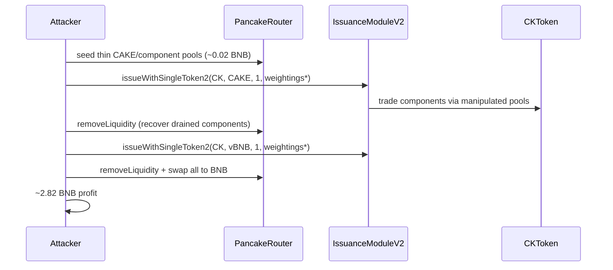

# Cook Finance Issuance — Caller-Chosen Weightings Drain CKToken Components via Thin Pancake Pools

> **Vulnerability classes:** vuln/oracle/price-manipulation · vuln/logic/incorrect-state-transition · vuln/defi/flash-loan-attack

> **Reproduction:** the PoC compiles & runs offline in an isolated Foundry project at
> [this project folder](.). Full verbose trace: [output.txt](output.txt).
> Verified vulnerable source:
> [IssuanceModuleV2.sol](sources/IssuanceModuleV2_7Db3CB/IssuanceModuleV2.sol) and
> [CKToken.sol](sources/CKToken_A4e9f6/CKToken.sol).

---

## Key info

| | |
|---|---|
| **Loss** | **~2.82 BNB** net profit to the attacker (`2816924852223933205` wei), extracted from a Cook Finance CKToken's component inventory |
| **Vulnerable contract** | `IssuanceModuleV2` — [`0x7Db3CBAf736C049933A3Af28dBeD4A4442aa89d0`](https://bscscan.com/address/0x7db3cbaf736c049933a3af28dbed4a4442aa89d0#code) |
| **Victim CKToken** | [`0xA4e9f6032ee717710D8Fd3dCE0367d283e16f50e`](https://bscscan.com/address/0xa4e9f6032ee717710d8fd3dce0367d283e16f50e) |
| **Attacker EOA** | [`0xEe18c4c2E123402731f43d680e75ca2809c30f8b`](https://bscscan.com/address/0xee18c4c2e123402731f43d680e75ca2809c30f8b) |
| **Attacker contract** | [`0xeFFcB496CaE89E7E92abe17d22386345707CEEe4`](https://bscscan.com/address/0xeffcb496cae89e7e92abe17d22386345707ceee4) |
| **Attack tx** | [`0x51e46828b7aabfa810910b3f8ca535053716e6bcb8b7f94a4ff59757d71a1bca`](https://bscscan.com/tx/0x51e46828b7aabfa810910b3f8ca535053716e6bcb8b7f94a4ff59757d71a1bca) |
| **Chain / block / date** | BSC / 106,740,999 / June 2026 |
| **Bug class** | Permissionless `issueWithSingleToken2` accepts attacker-chosen component **weightings** that size swaps of the CKToken's own inventory through a **Pancake V2 spot adapter with zero min-out**, so thin-pool seeding turns a 1-unit issue into a real component drain |

---

## TL;DR

1. Cook's `IssuanceModuleV2.issueWithSingleToken2` ([IssuanceModuleV2.sol:3124-3153](sources/IssuanceModuleV2_7Db3CB/IssuanceModuleV2.sol#L3124-L3153)) lets anyone mint a CKToken by supplying a single component token and a **caller-chosen** `_weightings[]` array.

2. Internally `_issueWithSpec` ([IssuanceModuleV2.sol:3365-3387](sources/IssuanceModuleV2_7Db3CB/IssuanceModuleV2.sol#L3365-L3387)) does:
   ```solidity
   _issueTokenAmountToUse = _issueTokenQuantity.preciseMul(_weightings[i]).sub(1);
   componentReceived = _tradeAndWrapComponents(...); // zero min-out on Pancake spot
   ```
   There is **no bound** that weightings sum to 1e18, and no TWAP/oracle on the swap path.

3. The attacker seeds thin CAKE/component and vBNB/component Pancake V2 pools with ~0.02 BNB, then calls `issueWithSingleToken2` twice with weightings that force the CKToken to trade nearly its entire CAKE (then vBNB) inventory through those pools at manipulated prices.

4. After each issue, the attacker removes the seeded LP (recovering the drained components), swaps everything to BNB, and keeps the surplus.

5. Reproduced profit: **2.8369 BNB** ending balance / **2.8169 BNB** net over the 0.02 BNB seed (`assertGt(..., 2.7 ether)`), [output.txt](output.txt).

---

## The vulnerable code

```solidity
// IssuanceModuleV2.sol — issueWithSingleToken2 + _issueWithSpec
function issueWithSingleToken2(
    ICKToken _ckToken,
    address _issueToken,
    uint256 _issueTokenQuantity,
    uint256 _minCkTokenRec,
    address[] memory _midTokens,
    uint256[] memory _weightings,  // attacker-controlled "percentages"
    address _to,
    bool _returnDust
) external nonReentrant onlyValidAndInitializedCK(_ckToken) { ... }

// weightings size the CKToken-side trades with no sum/cap check and no min-out
uint256 _issueTokenAmountToUse = _issueTokenQuantity.preciseMul(_weightings[i]).sub(1);
componentReceived = _tradeAndWrapComponents(_ckToken, _issueToken, _issueTokenAmountToUse, ...);
```

**Root cause:** untrusted weightings + spot DEX adapter + zero minimum output = permissionless NAV/inventory extraction against any CKToken that holds real component balances.

---

## Attack flow



---

## Recommendation

1. Cap and normalize weightings so they sum to exactly `1e18` (or use a fixed pro-rata schedule the issuer cannot override).
2. Require non-zero `minAmountOut` on every external swap, priced against a TWAP/oracle rather than spot.
3. Do not allow a single-token issue path to **sell** other components of the set — issue should only **buy** missing components up to the mint amount.
4. Add a max issue-size / max inventory-delta guard so one call cannot move nearly 100% of a component balance.

---

## References

- Attack tx: https://bscscan.com/tx/0x51e46828b7aabfa810910b3f8ca535053716e6bcb8b7f94a4ff59757d71a1bca
- Analysis: https://x.com/DefimonAlerts/status/2071497001443770684
- Upstream PoC: DeFiHackLabs `src/test/2026-06/CookFinanceIssuance_exp.sol`
