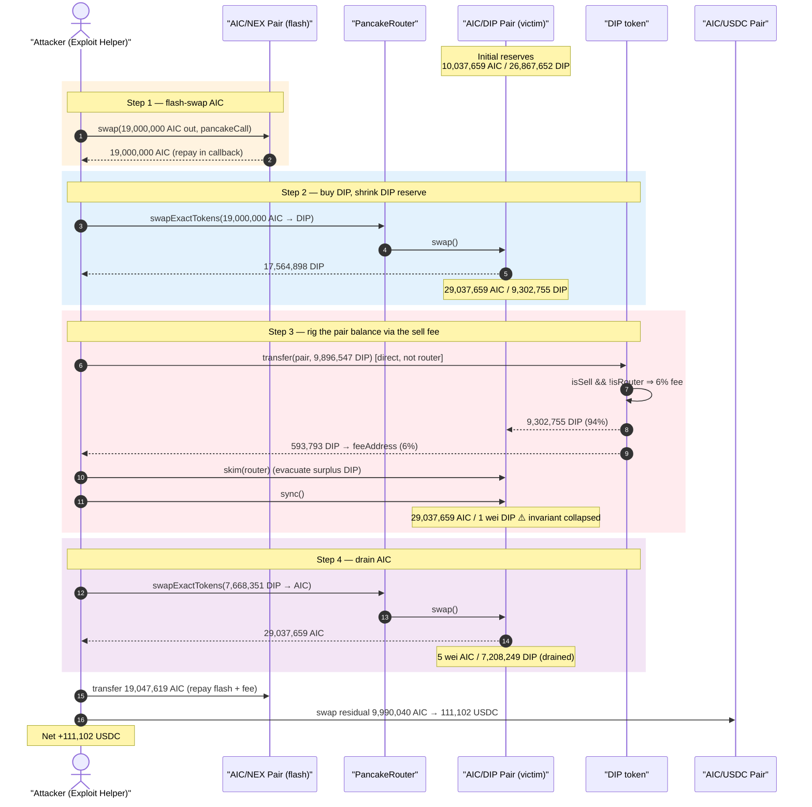
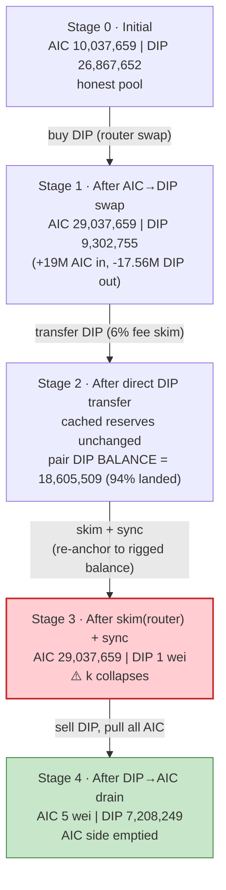
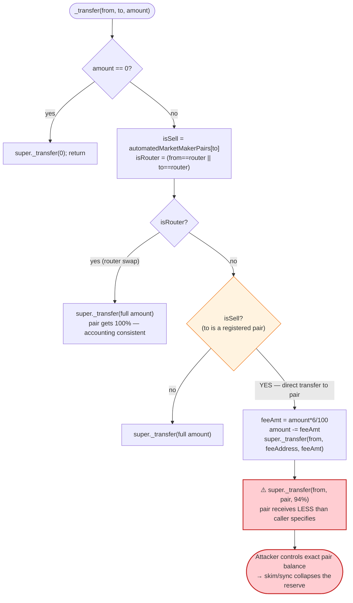
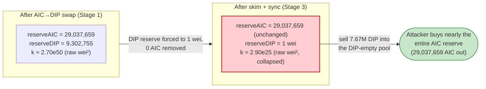

# DIP Exploit — Fee-on-Sell Transfer + `skim`/`sync` Reserve-Collapse on the DIP/AIC Pair

> **Reproduction:** the PoC compiles & runs in an isolated Foundry project at
> [this project folder](.). Full verbose trace: [output.txt](output.txt).
> Verified vulnerable source: [contracts_flatten_nexus_dip.sol](sources/DIP_6C60bf/contracts_flatten_nexus_dip.sol).

---

## Key info

| | |
|---|---|
| **Loss** | ~**111,097.59 USDC** (PoC header); the trace asserts **111,102.04 USDC** profit drained from the AIC/USDC routing pair, sourced from the AIC/DIP pair's liquidity ([output.txt:8](output.txt), [output.txt:258](output.txt)) |
| **Vulnerable contract** | `DIP` token — [`0x6C60bf5DB0670ae94489d3DdE2c60f271625dB50`](https://bscscan.com/address/0x6c60bf5db0670ae94489d3dde2c60f271625db50#code) (fee-on-sell `_transfer` override) |
| **Victim pool** | AIC/DIP PancakeV2 pair — [`0xF7D8267D01D1104Da2Dd30828aA9C0E1647919ef`](https://bscscan.com/address/0xF7D8267D01D1104Da2Dd30828aA9C0E1647919ef) |
| **Flash-loan source** | AIC/NEX PancakeV2 pair — [`0xF8331a897C5F32B57EAb394af8ADF0D00003CAE1`](https://bscscan.com/address/0xF8331a897C5F32B57EAb394af8ADF0D00003CAE1) (`swap` flash callback) |
| **Attacker EOA** | [`0x0d4024Cd27538350a911D9B7eE90811fa4875ba3`](https://bscscan.com/address/0x0d4024cd27538350a911d9b7ee90811fa4875ba3) |
| **Attacker contract** | [`0xddef10a85a5c67a9af8398d297aa51f8716383c7`](https://bscscan.com/address/0xddef10a85a5c67a9af8398d297aa51f8716383c7) (open-source) |
| **Attack tx** | [`0x1c09395848a87069c9d6ddbe5adc6249510aba7a2a83479a74b4280cafb5fb29`](https://bscscan.com/tx/0x1c09395848a87069c9d6ddbe5adc6249510aba7a2a83479a74b4280cafb5fb29) |
| **Chain / block / date** | BSC / fork block 104,598,278 / June 2026 |
| **Compiler / optimizer** | Solidity v0.8.18+commit.87f61d96, optimizer **enabled**, **200 runs** (from [_meta.json](sources/DIP_6C60bf/_meta.json)) |
| **Bug class** | Fee-on-transfer token whose sell fee, combined with a permissionless `skim`/`sync`, lets an attacker collapse the pair's DIP reserve to **1 wei** and buy out its entire AIC reserve |

---

## TL;DR

1. `DIP` is a PancakeSwap-traded ERC20 with a custom `_transfer` override
   ([contracts_flatten_nexus_dip.sol:1702-1732](sources/DIP_6C60bf/contracts_flatten_nexus_dip.sol#L1702-L1732))
   that charges a **6% sell fee** (`sellFee = 6`) on any transfer whose destination is a registered
   AMM pair — *unless* the router is the sender or recipient, in which case the transfer passes through
   un-taxed.

2. The attacker takes a **flash swap of 19,000,000 AIC** from the AIC/NEX pair
   ([output.txt:55](output.txt)) and swaps it through the **AIC/DIP** pair for **17,564,897.9 DIP**
   ([output.txt:97](output.txt)), shrinking the pair's DIP reserve to **9,302,754.6 DIP**
   ([output.txt:96](output.txt)).

3. The attacker then does a **direct `transfer`** of **9,896,547.4 DIP** into the AIC/DIP pair
   ([output.txt:108](output.txt)). Because this transfer is *not* router-mediated and the recipient
   *is* a pair, the 6% sell fee fires: **593,792.8 DIP** is siphoned to the fee address and only
   **9,302,754.6 DIP (94%)** actually lands in the pair ([output.txt:109-110](output.txt)). The input
   was pre-sized so the net deposit equals (reserve − 1 wei).

4. The attacker calls **`skim(router)`** then **`sync()`** on the pair
   ([output.txt:116-140](output.txt)). `skim` pushes the pair's surplus DIP out to the router and the
   subsequent `sync()` re-reads the pair balance — leaving the cached DIP reserve at **exactly 1 wei**
   ([output.txt:137](output.txt)) while the AIC reserve (29,037,659 AIC) is untouched. The
   constant-product invariant is now degenerate.

5. The attacker swaps its remaining **7,668,350.5 DIP** into the AIC-rich, DIP-empty pair
   ([output.txt:148](output.txt)) and pulls out **29,037,659 AIC** ([output.txt:177](output.txt)) —
   essentially the pair's entire AIC reserve, for almost no DIP.

6. The attacker repays the AIC flash swap (**19,047,619 AIC**, the 0.25%-fee-grossed amount,
   [output.txt:184](output.txt)) and routes the residual **9,990,039.95 AIC**
   ([output.txt:202](output.txt)) through the AIC/USDC pair, netting the sender
   **111,102.04 USDC** profit ([output.txt:258](output.txt)).

---

## Background — what DIP does

`DIP` ([source](sources/DIP_6C60bf/contracts_flatten_nexus_dip.sol)) is a 1,000,000,000-supply
18-decimal ERC20 (minted in the constructor,
[:1672-1673](sources/DIP_6C60bf/contracts_flatten_nexus_dip.sol#L1672-L1673)) deployed in the
"nexus" product family alongside `AIC`. Its single piece of non-standard logic is a **sell tax**:

- It registers its PancakeSwap **AIC pair** as an automated-market-maker pair at construction
  ([:1665-1667](sources/DIP_6C60bf/contracts_flatten_nexus_dip.sol#L1665-L1667)).
- Its overridden `_transfer` ([:1702-1732](sources/DIP_6C60bf/contracts_flatten_nexus_dip.sol#L1702-L1732))
  applies `sellFee = 6` (6%) to "sell" transfers — i.e. transfers whose `to` is a registered pair —
  routing the fee to `feeAddress` and forwarding only the remainder to the pair.
- The fee is **skipped entirely** when the router is involved (`from == router || to == router`),
  so ordinary Pancake swaps via the router path are *not* taxed inside `_transfer`.

The owner can tune the fee with `setFee` (capped at 50%,
[:1692-1695](sources/DIP_6C60bf/contracts_flatten_nexus_dip.sol#L1692-L1695)) and the recipient with
`setFeeAddress` ([:1697-1700](sources/DIP_6C60bf/contracts_flatten_nexus_dip.sol#L1697-L1700)).

On-chain parameters at the fork block (read from the trace):

| Parameter | Value | Source |
|---|---|---|
| `sellFee` | **6** (= 6%) | [:1651](sources/DIP_6C60bf/contracts_flatten_nexus_dip.sol#L1651) |
| `feeAddress` (observed) | `0x4D202ddD3d7960e99D3d457caE7eBfEa04D45359` | [output.txt:109](output.txt) |
| AIC/DIP pair `reserve0` (AIC) before swap | 10,037,659,001,700,876,485,423,256 (~10,037,659 AIC) | [output.txt:82](output.txt) |
| AIC/DIP pair `reserve1` (DIP) before swap | 26,867,652,484,527,719,810,575,915 (~26,867,652 DIP) | [output.txt:82](output.txt) |
| PancakeSwap swap fee | 0.25% (`9975/10000`) | PoC constants ([test/DIP_exp.sol:86-87](test/DIP_exp.sol#L86-L87)) |

The AIC/DIP pair's `token0 = AIC`, `token1 = DIP`, so `reserve0 = AIC`, `reserve1 = DIP`
(consistent with the `getReserves` ordering at [output.txt:82](output.txt) and
[output.txt:162](output.txt)).

---

## The vulnerable code

### 1. The fee-on-sell `_transfer` override

```solidity
function _transfer(
    address from,
    address to,
    uint256 amount
) internal override {
    require(from != address(0), "ERC20: transfer from the zero address");
    require(to != address(0), "ERC20: transfer to the zero address");

    if(amount == 0) {
        super._transfer(from, to, 0);
        return;
    }

    bool isSell = automatedMarketMakerPairs[to];
    bool isRouter = (from == uniswapV2Router || to == uniswapV2Router);

    if (isRouter){
        super._transfer(from, to, amount);
    } else if (isSell){
        uint256 feeAmt = amount.mul(sellFee).div(100);   // 6% of the transferred amount
        amount = amount.sub(feeAmt);

        // to fee address
        if (feeAmt > 0){
            super._transfer(from, feeAddress, feeAmt);    // 6% diverted to feeAddress
        }
    }

    super._transfer(from, to, amount);                    // only 94% reaches the pair
}
```
([contracts_flatten_nexus_dip.sol:1702-1732](sources/DIP_6C60bf/contracts_flatten_nexus_dip.sol#L1702-L1732))

The bug is the **asymmetry between the router path and the direct-transfer path**. When DIP is sold
through PancakeSwap's router, `isRouter` is true and the pair receives the *full* amount the AMM
expects — so the pool's reserve accounting stays consistent. But when DIP is transferred **directly to
the pair** (no router in the call), `isSell` is true and `isRouter` is false: the pair receives only
**94%** of the stated amount, while 6% silently leaves to `feeAddress`. The pair's *balance* therefore
diverges from any amount an external caller "thinks" it deposited, and that divergence is fully under
the attacker's control because they choose `amount`.

### 2. The pair is registered as an AMM pair at construction

```solidity
constructor(address _router, address _tokenAic) ERC20("DIP", "DIP") {
    tokenAic = _tokenAic;
    uniswapV2Router = _router;

    // Create uniswap pair
    uniswapV2PairAic = IUniswapV2Factory(IUniswapV2Router02(uniswapV2Router).factory())
        .createPair(address(this), tokenAic);

    _setAutomatedMarketMakerPair(address(uniswapV2PairAic), true);   // ← the AIC/DIP pair is taxed-on-receipt

    devWallet = _msgSender();
    uint8 _decimals = 18;
    _mint(owner(), 1_000_000_000 * 10 ** _decimals);
}
```
([contracts_flatten_nexus_dip.sol:1660-1674](sources/DIP_6C60bf/contracts_flatten_nexus_dip.sol#L1660-L1674))

Because the live AIC/DIP pair is flagged `automatedMarketMakerPairs[pair] = true`, *every* non-router
transfer into it (such as the attacker's direct `transfer`) is short-changed by the 6% fee. The pair's
`skim()` / `sync()` then re-anchor its reserves to whatever balance happens to be present — which the
attacker has just rigged.

### 3. The underlying OpenZeppelin `_transfer` it forwards to

```solidity
function _transfer(address from, address to, uint256 amount) internal virtual {
    require(from != address(0), "ERC20: transfer from the zero address");
    require(to != address(0), "ERC20: transfer to the zero address");
    _beforeTokenTransfer(from, to, amount);
    uint256 fromBalance = _balances[from];
    require(fromBalance >= amount, "ERC20: transfer amount exceeds balance");
    unchecked {
        _balances[from] = fromBalance - amount;
        _balances[to] += amount;
    }
    emit Transfer(from, to, amount);
    _afterTokenTransfer(from, to, amount);
}
```
([contracts_flatten_nexus_dip.sol:451-469](sources/DIP_6C60bf/contracts_flatten_nexus_dip.sol#L451-L469))

`super._transfer` is the stock OZ implementation: it moves real balances and emits a `Transfer`. The
two `super._transfer` calls in the override produce the two `Transfer` events the trace shows for the
attacker's direct deposit — one to `feeAddress` for 6% and one to the pair for 94%
([output.txt:109-110](output.txt)).

---

## Root cause — why it was possible

A Uniswap-V2/PancakeSwap pair derives prices purely from its cached `reserve0/reserve1`, which it
re-anchors to the actual token balances during `skim()` and `sync()`. Those functions are
**permissionless** and assume the pair's token balances move only through deposits/withdrawals it can
reason about. A fee-on-transfer token breaks that assumption when the fee path is reachable on the
*deposit* side.

`DIP._transfer` makes the deposit side controllable:

1. **The sell fee fires on direct transfers into the pair, not just router sells.** The branch order is
   `isRouter` → else `isSell`. A direct `transfer(pair, amount)` is `isSell && !isRouter`, so 6% is
   skimmed off before the tokens land. The attacker therefore controls the *exact* DIP balance the pair
   ends up holding by choosing `amount` (the PoC computes
   `dipInput = (reserve − 1) * 100 / (100 − 6)` so that after the haircut the pair holds `reserve − 1`,
   [test/DIP_exp.sol:117-119](test/DIP_exp.sol#L117-L119)).

2. **`skim` + `sync` then weaponize that controlled balance.** `skim(router)` evacuates the pair's
   surplus DIP to the router and `sync()` re-reads the residual balance as the new reserve. In this
   trace the combination drives the pair's DIP reserve to **1 wei** while leaving the AIC reserve at
   29,037,659 AIC ([output.txt:137](output.txt)). The constant-product `k` collapses by ~25 orders of
   magnitude, so a tiny DIP input now buys essentially the whole AIC reserve.

3. **All of it is flash-loanable and atomic.** The attacker needs no capital of its own: it flash-swaps
   AIC from the AIC/NEX pair, runs the manipulation, drains the AIC/DIP pair, repays the flash swap, and
   converts the surplus to USDC — all inside one `pancakeCall`
   ([test/DIP_exp.sol:97-127](test/DIP_exp.sol#L97-L127)).

The single design decision that composes into the loss is the **un-symmetric fee path**: a fee that is
charged on tokens *arriving* at the pair, combined with a pair that trustingly re-syncs to its raw
balance, lets an attacker make the pool quote a price it should never quote.

---

## Preconditions

- **DIP must register the live AIC/DIP pair as an `automatedMarketMakerPair`** so that direct transfers
  into it are taxed. This is true by construction
  ([:1665-1667](sources/DIP_6C60bf/contracts_flatten_nexus_dip.sol#L1665-L1667)).
- **`sellFee > 0`** so the direct deposit is short-changed (here `sellFee = 6`,
  [:1651](sources/DIP_6C60bf/contracts_flatten_nexus_dip.sol#L1651)).
- **A flash-loan source for AIC.** The AIC/NEX pair's `swap()` supplies 19,000,000 AIC against a
  `pancakeCall` callback ([output.txt:55](output.txt), [test/DIP_exp.sol:99](test/DIP_exp.sol#L99));
  fully repaid intra-transaction, so no working capital is required.
- **`skim`/`sync` are permissionless on the pair** (standard PancakeV2 behavior), letting anyone
  re-anchor reserves after rigging the balance.

---

## Attack walkthrough (with on-chain numbers from the trace)

The AIC/DIP pair has `token0 = AIC` (`reserve0`) and `token1 = DIP` (`reserve1`). All figures are taken
directly from the `Swap` / `Sync` / `Transfer` events, `getReserves` returns, and `balanceOf` static
calls in [output.txt](output.txt). Amounts are raw 18-decimal wei; human approximations in parentheses.

| # | Step | AIC reserve (r0) | DIP reserve (r1) | Effect |
|---|------|-----------------:|-----------------:|--------|
| 0 | **Initial** AIC/DIP pair (getReserves @ [output.txt:82](output.txt)) | 10,037,659,001,700,876,485,423,256 (~10,037,659) | 26,867,652,484,527,719,810,575,915 (~26,867,652) | Honest pool. |
| 1 | **Flash swap** 19,000,000 AIC borrowed from AIC/NEX pair ([output.txt:55-57](output.txt)) | — | — | Attacker holds 19,000,000 AIC, owes ~19,047,619 AIC back. |
| 2 | **Swap AIC→DIP** via router: 19,000,000 AIC in → 17,564,897,925,642,142,489,089,334 (~17,564,898) DIP out ([output.txt:97](output.txt)); Sync @ [output.txt:96](output.txt) | 29,037,659,001,700,876,485,423,256 (~29,037,659) | 9,302,754,558,885,577,321,486,581 (~9,302,755) | Pair loaded with AIC; DIP reserve shrunk ~65%. |
| 3 | **Direct `transfer`** 9,896,547,403,069,763,107,964,446 (~9,896,547) DIP to the pair ([output.txt:108](output.txt)); 6% fee 593,792,844,184,185,786,477,866 (~593,793) → feeAddress ([output.txt:109](output.txt)); 9,302,754,558,885,577,321,486,580 (~9,302,755, 94%) → pair ([output.txt:110](output.txt)) | 29,037,659 (cached, unchanged) | 9,302,755 (cached, unchanged) | Pair *balance* now 18,605,509,117,771,154,642,973,161 (~18,605,509) DIP ([output.txt:123](output.txt)); reserves not yet updated. |
| 4 | **`skim(router)`** evacuates surplus DIP to router (DIP transfer 9,302,754,558,885,577,321,486,580, [output.txt:124-125](output.txt)); AIC surplus = 0 ([output.txt:119-120](output.txt)) | 29,037,659 (cached) | 9,302,755 (cached) | Pair DIP balance drops toward dust. |
| 5 | **`sync()`** re-anchors reserves to the residual balance ([output.txt:132-137](output.txt)); pair DIP balance read = **1** ([output.txt:136](output.txt)) | 29,037,659,001,700,876,485,423,256 (~29,037,659) | **1 wei** | **Invariant collapsed**: DIP reserve = 1, AIC reserve full. |
| 6 | **Swap DIP→AIC** via router: 7,668,350,522,572,379,381,124,888 (~7,668,351) DIP in (net 7,208,249,491,218,036,618,257,395 after 6% fee, [output.txt:152](output.txt)) → 29,037,659,001,700,876,485,423,251 (~29,037,659) AIC out ([output.txt:177](output.txt)); Sync @ [output.txt:176](output.txt) | **5 wei** | 7,208,249,491,218,036,618,257,396 (~7,208,249) | AIC side drained to dust. |
| 7 | **Repay flash swap**: transfer 19,047,619,047,619,047,619,047,620 (~19,047,619) AIC back to AIC/NEX pair ([output.txt:184](output.txt)) | — | — | Flash loan (19,000,000 AIC + 0.25% fee + 1 wei) repaid. |
| 8 | **Convert residual AIC→USDC**: 9,990,039,954,081,828,866,375,631 (~9,990,040) AIC in ([output.txt:209](output.txt)) → 111,102,040,333,740,421,272,058 (~111,102) USDC out to attacker ([output.txt:242](output.txt)) | — | — | Profit realized in USDC. |

After step 5, the pair holds 29,037,659 AIC against a 1-wei DIP reserve, so the marginal price of DIP
is astronomically high — a few million DIP buys out the entire AIC reserve. The attacker keeps the AIC
left over after repaying the flash swap (~9,990,040 AIC) and sells it for USDC.

### Profit / loss accounting (USDC, raw wei)

| Item | Amount (wei) | ~Human |
|---|---:|---:|
| Attacker USDC before exploit | 0 | 0 ([output.txt:7](output.txt)) |
| Attacker USDC after exploit | 111,102,040,333,740,421,272,058 | ~111,102.04 ([output.txt:8](output.txt)) |
| **Net profit (asserted in PoC `assertGt` > 100,000 ether)** | **111,102,040,333,740,421,272,058** | **~111,102.04** ([output.txt:258-259](output.txt)) |
| PoC `@KeyInfo` headline loss | — | **~111,097.59 USDC** ([test/DIP_exp.sol:6](test/DIP_exp.sol#L6)) |

The two figures differ slightly: the PoC `@KeyInfo` header records the *real on-chain* loss
(~111,097.59 USDC), while this local fork reproduction realizes ~111,102.04 USDC against the pinned
state at block 104,598,278. The PoC asserts only that the profit exceeds `100,000 ether`
([test/DIP_exp.sol:80](test/DIP_exp.sol#L80)), which it does.

---

## Diagrams

### Sequence of the attack



### Pool state evolution (AIC/DIP pair)



### The flaw inside `DIP._transfer`



### Why it is theft: constant-product before vs. after `skim`/`sync`



---

## Why each magic number

- **`FLASH_AIC_AMOUNT = 19,000,000 ether`** ([test/DIP_exp.sol:85](test/DIP_exp.sol#L85)): the AIC
  flash-swapped from the AIC/NEX pair. Sized large enough that the AIC→DIP swap (step 2) meaningfully
  shrinks the DIP reserve and loads the pair with AIC, so the later DIP→AIC drain returns a large AIC
  surplus. Fully repaid intra-tx.
- **`PANCAKE_FEE_DENOMINATOR = 10_000`, `PANCAKE_FEE_ADJUSTED = 9_975`**
  ([test/DIP_exp.sol:86-87](test/DIP_exp.sol#L86-L87)): PancakeSwap's 0.25% swap fee. Used to gross up
  the flash-loan repayment: `flashRepayment = amount0 * 10000 / 9975 + 1 = 19,047,619,047,619,047,619,047,620`
  AIC ([test/DIP_exp.sol:125](test/DIP_exp.sol#L125), [output.txt:184](output.txt)) — the borrowed
  19,000,000 AIC plus the pair's fee, plus 1 wei to cover rounding.
- **`DIP_SELL_FEE = 6`, `DIP_FEE_DENOMINATOR = 100`**
  ([test/DIP_exp.sol:88-89](test/DIP_exp.sol#L88-L89)): mirror DIP's on-chain `sellFee = 6`. The PoC
  inverts the fee to size the direct deposit so that exactly `(pairBalance − 1)` DIP lands in the pair:
  `dipInput = (dipPairBalance − 1) * 100 / (100 − 6)`
  ([test/DIP_exp.sol:117-118](test/DIP_exp.sol#L117-L118)). Subtracting 1 keeps the post-skim/sync DIP
  reserve nonzero (1 wei) so the router can still quote the next swap
  ([test/DIP_exp.sol:116](test/DIP_exp.sol#L116)).
- **`skim(PANCAKE_ROUTER)` then `sync()`** ([test/DIP_exp.sol:120-121](test/DIP_exp.sol#L120-L121)):
  `skim` evacuates the pair's surplus DIP balance to a throwaway recipient (the router), and `sync`
  re-anchors the cached reserve to the residual balance — driving `reserve1` (DIP) to 1 wei
  ([output.txt:137](output.txt)).

---

## Remediation

1. **Do not charge a fee on tokens *arriving* at a pair via a non-router path while exempting the router
   path.** The asymmetry between `isRouter` (full amount) and `isSell` (94% amount) is what lets an
   attacker make the pair hold an arbitrary balance. Either tax both paths identically, or — preferably
   — never alter the amount delivered to an AMM pair, because the pair's reserve math assumes the full
   amount arrives.
2. **Avoid fee-on-transfer semantics on a token paired in a constant-product AMM**, or use an explicit
   fee-exclusion list that includes the pair itself for *inbound* transfers, so deposits reconcile with
   reserves.
3. **Do not let `skim`/`sync` be weaponizable.** A token whose transfers can be made to under-deliver to
   the pair turns the pair's permissionless re-sync into an attacker primitive. If a fee must exist,
   account for it inside a fee-aware pair (one that recomputes `k` on *received* amounts), not a vanilla
   PancakeV2 pair.
4. **Cap single-operation reserve impact.** Any operation that can move a reserve by more than a small
   percentage of its value (here, from 9.3M DIP to 1 wei) should be impossible without a matched
   counter-side movement. A pool whose DIP reserve can be driven to 1 wei while the AIC side is
   untouched should never quote a swap.
5. **Price trust decisions off a TWAP/oracle, not raw spot reserves**, so a single-transaction reserve
   collapse cannot be monetized at the manipulated spot price.

The combination of fixes (1) and (3) is sufficient on its own: if the pair always receives exactly the
amount the AMM expects, the attacker can no longer use `skim`/`sync` to desync the reserve.

---

## How to reproduce

The PoC runs **offline** against a local anvil fork served from the checked-in `anvil_state.json`; the
test's `createSelectFork` points at a local anvil port (`http://127.0.0.1:8546`) pinned to block
104,598,278 ([test/DIP_exp.sol:56-57](test/DIP_exp.sol#L56-L57)). The shared harness boots anvil from
that state and runs the test:

```bash
_shared/run_poc.sh 2026-06-DIP_exp --mt testExploit -vvvvv
```

- Chain: **BSC** (chainId 56) — explorer links resolve to bscscan.com.
- EVM: `foundry.toml` sets `evm_version = 'cancun'` ([foundry.toml:6](foundry.toml#L6)); the harness
  serves historical state from the local `anvil_state.json`, so no public archive RPC is required.
- Result: `[PASS] testExploit()` with `USDC profit: 111102.040333740421272058`.

Expected tail (from [output.txt:3-8](output.txt) and [output.txt:276](output.txt)):

```
Ran 1 test for test/DIP_exp.sol:ContractTest
[PASS] testExploit() (gas: 1388201)
Logs:
  Attacker Before exploit USDC Balance: 0.000000000000000000
  USDC profit: 111102.040333740421272058
  Attacker After exploit USDC Balance: 111102.040333740421272058

Suite result: ok. 1 passed; 0 failed; 0 skipped; finished in 14.92s (13.62s CPU time)
```

---

*Reference: TenArmor alert — https://x.com/TenArmorAlert/status/2067059314519417163 (DIP, BSC, ~$111K).*
