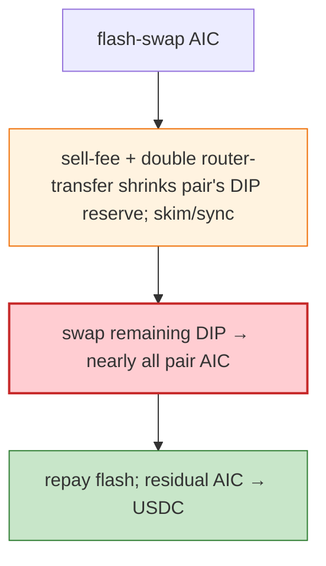

# DIP Exploit — Sell-Fee + Double Router-Transfer Bug Shrinks DIP Reserve (skim/sync)

> **Reproduction:** the PoC compiles & runs in an isolated Foundry project at
> [this project folder](.). Full verbose trace: [output.txt](output.txt).

---

## Key info

| | |
|---|---|
| **Loss** | AIC drained (BSC); tx `0x1c093958…`; attacker `0x0d4024Cd…` |
| **Vulnerable contract** | DIP token `0x6C60bf5D…` (sell-fee + double router-transfer bug); DIP/AIC pair |
| **Flash source** | AIC flash swap |
| **Chain / block / date** | BSC / Jun 2026 |
| **Bug class** | Token sell-fee + router double-transfer — the sell fee plus a double-transfer in the router path shrinks the pair's DIP reserve; `skim`/`sync` locks the skewed state, letting the attacker swap DIP for nearly all the pair's AIC. |

---

## TL;DR

Per the embedded analysis: the attacker flash-swapped AIC, used DIP's **sell fee plus a double
router-transfer bug** to shrink the DIP/AIC pair's DIP reserve via `skim`/`sync`, swapped the remaining
DIP for nearly all pair AIC, repaid the flash swap, and swapped residual AIC into USDC for the sender.

---

## Root cause

A **sell-fee + double router-transfer interaction** that mutates the pair's DIP reserve out-of-band;
`skim`/`sync` then accept the reduced reserve, making DIP hyper-scarce in the pair.

---

## Diagrams



---

## Remediation

1. Fix the double router-transfer; ensure pair balances reconcile with reserves.
2. Fee-aware pair; `k` on received amounts.

---

## How to reproduce

```bash
_shared/run_poc.sh 2026-06-DIP_exp -vvvvv
```

- RPC: BSC archive. Result: `[PASS]` — AIC drained via reserve-shrink + skim/sync.

---

*Reference: DIP sell-fee + double-transfer reserve shrink, BSC, Jun 2026.*
