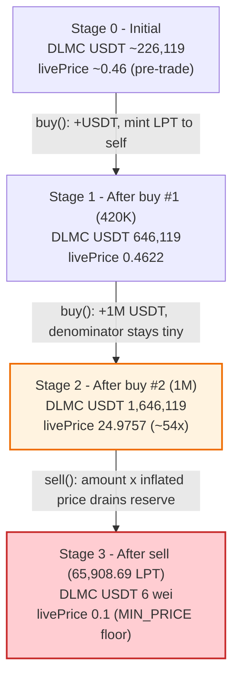
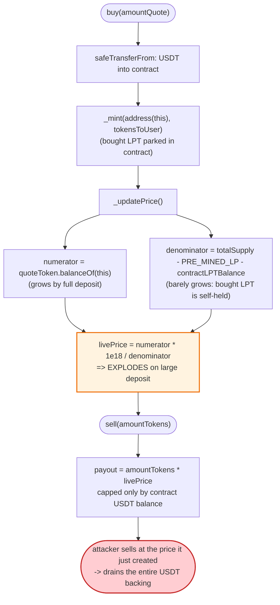
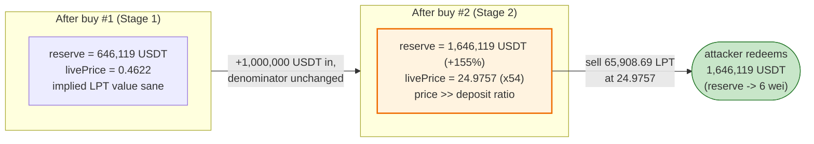

# DLMC Exploit — Reserve-Derived `livePrice` Self-Inflation Drains the Token's Own USDT Backing

> **Reproduction:** the PoC compiles & runs in an isolated Foundry project at
> [this project folder](.). The fork is served offline from the local
> `anvil_state.json` snapshot (the test's `createSelectFork` points at a
> `127.0.0.1` anvil port), so no public archive RPC is needed.
> Full verbose trace: [output.txt](output.txt).
> Verified vulnerable source (the deployed implementation at the fork block):
> [contracts_DLMCToken.sol](sources/DLMCToken_F2ca2A/contracts_DLMCToken.sol).

---

## Key info

| | |
|---|---|
| **Loss** | ~$222,560 — **222,560.22 USDT** drained from `DLMCToken`'s own USDT reserve ([output.txt:337](output.txt)); the contract's USDT balance ended at **6 wei** ([output.txt:341](output.txt)) |
| **Vulnerable contract** | `DLMCToken` — [`0xF2ca2A3572B26Ae7c479dC7ae36D922113B1bdF2`](https://bscscan.com/address/0xf2ca2a3572b26ae7c479dc7ae36d922113b1bdf2#code) |
| **Victim** | `DLMCToken` itself — it holds the buyers' USDT and prices its `LPT` token off its own USDT balance (it is **also** the "pool") |
| **Flash source** | Pancake USDT/WBNB pair — [`0x16b9a82891338f9bA80E2D6970FddA79D1eb0daE`](https://bscscan.com/address/0x16b9a82891338f9bA80E2D6970FddA79D1eb0daE) (USDT borrowed via `swap()` flash) |
| **Attacker EOA** | [`0x701bb7b460ae231dbbcfa3d87f0ab5b458429699`](https://bscscan.com/address/0x701bb7b460ae231dbbcfa3d87f0ab5b458429699) (profit receiver) |
| **Attack contract** | `0xe81bf6e392eca9ad594b5452ea53cf7071760a04` (the child `DLMCBuyHelper`); deployer `0x74c4a756933d0f713facb1dea325ef511646c3b1` |
| **Attack tx** | [`0x151025d3f0a782340a74d30ef33a5fad044b838e74437a803f0652e70c231306`](https://bscscan.com/tx/0x151025d3f0a782340a74d30ef33a5fad044b838e74437a803f0652e70c231306) |
| **Chain / block / date** | BSC (chainId 56) / fork block 106,091,606 / Jun 2026 |
| **Compiler** | Solidity `v0.8.31+commit.fd3a2265`, optimizer **enabled**, **50 runs**, non-proxy (from `_meta.json`) |
| **Bug class** | Self-referential / reserve-derived spot price (`livePrice`) manipulable in a single transaction; mint-to-self keeps circulating supply tiny so a large deposit inflates the price, which the same actor then sells against to drain the backing |

---

## TL;DR

1. `DLMCToken` is an MLM-style "investment" token. Users `buy()` LPT with USDT, which is kept inside the
   token contract, and later `sell()` LPT back for USDT. The redemption price is a single storage
   variable, `livePrice`, recomputed on every trade by `_updatePrice()`
   ([contracts_DLMCToken.sol:932-958](sources/DLMCToken_F2ca2A/contracts_DLMCToken.sol#L932-L958)).

2. `_updatePrice()` sets `livePrice = (USDT_reserve × 1e18) / circulatingSupply`, where
   `circulatingSupply = totalSupply − PRE_MINED_LP − contractLPTBalance`
   ([:939-949](sources/DLMCToken_F2ca2A/contracts_DLMCToken.sol#L939-L949)). The price is therefore
   derived from the contract's **own** spot USDT balance — exactly the manipulable-reserve anti-pattern.

3. The price is doubly fragile because `buy()` does `_mint(address(this), tokensToUser)`
   ([:419](sources/DLMCToken_F2ca2A/contracts_DLMCToken.sol#L419)): freshly bought LPT is parked in the
   contract, so `contractLPTBalance` grows in lockstep with `totalSupply` and the **circulating
   denominator stays tiny**. A big USDT deposit thus moves the numerator a lot and the denominator
   almost nothing, so `livePrice` explodes.

4. The attacker flash-borrows **1,420,000 USDT** from the Pancake USDT/WBNB pair
   ([test/DLMC_exp.sol:81](test/DLMC_exp.sol#L81), [output.txt:49](output.txt)) and registers into the
   affiliate tree under an already-registered referrer
   ([test/DLMC_exp.sol:110](test/DLMC_exp.sol#L110)).

5. **First buy (420,000 USDT)** from the coordinator nudges `livePrice` from its seed up to
   **0.4622 USDT/LPT** ([output.txt:92](output.txt)) and leaves DLMC holding **646,119.12 USDT**
   ([output.txt:91](output.txt)). **Second buy (1,000,000 USDT)** through a child helper pushes the
   reserve to **1,646,119.12 USDT** ([output.txt:203](output.txt)) and inflates `livePrice` to
   **24.9757 USDT/LPT** ([output.txt:204](output.txt)) — a ~54× jump.

6. The attacker now holds **73,560.39 LPT** (the referral bonus minted to it during the second buy,
   [output.txt:274](output.txt)) and computes a sell size equal to the contract's entire USDT backing
   divided by the inflated price: **65,908.69 LPT** ([output.txt:279](output.txt)).

7. `sell(65,908.69 LPT)` values the position at `amount × livePrice / 1e18 ≈ 1,646,119.12 USDT` and
   transfers out the contract's whole USDT balance, dropping DLMC's USDT to **6 wei**
   ([output.txt:290](output.txt)) and re-pricing `livePrice` down to the `MIN_PRICE` floor of `0.1`
   ([output.txt:291](output.txt)).

8. After repaying the Pancake flash (`1,420,000 × 10000/9975 + 1 = 1,423,558.90 USDT`,
   [test/DLMC_exp.sol:140](test/DLMC_exp.sol#L140), [output.txt:300](output.txt)), the attacker walks
   away with **222,560.221693222099016479 USDT** ([output.txt:307](output.txt), asserted
   `> 222,000 USDT` at [test/DLMC_exp.sol:71](test/DLMC_exp.sol#L71)).

---

## Background — what DLMC does

`DLMCToken` ([source](sources/DLMCToken_F2ca2A/contracts_DLMCToken.sol)) is a self-contained
"investment club" ERC20 (symbol LPT) with an affiliate/MLM reward tree. There is **no external AMM** for
the token — the contract *is* the market maker:

- **Buy** — a registered user calls `buy(amountQuote)`. The contract pulls `amountQuote` USDT in and
  keeps it; 15% (`BUY_PERCENT`) is skimmed for bonuses, and the buyer is credited
  `buyAmount × 1e18 / livePrice` LPT, **minted to the contract itself**
  ([:411-420](sources/DLMCToken_F2ca2A/contracts_DLMCToken.sol#L411-L420)).
- **Sell** — `sell(amountTokens)` burns the seller's LPT and pays out `amountTokens × livePrice / 1e18`
  USDT, but **only up to the contract's current USDT balance**
  ([:472-497](sources/DLMCToken_F2ca2A/contracts_DLMCToken.sol#L472-L497)), and only up to a per-user
  "4× of invested" cap.
- **Price** — `livePrice` is recomputed after every buy/sell by `_updatePrice()` from the contract's own
  USDT reserve and a "circulating supply" denominator
  ([:932-958](sources/DLMCToken_F2ca2A/contracts_DLMCToken.sol#L932-L958)).
- **Affiliate tree** — `registerAffiliate(referrer)` enrols a sender under an existing referrer; a buy
  pays referral/level/DAO/dev bonuses out of the 15% skim
  ([:446-453](sources/DLMCToken_F2ca2A/contracts_DLMCToken.sol#L446-L453)).

On-chain parameters (from source constants and the trace at fork block 106,091,606):

| Parameter | Value | Source |
|---|---|---|
| `PRE_MINED_LP` | 500,000 × 1e18 LPT | [:16](sources/DLMCToken_F2ca2A/contracts_DLMCToken.sol#L16) |
| `BUY_PERCENT` | 15 (% skimmed on buy) | [:168](sources/DLMCToken_F2ca2A/contracts_DLMCToken.sol#L168) |
| `MIN_PRICE` / `MAX_PRICE` | 0.1 USDT / 100,000 USDT (per LPT) | [:175-176](sources/DLMCToken_F2ca2A/contracts_DLMCToken.sol#L175-L176) |
| `MIN_INVESTMENT_FOR_INCOME` | 100 × 1e18 USDT | [:27](sources/DLMCToken_F2ca2A/contracts_DLMCToken.sol#L27) |
| `quoteToken` | USDT `0x55d398…7955` (18 decimals on BSC) | [output.txt:35](output.txt) |
| `daoUsdtBalance` | 0 (no DAO carve-out at fork) | [:266](sources/DLMCToken_F2ca2A/contracts_DLMCToken.sol#L266) |
| `livePrice` before attack | seed/last-trade price; first buy reports it as ~0.4622 USDT/LPT | [output.txt:92](output.txt) |
| DLMC USDT reserve after buy #1 | 646,119.118936329868440044 (~646,119) | [output.txt:91](output.txt) |
| DLMC USDT reserve after buy #2 | 1,646,119.118936329868440044 (~1,646,119) | [output.txt:203](output.txt) |
| `livePrice` after buy #2 | 24,975754129523010840 wei = ~24.9757 USDT/LPT | [output.txt:204](output.txt) |

The whole game is in two facts: the redemption price is read straight off the contract's spot USDT
balance, and the contract holds an enormous USDT reserve relative to the LPT that actually counts as
"circulating".

---

## The vulnerable code

### 1. `livePrice` is derived from the contract's own spot USDT reserve

```solidity
function _updatePrice() internal {
    uint256 usdtReserve = quoteToken.balanceOf(address(this));
    uint256 tradingReserve = usdtReserve > daoUsdtBalance
        ? usdtReserve - daoUsdtBalance
        : 0;
    uint256 reserve18 = _normalizeTo18(tradingReserve, quoteDecimals);

    uint256 total = totalSupply();
    uint256 circulatingSupply = total <= PRE_MINED_LP
        ? 1
        : total - PRE_MINED_LP;
    uint256 contractLPTBalance = balanceOf(address(this));
    if (circulatingSupply > contractLPTBalance) {
        circulatingSupply = circulatingSupply - contractLPTBalance;
    }
    if (circulatingSupply == 0) circulatingSupply = 1;

    uint256 newPrice = (reserve18 * 1e18) / circulatingSupply;
    if (newPrice < MIN_PRICE) newPrice = MIN_PRICE;
    if (newPrice > MAX_PRICE) newPrice = MAX_PRICE;
    ...
    livePrice = newPrice;
}
```
([contracts_DLMCToken.sol:932-957](sources/DLMCToken_F2ca2A/contracts_DLMCToken.sol#L932-L957))

`newPrice = reserve18 × 1e18 / circulatingSupply`. The numerator is the contract's instantaneous USDT
balance — fully attacker-controllable by depositing USDT through `buy()`. The denominator subtracts both
`PRE_MINED_LP` (500K) **and** the LPT the contract holds itself, which the next snippet shows is almost
all of the supply.

### 2. `buy()` mints the bought LPT to the contract, keeping the denominator tiny

```solidity
function buy(uint256 amountQuote) external nonReentrant {
    require(affiliates[msg.sender].isRegistered, "Must be registered to buy");
    require(amountQuote > 0, "Buy amount must be > 0");
    uint256 normalizedQuote = _normalizeTo18(amountQuote, quoteDecimals);
    ...
    quoteToken.safeTransferFrom(msg.sender, address(this), amountQuote);   // USDT in -> contract
    totalUSDTReceived += normalizedQuote;

    uint256 buyAmount = normalizedQuote - ((normalizedQuote * BUY_PERCENT) / 100);
    uint256 tokensToUser = (buyAmount * 10 ** 18) / livePrice;
    require(tokensToUser > 0, "Amount too small");

    _mint(address(this), tokensToUser);                                    // <-- minted to SELF
    totalLPTMintedForUsers += tokensToUser;
    ...
    _updatePrice();                                                        // recompute off new reserve
    emit TradeExecuted(msg.sender, "BUY", amountQuote, tokensToUser, 0);
}
```
([contracts_DLMCToken.sol:394-457](sources/DLMCToken_F2ca2A/contracts_DLMCToken.sol#L394-L457))

Because the bought LPT is `_mint`ed to `address(this)`, every buy raises `totalSupply` **and**
`contractLPTBalance` by the same amount, so `circulatingSupply = totalSupply − PRE_MINED_LP −
contractLPTBalance` barely moves. Meanwhile the USDT numerator jumps by the full deposit. A 1,000,000
USDT deposit therefore multiplies `livePrice` instead of diluting it: in the trace it goes from
**0.4622** ([output.txt:92](output.txt)) to **24.9757** ([output.txt:204](output.txt)).

### 3. `sell()` pays out at the (now inflated) `livePrice`, capped only by the contract's USDT balance

```solidity
function sell(uint256 amountTokens) external nonReentrant {
    require(amountTokens > 0, "Sell amount must be > 0");
    require(balanceOf(msg.sender) >= amountTokens, "Insufficient token balance");

    AffiliateUser storage a = affiliates[msg.sender];
    require(a.isRegistered, "Must be registered to sell");

    uint256 sellValueUsdt18 = (amountTokens * livePrice) / 1e18;        // value at inflated price
    require(sellValueUsdt18 > 0, "Sell value too small");

    uint256 maxSellValueUsdt18 = a.totalInvested * 4;                   // 4x invested cap
    uint256 alreadySoldUsdt18 = userSoldValueUsdt18[msg.sender];
    require(alreadySoldUsdt18 + sellValueUsdt18 <= maxSellValueUsdt18, "Exceeds 4x investment sell limit");

    uint256 actualPayout = _denormalizeFrom18(sellValueUsdt18, quoteDecimals);
    require(actualPayout > 0, "USDT payout too small");

    uint256 contractUSDTBalance = quoteToken.balanceOf(address(this));
    if (contractUSDTBalance < actualPayout) {
        revert("Insufficient USDT liquidity in contract");
    }

    _burn(msg.sender, amountTokens);
    totalUSDTWithdrawn += sellValueUsdt18;
    userSoldValueUsdt18[msg.sender] = alreadySoldUsdt18 + sellValueUsdt18;
    quoteToken.safeTransfer(msg.sender, actualPayout);                  // USDT out
    _updatePrice();
    ...
}
```
([contracts_DLMCToken.sol:462-507](sources/DLMCToken_F2ca2A/contracts_DLMCToken.sol#L462-L507))

The payout is `amountTokens × livePrice`. The only limits are (a) `4× a.totalInvested` and (b) the
contract's spot USDT balance. The attacker invested 420,000 + 1,000,000 = 1,420,000 USDT across its two
identities, so the 4× cap (`5,680,000 USDT`) is far above the contract's 1,646,119 USDT reserve. The
attacker simply sizes the sell so that `amountTokens × livePrice` equals the whole reserve and walks the
USDT out — at line [output.txt:279](output.txt) it sells **65,908.69 LPT** and the contract pays out
**1,646,119.118936329868440038 USDT** ([output.txt:284](output.txt)), leaving **6 wei**
([output.txt:290](output.txt)).

---

## Root cause — why it was possible

A single design decision breaks the system: **the redemption price is a function of the contract's own
manipulable spot reserve, and the same actor that moves the reserve up can immediately sell against the
moved-up price within one transaction.**

Three compounding factors turn that into a clean drain:

1. **Self-referential spot pricing.** `_updatePrice()` reads `quoteToken.balanceOf(address(this))` as the
   price numerator ([:933](sources/DLMCToken_F2ca2A/contracts_DLMCToken.sol#L933)). Anyone can move that
   number by depositing USDT through `buy()`. There is no TWAP, no external oracle, and no smoothing — the
   price is the instantaneous balance.

2. **Mint-to-self keeps the denominator small, so deposits *inflate* the price.** Because `buy()` mints
   bought LPT to `address(this)` ([:419](sources/DLMCToken_F2ca2A/contracts_DLMCToken.sol#L419)) and
   `_updatePrice()` subtracts `contractLPTBalance` from circulating supply
   ([:943-946](sources/DLMCToken_F2ca2A/contracts_DLMCToken.sol#L943-L946)), the denominator is dominated
   by a handful of bonus-minted tokens held by external addresses. So a USDT deposit raises the numerator
   by the full amount while the denominator stays nearly constant, and `livePrice` rises super-linearly:
   buy #2 added ~155% to the reserve but multiplied the price ~54×.

3. **Sell honours the freshly inflated price and is bounded only by the reserve.** `sell()` pays
   `amountTokens × livePrice` and caps the payout at the contract's USDT balance
   ([:472-491](sources/DLMCToken_F2ca2A/contracts_DLMCToken.sol#L472-L491)). The attacker therefore sells
   at the price it just created and the cap conveniently equals the prize. The 4×-invested limit doesn't
   bite because the attacker really did deposit 1.42M USDT (it just gets all of it back, plus the
   protocol's pre-existing reserve).

The two registered identities (the coordinator and the child `DLMCBuyHelper`) exist only to satisfy
`buy()`'s `isRegistered` check and to route the second, price-inflating deposit while keeping the bought
LPT credited to the coordinator via the referral path
([:446-453](sources/DLMCToken_F2ca2A/contracts_DLMCToken.sol#L446-L453)) so the seller actually holds LPT
to dump. The capital is fully recovered in-transaction, so the whole thing is flash-loanable.

---

## Preconditions

- **A registered affiliate position.** `buy()` and `sell()` both require `affiliates[msg.sender].isRegistered`
  ([:396](sources/DLMCToken_F2ca2A/contracts_DLMCToken.sol#L396), [:470](sources/DLMCToken_F2ca2A/contracts_DLMCToken.sol#L470)).
  `registerAffiliate` only requires an *existing* registered referrer
  ([:378](sources/DLMCToken_F2ca2A/contracts_DLMCToken.sol#L378)); the PoC reuses the already-registered
  referrer `0x62cefE76…d792` ([test/DLMC_exp.sol:31,110](test/DLMC_exp.sol#L31)) and then registers the
  child helper under the coordinator ([test/DLMC_exp.sol:155](test/DLMC_exp.sol#L155)).
- **The seller must hold LPT.** The attacker obtains 73,560.39 LPT as the referral bonus minted to the
  coordinator during the helper's buy ([output.txt:197,274](output.txt)).
- **The 4× sell cap must exceed the reserve.** With 1,420,000 USDT total invested, the cap is 5,680,000
  USDT, comfortably above the 1,646,119 USDT reserve.
- **Working capital in USDT** to fund both buys (1,420,000 USDT). Fully recovered intra-transaction, hence
  **flash-loanable** — sourced from the Pancake USDT/WBNB pair via a `swap()` flash
  ([test/DLMC_exp.sol:96](test/DLMC_exp.sol#L96)) and repaid with the 0.25% pair fee.

---

## Attack walkthrough (with on-chain numbers from the trace)

All figures are taken directly from `Transfer` / `PriceUpdated` / `TradeExecuted` events and `balanceOf`
returns in [output.txt](output.txt). USDT and LPT both use 18 decimals; raw wei shown with human
approximations in parentheses. The "DLMC USDT reserve" column is the contract's own USDT balance, which
*is* the price numerator.

| # | Step | DLMC USDT reserve | `livePrice` | Attacker LPT | Effect |
|---|------|------------------:|------------:|-------------:|--------|
| 0 | **Flash borrow** — Pancake pair sends 1,420,000000000000000000000 USDT (~1,420,000) to the attack contract ([output.txt:49-51](output.txt)) | — | — | 0 | Working capital assembled, to be repaid. |
| 1 | **Register** coordinator under existing referrer `0x62cefE76…` ([output.txt:57-58](output.txt)) | unchanged | unchanged | 0 | Satisfies `buy()` `isRegistered` gate. |
| 2 | **Buy #1 — 420,000 USDT** by coordinator ([output.txt:73](output.txt)); reserve read 646119118936329868440044 (~646,119) ([output.txt:91](output.txt)); price → 462205246149005877 (~0.4622 USDT/LPT) ([output.txt:92](output.txt)) | 646,119.12 | 0.4622 | 0 | USDT parked in contract; price nudged up. |
| 3 | **Register helper** under coordinator + **Buy #2 — 1,000,000 USDT** ([output.txt:182](output.txt)); reserve read 1646119118936329868440044 (~1,646,119) ([output.txt:203](output.txt)); price → 24975754129523010840 (~24.9757 USDT/LPT) ([output.txt:204](output.txt)) | 1,646,119.12 | **24.9757** | 73,560.39 | **Price inflated ~54×**; referral bonus of 73560393966275036576695 LPT (~73,560.39) minted to coordinator ([output.txt:197](output.txt)). |
| 4 | **Size the sell** — attacker reads its LPT 73560393966275036576695 (~73,560.39) ([output.txt:274](output.txt)), `livePrice` 24975754129523010840 ([output.txt:276](output.txt)), reserve 1646119118936329868440044 ([output.txt:278](output.txt)); sells **65908685295332365480640 LPT (~65,908.69)** ([output.txt:279](output.txt)) | 1,646,119.12 | 24.9757 | 73,560.39 | `liquidityBackedSell = reserve × 1e18 / livePrice ≈ 65,908.69 LPT`. |
| 5 | **`sell()` payout** — DLMC transfers 1646119118936329868440038 USDT (~1,646,119) to attacker ([output.txt:284](output.txt)); reserve → **6 wei** ([output.txt:290](output.txt)); price re-set to MIN_PRICE 100000000000000000 (0.1) ([output.txt:291](output.txt)) | **6 wei** | 0.1 (floor) | 7,651.71 LPT left | **Entire USDT backing drained.** |
| 6 | **Repay flash** — attacker sends 1423558897243107769423559 USDT (~1,423,559) back to the pair ([output.txt:300-301](output.txt)) | — | — | — | `1,420,000 × 10000/9975 + 1`. |
| 7 | **Profit** — remaining 222560221693222099016479 USDT (~222,560.22) forwarded to attacker EOA ([output.txt:307-309](output.txt)) | — | — | — | Net profit booked. |

The attacker deposited 1,420,000 USDT, redeemed 1,646,119.12 USDT at the price it had just inflated, repaid
1,423,558.90 USDT to the flash lender, and kept the difference — **222,560.22 USDT** of the protocol's
pre-existing USDT backing.

### Profit / loss accounting

USDT, raw wei (18 decimals); the attacker's intra-tx capital nets out and the profit equals drained
protocol backing minus the flash fee.

| Item | Amount (wei) | ~Human (USDT) |
|---|---:|---:|
| Flash-borrowed from Pancake pair | 1,420,000,000,000,000,000,000,000 | 1,420,000.00 |
| Buy #1 deposit (coordinator) | 420,000,000,000,000,000,000,000 | 420,000.00 |
| Buy #2 deposit (helper) | 1,000,000,000,000,000,000,000,000 | 1,000,000.00 |
| **`sell()` payout received** | **1,646,119,118,936,329,868,440,038** | **1,646,119.12** |
| Flash repayment to pair | 1,423,558,897,243,107,769,423,559 | 1,423,558.90 |
| **Net profit (forwarded to attacker)** | **222,560,221,693,222,099,016,479** | **222,560.22** |
| DLMC USDT reserve before attack | 226,119,118,936,329,868,440,044 (= 1,646,119.12 − 1,420,000 deposited) | ~226,119 |
| DLMC USDT reserve after attack | 6 | ~0 |

The contract's USDT balance after buys was 1,646,119.12 USDT, of which 1,420,000 was the attacker's own
freshly-deposited capital; the remaining **~226,119 USDT was the protocol's pre-existing backing**. After
the 0.25% flash fee (~3,559 USDT), the attacker nets **222,560.22 USDT** — verified by the PoC assertions
`profit > 222,000 USDT` and `DLMCToken USDT <= 10 wei` ([test/DLMC_exp.sol:71-72](test/DLMC_exp.sol#L71-L72),
[output.txt:338-342](output.txt)).

---

## Diagrams

### Sequence of the attack

```mermaid
sequenceDiagram
    autonumber
    actor A as "Attacker (coordinator)"
    participant H as "DLMCBuyHelper (child)"
    participant FL as "Pancake USDT/WBNB pair"
    participant T as "DLMCToken (market maker)"

    Note over T: livePrice seeded ~0.4622 USDT/LPT<br/>holds modest USDT backing

    rect rgb(255,243,224)
    Note over A,FL: Assemble capital
    A->>FL: pair.swap(1,420,000 USDT, 0, ...)  (flash)
    FL-->>A: 1,420,000 USDT (repay in-tx)
    end

    rect rgb(227,242,253)
    Note over A,T: Buy #1 — small price nudge
    A->>T: registerAffiliate(existing referrer)
    A->>T: buy(420,000 USDT)
    T->>T: _mint(self, LPT); _updatePrice()
    Note over T: reserve 646,119 USDT / livePrice 0.4622
    end

    rect rgb(255,235,238)
    Note over A,T: Buy #2 — inflate the price
    A->>H: fund 1,000,000 USDT
    H->>T: registerAffiliate(coordinator)
    H->>T: buy(1,000,000 USDT)
    T->>T: _mint(self, LPT); referral bonus -> coordinator
    T->>T: _updatePrice()
    Note over T: reserve 1,646,119 USDT / livePrice 24.9757 ⚠️
    end

    rect rgb(243,229,245)
    Note over A,T: Sell at the inflated price
    A->>T: sell(65,908.69 LPT)
    T->>T: payout = amount * livePrice = 1,646,119 USDT
    T-->>A: 1,646,119 USDT
    Note over T: reserve -> 6 wei (drained)
    end

    A->>FL: repay 1,423,558.90 USDT (+0.25% fee)
    Note over A: Net +222,560.22 USDT
```

### Reserve / price evolution



### The flaw inside `_updatePrice` / `buy` / `sell`



### Why it is theft: invariant before vs. after buy #2



---

## Why each magic number

- **`FLASH_USDT = 1,420,000 ether`** ([test/DLMC_exp.sol:81](test/DLMC_exp.sol#L81)): the total USDT
  needed to fund both buys (420,000 + 1,000,000). Borrowed from the Pancake USDT/WBNB pair and repaid with
  the 0.25% fee, so no real capital is required.
- **First buy `420,000 ether`** ([test/DLMC_exp.sol:114](test/DLMC_exp.sol#L114)): a moderate deposit by
  the coordinator that establishes its invested balance (raising the `4× sell` cap to a comfortable level)
  and pre-loads the contract's USDT reserve. It lifts `livePrice` to only ~0.4622
  ([output.txt:92](output.txt)) — the heavy inflation is deferred to buy #2.
- **Second buy `1,000,000 ether`** ([test/DLMC_exp.sol:119](test/DLMC_exp.sol#L119)): the price-inflating
  deposit. Routed through the child `DLMCBuyHelper` registered under the coordinator so the referral bonus
  (73,560.39 LPT) is minted to the coordinator, giving the seller LPT to dump. Pushes `livePrice` to
  ~24.9757 ([output.txt:204](output.txt)).
- **`sellAmount = min(balance, reserve × 1e18 / livePrice)`** ([test/DLMC_exp.sol:124-126](test/DLMC_exp.sol#L124-L126)):
  sells exactly enough LPT so the payout `amount × livePrice` equals the contract's whole USDT balance —
  65,908.69 LPT in the trace ([output.txt:279](output.txt)) — draining the reserve to dust without
  exceeding it (which would revert with "Insufficient USDT liquidity in contract").
- **Repay `amount × 10000 / 9975 + 1`** ([test/DLMC_exp.sol:140](test/DLMC_exp.sol#L140)): PancakeSwap V2
  charges 0.25% on flash swaps, so the borrower must return `borrowed / 0.9975` rounded up by 1 wei =
  1,423,558.90 USDT ([output.txt:300](output.txt)).

---

## Remediation

1. **Do not derive the redemption price from the contract's own manipulable spot reserve.** `_updatePrice()`
   reads `quoteToken.balanceOf(address(this))` as the numerator; any single-tx deposit moves it. Price the
   token off a manipulation-resistant source (an external TWAP/oracle, or a bonding curve parameterised by
   *cumulative* net flows rather than the instantaneous balance).
2. **Fix the circulating-supply denominator.** Minting bought LPT to `address(this)` and then subtracting
   `contractLPTBalance` makes deposits *inflate* the price. Either credit bought LPT to the buyer directly
   (so supply genuinely dilutes the price) or compute price from an invariant that does not depend on where
   the tokens sit.
3. **Bound per-transaction price movement.** Reject any buy/sell that would move `livePrice` by more than a
   small percentage in one transaction, and/or enforce a same-block buy-then-sell cooldown so an actor
   cannot inflate and immediately redeem against the same inflated price.
4. **Make the sell payout independent of an attacker-set price within the same tx.** Cap redemptions against
   a time-averaged price and against net deposited value per user, not merely `4× invested` and the spot
   reserve — the 4× cap was irrelevant here because the attacker genuinely deposited the capital it then
   redeemed.
5. **Treat the affiliate gate as no defense.** `registerAffiliate` is permissionless given any existing
   referrer, so `isRegistered` does not gate value extraction. Security must come from the pricing math, not
   from registration.

---

## How to reproduce

The PoC runs offline against the bundled `anvil_state.json` snapshot (no public RPC required). From the
registry root:

```bash
_shared/run_poc.sh 2026-06-DLMC_exp --mt testExploit -vvvvv
```

- The shared harness starts a local `anvil` from `anvil_state.json` and serves the BSC fork at block
  106,091,606 on `http://127.0.0.1:8546`, which `setUp()`'s `createSelectFork` points at
  ([test/DLMC_exp.sol:48-49](test/DLMC_exp.sol#L48-L49)).
- `foundry.toml` sets `evm_version = 'cancun'`; the verified contract was built with Solidity
  `v0.8.31`, optimizer enabled, 50 runs (`sources/DLMCToken_F2ca2A/_meta.json`).
- Result: `[PASS] testExploit()` with `Attacker Final USDT Balance: 222560.221693222099016479` and the
  contract's USDT drained to 6 wei.

Expected tail:

```
Ran 1 test for test/DLMC_exp.sol:ContractTest
[PASS] testExploit() (gas: 3384986)
Logs:
  Attacker Before exploit USDT Balance: 0.000000000000000000
  Attacker Final USDT Balance: 222560.221693222099016479
  Attacker After exploit USDT Balance: 222560.221693222099016479

Suite result: ok. 1 passed; 0 failed; 0 skipped; finished in 83.30s (82.11s CPU time)
```

---

*Reference: TenArmor alert — https://x.com/TenArmorAlert/status/2069957542109958498 (DLMC, BSC, 222,560.22 USDT).*
