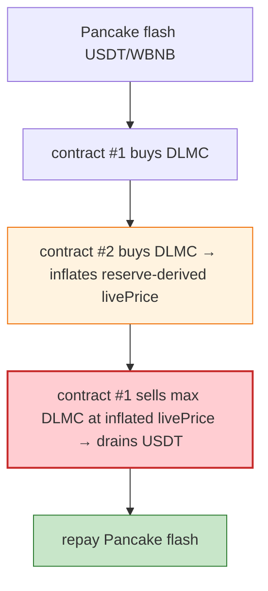

# DLMC Exploit — Reserve-Derived `livePrice` Inflation Across Two Registered Contracts

> **Reproduction:** the PoC compiles & runs in an isolated Foundry project at
> [this project folder](.). Full verbose trace: [output.txt](output.txt).

---

## Key info

| | |
|---|---|
| **Loss** | 222,560.22 USDT; tx `0x151025d3…`; attacker `0x701Bb7B4…` |
| **Vulnerable contract** | DLMCToken `0xF2ca2A35…` (BSC) — `livePrice` derived from its own reserves |
| **Flash source** | Pancake USDT/WBNB flash swap |
| **Chain / block / date** | BSC / Jun 2026 |
| **Bug class** | Oracle/self-pricing — `livePrice` is derived from DLMCToken's own reserve; the attacker buys DLMC through two registered contracts, the second buy inflates `livePrice`, then the first sells the max DLMC backed by the token's USDT balance. |

---

## TL;DR

Per the embedded analysis: the attacker used a Pancake USDT/WBNB flash swap to **buy DLMC through two
registered contracts**. The second buy inflated DLMCToken's **reserve-derived `livePrice`**, then the
first contract **sold the maximum DLMC amount backed by DLMCToken's USDT balance**, draining nearly all
protocol USDT before repaying the Pancake pair.

---

## Root cause

A **self-referential, reserve-derived price** (`livePrice`) that an attacker can inflate by buying
through registered contracts, then sell against at the inflated price — draining the protocol's USDT
backing.

---

## Diagrams



---

## Remediation

1. Don't derive price from the token's own manipulable reserves; use TWAP/external oracle.
2. Cap sell notional per tx/block against the USDT backing.
3. Re-check price after each registered-contract action.

---

## How to reproduce

```bash
_shared/run_poc.sh 2026-06-DLMC_exp -vvvvv
```

- RPC: BSC archive. Result: `[PASS]` — 222,560.22 USDT drained via livePrice inflation.

---

*Reference: DLMC reserve-derived `livePrice` inflation, BSC, Jun 2026 (222,560.22 USDT).*
