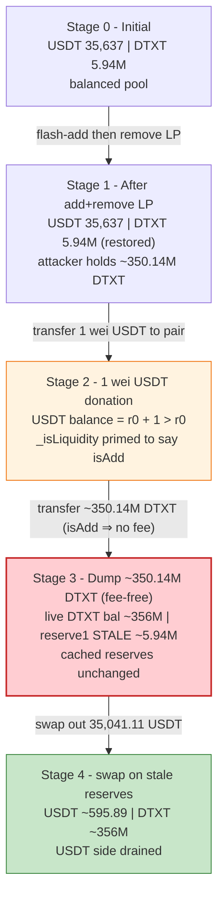
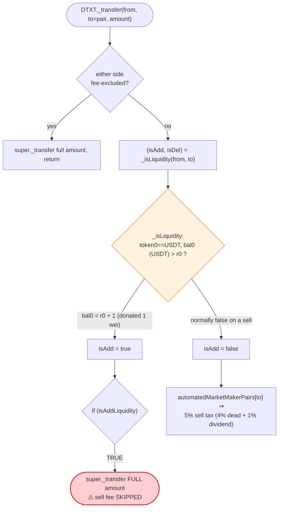
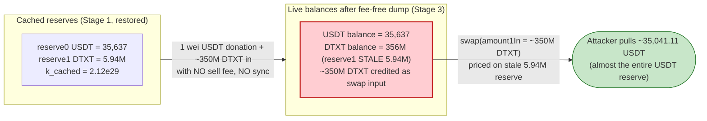

# DTXT Exploit — 1-Wei USDT Donation Misclassifies a Sell as a Liquidity Add (Fee Bypass + Stale-Reserve Drain)

> **Reproduction:** the PoC compiles & runs in an isolated Foundry project at
> [this project folder](.) (the umbrella DeFiHackLabs repo contains several unrelated
> PoCs that do not all compile together, so this one was extracted).
> Full verbose trace: [output.txt](output.txt).
> Verified vulnerable source: [DTXT.sol](sources/DTXT_Ac9Bf7/DTXT.sol); victim AMM:
> [PancakePair.sol](sources/PancakePair_90BfC1/PancakePair.sol).

---

## Key info

| | |
|---|---|
| **Loss** | ~**35,041.11 USDT** drained from the DTXT/USDT PancakeSwap pair (the pool's entire ~35,637 USDT reserve, net of the swap math) |
| **Vulnerable contract** | `DTXT` token — [`0xAc9Bf7C320d4cE2D0ac978B83955Dd67351897D2`](https://bscscan.com/address/0xAc9Bf7C320d4cE2D0ac978B83955Dd67351897D2#code) |
| **Victim pool** | DTXT/USDT PancakeV2 pair — [`0x90BfC1dBc878bA54858bA8A635B3DAebd2aC6c01`](https://bscscan.com/address/0x90BfC1dBc878bA54858bA8A635B3DAebd2aC6c01) |
| **Flash-loan source** | Moolah USDT flash loan — [`0x8F73b65B4caAf64FBA2aF91cC5D4a2A1318E5D8C`](https://bscscan.com/address/0x8F73b65B4caAf64FBA2aF91cC5D4a2A1318E5D8C) |
| **Attacker EOA** | [`0xd304ea1592f733e0A46436A01fe54bD504009526`](https://bscscan.com/address/0xd304ea1592f733e0A46436A01fe54bD504009526) |
| **Attacker contract** | `0x3065bc8ed8bd53bdc3fd4633c3097c40726b5f5f` |
| **Attack tx** | [`0x07ba2ccf2b5c1aaca4c017af4fe87762a73ef7177f6ea8bb569367e908a0671d`](https://bscscan.com/tx/0x07ba2ccf2b5c1aaca4c017af4fe87762a73ef7177f6ea8bb569367e908a0671d) |
| **Chain / block / date** | BSC / 102,432,239 / June 2026 |
| **Compiler** | DTXT: Solidity v0.8.18, optimizer **enabled**, 200 runs; pair: v0.5.16, optimizer disabled |
| **Bug class** | Fee-bypass via liquidity-add misclassification — a **1-wei USDT donation** makes DTXT mis-read a large sell into the pair as a liquidity addition, skipping the sell fee, then swapping the (untaxed) DTXT against stale reserves |

---

## TL;DR

1. `DTXT` is a fee-on-transfer token. On a *sell* (a transfer **to** the AMM pair) it skims a 5%
   destroy/dividend fee in `_transfer` ([DTXT.sol:933-940](sources/DTXT_Ac9Bf7/DTXT.sol#L933-L940)).
   But before charging any fee it asks `_isLiquidity(from, to)`
   ([DTXT.sol:948-962](sources/DTXT_Ac9Bf7/DTXT.sol#L948-L962)) whether the transfer is actually a
   liquidity *add* — and if so, it forwards the full amount **fee-free**
   ([DTXT.sol:895-899](sources/DTXT_Ac9Bf7/DTXT.sol#L895-L899)).

2. The add-liquidity heuristic is trivially spoofable. The pair's `token0` is **USDT**, not DTXT, so
   `_isLiquidity` decides "this is an add" purely by checking whether the pair's *USDT* balance is
   greater than its cached `reserve0` (`bal0 > r0`). It never looks at the DTXT side at all.

3. The attacker pre-positions the pool with a Moolah USDT flash loan: add DTXT/USDT liquidity, then
   immediately `removeLiquidity` so DTXT's *del-liquidity* branch hands back the LP'd DTXT, leaving the
   attack contract holding ~350.14M DTXT and the pool shrunk back to ~35,637 USDT / ~5.94M DTXT.

4. The attacker then sends **1 wei of USDT** straight to the pair
   ([DTXT_exp.sol:142](test/DTXT_exp.sol#L142)). Now `bal0 (USDT) = r0 + 1 > r0`, so the *next* DTXT
   transfer into the pair is classified as an "add."

5. The attacker dumps its entire ~350.14M DTXT into the pair
   ([DTXT_exp.sol:143](test/DTXT_exp.sol#L143)). Because `_isLiquidity` returns `isAdd = true`, DTXT
   moves the **full** amount with **zero sell fee** — the pair now physically holds ~356.08M DTXT but
   its cached `reserve1` is still only ~5.94M DTXT.

6. Finally the attacker calls the raw pair `swap()`
   ([DTXT_exp.sol:146-149](test/DTXT_exp.sol#L146-L149)), claiming the donated DTXT as swap input
   against the *stale* low reserves. `getAmountOut(~350.14M DTXT, r1≈5.94M, r0≈35,637)` returns
   **35,041.11 USDT**, which the attacker withdraws, repays the ~1.077M USDT flash loan, and keeps the
   difference. Net profit = **35,041.11 USDT** ([output.txt:1857-1859](output.txt)).

---

## Background — what DTXT does

`DTXT` ([source](sources/DTXT_Ac9Bf7/DTXT.sol)) is a fixed-supply (671,000,000) BEP-20 "tax token"
paired against **USDT** on PancakeSwap. Like most BSC tax tokens it overrides `_transfer`
([DTXT.sol:860-946](sources/DTXT_Ac9Bf7/DTXT.sol#L860-L946)) to apply fees on swaps while letting
liquidity operations pass untaxed:

- **Buy** (transfer *from* the pair): 2% destroy + 1% dividend (`buyDesFee=20`, `buyEnvFee=10`)
  ([DTXT.sol:915-922](sources/DTXT_Ac9Bf7/DTXT.sol#L915-L922)).
- **Sell** (transfer *to* the pair): 4% destroy + 1% dividend (`sellDesFee=40`, `sellEnvFee=10`)
  ([DTXT.sol:933-940](sources/DTXT_Ac9Bf7/DTXT.sol#L933-L940)).
- **Add liquidity**: forwarded fee-free ([DTXT.sol:895-899](sources/DTXT_Ac9Bf7/DTXT.sol#L895-L899)).
- **Remove liquidity**: 5% `delFee` skimmed ([DTXT.sol:901-907](sources/DTXT_Ac9Bf7/DTXT.sol#L901-L907)).

Add vs. remove vs. plain swap are distinguished entirely by `_isLiquidity`
([DTXT.sol:948-962](sources/DTXT_Ac9Bf7/DTXT.sol#L948-L962)), a balance-vs-reserve heuristic. That
heuristic is the bug.

On-chain parameters at the fork block (read from the trace at block 102,432,239):

| Parameter | Value | Note |
|---|---|---|
| pair `token0` | `0x55d3…7955` (**USDT**) | [output.txt:1654](output.txt) — DTXT is **not** token0 |
| pair `token1` | `0xAc9B…97D2` (**DTXT**) | [output.txt:1656](output.txt) |
| `reserve0` (USDT) | 35,637,000,000,000,000,000,000 (~35,637 USDT) | [output.txt:1652](output.txt) |
| `reserve1` (DTXT) | 5,939,500,000,000,000,000,000,000 (~5,939,500 DTXT) | [output.txt:1652](output.txt) |
| `sellDesFee` / `sellEnvFee` | 40 / 10 (4% + 1% = 5% sell tax) | [DTXT.sol:714-715](sources/DTXT_Ac9Bf7/DTXT.sol#L714-L715) |
| `delFee` | 50 (5% remove-liquidity tax) | [DTXT.sol:716](sources/DTXT_Ac9Bf7/DTXT.sol#L716) |
| `automatedMarketMakerPairs[pair]` | true | set in constructor [DTXT.sol:777](sources/DTXT_Ac9Bf7/DTXT.sol#L777) |
| seed DTXT held by historical helper | 359,122,000,007,000,000,000,000,000 (~359.12M DTXT) | [output.txt:1609](output.txt) |

The single fact that makes the exploit possible: **`token0 == USDT`, so DTXT's add-liquidity
detector inspects the *USDT* balance, a quantity the attacker can move by 1 wei with a free
transfer.**

---

## The vulnerable code

### 1. The sell path is skipped entirely if the transfer "looks like" an add

```solidity
(isAddLiquidity, isDelLiquidity) = _isLiquidity(from,to);

if (!_isExcludedFromFees[from] && !_isExcludedFromFees[to]) {
    if(!automatedMarketMakerPairs[from] && !automatedMarketMakerPairs[to]){
        super._transfer(from, to, amount);
        return;
    }

    if(isAddLiquidity){
        super._transfer(from, to, amount);   // ⚠️ full amount, NO sell fee
        return ;
    }

    if(isDelLiquidity){
        uint256 _del = amount.mul(delFee).div(1000);
        delAmount += _del;
        super._transfer(from, address(this), _del);
        super._transfer(from, to, amount - _del);
        return ;
    }

    swapFee(from);
    swapDelFee(from);
    require(block.timestamp >= startSwapTime, "not start");
    ...
    } else if (automatedMarketMakerPairs[to]) {     // a SELL — only reached if NOT isAddLiquidity
        uint256 _des = amount.mul(sellDesFee).div(1000);   // 4%
        super._transfer(from, address(0xdead), _des);
        uint256 _dividend = amount.mul(sellEnvFee).div(1000); // 1%
        super._transfer(from, address(this), _dividend);
        fees = _des + _dividend;
    }
    amount = amount.sub(fees);
}
super._transfer(from, to, amount);
```
([DTXT.sol:885-944](sources/DTXT_Ac9Bf7/DTXT.sol#L885-L944))

When `to` is the AMM pair, the code is *supposed* to charge the 5% sell tax. But the
`if(isAddLiquidity){ … return; }` short-circuit fires **first** and forwards the entire amount with no
fee. So whoever can make `_isLiquidity` return `isAdd = true` while sending DTXT into the pair sells
fee-free.

### 2. The add-liquidity heuristic only looks at the `token0` (USDT) balance

```solidity
function _isLiquidity(address from,address to)internal view returns(bool isAdd,bool isDel){
    address token0 = IUniswapV2Pair(address(uniswapV2Pair)).token0();
    (uint r0,,) = IUniswapV2Pair(address(uniswapV2Pair)).getReserves();
    uint bal0 = IERC20(token0).balanceOf(address(uniswapV2Pair));
    if( automatedMarketMakerPairs[to] ){
        if( token0 != address(this) && bal0 > r0 ){
            isAdd = bal0 - r0 > 0;          // ⚠️ "add" iff USDT balance > cached USDT reserve
        }
    }
    if( automatedMarketMakerPairs[from] ){
        if( token0 != address(this) && bal0 < r0 ){
            isDel = r0 - bal0 > 0;
        }
    }
}
```
([DTXT.sol:948-962](sources/DTXT_Ac9Bf7/DTXT.sol#L948-L962))

`token0` is USDT, so `token0 != address(this)` is always true. The "is this an add?" decision reduces
to **`pair's USDT balance > pair's cached USDT reserve`** — i.e. "has someone deposited USDT that
hasn't been `sync()`ed yet?" A genuine liquidity add deposits *both* tokens before `mint()`, so this
heuristic is a cheap proxy for it. But it can be satisfied by a **free, 1-wei USDT transfer** to the
pair, with no DTXT side and no `mint()` — which is exactly a sell in disguise.

### 3. The PancakeSwap pair prices a swap from its *cached* reserves, not its live balance

```solidity
function swap(uint amount0Out, uint amount1Out, address to, bytes calldata data) external lock {
    require(amount0Out > 0 || amount1Out > 0, 'Pancake: INSUFFICIENT_OUTPUT_AMOUNT');
    (uint112 _reserve0, uint112 _reserve1,) = getReserves(); // gas savings
    ...
    uint amount1In = balance1 > _reserve1 - amount1Out ? balance1 - (_reserve1 - amount1Out) : 0;
    ...
    require(balance0Adjusted.mul(balance1Adjusted) >= uint(_reserve0).mul(_reserve1).mul(10000**2), 'Pancake: K');
}
```
([PancakePair.sol:452-480](sources/PancakePair_90BfC1/PancakePair.sol#L452-L480))

The pair credits as `amount1In` everything the attacker pre-deposited above the stale reserve, and the
constant-product `K` check is evaluated against the *stale* `_reserve0/_reserve1`. Because DTXT let
~350M DTXT into the pair fee-free while `reserve1` was still ~5.94M, the `K` check passes and the
attacker can pull out almost the entire USDT reserve.

---

## Root cause — why it was possible

The loss is the composition of two flaws:

1. **A spoofable liquidity-add heuristic.** `_isLiquidity` infers "liquidity add" from a one-sided,
   un-synced `token0` (USDT) balance increase. Because USDT is a normal ERC-20, anyone can make
   `bal0 > r0` true by transferring 1 wei of USDT to the pair for free — no real liquidity, no DTXT,
   no `mint()`. Once that flag is set, DTXT applies the **add-liquidity branch (no fee)** to a transfer
   that is functionally a sell.

2. **Fee logic that gates on the heuristic *before* it gates on direction.** In `_transfer`, the
   `isAddLiquidity` short-circuit ([DTXT.sol:895-899](sources/DTXT_Ac9Bf7/DTXT.sol#L895-L899)) runs
   ahead of the `automatedMarketMakerPairs[to]` sell branch
   ([DTXT.sol:933-940](sources/DTXT_Ac9Bf7/DTXT.sol#L933-L940)). So a "sell that looks like an add" is
   forwarded at full amount. The 5% sell tax — the only mechanism that would have made the attacker's
   round trip unprofitable — never fires.

The downstream amplifier is generic AMM mechanics: PancakeSwap prices `swap()` from cached reserves
([PancakePair.sol:454-475](sources/PancakePair_90BfC1/PancakePair.sol#L454-L475)). DTXT having let the
DTXT into the pair fee-free without any `sync()` means the attacker can immediately claim that DTXT as
swap input against stale, tiny reserves and walk out with the USDT side.

Note this is *not* a reserve-burn/`sync()` attack (BY/AROS style). Here the pair's reserves are never
desynced by the token; instead the token's **fee waiver** lets the attacker stuff the pair with DTXT
that the AMM will happily treat as swap input.

---

## Preconditions

- The pair's **`token0` must be the counter-asset (USDT), not DTXT** — true here
  ([output.txt:1654-1656](output.txt)), which is why `_isLiquidity` keys off the USDT balance. (DTXT's
  constructor even `require(USDT < address(this))` to force USDT as token0,
  [DTXT.sol:765](sources/DTXT_Ac9Bf7/DTXT.sol#L765).)
- The attacker (and its helper) must **not** be fee-excluded — if either side were in
  `_isExcludedFromFees`, `_transfer` would early-return without ever consulting `_isLiquidity`
  ([DTXT.sol:872-875](sources/DTXT_Ac9Bf7/DTXT.sol#L872-L875)). The attack contract is a fresh,
  non-excluded address.
- A DTXT inventory to dump. The PoC seeds its local helper with the same ~359.12M DTXT that the
  historical on-chain helper `0xd245…5428` held ([output.txt:1608-1609](output.txt),
  [DTXT_exp.sol:57-58](test/DTXT_exp.sol#L57-L58)); on-chain the attacker had pre-funded that DTXT.
- Working capital in USDT to seed/withdraw liquidity. Peak outlay was the Moolah flash loan of
  **1,077,367 USDT** ([output.txt:1657](output.txt)), fully repaid intra-transaction — hence
  flash-loanable.

---

## Attack walkthrough (with on-chain numbers from the trace)

The pair's `token0 = USDT`, `token1 = DTXT`, so `reserve0 = USDT`, `reserve1 = DTXT`. All figures are
read directly from the `Sync` / `Swap` / `getReserves` / `Transfer` lines in [output.txt](output.txt).
Amounts are raw 18-decimal wei; human approximations in parentheses.

| # | Step | USDT reserve (r0) | DTXT reserve (r1) | Pair's live DTXT balance | Effect |
|---|------|------------------:|------------------:|-------------------------:|--------|
| 0 | **Initial** `getReserves` ([output.txt:1652](output.txt)) | 35,637,000,000,000,000,000,000 (~35,637) | 5,939,500,000,000,000,000,000,000 (~5,939,500) | = r1 | Honest pool. |
| 1 | **Moolah flash loan** 1,077,367,000,021,000,000,000,000 USDT (~1,077,367) to attacker ([output.txt:1657-1661](output.txt)) | 35,637 (unchanged) | 5,939,500 (unchanged) | = r1 | Working capital acquired. |
| 2 | **addLiquidity** — deposit 1,077,366,000,021,000,000,000,000 USDT (~1,077,366) + 179,561,000,003,500,000,000,000,000 DTXT (~179,561,000); `mint` Sync ([output.txt:1683,1718-1719](output.txt)) | 1,113,003,000,021,000,000,000,000 (~1,113,003) | 185,500,500,003,500,000,000,000,000 (~185,500,500) | = r1 | Pool ballooned; attacker gets LP. |
| 3 | **removeLiquidity** — burn 13,908,735,252,838,108,500,522,252 LP; DTXT's *del* branch skims 5% to the token, returns 170,582,950,003,325,000,000,000,000 DTXT (~170,582,950) + 1,077,366 USDT to attacker; `burn` Sync ([output.txt:1749,1777-1778,1789](output.txt)) | 35,637,000,000,000,000,000,001 (~35,637) | 5,939,500,000,000,000,000,000,001 (~5,939,500) | = r1 | Pool restored; attacker now holds ~350.14M DTXT. |
| 4 | **Donate 1 wei USDT** to the pair ([output.txt:1798-1799](output.txt)) | 35,637 (cached, unchanged) | 5,939,500 (cached) | USDT bal now = r0 + 1 | `bal0 > r0` ⇒ `_isLiquidity` will say **isAdd** for the next DTXT-in. |
| 5 | **Dump ~350.14M DTXT into the pair** — attacker balance 350,143,770,445,824,996,500,000,000 (~350,143,770) sent; DTXT classifies it as an **add → no sell fee**; pair receives 350,143,420,302,054,550,675,003,500 (~350,143,420) DTXT ([output.txt:1805-1806,1813,1821](output.txt)) | 35,637 (cached) | 5,939,500 (**stale**) | **356,082,920,302,054,550,675,003,501** (~356,082,920) ⚠️ | Pair physically holds ~356M DTXT; reserve1 still ~5.94M. |
| 6 | **Raw `swap(usdtOut, 0)`** — `getAmountOut(350,143,420,302,054,550,675,003,500, r1=5,939,500…, r0=35,637…) = 35,041,106,262,669,601,832,717` (~35,041.11 USDT) pulled out; Sync ([output.txt:1822-1823,1835-1836](output.txt)) | **595,893,737,330,398,167,285 (~595.89)** | 356,082,920,302,054,550,675,003,501 (~356,082,920) | = r1 | USDT side drained to ~596 USDT. |
| 7 | **Repay flash loan** 1,077,367,000,021,000,000,000,000 USDT to Moolah ([output.txt:1846-1847](output.txt)) | — | — | — | Loan closed. |
| 8 | **Forward profit** 35,041,106,262,669,601,832,715 USDT (~35,041.11) to attacker EOA ([output.txt:1857-1859](output.txt)) | — | — | — | Profit realized. |

The fee-bypassed dump (step 5) is the whole game: the attacker injected ~350M DTXT into the pool for
free, then in step 6 the AMM priced that DTXT as legitimate swap input against the ~5.94M / ~35,637
stale reserves and paid out essentially the pool's full USDT side.

### Profit / loss accounting (USDT, raw wei)

| Item | Amount (wei) | ~Human |
|---|---:|---:|
| Attacker USDT before attack | 27,112,978,940,964,773,437 | ~27.11 |
| Attacker USDT after attack | 35,068,219,241,610,566,606,152 | ~35,068.22 |
| **Net profit (forwarded by attack contract)** | **35,041,106,262,669,601,832,715** | **~35,041.11** |
| Pair USDT reserve before swap (step 0/3) | 35,637,000,000,000,000,000,001 | ~35,637.00 |
| Pair USDT reserve after swap (step 6) | 595,893,737,330,398,167,285 | ~595.89 |
| **Pair USDT drained** | **35,041,106,262,669,601,832,716** | **~35,041.11** |

The attacker round-trips the 1,077,367 USDT flash loan at no net cost (deposit → withdraw → repay) and
keeps the ~35,041.11 USDT the fee-free dump + stale-reserve swap let it pull out of the pool. The PoC
asserts `profit > 35,000 ether` ([DTXT_exp.sol:70](test/DTXT_exp.sol#L70)); realized profit is
**35,041.11 USDT** ([output.txt:1565](output.txt)).

---

## Diagrams

### Sequence of the attack

```mermaid
sequenceDiagram
    autonumber
    actor A as "Attacker contract"
    participant FL as "Moolah flash loan"
    participant H as "DTXT seed helper"
    participant R as "Pancake router"
    participant P as "DTXT/USDT pair"
    participant T as "DTXT token"

    Note over P: Initial reserves<br/>35,637 USDT / 5.94M DTXT

    rect rgb(255,243,224)
    Note over A,FL: Step 1 — borrow working capital
    A->>FL: flashLoan(USDT, 1,077,367)
    FL-->>A: 1,077,367 USDT (repay in-tx)
    end

    rect rgb(232,245,233)
    Note over A,P: Step 2-3 — seed then remove liquidity
    A->>H: addLiquidityAndReturnRemainder
    H->>R: addLiquidity(USDT, DTXT)
    R->>P: mint LP, Sync 1.113M USDT / 185.5M DTXT
    A->>R: removeLiquidity(LP)
    R->>P: burn; DTXT del-branch returns ~170.58M DTXT (5% to token)
    Note over P: 35,637 USDT / 5.94M DTXT (restored)<br/>A holds ~350.14M DTXT
    end

    rect rgb(255,235,238)
    Note over A,T: Step 4-5 — the trick
    A->>P: transfer 1 wei USDT (donation)
    Note over T: _isLiquidity: bal0(USDT) > r0 ⇒ isAdd = true
    A->>P: transfer ~350.14M DTXT
    T->>T: isAddLiquidity branch ⇒ NO sell fee
    Note over P: live DTXT bal ~356M, reserve1 still ~5.94M ⚠️
    end

    rect rgb(243,229,245)
    Note over A,P: Step 6 — drain
    A->>P: swap(35,041.11 USDT out, 0)
    P-->>A: 35,041.11 USDT (priced on stale reserves)
    Note over P: ~595.89 USDT / ~356M DTXT
    end

    A->>FL: repay 1,077,367 USDT
    A->>A: forward ~35,041.11 USDT profit to EOA
```

### Pool state evolution



### The flaw inside `_transfer` / `_isLiquidity`



### Why it is theft: pair invariant before vs. after the fee-free dump



---

## Why each magic number

- **Moolah flash loan `1,077,367,000,021,000,000,000,000` USDT (~1,077,367):** computed in
  `_flashAmountForSeed` as `usdtForLiquidity + 1 ether`, where `usdtForLiquidity = (seedDtxt/2) * r0 /
  r1` ([DTXT_exp.sol:154-164](test/DTXT_exp.sol#L154-L164)). It is exactly the USDT needed to add
  `seedDtxt/2` (~179.56M) DTXT of liquidity at the current price, plus 1 USDT of slack.
- **`usdtRetained = 1 ether`** in `addLiquidityAndReturnRemainder`
  ([DTXT_exp.sol:133](test/DTXT_exp.sol#L133)): incidental slack so the `transferFrom` of
  `balanceOf(msg.sender) - usdtRetained` never underflows; not load-bearing.
- **`seedDtxt / 2` for liquidity** ([DTXT_exp.sol:84,161](test/DTXT_exp.sol#L84)): only half the ~359.12M
  DTXT seed is LP'd; the other half is handed back ([DTXT_exp.sol:91](test/DTXT_exp.sol#L91)). Combined
  with the DTXT returned by the *del-liquidity* branch on `removeLiquidity`, the attacker ends step 3
  holding ~350.14M DTXT to dump.
- **The `1` (1 wei USDT) transfer** ([DTXT_exp.sol:142](test/DTXT_exp.sol#L142)): the entire exploit
  pivot. It makes the pair's USDT balance exceed its cached `reserve0` by 1, so `_isLiquidity` returns
  `isAdd = true` for the *very next* DTXT transfer into the pair, waiving the 5% sell fee.
- **`dtxtIn = balanceOf(pair) - reserve1`** ([DTXT_exp.sol:146-147](test/DTXT_exp.sol#L146-L147)): the
  amount of DTXT the pair physically received above its stale reserve — the value the AMM will credit
  as `amount1In`. Feeding it to `getAmountOut(dtxtIn, reserve1, reserve0)` yields the exact
  `usdtOut = 35,041,106,262,669,601,832,717` the attacker requests from `swap()`
  ([output.txt:1822-1824](output.txt)).
- **PoC assertion `profit > 35_000 ether`** ([DTXT_exp.sol:70](test/DTXT_exp.sol#L70)): a conservative
  floor; realized profit is ~35,041.11 USDT.

---

## Remediation

1. **Do not gate fees on a balance-vs-reserve "liquidity add" heuristic.** Any check of the form
   `pairTokenBalance > cachedReserve` is satisfiable by a free 1-wei donation of the counter-asset and
   is therefore not a reliable add-liquidity signal. Remove the `isAddLiquidity` fee-waiver entirely,
   or detect liquidity operations by gating on the router/`mint` call path (e.g. an authorized LP
   manager), not by inspecting reserve drift.
2. **Charge the sell tax based on transfer direction, not on a spoofable flag.** A transfer *to* an
   AMM pair from a non-excluded address is a sell and should be taxed regardless of any add/remove
   heuristic. Resolve direction first, then apply add/remove exemptions only for whitelisted liquidity
   routers.
3. **If a liquidity-detection heuristic is unavoidable, require both sides.** A real add deposits
   *both* token0 and token1 before `mint()`; checking only the `token0` (USDT) side lets a one-sided
   USDT donation impersonate an add. At minimum require a matching, proportional increase in *both*
   reserves.
4. **Never trust raw, un-synced reserves for value decisions.** The token forwarded ~350M DTXT into
   the pair fee-free; the pair then priced that DTXT against stale reserves. Tax tokens that interpose
   on swaps must not create a state where the pair's live balance diverges from its reserve without a
   corresponding `sync()`/`skim()` they control.

---

## How to reproduce

The PoC was extracted into a standalone Foundry project and runs **offline** against a local anvil
fork served from `anvil_state.json` (the `setUp()` calls
`vm.createSelectFork("http://127.0.0.1:8546", 102_432_239)`,
[DTXT_exp.sol:42-43](test/DTXT_exp.sol#L42-L43)):

```bash
_shared/run_poc.sh 2026-06-DTXT_exp --mt testExploit -vvvvv
```

- The harness boots a local anvil from the captured BSC state at block **102,432,239** and points the
  fork URL at `127.0.0.1:8546`; no public RPC is required.
- `foundry.toml` sets `evm_version = 'cancun'`.
- Result: `[PASS] testExploit()` with `Attacker Final USDT Balance: 35068.219241610566606152`
  (~35,041.11 USDT net profit over the ~27.11 USDT starting balance).

Expected tail:

```
Ran 1 test for test/DTXT_exp.sol:ContractTest
[PASS] testExploit() (gas: 2509304)
Logs:
  Attacker Before exploit USDT Balance: 27.112978940964773437
  Attacker Final USDT Balance: 35068.219241610566606152
  Attacker After exploit USDT Balance: 35068.219241610566606152

Suite result: ok. 1 passed; 0 failed; 0 skipped; finished in 35.62s (33.51s CPU time)
```

---

*Reference: audit_911 — https://x.com/audit_911/status/2063793931138347015 (DTXT, BSC, ~35,041 USDT).*
