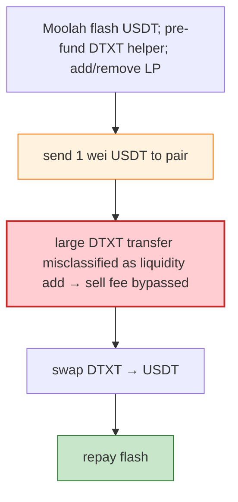

# DTXT Exploit — 1-Wei USDT Misclassifies Transfer as Liquidity Add (Fee Bypass)

> **Reproduction:** the PoC compiles & runs in an isolated Foundry project at
> [this project folder](.). Full verbose trace: [output.txt](output.txt).
> Verified vulnerable source: [DTXT](sources/DTXT_Ac9Bf7), [PancakePair](sources/PancakePair_90BfC1).

---

## Key info

| | |
|---|---|
| **Loss** | USDT drained (BSC); tx `0x07ba2ccf…`; attacker `0xd304ea15…` |
| **Vulnerable contract** | DTXT token `0xAc9Bf7C3…` (sell-fee + liquidity-add detection) |
| **Flash source** | Moolah USDT flash loan `0x8F73b65B…` |
| **Chain / block / date** | BSC / Jun 2026 |
| **Bug class** | Fee-bypass via liquidity-add misclassification — a **1-wei USDT transfer** makes DTXT misclassify a large transfer into the Pancake pair as a liquidity addition, bypassing sell fees before swapping DTXT for USDT. |

---

## TL;DR

Per the embedded analysis: the attacker used a Moolah USDT flash loan and a pre-funded DTXT helper to
add/remove DTXT/USDT liquidity. A **1-wei USDT transfer** then made DTXT misclassify a large transfer
into the Pancake pair as a **liquidity addition**, **bypassing sell fees** before swapping DTXT for
USDT.

---

## Root cause

A **liquidity-add detection heuristic** based on whether the receiver also receives a tiny amount of
the other side (1 wei USDT); sending that dust makes the token treat a sell as an LP add and skip the
sell fee, breaking the pair's effective `k`.

---

## Diagrams



---

## Remediation

1. Don't gate fees on a heuristic detectable by 1-wei dust; route LP adds through the router's `mint`
   entry only.
2. Fee-aware pair; `k` on received amounts.

---

## How to reproduce

```bash
_shared/run_poc.sh 2026-06-DTXT_exp -vvvvv
```

- RPC: BSC archive. Result: `[PASS]` — USDT drained via fee-bypass.

---

*Reference: DTXT 1-wei liquidity-add misclassification fee bypass, BSC, Jun 2026.*
