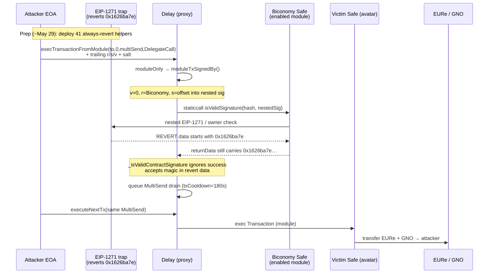

<!-- non-defihacklabs -->
# Gnosis Pay / Zodiac Delay — `moduleTxSignedBy` ignores EIP-1271 `staticcall` success

> **Vulnerability classes:** vuln/auth/signature-validation · vuln/access-control/broken-logic · vuln/logic/missing-check

> **Reproduction:** the PoC compiles & runs in an isolated Foundry project at
> [this project folder](.). The fork is served offline from the bundled
> `anvil_state.json` (local anvil replays **Gnosis Chain** state at block `46468497`), so no
> public RPC is required.
> Full verbose trace: [output.txt](output.txt).
> Verified vulnerable source:
> [SignatureChecker.sol](sources/Delay_4a97e6/@gnosis.pm/zodiac/contracts/signature/SignatureChecker.sol),
> [Delay.sol](sources/Delay_4a97e6/contracts/Delay.sol),
> [Modifier.sol](sources/Delay_4a97e6/@gnosis.pm/zodiac/contracts/core/Modifier.sol).

---

## Key info

| | |
|---|---|
| **Campaign loss** | **~$265K** across many Gnosis Pay Safes (CertiK; later public posts cite higher totals — reconcile on-chain) |
| **PoC scope** | **One representative Safe**: **22,871.781209340330446817 EURe** + **10.973278975665717061 GNO** |
| **Vulnerable surface** | Zodiac **Delay v1.1.0** EIP-1167 clones; impl [`0x4A97E65188A950Dd4b0f21F9b5434dAeE0BBF9f5`](https://gnosisscan.io/address/0x4A97E65188A950Dd4b0f21F9b5434dAeE0BBF9f5#code) |
| **Example victim Delay** | [`0xB0ca54ac663b96f526996bB6594b5B5648142673`](https://gnosisscan.io/address/0xB0ca54ac663b96f526996bB6594b5B5648142673) (avatar Safe below) |
| **Example victim Safe** | [`0x915E683649AB7743F8145d0536CF5168959c9159`](https://gnosisscan.io/address/0x915E683649AB7743F8145d0536CF5168959c9159) |
| **Attacker EOA** | [`0x81BA8A2b895D30280bca199C2Ff75f3F058d4C6c`](https://gnosisscan.io/address/0x81ba8a2b895d30280bca199c2ff75f3f058d4c6c) (“Gnosis Pay Exploiter 2”) |
| **EIP-1271 trap** | [`0x5A77953CAa27eD4638F4DfdC665b8064D0e97A35`](https://gnosisscan.io/address/0x5A77953CAa27eD4638F4DfdC665b8064D0e97A35) (reverts with `0x1626ba7e…`) |
| **Enabled module used as signer** | Biconomy Safe [`0x7f59e536F083a63B67adFe3bC793a47744DBa7D8`](https://gnosisscan.io/address/0x7f59e536F083a63B67adFe3bC793a47744DBa7D8) |
| **Queue tx** | [`0x61af4383…`](https://gnosisscan.io/tx/0x61af4383f94423f4acad8d4a04d3d473f258be3806f3e55d2f18b7fcc475e580) (block `46468498`) |
| **Execute tx** | [`0x06b0fee0…`](https://gnosisscan.io/tx/0x06b0fee08be38ff1eaf4739e9c3b186a86d88e8615f93d2f2864938fd8751eed) (block `46468862`) |
| **Chain / block / date** | **Gnosis Chain (chainId 100)** / fork `46468497` / **2026-06-01** |
| **Compiler** | Solidity `0.8.20` (Delay impl) |
| **Bug class** | EIP-1271 `staticcall` **success boolean ignored** — revert data treated as valid magic value |
| **RC** | [CertiK](https://www.certik.com/blog/gnosispay-incident-analysis) · [Verichains](https://blog.verichains.io/p/gnosis-pay-exploit-the-devs-discovered) · [CertiKAlert](https://x.com/CertiKAlert/status/2062875261339635965) |

---

## TL;DR

1. Gnosis Pay card accounts are Safe smart accounts with Zodiac **Roles** + **Delay**
   modules. Outgoing non-card transfers queue in Delay for a short cooldown
   (`txCooldown = 180` on the victim instance) before `executeNextTx`.

2. `Delay.execTransactionFromModule` is gated by `moduleOnly`. If `msg.sender` is
   **not** an enabled module, auth falls back to `moduleTxSignedBy()`, which
   parses **trailing `r,s,v` + salt from the entire `msg.data`** (including bytes
   beyond the ABI-decoded arguments).

3. With `v == 0`, `r` is treated as an EIP-1271 contract signer. The attacker sets
   `r` to a **Biconomy Safe that is already enabled as a module** on the Delay, and
   nests a second signature pointing at an attacker contract that **reverts** with
   data beginning `0x1626ba7e` (the EIP-1271 magic value).

4. `_isValidContractSignature` does `staticcall` but **discards the success flag**
   and only checks `bytes4(returnData) == 0x1626ba7e`. Revert data is still
   returned to the caller → the forged path is accepted.

5. The queued action is a MultiSend (`operation = DelegateCall`) that transfers
   the Safe’s EURe + GNO to the attacker. After cooldown, `executeNextTx` is
   permissionless and drains the funds.

This PoC reproduces the **full historical path against one victim Safe** on a
pre-queue fork. Campaign total across dozens of Safes is ~$265K per CertiK.

---

## Background

Gnosis Pay links a Visa debit product to self-custodial Safe accounts on Gnosis
Chain. Architecture (public Gnosis engineering write-ups):

- **Roles module** — authorizes card-spend paths.
- **Delay module** — queues other outbound transfers and enforces a short
  cooldown so the user can react / cancel.

Delay v1.1.0 is deployed as many **EIP-1167 minimal proxies** sharing
implementation `0x4A97…F9f5`. The signature fallback lives in the legacy
`@gnosis.pm/zodiac` package (`SignatureChecker.sol`), not in a custom Gnosis Pay
fork of the cooldown logic itself.

Verichains notes that a related fix landed in the **`zodiac-core`** line months
earlier, while production Gnosis Pay Delay instances still compiled against the
stale legacy dependency — a classic package-split / deployment-drift failure.

---

## Attack flow



---

## The vulnerable code

### `moduleOnly` fallback

```solidity
// sources/Delay_4a97e6/@gnosis.pm/zodiac/contracts/core/Modifier.sol
modifier moduleOnly() {
    if (modules[msg.sender] == address(0)) {
        (bytes32 hash, address signer) = moduleTxSignedBy();
        if (modules[signer] == address(0)) {
            revert NotAuthorized(msg.sender);
        }
        if (consumed[signer][hash]) {
            revert HashAlreadyConsumed(hash);
        }
        consumed[signer][hash] = true;
        emit HashExecuted(hash);
    }
    _;
}
```

Any caller can authorize by presenting a signature whose recovered `signer` is an
**already-enabled module** on this Delay instance.

### Trailing-bytes signature parse

```solidity
// SignatureChecker.sol — moduleTxSignedBy()
bytes calldata data = msg.data;
if (data.length < 4 + 32 + 65) {
    return (bytes32(0), address(0));
}
(uint8 v, bytes32 r, bytes32 s) = _splitSignature(data);
uint256 end = data.length - (32 + 65);
bytes32 salt = bytes32(data[end:]);

if (v == 0) {
    uint256 start = uint256(s);
    address signer = address(uint160(uint256(r)));
    bytes32 hash = moduleTxHash(data[:start], salt);
    return _isValidContractSignature(signer, hash, data[start:end])
        ? (hash, signer)
        : (bytes32(0), address(0));
}
```

`execTransactionFromModule(to, value, data, operation)` only ABI-decodes four
parameters. Everything after that buffer is free attacker-controlled material for
`v / r / s / salt / nested signature`.

### The missing success check (root cause)

```solidity
// SignatureChecker.sol — _isValidContractSignature
(, bytes memory returnData) = signer.staticcall(
    abi.encodeWithSelector(
        IERC1271.isValidSignature.selector,
        hash,
        signature
    )
);

return bytes4(returnData) == EIP1271_MAGIC_VALUE; // 0x1626ba7e
```

The correct pattern (as later fixed in `zodiac-core`) is:

```solidity
(bool success, bytes memory returnData) = signer.staticcall(...);
return success && returnData.length >= 4
    && bytes4(returnData) == EIP1271_MAGIC_VALUE;
```

Because Solidity returns revert data to the low-level caller, an attacker contract
that **`revert(abi.encodePacked(bytes4(0x1626ba7e), …))`** (or any revert whose
first four bytes match) forges a “valid” EIP-1271 response.

---

## Historical calldata (this victim)

| Field | Value |
|-------|--------|
| `to` | MultiSend `0x38869bf66a61cF6bDB996A6aE40D5853Fd43B526` |
| `value` | `0` |
| `operation` | `1` (DelegateCall) |
| Inner transfers | EURe `22871.78…` + GNO `10.97…` → attacker |
| Outer `v` | `0` (contract signature path) |
| Outer `r` | Biconomy module `0x7f59…a7D8` |
| Outer `s` | `0x244` = start offset of nested sig inside `msg.data` |
| Nested currentOwner / trap | `0x5A77…7A35` |

---

## PoC notes

- **Scope:** one Safe (`0x915E…`) at fork block `46468497` (one before the queue).
  Campaign-wide drain is many parallel instances of the same bug.
- **Strategy:** replay historical `QUEUE_CALLDATA` (includes forged trailing
  signature) then `EXECUTE_CALLDATA` after `vm.warp(+180)`.
- **No synthetic deploy required on the fork** — attack helpers already exist
  on-chain from the May 29 prep window.
- Offline: `_shared/run_poc.sh 2026-06-GnosisPay_exp` loads `anvil_state.json`
  (chainId **100**, port mapping `gnosis → 8553` in `chains.conf`).

```text
Attacker EURe profit: 22871.781209340330446817
Attacker GNO profit:  10.973278975665717061
[PASS] testExploit()
```

---

## Remediation

1. **Always check `success`** on EIP-1271 `staticcall` / `call` before treating
   `returnData` as a signature result.
2. Require `returnData.length >= 4` (ideally `== 32` for the standard
   `bytes4` left-padded ABI encoding).
3. **Backport** the `zodiac-core` fix into any still-deployed `@gnosis.pm/zodiac`
   Delay / Modifier instances — library fixes do not protect old bytecode.
4. Inventory enabled modules on Delay: any EIP-1271-capable module that can be
   driven into a nested verification path is part of the auth surface.
5. Incident response used by Gnosis (public): urge withdrawals, pause bridges,
   reimburse users, migrate modules.

---

## References

- [CertiK — GnosisPay Incident Analysis](https://www.certik.com/blog/gnosispay-incident-analysis)
- [Verichains — Gnosis Pay Exploit / silent fix drift](https://blog.verichains.io/p/gnosis-pay-exploit-the-devs-discovered)
- [CertiKAlert](https://x.com/CertiKAlert/status/2062875261339635965)
- [Zodiac Delay v1.1.0](https://github.com/gnosisguild/zodiac-modifier-delay/tree/v1.1.0)
- [Gnosis Pay compromised-addresses label](https://github.com/gnosischain/gnosis-pay-compromised-addresses)
