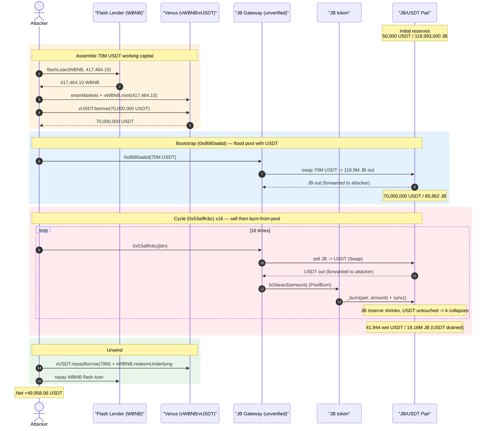
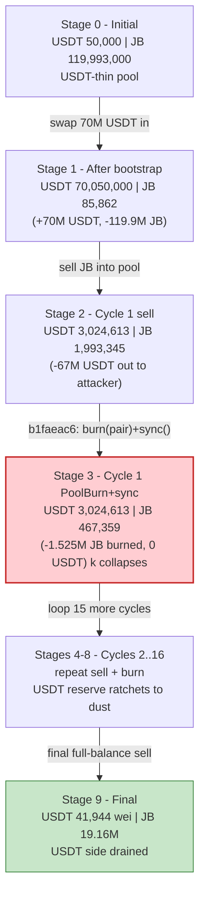
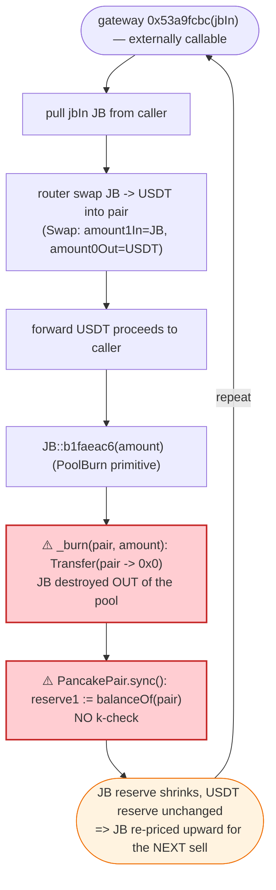
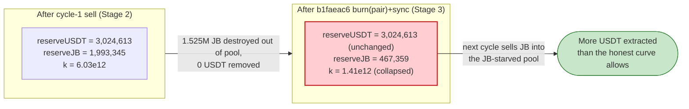

# JB Exploit — Gateway-Driven `sell → PoolBurn(pool) + sync()` AMM-Reserve Drain (Venus-leveraged)

> **Vulnerability classes:** vuln/access-control/missing-auth · vuln/oracle/price-manipulation

> **Reproduction:** the PoC compiles & runs in an isolated Foundry project at
> [this project folder](.) (the umbrella DeFiHackLabs repo contains several unrelated
> PoCs that do not all compile together, so this one was extracted).
> Full verbose trace: [output.txt](output.txt).
> Verified vulnerable source (the AMM that gets drained): [PancakePair.sol](sources/PancakePair_43932c/PancakePair.sol).
> The JB token and the JB "gateway"/"auth helper" are **unverified** on BscScan, so no Solidity is
> available for them; their behaviour is reconstructed entirely from the execution trace.

---

## Key info

| | |
|---|---|
| **Loss** | **49,958.06 USDT** — drained from the JB/USDT PancakeSwap pair via the JB gateway (BSC; 18-decimal BSC-USDT) |
| **Vulnerable contract** | JB **gateway** `0x1B5732Eb98911c25acf7bDfAffB9409782CAE6d7` (unverified) — [`#code`](https://bscscan.com/address/0x1b5732eb98911c25acf7bdfaffb9409782cae6d7#code); drives the JB token's `PoolBurn(pool)+sync()` primitive |
| **Victim pool** | JB/USDT PancakeV2 pair — [`0x43932cbb49c363F68655b5Ad2950ED4630CB49F8`](https://bscscan.com/address/0x43932cbb49c363F68655b5Ad2950ED4630CB49F8) (`token0 = USDT`, `token1 = JB`) |
| **JB token** | `0xcF92E7eF4A63D52dc15F45A24f4F815f00f299a7` (unverified) |
| **Flash lender** | `0x8F73b65B4caAf64FBA2aF91cC5D4a2A1318E5D8C` (ERC1967 proxy → impl `0x9321587EA0DC8247f8F03E8696C047b2713bB79A`) — free WBNB flash loan |
| **Attacker EOA** | [`0xd99e1abfc5dd5034d7ff63828d16c5e945d1b856`](https://bscscan.com/address/0xd99e1abfc5dd5034d7ff63828d16c5e945d1b856) |
| **Attacker contract** | `0xcc21c75f9e13054667663f9ed37f41e65b52dee7` (on-chain; the PoC redeploys logic as `JBExploit`, which the trace shows at the Foundry default address `0x5615dEB798BB3E4dFa0139dFa1b3D433Cc23b72f`) |
| **Attack tx** | [`0x54e120b8d62a9d7cef94bf51f1f5b8aa13565d76d8797a79afeeb25ed0e1dc25`](https://bscscan.com/tx/0x54e120b8d62a9d7cef94bf51f1f5b8aa13565d76d8797a79afeeb25ed0e1dc25) |
| **Chain / block / date** | BSC (chainId 56) / fork **104,980,466** / June 2026 |
| **Compiler** | Pair: Solidity v0.5.16, optimizer **off**, 200 runs. Flash-lender proxy: v0.8.28, optimizer **on**, 200 runs. PoC built with Solc 0.8.34, `evm_version = cancun`. |
| **Bug class** | Token with a privileged `burn-from-pool + sync()` primitive, driven by an unverified gateway, repeatedly sells JB and then shrinks the pair's JB reserve un-compensated — an AMM constant-product (`x·y = k`) break monetised one cycle at a time |

---

## TL;DR

1. The attacker takes a **free WBNB flash loan** of `417,464.10 WBNB` from a permissionless flash
   lender ([output.txt:1646](output.txt)), supplies all of it to **Venus** as collateral
   (`vWBNB.mint`, [output.txt:1672](output.txt)), and **borrows 70,000,000 USDT** against it
   (`vUSDT.borrow`, [output.txt:1738](output.txt)).

2. That 70M USDT is fed into the **unverified JB gateway** (`0x1B5732…CAE6d7`) through a "bootstrap"
   selector `0xd680aabd` ([output.txt:2086](output.txt)). The gateway swaps the full 70M USDT into the
   pair, buying out **almost all of the pool's JB** (`119,907,137 JB` out,
   [output.txt:2153](output.txt)). The pair, which started at `50,000 USDT / 119,993,000 JB`
   ([output.txt:2090](output.txt)), is now a **USDT-heavy, JB-starved** pool: `70,050,000 USDT /
   85,862 JB` ([output.txt:2152](output.txt)).

3. The attacker then calls the gateway's **cycle** selector `0x53a9fcbc` 16 times
   ([output.txt:2254](output.txt) … [output.txt:4789](output.txt)). Each cycle does two things to the
   pair: **(a)** it sells a tranche of JB back into the pool, pulling USDT out
   (a `Swap` with `amount1In = JB`, `amount0Out = USDT`), then **(b)** it invokes the JB token's
   privileged `PoolBurn` primitive — `JB::b1faeac6(amount)` ([output.txt:2396](output.txt)) — which
   **burns JB directly out of the pair's balance and calls `PancakePair.sync()`**
   ([output.txt:2398](output.txt)), emitting `PoolBurned` ([output.txt:2407](output.txt)).

4. Step (b) is the bug. Burning JB **out of the pair** and then `sync()`-ing tells the AMM "your JB
   reserve is now this much smaller", with **no USDT leaving the pair**. The product `k` collapses and
   the marginal price of JB is re-inflated, so the *next* cycle's JB sale extracts more USDT than a
   fair swap would. Repeating the `sell → PoolBurn(pool) + sync()` loop ratchets USDT out of the pool
   tranche by tranche.

5. After 16 cycles the pair holds only `41,944 wei` of USDT (`reserve0 = 4.194e19`,
   [output.txt:4909](output.txt)) — the USDT side has been drained to dust. The gateway forwards each
   cycle's USDT proceeds back to the attacker contract.

6. The attacker repays Venus (`vUSDT.repayBorrow(70,000,000)`, [output.txt:4961](output.txt)), redeems
   the WBNB collateral (`vWBNB.redeemUnderlying`, [output.txt:5009](output.txt)), and returns the WBNB
   flash loan. What remains is pure profit: the contract holds
   **49,958,056,380,441,202,939,144 wei USDT (≈ 49,958.06 USDT)**
   ([output.txt:5302](output.txt)) and forwards it to the attacker EOA
   ([output.txt:5303](output.txt)). The PoC asserts `profit > 40,000 USDT`
   ([JB_exp.sol:122](test/JB_exp.sol#L122)).

---

## Background — what JB does

`JB` is a deflationary BEP-20 deployed on BSC with a fixed off-chain "gateway"
(`0x1B5732…CAE6d7`) and an "auth helper" (`0x94741df7…3726cD`) bolted on. None of the three is
verified on BscScan, so this section reconstructs their on-chain behaviour from the trace.

- **The pair is a vanilla PancakeSwap V2 pair.** `token0 = USDT`, `token1 = JB`
  ([output.txt:2095-2098](output.txt)). Its only verified source is the standard
  [`PancakePair.sol`](sources/PancakePair_43932c/PancakePair.sol) (Solidity 0.5.16). It prices assets
  purely from cached reserves and only enforces `x·y ≥ k` inside `swap()`; `sync()` blindly trusts the
  pair's current token balances.

- **The gateway exposes two entry points used in the attack** (raw 4-byte selectors, no ABI):
  - `0xd680aabd(usdtIn, 0, 1e18)` — **bootstrap**: pull `usdtIn` USDT from the caller, swap it
    USDT→JB through the router into the pair, route fees through the auth helper, and forward the
    bought JB to the caller ([output.txt:2086](output.txt)).
  - `0x53a9fcbc(jbIn, 0, 1e18)` — **cycle**: pull `jbIn` JB from the caller, **sell it JB→USDT** into
    the pair, then invoke the JB token's `PoolBurn` primitive to **burn JB out of the pair and
    `sync()`**, and forward the USDT proceeds to the caller ([output.txt:2254](output.txt)).

- **The JB token holds the dangerous primitive.** `JB::b1faeac6(amount)` burns `amount` JB **from the
  pair's balance** (`Transfer(pair → 0x0)`) and then calls `PancakePair.sync()`, finishing with a
  `PoolBurned(amount)` event ([output.txt:2396-2407](output.txt)). This is callable in the gateway's
  flow because the gateway/helper are configured as the privileged caller; the PoC reproduces that
  authorisation by taking ownership of the auth helper in `setUp`/`testExploit`
  ([JB_exp.sol:105-116](test/JB_exp.sol#L105-L116)).

On-chain state read from the trace at the fork block (`getReserves` @ [output.txt:2090](output.txt)):

| Parameter | Value (raw wei) | ~Human |
|---|---:|---:|
| Pair `token0` | `0x55d398…7955` (USDT) | USDT |
| Pair `token1` | `0xcF92E7eF…99a7` (JB) | JB |
| Pair USDT reserve (`reserve0`) | 50,000,000,000,000,000,000,000 | ~50,000 USDT |
| Pair JB reserve (`reserve1`) | 119,993,000,000,000,000,000,000,000 | ~119,993,000 JB |
| Flash-lender WBNB balance (loan size) | 417,464,102,426,572,951,120,812 | ~417,464.10 WBNB |
| Venus USDT borrow | 70,000,000,000,000,000,000,000,000 | 70,000,000 USDT |

The whole game lives in two facts: the pool is **thin in USDT** (only ~50k) but the gateway can pour
**70M USDT** into it on demand, and the JB token can **delete JB out of the pool and `sync()`** at
will. The first inflates the pool with USDT to drain; the second is the lever that keeps re-pricing
JB upward so each cycle pulls more of that USDT back out.

---

## The vulnerable code

The JB token and gateway are unverified, so the only verified Solidity is the AMM that is abused. The
two pair functions below are exactly the surface the JB `PoolBurn` primitive weaponises.

### 1. `sync()` blindly trusts the pair's current token balances

```solidity
// force reserves to match balances
function sync() external lock {
    _update(IERC20(token0).balanceOf(address(this)), IERC20(token1).balanceOf(address(this)), reserve0, reserve1);
}
```
([PancakePair.sol#L491-L493](sources/PancakePair_43932c/PancakePair.sol#L491-L493))

`sync()` exists so a pair can re-cache its reserves to whatever its token balances currently are. It
performs **no `k` check** — it simply copies `balanceOf(pair)` into `reserve0/reserve1` via `_update`:

```solidity
function _update(uint balance0, uint balance1, uint112 _reserve0, uint112 _reserve1) private {
    require(balance0 <= uint112(-1) && balance1 <= uint112(-1), 'Pancake: OVERFLOW');
    ...
    reserve0 = uint112(balance0);
    reserve1 = uint112(balance1);
    blockTimestampLast = blockTimestamp;
    emit Sync(reserve0, reserve1);
}
```
([PancakePair.sol#L366-L379](sources/PancakePair_43932c/PancakePair.sol#L366-L379))

So if a third party **destroys** `token1` (JB) held by the pair and then calls `sync()`, the pair
happily adopts the smaller balance as its new reserve. The constant product silently shrinks.

### 2. `swap()` enforces `k` only against the *cached* reserves

```solidity
function swap(uint amount0Out, uint amount1Out, address to, bytes calldata data) external lock {
    require(amount0Out > 0 || amount1Out > 0, 'Pancake: INSUFFICIENT_OUTPUT_AMOUNT');
    (uint112 _reserve0, uint112 _reserve1,) = getReserves(); // gas savings
    require(amount0Out < _reserve0 && amount1Out < _reserve1, 'Pancake: INSUFFICIENT_LIQUIDITY');
    ...
    uint balance0Adjusted = (balance0.mul(10000).sub(amount0In.mul(25)));
    uint balance1Adjusted = (balance1.mul(10000).sub(amount1In.mul(25)));
    require(balance0Adjusted.mul(balance1Adjusted) >= uint(_reserve0).mul(_reserve1).mul(10000**2), 'Pancake: K');
    ...
    _update(balance0, balance1, _reserve0, _reserve1);
    emit Swap(msg.sender, amount0In, amount1In, amount0Out, amount1Out, to);
}
```
([PancakePair.sol#L452-L480](sources/PancakePair_43932c/PancakePair.sol#L452-L480))

The `Pancake: K` invariant is enforced against `_reserve0 · _reserve1` **as last cached**. Once a
`PoolBurn + sync()` has shrunk `reserve1` (JB), the pair re-prices JB against the artificially small
reserve, so the very next swap legitimately hands out more USDT for the same JB than the honest curve
ever would. The pair is behaving exactly as written — the fault is the external `burn(pool) + sync()`
that desynchronises the reserve in the first place.

### 3. The off-chain `PoolBurn` primitive (reconstructed from the trace)

There is no source, but the trace fully pins the behaviour. Inside one cycle the gateway calls:

```
JB::b1faeac6(0x...014323e09671f95764b55b)          # PoolBurn(amount)  output.txt:2396
  ├─ emit Transfer(from: Pair, to: 0x0, value: 1,525,986,193,257,101,967,799,643)   # burn JB OUT of the pair
  ├─ JB/USDT Pair::sync()                            # output.txt:2398
  │    ├─ USDT::balanceOf(Pair) → 3,024,613,593,636,936,142,863,232   (unchanged)
  │    ├─ JB::balanceOf(Pair)   →   467,359,160,121,073,345,259,393   (shrunk)
  │    └─ emit Sync(reserve0: 3,024,613,…(USDT), reserve1: 467,359,…(JB))   # output.txt:2403
  └─ emit PoolBurned(: 1,525,986,193,257,101,967,799,643)             # output.txt:2407
```

The `Transfer(pair → 0x0)` destroys JB *belonging to the pair*; the immediate `sync()` forces the
reduced JB balance into `reserve1`; **no USDT moves**. That is an un-compensated one-sided reserve
deletion — the canonical "burn from the pool" anti-pattern, here executed deliberately as a token
feature and looped by the gateway.

---

## Root cause — why it was possible

Three design decisions compose into the loss:

1. **A token primitive that burns liquidity out of the live AMM pair and `sync()`s it.**
   `JB::b1faeac6` deletes JB held by the PancakeSwap pair and re-syncs the lower balance
   ([output.txt:2396-2407](output.txt)). Because PancakeSwap's `sync()` does no `k` validation
   ([PancakePair.sol#L491-L493](sources/PancakePair_43932c/PancakePair.sol#L491-L493)), this is a
   free, repeatable shrink of one side of the constant product. Value flows toward whoever still holds
   JB and is positioned to sell into the re-priced pool — i.e. the gateway's caller.

2. **The primitive is reachable through an unverified, externally-drivable gateway.** The attacker
   does not need any special role of their own: they drive the whole `sell → PoolBurn(pool) + sync()`
   loop purely by calling the gateway's `0x53a9fcbc` selector 16 times
   ([output.txt:2254](output.txt) … [output.txt:4789](output.txt)). The gateway holds the
   authorisation to call the JB token's pool-burn; the attacker just supplies the JB and pockets the
   USDT.

3. **The thin USDT pool can be force-inflated with borrowed USDT.** The pair held only ~50,000 USDT
   honestly ([output.txt:2090](output.txt)). By flash-borrowing WBNB → Venus-collateralising it →
   borrowing 70M USDT, the attacker pre-loads the pool with **70M USDT of their own (borrowed) money**
   ([output.txt:2153](output.txt)) and then uses the burn-loop to claw it all back **plus** the pool's
   original liquidity. The leverage is what turns a small pool into a ~50k-USDT extraction; the burn
   primitive is what makes the extraction possible at all.

The deflationary "pool burn" feature — presumably intended to make JB scarcer over time — is the exact
mechanism that lets an attacker delete pool reserves and re-price the asset in their favour, on demand,
in a loop.

---

## Preconditions

- **The JB gateway/helper must be permitted to drive the JB `PoolBurn(pool)+sync()` primitive.**
  On-chain this was the live configuration. The PoC reproduces the authorisation by transferring the
  auth helper's ownership to the fresh exploit contract and binding it to the previous non-self
  referrer root ([JB_exp.sol:105-116](test/JB_exp.sol#L105-L116)) — the gateway checks
  `parent(caller)` and the helper rejects self-referrers.
- **Working capital in USDT to pre-load the thin pool.** Peak outlay is the **70,000,000 USDT**
  Venus borrow ([output.txt:1738](output.txt)), fully repaid intra-transaction
  ([output.txt:4961](output.txt)), hence **flash-loanable**. The PoC sources it as: free WBNB flash
  loan ([output.txt:1646](output.txt)) → Venus `enterMarkets` + `vWBNB.mint`
  ([output.txt:1661-1672](output.txt)) → `vUSDT.borrow(70M)` ([output.txt:1738](output.txt)).
- **A WBNB flash lender that lends its entire balance for free.** The lender at `0x8F73b65…E5D8C`
  hands over its full `417,464.10 WBNB` balance with no premium ([output.txt:1646-1655](output.txt)),
  repaid by a plain `transferFrom` at the end ([output.txt:5300+](output.txt)).

---

## Attack walkthrough (with on-chain numbers from the trace)

The pair's `token0 = USDT`, `token1 = JB`, so `reserve0 = USDT`, `reserve1 = JB`. All figures are taken
directly from the `Sync` / `Swap` events and `getReserves` returns in [output.txt](output.txt). Amounts
are raw (18-decimal) wei; human approximations in parentheses. Each cycle shows the **two** `Sync`
events it produces: the first from the JB→USDT `swap`, the second from the `PoolBurn(pool) + sync()`.

| # | Step | USDT reserve (r0) | JB reserve (r1) | Effect |
|---|------|------------------:|----------------:|--------|
| 0 | **Initial** (getReserves @ [output.txt:2090](output.txt)) | 50,000,000,000,000,000,000,000 (~50,000) | 119,993,000,000,000,000,000,000,000 (~119,993,000) | Honest, USDT-thin pool. |
| 1 | **Bootstrap** `0xd680aabd(70M USDT)` — gateway swaps 70M USDT in → 119,907,137,388,193,202,146,690,518 JB out (`Swap`/`Sync` @ [output.txt:2152-2153](output.txt)) | 70,050,000,000,000,000,000,000,000 (~70,050,000) | 85,862,611,806,797,853,309,482 (~85,862) | Pool flooded with borrowed USDT; JB reserve emptied to ~85.8K. |
| 2 | **Cycle 1 (a) sell** — gateway sells 1,907,482,741,571,377,459,749,554 JB (~1.907M) → 67,025,386,406,363,063,857,136,768 USDT (~67.0M) out; `Swap`/`Sync` @ [output.txt:2374-2375](output.txt) | 3,024,613,593,636,936,142,863,232 (~3,024,613) | 1,993,345,353,378,175,313,059,036 (~1.993M) | First big USDT pull; gateway had re-seeded JB into the pair before selling. |
| 2 | **Cycle 1 (b) PoolBurn+sync** — `JB::b1faeac6` burns 1,525,986,193,257,101,967,799,643 JB (~1.525M) out of the pair + `sync()`; `Sync` @ [output.txt:2403](output.txt), `PoolBurned` @ [output.txt:2407](output.txt) | 3,024,613,593,636,936,142,863,232 (unchanged) | 467,359,160,121,073,345,259,393 (~467K) | ⚠️ One-sided JB deletion; USDT untouched → JB re-priced upward. |
| 3 | **Cycle 2** sell `Sync` @ [output.txt:2543](output.txt); burn `Sync` @ [output.txt:2572](output.txt) (`PoolBurned` 1,495,466,…e24 @ [output.txt:2576](output.txt)) | 606,161,836,955,644,650,964,019 (~606K) | 841,225,777,469,063,327,370,306 (~841K) | USDT extracted (2,418,451,…e24 ≈ 2.418M to attacker @ [output.txt:2559](output.txt)); JB reserve burned down again. |
| 4 | **Cycle 3** sell `Sync` @ [output.txt:2712](output.txt); burn `Sync` @ [output.txt:2741](output.txt) | 191,081,625,922,206,503,887,053 (~191K) | 1,207,615,062,470,093,509,839,001 (~1.207M) | 415,080,…e21 USDT (~415K) to attacker @ [output.txt:2728](output.txt). |
| 5 | **Cycle 4** `Sync` @ [output.txt:2881](output.txt) / [output.txt:2910](output.txt) | 76,957,847,759,583,098,516,124 (~76.9K) | 1,566,676,561,771,103,088,658,322 (~1.566M) | 114,123,…e21 USDT (~114K) @ [output.txt:2897](output.txt). |
| 6 | **Cycle 5** `Sync` @ [output.txt:3050](output.txt) / [output.txt:3079](output.txt) | 36,297,318,804,620,653,494,404 (~36.3K) | 1,918,556,831,086,092,475,901,256 (~1.918M) | 40,660,…e21 USDT (~40.6K) @ [output.txt:3066](output.txt). |
| 7 | **Cycles 6–15** — eight more `sell → PoolBurn(pool)+sync()` rounds, each pulling a smaller USDT tranche (e.g. 17,157,…e21 @ [output.txt:3235](output.txt); 8,169,…e21 @ [output.txt:3404](output.txt); … 186,676,…e20 @ [output.txt:4756](output.txt)) | falling: 19,139,…e21 → 622,933,…e20 (`Sync` @ [output.txt:3248](output.txt) … [output.txt:4769](output.txt)) | oscillating up on each burn (3.6e24 → 5.0e24) | USDT reserve ratcheted toward dust; JB reserve repeatedly burned and re-seeded. |
| 8 | **Cycle 16 (final)** `0x53a9fcbc(full JB balance)` — sells remaining JB; `Swap`/`Sync` @ [output.txt:4909-4910](output.txt); final `PoolBurn` 56,352,…e24 @ [output.txt:4942](output.txt) | **41,943,619,558,797,060,856 (~41,944 wei ≈ 0.0000000419)** | 19,160,690,027,520,572,450,805,020 (~19.16M, burn `Sync` @ [output.txt:4938](output.txt)) | USDT side emptied to dust; 580,990,…e20 USDT (~580 wei) @ [output.txt:4925](output.txt). |
| 9 | **Unwind** — `vUSDT.repayBorrow(70M)` @ [output.txt:4961](output.txt); `vWBNB.redeemUnderlying(417,464.10)` @ [output.txt:5009](output.txt); WBNB flash repaid | — | — | Leverage closed; only profit remains. |

After unwinding, the attacker contract holds **49,958,056,380,441,202,939,144 wei USDT
(≈ 49,958.06 USDT)** ([output.txt:5302](output.txt)) and forwards it to the EOA
([output.txt:5303](output.txt)). The post-exploit attacker balance is logged as
`49958.056380441202939144` ([output.txt:1566](output.txt)).

### Profit / loss accounting (USDT, raw wei)

| Item | Amount (wei) | ~Human |
|---|---:|---:|
| Attacker USDT before attack ([output.txt:1565](output.txt)) | 0 | 0 |
| Venus USDT borrowed (working capital) ([output.txt:2049](output.txt)) | 70,000,000,000,000,000,000,000,000 | 70,000,000 |
| Venus USDT repaid ([output.txt:4961](output.txt)) | 70,000,000,000,000,000,000,000,000 | 70,000,000 |
| WBNB flash-loan premium | 0 | 0 (free loan) |
| **Net USDT left in attacker contract** ([output.txt:5302](output.txt)) | **49,958,056,380,441,202,939,144** | **~49,958.06** |
| Attacker USDT after attack ([output.txt:5320](output.txt)) | 49,958,056,380,441,202,939,144 | ~49,958.06 |
| **Net profit (asserted `> 40,000 USDT`)** ([JB_exp.sol:122](test/JB_exp.sol#L122)) | **49,958,056,380,441,202,939,144** | **~49,958.06** |

The 70M USDT is a pure round-trip (borrow → into the pool → out of the pool → repay). The profit is
the USDT the loop pulled out of the pair **above** the 70M re-injected — the pool's honest USDT
liquidity plus the value manufactured by repeatedly burning JB out of the reserve and re-pricing it.
The figure matches the `// @KeyInfo - Total Lost : 49958.06 USDT` header in the PoC
([JB_exp.sol:7](test/JB_exp.sol#L7)) to the cent.

---

## Diagrams

### Sequence of the attack



### Pool state evolution



### The flaw inside one cycle (`0x53a9fcbc`)



### Why the burn is theft: constant-product before vs. after one PoolBurn



---

## Why each magic number

- **Flash-loan amount = `IERC20(WBNB).balanceOf(FLASH_LENDER)` (417,464.10 WBNB)**
  ([JB_exp.sol:142](test/JB_exp.sol#L142), [output.txt:1646](output.txt)): the attacker simply borrows
  the lender's *entire* WBNB balance — it is free and is only needed as Venus collateral to unlock the
  70M USDT borrow. It is repaid in full at the end ([output.txt:5300+](output.txt)).
- **`borrowAmount = 70,000,000 ether` USDT** ([JB_exp.sol:165](test/JB_exp.sol#L165),
  [output.txt:1738](output.txt)): the "clean" USDT the attacker pours into the thin (~50k USDT) pool so
  there is a large USDT reserve to drain back out. Sized to roughly fill the pool to ~70M USDT
  ([output.txt:2152](output.txt)) while still being collateralised by the borrowed WBNB.
- **The bootstrap call `0xd680aabd(borrowAmount, 0, 1 ether)`** ([JB_exp.sol:172](test/JB_exp.sol#L172),
  [output.txt:2086](output.txt)): seeds the cycle by swapping all 70M USDT into JB. The trailing
  `1 ether` is the gateway's `amountOutMin`/slippage-style argument; `0` is an unused middle field.
- **`cycleAmount = IERC20(JB).balanceOf(address(this)) / 50`** repeated **15 times**
  ([JB_exp.sol:175-178](test/JB_exp.sol#L175-L178)): each cycle sells ~2% of the attacker's current JB
  holdings. Selling in many small tranches (rather than all at once) keeps each JB→USDT swap on a
  favourable part of the curve and lets the `PoolBurn(pool)+sync()` after each tranche re-inflate the
  JB price before the next sale — maximising total USDT extracted.
- **The 16th call `0x53a9fcbc(full JB balance)`** ([JB_exp.sol:179](test/JB_exp.sol#L179),
  [output.txt:4789](output.txt)): dumps the entire remaining JB position in one final cycle, draining
  the USDT reserve to dust (~41,944 wei, [output.txt:4909](output.txt)).
- **`FLASH_CALLBACK_SELECTOR = 0x13a1a562`** ([JB_exp.sol:127](test/JB_exp.sol#L127)): the flash
  lender's callback selector the exploit's `fallback()` must match
  ([JB_exp.sol:131-132](test/JB_exp.sol#L131-L132)) to receive the WBNB and run the body.

---

## Remediation

1. **Never burn liquidity out of a live AMM pair.** The JB token's `PoolBurn` primitive (`b1faeac6`)
   that does `_burn(pair, amount)` + `pair.sync()` ([output.txt:2396-2407](output.txt)) is an
   un-compensated, one-sided reserve deletion — the classic "burn from the pool" anti-pattern. Deflation
   must only ever destroy tokens the protocol *owns* (treasury/own balance), never tokens sitting in a
   pool the AMM prices against.
2. **Remove or hard-gate the pool-burn entry point.** If a pool-burn must exist, it must be unreachable
   from any externally-drivable path. Here a permissionless gateway selector (`0x53a9fcbc`) loops the
   burn 16 times ([output.txt:2254](output.txt) … [output.txt:4789](output.txt)); the primitive should
   be restricted to a trusted keeper and rate/limit-capped.
3. **Bound single-operation reserve impact.** Any operation that can move a pool reserve by more than a
   small percentage of `k` should revert. A burn that repeatedly halves the JB reserve is a red flag the
   AMM cannot defend against on its own.
4. **Verify and audit the gateway and token.** All three core contracts (gateway, auth helper, JB
   token) were unverified. Unverified contracts holding privileged AMM primitives are unauditable by
   integrators and LPs; publish source and have the burn/sync interaction reviewed.
5. **Do not deploy thin-USDT pools alongside flash-loanable leverage.** The ~50k-USDT pool was
   trivially inflated to 70M with a Venus borrow ([output.txt:1738](output.txt)). Pair any
   reserve-mutating token feature with deep liquidity and oracle-based (not raw-reserve) pricing for
   trust decisions.

---

## How to reproduce

The PoC was extracted into a standalone Foundry project. It runs **offline** against a local anvil
fork served from the checked-in `anvil_state.json` (the test's `createSelectFork` points at
`http://127.0.0.1:8546`, [JB_exp.sol:83](test/JB_exp.sol#L83)), so no public RPC is needed:

```bash
_shared/run_poc.sh 2026-06-JB_exp --mt testExploit -vvvvv
```

- Fork block **104,980,466** (BSC) is replayed from the local anvil state; the harness boots anvil on
  port 8546 before invoking `forge test`.
- `foundry.toml` sets `evm_version = 'cancun'`; the test deploys a fresh `JBExploit`, takes ownership of
  the JB auth helper, binds the referrer, then runs the flash-loan → Venus → gateway-loop attack.
- Result: `[PASS] testExploit()`. The harness asserts `profit > 40,000 USDT`
  ([JB_exp.sol:122](test/JB_exp.sol#L122)); actual profit is **~49,958.06 USDT**.

Expected tail (from [output.txt](output.txt)):

```
Ran 1 test for test/JB_exp.sol:ContractTest
[PASS] testExploit() (gas: 6193281)
Logs:
  Attacker Before exploit USDT Balance: 0.000000000000000000
  Attacker After exploit USDT Balance: 49958.056380441202939144

Suite result: ok. 1 passed; 0 failed; 0 skipped; finished in 73.32s (72.14s CPU time)
```

---

*Reference: audit_911 alert — https://x.com/audit_911/status/2067943961327763788 (JB, BSC, ~49,958 USDT).*
