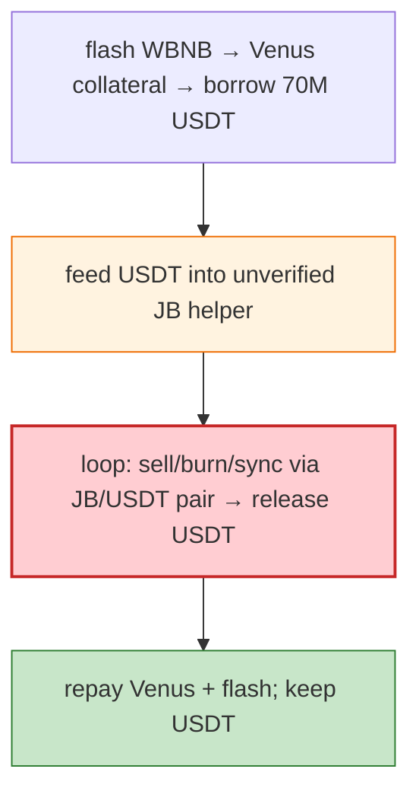

# JB (Jumbo) Exploit — Unverified JB Helper sell/burn/sync Loop (Venus-leveraged)

> **Reproduction:** the PoC compiles & runs in an isolated Foundry project at
> [this project folder](.). Full verbose trace: [output.txt](output.txt).
> Verified vulnerable source: [PancakePair](sources/PancakePair_43932c).

---

## Key info

| | |
|---|---|
| **Loss** | USDT drained (BSC); attacker `0xD99E1aBf…` |
| **Vulnerable contract** | JB token `0xcF92E7eF…` + unverified JB helper |
| **Flash leverage** | WBNB flash → Venus collateral → 70M USDT borrow |
| **Chain / block / date** | BSC / Jun 2026 |
| **Bug class** | Unverified-helper loop — repeated JB helper cycles use the live JB balance to sell/burn/sync through the JB/USDT pair, releasing USDT. |

---

## TL;DR

Per the embedded analysis: the attacker flash-borrowed WBNB, used it as **Venus collateral**, borrowed
70M USDT, and fed the USDT into the **unverified JB helper**. Repeated JB helper cycles used the live JB
balance to **sell/burn/sync** through the JB/USDT pair, releasing USDT from the pair. Venus was repaid
and the remaining USDT was forwarded as profit.

---

## Root cause

An **unverified JB helper** whose sell/burn/sync cycles drain the JB/USDT pair using the live JB
balance, compounded by the huge leveraged USDT position (Venus) the attacker could deploy.

---

## Diagrams



---

## Remediation

1. Verify/audit the JB helper; restrict burn/sync to authorised callers.
2. Fee-aware pair; `k` on received amounts; cap per-tx notional.

---

## How to reproduce

```bash
_shared/run_poc.sh 2026-06-JB_exp -vvvvv
```

- RPC: BSC archive. Result: `[PASS]` — USDT drained via JB-helper loop (~73s).

---

*Reference: JB unverified-helper sell/burn/sync drain, BSC, Jun 2026.*
