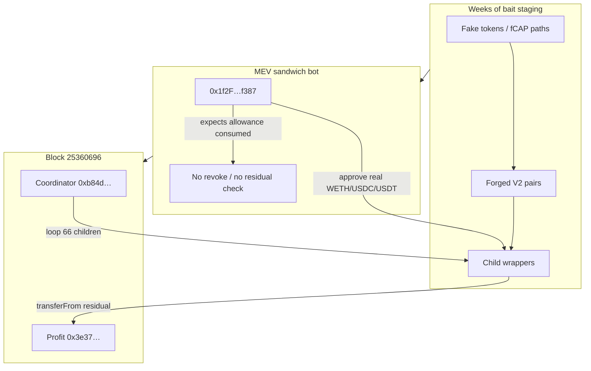

<!-- non-defihacklabs -->
# JaredFromSubway MEV Bot — Residual ERC-20 Approvals to Untrusted Bait Wrappers

> **Vulnerability classes:** vuln/logic/missing-allowance · vuln/dependency/unsafe-external-call · vuln/access-control/broken-logic · vuln/logic/missing-check

> **Reproduction:** the PoC compiles & runs in an isolated Foundry project at
> [this project folder](.). The fork is served offline from the bundled
> `anvil_state.json` (local anvil replays Ethereum state at block `25360695`), so no
> public RPC is required.
> Full verbose trace: [output.txt](output.txt).
> Drain asset source: [WETH9.sol](sources/WETH9_C02aaA/WETH9.sol) (`transferFrom` under residual allowance).
> Victim bot, coordinator, and bait wrappers are **unverified** (bytecode only) — see [sources/README.md](sources/README.md).

---

## Key info

| | |
|---|---|
| **Loss (reported)** | CertiK ~**4,424 ETH (~$7.5M)** after stables → ETH conversion; other outlets cite ~$7.5–15M class |
| **PoC scope (exact on-chain sweep)** | **1,474.582523004994977792 WETH** + **2,870,573.127680 USDC** + **2,035,760.155871 USDT** |
| **Victim MEV bot** | [`0x1f2F10D1C40777AE1Da742455c65828FF36Df387`](https://etherscan.io/address/0x1f2f10d1c40777ae1da742455c65828ff36df387) |
| **Operator label** | `jaredfromsubway.eth` → [`0xae2Fc483527B8EF99EB5D9B44875F005ba1FaE13`](https://etherscan.io/address/0xae2Fc483527B8EF99EB5D9B44875F005ba1FaE13) (EOA label; drain target is the bot contract above) |
| **Coordinator** | [`0xb84db016324e8F2BFdD8DD9c260338AEE0A8DF52`](https://etherscan.io/address/0xb84db016324e8f2bfdd8dd9c260338aee0a8df52) |
| **Attacker caller EOA** | [`0x5aF38735B215b00aa7C9f93fEd7ee415CeCB36e1`](https://etherscan.io/address/0x5af38735b215b00aa7c9f93fed7ee415cecb36e1) |
| **Profit recipient** | [`0x3e37f4A10d771Ba9dE44b6d301410b1BEdeA65d0`](https://etherscan.io/address/0x3e37f4a10d771ba9de44b6d301410b1bedea65d0) |
| **Attack / sweep tx** | [`0x2be8704f…`](https://etherscan.io/tx/0x2be8704f5a59b69e0b71f64aefdb99eb0e8ae9fb3926147c581910d71bcf3e65) (block `25360696`) |
| **Stable → ETH swap (post)** | [`0x4d37e5a7…`](https://etherscan.io/tx/0x4d37e5a7715ea5e6967e27648538ce4b2232099e788256812ce56106a16e58f9) |
| **Bait approval example** | [`0x0121e07a…`](https://etherscan.io/tx/0x0121e07a916c06eea3e7daf11893f3f0b95b9e1684124545ae14c32aee6029bb) |
| **Chain / fork / date** | Ethereum mainnet / fork `25360695` / ~2026-06-20 |
| **Bug class** | Residual ERC-20 allowance to untrusted wrappers; no post-hop consume/revoke check |
| **Alert** | [CertiK Alert](https://x.com/CertiKAlert/status/2070478621139935316) · [CertiK analysis](https://www.certik.com/blog/jaredfromsubway-mev-bot-incident-analysis) · [Beosin](https://beosin.com/resources/over-75-million-lost-analysis-of-a-honeypot-attack-on-mev-bot-and-stolen-funds-tracing) |

---

## Classification note (honeypot bait layer)

Some firms (Blockaid et al.) frame this as **not a classical protocol smart-contract bug**
and not key compromise / phishing — a **counter-MEV honeypot** that fed the bot fake
arbitrage routes until residual approvals were large enough to sweep.

**Still in-scope here** as a **bot-side approval-management flaw** reproducible on-chain:
the victim contract held real WETH/USDC/USDT and had left non-zero allowances to attacker
wrappers; a single coordinator call drained them via `transferFrom`. The registry test
replays that **final residual-approval sweep** for the exact on-chain figures. The real
weeks-long, off-chain-driven fake-pool staging cannot be replayed faithfully, so the
crypto-training EVM Playground instead re-creates the full lifecycle as a **faithful model**
(STAGE → LURE → SWEEP): the attacker deploys bait wrappers, a mock bot installed at the real
victim address (via codeOverride, funded with its real 1,474.58 WETH) is lured into
approving each bait, and the coordinator then sweeps the residual allowances — draining the
same headline WETH figure.

---

## TL;DR

1. Over weeks, an attacker deployed **~66 fake tokens / forged Uniswap-v2-style pairs**
   and bait wrappers that looked like profitable sandwich / multi-hop arb opportunities
   to the bot’s automated strategy.

2. During baited hops the bot **`approve`d real WETH/USDC/USDT** to untrusted child
   wrappers. **Small** baits often consumed allowance (looked normal). **Large** baits
   **skipped `transferFrom` of the real token**, minting path tokens on the forged pair
   instead — so the real-token allowance **remained**.

3. The bot **never verified residual allowance** and **never revoked** after the hop.

4. Final sweep (`0x2be8704f…`): caller → coordinator with calldata listing **66 children
   + victim bot**. Children pull real balances via residual allowances to the profit
   recipient.

5. This PoC **replays that historical coordinator calldata** at block `25360695` and
   asserts exact multi-asset profit.

---

## Background



| Role | Address |
|------|---------|
| Victim bot | `0x1f2F10D1C40777AE1Da742455c65828FF36Df387` |
| Coordinator | `0xb84db016324e8F2BFdD8DD9c260338AEE0A8DF52` |
| Trigger (staging, Beosin) | `0x4de8c729a064ff6087cc84a4152969349e4feb98` |
| Caller EOA | `0x5aF38735B215b00aa7C9f93fEd7ee415CeCB36e1` |
| Profit | `0x3e37f4A10d771Ba9dE44b6d301410b1BEdeA65d0` |
| WETH / USDC / USDT | canonical mainnet addresses |

Beosin “large bait” examples (illustrative): bot saw small real profit (~0.018 WETH /
~37 USDC / ~37 USDT) while leaving large residual approvals (~16 WETH / ~20 USDC / ~20 USDT
class) that later stacked across many children.

---

## The vulnerable pattern

### What the bot did wrong

```text
// Conceptual bot hop (not verified source — pattern only)
token.approve(wrapper, amount);     // real WETH/USDC/USDT
wrapper.wrapOrSwap(...);            // may NOT transferFrom real token on large baits
// missing: require(allowance == 0) or approve(wrapper, 0)
```

### What the sweep used (mechanical)

Canonical WETH `transferFrom` under residual allowance
([WETH9.sol](sources/WETH9_C02aaA/WETH9.sol)):

```solidity
function transferFrom(address src, address dst, uint wad) public returns (bool) {
    // ...
    if (src != msg.sender && allowance[src][msg.sender] != uint(-1)) {
        require(allowance[src][msg.sender] >= wad);
        allowance[src][msg.sender] -= wad;
    }
    balanceOf[src] -= wad;
    balanceOf[dst] += wad;
    // ...
}
```

With `msg.sender = child wrapper` and `src = victim bot`, each residual allowance
pays the profit recipient. Same pattern for USDC/USDT.

### Coordinator call

- Selector `0xc269a509` (unverified; ABI reconstructed as `(address[] children, address victim)`).
- Historical input encodes **66** child addresses + victim bot.
- Historical tx also sent `0.01 ETH` value; PoC matches that. Replay succeeds offline with
  exact profit.

---

## Attack steps (sweep only)

1. Fork Ethereum at block **`25360695`** (one before the sweep).
2. Precondition: victim holds ≥ expected WETH/USDC/USDT; residual allowances to children
   already live from prior bait txs (present in archive state).
3. `prank` caller EOA; `COORD.call{value: 0.01 ether}(historical_calldata)`.
4. Assert profit on `0x3e37…`:
   - WETH `1474582523004994977792`
   - USDC `2870573127680`
   - USDT `2035760155871`
5. Assert matching drain from the victim bot.

---

## Impact

| Asset | Exact amount moved (sweep) |
|-------|----------------------------|
| WETH | 1,474.582523004994977792 |
| USDC | 2,870,573.127680 |
| USDT | 2,035,760.155871 |

Post-sweep, stables were swapped for ETH and partially forwarded (including Tornado Cash
per public tracing). CertiK’s **~4,424 ETH** figure is the **ETH-equivalent campaign
impact**, not a single WETH balance delta.

---

## Remediation (MEV / arb bots)

1. **Exact-amount approve** per hop; never leave standing max allowance to unknown routers.
2. After every external hop: **`require(allowance(token, wrapper) == 0)`** or force
   `approve(wrapper, 0)`.
3. Prefer **permit / pull patterns** that never grant long-lived allowance to untrusted code.
4. **Allowlist** routers / wrappers; refuse routes whose first hop is an unknown CREATE.
5. Treat “small profitable arb on unknown pairs” as **hostile until proven** — especially
   multi-hop paths with custom wrap tokens.

---

## PoC

```bash
# Offline (bundled anvil_state.json)
_shared/run_poc.sh 2026-06-JaredFromSubway_exp -vvvvv
```

Expected: `[PASS] testExploit()` with logged multi-asset profit matching the table above.
See [test/JaredFromSubway_exp.sol](test/JaredFromSubway_exp.sol) and [output.txt](output.txt).

---

## References

- [CertiK — JaredFromSubway MEV bot incident analysis](https://www.certik.com/blog/jaredfromsubway-mev-bot-incident-analysis)
- [CertiK Alert](https://x.com/CertiKAlert/status/2070478621139935316)
- [Beosin — honeypot attack analysis & fund flow](https://beosin.com/resources/over-75-million-lost-analysis-of-a-honeypot-attack-on-mev-bot-and-stolen-funds-tracing)
- Sweep tx: https://etherscan.io/tx/0x2be8704f5a59b69e0b71f64aefdb99eb0e8ae9fb3926147c581910d71bcf3e65
