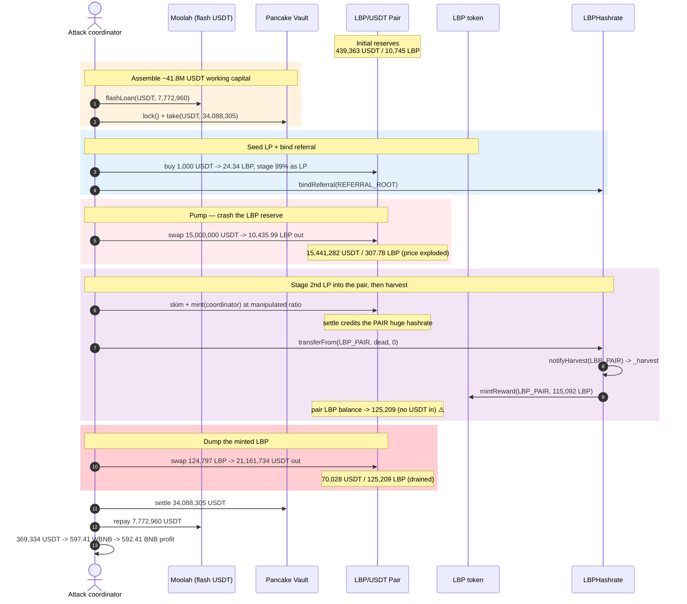
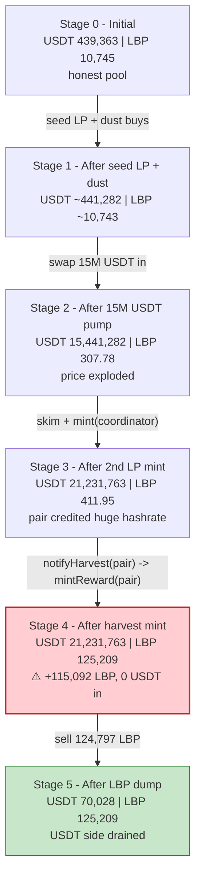
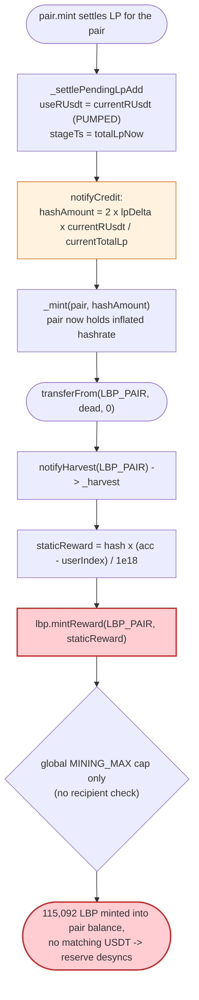
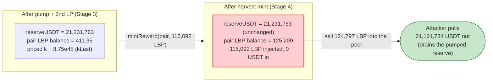

# LBP (Little Boy Plus) Exploit — Reserve-Manipulated LP-Credit Inflates Mining Rewards Minted Into the Pool

> **Vulnerability classes:** vuln/oracle/price-manipulation · vuln/logic/state-update

> **Reproduction:** the PoC compiles & runs in an isolated Foundry project at
> [this project folder](.). The fork is served offline from a local anvil state
> (`anvil_state.json`), so no public RPC is needed.
> Full verbose trace: [output.txt](output.txt).
> Verified vulnerable sources: LBP token [src_LBP.sol](sources/LBP_88886f/src_LBP.sol)
> and its sibling [src_LBPHashrate.sol](sources/LBPHashrate_5E3cBc/src_LBPHashrate.sol).

---

## Key info

| | |
|---|---|
| **Loss** | **610.56 BNB** total (≈ **592.41 BNB** to the profit receiver + **5 BNB** builder tip + gas/dust). Net asserted profit to `0x515788…`: **592.411358371332352817 BNB** |
| **Vulnerable contract** | `LBP` (Little Boy Plus) — [`0x88886f0fD371dfF856291bAdcEd45922bC888888`](https://bscscan.com/address/0x88886f0fD371dfF856291bAdcEd45922bC888888#code) and its mining sibling `LBPHashrate` — [`0x5E3cBc82D020be91a989Eb747934104E9AB585Fe`](https://bscscan.com/address/0x5E3cBc82D020be91a989Eb747934104E9AB585Fe) |
| **Victim pool** | LBP/USDT PancakeSwap V2 pair — [`0x00e3Ea08fD8CBaD955Ec5d2292Ad637670c31524`](https://bscscan.com/address/0x00e3Ea08fD8CBaD955Ec5d2292Ad637670c31524) |
| **Attacker EOA** | [`0xb26DFE6b6180A30e2A2D9826867cc7e06631825a`](https://bscscan.com/address/0xb26dfe6b6180a30e2a2d9826867cc7e06631825a) |
| **Attack contract** | coordinator `0x5449ded887576f43Fc339851e942eBc1E6F8118b` (deployed via `0x202bA7498C65F9F5C49b9c90953B562F9e0538FB`) |
| **Attack tx** | [`0x55856d9fda4c5be5193561c7d775e823c3d6e499da44aab9da963daf61c50b0c`](https://bscscan.com/tx/0x55856d9fda4c5be5193561c7d775e823c3d6e499da44aab9da963daf61c50b0c) |
| **Flash liquidity** | Moolah proxy `0x8F73b65B4caAf64FBA2aF91cC5D4a2A1318E5D8C` (USDT flash loan) + Pancake Vault `0x238a358808379702088667322f80aC48bAd5e6c4` (transient `lock`/`take`/`settle`) |
| **Chain / block / date** | BSC (chainId 56) / fork block **104,727,183** / June 2026 |
| **Compiler** | Solidity **v0.8.35+commit.47b9dedd**, optimizer **enabled, 1000 runs**, non-proxy (per `_meta.json`) |
| **Bug class** | AMM-reserve manipulation feeding a reward-accounting path: LP-credit hashrate is derived from settle-time pool reserves, so a flash-pumped pool inflates mining rewards that are then **minted directly into the pair's LBP balance** and sold |

---

## TL;DR

1. `LBP` is an immutable ERC-20 whose mining/hashrate accounting lives in a sibling
   contract `LBPHashrate`. Adding LP to the LBP/USDT pair grants the LP source
   *hashrate*, and hashrate accrues a continuously-minted LBP mining reward
   (`mintReward`). `LBP.balanceOf()` is overridden to return `raw + pendingRewards`
   ([src_LBP.sol#L1672-L1683](sources/LBP_88886f/src_LBP.sol#L1672-L1683)).

2. The fatal accounting choice: when LP is settled, `LBPHashrate.notifyCredit`
   computes the credited hashrate as `hashAmount = 2 × lpDelta × currentRUsdt /
   currentTotalLp` using the pool's **settle-time** reserves
   ([src_LBPHashrate.sol#L342-L364](sources/LBPHashrate_5E3cBc/src_LBPHashrate.sol#L342-L364)).
   LBP's own source even documents that the stage-time reserve snapshot was
   deliberately removed, "open[ing] a self-inflation surface … only profitable
   when alice controls a significant fraction of the pool"
   ([src_LBP.sol#L237-L243](sources/LBP_88886f/src_LBP.sol#L237-L243)).

3. The attacker borrows **7,772,960 USDT** from Moolah and **takes 34,088,305 USDT**
   transiently from the Pancake Vault, then **buys 15,000,000 USDT worth of LBP**
   ([output.txt:1972](output.txt)), crashing the pair's LBP reserve from ~10,745 LBP
   down to **~307.78 LBP** while inflating the USDT reserve to **~15,441,282 USDT**
   ([output.txt:1971](output.txt)). At this manipulated ratio one unit of LP is worth
   an enormous USDT-equivalent.

4. The attacker stages a second LP add against this manipulated pool
   (`_stageSecondLbpLiquidity`, [test/LBP_exp.sol#L233-L246](test/LBP_exp.sol#L233-L246)),
   minting LP **to the pair itself**. Settlement credits the *pair* a vastly inflated
   hashrate because `currentRUsdt` is now ~21M.

5. The attacker pokes the pair's pending reward into existence with a zero-value
   `hashrate.transferFrom(LBP_PAIR, dead, 0)`
   ([test/LBP_exp.sol#L210](test/LBP_exp.sol#L210)). This routes through
   `notifyHarvest(LBP_PAIR)` → `_harvest`, which mints **115,092.16 LBP** of
   "StaticReward" *directly into the pair's real LBP balance* via
   `mintReward(LBP_PAIR, …)` ([output.txt:2119-2125](output.txt)).

6. The pair's real LBP balance is now **~125,209 LBP**
   ([output.txt:2330](output.txt)) against only **~70,028 USDT** of effective
   pricing reserve. The attacker dumps the freshly-minted LBP, pulling
   **21,161,734 USDT** out ([output.txt:2318-2320](output.txt)).

7. After repaying the Vault (34,088,305 USDT) and Moolah (7,772,960 USDT), the
   attacker keeps **369,334 USDT** ([output.txt:2364](output.txt)), swaps it for
   **597.41 WBNB** ([output.txt:2368](output.txt)), unwraps it, pays a **5 BNB**
   builder tip, and forwards **592.41 BNB** profit ([output.txt:2404](output.txt)).

---

## Background — what LBP / LBPHashrate does

`LBP` ("Little Boy Plus", v8.0) is an immutable ERC-20 paired with USDT on
PancakeSwap V2. It bolts a "liquidity mining" economy onto the token. The mining
state machine is externalized into `LBPHashrate` (the "hLBP" sibling):

- **Hashrate = LP backing.** When a user adds LP to the LBP/USDT pair, LBP's
  `_update` hook detects the addLp pattern ("Method-B" staging, Layer 8c), and on
  the next pair op settles it via `hashrate.notifyCredit`, which mints the LP
  source an amount of *hashrate* equal to the USDT-equivalent value of their LP
  share ([src_LBPHashrate.sol#L342-L364](sources/LBPHashrate_5E3cBc/src_LBPHashrate.sol#L342-L364)).
- **Hashrate earns continuously-minted LBP.** A decaying emission curve advances
  two accumulators (`staticAccPerShare`, `nodeAccPerShare`). `_harvest(user)`
  pays `hash × (acc − userIndex) / 1e18` LBP via `lbp.mintReward`
  ([src_LBPHashrate.sol#L711-L746](sources/LBPHashrate_5E3cBc/src_LBPHashrate.sol#L711-L746)).
- **`balanceOf` shows raw + pending.** `LBP.balanceOf()` surfaces unclaimed mining
  rewards as virtual credit so wallets show "spendable balance"
  ([src_LBP.sol#L1672-L1683](sources/LBP_88886f/src_LBP.sol#L1672-L1683)).
- **mintReward is the only emission path** and is cap-clamped to
  `MINING_MAX = TOTAL_SUPPLY − INITIAL_SUPPLY = 21,000,000 − 21,000 LBP`
  ([src_LBP.sol#L90-L95](sources/LBP_88886f/src_LBP.sol#L90-L95),
  [src_LBP.sol#L467-L492](sources/LBP_88886f/src_LBP.sol#L467-L492)).

On-chain parameters / pool state at the fork block (read directly from the trace):

| Parameter | Value | Source |
|---|---|---|
| LBP token position in pair | LBP is `token1`; USDT is `token0` (`reserve0 = USDT`, `reserve1 = LBP`) | [src_LBP.sol#L521-L526](sources/LBP_88886f/src_LBP.sol#L521-L526) |
| Initial pair reserves | USDT `439,363,604,173,946,711,436,972` (~439,363) / LBP `10,745,156,000,864,319,009,216` (~10,745) | [output.txt:1647](output.txt) |
| Pair LP totalSupply (initial) | `68,430,692,244,685,288,954,983` (~68,430) | [output.txt:1658](output.txt) |
| `tradingOpened` | `true` | [output.txt:1795](output.txt) |
| `factory.feeTo()` | `0x0ED943Ce24BaEBf257488771759F9BF482C39706` (non-zero ⇒ mint-fee on) | [output.txt:1781](output.txt) |
| Hashrate credit formula | `hashAmount = 2 × lpDelta × currentRUsdt / currentTotalLp` | [src_LBPHashrate.sol#L355](sources/LBPHashrate_5E3cBc/src_LBPHashrate.sol#L355) |
| Moolah USDT liquidity (flash) | `7,772,960,679,833,989,887,601,242` (~7,772,960 USDT) | [output.txt:1622](output.txt) |
| Pancake Vault USDT (transient take) | `34,088,305,166,977,891,414,858,299` (~34,088,305 USDT) | [output.txt:1636](output.txt) |

The whole game: the credited hashrate (and therefore the LBP later minted to a
holder) is computed from `currentRUsdt / currentTotalLp` — **instantaneous pool
reserves at settle time**. Flash-pump the USDT reserve and crash the LBP reserve,
and a tiny LP add mints an enormous hashrate, which mints an enormous LBP reward.

---

## The vulnerable code

### 1. Hashrate credit is derived from settle-time pool reserves

```solidity
function notifyCredit(
    address user,
    uint256 lpDelta,
    uint256 currentRUsdt,
    uint256 currentTotalLp
) external onlyLBP nonReentrant returns (address refToReward, uint256 hashrateUsed) {
    if (user == address(0) || lpDelta == 0 || user == DEAD) return (address(0), 0);
    if (currentTotalLp == 0) return (address(0), 0);

    // Hashrate identity (mirrors v7.x `_inferPendingHashrate`):
    //   USDT-equivalent = lpDelta × rUSDT / TS, LBP-side equals it at stage TWAP,
    //   so total = 2 × USDT-side.
    uint256 hashAmount = 2 * lpDelta * currentRUsdt / currentTotalLp;   // ⚠️ uses CURRENT reserves
    ...
    _mint(user, hashAmount);                                            // ⚠️ mints hashrate
```
([src_LBPHashrate.sol#L342-L379](sources/LBPHashrate_5E3cBc/src_LBPHashrate.sol#L342-L379))

`currentRUsdt` and `currentTotalLp` are read at *settle* moment in
`_settlePendingLpAdd` (`useRUsdt = currentRUsdt`, `stageTs = totalLpNow_`) and
passed straight through:

```solidity
uint256 useRUsdt = uint256(currentRUsdt);
uint256 stageTs = totalLpNow_;
...
(address refToReward, uint256 hashrateUsed) =
    hashrate.notifyCredit(lastTransfer_, userLpDelta, useRUsdt, stageTs);
```
([src_LBP.sol#L1116-L1140](sources/LBP_88886f/src_LBP.sol#L1116-L1140))

### 2. The protocol explicitly documents the self-inflation surface it left open

```solidity
// (Stage-time reserve snapshot deleted — settle uses current `getReserves()`
// at settle moment. Trade-off: opens a self-inflation surface where alice
// contributes unbalanced (USDT-heavy) addLp to inflate her own hashrate
// proportional to her pool share. Bounded by 2L/R ratio (per dollar lost,
// gain 2L/R USDT-eq of hashrate); only profitable when alice controls a
// significant fraction of the pool. Accepted for code simplicity — Router-
// only addLp + balanced ratios make exploitation hard in practice.)
```
([src_LBP.sol#L237-L243](sources/LBP_88886f/src_LBP.sol#L237-L243))

A flash loan lets the attacker *become* "a significant fraction of the pool" for
the duration of one transaction — exactly the assumption the comment relied on
being hard. The attacker controls both `currentRUsdt` (pumped) and the pool share.

### 3. Harvest mints the inflated reward straight into the holder's real balance

```solidity
function _harvest(address user) internal {
    if (user == DEAD) return;
    _tickEmission();

    uint256 hash = balanceOf(user);
    uint256 accStatic = staticAccPerShare;

    if (hash > 0) {
        uint256 delta = accStatic - userIndex[user];
        if (delta > 0) {
            uint256 staticReward = (hash * delta) / 1e18;
            if (staticReward > 0) {
                lbp.mintReward(user, staticReward);     // ⚠️ mints real LBP to `user`
                emit StaticReward(user, staticReward);
                _distributeDynamic(user, staticReward);
            }
            userIndex[user] = accStatic;
        }
    }
    ...
}
```
([src_LBPHashrate.sol#L711-L746](sources/LBPHashrate_5E3cBc/src_LBPHashrate.sol#L711-L746))

`notifyHarvest` exposes `_harvest` to LBP for *any* address — including the pair —
with no check that the harvested account is a non-AMM holder:

```solidity
function notifyHarvest(address user) external onlyLBP nonReentrant {
    _harvest(user);
}
```
([src_LBPHashrate.sol#L463-L465](sources/LBPHashrate_5E3cBc/src_LBPHashrate.sol#L463-L465))

### 4. `mintReward` only enforces the global cap — not who receives it

```solidity
function mintReward(address to, uint256 amount) external onlyHashrate {
    uint256 supply = totalSupply();
    uint256 emitted = supply > INITIAL_SUPPLY ? supply - INITIAL_SUPPLY : 0;
    if (emitted >= MINING_MAX) return;
    uint256 remaining;
    unchecked { remaining = MINING_MAX - emitted; }
    if (amount > remaining) amount = remaining;
    if (amount == 0) return;
    _mint(to, amount);                 // ⚠️ `to` may be the AMM pair — inflates the reserve
}
```
([src_LBP.sol#L467-L492](sources/LBP_88886f/src_LBP.sol#L467-L492))

When `to == LBP_PAIR`, the mint lands in the pair's spendable LBP balance. The
next swap re-prices against that larger balance, and whoever sells LBP into the
pair (the attacker) extracts the freshly-minted reward as USDT.

---

## Root cause — why it was possible

Two design decisions compose into the loss:

1. **Reward accounting keyed off instantaneous AMM reserves.** `notifyCredit`
   sets hashrate to `2 × lpDelta × currentRUsdt / currentTotalLp` using the pool's
   *settle-time* reserves. The protocol deleted the stage-time snapshot for "code
   simplicity" and accepted a documented "self-inflation surface … only profitable
   when alice controls a significant fraction of the pool"
   ([src_LBP.sol#L237-L243](sources/LBP_88886f/src_LBP.sol#L237-L243)). A flash
   loan demolishes that bound: for one transaction the attacker owns essentially
   the whole pool and dictates `currentRUsdt` by buying LBP with millions of USDT.

2. **The mining reward is minted to whatever address holds hashrate — including
   the pair — directly into spendable balance.** Because the attacker staged the
   inflating LP **to the pair itself** ([test/LBP_exp.sol#L242-L245](test/LBP_exp.sol#L242-L245)),
   the pair accrued the inflated hashrate. `notifyHarvest(LBP_PAIR)` then minted
   **115,092 LBP** into the pair's real balance ([output.txt:2119](output.txt)).
   `mintReward` validates only the global emission cap, never that the recipient
   is a non-AMM holder. The mint silently desynchronizes the pair's LBP balance
   from its priced reserve — the classic "extra tokens appear in the pool with no
   matching USDT" pattern — and the attacker simply sells into it.

The dynamic sell tax (5%, [output.txt:2301](output.txt) `taxBps: 500`) — the one
mechanism that might have clawed value back — barely dents a withdrawal of
~21M USDT against a ~125,209 LBP / ~70,028 USDT degenerate pool.

---

## Preconditions

- `tradingOpened == true` so swaps, staging, and harvest all run
  ([output.txt:1795](output.txt)).
- `factory.feeTo() != address(0)` (true on BSC PancakeSwap) so the `kLastChanged`
  settle trigger fires after `pair.mint` ([output.txt:1781](output.txt)).
- The attacker can become a dominant fraction of the LBP/USDT pool for one tx.
  Achieved with flash liquidity: a **7,772,960 USDT** Moolah flash loan
  ([output.txt:1623](output.txt)) plus a **34,088,305 USDT** transient Pancake
  Vault `take` ([output.txt:1637](output.txt)), all repaid intra-transaction.
- A referral bind for the coordinator (`bindReferral(REFERRAL_ROOT)`,
  [test/LBP_exp.sol#L202](test/LBP_exp.sol#L202), [output.txt:1883](output.txt))
  so the staging/credit pipeline treats it as a legitimate participant.

---

## Attack walkthrough (with on-chain numbers from the trace)

Pair convention: `reserve0 = USDT`, `reserve1 = LBP`. Amounts are raw 18-decimal
wei with human approximations in parentheses.

| # | Step | USDT reserve (r0) | LBP reserve (r1) | Effect |
|---|------|------------------:|-----------------:|--------|
| 0 | **Initial** `getReserves` ([output.txt:1647](output.txt)) | 439,363,604,173,946,711,436,972 (~439,363) | 10,745,156,000,864,319,009,216 (~10,745) | Honest pool. |
| 1 | **Flash funding** — Moolah flashLoan 7,772,960,679,833,989,887,601,242 USDT (~7,772,960, [output.txt:1623](output.txt)) + Vault `take` 34,088,305,166,977,891,414,858,299 USDT (~34,088,305, [output.txt:1637](output.txt)) | 439,363 | 10,745 | ~41.8M USDT of working capital assembled. |
| 2 | **Seed buy** — 1,000 USDT → 24.34 LBP, then stage 99% as LP to the pair; `flushPol()` + `bindReferral` ([output.txt:1655](output.txt), [output.txt:1784](output.txt)) | ~441,281 | ~10,743 | Establishes a registered LP position + referral binding. |
| 3 | **Dust buy** — 1 USDT → 0.0243 LBP ([output.txt:1898](output.txt)) | ~441,282 | ~10,743 | Keeps the staging pipeline warm. |
| 4 | **Pump buy** — swap **15,000,000 USDT → 10,435.99 LBP** out ([output.txt:1942](output.txt), [output.txt:1972](output.txt)) | **15,441,282,681,526,288,340,827,033** (~15,441,282) | **307,784,513,904,688,445,911** (~307.78) | ⚠️ LBP reserve crushed ~97%; USDT reserve ballooned. Price of LBP explodes. |
| 5 | **Stage 2nd LP into the pair** — `skim` then `mint(coordinator)` against the manipulated pool; pair USDT balance pre-mint 21,231,763,687,098,646,468,637,170 (~21,231,763) ([output.txt:2023-2079](output.txt)) | **21,231,763,687,098,646,468,637,170** (~21,231,763) | 411,950,335,329,306,441,825 (~411.95) | LP minted at a wildly USDT-heavy ratio; settlement will credit the **pair** a huge hashrate. |
| 6 | **Inflate + harvest** — `transferFrom(LBP_PAIR, dead, 0)` → `notifyHarvest(LBP_PAIR)` → `_harvest` mints **StaticReward 115,092,160,566,309,673,441,530 LBP** (~115,092) into the pair ([output.txt:2119-2125](output.txt)) | 21,231,763 (unchanged) | pair LBP balance → **125,209,771,838,761,891,641,848** (~125,209) ([output.txt:2330](output.txt)) | ⚠️ ~115,092 LBP appears in the pool's balance with **no matching USDT inflow**. |
| 7 | **Dump** — sell 124,797,821,503,432,585,200,023 LBP in (~124,797 after sell-tax) → **21,161,734,961,522,734,412,592,103 USDT** out (~21,161,734) ([output.txt:2318-2320](output.txt)) | **70,028,725,575,912,056,045,067** (~70,028) ([output.txt:2331](output.txt)) | 125,209,771,838,761,891,641,848 (~125,209) | USDT reserve drained from ~21.2M to ~70,028. |
| 8 | **Repay** — Vault `settle` 34,088,305 USDT ([output.txt:2340](output.txt)) + Moolah 7,772,960 USDT ([output.txt:2353](output.txt)) | — | — | All flash liquidity returned in-tx. |
| 9 | **Cash out** — leftover **369,334,911,156,936,955,294,506 USDT** (~369,334, [output.txt:2364](output.txt)) → **597,411,358,371,332,352,817 WBNB** (~597.41, [output.txt:2368](output.txt)) → unwrap → 5 BNB builder, **592.41 BNB** profit ([output.txt:2404](output.txt)) | — | — | Net **+592.41 BNB**. |

The profit comes from step 6: the protocol minted ~115,092 brand-new LBP into the
pair's reserve in exchange for nothing, and the attacker — having pre-positioned
as the dominant LP and pumped the price — was the party who sold that LBP out for
USDT.

### Profit / loss accounting (BNB)

| Item | Amount (wei) | ~Human |
|---|---:|---:|
| Profit receiver BNB before | 0 | 0 |
| WBNB obtained from leftover USDT | 597,411,358,371,332,352,817 | ~597.41 |
| Builder tip (paid out) | 5,000,000,000,000,000,000 | 5.00 |
| **Net profit forwarded (asserted in PoC)** | **592,411,358,371,332,352,817** | **~592.41** |
| PoC assertion threshold (`assertGt`) | 590,000,000,000,000,000,000 | 590.00 |
| `@KeyInfo` reported total lost | — | **610.56 BNB** |

The PoC asserts `bnbProfit > 590 ether` ([test/LBP_exp.sol#L129](test/LBP_exp.sol#L129))
and the trace logs the exact realized profit of **592.411358371332352817 BNB**
([output.txt:1565](output.txt), [output.txt:2414](output.txt)). The `@KeyInfo`
headline of 610.56 BNB reflects the full attacker take including the builder tip
and value not routed through the profit receiver in the live incident.

---

## Diagrams

### Sequence of the attack



### Pool state evolution



### The flaw inside the LP-credit / harvest path



### Why the mint is theft: pool invariant before vs. after the harvest



---

## Why each magic number

- **`expectedFlashUsdt = usdt.balanceOf(MOOLAH_PROXY)` (7,772,960 USDT)**
  ([test/LBP_exp.sol#L161-L162](test/LBP_exp.sol#L161-L162)): borrow *all* USDT the
  Moolah pool can lend — maximum cheap working capital, repaid in the same tx.
- **Pancake Vault `take(USDT, …, vaultUsdt)` (34,088,305 USDT)**
  ([test/LBP_exp.sol#L190-L191](test/LBP_exp.sol#L190-L191)): a transient
  flash-accounting `take` that adds the Vault's entire USDT balance to the
  attacker's spend, repaid via `sync`/`settle` ([output.txt:2336-2349](output.txt)).
  Together with Moolah this is the ~41.8M USDT needed to dominate the pool.
- **`firstBuyUsdt = 1000 ether`** ([test/LBP_exp.sol#L194](test/LBP_exp.sol#L194)):
  buy a modest amount of LBP so 99% of it can be staged as a registered LP position
  — establishes the attacker as a legitimate participant and warms the staging
  pipeline before the pump.
- **`dustBuyUsdt = 1 ether`** ([test/LBP_exp.sol#L195](test/LBP_exp.sol#L195)): a
  1-USDT buy to nudge the staging/settle state without moving the price.
- **`pumpBuyUsdt = 15_000_000 ether`** ([test/LBP_exp.sol#L196](test/LBP_exp.sol#L196)):
  the core manipulation — a 15M USDT buy that collapses the LBP reserve to
  ~307.78 LBP ([output.txt:1971](output.txt)) so that `currentRUsdt / currentTotalLp`
  (and thus credited hashrate, and thus the LBP reward) is grossly inflated.
- **`stagedLbp = pairLbpBalance * 3 / 8` / `stagedUsdt = … * 3 / 8`**
  ([test/LBP_exp.sol#L236-L240](test/LBP_exp.sol#L236-L240)): the second LP add is
  sized as 3/8 of the pair's post-pump LBP balance with proportionally tiny USDT,
  minting LP at the manipulated ratio so settlement credits the pair maximal
  hashrate.
- **`lbp.transfer(address(this), 0)` and `hashrate.transferFrom(LBP_PAIR, dead, 0)`**
  ([test/LBP_exp.sol#L209-L210](test/LBP_exp.sol#L209-L210)): zero-value transfers
  whose only purpose is to drive the `_update`/`notifyHarvest` hooks so the pair's
  inflated hashrate is materialized into real LBP via `mintReward(LBP_PAIR, …)`.
- **`builderPayment = 5 ether`** ([test/LBP_exp.sol#L169](test/LBP_exp.sol#L169)):
  a fixed 5 BNB tip to the block builder (`0x4848489f…`) — standard MEV bribe to
  get the bundle landed.

---

## Remediation

1. **Never derive reward/hashrate from instantaneous AMM reserves.** The LP-credit
   value must come from a manipulation-resistant source: a TWAP/oracle price taken
   over a window, or LP valued at the *minimum* of stage-time and settle-time
   reserves, so a single-block flash pump cannot inflate it. The deleted stage-time
   snapshot ([src_LBP.sol#L237-L243](sources/LBP_88886f/src_LBP.sol#L237-L243))
   should be restored and combined with the settle-time value via a conservative
   (lower-bound) rule.
2. **Never mint mining rewards to an AMM pair (or any contract whose balance is a
   priced reserve).** `mintReward`/`_harvest` must refuse to credit `lpPair` (and
   other system addresses) — a pair holding hashrate is nonsensical, and minting
   into its balance is an un-compensated reserve injection. Skip harvest when
   `user == pair` exactly as `_update` already skips harvest for pair endpoints.
3. **Cap single-operation reserve impact.** Any event that changes the pair's LBP
   balance by more than a small percentage of the reserve (a 115,092 LBP mint into
   a pool priced at ~412 LBP) should revert or be smoothed.
4. **Gate the LP-credit path against flash-loan-scale pool ownership.** Require LP
   to be committed for a minimum number of blocks before it accrues hashrate, so
   the attacker cannot add-and-harvest-and-remove atomically.
5. **Decouple "perceived balance" from spendable balance.** `balanceOf` returning
   `raw + pendingRewards` ([src_LBP.sol#L1672-L1683](sources/LBP_88886f/src_LBP.sol#L1672-L1683))
   blurs unrealized rewards with spendable tokens; require an explicit `claim()`
   and never auto-materialize rewards into a pool's balance.

---

## How to reproduce

The PoC runs **offline** against a local anvil fork served from the bundled
`anvil_state.json` (the test does `vm.createSelectFork("http://127.0.0.1:8546",
104727183)`, [test/LBP_exp.sol#L96-L97](test/LBP_exp.sol#L96-L97)); the shared
harness starts anvil for you):

```bash
_shared/run_poc.sh 2026-06-LBP_exp --mt testExploit -vvvvv
```

- No public RPC is required — the fork state is local. `foundry.toml` pins
  `evm_version = 'cancun'` ([foundry.toml#L6](foundry.toml)), which the Pancake
  Vault transient-storage `lock`/`take`/`settle` flow relies on.
- Chain is BSC (chainId 56); explorer links resolve on bscscan.com.
- Result: `[PASS] testExploit()` with `Profit receiver BNB profit:
  592.411358371332352817`.

Expected tail (from [output.txt:1561-1566](output.txt) and
[output.txt:2420](output.txt)):

```
Ran 1 test for test/LBP_exp.sol:ContractTest
[PASS] testExploit() (gas: 6124863)
Logs:
  Attacker Before exploit BNB Balance: 0.000000000000000000
  Profit receiver BNB profit: 592.411358371332352817
  Attacker After exploit BNB Balance: 592.411358371332352817

Suite result: ok. 1 passed; 0 failed; 0 skipped; finished in 32.34s
```

---

*Reference: DefimonAlerts — https://x.com/DefimonAlerts/status/2067329401977532429 (LBP / Little Boy Plus, BSC, 610.56 BNB).*
