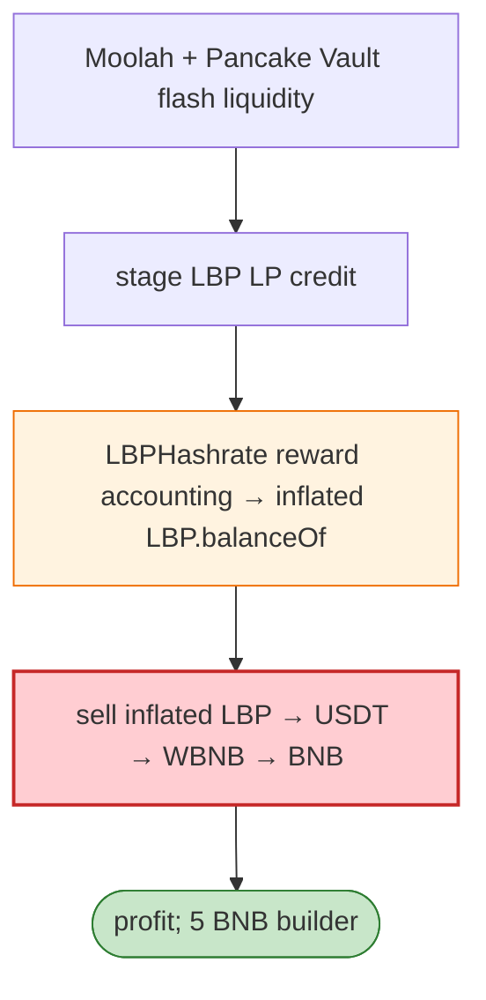

# LBP Exploit — Staged LP Credit + `LBPHashrate` Reward Accounting Inflation

> **Reproduction:** the PoC compiles & runs in an isolated Foundry project at
> [this project folder](.). Full verbose trace: [output.txt](output.txt).
> Verified vulnerable source: [LBP](sources/LBP_88886f), [LBPHashrate](sources/LBPHashrate_5E3cBc).

---

## Key info

| | |
|---|---|
| **Loss** | BNB profit (BSC); sender `0xb26DFE6b…` |
| **Vulnerable contract** | LBP token `0x88886f0f…`; `LBPHashrate` reward `0x5E3cBc…` |
| **Flash liquidity** | Moolah + Pancake Vault |
| **Chain / block / date** | BSC / Jun 2026 |
| **Bug class** | Reward accounting — staged LBP LP credit triggers `LBPHashrate` reward accounting; the inflated `LBP.balanceOf()` is then sold. |

---

## TL;DR

Per the embedded analysis: the attacker used Moolah and Pancake Vault flash liquidity to **stage LBP LP
credit**, trigger **`LBPHashrate` reward accounting**, and sell the **inflated LBP balance exposed by
`LBP.balanceOf()`**. The final USDT was swapped to WBNB, unwrapped, and forwarded as BNB profit after a
5 BNB builder payment.

---

## Root cause

A **reward-accounting path (`LBPHashrate`) keyed off staged LP credit** that inflates `balanceOf`,
which the attacker can immediately sell.

---

## Diagrams



---

## Remediation

1. Reward accounting must use committed (settled) balances, not staged/flash LP credit.
2. Epoch/lockup before reward-bearing balances become sellable.

---

## How to reproduce

```bash
_shared/run_poc.sh 2026-06-LBP_exp -vvvvv
```

- RPC: BSC archive. Result: `[PASS]` — inflated LBP sold for BNB profit.

---

*Reference: LBP LP-credit + LBPHashrate reward inflation, BSC, Jun 2026.*
