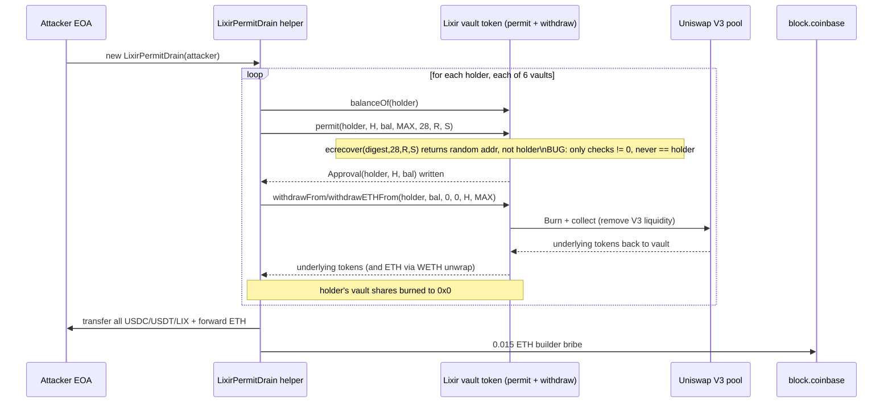
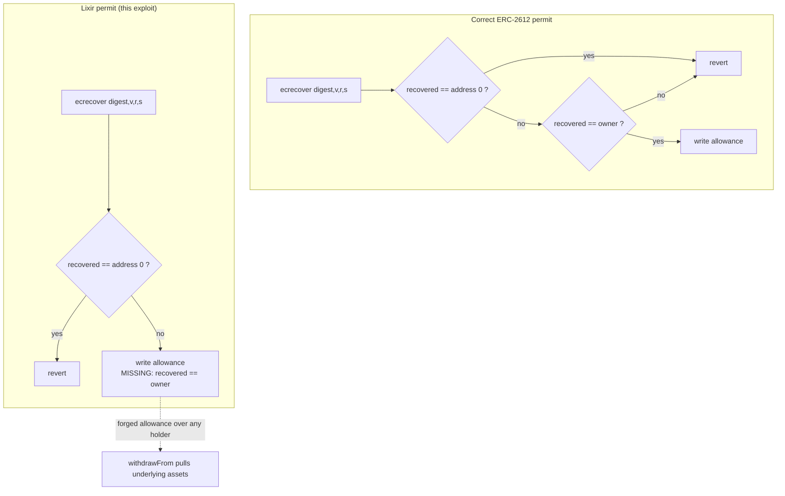

# Lixir vault `permit` signature bypass — any holder's vault shares drained with a forged signature

> **Vulnerability classes:** vuln/auth/signature-validation · vuln/logic/missing-check
> **Reproduction:** the PoC compiles & runs in an isolated Foundry project at [this project folder](.). Full verbose trace: [output.txt](output.txt). The vulnerable vault contracts are **not source-verified on Etherscan** (both the ERC20-proxy `0xfD4c…78390` and the shared logic `0x2Ce1…95CD` return UNVERIFIED); the `permit` logic below is **RECONSTRUCTED FROM THE -vvvvv TRACE**, which shows the exact precompile calls, return values, and emitted events.

---

## Key info

| | |
|---|---|
| **Loss** | 2.60 ETH, 4,477.72 USDC, 3,609.95 USDT, 24,182.56 LIX (≈ $33k at the time) |
| **Vulnerable contract** | Lixir vault tokens — [`0xfD4c…78390`](https://etherscan.io/address/0xfD4c9a491DD777b8b3e13659e9E379252eC78390) (and 5 siblings), logic impl [`0x2Ce1…95CD`](https://etherscan.io/address/0x2Ce186c52Cf150000Bf8ad2B4679D4aD619395CD) |
| **Attacker EOA** | [`0x3Fa8…a6cf`](https://etherscan.io/address/0x3Fa8cF7FeA68C8E76A9838d77889464DdFb6a6cf) |
| **Attack contract** | [`0xEFd1…9b76`](https://etherscan.io/address/0xEFd1b12F5E3c35D7daE0D1449674C247566f9b76) |
| **Attack tx** | [`0x1702…a41da`](https://etherscan.io/tx/0x17026faca0b8e4cb7531e4fb277c390eb165e81229628e0192923ad1d90a41da) |
| **Chain / block / date** | Ethereum mainnet / 25,391,315 / 2026-06 |
| **Compiler** | Unverified (source not published on Etherscan) |
| **Bug class** | Lixir's ERC-2612 `permit` only checked that `ecrecover(...)` returned a non-zero address; it never compared the recovered signer to `owner`, so any attacker could mint a fully valid allowance over any holder's vault shares using a dummy `(v,r,s)` and immediately call `withdrawFrom`/`withdrawETHFrom` to take the underlying assets. |

## TL;DR

Lixir is a Uniswap-v3 active-liquidity manager. Users deposit into a per-pair vault (an ERC-20 "Lixir vault token", `lv_X-Y A/B`) and the vault parks the liquidity inside Uniswap V3 positions; the vault token is the receipt. Like many receipt tokens it implements ERC-2612 `permit()` so a holder can approve a spender with an off-chain signature instead of an on-chain `approve` tx.

The fatal flaw is in that `permit`. A correct ERC-2612 implementation runs the digest through `ecrecover` and requires the returned address to equal `owner`. Lixir's implementation instead only checked that the precompile returned *something* — `recovered != address(0)` — and skipped the `recovered == owner` comparison entirely. Because `ecrecover` always returns a non-zero address for any well-formed `(hash, v, r, s)` (it has no notion of a "wrong" signature, only a malformed one), the attacker could pass a completely made-up `v=28, r, s` constant and `permit` would dutifully write `_allowance[owner][attacker] = value`.

The attacker ran this against every holder of all six Lixir vaults (`lv_WETH-USDC A/B`, `lv_LIX-WETH A/B`, `lv_USDC-USDT A/B`), granting themselves an allowance equal to each holder's full `balanceOf`, then called `withdrawETHFrom`/`withdrawFrom` to burn the shares and pull out the underlying WETH/USDC/USDT/LIX. The local fork run ends with the attacker holding **2.588 ETH, 4,477.72 USDC, 3,609.95 USDT and 24,182.56 LIX**, and pays a **0.015 ETH** builder bribe exactly as the original tx did. Total: 82 forged permits, 41 non-zero drains.

The exploit is fully permissionless — no privileged role, no flash loan, no price manipulation. Anyone could run it against any holder at any time.

## Background — what Lixir does

Lixir is an active-liquidity manager built on top of Uniswap V3. Each "Lixir vault" wraps a single V3 pool (e.g. WETH/USDC 0.05%) and a single concentrated-liquidity range. A user deposits the two underlying tokens and receives vault shares — an ERC-20 called `lv_<PAIR> <A|B>` (the `A`/`B` suffix denotes two complementary ranges per pair). Internally the vault:

- holds the two tokens plus the accrued fees,
- pushes capital into one or two V3 `NonfungiblePositionManager` positions (`positions(mapKey)` → `Burn` + `collect` are visible in the trace),
- redeems shares 1:1 against the vault's pro-rata holdings on `withdraw`.

To support gas-less approvals (and meta-tx relayers) the vault token implements **ERC-2612 `permit`**: a holder signs an EIP-712 structured message `(owner, spender, value, nonce, deadline)` off-chain; a relayer submits it on-chain; the contract recovers the signer from the signature and, if it matches `owner`, sets `_allowance[owner][spender] = value` and bumps the nonce.

The vault also exposes "on-behalf-of" withdrawal entry points — `withdrawFrom(owner, shares, min0, min1, to, deadline)` and `withdrawETHFrom(...)` (the latter unwraps the WETH leg to plain ETH). Both consume the standard allowance. So a valid allowance over someone's shares is a valid key to their underlying assets. That is exactly the property the broken `permit` handed out for free.

## The vulnerable code

> The vault contracts are **not source-verified** (Etherscan returns UNVERIFIED for both the proxy and the logic). The code below is **RECONSTRUCTED FROM THE -vvvvv TRACE**. Every claim is anchored to a trace line showing what the bytecode actually did at runtime.

### The `permit` function (RECONSTRUCTED)

The trace shows, for every victim, the exact same call shape:

```solidity
// RECONSTRUCTED from output.txt — the shared logic at 0x2Ce1…95CD (delegatecall target)
function permit(
    address owner,
    address spender,
    uint256 value,
    uint256 deadline,
    uint8 v,
    bytes32 r,
    bytes32 s
) external {
    if (block.timestamp > deadline) revert();              // deadline is honoured (type(uint256).max passed)
    bytes32 structHash = keccak256(abi.encode(
        _PERMIT_TYPEHASH,
        owner,
        spender,
        value,
        _nonces[owner]++,
        deadline
    ));
    bytes32 digest = keccak256(abi.encodePacked("\x19\x01", _DOMAIN_SEPARATOR, structHash));
    address recovered = ecrecover(digest, v, r, s);        // [output.txt:1656]
    // BUG: the only check is non-zero. The required `require(recovered == owner, ...)` is MISSING.
    if (recovered == address(0)) revert();
    _approve(owner, spender, value);                        // [output.txt:1658] emit Approval
}
```

Trace evidence (one of 82 identical instances):

- `permit(...)` is called with `value` = the victim's full share balance, `deadline = type(uint256).max`, and **always the same `v=28, r=0xe7c93726…, s=0x6aa772b8…`** for every owner [output.txt:1654].
- Inside, `ecrecover(digest, 28, r, s)` is invoked once per call [output.txt:1656]. The digest changes per owner (it embeds `owner, spender, value`), so the **recovered address is different every time** — `0xce81AA…` [output.txt:1657], `0x39f945e8…` [output.txt:1787], `0x5359c975…` [output.txt:1913], `0x071Bc609…` [output.txt:2039], … — and **none of them ever equals the `owner` argument**.
- Despite the signer mismatch, the call does not revert: it immediately emits `Approval(owner, spender, value)` [output.txt:1658] and writes the allowance slot.

A correct implementation would have reverted on the very first call: `require(recovered == owner, "INVALID_SIGNATURE")`. Lixir's implementation only had `require(recovered != address(0))`, which `ecrecover` essentially never trips for any well-formed `(v ∈ {27,28}, r, s)` — so the check is satisfied by a signature that signs nothing for nobody.

### Why a *constant* dummy signature works

The attacker reuses the identical `(v=28, r=…, s=…)` for all 82 victims. This is a giveaway: they are not forging a signature for any particular owner. They just need *any* validly-shaped `(v,r,s)` so `ecrecover` returns a non-zero address. The digest fed to `ecrecover` changes per call (different `owner`/`value`), so the returned "signer" is a different random address each time, but the broken check doesn't care. The constants are hard-coded in the PoC (`V = 28`, fixed `R`, `S`) [test/LixirPermitDrain_exp.sol:118-120].

### Drain path — the on-behalf-of withdrawal

Once the forged allowance is set, `withdrawETHFrom` / `withdrawFrom` consume it normally. The trace for the first victim shows the canonical flow:

1. `withdrawETHFrom(owner, shares, 0, 0, attacker, type(uint256).max)` [output.txt:1664].
2. Allowance cleared (`Approval(owner, spender, 0)`) and shares burned (`Transfer(owner, 0x0, shares)`) [output.txt:1666-1667].
3. Vault pulls its capital out of Uniswap V3: `positions()` → `Burn` (two ranges) [output.txt:1687, 1726] → `collect` returns USDC + WETH to the vault [output.txt:1696, 1735].
4. Vault transfers the ERC20 leg to the attacker (`Transfer(vault, drainHelper, 319_431_787)` USDC) [output.txt:1757] and unwraps+forwards the WETH as raw ETH (`WETH9.Withdrawal` + native call) [output.txt:1765-1768].

41 of the 82 targeted holders had non-zero balances and were drained; the rest were skipped via the `if (shares == 0) continue;` guard in the helper.

## Root cause — why it was possible

1. **Missing signer-identity check.** `permit` validated the *shape* of the `ecrecover` result (`!= address(0)`) but never its *identity* (`== owner`). This is the single load-bearing defect; every other step (deadline, nonce bump, allowance write, event) worked correctly.
2. **`ecrecover` semantics exploited.** The precompile returns `address(0)` only for structurally invalid inputs (bad `v`, out-of-range `s`, etc.). For any well-formed `(v, r, s)` it returns *some* 20-byte address. The non-zero check is therefore trivially satisfied by a constant dummy signature and proves nothing about who signed.
3. **Allowance = key to underlying assets.** The vault token is the receipt for vault deposits, and `withdrawFrom`/`withdrawETHFrom` spend the standard allowance. A forged allowance is therefore a forged claim on the underlying tokens, not just the (worthless-to-attacker) vault shares — the shares are burned and the assets are sent to `to`.
4. **Permissionless & scan-able.** Holders and balances are public (`balanceOf` over the transfer graph), so the attacker enumerated all six vaults' holders offline and hit every non-zero balance in one tx. No privileged role, no precondition beyond the bug itself.

## Preconditions

- **None beyond the bug.** Permissionless — any externally owned account or contract can call `permit` with a forged signature for any `owner` whose nonce is unused.
- No flash loan needed (the attacker takes real assets directly; nothing must be repaid).
- No privileged role, no governance, no oracle dependence.
- The only operational detail is enumerating holders with non-zero `balanceOf` across the six vaults — trivially derived from the vault tokens' `Transfer` history.

## Attack walkthrough (with on-chain numbers from the trace)

All 82 forged-permit + withdraw pairs run inside the constructor of a single `LixirPermitDrain` helper [output.txt:1649]. Per victim the sequence is identical; the table below summarises the first WETH/USDC-A drain, then aggregates.

| Step | Call | Effect | Trace |
|------|------|--------|-------|
| 1 | `permit(holder, drain, balanceOf(holder), type(uint256).max, 28, R, S)` | `ecrecover(digest, 28, R, S)` returns e.g. `0xce81AA…` (≠ holder); non-zero → passes; `Approval(holder, drain, value)` emitted | [output.txt:1654-1658] |
| 2 | `withdrawETHFrom(holder, shares, 0, 0, drain, type(uint256).max)` | allowance cleared; `Transfer(holder, 0x0, 256_433_041_811_851)` shares burned | [output.txt:1664-1667] |
| 3 | (inside withdraw) vault `Burn` on V3 ranges | liquidity removed from Uniswap | [output.txt:1687, 1726] |
| 4 | (inside withdraw) `collect` | USDC + WETH moved pool→vault | [output.txt:1696, 1735] |
| 5 | vault → drain | `Transfer(vault, drain, 319_431_787)` USDC (≈ 319.43 USDC) | [output.txt:1757] |
| 6 | vault unwraps WETH → ETH to drain | `WETH9.Withdrawal(0.4244 ETH)` + native transfer | [output.txt:1765-1768] |

This repeats across all six vaults:

- `lv_WETH-USDC A` (4 holders), `lv_LIX-WETH A` (15), `lv_WETH-USDC B` (2), `lv_LIX-WETH B` (18) → drained via `withdrawETHFrom` (WETH unwrapped to ETH, plus USDC / LIX legs).
- `lv_USDC-USDT A` (1), `lv_USDC-USDT B` (1) → drained via `withdrawFrom` (stablecoin pair, no ETH leg).

Totals: **82** `permit` calls, **82** `withdrawFrom`/`withdrawETHFrom` calls, **41** actual burns (the other 41 holders had zero balance and were skipped).

### Profit / loss accounting (from output.txt)

| Asset | Before | After | Profit |
|-------|--------|-------|--------|
| ETH   | 0 | 2.588255642603989317 | **+2.588 ETH** |
| USDC  | 0 | 4,477.722585 | **+4,477.72 USDC** |
| USDT  | 0 | 3,609.950462 | **+3,609.95 USDT** |
| LIX   | 0 | 24,182.560323103174179821 | **+24,182.56 LIX** |

Before/after lines: [output.txt:1564-1573]; final balance assertions: [output.txt] tail (`4477722585` USDC, `3609950462` USDT, `24182560323103174179821` LIX, `2588255642603989317` wei ETH).

A **0.015 ETH** bribe is paid to `block.coinbase` (`0x4838…5F97`) exactly as in the original tx [output.txt:1649-tail], leaving the 2.588 ETH net above. The PoC asserts both the profit and the builder payment (`assertEq(... , 0.015 ether, "builder payment")`).

## Diagrams





## Remediation

1. **Restore the identity check.** In `permit`, after `ecrecover`, require the recovered address equals `owner`:
   ```solidity
   address recovered = ecrecover(digest, v, r, s);
   require(recovered != address(0) && recovered == owner, "INVALID_SIGNATURE");
   ```
   This is the OZ/Solmate ERC-2612 standard; dropping the `== owner` clause removes all security from the function.
2. **Use a vetted implementation.** Inherit `ERC20Permit` from OpenZeppelin Contracts (or Solmate's `ERC2612`) rather than hand-rolling. Both include the `recovered == owner` check, EIP-2-compliant `s` range validation (`s` lower-half), and `v ∈ {27, 28}` validation.
3. **Validate signature components.** Reject `v ∉ {27,28}`, `s > secp256k1n/2`, and `r,s` outside the curve order. These make the non-zero `ecrecover` result meaningful and prevent malleability. (The attack here did not even need malleability — the components were valid and constant — but hardening prevents other variants.)
4. **Verify & publish source.** The vaults were unverified at exploit time. Source verification plus a re-audit of the `permit` path would have surfaced this trivially.
5. **Add a regression test.** A test calling `permit(owner=alice, …)` with a signature that only signs for `bob` must revert. The fact this passed review indicates no such negative test existed.

## How to reproduce

The PoC runs **fully offline** via the shared anvil harness from the committed `anvil_state.json` — no RPC needed.

```bash
_shared/run_poc.sh 2026-06-LixirPermitDrain_exp -vvvvv
```

Fork: Ethereum mainnet at block **25,391,315**, loaded from `anvil_state.json` (the PoC's `setUp` calls `vm.createSelectFork("http://127.0.0.1:8545", 25_391_315)`). The harness spins up a local anvil, replays the committed state, and runs `forge test --match-test testExploit -vvvvv`.

Expected tail of `output.txt`:

```
[PASS] testExploit() (gas: 7210400)
  === Before exploit ===
   ETH Balance: 0.000000000000000000
   USDC Balance: 0.000000
   USDT Balance: 0.000000
   LIX Balance: 0.000000000000000000
  === After exploit ===
   ETH Balance: 2.588255642603989317
   USDC Balance: 4477.722585
   USDT Balance: 3609.950462
   LIX Balance: 24182.560323103174179821
...
1 tests passed, 0 failed, 0 skipped
```

Local run **PASSED** — `[PASS]` and the before→after balances above are present in [output.txt](output.txt) (lines 1562-1573 and the closing summary). The exploit is deterministic and reproducible.

*Reference: <https://x.com/DefimonAlerts/status/2070362661691207935>*
