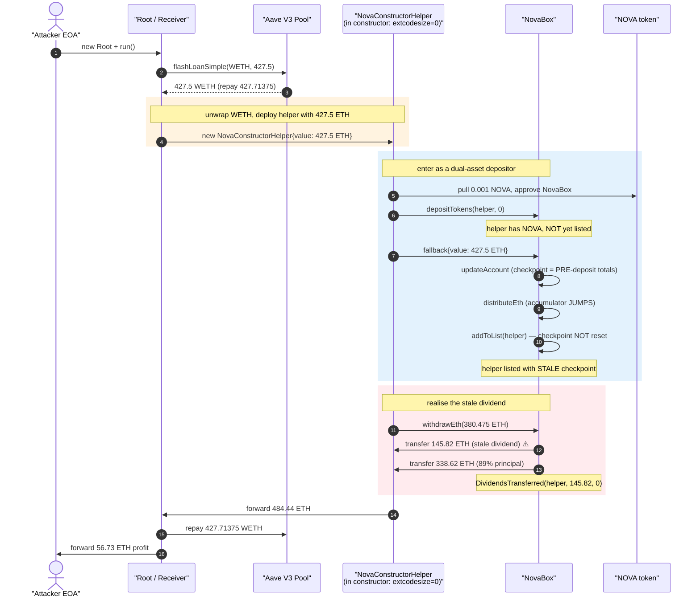
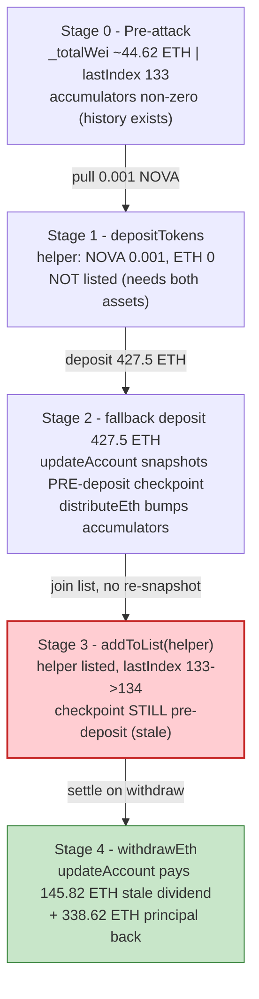
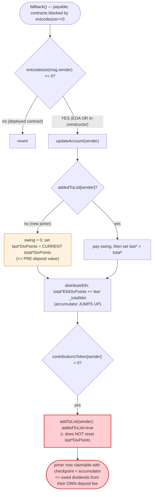
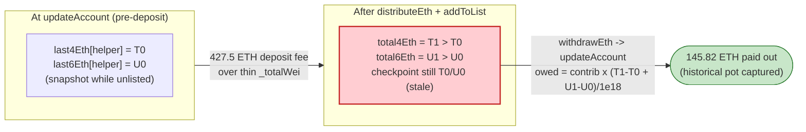

# NovaBox Exploit — Stale Dividend Checkpoint on Join + Constructor `extcodesize` Bypass

> **Vulnerability classes:** vuln/logic/state-update · vuln/access-control/broken-logic

> **Reproduction:** the PoC compiles & runs in an isolated Foundry project at
> [this project folder](.). The fork is served offline from the local
> `anvil_state.json`, so no public archive RPC is needed.
> Full verbose trace: [output.txt](output.txt).
> Verified vulnerable source: [NovaBox.sol](sources/NovaBox_bc4191/NovaBox.sol).

---

## Key info

| | |
|---|---|
| **Loss** | **56.73 ETH** drained from the NovaBox dividend pot (~56.729621359923131444 ETH net profit asserted by the PoC, [output.txt:1540](output.txt)) |
| **Vulnerable contract** | `NovaBox` — [`0xbc4191167D4B0251cAB5201a527Daa8a7d3846b0`](https://etherscan.io/address/0xbc4191167D4B0251cAB5201a527Daa8a7d3846b0#code) |
| **Victim pool/vault** | `NovaBox` itself — it both holds the contributed ETH and pays the dividends (self-victim) |
| **Dividend token** | `NovaChain (NOVA)` — [`0x72FBc0fc1446f5AcCC1B083F0852a7ef70a8ec9f`](https://etherscan.io/address/0x72FBc0fc1446f5AcCC1B083F0852a7ef70a8ec9f#code) |
| **Attacker EOA** | [`0x3690c5EFc63eeA1167c4d92a3f2dD8afdb85C294`](https://etherscan.io/address/0x3690c5EFc63eeA1167c4d92a3f2dD8afdb85C294) |
| **Attacker contract** | `0xB50bE385f6EB02aE379DA3D3A1BB58a0dc260858` |
| **Attack tx** | [`0x0cfa357e9e4db1540246f17cb6bfa0634ff8727d7cf241b63fb22605021c8844`](https://etherscan.io/tx/0x0cfa357e9e4db1540246f17cb6bfa0634ff8727d7cf241b63fb22605021c8844) |
| **Flash source** | Aave V3 Pool — `0x87870Bca3F3fD6335C3F4ce8392D69350B4fA4E2` (427.5 WETH, 0.05% premium) |
| **Chain / block / date** | Ethereum mainnet / fork @ 25,281,767 / June 2026 |
| **Compiler / optimizer** | Solidity v0.4.25 (`+commit.59dbf8f1`), optimizer **enabled, 200 runs** (per `_meta.json`) |
| **Bug class** | Dividend-accounting flaw: new depositors join the dividend list **without snapshotting their dividend checkpoints to the post-distribution totals**, so they are immediately owed dividends generated by their *own* deposit fees; combined with an `extcodesize(msg.sender) == 0` contract-check that is bypassable during a constructor |

---

## TL;DR

1. `NovaBox` is a 2018-era "ETH+NOVA dividend box" written in Solidity 0.4.25. Depositing ETH or NOVA
   levies an 11% fee; the fee is distributed to existing dual-asset depositors via a points-based
   accumulator (`total4EthDivPoints` / `total6EthDivPoints` and the token equivalents,
   [NovaBox.sol:162-176](sources/NovaBox_bc4191/NovaBox.sol#L162-L176)).

2. To receive dividends an address must hold **both** ETH and NOVA contributions and be in the
   investor list (`addedToList[addr] == true`). An address is added to the list by `addToList`
   ([NovaBox.sol:242-254](sources/NovaBox_bc4191/NovaBox.sol#L242-L254)) — but **`addToList` never
   initialises the joiner's `last*DivPoints` checkpoints to the current accumulator totals.**

3. The ETH-deposit fallback runs `updateAccount(sender)` *before* it distributes the new deposit's
   fee and *before* it adds the sender to the list ([NovaBox.sol:288-317](sources/NovaBox_bc4191/NovaBox.sol#L288-L317)).
   Because the sender is not yet on the list, `updateAccount` records `last*DivPoints[sender]` at the
   *pre-deposit* accumulator value, then the deposit's own 10% fee **bumps the accumulator higher**, and
   only then is the sender added — with a stale checkpoint pinned below the new total.

4. On the very next `updateAccount` (inside `withdrawEth`, [NovaBox.sol:325](sources/NovaBox_bc4191/NovaBox.sol#L325))
   the joiner is now on the list, so `eth4DivsOwing`/`eth6DivsOwing`
   ([NovaBox.sol:182-193](sources/NovaBox_bc4191/NovaBox.sol#L182-L193)) compute
   `contribution × (currentTotal − staleCheckpoint)` and pay out **dividends the depositor was never
   entitled to** — value generated by their own (and any concurrent) deposit fees.

5. Contracts are supposed to be blocked from depositing ETH: the fallback requires
   `extcodesize(msg.sender) == 0` ([NovaBox.sol:278-283](sources/NovaBox_bc4191/NovaBox.sol#L278-L283)).
   The attacker defeats this by doing **all** of the deposit/withdraw work from inside a
   `NovaConstructorHelper` **constructor** ([NovaBox_exp.sol:195-217](test/NovaBox_exp.sol#L195-L217)) —
   while a contract is being constructed it has **zero deployed code**, so `extcodesize` reads 0.

6. Funded by a 427.5 WETH Aave V3 flash loan ([output.txt:1613](output.txt)), the helper seeds 0.001
   NOVA, `depositTokens`, deposits 427.5 ETH through the fallback, then `withdrawEth` — pulling back the
   89% principal (338.62 ETH) **plus 145.82 ETH of stale dividends** ([output.txt:1709](output.txt)).

7. After repaying the flash loan (427.5 + 0.21375 premium) the attacker keeps the difference:
   **56.729621359923131444 ETH** ([output.txt:1540](output.txt)), asserted `> 50 ETH` by the PoC
   ([NovaBox_exp.sol:98](test/NovaBox_exp.sol#L98), [NovaBox_exp.sol:112](test/NovaBox_exp.sol#L112)).

---

## Background — what NovaBox does

`NovaBox` ([source](sources/NovaBox_bc4191/NovaBox.sol)) is a small ETH/NOVA "dividend box" with an
explicit fee policy documented in its own header comment
([NovaBox.sol:115-130](sources/NovaBox_bc4191/NovaBox.sol#L115-L130)):

- **11% in/out fee on ETH and on NOVA.** Of each 11% ETH fee, 6% goes to NOVA holders, 4% to ETH
  holders, 1% to a fixed `owner` address. NOVA fees split the same way, with 1% airdropped.
- **Dual-asset rule.** *"you need to have both nova and eth to get dividends."* Only addresses that
  have contributed **both** ETH and NOVA are added to the investor list and accrue dividends.
- **Points-based dividend accounting.** Rather than iterate the investor list, NovaBox maintains four
  global accumulators that grow each time a fee is distributed:

  | Accumulator | Grows on | Distribution basis |
  |---|---|---|
  | `total4EthDivPoints` | ETH-fee 4% leg | `_4percent × 1e18 / _totalWei` ([NovaBox.sol:445](sources/NovaBox_bc4191/NovaBox.sol#L445)) |
  | `total6EthDivPoints` | ETH-fee 6% leg | `_6percent × 1e18 / _totalTokens` ([NovaBox.sol:448](sources/NovaBox_bc4191/NovaBox.sol#L448)) |
  | `total4TokenDivPoints` | NOVA-fee 4% leg | `_4percent × 1e18 / _totalWei` ([NovaBox.sol:431](sources/NovaBox_bc4191/NovaBox.sol#L431)) |
  | `total6TokenDivPoints` | NOVA-fee 6% leg | `_6percent × 1e18 / _totalTokens` ([NovaBox.sol:434](sources/NovaBox_bc4191/NovaBox.sol#L434)) |

  A user's owed ETH dividend is `contributionsToken × (total6Eth − last6Eth[user]) / 1e18`
  (the NOVA-weighted 6% leg) plus `contributionsEth × (total4Eth − last4Eth[user]) / 1e18`
  (the ETH-weighted 4% leg) ([NovaBox.sol:182-193](sources/NovaBox_bc4191/NovaBox.sol#L182-L193)). The
  `last*DivPoints[user]` mappings are the per-user *checkpoints* — the accumulator value the last time
  the user was settled. The entire correctness of the scheme depends on a user's checkpoint being set
  to the current accumulator total **at the moment they join**, so they cannot claim any of the
  history that accrued before them.

On-chain state observed at the fork block, reconstructed from the trace (all values raw 18-decimal
wei; the contract pre-existed real depositors, so the global accumulators were already non-zero):

| Parameter | Value | Note |
|---|---|---|
| `pointMultiplier` | `1e18` | fixed-point scale ([NovaBox.sol:160](sources/NovaBox_bc4191/NovaBox.sol#L160)) |
| ETH fee split | 6% NOVA / 4% ETH / 1% owner | of an 11% gross fee on each deposit/withdraw |
| `_totalWei` before attack (slot 9) | `0x…026b311f1ddc6fc040` ≈ 44.62 ETH | denominator for the 4% ETH leg ([output.txt:1693](output.txt)) |
| `_totalTokens` before attack (slot 8) | `0x…46a7de528a3c1f68fbb4` ≈ 333,662 NOVA | denominator for the 6% ETH leg ([output.txt:1702](output.txt)) |
| `lastIndex` before attack (slot 6) | `133` | 133 existing dual-asset investors ([output.txt:1692](output.txt)) |
| NOVA seed used by attacker | `1000000000000000` (1e15 = 0.001 NOVA) | ([output.txt:1596](output.txt)) |
| Owner 1% sink | `0x01e806d7FCA11320E96480f7a6E55ad98356237a` | receives the 1% legs ([output.txt:1689](output.txt)) |

The pre-attack `_totalWei` of only ~44.62 ETH is decisive: when the attacker deposits 427.5 ETH, the
4%/6% legs of that deposit's fee are divided across a tiny `_totalWei`/`_totalTokens` base, producing a
large *per-unit* jump in the accumulators — and the attacker, joining with a stale (pre-jump) checkpoint
and a huge contribution, captures almost all of it.

---

## The vulnerable code

### 1. The dividend-owed formula keys off `last*DivPoints` checkpoints

```solidity
function eth6DivsOwing(address _addr) public view returns (uint) {
    if (!addedToList[_addr]) return 0;
    uint newEth6DivPoints = total6EthDivPoints.sub(last6EthDivPoints[_addr]);

    return contributionsToken[_addr].mul(newEth6DivPoints).div(pointMultiplier);
}

function eth4DivsOwing(address _addr) public view returns (uint) {
    if (!addedToList[_addr]) return 0;
    uint newEth4DivPoints = total4EthDivPoints.sub(last4EthDivPoints[_addr]);
    return contributionsEth[_addr].mul(newEth4DivPoints).div(pointMultiplier);
}
```
([NovaBox.sol:182-193](sources/NovaBox_bc4191/NovaBox.sol#L182-L193))

The payout equals `contribution × (currentAccumulator − userCheckpoint)`. If `userCheckpoint` is *below*
the accumulator at the time the user first becomes claimable, the user is paid for history they did not
participate in.

### 2. `updateAccount` snapshots checkpoints, but only matters once you're on the list

```solidity
function updateAccount(address account) private {
    uint owingEth6 = eth6DivsOwing(account);
    uint owingEth4 = eth4DivsOwing(account);
    uint owingEth  = owingEth4.add(owingEth6);
    ...
    if (owingEth > 0) {
      account.transfer(owingEth);          // ← pays out ETH dividends
    }
    ...
    last6EthDivPoints[account] = total6EthDivPoints;
    last4EthDivPoints[account] = total4EthDivPoints;
    last6TokenDivPoints[account] = total6TokenDivPoints;
    last4TokenDivPoints[account] = total4TokenDivPoints;

    emit DividendsTransferred(account, owingEth, owingToken);
}
```
([NovaBox.sol:212-238](sources/NovaBox_bc4191/NovaBox.sol#L212-L238))

When `addedToList[account] == false`, every `*DivsOwing` helper returns `0`, so `updateAccount` pays
nothing — but it **does** write `last*DivPoints[account] = total*DivPoints`. Crucially this happens
*before* the current deposit's fee is distributed (see below), so the checkpoint is frozen at the
*pre-deposit* total.

### 3. `addToList` adds the joiner but does **not** re-snapshot checkpoints

```solidity
function addToList(address sender) private {
    addedToList[sender] = true;
    // if the sender is not in the list
    if (indexes[sender] == 0) {
      _totalTokens = _totalTokens.add(contributionsToken[sender]);
      _totalWei = _totalWei.add(contributionsEth[sender]);

      // add the sender to the list
      lastIndex++;
      addresses[lastIndex] = sender;
      indexes[sender] = lastIndex;
    }
}
```
([NovaBox.sol:242-254](sources/NovaBox_bc4191/NovaBox.sol#L242-L254))

This is the bug. The moment `addedToList[sender]` flips to `true`, `eth*DivsOwing` stop returning 0 and
start returning `contribution × (currentTotal − last*DivPoints[sender])`. But `last*DivPoints[sender]`
was never reset to `total*DivPoints` *after the deposit's own fee was distributed* — so the joiner is
owed the delta the deposit itself just created.

### 4. The ETH fallback ordering: settle → distribute → join

```solidity
function () payable public {
    address sender = msg.sender;
    uint codeLength;
    assembly { codeLength := extcodesize(sender) }
    require(codeLength == 0);                 // ← "no contracts" — bypassed during construction

    uint weiAmount = msg.value;

    updateAccount(sender);                    // (a) settle: sets last*DivPoints = PRE-deposit totals

    require(weiAmount > 0);
    uint _89percent = weiAmount.mul(89).div(100);
    uint _6percent  = weiAmount.mul(6).div(100);
    uint _4percent  = weiAmount.mul(4).div(100);
    uint _1percent  = weiAmount.mul(1).div(100);

    distributeEth(_6percent, _4percent);      // (b) BUMPS total*EthDivPoints higher
    owner.transfer(_1percent);

    contributionsEth[sender] = contributionsEth[sender].add(_89percent);
    if (indexes[sender]>0) { _totalWei = _totalWei.add(_89percent); }

    if (contributionsToken[sender]>0) addToList(sender);  // (c) join — checkpoint still at PRE-deposit
}
```
([NovaBox.sol:272-318](sources/NovaBox_bc4191/NovaBox.sol#L272-L318))

Steps (a)→(b)→(c) are the exact ordering that creates the stale checkpoint: the checkpoint is snapshotted
in (a) before the accumulator jumps in (b), and the join in (c) never re-snapshots it.

### 5. `withdrawEth` realises the stale dividend

```solidity
function withdrawEth(uint amount) public {
    address sender = msg.sender;
    require(amount>0 && contributionsEth[sender] >= amount);

    updateAccount(sender);                    // ← now addedToList==true ⇒ pays stale dividend
    ...
    sender.transfer(_89percent);              // ← returns 89% of principal too
    distributeEth(_6percent, _4percent);
    owner.transfer(_1percent);
}
```
([NovaBox.sol:321-349](sources/NovaBox_bc4191/NovaBox.sol#L321-L349))

By the time `withdrawEth` calls `updateAccount`, the attacker is on the list with a stale checkpoint, so
the owed-dividend formula fires and transfers the historical ETH out.

---

## Root cause — why it was possible

Two independent defects compose into the loss:

1. **Missing checkpoint initialisation on list join.** A correct points-based dividend system MUST set
   the joiner's checkpoint to the *current* accumulator total at the instant they become eligible. NovaBox
   does not: `addToList` ([NovaBox.sol:242-254](sources/NovaBox_bc4191/NovaBox.sol#L242-L254)) flips
   `addedToList` to `true` without writing `last*DivPoints`, and the only place those checkpoints are
   written — `updateAccount` — runs *before* the join and *before* the deposit's fee distribution. The
   net effect is that a brand-new dual-asset depositor's checkpoint lags the accumulator by exactly the
   jump their own deposit (and any concurrent activity) produced, so they are immediately owed
   dividends they never earned. With a thin existing `_totalWei` (~44.62 ETH) and a giant 427.5 ETH
   deposit, that "jump" is enormous and the joiner's slice of it is most of the historical pot.

2. **`extcodesize`-based "EOA only" check is bypassable in a constructor.** The fallback blocks contract
   depositors with `require(extcodesize(msg.sender) == 0)`
   ([NovaBox.sol:278-283](sources/NovaBox_bc4191/NovaBox.sol#L278-L283)). During its own construction a
   contract has **no deployed runtime code**, so `extcodesize` returns 0 — the classic 0.4.x EOA-detection
   anti-pattern. The attacker performs `depositTokens` + ETH deposit + `withdrawEth` entirely from inside
   `NovaConstructorHelper`'s constructor ([NovaBox_exp.sol:199-217](test/NovaBox_exp.sol#L199-L217)), so
   the contract-blocking guard never trips even though every caller is a contract.

The dual-asset eligibility rule and the 11% fee are not protections against this — they are the very
mechanism being abused. The attacker satisfies "both ETH and NOVA" with a 0.001 NOVA dust deposit and a
flash-loaned 427.5 ETH deposit, joins the list with a stale checkpoint, and immediately exits.

---

## Preconditions

- **A non-trivial pre-existing dividend history.** The exploit pays out
  `contribution × (currentTotal − staleCheckpoint)`. The 133 existing investors and prior fee flow gave
  the global accumulators a meaningful value, and the thin `_totalWei` (~44.62 ETH,
  [output.txt:1693](output.txt)) made each new fee leg per-unit-large.
- **Both assets contributed in one flow.** The attacker must hold `contributionsToken > 0` *and*
  `contributionsEth > 0` so that `addToList` fires (token deposit first via `depositTokens`, then the ETH
  fallback). 0.001 NOVA suffices ([output.txt:1596](output.txt)).
- **A way to deposit ETH as a contract.** The `extcodesize == 0` guard is defeated by acting from a
  constructor — no special privilege needed.
- **Working capital in ETH to size the deposit.** Peak outlay was 427.5 ETH, fully recovered
  intra-transaction, hence **flash-loanable**. The PoC borrows it from the Aave V3 Pool via
  `flashLoanSimple` ([NovaBox_exp.sol:158-159](test/NovaBox_exp.sol#L158-L159),
  [output.txt:1613](output.txt)) and repays principal + 0.05% premium.

---

## Attack walkthrough (with on-chain numbers from the trace)

All figures are taken directly from the trace in [output.txt](output.txt). Amounts are raw 18-decimal
wei with human approximations in parentheses. The "NovaBox state" column tracks the attacker's position
and the dividend payout.

| # | Step | Amount (raw wei) | NovaBox state / effect |
|---|------|-----------------:|------------------------|
| 0 | **Seed NOVA** — `deal` 1e15 NOVA to the root attack contract, later forwarded to the helper | `1000000000000000` (~0.001 NOVA) [output.txt:1596](output.txt) | Satisfies the "must hold NOVA" half of the dual-asset rule. |
| 1 | **Aave V3 flash loan** of WETH to the receiver | `427500000000000000000` (427.5 WETH) [output.txt:1613](output.txt); premium `213750000000000000` (0.21375) [output.txt:1634](output.txt) | Working capital; must repay 427.71375 WETH. |
| 2 | **Unwrap** WETH → ETH inside the receiver, then deploy `NovaConstructorHelper{value: 427.5 ETH}` | `427500000000000000000` (427.5 ETH) [output.txt:1635](output.txt) | All NovaBox calls now run from a constructor ⇒ `extcodesize(helper)==0`. |
| 3 | **`depositTokens(helper, 0)`** — settle (no divs, helper not listed), pull 1e15 NOVA, distribute its fee, airdrop 1% | NOVA in `1000000000000000` (1e15) [output.txt:1664](output.txt); 1% airdrop `10000000000000` (1e13) [output.txt:1671](output.txt) | `DividendsTransferred(helper, 0, 0)` [output.txt:1661](output.txt); helper now has `contributionsToken>0` but is **not** yet listed (no ETH yet). |
| 4 | **ETH deposit via fallback** `{value: 427.5 ETH}` — `updateAccount` (helper unlisted ⇒ checkpoint = pre-deposit totals), `distributeEth` bumps `total*EthDivPoints`, 1% to owner, then `addToList(helper)` | deposit `427500000000000000000` (427.5); owner 1% `4275000000000000000` (4.275) [output.txt:1689](output.txt) | `DividendsTransferred(helper, 0, 0)` [output.txt:1688](output.txt); `lastIndex` 133→134 (slot 6) [output.txt:1692](output.txt); helper joined with a **stale checkpoint**. |
| 5 | **Read credited ETH** — `contributionsEth(helper)` | `380475000000000000000` (380.475 = 89% of 427.5) [output.txt:1704-1705](output.txt) | The withdrawable principal. |
| 6 | **`withdrawEth(380.475 ETH)`** — `updateAccount` now pays the **stale dividend**, then returns 89% principal, distributes the withdraw fee, 1% to owner | dividend `145820044338375078272` (~145.82) [output.txt:1709](output.txt); principal back `338622750000000000000` (~338.62 = 89% of 380.475) [output.txt:1710](output.txt); owner 1% `3804750000000000000` (~3.80) [output.txt:1712](output.txt) | `DividendsTransferred(helper, 145820044338375078272, 0)` [output.txt:1709](output.txt) — the stale dividend is realised. |
| 7 | **Return ETH to receiver**, the receiver forwards everything to the root | receiver `receive{value: 484442794338375078272}` (~484.44 = 145.82 + 338.62) [output.txt:1727](output.txt) | Helper self-destructs at end of constructor; ETH consolidated. |
| 8 | **Repay Aave** — wrap 427.71375 WETH and approve the pool | `427713750000000000000` (427.71375) [output.txt:1730-1731](output.txt) | Principal 427.5 + premium 0.21375. |
| 9 | **Forward profit to attacker EOA** | `56729621359923131444` (~56.73) [output.txt:1771](output.txt) | `assertGt(profit, 50 ETH)` passes [output.txt:1775](output.txt). |

The single value-extraction event is the **145.82 ETH dividend** in step 6 — that is the historical ETH
pot the attacker siphons by joining with a stale checkpoint. Everything else (the 427.5 ETH deposit, the
89% principal returned, the flash loan) nets to roughly zero; the dividend minus the fees paid is the
profit.

### Profit / loss accounting (ETH, raw wei)

| Item | Amount (wei) | ~Human |
|---|---:|---:|
| Flash-loaned in (Aave) | 427,500,000,000,000,000,000 | 427.5 |
| ETH deposited into NovaBox (fallback) | −427,500,000,000,000,000,000 | −427.5 |
| Principal returned by `withdrawEth` (89% of 380.475) | +338,622,750,000,000,000,000 | +338.62275 |
| **Stale dividend paid by `updateAccount`** | **+145,820,044,338,375,078,272** | **+145.820044** |
| Owner 1% on the 427.5 ETH deposit | −4,275,000,000,000,000,000 | −4.275 |
| Owner 1% on the 380.475 ETH withdraw | −3,804,750,000,000,000,000 | −3.80475 |
| Flash-loan repayment (427.5 + 0.21375 premium) | −427,713,750,000,000,000,000 | −427.71375 |
| **Net profit (asserted in PoC)** | **56,729,621,359,923,131,444** | **~56.729621** |

The receiver consolidated `484.442794338375078272` ETH ([output.txt:1727](output.txt)) = principal
338.62275 + dividend 145.820044338375078272. After repaying 427.71375 WETH and minor wrapping
arithmetic, the attacker EOA receives `56,729,621,359,923,131,444` wei
([output.txt:1771](output.txt), [output.txt:1540](output.txt)) — the stale dividend net of the two 1%
owner fees and the flash-loan premium.

---

## Diagrams

### Sequence of the attack



### NovaBox state evolution



### The flaw inside the deposit/join flow



### Why the join is theft: checkpoint vs. accumulator



---

## Why each magic number

- **`flashAmount = 427.5 ether`** ([NovaBox_exp.sol:97](test/NovaBox_exp.sol#L97), borrowed at
  [output.txt:1613](output.txt)): the size of the ETH deposit. It is chosen large relative to the thin
  pre-existing `_totalWei` (~44.62 ETH) so that the attacker's `contributionsEth` (89% = 380.475 ETH)
  dwarfs the existing base and captures the bulk of the accumulator jump as a stale dividend. The Aave
  premium is 0.05% → `0.21375 ETH` ([output.txt:1634](output.txt)), repaid as part of 427.71375 WETH.
- **`sameBlockNovaSeed = 0.001 ether` (1e15 NOVA)** ([NovaBox_exp.sol:96](test/NovaBox_exp.sol#L96),
  [output.txt:1596](output.txt)): the minimum NOVA needed to satisfy the dual-asset rule so `addToList`
  fires. It is a dust amount because the NOVA leg's *size* is irrelevant to the ETH dividend — only the
  fact that the helper holds NOVA (so `contributionsToken[helper] > 0`) matters, and the
  `contributionsToken`-weighted 6% ETH leg pays on top.
- **`expectedMinimumProfit = 50 ether`** ([NovaBox_exp.sol:98](test/NovaBox_exp.sol#L98)): a sanity floor
  for the assertion `assertGt(profit, 50 ether)` ([output.txt:1775](output.txt)); the realised profit is
  ~56.73 ETH.
- **`randomTicket = 0` in `depositTokens(helper, 0)`** ([NovaBox_exp.sol:206](test/NovaBox_exp.sol#L206)):
  the airdrop ticket is cosmetic (emitted in the `AirDrop` event, [output.txt:1677](output.txt)); the
  attack does not depend on it. `randomAddr = address(this)` simply routes the 1% NOVA airdrop back to
  the helper.
- **The 89 / 6 / 4 / 1 split**: the contract's fixed fee policy. 89% of each deposit is credited as the
  user's contribution; the 6%+4% legs feed the dividend accumulators (the lever the attack pulls); the
  1% goes to `owner`. The attacker pays the 1% legs twice (deposit + withdraw) as the only real cost
  besides the flash-loan premium.

---

## Remediation

1. **Initialise the joiner's checkpoint on list entry.** In `addToList`, set
   `last6EthDivPoints[sender] = total6EthDivPoints; last4EthDivPoints[sender] = total4EthDivPoints;`
   (and the two token equivalents) at the moment `addedToList` flips to `true`. This guarantees a new
   depositor can never claim accumulator growth that occurred before — or during — the deposit that adds
   them.
2. **Distribute the deposit fee, then settle, then join — never settle-before-distribute for a joiner.**
   Reorder the fallback (and `depositTokens`) so that for a brand-new dual-asset depositor the checkpoint
   is taken *after* the deposit's own `distributeEth`/`distributeTokens`. Equivalently, treat the very
   first listing as a hard checkpoint reset.
3. **Do not exclude the current deposit's own fee from the depositor's stale window.** The depositor must
   not be owed any portion of the fee their own deposit generated; settle-on-join with a post-distribution
   checkpoint achieves this.
4. **Stop using `extcodesize == 0` to mean "EOA".** It returns 0 during a contract's constructor (and is
   trivially side-steppable). If contract participation must be blocked, do so by an explicit allowlist or
   by accepting that any "is-EOA" check is advisory; never make accounting safety depend on it.
5. **Cap or rate-limit single-deposit dividend exposure.** A deposit that is large relative to
   `_totalWei`/`_totalTokens` produces an outsized accumulator jump. Bound the per-deposit accumulator
   delta or require a minimum holding period before dividends become claimable, so a deposit-then-withdraw
   in a single transaction cannot harvest historical value.

---

## How to reproduce

The PoC runs **offline** against the bundled fork state (`anvil_state.json`); no public archive RPC is
required. `vm.createSelectFork("http://127.0.0.1:8545", 25_281_767)`
([NovaBox_exp.sol:83](test/NovaBox_exp.sol#L83)) points at the local anvil instance the shared harness
spins up from that state file.

```bash
_shared/run_poc.sh 2026-06-NovaBox_exp --mt testExploit -vvvvv
```

- The fork pins to Ethereum mainnet block **25,281,767**; the harness serves historical state from
  `anvil_state.json` on `127.0.0.1:8545`, so no third-party RPC is contacted.
- `foundry.toml` sets `evm_version = 'cancun'`. The vulnerable contracts are Solidity v0.4.25 but are
  forked as already-deployed bytecode; the PoC harness compiles with a modern Solc (0.8.34,
  [output.txt:1](output.txt)).
- Result: `[PASS] testExploit()` with `ETH profit after Aave repayment: 56.729621359923131444`.

Expected tail:

```
Ran 1 test for test/NovaBox_exp.sol:ContractTest
[PASS] testExploit() (gas: 3253826)
Logs:
  Attacker Before exploit ETH Balance: 0.000000000000000000
  ETH profit after Aave repayment: 56.729621359923131444
  Attacker After exploit ETH Balance: 56.729621359923131444

Suite result: ok. 1 passed; 0 failed; 0 skipped; finished in 14.68s (13.04s CPU time)
```

---

*Reference: DefimonAlerts — https://x.com/DefimonAlerts/status/2064616360466919793 (NovaBox, Ethereum mainnet, 56.73 ETH).*
