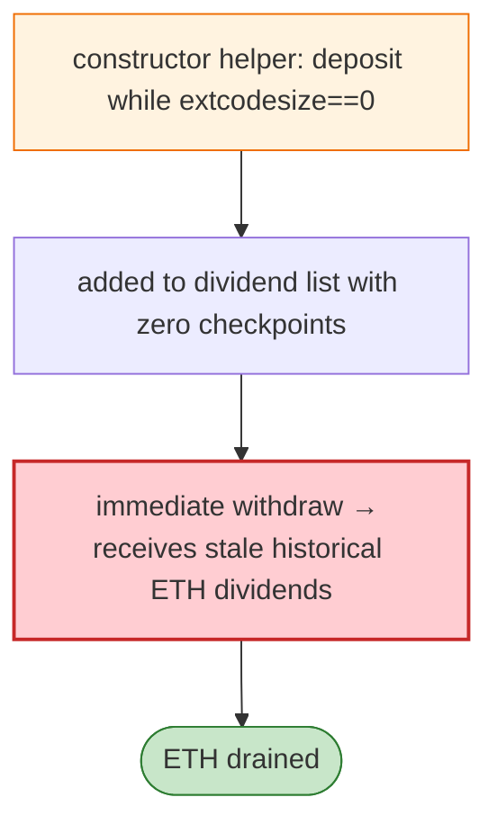

# NovaBox Exploit — Zero-Checkpoint Dividend Drain via Constructor-Helper Deposit

> **Reproduction:** the PoC compiles & runs in an isolated Foundry project at
> [this project folder](.). Full verbose trace: [output.txt](output.txt).
> Verified vulnerable source: [NovaBox](sources/NovaBox_bc4191), [NovaChain](sources/NovaChain_72FBc0).

---

## Key info

| | |
|---|---|
| **Loss** | ETH drained (mainnet); attacker `0x3690c5Ef…` |
| **Vulnerable contract** | NovaBox `0xbc419116…` |
| **Flash source** | Aave V3 (ETH) |
| **Chain / block / date** | Ethereum mainnet / Jun 2026 |
| **Bug class** | Dividend checkpoint — NovaBox blocks contract ETH deposits (`extcodesize(msg.sender)==0`) and adds new dual ETH/NOVA depositors to the dividend list **without initialising their dividend checkpoints**; the attacker deposits via a constructor helper (zero extcodesize), joins with zero checkpoints, withdraws, and receives stale historical dividends. |

---

## TL;DR

Per the embedded analysis: NovaBox blocks contract ETH deposits with `extcodesize(msg.sender) == 0` and
adds new dual ETH/NOVA depositors to the dividend list **without initializing their dividend
checkpoints**. The attacker **deposits through a constructor helper** (during construction, code size
is 0), joins the list with zero checkpoints, then immediately withdraws ETH and **receives stale
historical ETH dividends**.

---

## Root cause

Two flaws: (1) the `extcodesize==0` contract-detection is bypassable during construction; (2) new
dividend-list entries are added **without initialising their checkpoint** to the current dividend
cursor, so they claim from epoch 0.

---

## Diagrams



---

## Remediation

1. Initialise each new depositor's dividend checkpoint to the current cursor on join.
2. Don't rely on `extcodesize==0` for "is EOA"; block all contracts via `tx.origin`-less require or
   a deposit whitelist.

---

## How to reproduce

```bash
_shared/run_poc.sh 2026-06-NovaBox_exp -vvvvv
```

- RPC: mainnet archive. Result: `[PASS]` — stale ETH dividends claimed via zero-checkpoint join.

---

*Reference: NovaBox zero-checkpoint dividend drain, mainnet, Jun 2026.*
