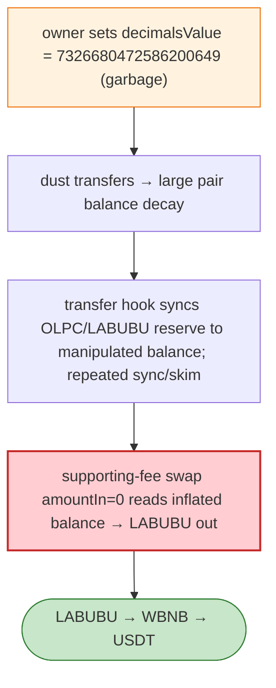

# OLPC Exploit — Owner-Set `decimalsValue` → Pair Balance Decay + `amountIn=0` Swap Drain

> **Reproduction:** the PoC compiles & runs in an isolated Foundry project at
> [this project folder](.). Full verbose trace: [output.txt](output.txt).
> Verified vulnerable source: [OLPCToken](sources/OLPCToken_58815C),
> [LABUBUToken](sources/LABUBUToken_3494df), [PancakePair](sources/PancakePair_edB7DC).

---

## Key info

| | |
|---|---|
| **Loss** | LABUBU/USDT drained (BSC) |
| **Vulnerable contract** | OLPC token `0x58815CDF…`; OLPC/LABUBU Pancake pair `0xedB7DC…` |
| **Setup tx** | `0xa413fdf6…` (owner set `decimalsValue = 7326680472586200649` at BSC block 96,479,712) |
| **Chain / block / date** | BSC / Jun 2026 |
| **Bug class** | Mis-configuration + transfer-hook price state — the OLPC owner set `decimalsValue` to an absurd value, making tiny dust transfers force large pair balance decay; the transfer hook updates price state from Pancake pairs and lets the OLPC/LABUBU reserve be synced to a manipulated balance. |

---

## TL;DR

Per the embedded root cause: the OLPC owner set `decimalsValue` to **7326680472586200649** (BSC block
96,479,712), making **tiny dust transfers force large pair balance decay**. The OLPC transfer hook
updates price state from Pancake pairs and allows the OLPC/LABUBU pair reserve to be synchronised to a
manipulated token balance. After repeated **sync/skim cycles**, a Pancake supporting-fee swap with
**`amountIn = 0`** reads the **inflated OLPC pair balance as input** and releases LABUBU, which is
routed through WBNB into USDT.

---

## Root cause

A **privileged mis-configuration** (`decimalsValue` set to a garbage value) combined with a transfer
hook that re-derives balances/price from Pancake pairs and an `amountIn=0` supporting-fee swap that
reads an inflated pair balance as input.

---

## Diagrams



---

## Remediation

1. Validate `decimalsValue` on setter (≤ 18); gate setter behind timelock + multisig.
2. Transfer hook must not let pair reserves be synced to a manipulated balance; bound price moves.
3. Reject `amountIn == 0` swaps; fee math must use a real input.

---

## How to reproduce

```bash
_shared/run_poc.sh 2026-06-OLPC_exp -vvvvv
```

- RPC: BSC archive. Result: `[PASS]` — LABUBU drained via decimals mis-config + amountIn=0 swap.

---

*Reference: OLPC decimals-misconfig + amountIn=0 supporting-fee swap drain, BSC, Jun 2026.*
