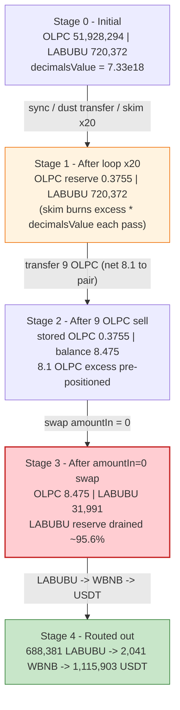
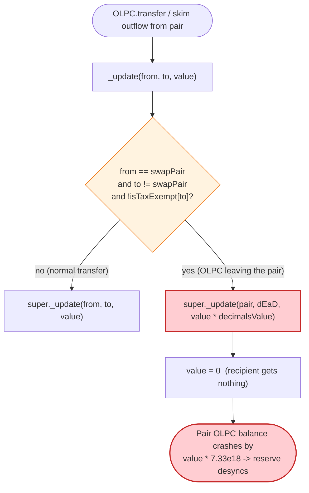
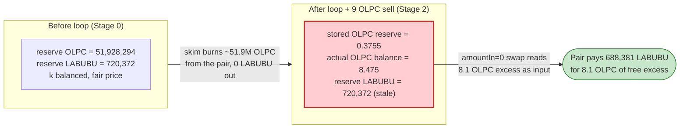

# OLPC Exploit — Owner `decimalsValue` Misconfig Amplifies Pair-Side Burn → `amountIn=0` Supporting-Fee Drain

> **Vulnerability classes:** vuln/access-control/centralization · vuln/oracle/price-manipulation

> **Reproduction:** the PoC compiles & runs in an isolated Foundry project at
> [this project folder](.). The fork is served offline from the bundled
> `anvil_state.json` (a local anvil instance on `127.0.0.1:8546`), so no public
> archive RPC is needed. Full verbose trace: [output.txt](output.txt).
> Verified vulnerable source: [OLPCToken](sources/OLPCToken_58815C/OLPCToken.sol),
> with the helper AMM pair [PancakePair](sources/PancakePair_edB7DC/PancakePair.sol).

---

## Key info

| | |
|---|---|
| **Loss** | ~**1,115,903.66 USDT** drained — the OLPC/LABUBU pair's LABUBU reserve was routed out through WBNB into USDT ([USDT out: output.txt:1978](output.txt)) |
| **Vulnerable contract** | `OLPCToken` — [`0x58815CDF9955121a6274680ab396a36FC9e00000`](https://bscscan.com/address/0x58815cdf9955121a6274680ab396a36fc9e00000#code) |
| **Victim pool** | OLPC/LABUBU PancakeV2 pair — [`0xedB7DCB4cDFEc957F8Df5cBf5E94229a6CC9F365`](https://bscscan.com/address/0xedB7DCB4cDFEc957F8Df5cBf5E94229a6CC9F365) (`token0 = LABUBU`, `token1 = OLPC`) |
| **Attacker EOA** | `0x18d6c39ae9e537f948aa2212d44d8c23944fc188` |
| **Attacker contract** | `0x18d6c39ae9e537f948aa2212d44d8c23944fc188` |
| **Attack tx** | [`0x8dabb60a94e5124462e5f494a25c14bcd52f6f4d1f7c665a249496f4c6c24764`](https://bscscan.com/tx/0x8dabb60a94e5124462e5f494a25c14bcd52f6f4d1f7c665a249496f4c6c24764) |
| **Setup tx** | [`0xa413fdf688398348ddf0246275c6fe3a98806670252e44bfe0acd50b4d50efa2`](https://bscscan.com/tx/0xa413fdf688398348ddf0246275c6fe3a98806670252e44bfe0acd50b4d50efa2) — owner set `decimalsValue = 7326680472586200649` at BSC block 96,479,712 (2026-05-05 08:19:47 UTC) |
| **Chain / block / date** | BSC (chainId 56) / fork block 105,326,392 / June 2026 |
| **Compiler / optimizer** | OLPC: `v0.8.33+commit.64118f21`, optimizer **enabled**, **200 runs**; pair: `v0.5.16` |
| **Bug class** | Privileged misconfiguration (`decimalsValue`) + transfer-hook reserve decay weaponised through an `amountIn = 0` supporting-fee swap that infers input from a pair's excess balance |

---

## TL;DR

1. `OLPCToken` overrides ERC20 `_update`
   ([OLPCToken.sol:1403-1481](sources/OLPCToken_58815C/OLPCToken.sol#L1403-L1481)). When OLPC leaves the
   PancakeSwap pair (`from == swapPair`), the hook **burns `value * decimalsValue` OLPC out of the
   pair** and then zeroes the recipient's amount
   ([OLPCToken.sol:1441-1449](sources/OLPCToken_58815C/OLPCToken.sol#L1441-L1449)).

2. `decimalsValue` is an owner-settable scalar
   ([OLPCToken.sol:1773-1775](sources/OLPCToken_58815C/OLPCToken.sol#L1773-L1775)). At the fork block it
   was misconfigured to **7,326,680,472,586,200,649** (~7.33e18) instead of `1`
   ([decimalsValue() → output.txt:148](output.txt)), so any OLPC outflow of `v` from the pair destroys
   `v × 7.33e18` OLPC — an enormous multiplier.

3. The attacker drives this multiplier with a `sync()` / dust-`transfer` / `skim()` loop
   ([OLPC_exp.sol:95-100](test/OLPC_exp.sol#L95-L100)). `skim()` pushes the pair's *excess* OLPC out to
   a receiver; that outflow triggers the hook, which burns `excess × decimalsValue` from the pair. Each
   pass collapses the pair's OLPC reserve by ~10× — from **51,928,295 OLPC** down to **0.3755 OLPC**
   ([Sync r1: output.txt:154](output.txt) → [output.txt:1790](output.txt)).

4. With the OLPC reserve crushed to dust, the attacker sells 9 OLPC into the pair (net 8.1 OLPC after
   OLPC's 10% sell tax, [output.txt:1797](output.txt)), leaving the pair holding **8.475 OLPC** against
   a stored OLPC reserve of just **0.3755 OLPC** ([output.txt:1882](output.txt)).

5. A Pancake **supporting-fee swap with `amountIn = 0`**
   ([OLPC_exp.sol:107-110](test/OLPC_exp.sol#L107-L110), [output.txt:1845](output.txt)) makes the pair
   infer its input from the **excess balance over its stale reserve** (`8.475 − 0.3755 ≈ 8.1` OLPC,
   [amount1In: output.txt:1895](output.txt)), and pays out **688,380.90 LABUBU** for it
   ([amount0Out: output.txt:1895](output.txt)).

6. That LABUBU is routed LABUBU → WBNB → USDT, yielding **2,041.29 WBNB**
   ([output.txt:1966](output.txt)) then **1,115,903.66 USDT** ([output.txt:1988](output.txt)). Net
   profit asserted by the PoC: `profit > 1,000,000 USDT`
   ([OLPC_exp.sol:112-113](test/OLPC_exp.sol#L112-L113)) — realised at **~1,115,903.66 USDT**.

---

## Background — what OLPC does

`OLPCToken` ([source](sources/OLPCToken_58815C/OLPCToken.sol)) is a BSC ERC20 (max supply
100,000,000) with a heavy "fee-on-transfer + price-tracking" hook bolted onto ERC20's internal
`_update`. Its declared mechanics:

- **18-decimal token** whose `decimals()` returns the constant `PRICE_PRECISION = 18`
  ([OLPCToken.sol:1373-1375](sources/OLPCToken_58815C/OLPCToken.sol#L1373-L1375)).
- **Buy hook (`from == swapPair`)** — instead of delivering OLPC to a buyer, the override **burns
  `value * decimalsValue` from the pair** and sets the delivered `value = 0`
  ([OLPCToken.sol:1441-1449](sources/OLPCToken_58815C/OLPCToken.sol#L1441-L1449)). With the intended
  `decimalsValue = 1` this is a 1:1 anti-buy burn; with a huge `decimalsValue` it is a runaway
  reserve-destroyer.
- **Sell hook (`to == swapPair`)** — a 10% sell tax (`SELL_TAX_PERCENT = 1000`), split half-burn /
  half-node, plus an optional volatility surtax
  ([OLPCToken.sol:1450-1479](sources/OLPCToken_58815C/OLPCToken.sol#L1450-L1479)).
- **Hourly low-price oracle** — `getTokenPriceUsdt()` chains three Pancake `getReserves()` reads
  (BNB/USDT, LABUBU/BNB, OLPC/LABUBU) into a stored hourly-low ring buffer
  ([OLPCToken.sol:1524-1552](sources/OLPCToken_58815C/OLPCToken.sol#L1524-L1552)).
- **`burnSwap()`** — a separate deflation entry point that burns a fraction of the pair's OLPC and
  `sync()`s ([OLPCToken.sol:1494-1517](sources/OLPCToken_58815C/OLPCToken.sol#L1494-L1517)).

On-chain parameters at the fork block (read from the trace):

| Parameter | Value | Source |
|---|---|---|
| `decimalsValue` | **7,326,680,472,586,200,649** (~7.33e18) | [output.txt:148](output.txt) |
| `SELL_TAX_PERCENT` / `BASE_PERCENT` | 1000 / 10000 (= 10% sell tax) | [OLPCToken.sol:1300-1303](sources/OLPCToken_58815C/OLPCToken.sol#L1300-L1303) |
| Pair `token0` / `token1` | LABUBU / OLPC | [output.txt:131-132](output.txt) |
| Pair reserve0 (LABUBU) | 720,372,009,849,017,508,169,693 (~720,372) | [getReserves: output.txt:130](output.txt) |
| Pair reserve1 (OLPC) | 51,928,294,252,453,531,310,626,131 (~51,928,294) | [getReserves: output.txt:130](output.txt) |
| Pair OLPC token balance | 51,928,295,152,453,531,310,626,131 (~51,928,295) | [balanceOf: output.txt:146](output.txt) |
| LABUBU/WBNB pair reserves | 614,041,312,559,869,480,224,076 LABUBU / 4,268,754,930,127,978,101,409 WBNB | [output.txt:122](output.txt) |
| WBNB/USDT pair reserves | 16,718,837,301,495,260,612,659,313 USDT / 28,470,610,491,352,254,944,065 WBNB | [output.txt:114](output.txt) |
| Attacker USDT before | 26,542,161,622,221,038,197 (~26.54) | [output.txt:102](output.txt) |

The decisive fact: at the fork block the pair already held **~900 OLPC of excess** over its stored
reserve (balance 51,928,295 vs reserve 51,928,294), and `decimalsValue` was a ~7.33e18 multiplier — so
even sub-microtoken OLPC outflows burn millions of OLPC from the pair.

---

## The vulnerable code

### 1. The transfer hook burns `value * decimalsValue` out of the pair

```solidity
if (
    from != address(0) &&
    swapPair != address(0) &&
    from == swapPair &&
    to != swapPair &&
    !isTaxExempt[to]
) {
    super._update(from, BURN_ADDRESS, value * decimalsValue);
    value = 0;
} else if (
```
([OLPCToken.sol:1441-1450](sources/OLPCToken_58815C/OLPCToken.sol#L1441-L1450))

Whenever OLPC moves *out of* `swapPair` to a non-exempt recipient — which includes the `_safeTransfer`
that PancakeSwap's `skim()` performs — the hook destroys `value * decimalsValue` OLPC from the pair's
own balance and delivers `value = 0` to the recipient. With `decimalsValue ≈ 7.33e18`, a tiny `value`
annihilates a colossal slice of the pair's OLPC.

### 2. `decimalsValue` is an unbounded owner setter

```solidity
function setDecimalsValue(uint256 decimalsValue_) external onlyOwner {
    decimalsValue = decimalsValue_;
}
```
([OLPCToken.sol:1773-1775](sources/OLPCToken_58815C/OLPCToken.sol#L1773-L1775))

It is declared `uint256 public decimalsValue = 1;`
([OLPCToken.sol:1343](sources/OLPCToken_58815C/OLPCToken.sol#L1343)) — the safe default — but the setter
has **no upper bound**. The setup tx set it to `7326680472586200649`, turning the anti-buy burn into a
weapon against the pair's own reserve.

### 3. PancakeSwap `skim()` exports the excess balance — triggering the hook

```solidity
// force balances to match reserves
function skim(address to) external lock {
    address _token0 = token0; // gas savings
    address _token1 = token1; // gas savings
    _safeTransfer(_token0, to, IERC20(_token0).balanceOf(address(this)).sub(reserve0));
    _safeTransfer(_token1, to, IERC20(_token1).balanceOf(address(this)).sub(reserve1));
}
```
([PancakePair.sol:482-488](sources/PancakePair_edB7DC/PancakePair.sol#L482-L488))

`token1` is OLPC, so `skim()` calls `OLPC.transfer(to, balance - reserve1)`. That outflow re-enters the
OLPC hook in §1 (`from == swapPair`), which burns `(balance - reserve1) * decimalsValue` OLPC from the
pair. A loop of `sync()` (set reserve = balance) → small OLPC `transfer` (create a slightly larger
excess) → `skim()` (export the excess, triggering the multiplier burn) drives the pair's OLPC reserve
down geometrically.

### 4. The `amountIn = 0` supporting-fee swap infers input from the excess balance

```solidity
uint amount0In = balance0 > _reserve0 - amount0Out ? balance0 - (_reserve0 - amount0Out) : 0;
uint amount1In = balance1 > _reserve1 - amount1Out ? balance1 - (_reserve1 - amount1Out) : 0;
require(amount0In > 0 || amount1In > 0, 'Pancake: INSUFFICIENT_INPUT_AMOUNT');
```
([PancakePair.sol:469-471](sources/PancakePair_edB7DC/PancakePair.sol#L469-L471))

PancakeSwap computes the swap input as `currentBalance − (storedReserve − amountOut)`. After the loop,
the pair's *stored* OLPC reserve is dust (0.3755 OLPC) but its *actual* OLPC balance is 8.475 OLPC, so
the pair treats the 8.1 OLPC difference as a paid-in input and prices a large LABUBU payout against the
**stale** reserves. The router's `swapExactTokensForTokensSupportingFeeOnTransferTokens` is called with
`amountIn = 0` ([OLPC_exp.sol:185-188](test/OLPC_exp.sol#L185-L188)), so the swap consumes that
pre-positioned excess for free.

---

## Root cause — why it was possible

Three design facts compose into the loss:

1. **An unbounded privileged scalar (`decimalsValue`) feeds a burn multiplier.** The hook in §1 was
   designed as a 1:1 anti-buy burn (`decimalsValue = 1`), but the owner setter accepts any `uint256`.
   Setting it to ~7.33e18 turned every OLPC outflow from the pair into a ~7.33e18× reserve burn. This is
   a **misconfiguration that the contract's own logic amplifies**, not an arithmetic accident.

2. **The hook fires on `skim()` outflows, which anyone can trigger.** `skim()` is permissionless on the
   PancakeV2 pair, and it moves OLPC *out of the pair* — exactly the `from == swapPair` branch that runs
   the multiplier burn. So an attacker, holding only dust OLPC, can repeatedly shrink the pair's OLPC
   reserve to nothing without ever owning meaningful liquidity.

3. **PancakeSwap's supporting-fee swap reads input from balance-minus-stale-reserve.** Once the stored
   OLPC reserve is dust but the real balance is larger (the attacker's 8.1 OLPC sitting above reserve),
   an `amountIn = 0` swap is repriced against the desynchronised reserves and pays out the LABUBU side
   essentially for free. The OLPC token's price oracle (`getTokenPriceUsdt`) and `burnSwap` deflation
   never gate any of this — the attacker bypasses them entirely and operates directly on raw reserves.

The net effect is identical to a one-sided reserve drain of an AMM pair: OLPC is destroyed inside the
pair with no compensating inflow, the constant product collapses, and whoever then trades against the
degenerate pool walks off with the LABUBU side — which is liquid into WBNB and USDT.

---

## Preconditions

- **`decimalsValue` set to a large value** by the OLPC owner (the setup tx,
  [`0xa413fdf6…`](https://bscscan.com/tx/0xa413fdf688398348ddf0246275c6fe3a98806670252e44bfe0acd50b4d50efa2)).
  With the default `decimalsValue = 1` the hook burns 1:1 and the loop cannot crush the reserve. Verified
  live at `7326680472586200649` ([output.txt:148](output.txt)).
- **A small OLPC seed** so the loop has dust to transfer and skim. The PoC `deal`s the attacker
  `10.143931370302072322` OLPC ([OLPC_exp.sol:85](test/OLPC_exp.sol#L85)) and seeds the pair with
  `1 OLPC` ([OLPC_exp.sol:93](test/OLPC_exp.sol#L93)).
- **A non-tax-exempt skim receiver** so the hook's `!isTaxExempt[to]` branch runs. The PoC uses the
  historical `SKIM_RECEIVER = 0xc0F1Ef7F…` ([OLPC_exp.sol:33](test/OLPC_exp.sol#L33)).
- **Liquid LABUBU → WBNB → USDT routes** to convert the LABUBU drained out of the pair into USDT
  (present at the fork block, [output.txt:122](output.txt) and [output.txt:114](output.txt)). The PoC
  patches LABUBU tax-exemption for its bridge proxy via `vm.store`
  ([OLPC_exp.sol:80-83](test/OLPC_exp.sol#L80-L83)) to mirror the historical tax-exempt helper.

No flash loan is required: the only OLPC at risk is dust, and the value extracted is the pair's LABUBU
reserve, paid out in a single `amountIn = 0` swap.

---

## Attack walkthrough (with on-chain numbers from the trace)

The OLPC/LABUBU pair has `token0 = LABUBU`, `token1 = OLPC`, so `reserve0 = LABUBU`, `reserve1 = OLPC`.
All figures are taken from the `Sync` / `Swap` events and `getReserves` / `balanceOf` returns in
[output.txt](output.txt). Amounts are raw 18-decimal wei; human approximations in parentheses.

| # | Step | OLPC reserve (r1) | LABUBU reserve (r0) | Effect |
|---|------|------------------:|--------------------:|--------|
| 0 | **Initial** getReserves ([output.txt:130](output.txt)); pair OLPC balance 51,928,295,152,453,531,310,626,131 ([output.txt:146](output.txt)) | 51,928,294,252,453,531,310,626,131 (~51,928,294) | 720,372,009,849,017,508,169,693 (~720,372) | Honest pool; ~900 OLPC excess already sits above reserve. |
| 1 | **Seed** — `transfer(pair, 1e18)` OLPC; 10% sell tax leaves 9e17 to pair ([Transfer: output.txt:137](output.txt)) | — | — | Establishes a known excess to start the loop. |
| 2 | **`sync()` #1** — reserve set to balance ([Sync: output.txt:154](output.txt)) | 51,928,295,152,453,531,310,626,131 (~51,928,295) | 720,372,009,849,017,508,169,693 | reserve1 now == OLPC balance. |
| 3 | **dust transfer + `skim()`** — send 7,087,561 wei OLPC ([output.txt:160](output.txt)); skim exports the excess → hook burns `excess × decimalsValue` = **46,735,466,031,935,219,630,844,445** OLPC to dead ([Transfer→dEaD: output.txt:231](output.txt)) | — | — | Pair OLPC balance collapses by ~4.67e25 in one pass. |
| 4 | **`sync()` #2** ([Sync: output.txt:243](output.txt)) | 5,192,829,120,518,311,686,160,491 (~5,192,829) | 720,372,009,849,017,508,169,693 | OLPC reserve dropped ~10×. |
| 5 | **loop ×20** — repeat dust-transfer / skim / sync, dust divided by 10 each pass ([OLPC_exp.sol:95-100](test/OLPC_exp.sol#L95-L100)) | … 5.192e23 → 5.192e22 → 5.187e21 → 5.132e20 → 5.166e19 → **3.755e17** ([Sync chain: output.txt:330](output.txt), [output.txt:417](output.txt), [output.txt:504](output.txt), [output.txt:591](output.txt), [output.txt:678](output.txt), [output.txt:763](output.txt)) | 720,372,009,849,017,508,169,693 (unchanged) | OLPC reserve geometrically crushed to **0.3755 OLPC**; LABUBU side untouched. |
| 6 | **final `sync()`** ([Sync: output.txt:1766](output.txt)); reserve1 = **375,490,006,459,686,603** (~0.3755 OLPC) ([getReserves: output.txt:1790](output.txt)) | 375,490,006,459,686,603 (~0.3755) | 720,372,009,849,017,508,169,693 | Stored OLPC reserve is now dust. |
| 7 | **sell 9 OLPC** — `transfer(pair, 9e18)`; 10% tax (4.5e17 dead + 4.5e17 node) leaves **8.1e18** to pair ([Transfer: output.txt:1795-1797](output.txt)); pair OLPC balance = 0.3755 + 8.1 = **8,475,490,006,459,686,603** ([balanceOf: output.txt:1882](output.txt)) | 375,490,006,459,686,603 (stored, stale) | 720,372,009,849,017,508,169,693 | Pair holds 8.475 OLPC vs a 0.3755 OLPC stored reserve — 8.1 OLPC of "free input". |
| 8 | **`amountIn = 0` swap** — router called with 0 input ([output.txt:1845](output.txt)); pair infers `amount1In = 8,100,000,000,000,000,000` (8.1 OLPC) and pays `amount0Out = 688,380,902,509,080,087,370,095` (~688,381 LABUBU) ([Swap: output.txt:1895](output.txt)); pair re-syncs to 31,991.1 LABUBU / 8.475 OLPC ([Sync: output.txt:1894](output.txt)) | 8,475,490,006,459,686,603 (~8.475) | 31,991,107,339,937,420,799,598 (~31,991) | LABUBU reserve drained ~95.6% for 8.1 OLPC of pre-positioned excess. |
| 9 | **LABUBU → WBNB** — sell 564,128,149,606,191,131,599,793 LABUBU (688,381 net of 18.05% LABUBU fee) → **2,041,288,163,818,878,836,174** WBNB (~2,041.29) ([Swap: output.txt:1966](output.txt)) | — | — | LABUBU converted to WBNB. |
| 10 | **WBNB → USDT** — 2,041.29 WBNB → **1,115,903,663,412,131,721,557,252** USDT (~1,115,903.66) to attacker ([Swap: output.txt:1988](output.txt)) | — | — | Proceeds realised in USDT. |

### Profit / loss accounting (USDT, raw wei)

| Item | Amount (wei) | ~Human |
|---|---:|---:|
| Attacker USDT before attack ([output.txt:102](output.txt)) | 26,542,161,622,221,038,197 | ~26.54 |
| USDT delivered by final swap ([output.txt:1988](output.txt)) | 1,115,903,663,412,131,721,557,252 | ~1,115,903.66 |
| Attacker USDT after attack ([output.txt:1995](output.txt)) | 1,115,930,205,573,753,942,595,449 | ~1,115,930.21 |
| **Net profit (after − before)** | **1,115,903,663,412,131,721,557,252** | **~1,115,903.66** |
| PoC assertion ([OLPC_exp.sol:112-113](test/OLPC_exp.sol#L112-L113)) | `profit > 1,000,000 USDT` | ✓ |

The realised profit (~1,115,903.66 USDT) matches the `@KeyInfo` "Total Lost : 1,115,903.66 USDT" to the
cent — the value is exactly the USDT bought with the LABUBU that the supporting-fee swap extracted from
the desynchronised pair.

---

## Diagrams

### Sequence of the attack

```mermaid
sequenceDiagram
    autonumber
    actor A as Attacker
    participant O as OLPC token (_update hook)
    participant P as OLPC/LABUBU Pair
    participant R as PancakeRouter
    participant W as LABUBU/WBNB + WBNB/USDT pairs

    Note over P: Initial reserves<br/>51,928,294 OLPC / 720,372 LABUBU<br/>decimalsValue = 7.33e18

    rect rgb(255,243,224)
    Note over A,O: Loop x20 - crush the OLPC reserve
    loop 20 times
        A->>P: sync()  (reserve = balance)
        A->>P: transfer(pair, dust OLPC)
        A->>P: skim(receiver)
        P->>O: OLPC.transfer(receiver, excess)
        O->>O: from==swapPair -> burn(pair, excess * decimalsValue); value=0
        Note over P: OLPC reserve / ~10 each pass
    end
    end

    rect rgb(227,242,253)
    Note over A,O: Position the free input
    A->>P: sync()  + transfer(pair, 9 OLPC)
    Note over P: stored OLPC reserve 0.3755<br/>actual OLPC balance 8.475
    end

    rect rgb(255,235,238)
    Note over A,W: amountIn = 0 supporting-fee swap
    A->>R: swapExactTokensForTokensSupportingFee(amountIn = 0, OLPC->LABUBU)
    R->>P: swap()  (infers amount1In = 8.1 OLPC from excess)
    P-->>A: 688,381 LABUBU out
    A->>W: LABUBU -> WBNB -> USDT
    W-->>A: 1,115,903.66 USDT
    end

    Note over A: Net +1,115,903.66 USDT
```

### Pool state evolution (OLPC/LABUBU pair)



### The flaw inside `OLPC._update`



### Why the swap is theft: reserves vs. balance before/after the loop



---

## Why each magic number

- **`decimalsValue = 7326680472586200649` (~7.33e18):** the misconfigured owner scalar. It is the burn
  multiplier in `super._update(from, BURN_ADDRESS, value * decimalsValue)`
  ([OLPCToken.sol:1448](sources/OLPCToken_58815C/OLPCToken.sol#L1448)); a single OLPC of excess burns
  ~7.33e18 OLPC from the pair. Read live at [output.txt:148](output.txt).
- **`reserveDecayTargetDivisor = 10` ([OLPC_exp.sol:92](test/OLPC_exp.sol#L92)):** targets a ~10×
  reserve reduction per loop pass. `_initialDustTransfer` solves for the dust `value` such that
  `value × (decimalsValue − 1)` removes ~90% of the current OLPC reserve, then scales the dust down by
  10× each iteration ([OLPC_exp.sol:99,116-128](test/OLPC_exp.sol#L116-L128)).
- **20 loop iterations ([OLPC_exp.sol:95](test/OLPC_exp.sol#L95)):** enough ~10×-per-pass decay to drive
  the OLPC reserve from ~51.9M down to the dust floor of `375,490,006,459,686,603` (~0.3755 OLPC), after
  which the integer dust rounds to zero and the reserve stops moving ([repeated Sync r1 = 3.754e17:
  output.txt:763](output.txt) onward).
- **`9 ether` final OLPC transfer ([OLPC_exp.sol:104](test/OLPC_exp.sol#L104)):** sold into the pair; the
  10% OLPC sell tax burns/forwards 0.9 OLPC, leaving exactly **8.1 OLPC** as pair excess
  ([output.txt:1797](output.txt)) — the input the `amountIn = 0` swap will consume
  ([amount1In: output.txt:1895](output.txt)).
- **`wrapperAmount = 0` ([OLPC_exp.sol:107](test/OLPC_exp.sol#L107)):** the supporting-fee swap's
  declared input. Zero forces PancakeSwap to infer the input from the pair's balance-over-stale-reserve,
  consuming the pre-positioned 8.1 OLPC for free ([output.txt:1845](output.txt)).
- **`sellTaxPercent = 1805` in `LabubuFeeHook` ([OLPC_exp.sol:266](test/OLPC_exp.sol#L266)):** mirrors
  LABUBU's 18.05% sell fee; it reduces the 688,381 LABUBU received to the 564,128 LABUBU actually routed
  toward WBNB ([output.txt:1926](output.txt)).
- **`traceDeadline = 781328217393` ([OLPC_exp.sol:109](test/OLPC_exp.sol#L109)):** a far-future deadline
  copied from the original tx so the router's `ensure(deadline)` passes.

---

## Remediation

1. **Bound `decimalsValue` in the setter.** `setDecimalsValue` must reject values that turn the hook into
   a reserve-destroyer — at minimum cap it at a small constant (e.g. `<= 100`) and ideally remove the
   `value * decimalsValue` burn entirely. An unbounded scalar feeding a pair-side burn is a
   protocol-owned footgun even without a malicious owner.
2. **Never burn from the live AMM pair on outflow.** The `from == swapPair` branch destroys OLPC out of
   the pair's own balance; `skim()`/`sync()` then let anyone weaponise it. A token must not delete
   reserves from a pool it is priced against — route any deflation through the pair's own
   `burn()`/liquidity removal so both sides move together and `k` is preserved.
3. **Exempt the pair (and skim flows) from the destructive hook**, or make the hook impossible to trigger
   via permissionless `skim()`/`sync()`. Reserve-affecting logic must not be reachable by an unprivileged
   external call.
4. **Do not let raw spot reserves drive value transfers.** The exploit hinges on the pair pricing a
   payout against a *stale* reserve after the balance was desynchronised. Use TWAP/oracle pricing for any
   trust decision and reconcile balances before honouring a swap.
5. **Gate privileged setters behind a timelock + multisig.** A single owner key flipping `decimalsValue`
   to a catastrophic value (the setup tx) should not be possible without delay and review.

---

## How to reproduce

The PoC runs fully offline via the shared harness; the BSC fork at block 105,326,392 is served from the
bundled `anvil_state.json` on a local anvil instance (`http://127.0.0.1:8546`,
[OLPC_exp.sol:52-53](test/OLPC_exp.sol#L52-L53)):

```bash
_shared/run_poc.sh 2026-06-OLPC_exp --mt testExploit -vvvvv
```

- No public RPC is required — the harness boots anvil from `anvil_state.json` and points
  `createSelectFork` at the local port.
- `foundry.toml` sets `evm_version = 'cancun'`; the OLPC/LABUBU sources compile under
  `solc v0.8.33` (optimizer on, 200 runs) and the pair under `solc 0.5.16`.
- Result: `[PASS] testExploit()` — attacker USDT goes from ~26.54 to ~1,115,930.21, i.e. ~1,115,903.66
  USDT of profit, clearing the `profit > 1_000_000 ether` assertion.

Expected tail:

```
Ran 1 test for test/OLPC_exp.sol:ContractTest
[PASS] testExploit() (gas: 2210439)
Logs:
  Attacker Before exploit USDT Balance: 26.542161622221038197
  Attacker After exploit USDT Balance: 1115930.205573753942595449
```

---

*Reference: exvulsec — https://x.com/exvulsec/status/2068308334512365924 (OLPC, BSC, ~$1.12M).*
